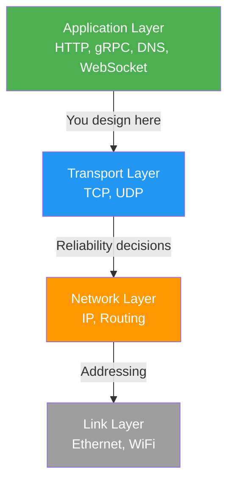
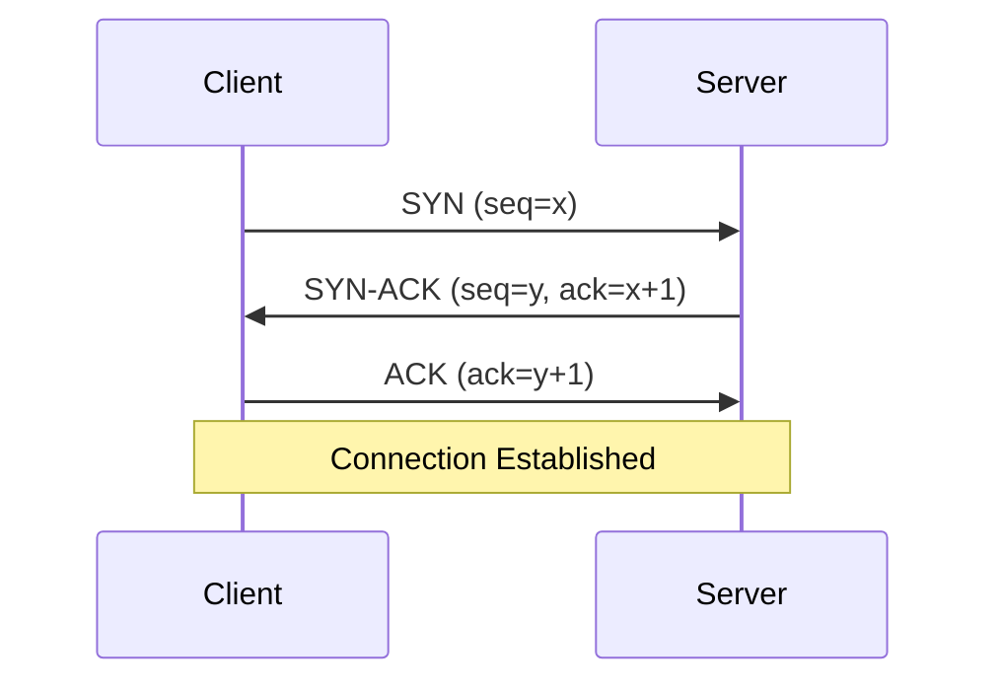
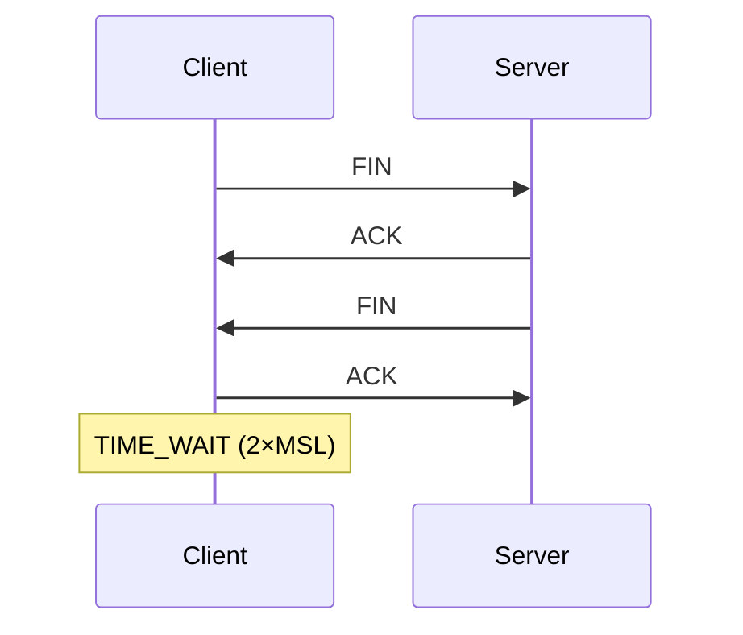
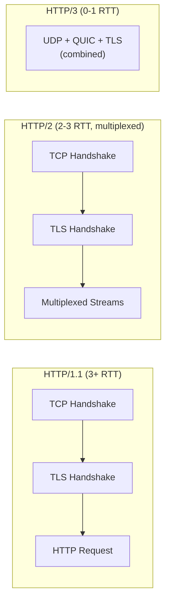
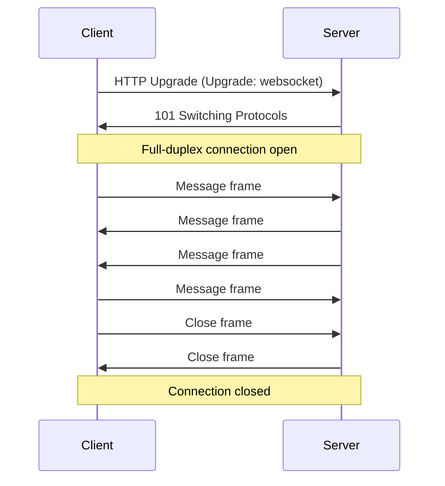
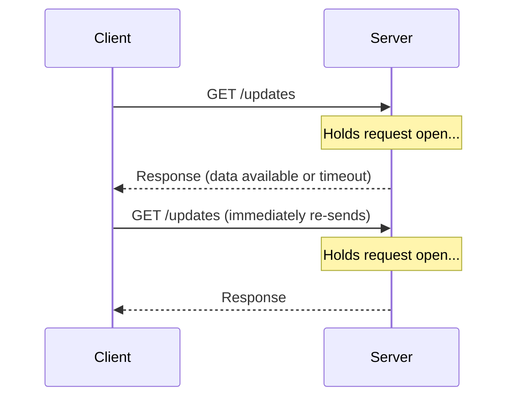
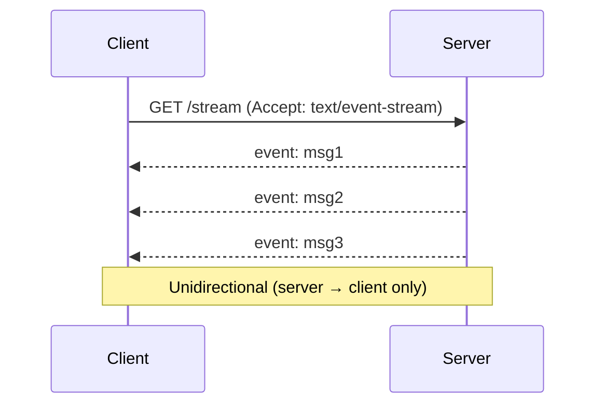
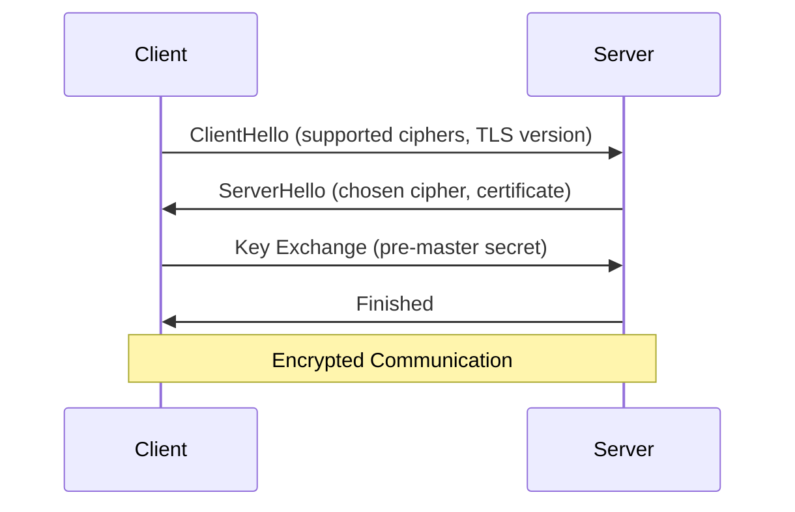

# Networking Basics

Essential networking concepts for system design interviews. Focus on what matters for designing distributed systems — not memorizing all 7 OSI layers.

---

## OSI Model vs TCP/IP Model

The OSI model has 7 layers, but for system design interviews, you only need **4 layers** (TCP/IP model):

**Interview tip:** If asked about OSI, map it to TCP/IP and explain you focus on Application and Transport layers for system design.

---

## TCP vs UDP

| Feature | TCP | UDP |
|---------|-----|-----|
| Connection | Connection-oriented (3-way handshake) | Connectionless |
| Reliability | Guaranteed delivery, ordering, retransmission | Best-effort, no guarantees |
| Flow control | Yes (sliding window) | No |
| Overhead | Higher (20-byte header + state) | Lower (8-byte header) |
| Use cases | HTTP, databases, file transfer | Video streaming, DNS, gaming, VoIP |

### TCP 3-Way Handshake

### TCP Connection Teardown (4-Way)

**Why it matters for system design:**
- **Connection pooling** reduces handshake overhead (e.g., database connections, HTTP keep-alive)
- **TIME_WAIT** can exhaust ports on high-traffic servers → use connection pooling
- **Head-of-line blocking** in TCP (one dropped packet blocks all subsequent) → motivation for QUIC/HTTP3

---

## HTTP/1.1 vs HTTP/2 vs HTTP/3

### HTTP/1.1
- One request per TCP connection (with keep-alive, connections reused sequentially)
- **Head-of-line (HOL) blocking** — must wait for response before sending next request
- Workaround: browsers open 6-8 parallel TCP connections per domain

### HTTP/2
- **Multiplexing** — multiple concurrent streams over a single TCP connection
- **Header compression** (HPACK) — reduces overhead for repeated headers
- **Server push** — server can proactively send resources
- **Binary framing** — more efficient than text-based HTTP/1.1
- Still suffers from **TCP-level HOL blocking** — one lost packet blocks all streams

### HTTP/3 (QUIC)
- Runs over **UDP** instead of TCP
- Built-in **TLS 1.3** — 0-RTT or 1-RTT connection setup (vs 3-RTT for TCP+TLS)
- **No HOL blocking** — stream-level independence (lost packet only blocks its stream)
- **Connection migration** — survives network changes (WiFi → cellular) via connection IDs

**When to mention in interviews:**
- Designing a CDN → HTTP/3 for faster connection setup
- Mobile clients → HTTP/3 for connection migration
- Microservices → HTTP/2 for multiplexed inter-service calls

---

## WebSocket

Full-duplex, persistent communication channel over a single TCP connection.

### How It Works

### Use Cases
- **Real-time chat** — instant message delivery
- **Live dashboards** — stock tickers, monitoring
- **Collaborative editing** — Google Docs, Figma
- **Gaming** — low-latency state sync
- **Notifications** — push to connected clients

### Scaling WebSockets
- WebSocket connections are **stateful** → harder to load balance
- Solutions:
  - **Sticky sessions** — route same client to same server
  - **Pub/sub backbone** (Redis Pub/Sub, Kafka) — servers subscribe to relevant channels
  - **Connection gateways** — dedicated WebSocket servers separate from API servers

---

## gRPC

RPC framework by Google using **Protocol Buffers** (protobuf) for serialization and **HTTP/2** for transport.

### Key Features
- **Strongly typed contracts** — `.proto` files define services and messages
- **Binary serialization** — 3-10x smaller and faster than JSON
- **4 streaming modes:**
  - Unary (request-response)
  - Server streaming (server sends stream of responses)
  - Client streaming (client sends stream of requests)
  - Bidirectional streaming (both stream simultaneously)
- **Code generation** — auto-generate client/server stubs in any language

### gRPC vs REST

| Feature | REST (HTTP/JSON) | gRPC (HTTP2/Protobuf) |
|---------|-------------------|----------------------|
| Format | Text (JSON) | Binary (protobuf) |
| Contract | Loose (OpenAPI optional) | Strict (.proto files) |
| Streaming | Limited (SSE, WebSocket) | Native bidirectional |
| Browser support | Universal | Limited (needs grpc-web proxy) |
| Performance | Slower (text parsing) | Faster (binary, multiplexed) |

**When to use:**
- **REST** — public APIs, browser clients, simple CRUD
- **gRPC** — internal microservices, high-throughput service-to-service, streaming

---

## Real-Time Communication Comparison

### Long Polling

- Simple to implement, works everywhere
- Higher latency, more HTTP overhead
- **Use case:** Simple notifications, fallback when WebSocket unavailable

### Server-Sent Events (SSE)

- **Unidirectional** — server pushes to client only
- Built-in reconnection and event IDs
- Uses standard HTTP (works with proxies, load balancers)
- **Use case:** Live feeds, notifications, stock prices

### Comparison Table

| Feature | Long Polling | SSE | WebSocket |
|---------|-------------|-----|-----------|
| Direction | Client-initiated | Server → Client | Bidirectional |
| Protocol | HTTP | HTTP | WS (over TCP) |
| Overhead | High (new connection per response) | Low | Very low |
| Browser support | Universal | Good (no IE) | Universal |
| Scalability | Poor | Good | Moderate (stateful) |
| Best for | Simple fallback | Live feeds | Chat, gaming, collab |

---

## TLS/SSL Handshake

Used to establish encrypted connections (HTTPS = HTTP + TLS).

### TLS 1.2 Handshake (2 round trips)

### TLS 1.3 (1 round trip)
- Client sends key share in first message → connection established in **1 RTT**
- **0-RTT resumption** — returning clients can send data immediately (with replay protection caveats)
- Removed insecure cipher suites, only forward-secret key exchanges

**Why it matters:** Every new HTTPS connection costs 1-2 RTTs for TLS → use **connection pooling**, **HTTP/2 multiplexing**, or **HTTP/3 (0-RTT)** to minimize impact.

---

## Key Takeaways for Interviews

| Decision | When to Choose |
|----------|---------------|
| TCP | Need reliability — HTTP APIs, databases, file transfer |
| UDP | Need speed — video, gaming, DNS, real-time metrics |
| HTTP/2 | Microservice-to-microservice, multiplexed APIs |
| HTTP/3 | Mobile clients, CDN edge, latency-sensitive |
| WebSocket | Bidirectional real-time — chat, collab editing, gaming |
| SSE | Unidirectional server push — notifications, live feeds |
| gRPC | Internal services, high-throughput, streaming |
| Long polling | Simple fallback, legacy browser support |

---

## Common Interview Questions

1. **"How does TCP ensure reliable delivery?"** → Sequence numbers, ACKs, retransmission, flow control (sliding window), congestion control
2. **"Why would you choose WebSocket over long polling?"** → Lower latency, bidirectional, less overhead (no repeated HTTP headers)
3. **"When would you use gRPC vs REST?"** → gRPC for internal services (faster, typed), REST for public/browser APIs
4. **"What's the difference between HTTP/2 and HTTP/3?"** → HTTP/3 uses QUIC (UDP), eliminates TCP HOL blocking, supports connection migration
5. **"How do you scale WebSocket connections?"** → Sticky sessions + pub/sub backbone (Redis) + dedicated gateway servers
