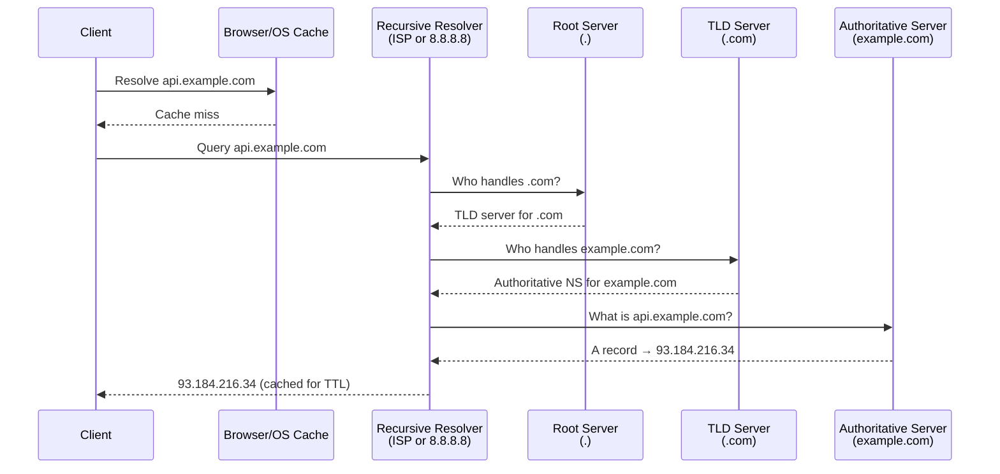
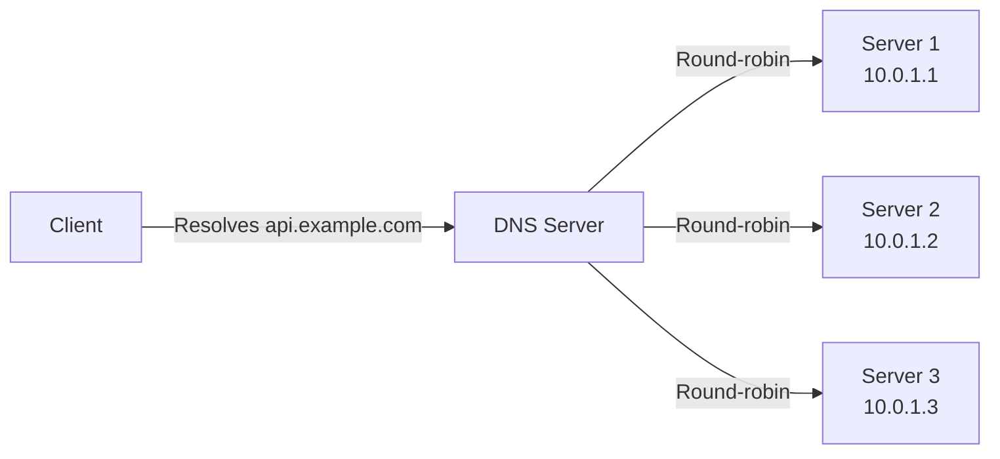
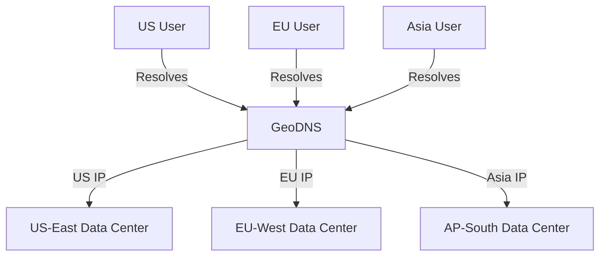

# DNS & Domain Resolution

How domain names get resolved to IP addresses — a fundamental building block of every internet system.

---

## What is DNS?

DNS (Domain Name System) is a distributed, hierarchical naming system that translates human-readable domain names (`api.example.com`) into IP addresses (`93.184.216.34`).

Think of it as the **phone book of the internet**.

---

## DNS Resolution Flow

**Key insight:** This full lookup happens rarely — aggressive caching at every level means most queries resolve from cache.

---

## DNS Record Types

| Record | Purpose | Example |
|--------|---------|---------|
| **A** | Domain → IPv4 address | `example.com → 93.184.216.34` |
| **AAAA** | Domain → IPv6 address | `example.com → 2606:2800:220:1::` |
| **CNAME** | Alias to another domain | `www.example.com → example.com` |
| **NS** | Authoritative nameserver for domain | `example.com → ns1.dnsprovider.com` |
| **MX** | Mail server for domain | `example.com → mail.example.com` |
| **TXT** | Arbitrary text (SPF, DKIM, verification) | `v=spf1 include:_spf.google.com` |
| **SRV** | Service discovery (host + port) | `_http._tcp.example.com → 80 web1.example.com` |
| **SOA** | Zone metadata (primary NS, TTL, serial) | Zone authority information |

---

## TTL (Time to Live)

TTL controls how long DNS records are cached at each level.

| TTL Value | Typical Use |
|-----------|------------|
| **60s** | During migrations or failovers (fast propagation) |
| **300s (5 min)** | Active services with occasional changes |
| **3600s (1 hour)** | Stable services |
| **86400s (1 day)** | Rarely changing records |

**Interview tip:** Before a DNS migration, **lower TTL well in advance** (e.g., 24 hours before) so caches clear quickly. After migration completes, raise TTL back.

---

## DNS in System Design

### Load Balancing via DNS

- **DNS round-robin** — return multiple A records, client picks first
- Cheap but limited: no health checks, sticky sessions, or weighted routing in basic DNS
- **Weighted routing** — Route 53, Cloudflare can return records based on weight, geolocation, latency

### GeoDNS (Latency-Based Routing)

Used by CDNs (Cloudflare, CloudFront) and global services to route users to the nearest data center.

### Service Discovery via DNS
- Internal service discovery: `user-service.internal.example.com`
- Kubernetes uses DNS for pod/service discovery (`my-service.my-namespace.svc.cluster.local`)
- Consul, CoreDNS provide DNS-based service registries

---

## DNS Failure & Reliability

| Failure Mode | Impact | Mitigation |
|-------------|--------|------------|
| DNS server down | All resolution fails | Use multiple NS records, anycast DNS |
| DNS cache poisoning | Clients directed to malicious IPs | DNSSEC (cryptographic signing) |
| DNS propagation delay | Stale records served | Lower TTL before changes |
| DDoS on DNS | Service unreachable | Use managed DNS (Route 53, Cloudflare), anycast |

---

## Common Interview Questions

1. **"What happens when you type a URL in the browser?"** → DNS resolution → TCP handshake → TLS → HTTP request → server response → render
2. **"How would you design a global service?"** → GeoDNS to route to nearest DC, with failover records
3. **"How does DNS load balancing differ from L4/L7 load balancers?"** → DNS is coarse-grained (no health checks in basic DNS), operates at resolution time, cached by clients. L4/L7 LBs provide real-time health checking, sticky sessions, weighted routing.
4. **"How do you handle DNS failover?"** → Short TTL + health-checked DNS (Route 53 failover) + multiple NS records
