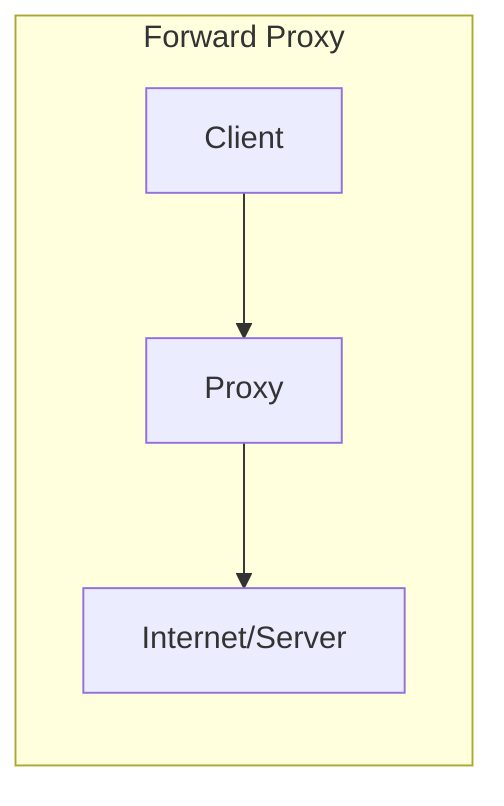
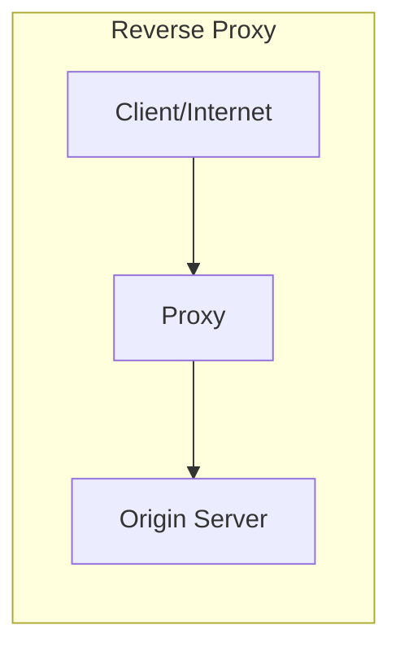
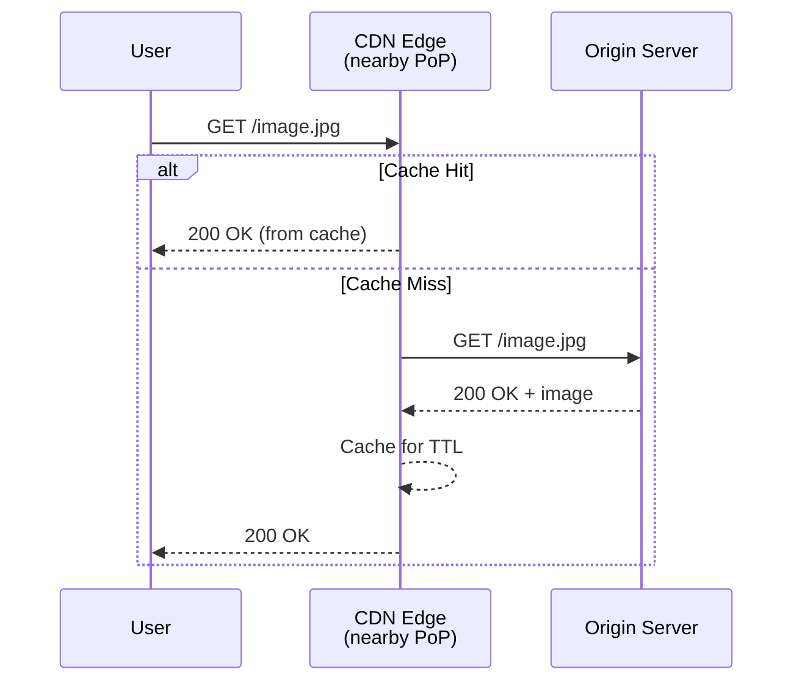
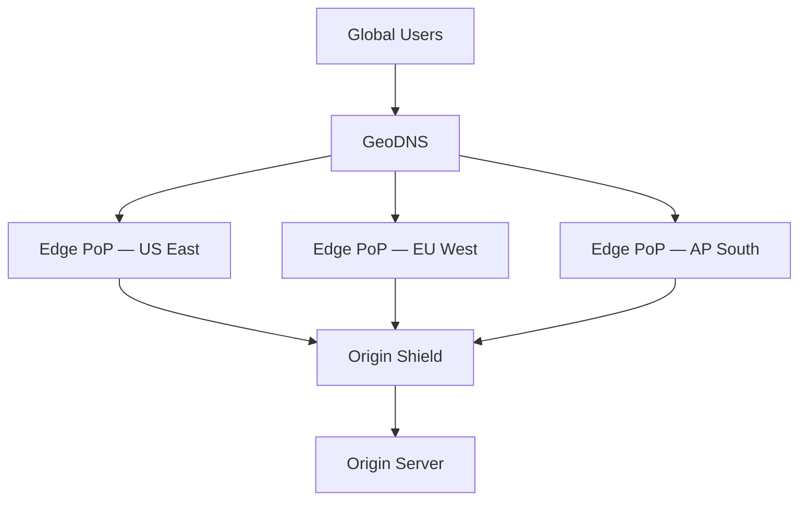

# Proxies & CDNs

How requests are intercepted, cached, and routed between clients and servers.

---

## Forward Proxy vs Reverse Proxy





| Feature | Forward Proxy | Reverse Proxy |
|---------|--------------|---------------|
| **Who uses it** | Clients (outbound) | Servers (inbound) |
| **Purpose** | Privacy, access control, caching | Load balancing, SSL termination, caching |
| **Client knows** | Proxy exists (configured) | Proxy is transparent |
| **Examples** | Squid, corporate proxies, VPN | Nginx, HAProxy, Envoy, Cloudflare |

---

## Reverse Proxy — Deep Dive

A reverse proxy sits in front of your servers and handles requests on their behalf.

### What It Does
- **Load balancing** — distribute requests across backend servers
- **SSL/TLS termination** — handle encryption at the proxy, send plain HTTP to backends
- **Compression** — gzip/brotli responses before sending to client
- **Caching** — serve cached responses without hitting origin
- **Rate limiting** — throttle abusive clients
- **Request routing** — route `/api/*` to API servers, `/static/*` to CDN
- **Security** — hide backend topology, DDoS protection, WAF

### Common Reverse Proxies

| Proxy | Strengths |
|-------|-----------|
| **Nginx** | High-performance, static file serving, widely used |
| **HAProxy** | Advanced L4/L7 load balancing, TCP proxying |
| **Envoy** | Service mesh sidecar, gRPC support, observability |
| **Traefik** | Auto-discovery (Docker, K8s), Let's Encrypt integration |
| **Cloudflare/AWS ALB** | Managed, DDoS protection, global edge |

---

## CDN (Content Delivery Network)

A CDN is a geographically distributed network of edge servers that cache and serve content close to users.

### How CDN Works



### What CDNs Cache

| Content Type | Cacheability | TTL |
|-------------|-------------|-----|
| Static assets (JS, CSS, images) | ✅ Always | Hours to days |
| API responses (GET) | ⚠️ Depends on headers | Seconds to minutes |
| Personalized content | ❌ Usually not | N/A |
| Video/streaming | ✅ Segments cached | Minutes to hours |

### CDN Strategies

| Strategy | How It Works | Best For |
|----------|-------------|----------|
| **Pull (Lazy)** | CDN fetches from origin on cache miss | Most use cases — simple setup |
| **Push (Eager)** | You upload content to CDN proactively | Large files, predictable content |
| **Origin Shield** | Add intermediate cache layer between edge and origin | Reducing origin load |

### Cache Invalidation
- **TTL-based** — content expires after fixed time
- **Purge API** — explicitly invalidate specific URLs or patterns
- **Cache busting** — version in filename (`app.v3.js`) or query string (`?v=3`)
- **Stale-while-revalidate** — serve stale content while fetching fresh copy in background

---

## CDN Architecture



- **PoP (Point of Presence)** — edge location with cache servers
- **Origin shield** — optional middle tier that reduces origin hits when multiple PoPs miss simultaneously
- Major CDN providers: **Cloudflare**, **CloudFront (AWS)**, **Akamai**, **Fastly**

---

## Cache-Control Headers

```
Cache-Control: public, max-age=3600           # CDN + browser cache for 1 hour
Cache-Control: private, no-cache              # Don't cache on CDN, browser must revalidate
Cache-Control: no-store                       # Never cache anywhere
Cache-Control: s-maxage=600                   # CDN caches 10 min (overrides max-age for shared caches)
Cache-Control: stale-while-revalidate=60      # Serve stale for 60s while fetching fresh
```

**ETag + If-None-Match:** Server returns `ETag: "abc123"`, client sends `If-None-Match: "abc123"` → server returns `304 Not Modified` if unchanged (no body, saves bandwidth).

---

## Common Interview Questions

1. **"How would you serve static content globally?"** → CDN with pull strategy, cache-busting via versioned filenames, GeoDNS to nearest edge PoP
2. **"How does a CDN handle cache invalidation?"** → TTL expiry + purge API + stale-while-revalidate + cache busting
3. **"Forward proxy vs reverse proxy?"** → Forward: client-side (outbound), Reverse: server-side (inbound, load balancing, SSL termination)
4. **"When would you NOT use a CDN?"** → Dynamic/personalized content, very low traffic, content that changes every request
5. **"How do you reduce origin server load?"** → CDN + origin shield + aggressive TTL + stale-while-revalidate
