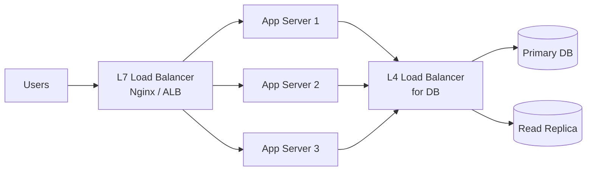
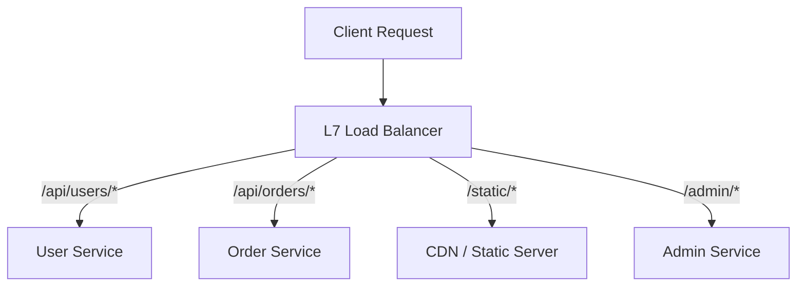
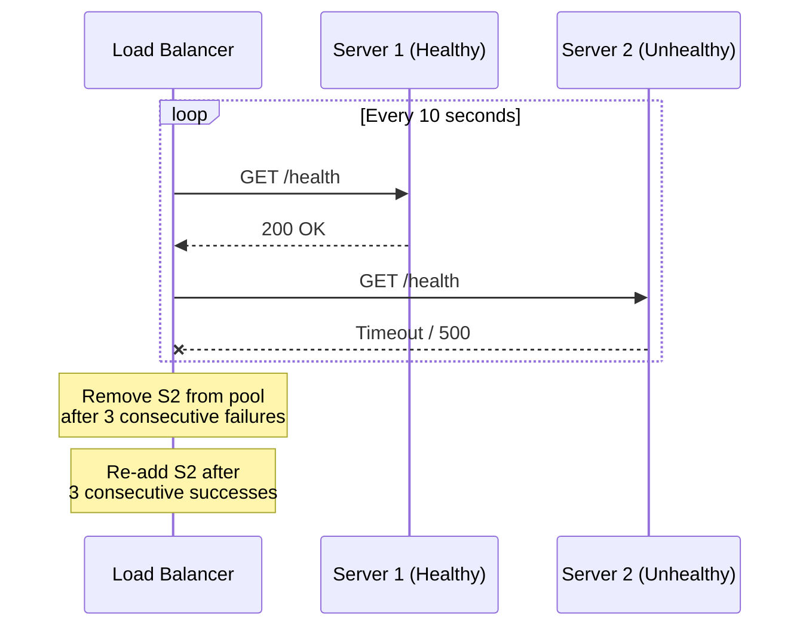
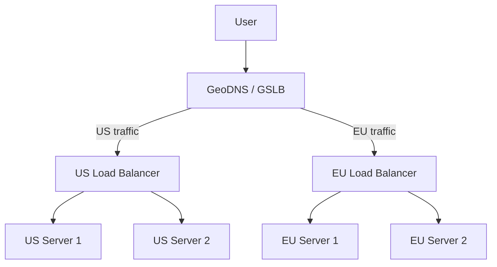

# Load Balancing

Distributing incoming traffic across multiple servers to improve reliability, scalability, and performance.

---

## Why Load Balancing?

- **Scalability** — handle more traffic by adding servers
- **Availability** — if one server dies, traffic routes to healthy ones
- **Performance** — distribute load evenly, prevent hotspots
- **Maintenance** — take servers offline without downtime (rolling deploys)

---

## Load Balancer Placement

Load balancers can sit at multiple levels:
1. **Client → Web/API servers** (most common)
2. **Web servers → Application servers**
3. **Application servers → Database/cache**

---

## L4 vs L7 Load Balancing

| Feature | L4 (Transport) | L7 (Application) |
|---------|----------------|-------------------|
| **Operates at** | TCP/UDP level | HTTP/HTTPS level |
| **Sees** | IP, port, TCP flags | URL, headers, cookies, body |
| **Routing** | Based on IP/port only | Path-based, header-based, cookie-based |
| **Performance** | Faster (no payload inspection) | Slower (must parse HTTP) |
| **SSL termination** | Passthrough (or terminate) | Typically terminates SSL |
| **Use cases** | Database LB, TCP services, gaming | API routing, microservices, A/B testing |
| **Examples** | AWS NLB, HAProxy (TCP mode) | AWS ALB, Nginx, Envoy, Traefik |

### L7 Routing Example

---

## Load Balancing Algorithms

### Static Algorithms (no server state needed)

| Algorithm | How It Works | When to Use |
|-----------|-------------|-------------|
| **Round Robin** | Cycle through servers sequentially | Servers are identical, requests are similar |
| **Weighted Round Robin** | Higher-weight servers get more requests | Servers have different capacities |
| **IP Hash** | Hash client IP → consistent server | Session affinity without cookies |
| **URL Hash** | Hash request URL → consistent server | Cache optimization (same URL → same server) |

### Dynamic Algorithms (use real-time metrics)

| Algorithm | How It Works | When to Use |
|-----------|-------------|-------------|
| **Least Connections** | Route to server with fewest active connections | Requests have variable processing time |
| **Weighted Least Connections** | Least connections with capacity weights | Mixed server sizes |
| **Least Response Time** | Route to server with fastest response + fewest connections | Latency-sensitive services |
| **Random** | Random server selection | Simple, surprisingly effective at scale |

**Interview default:** Start with **round robin** (simple), mention **least connections** for variable workloads, and **consistent hashing** for cache/session affinity.

---

## Health Checks

Load balancers need to detect unhealthy servers and stop routing traffic to them.

| Check Type | How It Works | Detects |
|-----------|-------------|---------|
| **TCP check** | Can it connect to the port? | Server crash, network issues |
| **HTTP check** | Does `GET /health` return 200? | Application-level failures |
| **Deep health check** | Does `/health` verify DB, cache, dependencies? | Dependency failures |

**Best practice:** Use **shallow health checks** at the LB level (fast, no dependency failures cascading), and **deep checks** for monitoring/alerting.

---

## Session Persistence (Sticky Sessions)

When a client must always reach the same server (e.g., in-memory sessions):

| Method | How | Tradeoffs |
|--------|-----|-----------|
| **Cookie-based** | LB sets `SERVERID=server2` cookie | Most common, LB-managed |
| **IP hash** | Hash client IP to server | Breaks behind NAT, proxy |
| **Application-level** | Store session in Redis/DB, no stickiness needed | Best — stateless servers |

**Interview recommendation:** Always advocate for **stateless servers + externalized session** (Redis). Sticky sessions create hotspots and complicate scaling.

---

## Global Load Balancing (GSLB)

- Uses **DNS-based routing** (GeoDNS, latency-based routing)
- Providers: AWS Route 53, Cloudflare, Google Cloud DNS
- Failover: if entire region goes down, DNS routes to next closest region

---

## Common Load Balancer Architectures

### Active-Passive (Failover)
- One LB active, one standby
- Standby monitors via heartbeat, takes over on failure
- **Con:** wasted resources on standby

### Active-Active
- Both LBs handle traffic (e.g., via DNS round-robin or anycast)
- Better resource utilization
- **Con:** more complex, need to handle split-brain

---

## Common Interview Questions

1. **"How do you ensure high availability?"** → Multiple servers behind a load balancer with health checks, auto-scaling, multi-AZ deployment
2. **"L4 vs L7 — which would you use?"** → L7 for HTTP APIs (path-based routing, SSL termination), L4 for raw TCP services (databases, gaming)
3. **"How do you handle session state with load balancers?"** → Stateless servers + Redis for session storage. Avoid sticky sessions if possible.
4. **"What happens when the load balancer itself fails?"** → Active-passive or active-active LB pair. Managed LBs (ALB, NLB) handle this automatically.
5. **"Round robin vs least connections?"** → Round robin when requests are similar. Least connections when request processing time varies significantly.
