# API Design

Designing clean, scalable, and maintainable APIs — a critical skill for system design interviews.

---

## API Paradigms Overview

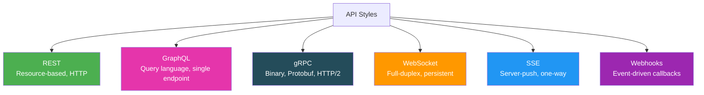

---

## 1. REST (Representational State Transfer)

The most common API style for public and web APIs.

### Core Principles
- **Resource-based URLs** — nouns, not verbs: `/users/123` not `/getUser?id=123`
- **HTTP methods as actions** — GET, POST, PUT, PATCH, DELETE
- **Stateless** — each request contains all info needed (no server-side session)
- **Standard status codes** — 200, 201, 400, 401, 404, 500

### HTTP Methods

| Method | Action | Idempotent | Safe | Example |
|--------|--------|-----------|------|---------|
| **GET** | Read | ✅ | ✅ | `GET /users/123` |
| **POST** | Create | ❌ | ❌ | `POST /users` + body |
| **PUT** | Full replace | ✅ | ❌ | `PUT /users/123` + full body |
| **PATCH** | Partial update | ✅* | ❌ | `PATCH /users/123` + partial body |
| **DELETE** | Remove | ✅ | ❌ | `DELETE /users/123` |

*PATCH is idempotent if designed correctly (same patch yields same result).

### URL Design Best Practices

```
✅ Good                              ❌ Bad
GET    /users                        GET    /getUsers
GET    /users/123                    GET    /getUserById?id=123
GET    /users/123/orders             GET    /getOrdersByUser?userId=123
POST   /users                        POST   /createUser
PUT    /users/123                    POST   /updateUser
DELETE /users/123                    POST   /deleteUser?id=123
```

### Pagination

```
# Offset-based (simple but slow for large offsets)
GET /users?page=3&size=20

# Cursor-based (efficient for large datasets)
GET /users?cursor=eyJpZCI6MTAwfQ&size=20

# Response includes next cursor
{
  "data": [...],
  "next_cursor": "eyJpZCI6MTIwfQ",
  "has_more": true
}
```

| Method | Pros | Cons |
|--------|------|------|
| **Offset** | Simple, supports "jump to page" | Slow at large offsets, inconsistent with inserts |
| **Cursor** | Fast, consistent | Can't jump to arbitrary page |
| **Keyset** | Fast, consistent, SQL-native | Requires strict ordering column |

### Filtering, Sorting, Field Selection

```
GET /users?status=active&role=admin          # Filtering
GET /users?sort=-created_at,name             # Sorting (- for desc)
GET /users?fields=id,name,email              # Field selection (reduce payload)
```

### REST Response Design

**Success:**
```json
{
  "data": {
    "id": 123,
    "name": "Alice",
    "email": "alice@example.com"
  }
}
```

**Error:**
```json
{
  "error": {
    "code": "VALIDATION_ERROR",
    "message": "Email is required",
    "details": [
      { "field": "email", "message": "must not be blank" }
    ],
    "request_id": "req_abc123"
  }
}
```

### HTTP Status Codes (Essential)

| Code | Meaning | When to Use |
|------|---------|-------------|
| **200** | OK | Successful GET, PUT, PATCH |
| **201** | Created | Successful POST (return resource + `Location` header) |
| **204** | No Content | Successful DELETE |
| **400** | Bad Request | Malformed JSON, validation errors |
| **401** | Unauthorized | Missing/invalid authentication |
| **403** | Forbidden | Authenticated but not authorized |
| **404** | Not Found | Resource doesn't exist |
| **409** | Conflict | Duplicate resource, version conflict |
| **429** | Too Many Requests | Rate limited (include `Retry-After`) |
| **500** | Internal Server Error | Unhandled server error |
| **503** | Service Unavailable | Overloaded or maintenance |

> **Key distinctions:** 401 = who are you? 403 = you can't do this. 400 = your request is broken. 409 = conflicts with existing state. Retryable: 429, 500, 502, 503, 504. Not retryable: 400, 401, 403, 404.

---

## 2. GraphQL

A query language and runtime for APIs. Single endpoint, client-driven queries. Created at Facebook (2012, open-sourced 2015).

### Core Concepts

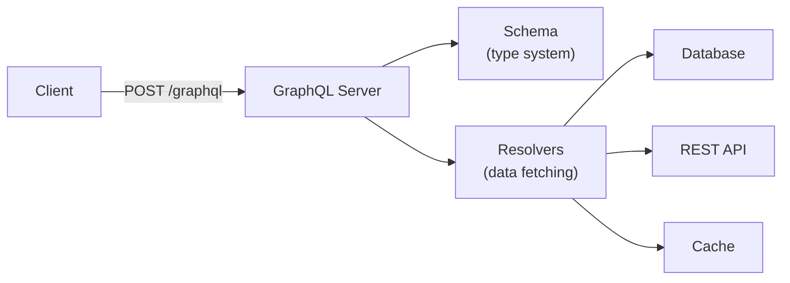

### Schema Definition (SDL)

```graphql
# Types define the shape of data
type User {
  id: ID!
  name: String!
  email: String!
  avatar: String
  orders(status: OrderStatus, first: Int = 10): OrderConnection!
  createdAt: DateTime!
}

type Order {
  id: ID!
  total: Float!
  status: OrderStatus!
  items: [OrderItem!]!
  user: User!
}

enum OrderStatus {
  PENDING
  CONFIRMED
  SHIPPED
  DELIVERED
  CANCELLED
}

# Input types for mutations
input CreateUserInput {
  name: String!
  email: String!
  avatar: String
}

# Root query type — entry points for reading
type Query {
  user(id: ID!): User
  users(first: Int, after: String, filter: UserFilter): UserConnection!
  order(id: ID!): Order
}

# Root mutation type — entry points for writing
type Mutation {
  createUser(input: CreateUserInput!): User!
  updateUser(id: ID!, input: UpdateUserInput!): User!
  deleteUser(id: ID!): Boolean!
  createOrder(input: CreateOrderInput!): Order!
  cancelOrder(id: ID!): Order!
}

# Real-time subscriptions
type Subscription {
  orderStatusChanged(orderId: ID!): Order!
  newMessage(chatId: ID!): Message!
}
```

### Queries, Mutations, Subscriptions

```graphql
# QUERY — read exactly what you need (no over-fetching)
query GetUserWithOrders {
  user(id: "123") {
    name
    email
    orders(first: 5) {
      edges {
        node {
          id
          total
          status
        }
      }
    }
  }
}

# MUTATION — write operations
mutation CreateOrder {
  createOrder(input: {
    userId: "123"
    items: [{ productId: "abc", quantity: 2 }]
  }) {
    id
    total
    status
  }
}

# SUBSCRIPTION — real-time updates over WebSocket
subscription WatchOrder {
  orderStatusChanged(orderId: "456") {
    status
    updatedAt
  }
}
```

### N+1 Problem & DataLoader

The biggest performance pitfall in GraphQL:

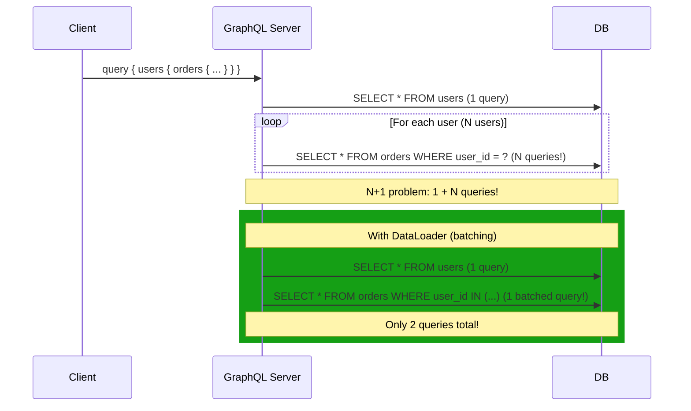

**Solution: DataLoader** — batches and caches individual lookups per request:
```javascript
const userLoader = new DataLoader(async (userIds) => {
  const users = await db.users.findMany({ where: { id: { in: userIds } } });
  return userIds.map(id => users.find(u => u.id === id));
});

// Each resolver calls: userLoader.load(userId)
// DataLoader batches all calls in one tick into a single query
```

### GraphQL Pagination (Relay Connection Spec)

```graphql
type UserConnection {
  edges: [UserEdge!]!
  pageInfo: PageInfo!
  totalCount: Int
}

type UserEdge {
  node: User!
  cursor: String!   # opaque cursor (base64 encoded)
}

type PageInfo {
  hasNextPage: Boolean!
  hasPreviousPage: Boolean!
  startCursor: String
  endCursor: String
}

# Usage
query {
  users(first: 10, after: "cursor_abc") {
    edges {
      node { id, name }
      cursor
    }
    pageInfo {
      hasNextPage
      endCursor
    }
  }
}
```

### GraphQL Security Concerns

| Threat | Mitigation |
|--------|-----------|
| **Deeply nested queries** (DoS) | Query depth limiting (max depth = 10) |
| **Expensive queries** | Query complexity analysis (cost per field) |
| **Introspection abuse** | Disable introspection in production |
| **Batching attacks** | Rate limit by query complexity, not just requests |
| **Persisted queries** | Allowlist pre-approved query hashes (no arbitrary queries) |

### GraphQL Tooling

| Tool | Purpose |
|------|---------|
| **Apollo Server/Client** | Most popular full-stack GraphQL framework |
| **Relay** | Facebook's GraphQL client (opinionated, performant) |
| **Hasura** | Auto-generate GraphQL from PostgreSQL |
| **GraphQL Code Generator** | Generate TypeScript types from schema |
| **Apollo Federation** | Compose multiple GraphQL services into one gateway |

---

## 3. gRPC (Google Remote Procedure Call)

High-performance RPC framework using Protocol Buffers (protobuf) over **HTTP/2**. Default for inter-service communication at Google, Netflix, Spotify.

### How gRPC Works

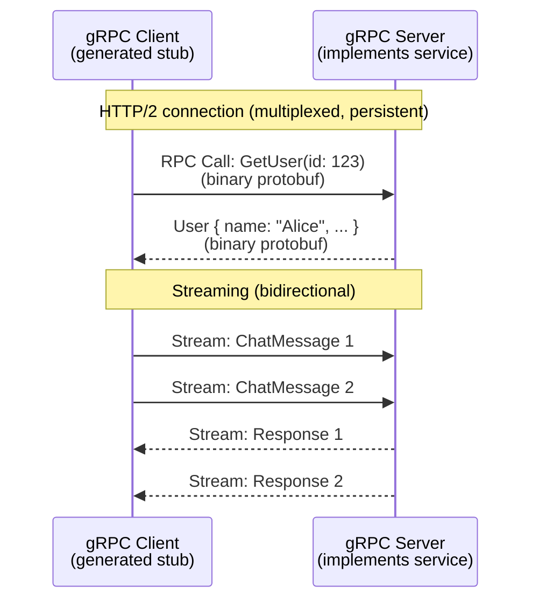

### Protocol Buffers (Protobuf)

Schema definition and serialization format — **strongly typed**, compact binary encoding:

```protobuf
syntax = "proto3";

package userservice;

// Service definition — like an interface
service UserService {
  // Unary — request/response
  rpc GetUser(GetUserRequest) returns (User);
  rpc CreateUser(CreateUserRequest) returns (User);
  rpc DeleteUser(DeleteUserRequest) returns (Empty);

  // Server streaming — server sends multiple responses
  rpc ListUsers(ListUsersRequest) returns (stream User);

  // Client streaming — client sends multiple requests
  rpc UploadPhoto(stream PhotoChunk) returns (UploadResult);

  // Bidirectional streaming — both sides stream
  rpc Chat(stream ChatMessage) returns (stream ChatMessage);
}

message User {
  string id = 1;       // field number (not value!)
  string name = 2;
  string email = 3;
  repeated string roles = 4;   // list
  Address address = 5;         // nested message
  google.protobuf.Timestamp created_at = 6;
}

message GetUserRequest {
  string id = 1;
}

message CreateUserRequest {
  string name = 1;
  string email = 2;
  optional string avatar = 3;
}

message ListUsersRequest {
  int32 page_size = 1;
  string page_token = 2;      // cursor for pagination
  string filter = 3;
}

message Address {
  string street = 1;
  string city = 2;
  string country = 3;
}
```

### 4 Communication Patterns

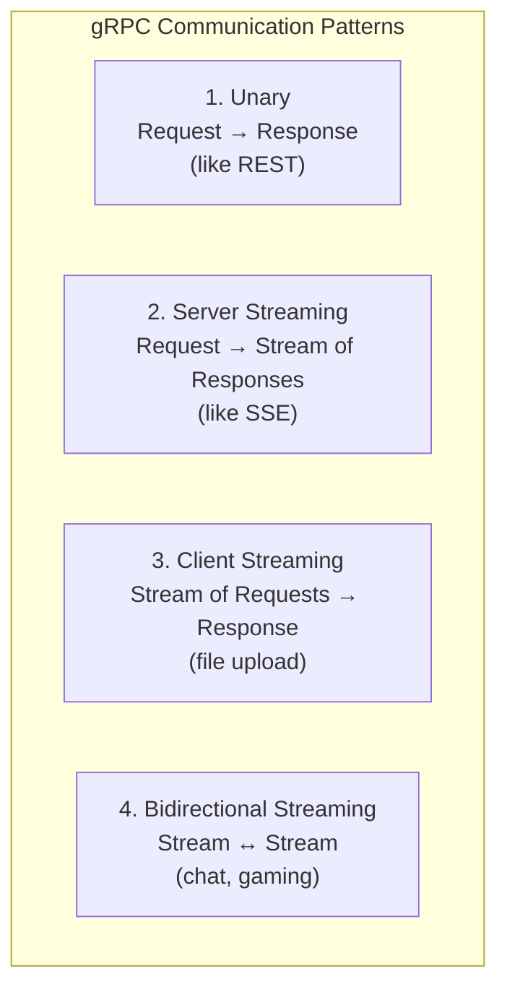

| Pattern | Use Case | Example |
|---------|----------|---------|
| **Unary** | Simple request/response | `GetUser(id)` → `User` |
| **Server streaming** | Large result sets, live feeds | `ListUsers()` → stream of `User` |
| **Client streaming** | File upload, batched writes | `UploadChunks(stream)` → `Result` |
| **Bidirectional** | Chat, real-time collaboration | `Chat(stream)` → stream of messages |

### gRPC Status Codes

| Code | Name | HTTP Equiv | Meaning |
|------|------|-----------|---------|
| 0 | `OK` | 200 | Success |
| 3 | `INVALID_ARGUMENT` | 400 | Client sent bad input |
| 5 | `NOT_FOUND` | 404 | Resource doesn't exist |
| 7 | `PERMISSION_DENIED` | 403 | Caller lacks permission |
| 13 | `INTERNAL` | 500 | Server bug |
| 14 | `UNAVAILABLE` | 503 | Service temporarily unavailable (retry) |
| 16 | `UNAUTHENTICATED` | 401 | Missing/invalid credentials |
| 4 | `DEADLINE_EXCEEDED` | 504 | Timeout (unique to gRPC!) |
| 8 | `RESOURCE_EXHAUSTED` | 429 | Rate limited or quota exceeded |

### gRPC Interceptors (Middleware)

```
Client → [Auth Interceptor] → [Logging] → [Retry] → Network → [Logging] → [Auth] → Server
```

Like HTTP middleware: add cross-cutting concerns (auth, logging, metrics, retries) without modifying service logic.

### gRPC vs REST

| Feature | REST | gRPC |
|---------|------|------|
| **Protocol** | HTTP/1.1 or HTTP/2 | HTTP/2 only |
| **Format** | JSON (text, human-readable) | Protobuf (binary, compact) |
| **Schema** | Optional (OpenAPI) | Required (.proto files) |
| **Code generation** | Optional | Built-in (40+ languages) |
| **Streaming** | Limited (SSE, WebSocket) | Native (4 patterns) |
| **Performance** | Slower (text parsing) | ~10x faster serialization |
| **Payload size** | Larger (JSON) | 3-10x smaller (binary) |
| **Browser support** | ✅ Native | ⚠️ Needs gRPC-Web proxy |
| **Human debugging** | ✅ Easy (curl, Postman) | ❌ Needs special tools (grpcurl, BloomRPC) |
| **Load balancing** | L7 easy | Needs gRPC-aware LB (Envoy) |
| **Deadlines** | No native support | Built-in deadline propagation |

### When to Use gRPC

- **Internal microservice communication** (majority use case)
- **Low-latency, high-throughput** between services
- **Streaming** (real-time data feeds, bidirectional communication)
- **Polyglot environments** (auto-generated clients in any language)

### When NOT to Use gRPC

- Public-facing APIs (use REST for browser compatibility)
- Simple CRUD with few clients
- When human readability of payloads matters

---

## 4. WebSocket APIs

Full-duplex, bidirectional communication over a persistent TCP connection.

### Connection Flow

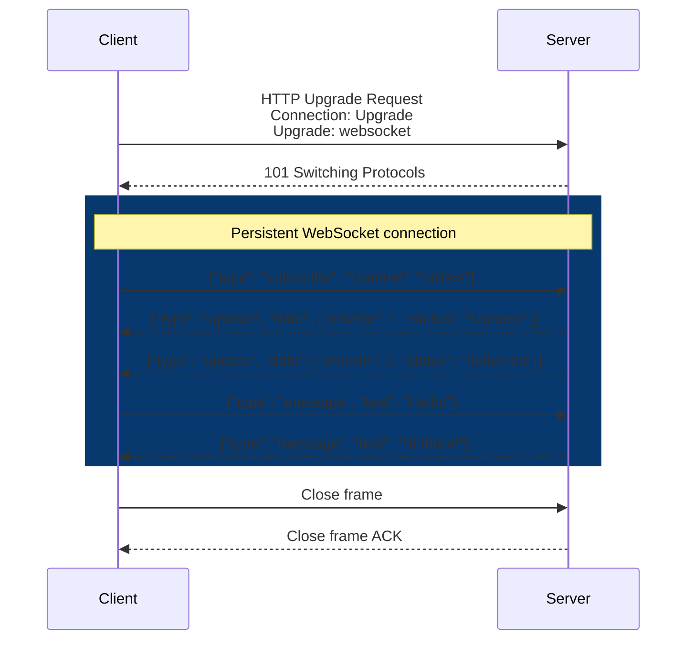

### Message Design

```json
// Client → Server
{ "type": "subscribe", "channel": "stock:AAPL" }
{ "type": "unsubscribe", "channel": "stock:AAPL" }
{ "type": "message", "channel": "chat:123", "data": { "text": "Hello" } }
{ "type": "ping" }

// Server → Client
{ "type": "data", "channel": "stock:AAPL", "data": { "price": 185.50 } }
{ "type": "error", "code": "INVALID_CHANNEL", "message": "Channel not found" }
{ "type": "pong" }
```

### Scaling WebSockets

| Challenge | Solution |
|-----------|---------|
| **Sticky sessions** | Connections are stateful — need L4 load balancing or session affinity |
| **Fan-out** | Server A gets message, must notify clients on Servers B, C → use Redis Pub/Sub or Kafka |
| **Reconnection** | Client must handle reconnect with exponential backoff + resume from last event ID |
| **Memory** | Each connection = memory — 100K connections = significant RAM |

**When to use:** Chat/messaging, live collaboration (Google Docs), gaming, real-time dashboards, live trading.

---

## 5. Server-Sent Events (SSE)

One-way server push over a long-lived HTTP connection. Simpler than WebSocket when you only need server→client.

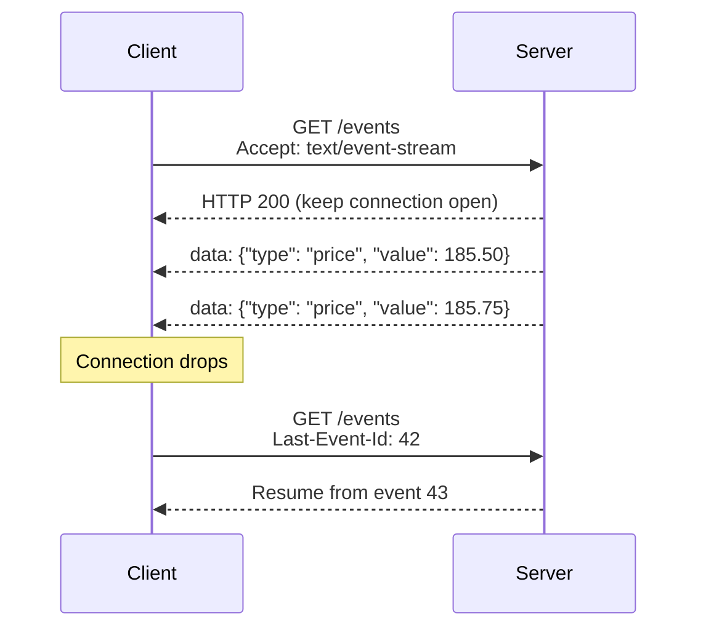

**Wire format:**
```
event: price_update
id: 42
data: {"symbol": "AAPL", "price": 185.50}

event: price_update
id: 43
data: {"symbol": "AAPL", "price": 185.75}

event: notification
id: 44
data: {"message": "Market closing in 5 minutes"}
```

### SSE vs WebSocket

| Feature | SSE | WebSocket |
|---------|-----|-----------|
| **Direction** | Server → Client only | Bidirectional |
| **Protocol** | HTTP/1.1 (long-lived GET) | Custom over TCP (upgrade) |
| **Reconnection** | Built-in (auto-reconnect + Last-Event-Id) | Manual implementation |
| **Data format** | Text only (UTF-8) | Text or binary |
| **Browser API** | `EventSource` (simple) | `WebSocket` API |
| **Proxy/firewall** | Works everywhere (it's HTTP) | May be blocked by proxies |
| **Multiplexing** | With HTTP/2, yes | One per connection |

**When to use:** Live feeds (stock prices), notifications, progress updates, log tailing — any server→client push where client doesn't need to send data back.

---

## 6. Webhooks (Event-Driven Callbacks)

Server pushes events to a client-registered URL when something happens. The **inverse** of polling.

### How Webhooks Work

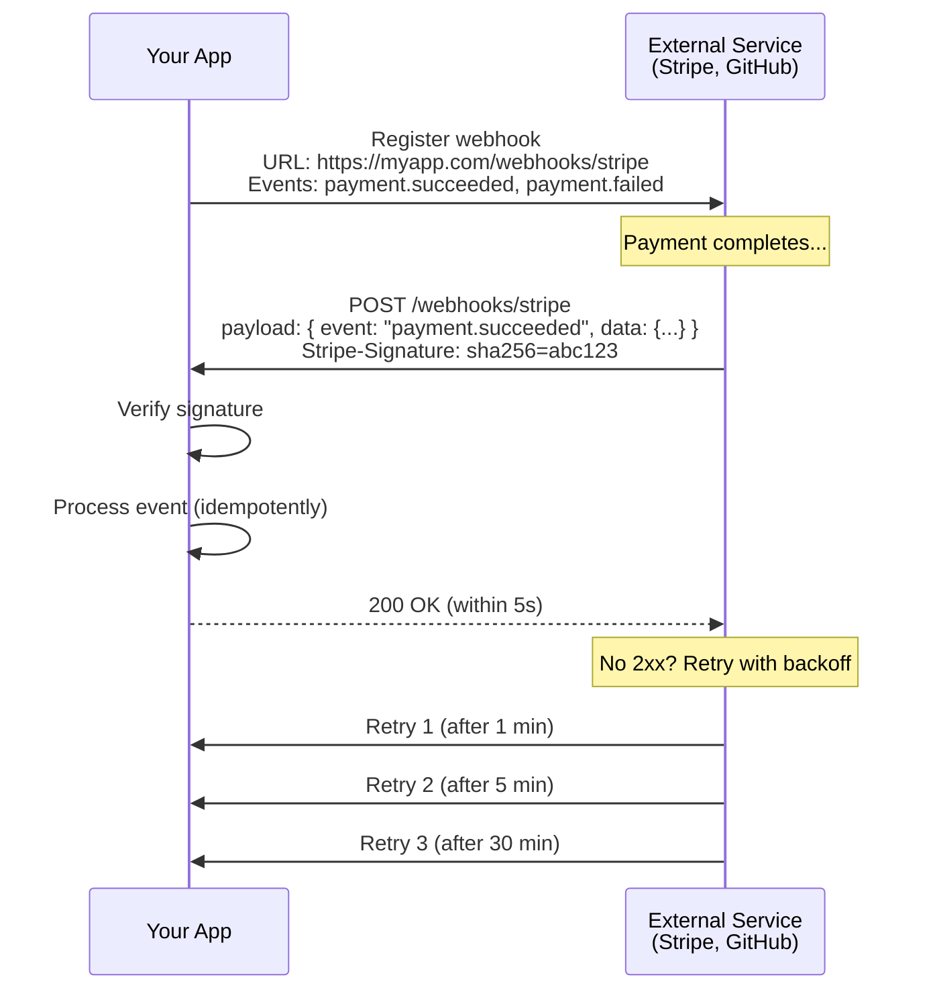

### Webhook Best Practices

| Practice | Why |
|----------|-----|
| **Verify signatures** | Prevent spoofed events (HMAC-SHA256) |
| **Respond fast (< 5s)** | Process async: enqueue event, return 200 immediately |
| **Idempotency** | Same event may be delivered multiple times — use event ID to deduplicate |
| **Retry logic** | Exponential backoff on failure (provider handles this) |
| **Event log** | Store raw events for replay/debugging |
| **Secret rotation** | Rotate webhook signing secrets periodically |

### Webhook Signature Verification

```python
import hmac
import hashlib

def verify_webhook(payload: bytes, signature: str, secret: str) -> bool:
    expected = hmac.new(
        secret.encode(), payload, hashlib.sha256
    ).hexdigest()
    return hmac.compare_digest(f"sha256={expected}", signature)
```

**When to use:** Third-party integrations (Stripe payments, GitHub pushes), event-driven architectures where services need to react to external events.

---

## 7. API Paradigm Comparison

| Feature | REST | GraphQL | gRPC | WebSocket | SSE | Webhooks |
|---------|------|---------|------|-----------|-----|----------|
| **Direction** | Request/Response | Request/Response | Req/Resp + Streaming | Bidirectional | Server → Client | Server → Client |
| **Protocol** | HTTP/1.1+ | HTTP POST | HTTP/2 | TCP (upgraded) | HTTP long-lived | HTTP POST (callback) |
| **Format** | JSON | JSON | Protobuf (binary) | Any | Text (UTF-8) | JSON |
| **Schema** | Optional (OpenAPI) | Required (SDL) | Required (.proto) | Custom | None | Provider-defined |
| **Caching** | ✅ Easy (HTTP cache) | ❌ Complex | ❌ Not native | ❌ N/A | ❌ N/A | ❌ N/A |
| **Browser** | ✅ Native | ✅ via POST | ⚠️ gRPC-Web | ✅ Native | ✅ EventSource | N/A (server-side) |
| **Best for** | Public APIs, CRUD | Complex queries | Internal services | Realtime bidir | Server push | Event callbacks |

### Decision Tree: Which API Style?

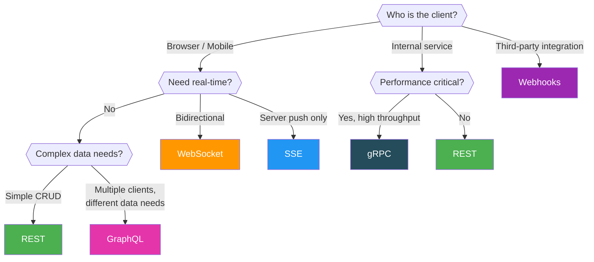

---

## API Versioning

| Strategy | Example | Pros | Cons |
|----------|---------|------|------|
| **URL path** | `/v1/users`, `/v2/users` | Simple, clear | URL pollution |
| **Query param** | `/users?version=2` | Flexible | Easy to forget |
| **Header** | `Accept: application/vnd.api.v2+json` | Clean URLs | Less discoverable |
| **GraphQL** | Schema evolution (deprecate fields) | No versions needed | Requires discipline |
| **Protobuf** | Add fields with new numbers | Backward compatible | Can't remove/rename fields |

---

## Rate Limiting in API Design

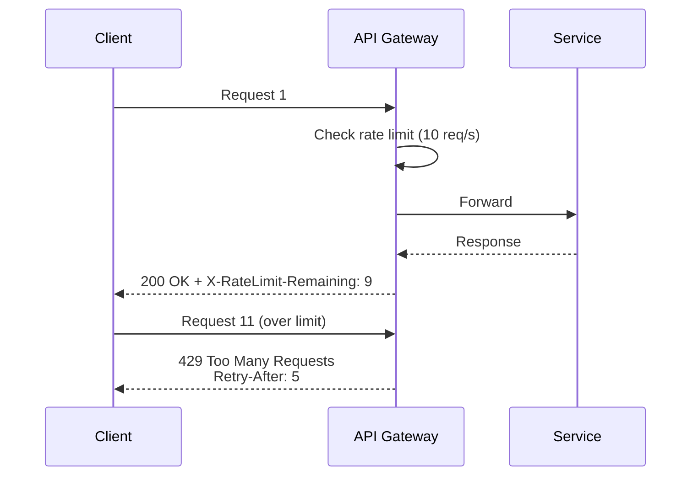

Always return rate limit headers:
```
X-RateLimit-Limit: 100
X-RateLimit-Remaining: 42
X-RateLimit-Reset: 1672531200
Retry-After: 5
```

---

## API Authentication Patterns

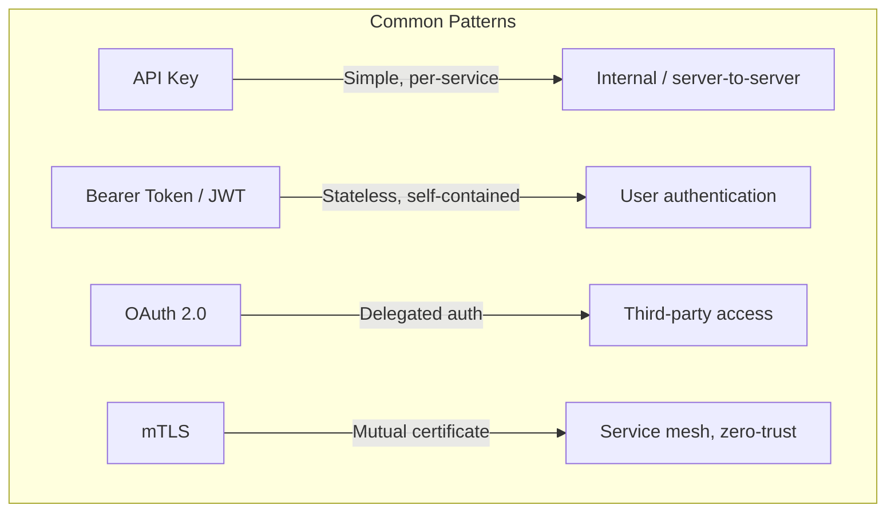

| Pattern | Best For | Tradeoff |
|---------|----------|----------|
| **API Key** | Server-to-server, simple auth | No user context, key rotation needed |
| **JWT** | Stateless user auth | Token size, can't revoke easily |
| **OAuth 2.0** | Third-party access, SSO | Complex flows, many grant types |
| **mTLS** | Service-to-service in mesh | Certificate management overhead |

---

## Idempotency — Deep Dive

Critical for payment, order, and any mutation API. **If your API processes money, idempotency is non-negotiable.**

### Why Idempotency Matters

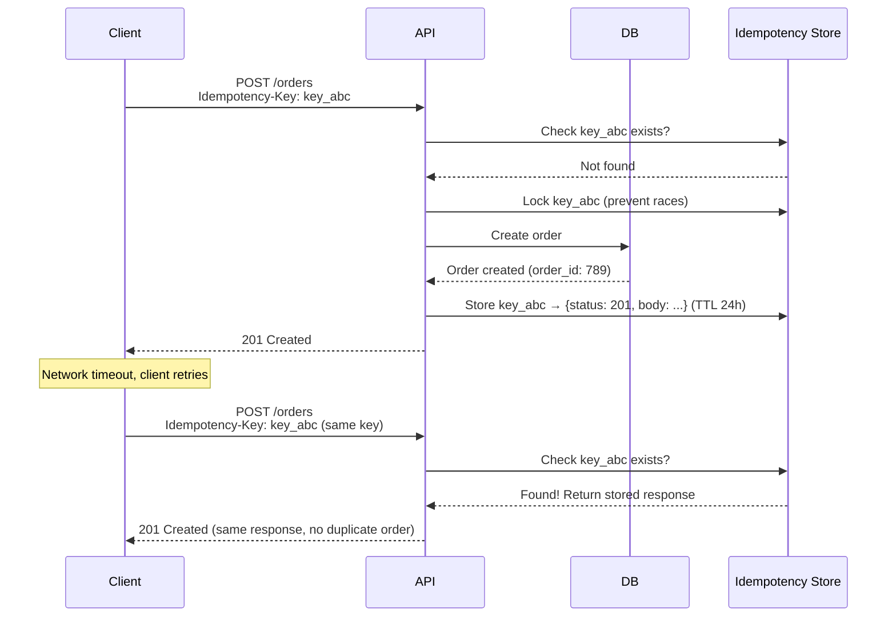

### Which Methods Need Idempotency?

| Method | Naturally Idempotent? | Need Idempotency Key? | Why |
|--------|----------------------|----------------------|-----|
| **GET** | ✅ Yes | No | Read-only, no side effects |
| **PUT** | ✅ Yes | No | Full replace → same result every time |
| **DELETE** | ✅ Yes | No | Deleting already-deleted = still deleted |
| **PATCH** | ✅ Usually | Depends | If patch is `set x=5` → idempotent. If `increment x` → NOT idempotent |
| **POST** | ❌ No | **Yes!** | Creates new resource each time → must deduplicate |

### Implementation: Database-Level

```sql
-- Idempotency keys table
CREATE TABLE idempotency_keys (
  idempotency_key  VARCHAR(255) PRIMARY KEY,
  request_path     VARCHAR(255) NOT NULL,
  request_body_hash VARCHAR(64) NOT NULL,
  response_status  INT NOT NULL,
  response_body    JSONB NOT NULL,
  created_at       TIMESTAMP DEFAULT NOW(),
  expires_at       TIMESTAMP DEFAULT NOW() + INTERVAL '24 hours'
);

-- Create index for cleanup
CREATE INDEX idx_idempotency_expires ON idempotency_keys(expires_at);
```

### Handling Race Conditions

Two identical requests arrive simultaneously — both see "key not found":

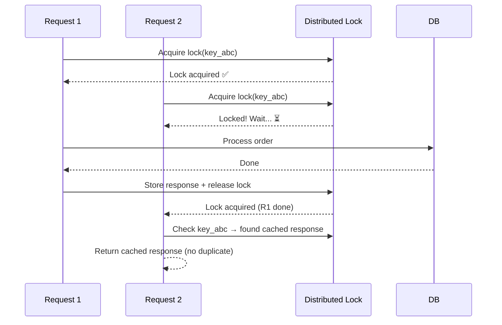

**Solution:** Use a distributed lock (Redis `SET NX EX`) or database `INSERT ... ON CONFLICT DO NOTHING` to ensure only one request processes per idempotency key.

### Real-World Examples

| Company | Implementation |
|---------|---------------|
| **Stripe** | `Idempotency-Key` header, stores for 24h, returns cached response on retry |
| **PayPal** | `PayPal-Request-Id` header |
| **AWS** | Client tokens for EC2 `RunInstances`, DynamoDB conditional writes |
| **Google Cloud** | `requestId` query parameter on mutating operations |

### Edge Cases to Handle

| Scenario | Response |
|----------|----------|
| Same key, same body | Return cached response (normal case) |
| Same key, different body | `422 Unprocessable Entity` — key reuse with different payload |
| Key exists but original request still processing | `409 Conflict` with `Retry-After` header |
| Key expired (past TTL) | Treat as new request (or reject — depends on policy) |
| Server crashed mid-processing | On restart: check if side effect completed, complete or rollback |

---

## Long-Running Operations (Async API Pattern)

For operations that take seconds/minutes (report generation, video processing, ML inference):

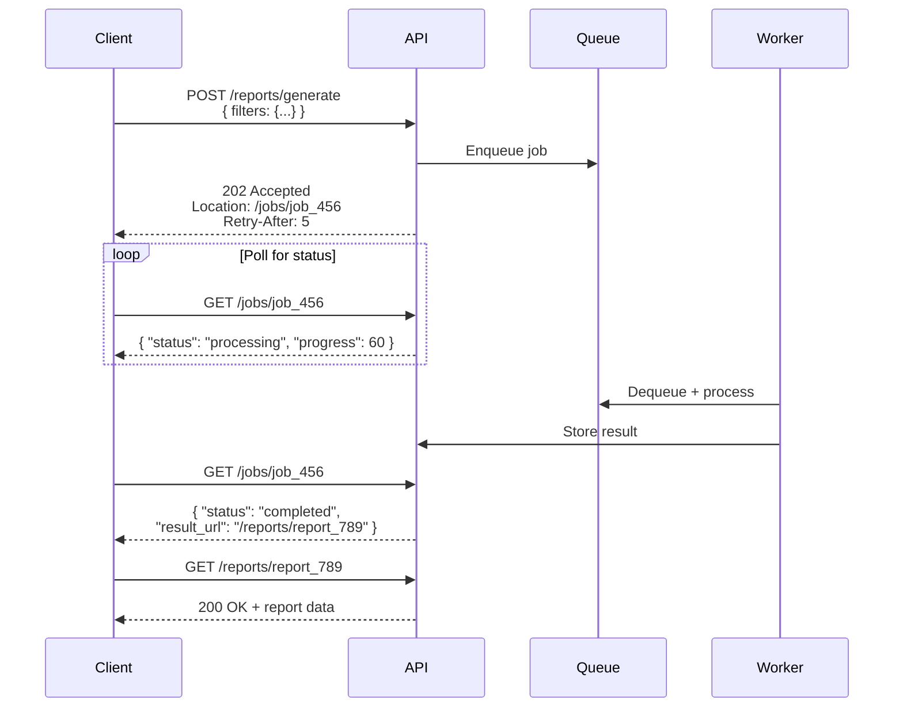

**Alternative: Webhook callback** — instead of polling, client registers a callback URL:
```json
POST /reports/generate
{
  "filters": {...},
  "callback_url": "https://myapp.com/webhooks/report-ready"
}
```

---

## Content Negotiation

How clients and servers agree on data format, language, and encoding:

```
# Request
GET /users/123
Accept: application/json        # I want JSON
Accept-Language: en-US           # I want English
Accept-Encoding: gzip            # I can handle gzip
If-None-Match: "etag_abc"        # I have this cached version

# Response
HTTP/1.1 200 OK
Content-Type: application/json; charset=utf-8
Content-Language: en-US
Content-Encoding: gzip
ETag: "etag_def"                 # New version tag
Vary: Accept, Accept-Language    # Cache varies by these headers
Cache-Control: max-age=3600      # Cache for 1 hour
```

| Header | Purpose | Common Values |
|--------|---------|---------------|
| `Accept` | Desired response format | `application/json`, `application/xml`, `text/csv` |
| `Content-Type` | Request body format | `application/json`, `multipart/form-data`, `application/x-protobuf` |
| `Accept-Encoding` | Compression | `gzip`, `br` (Brotli), `zstd` |
| `ETag` / `If-None-Match` | Conditional requests (caching) | Opaque version identifier |
| `If-Modified-Since` | Time-based caching | `Sat, 01 Jan 2025 00:00:00 GMT` |

---

## HATEOAS (Hypermedia as the Engine of Application State)

Responses include links for discoverability — clients follow links instead of hardcoding URLs:

```json
{
  "data": {
    "id": "order_123",
    "status": "pending",
    "total": 59.99
  },
  "links": {
    "self": { "href": "/orders/123", "method": "GET" },
    "cancel": { "href": "/orders/123/cancel", "method": "POST" },
    "payment": { "href": "/orders/123/payment", "method": "POST" },
    "items": { "href": "/orders/123/items", "method": "GET" }
  }
}
```

**Rarely implemented fully** but the concept shows up in interviews. GitHub API uses Link headers for pagination, which is a lightweight form of HATEOAS.

---

## Retry & Backoff Strategy

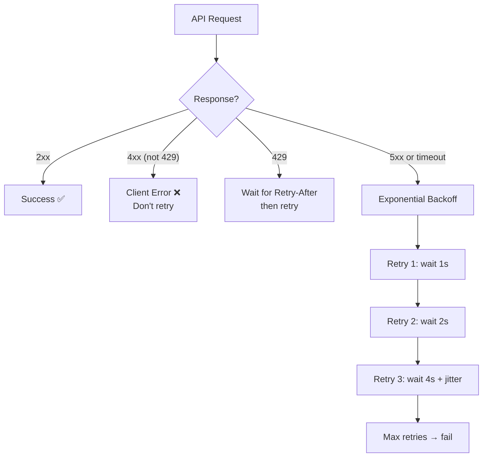

**Exponential backoff with jitter:**
```
wait_time = min(base * 2^attempt + random_jitter, max_wait)

Attempt 0: 1s + jitter
Attempt 1: 2s + jitter
Attempt 2: 4s + jitter
Attempt 3: 8s + jitter  (cap at max_wait)
```

**Jitter prevents thundering herd** — without it, all clients retry at the exact same time after an outage.

---

## API Gateway Patterns

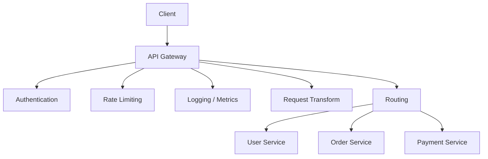

| Concern | Gateway Handles | Why |
|---------|----------------|-----|
| **Authentication** | Validate tokens before forwarding | Services don't each implement auth |
| **Rate limiting** | Per-client, per-tier throttling | Centralized policy enforcement |
| **Request routing** | Path-based routing to services | Client sees single API |
| **Protocol translation** | REST → gRPC | External REST, internal gRPC |
| **Response caching** | Cache GET responses | Reduce backend load |
| **Load shedding** | Reject excess traffic with 503 | Protect backend from overload |

**Tools:** Kong, AWS API Gateway, Envoy, Traefik, Apigee.

---

## API Design Best Practices

1. **Be consistent** — same naming conventions, pagination, error format everywhere
2. **Use plural nouns** — `/users` not `/user`
3. **Nest for relationships** — `/users/123/orders` for user's orders
4. **Idempotency keys** — for POST/payment endpoints, accept `Idempotency-Key` header
5. **Request IDs** — return `X-Request-Id` in every response for tracing
6. **Deprecation headers** — `Sunset` header + `Deprecation: true`
7. **Health check endpoint** — `GET /health` returning `{"status": "ok"}`
8. **Envelope responses** — wrap in `{"data": ...}` or `{"error": ...}` for consistency
9. **Use ETags** — for optimistic concurrency control and caching
10. **Document everything** — OpenAPI (REST), SDL (GraphQL), .proto files (gRPC)

---

## Common Interview Questions

1. **"How would you design the API for X?"** → Define resources, HTTP methods, URL patterns, request/response shapes, pagination, error handling, authentication.
2. **"REST vs GraphQL vs gRPC?"** → REST for public CRUD + caching. GraphQL for complex queries + multiple frontends. gRPC for internal high-throughput services.
3. **"When would you use WebSocket over SSE?"** → WebSocket for bidirectional (chat). SSE for server→client only (notifications, feeds). SSE is simpler, auto-reconnects, works through proxies.
4. **"How do you prevent duplicate orders?"** → Idempotency key: client generates UUID, server deduplicates via key→response cache with TTL. Use distributed lock for concurrent requests with same key.
5. **"What's the N+1 problem in GraphQL?"** → Nested resolvers fire individual DB queries per parent. Fix with DataLoader (batches per-tick requests into one query).
6. **"How do you handle breaking API changes?"** → URL versioning + deprecation period + Sunset header. For GraphQL: deprecate fields. For gRPC: only add new fields (protobuf is backward-compatible).
7. **"REST vs gRPC for microservices?"** → gRPC for internal (binary, streaming, code-gen, deadlines). REST for external (browser-friendly, cacheable, debuggable).
8. **"How do you handle long-running operations?"** → Return 202 Accepted + Location header for polling. Or webhook callback for push notification on completion.
9. **"How would you secure a webhook endpoint?"** → Verify HMAC signature, use HTTPS, respond fast (enqueue), idempotent processing, store raw events for replay.
10. **"How do you design a real-time API?"** → WebSocket for bidirectional, SSE for server-push, gRPC streaming for service-to-service, webhooks for third-party events.
11. **"What retry strategy should clients use?"** → Exponential backoff with jitter. Only retry 5xx and 429 (with Retry-After). Never retry 4xx (except 429). Cap max retries.
12. **"How do you handle concurrent updates?"** → Optimistic locking with ETags: read resource with ETag, send update with `If-Match` header, server returns 412 if version changed.
