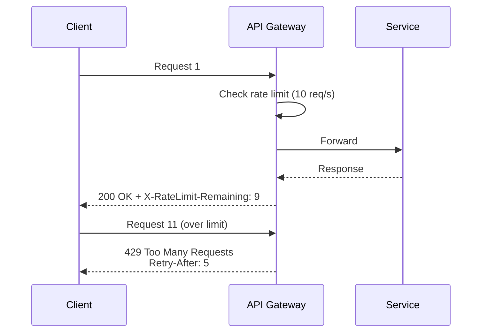
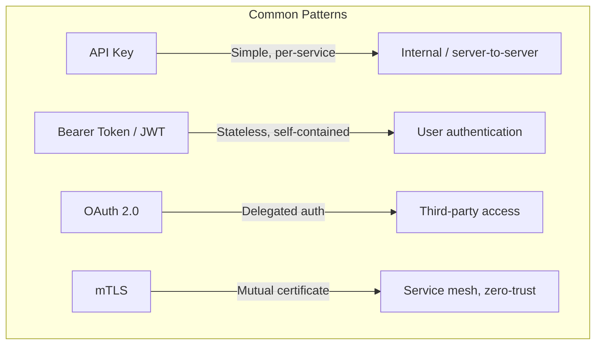

# API Design

Designing clean, scalable, and maintainable APIs — a critical skill for system design interviews.

---

## REST (Representational State Transfer)

The most common API style for public and web APIs.

### Core Principles
- **Resource-based URLs** — nouns, not verbs: `/users/123` not `/getUser?id=123`
- **HTTP methods as actions** — GET, POST, PUT, PATCH, DELETE
- **Stateless** — each request contains all info needed (no server-side session)
- **Standard status codes** — 200, 201, 400, 401, 404, 500

### HTTP Methods

| Method | Action | Idempotent | Safe | Example |
|--------|--------|-----------|------|---------|
| **GET** | Read | ✅ | ✅ | `GET /users/123` |
| **POST** | Create | ❌ | ❌ | `POST /users` + body |
| **PUT** | Full replace | ✅ | ❌ | `PUT /users/123` + full body |
| **PATCH** | Partial update | ✅* | ❌ | `PATCH /users/123` + partial body |
| **DELETE** | Remove | ✅ | ❌ | `DELETE /users/123` |

*PATCH is idempotent if designed correctly (same patch yields same result).

### URL Design Best Practices

```
✅ Good                              ❌ Bad
GET    /users                        GET    /getUsers
GET    /users/123                    GET    /getUserById?id=123
GET    /users/123/orders             GET    /getOrdersByUser?userId=123
POST   /users                        POST   /createUser
PUT    /users/123                    POST   /updateUser
DELETE /users/123                    POST   /deleteUser?id=123
```

### Pagination

```
# Offset-based (simple but slow for large offsets)
GET /users?page=3&size=20

# Cursor-based (efficient for large datasets)
GET /users?cursor=eyJpZCI6MTAwfQ&size=20

# Response includes next cursor
{
  "data": [...],
  "next_cursor": "eyJpZCI6MTIwfQ",
  "has_more": true
}
```

| Method | Pros | Cons |
|--------|------|------|
| **Offset** | Simple, supports "jump to page" | Slow at large offsets, inconsistent with inserts |
| **Cursor** | Fast, consistent | Can't jump to arbitrary page |

### Filtering, Sorting, Field Selection

```
GET /users?status=active&role=admin          # Filtering
GET /users?sort=-created_at,name             # Sorting (- for desc)
GET /users?fields=id,name,email              # Field selection (reduce payload)
```

---

## REST Response Design

### Standard Success Response
```json
{
  "data": {
    "id": 123,
    "name": "Alice",
    "email": "alice@example.com"
  }
}
```

### Standard Error Response
```json
{
  "error": {
    "code": "VALIDATION_ERROR",
    "message": "Email is required",
    "details": [
      { "field": "email", "message": "must not be blank" }
    ]
  }
}
```

### HTTP Status Codes (Know These)

| Code | Meaning | When to Use |
|------|---------|-------------|
| **200** | OK | Successful GET, PUT, PATCH |
| **201** | Created | Successful POST (return created resource + Location header) |
| **204** | No Content | Successful DELETE |
| **400** | Bad Request | Validation errors, malformed input |
| **401** | Unauthorized | Missing or invalid authentication |
| **403** | Forbidden | Authenticated but not authorized |
| **404** | Not Found | Resource doesn't exist |
| **409** | Conflict | Duplicate resource, version conflict |
| **429** | Too Many Requests | Rate limit exceeded (include Retry-After header) |
| **500** | Internal Server Error | Unhandled server bug |
| **503** | Service Unavailable | Server overloaded or in maintenance |

---

## GraphQL

Query language that lets clients request exactly the data they need.

### Key Concepts

```graphql
# Client specifies exact fields needed
query {
  user(id: 123) {
    name
    email
    orders(last: 5) {
      id
      total
      status
    }
  }
}
```

### GraphQL vs REST

| Feature | REST | GraphQL |
|---------|------|---------|
| **Data fetching** | Fixed response shape | Client specifies exact fields |
| **Over-fetching** | Common (get all fields) | Eliminated |
| **Under-fetching** | Need multiple calls | Single query, nested data |
| **Endpoints** | Many (`/users`, `/orders`) | Single (`/graphql`) |
| **Caching** | Easy (URL-based) | Complex (query-based) |
| **Learning curve** | Low | Moderate |
| **Tooling** | Mature | Growing (Apollo, Relay) |

### When to Use
- **REST** — simple CRUD, public APIs, strong caching needs
- **GraphQL** — complex relationships, mobile (bandwidth sensitive), multiple frontends with different data needs

---

## API Versioning

| Strategy | Example | Pros | Cons |
|----------|---------|------|------|
| **URL path** | `/v1/users`, `/v2/users` | Simple, clear | URL pollution |
| **Query param** | `/users?version=2` | Flexible | Easy to forget |
| **Header** | `Accept: application/vnd.api.v2+json` | Clean URLs | Less discoverable |
| **No versioning** | Evolve with backward-compatible changes | Simple | Harder as API grows |

**Interview recommendation:** URL path versioning (`/v1/`) is most common and easiest to reason about.

---

## Rate Limiting in API Design



Always return rate limit headers:
```
X-RateLimit-Limit: 100
X-RateLimit-Remaining: 42
X-RateLimit-Reset: 1672531200
Retry-After: 5
```

---

## API Authentication Patterns



| Pattern | Best For | Tradeoff |
|---------|----------|----------|
| **API Key** | Server-to-server, simple auth | No user context, key rotation needed |
| **JWT** | Stateless user auth | Token size, can't revoke easily |
| **OAuth 2.0** | Third-party access, SSO | Complex flows, many grant types |
| **mTLS** | Service-to-service in mesh | Certificate management overhead |

---

## API Design Best Practices

1. **Be consistent** — same naming conventions, pagination, error format everywhere
2. **Use plural nouns** — `/users` not `/user`
3. **Nest for relationships** — `/users/123/orders` for user's orders
4. **Idempotency keys** — for POST/payment endpoints, accept `Idempotency-Key` header to prevent double processing
5. **HATEOAS (optional)** — include links in responses for discoverability
6. **Request IDs** — return `X-Request-Id` in every response for tracing
7. **Bulk operations** — `POST /users/bulk` with array body for batch creates

---

## Common Interview Questions

1. **"How would you design the API for X?"** → Define resources, HTTP methods, URL patterns, request/response shapes, pagination, error handling
2. **"REST vs GraphQL?"** → REST for simple CRUD + caching, GraphQL for complex queries + multiple clients
3. **"How do you handle breaking API changes?"** → URL versioning + deprecation period + sunset headers
4. **"How do you prevent duplicate orders?"** → Idempotency key: client generates unique key, server deduplicates
5. **"How do you handle partial failures in batch APIs?"** → Return 207 Multi-Status with per-item success/failure
