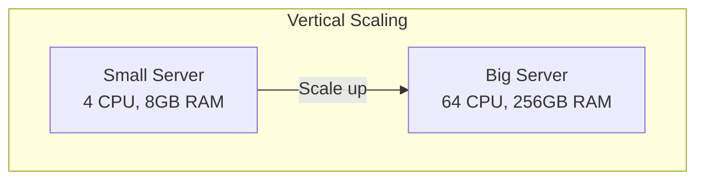
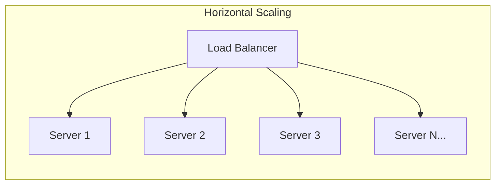
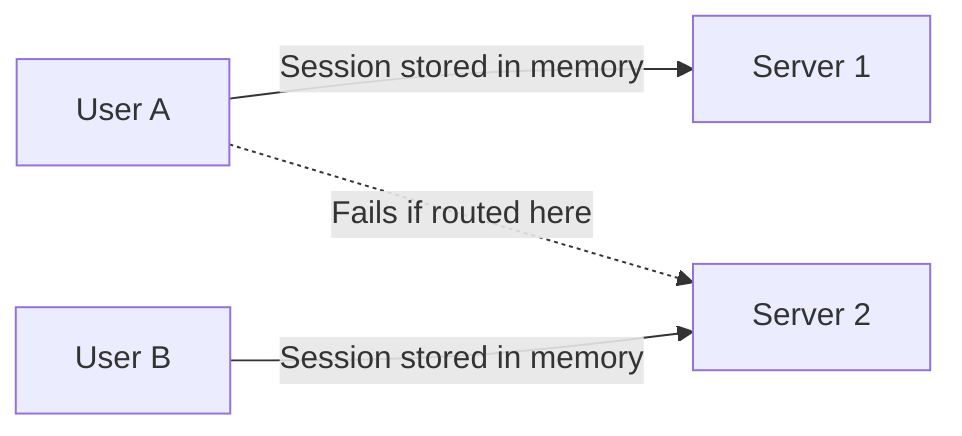
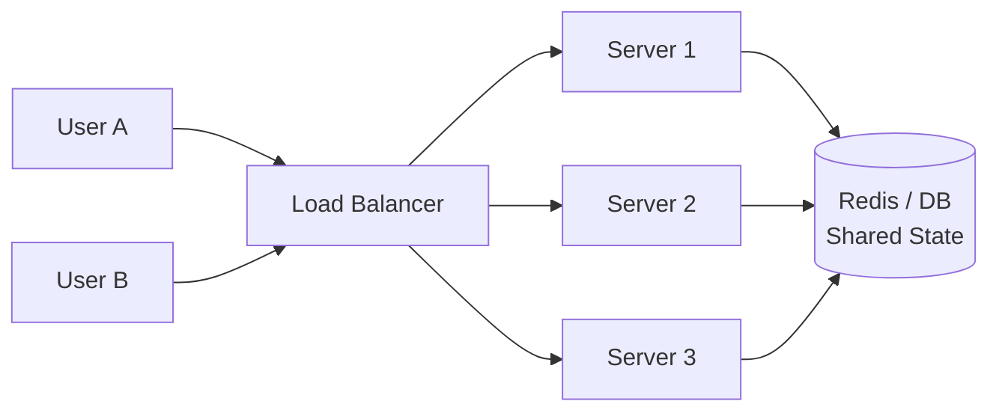
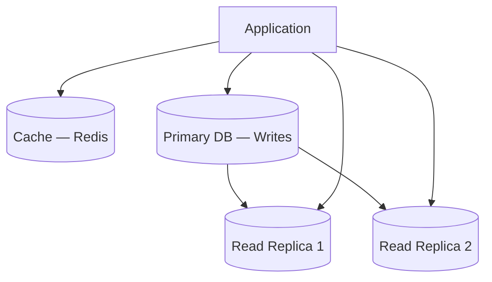
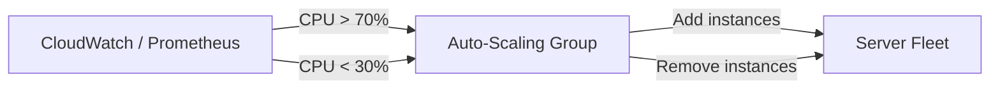

# Scalability

How to design systems that handle growing load — the most fundamental concept in system design interviews.

---

## Vertical vs Horizontal Scaling





| Feature | Vertical (Scale Up) | Horizontal (Scale Out) |
|---------|-------------------|----------------------|
| **How** | Add more CPU/RAM/disk to one machine | Add more machines |
| **Limit** | Hardware ceiling (you can't buy infinite RAM) | Virtually unlimited |
| **Downtime** | Often requires restart | Zero-downtime (add/remove nodes) |
| **Complexity** | Simple (no distributed system) | Complex (distributed state, networking) |
| **Cost** | Expensive at top end (non-linear pricing) | Cheaper commodity hardware |
| **Failure** | Single point of failure | Resilient (one node failure is survivable) |

**Interview default:** Always prefer horizontal scaling. Mention vertical as a quick short-term fix (e.g., "We can vertically scale the DB while we implement read replicas").

---

## Stateless vs Stateful Services

The **#1 enabler of horizontal scaling** is making services stateless.

### Stateful (Hard to Scale)


### Stateless (Easy to Scale)


**Stateless rules:**
- No in-memory sessions — use Redis, database, or JWT
- No local file storage — use S3, shared NFS, or object storage
- No server-specific state — any server can handle any request
- Configuration via environment variables, not local files

---

## Common Scaling Patterns

### Read-Heavy Systems (80/20 Read/Write)



1. **Caching** — cache hot reads (Redis, Memcached)
2. **Read replicas** — replicate DB, route reads to replicas
3. **CDN** — serve static content from edge

### Write-Heavy Systems

1. **Message queues** — buffer writes, process async (Kafka, SQS)
2. **Write-behind cache** — write to cache, async flush to DB
3. **Sharding** — partition data across multiple DB instances
4. **CQRS** — separate read and write models

### Compute-Heavy Systems

1. **Worker pools** — offload long tasks to background workers
2. **Task queues** — distribute work (Celery, Sidekiq, SQS)
3. **Auto-scaling** — scale workers based on queue depth

---

## Database Scaling Strategies

| Strategy | How | Best For |
|----------|-----|----------|
| **Connection pooling** | Reuse DB connections (HikariCP, PgBouncer) | Reducing connection overhead |
| **Read replicas** | Replicate to multiple read-only nodes | Read-heavy workloads |
| **Vertical scaling** | Bigger DB instance | Quick fix, simpler |
| **Sharding** | Split data across DB instances by key | Very large datasets |
| **Caching** | Cache queries in Redis | Reducing DB load |
| **Denormalization** | Pre-compute joins, store redundantly | Read performance at cost of write complexity |

---

## Auto-Scaling



### Scaling Policies

| Policy | Trigger | Example |
|--------|---------|---------|
| **Target tracking** | Maintain metric at target | Keep CPU at 60% |
| **Step scaling** | Different actions at different thresholds | CPU > 70% → +2, CPU > 90% → +5 |
| **Scheduled** | Time-based | Scale up before known peak hours |
| **Predictive** | ML-based prediction | AWS predictive scaling |

### Key Considerations
- **Warm-up time** — new instances need time to start (JVM warm-up, cache priming)
- **Cool-down period** — avoid thrashing (adding/removing too quickly)
- **Graceful shutdown** — drain connections before terminating instances
- **Scale triggers** — CPU, memory, queue depth, request latency, custom metrics

---

## Scaling Anti-Patterns

| Anti-Pattern | Problem | Fix |
|-------------|---------|-----|
| Premature optimization | Over-engineering before knowing bottlenecks | Profile first, scale what's needed |
| Ignoring the database | Scaling app servers but DB becomes bottleneck | Read replicas, caching, sharding |
| Shared mutable state | In-memory state prevents horizontal scaling | Externalize state to Redis/DB |
| Synchronous everything | One slow dependency blocks all requests | Async processing for non-critical paths |
| No caching | Every read hits the database | Cache at multiple levels |

---

## The Scalability Interview Framework

When asked "How would you scale X?", follow this mental model:

```
1. Identify the bottleneck
   ├── CPU-bound? → More/bigger compute
   ├── I/O-bound? → Async, caching, CDN
   ├── Memory-bound? → Bigger instances, eviction
   └── Database? → Read replicas, sharding, caching

2. Apply techniques in order
   ├── Caching (cheapest win)
   ├── Horizontal scaling (stateless servers + LB)
   ├── Async processing (queues for non-critical work)
   ├── Database optimization (indexes, read replicas)
   └── Sharding (last resort, highest complexity)

3. Discuss tradeoffs
   ├── Consistency vs availability
   ├── Latency vs throughput
   └── Complexity vs simplicity
```

---

## Common Interview Questions

1. **"How would you scale this to 10M users?"** → CDN for static, stateless servers + LB, read replicas, Redis cache, async processing for non-critical paths
2. **"What's the difference between vertical and horizontal scaling?"** → Vertical: bigger machine, limited. Horizontal: more machines, unlimited but requires distributed design.
3. **"How do you handle a sudden traffic spike?"** → Auto-scaling, CDN absorbs static traffic, rate limiting protects backend, queues buffer writes, graceful degradation for non-critical features
4. **"Your database is the bottleneck — what do you do?"** → In order: add indexes, query optimization, read replicas, caching layer, denormalization, and finally sharding
