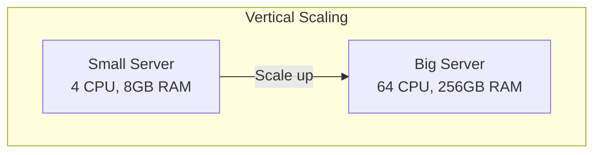
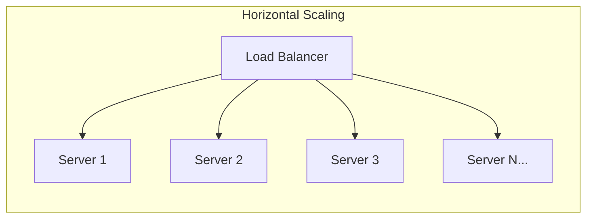
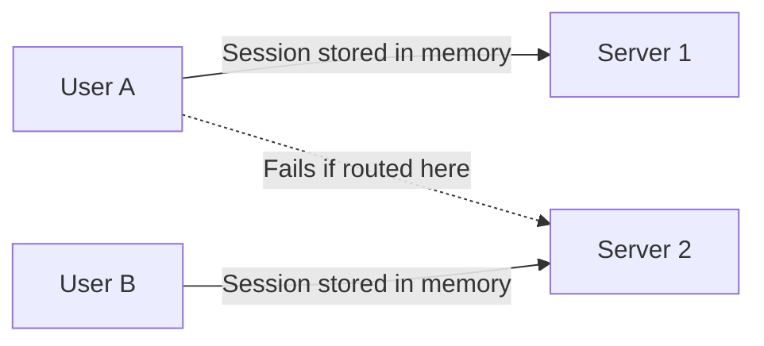
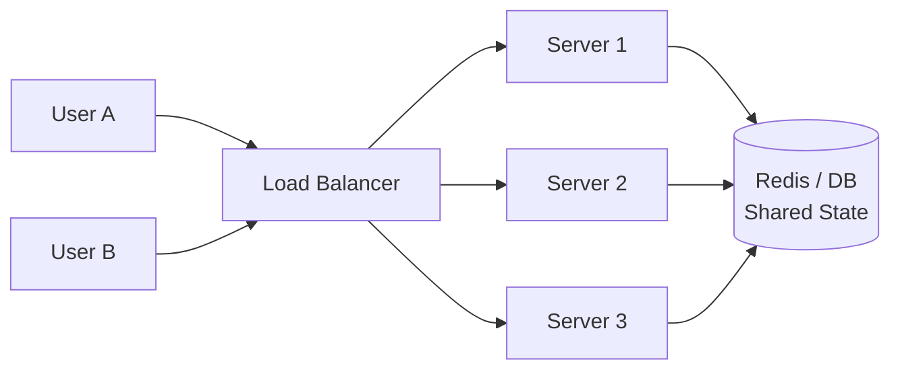
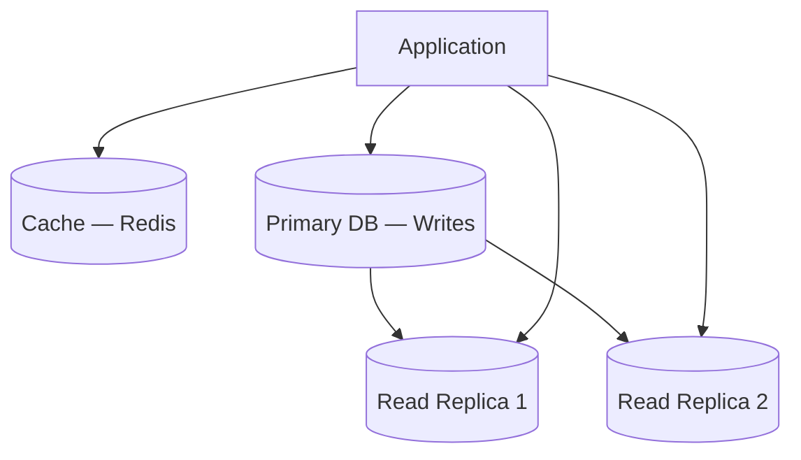
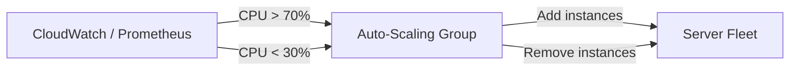
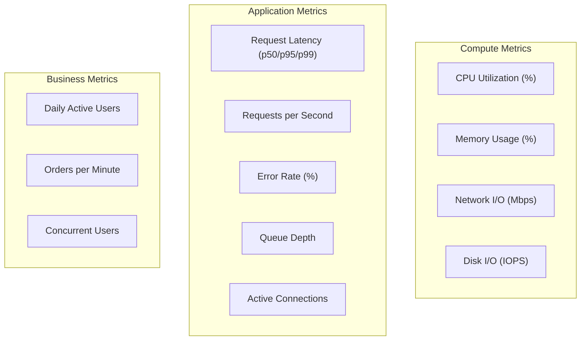
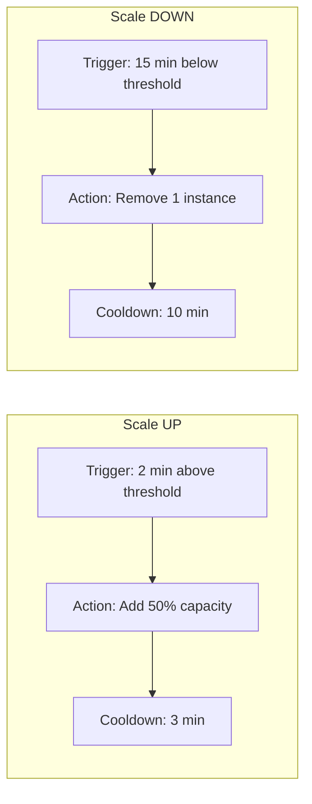
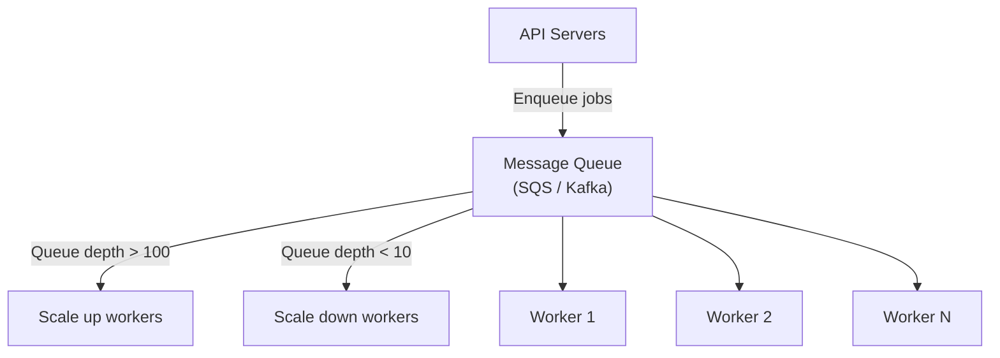
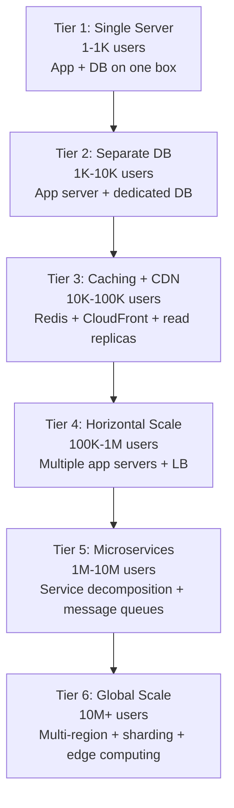

# Scalability

How to design systems that handle growing load — the most fundamental concept in system design interviews.

---

## Vertical vs Horizontal Scaling





| Feature | Vertical (Scale Up) | Horizontal (Scale Out) |
|---------|-------------------|----------------------|
| **How** | Add more CPU/RAM/disk to one machine | Add more machines |
| **Limit** | Hardware ceiling (you can't buy infinite RAM) | Virtually unlimited |
| **Downtime** | Often requires restart | Zero-downtime (add/remove nodes) |
| **Complexity** | Simple (no distributed system) | Complex (distributed state, networking) |
| **Cost** | Expensive at top end (non-linear pricing) | Cheaper commodity hardware |
| **Failure** | Single point of failure | Resilient (one node failure is survivable) |

**Interview default:** Always prefer horizontal scaling. Mention vertical as a quick short-term fix (e.g., "We can vertically scale the DB while we implement read replicas").

---

## Stateless vs Stateful Services

The **#1 enabler of horizontal scaling** is making services stateless.

### Stateful (Hard to Scale)


### Stateless (Easy to Scale)


**Stateless rules:**
- No in-memory sessions — use Redis, database, or JWT
- No local file storage — use S3, shared NFS, or object storage
- No server-specific state — any server can handle any request
- Configuration via environment variables, not local files

---

## Common Scaling Patterns

### Read-Heavy Systems (80/20 Read/Write)



1. **Caching** — cache hot reads (Redis, Memcached)
2. **Read replicas** — replicate DB, route reads to replicas
3. **CDN** — serve static content from edge

### Write-Heavy Systems

1. **Message queues** — buffer writes, process async (Kafka, SQS)
2. **Write-behind cache** — write to cache, async flush to DB
3. **Sharding** — partition data across multiple DB instances
4. **CQRS** — separate read and write models

### Compute-Heavy Systems

1. **Worker pools** — offload long tasks to background workers
2. **Task queues** — distribute work (Celery, Sidekiq, SQS)
3. **Auto-scaling** — scale workers based on queue depth

---

## Database Scaling Strategies

| Strategy | How | Best For |
|----------|-----|----------|
| **Connection pooling** | Reuse DB connections (HikariCP, PgBouncer) | Reducing connection overhead |
| **Read replicas** | Replicate to multiple read-only nodes | Read-heavy workloads |
| **Vertical scaling** | Bigger DB instance | Quick fix, simpler |
| **Sharding** | Split data across DB instances by key | Very large datasets |
| **Caching** | Cache queries in Redis | Reducing DB load |
| **Denormalization** | Pre-compute joins, store redundantly | Read performance at cost of write complexity |

---

## Auto-Scaling



### Scaling Policies

| Policy | Trigger | Example |
|--------|---------|---------|
| **Target tracking** | Maintain metric at target | Keep CPU at 60% |
| **Step scaling** | Different actions at different thresholds | CPU > 70% → +2, CPU > 90% → +5 |
| **Scheduled** | Time-based | Scale up before known peak hours |
| **Predictive** | ML-based prediction | AWS predictive scaling |

---

## Scaling Metrics — What to Monitor

The key to scaling is knowing **what to measure** and **when to act**. Scale based on the right metric for your bottleneck.

### Infrastructure Metrics



| Metric | What It Tells You | Scale-Up Threshold | Scale-Down Threshold |
|--------|------------------|-------------------|---------------------|
| **CPU utilization** | Compute saturation | > 70% sustained (5 min) | < 30% sustained (15 min) |
| **Memory usage** | RAM pressure, potential OOM | > 80% | < 40% |
| **Network I/O** | Bandwidth saturation | > 70% of NIC capacity | < 20% |
| **Disk IOPS** | Storage bottleneck | > 80% provisioned IOPS | < 20% |
| **Request latency (p99)** | User experience degradation | > 500ms (or SLA target) | < 100ms |
| **Requests/sec** | Traffic volume | > capacity threshold | < 30% capacity |
| **Error rate (5xx)** | System health | > 1% | < 0.1% |
| **Queue depth** | Processing backlog | > 1000 messages | < 10 messages |
| **Active connections** | Connection pool pressure | > 80% pool size | < 20% |
| **Thread pool utilization** | Worker exhaustion | > 80% | < 30% |

### Scale-Up vs Scale-Down Asymmetry

**Critical principle:** Scale up fast, scale down slow.



| Parameter | Scale Up | Scale Down | Why |
|-----------|----------|------------|-----|
| **Evaluation period** | 2-3 minutes | 10-15 minutes | Avoid premature scale-down during brief lulls |
| **Action** | Add 50-100% capacity | Remove 1 instance at a time | Aggressive up, conservative down |
| **Cooldown** | 3 minutes | 10 minutes | Let new instances warm up before evaluating again |
| **Minimum instances** | Always ≥ 2 | Never below min | Maintain availability during scale-down |

### Application-Level Scaling Metrics

These metrics are often **better** scaling triggers than CPU/memory because they directly reflect user experience:

| Metric | How to Collect | Scale Signal |
|--------|---------------|-------------|
| **p99 latency** | APM (Datadog, New Relic) | > 2x baseline → scale up |
| **Requests per second** | Load balancer metrics | > 80% tested capacity → scale up |
| **Error rate** | Application logs / ALB metrics | > 1% 5xx errors → scale up |
| **Queue depth** | SQS / RabbitMQ / Kafka metrics | Growing queue → scale workers |
| **Connection pool usage** | Application metrics | > 80% → scale app or DB |
| **Cache hit ratio** | Redis / Memcached metrics | < 80% → investigate, add cache capacity |
| **Thread pool saturation** | JVM / runtime metrics | > 90% → scale compute |

### Database Scaling Metrics

| Metric | Danger Zone | Action |
|--------|------------|--------|
| **CPU utilization** | > 70% sustained | Add read replicas, optimize queries, or scale up instance |
| **Active connections** | > 80% of `max_connections` | Add PgBouncer or connection pooler |
| **Replication lag** | > 1 second | Reduce write load, scale up replica, or add replicas |
| **IOPS** | > 80% provisioned | Upgrade to higher IOPS tier or move to io2 volumes |
| **Storage** | > 80% disk | Enable autoscaling, archive old data, or increase disk |
| **Slow queries** | > 100ms (p95) | Add indexes, rewrite queries, add caching |
| **Lock waits** | Increasing trend | Optimize transactions, reduce lock scope |
| **Buffer cache hit ratio** | < 95% | Increase `shared_buffers` or scale up instance RAM |

### Queue-Based Scaling (Workers)

For async processing, **queue depth** is the best scaling metric — it directly measures how much work is waiting:



| Metric | Formula | Target |
|--------|---------|--------|
| **Queue depth** | Messages waiting | < 100 for real-time, < 10K for batch |
| **Processing rate** | Messages processed / second | > incoming rate |
| **Message age** | Oldest unprocessed message age | < SLA (e.g., 30 seconds) |
| **Worker utilization** | Active workers / total workers | 60-80% |

### Kubernetes Scaling

| Type | What It Scales | Metric | Example |
|------|---------------|--------|---------|
| **HPA** (Horizontal Pod Autoscaler) | Pod count | CPU, memory, custom metrics | Scale pods when CPU > 70% |
| **VPA** (Vertical Pod Autoscaler) | Pod resources | Historical usage | Adjust CPU/memory requests automatically |
| **KEDA** (Event-Driven Autoscaler) | Pod count | External metrics | Scale based on Kafka lag, SQS depth, Prometheus queries |
| **Cluster Autoscaler** | Node count | Pending pods | Add nodes when pods can't be scheduled |

```yaml
# HPA example
apiVersion: autoscaling/v2
kind: HorizontalPodAutoscaler
metadata:
  name: web-app
spec:
  scaleTargetRef:
    apiVersion: apps/v1
    kind: Deployment
    name: web-app
  minReplicas: 3
  maxReplicas: 50
  metrics:
  - type: Resource
    resource:
      name: cpu
      target:
        type: Utilization
        averageUtilization: 70
  - type: Pods
    pods:
      metric:
        name: http_requests_per_second
      target:
        type: AverageValue
        averageValue: 1000
  behavior:
    scaleUp:
      stabilizationWindowSeconds: 60
      policies:
      - type: Percent
        value: 100           # double capacity
        periodSeconds: 60
    scaleDown:
      stabilizationWindowSeconds: 300
      policies:
      - type: Pods
        value: 1             # remove 1 at a time
        periodSeconds: 120
```

---

## Scaling Tiers — Progressive Approach

Don't jump to microservices on day one. Scale incrementally:



| Tier | Users | Key Changes |
|------|-------|------------|
| **1** | 1-1K | Monolith, single server, SQLite or PostgreSQL |
| **2** | 1K-10K | Separate DB server, add connection pooling |
| **3** | 10K-100K | Add Redis cache, CDN for static, read replicas |
| **4** | 100K-1M | Load balancer + multiple app servers, sessions in Redis |
| **5** | 1M-10M | Extract services, add message queues, shard DB |
| **6** | 10M+ | Multi-region, global LB, edge computing, data sharding |

---

## Capacity Planning

### Back-of-Envelope Estimation

```
Given: 10M DAU, average 10 requests/user/day

Daily requests = 10M × 10 = 100M requests/day
RPS average   = 100M / 86400 ≈ 1,157 RPS
RPS peak      = 3x average ≈ 3,500 RPS

If each server handles 500 RPS:
  Servers needed = 3,500 / 500 = 7 servers
  With headroom  = 7 × 1.5 = ~11 servers (50% buffer)
```

### Key Numbers to Know

| Resource | Rough Capacity |
|----------|---------------|
| Single web server | 500-2000 RPS (depends on work per request) |
| Redis (single node) | 100K+ operations/sec |
| PostgreSQL (single) | ~5K-10K queries/sec (simple queries) |
| Kafka (single broker) | ~100K messages/sec |
| Network (1 Gbps) | ~125 MB/sec throughput |

---

## Scaling Anti-Patterns

| Anti-Pattern | Problem | Fix |
|-------------|---------|-----|
| Premature optimization | Over-engineering before knowing bottlenecks | Profile first, scale what's needed |
| Ignoring the database | Scaling app servers but DB becomes bottleneck | Read replicas, caching, sharding |
| Shared mutable state | In-memory state prevents horizontal scaling | Externalize state to Redis/DB |
| Synchronous everything | One slow dependency blocks all requests | Async processing for non-critical paths |
| No caching | Every read hits the database | Cache at multiple levels |
| Scaling without monitoring | Can't tell if scaling helped | Instrument everything, alert on SLOs |
| Scaling the wrong thing | Adding app servers when DB is the bottleneck | Profile and identify the actual bottleneck first |

---

## The Scalability Interview Framework

When asked "How would you scale X?", follow this mental model:

```
1. Identify the bottleneck (use metrics!)
   ├── CPU-bound? → More/bigger compute
   ├── I/O-bound? → Async, caching, CDN
   ├── Memory-bound? → Bigger instances, eviction
   ├── Network-bound? → CDN, compression, regional deployment
   └── Database? → Read replicas, sharding, caching

2. Apply techniques in order of complexity
   ├── Caching (cheapest win)
   ├── Horizontal scaling (stateless servers + LB)
   ├── Async processing (queues for non-critical work)
   ├── Database optimization (indexes, read replicas, pooling)
   ├── Denormalization + materialized views
   └── Sharding (last resort, highest complexity)

3. Know when to scale
   ├── CPU > 70% sustained → add compute
   ├── p99 latency > 2x baseline → investigate + scale
   ├── Error rate > 1% → immediate action
   ├── Queue depth growing → add workers
   └── DB connections > 80% pool → add pooler or scale

4. Discuss tradeoffs
   ├── Consistency vs availability
   ├── Latency vs throughput
   └── Complexity vs simplicity
```

---

## Common Interview Questions

1. **"How would you scale this to 10M users?"** → CDN for static, stateless servers + LB, read replicas, Redis cache, async processing for non-critical paths. Scale incrementally through tiers.
2. **"What's the difference between vertical and horizontal scaling?"** → Vertical: bigger machine, limited. Horizontal: more machines, unlimited but requires distributed design.
3. **"How do you handle a sudden traffic spike?"** → Auto-scaling (scale up fast), CDN absorbs static traffic, rate limiting protects backend, queues buffer writes, graceful degradation for non-critical features.
4. **"Your database is the bottleneck — what do you do?"** → In order: add indexes, query optimization, add connection pooler (PgBouncer), read replicas, caching layer, denormalization, and finally sharding.
5. **"What metrics would you use to determine when to scale?"** → CPU, memory, p99 latency, error rate, queue depth, connection pool usage, replication lag. Scale up fast (2-min trigger), scale down slow (15-min trigger). Application-level metrics (latency, error rate) are better signals than infrastructure metrics alone.
6. **"How does auto-scaling work in Kubernetes?"** → HPA scales pods by CPU/memory/custom metrics. VPA adjusts resource requests. KEDA scales on external events (queue depth, Kafka lag). Cluster Autoscaler adds nodes when pods can't be scheduled.
7. **"How do you do capacity planning?"** → Estimate RPS from DAU, multiply by peak factor (3-5x), add 50% buffer. Load test to find per-server capacity. Divide peak RPS by per-server capacity = minimum servers.
8. **"What's the difference between scaling up and scaling out?"** → Scale up = bigger machine (fast, limited). Scale out = more machines (unlimited, needs stateless design). Always design for scale-out, use scale-up as temporary relief.
