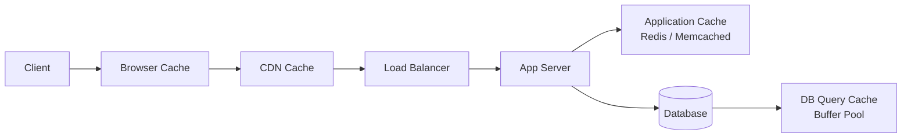
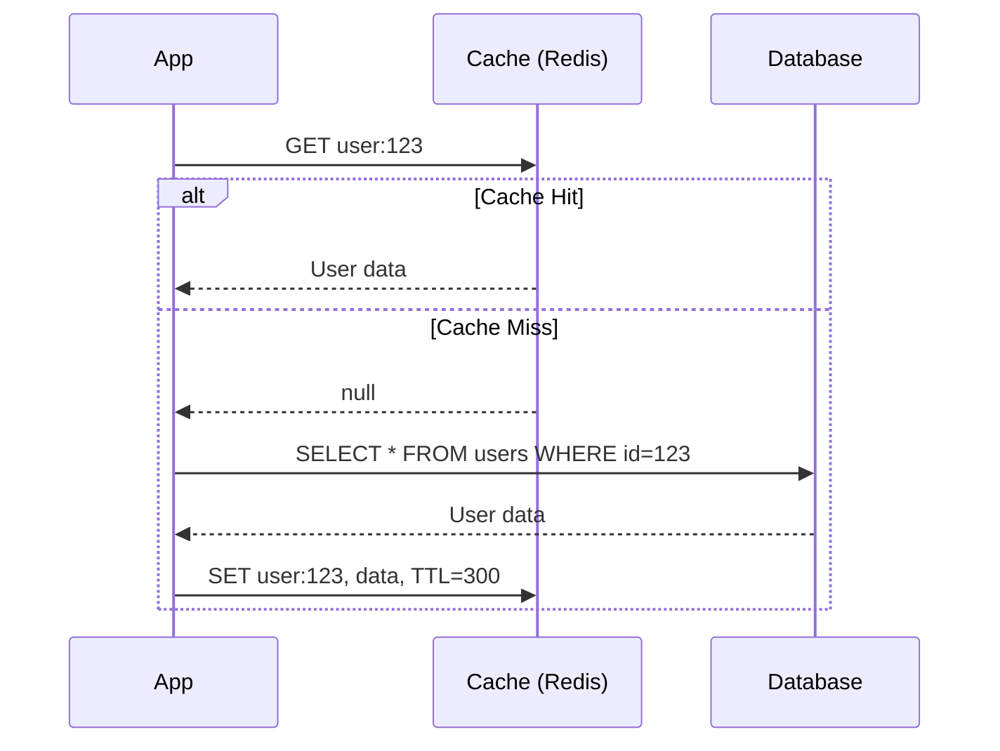
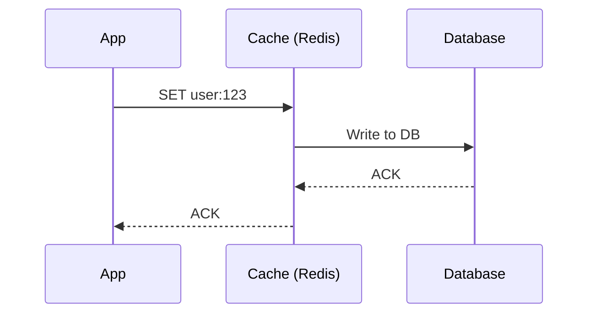
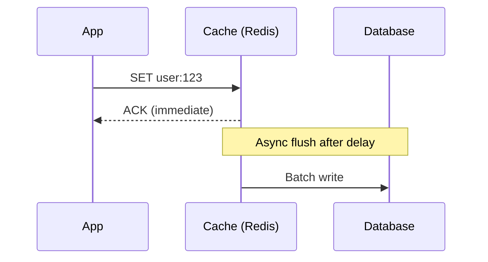
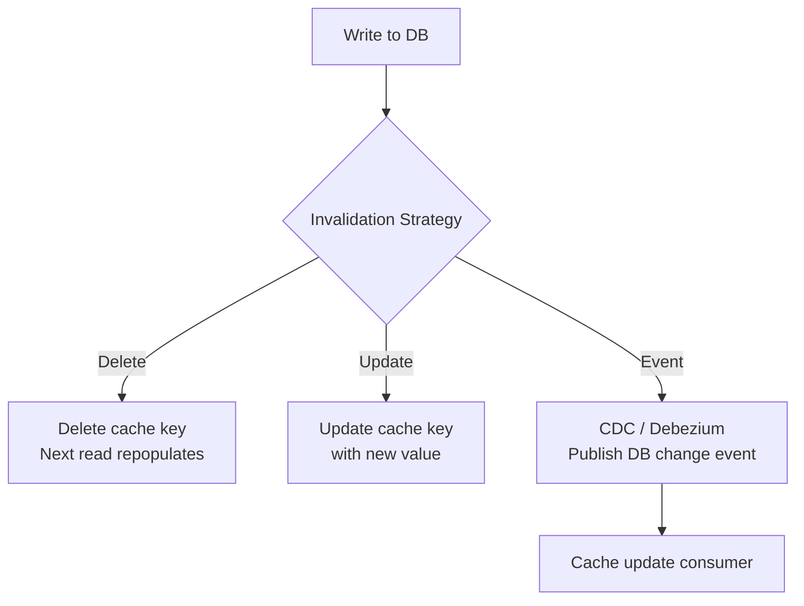
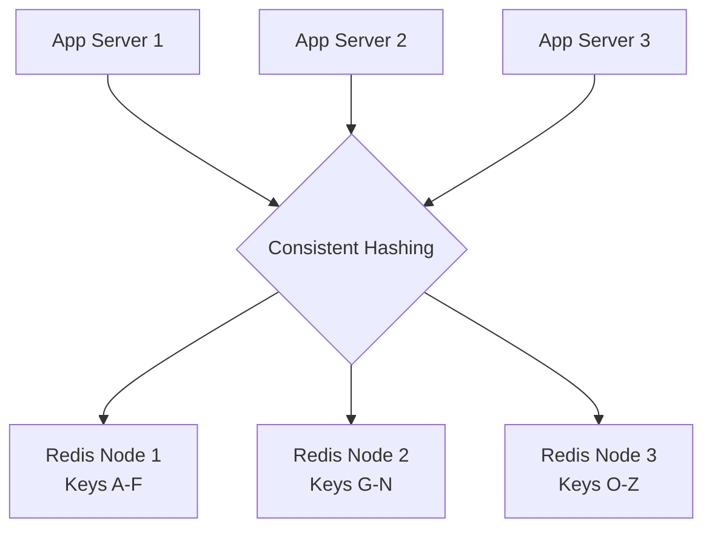

# Caching

The single most impactful performance optimization in system design. "The fastest request is the one you don't make."

---

## Why Caching?

- **Reduce latency** — serve from memory (~1ms) instead of DB (~10ms) or network (~100ms)
- **Reduce load** — fewer requests hit the database or upstream services
- **Reduce cost** — less compute, fewer DB connections, less bandwidth
- **Improve availability** — serve stale data when origin is down

---

## Cache Layers

| Layer | What's Cached | TTL | Example |
|-------|--------------|-----|---------|
| **Browser** | Static assets, API responses | Minutes-days | Cache-Control headers |
| **CDN** | Static files, API responses | Minutes-hours | Cloudflare, CloudFront |
| **Application** | DB query results, computed data | Seconds-hours | Redis, Memcached |
| **Database** | Query plans, buffer pool | Automatic | MySQL query cache, PostgreSQL shared_buffers |
| **CPU** | Instructions, data | Nanoseconds | L1/L2/L3 cache (not design-relevant) |

---

## Caching Strategies

### Cache-Aside (Lazy Loading) — Most Common

- **Pros:** Only caches what's actually requested, cache failure doesn't break reads
- **Cons:** Cache miss = 3 calls (check cache + read DB + write cache), stale data possible
- **Best for:** Read-heavy, general purpose

### Write-Through

- **Pros:** Cache always consistent with DB
- **Cons:** Higher write latency (write cache + DB), caches data that may never be read
- **Best for:** Read-heavy with strong consistency needs

### Write-Behind (Write-Back)

- **Pros:** Very fast writes, batch I/O to DB
- **Cons:** **Data loss risk** if cache crashes before flush
- **Best for:** Write-heavy, can tolerate some data loss (analytics, counters)

### Read-Through

- Cache sits in front of DB and handles reads transparently
- App only talks to cache, cache fetches from DB on miss
- Similar to cache-aside but cache manages the DB call

### Refresh-Ahead

- Proactively refresh cache entries before they expire
- Predict which keys will be needed based on access patterns
- **Best for:** Hot keys with predictable access patterns

---

## Cache Eviction Policies

| Policy | How It Works | Best For |
|--------|-------------|----------|
| **LRU** (Least Recently Used) | Evict least recently accessed | General purpose — best default |
| **LFU** (Least Frequently Used) | Evict least accessed overall | Stable hotspot workloads |
| **FIFO** (First In First Out) | Evict oldest entry | Simple, predictable |
| **TTL-based** | Expire after fixed time | Time-sensitive data |
| **Random** | Evict random entry | Surprisingly good in practice |

**Interview default:** LRU with a TTL. Mention LFU if the workload has clear hot/cold data.

---

## Redis vs Memcached

| Feature | Redis | Memcached |
|---------|-------|-----------|
| **Data structures** | Strings, hashes, lists, sets, sorted sets, streams | Strings only |
| **Persistence** | RDB snapshots + AOF | None (pure cache) |
| **Replication** | Built-in primary-replica | None |
| **Clustering** | Redis Cluster (auto-sharding) | Client-side sharding |
| **Pub/Sub** | Built-in | No |
| **Lua scripting** | Yes | No |
| **Threading** | Single-threaded (I/O threads in 6.0+) | Multi-threaded |
| **Memory efficiency** | Less (data structure overhead) | More (simpler) |

**When to use:**
- **Redis** — versatile, need data structures, persistence, pub/sub
- **Memcached** — pure caching, need multi-threaded performance, simple key-value

---

## Cache Invalidation

> "There are only two hard things in Computer Science: cache invalidation and naming things." — Phil Karlton

### Strategies

| Strategy | How | Tradeoff |
|----------|-----|----------|
| **TTL expiry** | Set expiration time on cache entries | Simple; stale data during TTL window |
| **Explicit invalidation** | Delete cache key on write | Consistent; but complex with multiple caches |
| **Event-driven** | DB change event triggers cache update (CDC) | Eventual consistency; requires infrastructure |
| **Version keys** | `user:123:v5` — increment version on update | Simple; old versions waste memory |

### Common Patterns

**Recommendation:** **Delete on write** (not update). It's simpler and avoids race conditions. Let the next read repopulate the cache.

---

## Cache Problems

### Cache Stampede (Thundering Herd)
**Problem:** Hot key expires → thousands of requests hit DB simultaneously.

**Solutions:**
- **Lock/mutex** — first request acquires lock, others wait for cache repopulation
- **Stale-while-revalidate** — serve stale value while one request refreshes
- **Probabilistic early expiration** — randomly refresh before TTL expires

### Cache Penetration
**Problem:** Requests for non-existent keys always miss cache and hit DB.

**Solutions:**
- **Cache null results** — store `null` with short TTL for missing keys
- **Bloom filter** — check if key could exist before querying DB

### Cache Avalanche
**Problem:** Many cache keys expire at the same time → DB overwhelmed.

**Solutions:**
- **Jittered TTL** — add random variance to TTL (`TTL ± random(60s)`)
- **Warm-up** — pre-populate cache before deploying new version

### Hot Key Problem
**Problem:** Single key gets extremely high traffic (celebrity post, viral content).

**Solutions:**
- **Local cache** — cache hot keys in app server memory (L1) + Redis (L2)
- **Key replication** — replicate hot key across multiple Redis shards (`key_1`, `key_2`, ...)
- **Rate limiting** — limit requests to hot key

---

## Distributed Caching Architecture

- **Consistent hashing** distributes keys across nodes
- Adding/removing nodes only remaps ~1/N keys
- Redis Cluster handles this automatically (16384 hash slots)

---

## Common Interview Questions

1. **"Where would you add caching?"** → Closest to the client that makes sense: CDN for static, Redis for DB results, in-memory for hot data
2. **"How do you keep cache consistent with DB?"** → Delete on write + TTL as safety net. For strong consistency: write-through.
3. **"What if a hot key expires?"** → Stampede prevention: lock/mutex, stale-while-revalidate, or never-expire + background refresh
4. **"Redis vs Memcached?"** → Redis for most cases (data structures, persistence, pub/sub). Memcached only for pure caching with multi-threaded performance.
5. **"How do you handle cache at scale?"** → Distributed cache with consistent hashing, local L1 cache for hot keys, monitoring hit/miss ratios
