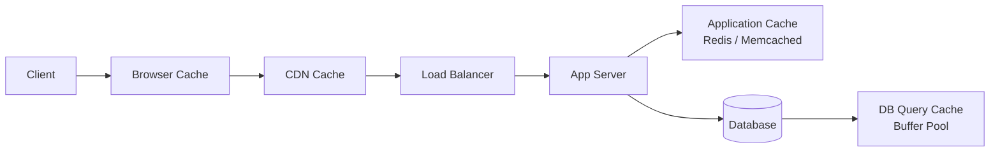
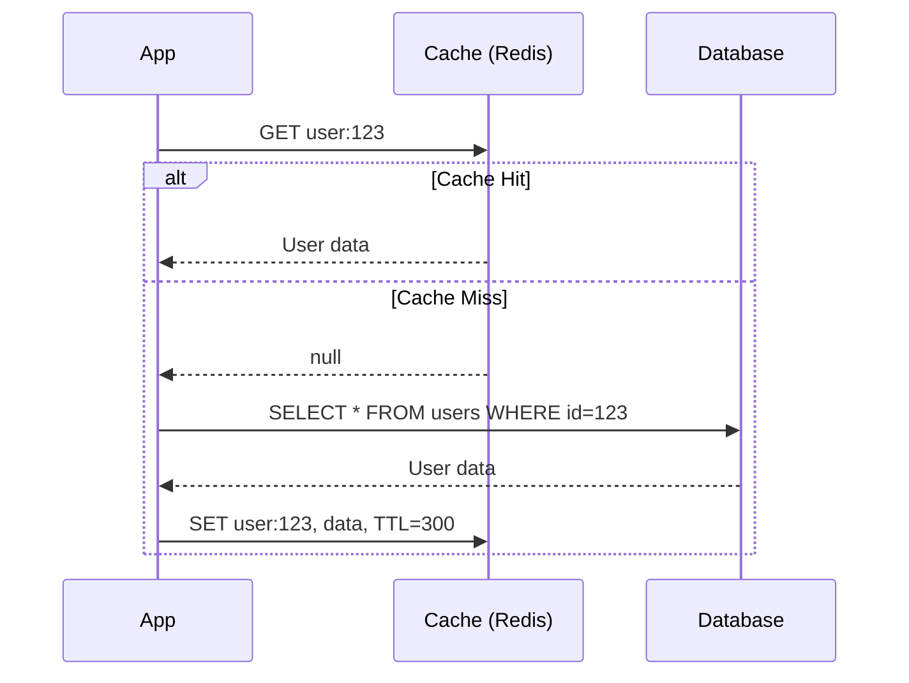
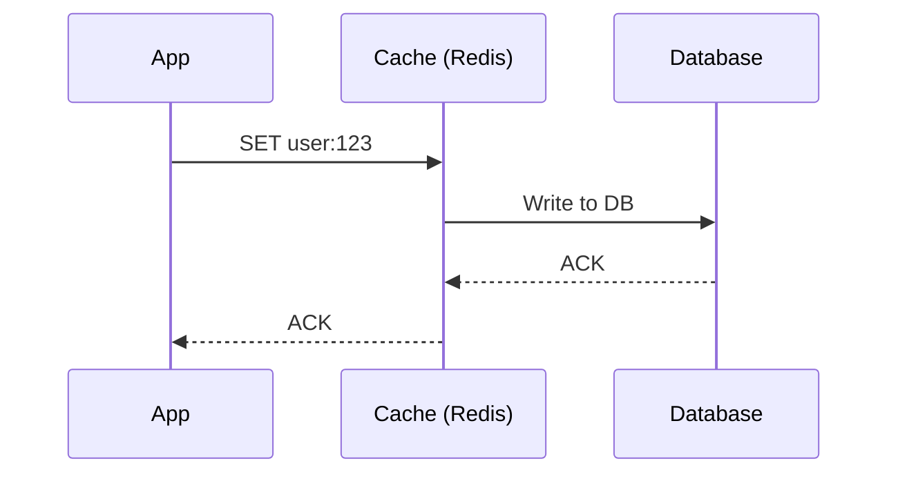
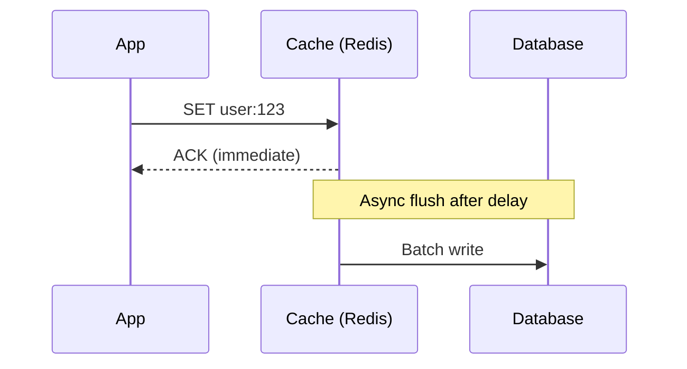
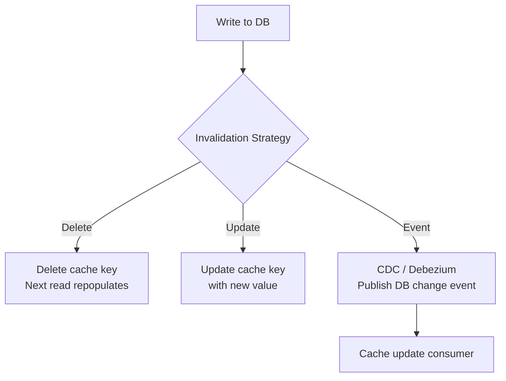
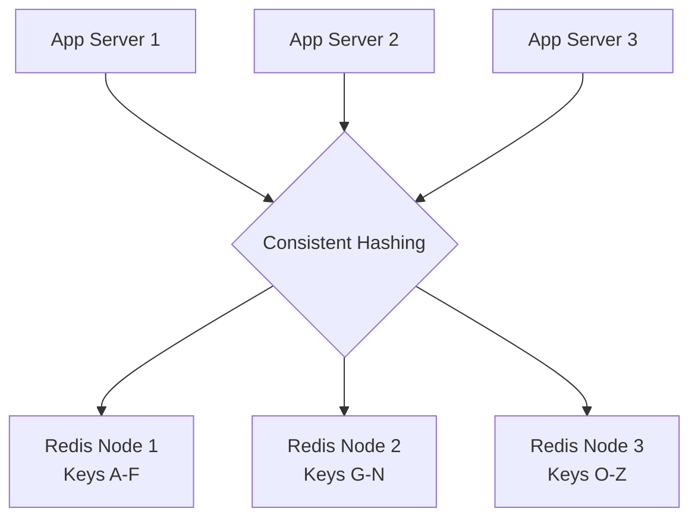
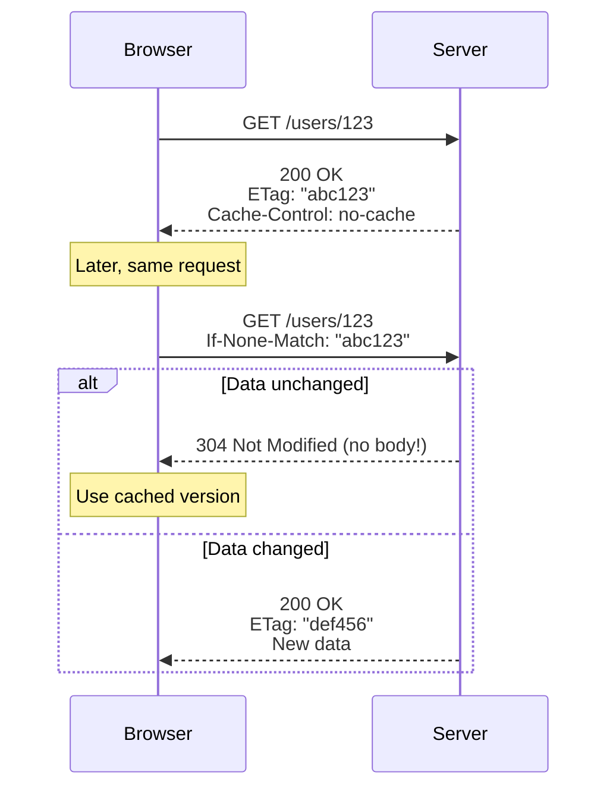
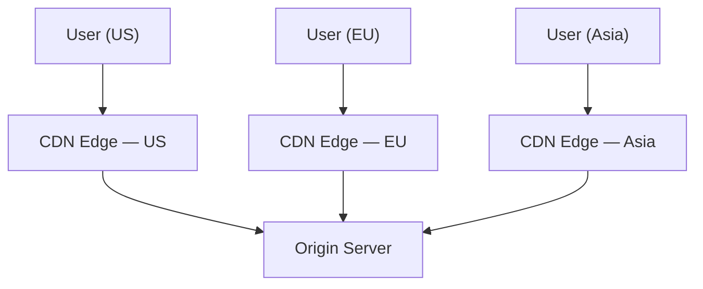
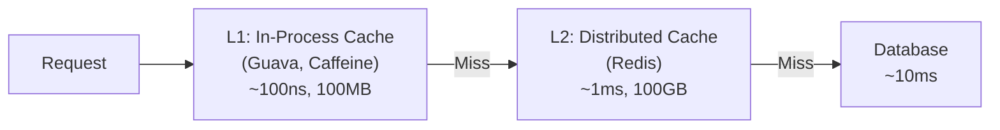
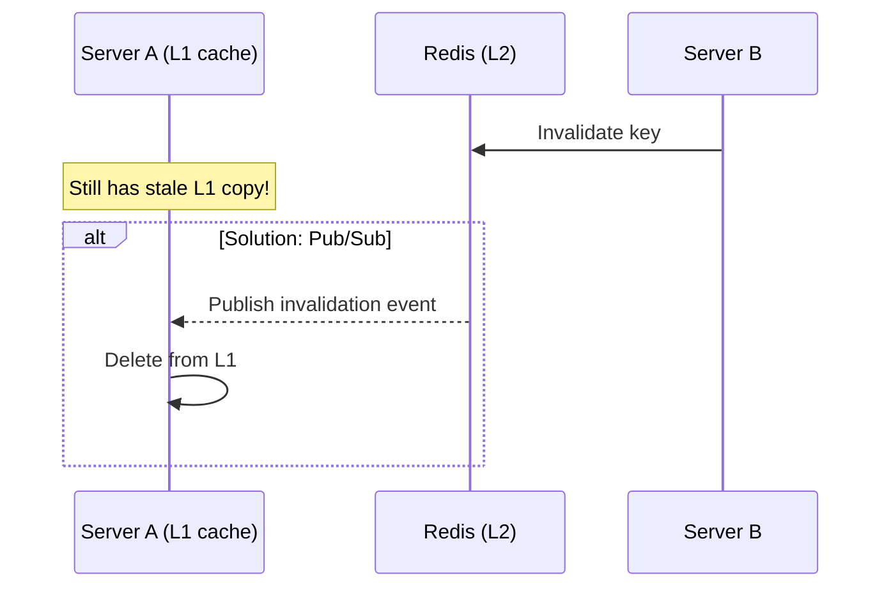

# Caching

The single most impactful performance optimization in system design. "The fastest request is the one you don't make."

---

## Why Caching?

- **Reduce latency** — serve from memory (~1ms) instead of DB (~10ms) or network (~100ms)
- **Reduce load** — fewer requests hit the database or upstream services
- **Reduce cost** — less compute, fewer DB connections, less bandwidth
- **Improve availability** — serve stale data when origin is down

---

## Cache Layers



| Layer | What's Cached | TTL | Example |
|-------|--------------|-----|---------|
| **Browser** | Static assets, API responses | Minutes-days | Cache-Control headers |
| **CDN** | Static files, API responses | Minutes-hours | Cloudflare, CloudFront |
| **Application** | DB query results, computed data | Seconds-hours | Redis, Memcached |
| **Database** | Query plans, buffer pool | Automatic | MySQL query cache, PostgreSQL shared_buffers |
| **CPU** | Instructions, data | Nanoseconds | L1/L2/L3 cache (not design-relevant) |

---

## Caching Strategies

### Cache-Aside (Lazy Loading) — Most Common



- **Pros:** Only caches what's actually requested, cache failure doesn't break reads
- **Cons:** Cache miss = 3 calls (check cache + read DB + write cache), stale data possible
- **Best for:** Read-heavy, general purpose

### Write-Through



- **Pros:** Cache always consistent with DB
- **Cons:** Higher write latency (write cache + DB), caches data that may never be read
- **Best for:** Read-heavy with strong consistency needs

### Write-Behind (Write-Back)



- **Pros:** Very fast writes, batch I/O to DB
- **Cons:** **Data loss risk** if cache crashes before flush
- **Best for:** Write-heavy, can tolerate some data loss (analytics, counters)

### Read-Through

- Cache sits in front of DB and handles reads transparently
- App only talks to cache, cache fetches from DB on miss
- Similar to cache-aside but cache manages the DB call

### Refresh-Ahead

- Proactively refresh cache entries before they expire
- Predict which keys will be needed based on access patterns
- **Best for:** Hot keys with predictable access patterns

---

## Cache Eviction Policies

| Policy | How It Works | Best For |
|--------|-------------|----------|
| **LRU** (Least Recently Used) | Evict least recently accessed | General purpose — best default |
| **LFU** (Least Frequently Used) | Evict least accessed overall | Stable hotspot workloads |
| **FIFO** (First In First Out) | Evict oldest entry | Simple, predictable |
| **TTL-based** | Expire after fixed time | Time-sensitive data |
| **Random** | Evict random entry | Surprisingly good in practice |

**Interview default:** LRU with a TTL. Mention LFU if the workload has clear hot/cold data.

---

## Redis vs Memcached

| Feature | Redis | Memcached |
|---------|-------|-----------|
| **Data structures** | Strings, hashes, lists, sets, sorted sets, streams | Strings only |
| **Persistence** | RDB snapshots + AOF | None (pure cache) |
| **Replication** | Built-in primary-replica | None |
| **Clustering** | Redis Cluster (auto-sharding) | Client-side sharding |
| **Pub/Sub** | Built-in | No |
| **Lua scripting** | Yes | No |
| **Threading** | Single-threaded (I/O threads in 6.0+) | Multi-threaded |
| **Memory efficiency** | Less (data structure overhead) | More (simpler) |

**When to use:**
- **Redis** — versatile, need data structures, persistence, pub/sub
- **Memcached** — pure caching, need multi-threaded performance, simple key-value

---

## Cache Invalidation

> "There are only two hard things in Computer Science: cache invalidation and naming things." — Phil Karlton

### Strategies

| Strategy | How | Tradeoff |
|----------|-----|----------|
| **TTL expiry** | Set expiration time on cache entries | Simple; stale data during TTL window |
| **Explicit invalidation** | Delete cache key on write | Consistent; but complex with multiple caches |
| **Event-driven** | DB change event triggers cache update (CDC) | Eventual consistency; requires infrastructure |
| **Version keys** | `user:123:v5` — increment version on update | Simple; old versions waste memory |

### Common Patterns



**Recommendation:** **Delete on write** (not update). It's simpler and avoids race conditions. Let the next read repopulate the cache.

---

## Cache Problems

### Cache Stampede (Thundering Herd)
**Problem:** Hot key expires → thousands of requests hit DB simultaneously.

**Solutions:**
- **Lock/mutex** — first request acquires lock, others wait for cache repopulation
- **Stale-while-revalidate** — serve stale value while one request refreshes
- **Probabilistic early expiration** — randomly refresh before TTL expires

### Cache Penetration
**Problem:** Requests for non-existent keys always miss cache and hit DB.

**Solutions:**
- **Cache null results** — store `null` with short TTL for missing keys
- **Bloom filter** — check if key could exist before querying DB

### Cache Avalanche
**Problem:** Many cache keys expire at the same time → DB overwhelmed.

**Solutions:**
- **Jittered TTL** — add random variance to TTL (`TTL ± random(60s)`)
- **Warm-up** — pre-populate cache before deploying new version

### Hot Key Problem
**Problem:** Single key gets extremely high traffic (celebrity post, viral content).

**Solutions:**
- **Local cache** — cache hot keys in app server memory (L1) + Redis (L2)
- **Key replication** — replicate hot key across multiple Redis shards (`key_1`, `key_2`, ...)
- **Rate limiting** — limit requests to hot key

---

## Distributed Caching Architecture



- **Consistent hashing** distributes keys across nodes
- Adding/removing nodes only remaps ~1/N keys
- Redis Cluster handles this automatically (16384 hash slots)

---

## HTTP Caching (Browser & CDN)

Understanding HTTP cache headers is critical — they control caching at the browser and CDN layer.

### Cache-Control Directives

```
# Response headers from server
Cache-Control: public, max-age=3600          # CDN + browser can cache for 1 hour
Cache-Control: private, max-age=300          # Only browser can cache (user-specific data)
Cache-Control: no-cache                       # Must revalidate with server before using
Cache-Control: no-store                       # Never cache (sensitive data)
Cache-Control: s-maxage=600                   # CDN TTL (overrides max-age for shared caches)
Cache-Control: stale-while-revalidate=60      # Serve stale for 60s while refreshing in background
Cache-Control: stale-if-error=300             # Serve stale for 5min if origin is down
Cache-Control: immutable                       # Never revalidate (versioned assets: app.a8f3e.js)
```

| Directive | Meaning | Use For |
|-----------|---------|---------|
| `public` | Any cache (CDN, browser) can store | Static assets, public API responses |
| `private` | Only browser can store | User-specific data (profile, cart) |
| `no-cache` | Cache but revalidate every time | Always-fresh data with ETag |
| `no-store` | Don't cache at all | Passwords, tokens, sensitive data |
| `max-age=N` | Fresh for N seconds | General TTL |
| `s-maxage=N` | CDN-specific TTL | Different TTL for CDN vs browser |
| `immutable` | Never expires | Fingerprinted static assets |
| `stale-while-revalidate` | Serve stale while refreshing | Background updates |

### ETag & Conditional Requests



**Why ETags matter:** 304 responses save bandwidth — no response body is sent. For large API responses, this is significant.

### Recommended Cache Headers by Resource Type

| Resource | Cache-Control | Why |
|----------|--------------|-----|
| **Fingerprinted assets** (`app.a8f3e.js`) | `public, max-age=31536000, immutable` | Hash in filename = cache forever |
| **HTML pages** | `no-cache` + ETag | Always revalidate; serve latest |
| **API (public data)** | `public, max-age=60, s-maxage=300` | Short browser TTL, longer CDN TTL |
| **API (user data)** | `private, max-age=0, no-cache` | Must revalidate, browser only |
| **Images/fonts** | `public, max-age=86400` | Cache 24h, or use fingerprinting |

---

## CDN Caching — Deep Dive



### Push vs Pull CDN

| Type | How It Works | Best For |
|------|-------------|----------|
| **Pull (origin pull)** | CDN fetches from origin on first request, caches it | Dynamic sites, most APIs — Cloudflare, CloudFront |
| **Push (pre-populate)** | You upload content to CDN proactively | Large static files, video — S3 + CloudFront |

### CDN Cache Invalidation

| Method | Speed | Use Case |
|--------|-------|----------|
| **URL versioning** | Instant (new URL = new cache) | Static assets: `/app.v2.js` or `/app.a8f3.js` |
| **Purge API** | Seconds-minutes | Emergency content removal |
| **TTL expiry** | At TTL timeout | Regular content rotation |
| **Surrogate keys / cache tags** | Seconds | Purge all resources related to a product: tag=`product:123` |

**Interview tip:** Prefer **URL versioning** (fingerprinting) over purging. Purging is slow and unreliable across global edge nodes. Changing the URL bypasses all caches instantly.

---

## Multi-Level Caching (L1 / L2)

For extremely hot paths (millions of RPS), use a two-level cache:



| Level | Technology | Latency | Capacity | Shared? |
|-------|-----------|---------|----------|---------|
| **L1 (local)** | Guava, Caffeine, `lru-cache` | ~100ns | Small (MBs) | Per-process, not shared |
| **L2 (distributed)** | Redis, Memcached | ~1ms | Large (GBs-TBs) | Shared across all servers |
| **L3 (origin)** | Database | ~10ms | Source of truth | Shared |

### Consistency Challenge

L1 cache on Server A doesn't know when Server B writes to the DB:



**Solutions:**
- **Short L1 TTL** (5-30 seconds) — stale window is short
- **Redis Pub/Sub** — broadcast invalidation to all app servers
- **Versioned keys** — check version on each L1 hit

---

## Caching Strategy Comparison

| Strategy | Read Latency | Write Latency | Consistency | Data Loss Risk | Best For |
|----------|-------------|--------------|-------------|---------------|----------|
| **Cache-Aside** | Miss penalty (3 calls) | Direct to DB | Eventual | None | General purpose, read-heavy |
| **Read-Through** | Miss handled by cache | Direct to DB | Eventual | None | Simpler app code |
| **Write-Through** | Always cached | Slower (cache + DB) | Strong | None | Read-heavy + consistency |
| **Write-Behind** | Always cached | **Fastest** | Eventual | **Yes** (crash before flush) | Write-heavy, analytics |
| **Refresh-Ahead** | Always cached (proactive) | N/A | Near-real-time | None | Predictable hot data |

---

## Cache Sizing & Monitoring

### Key Metrics to Track

| Metric | Target | Action if Bad |
|--------|--------|--------------|
| **Hit ratio** | > 95% (ideal: 99%) | Increase TTL, increase cache size, review eviction policy |
| **Miss ratio** | < 5% | Cache more aggressively, pre-warm |
| **Eviction rate** | Low / stable | If spiking → cache is too small, increase memory |
| **Latency (p99)** | < 2ms (Redis) | Check network, pipeline commands, optimize key sizes |
| **Memory usage** | < 80% of max | Leave headroom for spikes; increase if consistently high |
| **Key count** | Stable or growing predictably | If volatile → check TTLs and eviction |

### Memory Estimation

```
Given: 1M users, each cached as 2 KB JSON

Memory needed = 1M × 2KB = 2 GB
With Redis overhead (~1.5x) = 3 GB
With safety margin (1.5x) = ~5 GB Redis instance
```

### Hit Ratio Math

```
Cache hit ratio = Hits / (Hits + Misses)

If 95% hit ratio and 10,000 RPS:
  DB queries = 10,000 × 0.05 = 500 QPS (instead of 10,000!)
  
If 99% hit ratio:
  DB queries = 10,000 × 0.01 = 100 QPS
  
Going from 95% → 99% hit ratio = 5x fewer DB queries
```

---

## Cache Warming (Cold Start)

When a new cache or new deployment starts, everything is a cache miss → potential DB overload.

| Strategy | How | When |
|----------|-----|------|
| **Pre-populate on deploy** | Script loads top-N hot keys into cache before routing traffic | Deployment, new cache node |
| **Shadow warming** | New cache node silently copies traffic from old nodes | Cache migration |
| **Gradual traffic shift** | Route 1% → 10% → 50% → 100% to new node as cache warms | Rolling deploys |
| **Export/import** | Redis `BGSAVE` + restore on new node | Cache migration |

---

## When NOT to Cache

| Situation | Why |
|-----------|-----|
| **Low-traffic data** | Overhead of cache management > benefit |
| **Frequently changing data** | Cache is always stale, high invalidation cost |
| **Large unique datasets** | Low reuse = low hit ratio = wasted memory |
| **Sensitive data** | Passwords, PII — security risk in cache |
| **Already fast queries** | If DB returns in 1ms, caching adds complexity for <1ms gain |
| **Write-heavy, read-rare** | Cache never gets read before eviction |

---

## Common Interview Questions

1. **"Where would you add caching?"** → Closest to the client that makes sense: CDN for static, Redis for DB results, in-memory for hot data. Use multi-level for extreme throughput.
2. **"How do you keep cache consistent with DB?"** → Delete on write + TTL as safety net. For strong consistency: write-through. For distributed: CDC/event-driven invalidation.
3. **"What if a hot key expires?"** → Stampede prevention: lock/mutex, stale-while-revalidate, or never-expire + background refresh.
4. **"Redis vs Memcached?"** → Redis for most cases (data structures, persistence, pub/sub). Memcached only for pure caching with multi-threaded performance.
5. **"How do you handle cache at scale?"** → Distributed cache with consistent hashing, local L1 cache for hot keys, monitoring hit/miss ratios.
6. **"Explain Cache-Control headers."** → `public` = CDN + browser. `private` = browser only. `no-cache` = revalidate each time. `no-store` = never cache. `max-age` = TTL. Use ETags for conditional requests (304 Not Modified).
7. **"What is cache stampede and how to prevent it?"** → Hot key expires, thousands of concurrent requests hit DB. Solutions: mutex/lock (one request reloads), stale-while-revalidate, probabilistic early expiration.
8. **"How do you size a Redis cache?"** → Estimate: key count × avg size × 1.5 (Redis overhead) × 1.5 (headroom). Target < 80% memory usage. Monitor eviction rate.
9. **"What's the difference between cache-aside and write-through?"** → Cache-aside: app manages cache (read on miss, write to DB directly). Write-through: cache sits in front of DB, every write goes through cache then DB. Write-through gives stronger consistency but higher write latency.
10. **"How do you handle cold start after deployment?"** → Pre-warm: load hot keys before routing traffic. Or gradual traffic shift: ramp up from 1% → 100% as cache warms. Monitor hit ratio during rollout.
11. **"Push CDN vs Pull CDN?"** → Pull: CDN fetches from origin on first request (most common, Cloudflare). Push: you upload content to CDN proactively (video, large files). Prefer pull for APIs and dynamic content.
12. **"How do you invalidate CDN cache?"** → Best: fingerprinted URLs (change filename). Fallback: purge API (slow across global edges). Also: long max-age with s-maxage for CDN-specific TTL.
