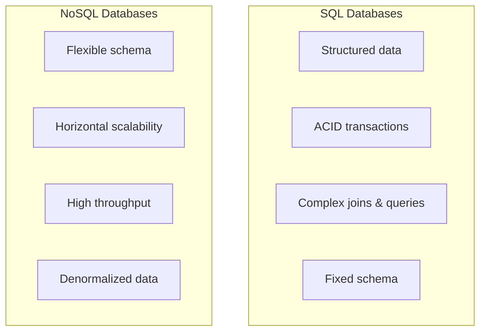
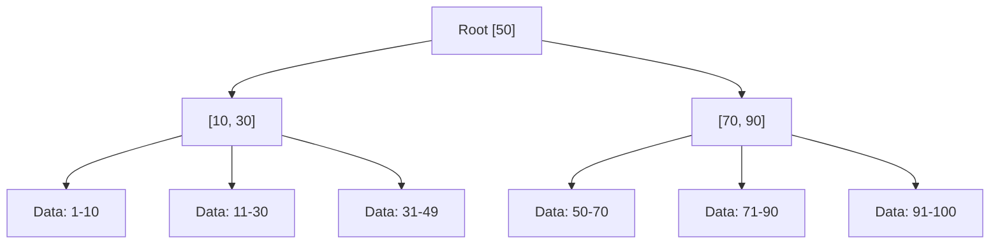
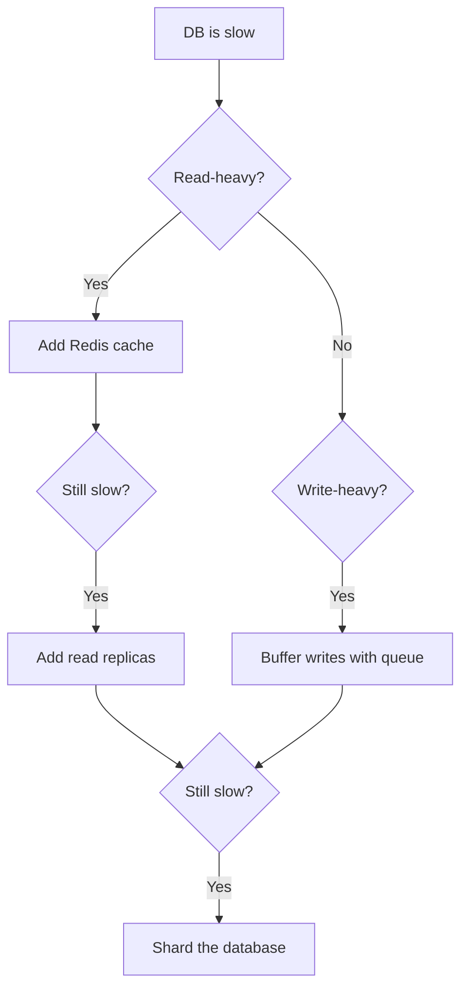

# Databases

Choosing and designing with the right database is one of the most critical decisions in system design.

---

## SQL vs NoSQL



| Feature | SQL (Relational) | NoSQL |
|---------|-----------------|-------|
| **Schema** | Fixed, predefined (ALTER TABLE to change) | Flexible, schema-on-read |
| **Scaling** | Vertical (primarily) | Horizontal (built-in sharding) |
| **Transactions** | ACID (strong guarantees) | BASE (eventual consistency, varies) |
| **Query language** | SQL (standardized) | Varies (document queries, key-value lookup) |
| **Joins** | Native, efficient | Often manual (application-level) |
| **Best for** | Complex relationships, transactions, analytics | High scale, flexible data, low-latency lookups |

---

## NoSQL Types

| Type | Data Model | Query Pattern | Examples | Use Cases |
|------|-----------|--------------|----------|-----------|
| **Key-Value** | Simple key→value | GET/SET by key | Redis, DynamoDB, Memcached | Caching, sessions, config |
| **Document** | JSON/BSON documents | Query by any field | MongoDB, CouchDB, Firestore | Content management, catalogs, user profiles |
| **Wide-Column** | Row key + column families | Row/range scans | Cassandra, HBase, ScyllaDB | Time-series, IoT, event logs |
| **Graph** | Nodes + edges | Traversals, path queries | Neo4j, Amazon Neptune | Social networks, recommendations, fraud detection |

---

## ACID Properties

| Property | What It Guarantees | Example |
|----------|-------------------|---------|
| **Atomicity** | All operations succeed or all fail | Bank transfer: debit AND credit happen together |
| **Consistency** | DB moves from one valid state to another | Constraints (FK, unique, check) always hold |
| **Isolation** | Concurrent transactions don't interfere | Two users buying the last item |
| **Durability** | Committed data survives crashes | Write-ahead log (WAL), fsync |

### Transaction Isolation Levels

| Level | Dirty Read | Non-Repeatable Read | Phantom Read | Performance |
|-------|-----------|-------------------|-------------|-------------|
| **Read Uncommitted** | ✅ | ✅ | ✅ | Fastest |
| **Read Committed** | ❌ | ✅ | ✅ | Default (PostgreSQL) |
| **Repeatable Read** | ❌ | ❌ | ✅ | Default (MySQL InnoDB) |
| **Serializable** | ❌ | ❌ | ❌ | Slowest |

**Interview tip:** Know the default for PostgreSQL (Read Committed) and MySQL (Repeatable Read).

---

## Indexing

Indexes speed up reads at the cost of slower writes and more storage.

### How B+ Tree Index Works



- All data is in leaf nodes (linked for range scans)
- O(log n) lookups vs O(n) full table scan
- Default index type in most relational databases

### Index Types

| Type | How It Works | Best For |
|------|-------------|----------|
| **B+ Tree** | Balanced tree, sorted | Range queries, equality, ORDER BY |
| **Hash** | Hash function on key | Equality lookups only (no ranges) |
| **Composite** | Index on multiple columns | Multi-column WHERE clauses |
| **Covering** | Index contains all query columns | Avoiding table lookups entirely |
| **Full-text** | Inverted index on text | Text search (LIKE, MATCH) |
| **Partial** | Index subset of rows | Frequently filtered subsets |

### Indexing Best Practices
- Index columns used in WHERE, JOIN, ORDER BY
- **Leftmost prefix rule** — composite index (a, b, c) supports queries on (a), (a,b), (a,b,c) but NOT (b) or (c)
- Don't over-index — each index slows writes and uses storage
- Use `EXPLAIN` / `EXPLAIN ANALYZE` to verify index usage

---

## Database Scaling (Quick Reference)



| Strategy | Complexity | Impact |
|----------|-----------|--------|
| Optimize queries + indexes | Low | High |
| Connection pooling | Low | Medium |
| Add caching (Redis) | Low | Very High |
| Read replicas | Medium | High |
| Vertical scaling | Low | Medium (but has limit) |
| Denormalization | Medium | Medium |
| Sharding | High | Very High |

---

## Choosing the Right Database

| Requirement | Best Choice | Why |
|-------------|------------|-----|
| Complex transactions, joins | **PostgreSQL / MySQL** | ACID, powerful SQL |
| Flexible schema, rapid iteration | **MongoDB** | Schema-less documents |
| High-write throughput, time-series | **Cassandra / ScyllaDB** | LSM-tree, distributed writes |
| Caching, leaderboards, sessions | **Redis** | In-memory, data structures |
| Search (full-text, fuzzy) | **Elasticsearch** | Inverted index, relevance scoring |
| Social graph, recommendations | **Neo4j / Neptune** | Native graph traversal |
| Analytics, data warehouse | **ClickHouse / BigQuery** | Columnar storage, aggregation |
| Global distribution | **CockroachDB / Spanner** | Distributed SQL with strong consistency |

---

## Skip List (Advanced)

Used in Redis sorted sets and some databases for O(log n) operations.

```
Level 3:  HEAD ──────────────────────────→ 50 ──────────→ NIL
Level 2:  HEAD ────────→ 20 ────────────→ 50 ────────→ NIL
Level 1:  HEAD ──→ 10 → 20 ──→ 30 ──→ 50 → 60 ──→ NIL
Level 0:  HEAD → 5 → 10 → 20 → 25 → 30 → 50 → 60 → NIL
```

- Probabilistic data structure — like a linked list with express lanes
- O(log n) insert, delete, search (expected)
- Simpler to implement than balanced BSTs
- Used in Redis for `ZSET` (sorted sets)

---

## Common Interview Questions

1. **"SQL or NoSQL for this system?"** → SQL if you need transactions/joins/complex queries. NoSQL if you need horizontal scale, flexible schema, or specific access patterns.
2. **"How would you optimize a slow query?"** → Check EXPLAIN plan → add indexes → denormalize if needed → cache → read replica
3. **"What's the difference between Read Committed and Repeatable Read?"** → RC sees other committed changes mid-transaction. RR sees a snapshot from transaction start.
4. **"When would you use a graph database?"** → Social connections, recommendation engines, fraud detection — where relationships are the primary query pattern.
5. **"How do you handle concurrent writes to the same row?"** → Optimistic locking (@Version), pessimistic locking (SELECT FOR UPDATE), or application-level conflict resolution.
