# Databases

Choosing and designing with the right database is one of the most critical decisions in system design. This guide covers internals, trade-offs, and what interviewers actually ask.

---

## SQL vs NoSQL — When to Choose

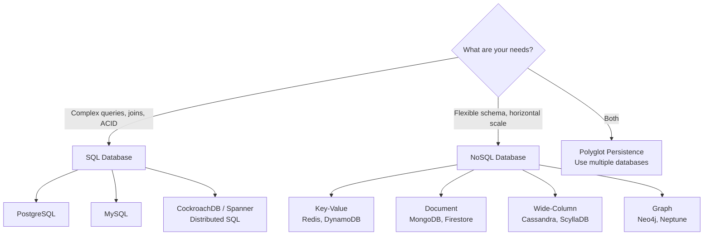

| Feature | SQL (Relational) | NoSQL |
|---------|-----------------|-------|
| **Schema** | Fixed, predefined (ALTER TABLE to change) | Flexible, schema-on-read |
| **Scaling** | Vertical (primarily); horizontal via sharding add-ons | Horizontal (built-in sharding) |
| **Transactions** | ACID (strong guarantees) | BASE (eventual consistency, varies) |
| **Query language** | SQL (standardized, powerful) | Varies (document queries, key-value lookup, CQL) |
| **Joins** | Native, efficient (hash join, merge join, nested loop) | Often manual (application-level) |
| **Schema changes** | Expensive at scale (ALTER TABLE locks) | Usually free (just add fields) |
| **Best for** | Complex relationships, transactions, analytics | High scale, flexible data, low-latency lookups |

---

## Relational Database Internals

### How a Query Executes

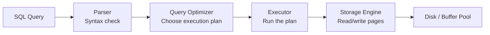

1. **Parser** — validates SQL syntax, resolves table/column names
2. **Optimizer** — generates multiple execution plans, picks the cheapest (cost-based)
3. **Executor** — runs the plan: scans, joins, sorts, aggregates
4. **Storage Engine** — manages pages/blocks on disk, buffer pool in memory

### Storage Engines

| Engine | Used By | Structure | Optimized For |
|--------|---------|-----------|---------------|
| **InnoDB** | MySQL (default) | B+ Tree (clustered index) | General OLTP, transactions |
| **PostgreSQL heap** | PostgreSQL | Heap + B+ Tree indexes | MVCC, complex queries |
| **RocksDB** | MyRocks, CockroachDB | LSM Tree | Write-heavy workloads |
| **WiredTiger** | MongoDB | B+ Tree + LSM | Document storage |

### Pages and Buffer Pool

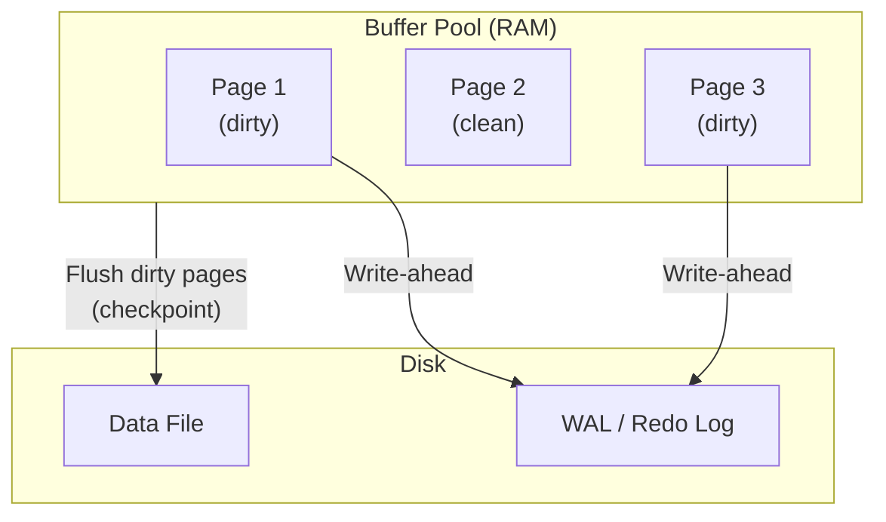

- **Page** — smallest unit of I/O (typically 8 KB in PostgreSQL, 16 KB in MySQL)
- **Buffer pool** — cache of frequently accessed pages in RAM
- **Dirty pages** — modified in memory but not yet written to disk
- **Checkpoint** — background process that flushes dirty pages to disk

**Interview insight:** "Why is the buffer pool important?" → Without it, every read = disk I/O. With a well-sized buffer pool, most reads come from RAM (~100 ns vs ~100 μs for SSD).

---

## ACID Properties

| Property | What It Guarantees | How It's Implemented |
|----------|-------------------|--------------------|
| **Atomicity** | All operations succeed or all fail | Write-ahead log (WAL) — undo on crash |
| **Consistency** | DB moves from one valid state to another | Constraints (FK, unique, check, triggers) |
| **Isolation** | Concurrent transactions don't interfere | MVCC + locks (see below) |
| **Durability** | Committed data survives crashes | WAL + fsync to disk before ACK |

### MVCC (Multi-Version Concurrency Control)

How PostgreSQL and MySQL handle concurrent access **without blocking readers**:

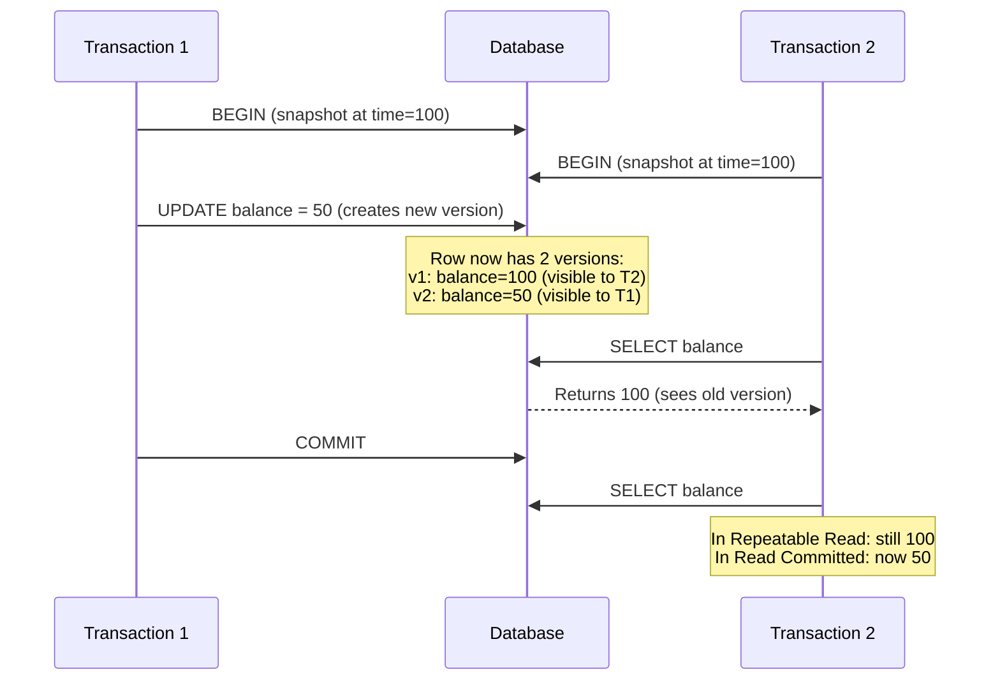

**Key concepts:**
- Each row has a **version** (PostgreSQL: `xmin`/`xmax` transaction IDs, MySQL: hidden undo log pointers)
- Readers see a **consistent snapshot** — no locks needed for reads
- Writers create **new versions** — old versions cleaned up by vacuum (PostgreSQL) or purge (MySQL)
- **PostgreSQL vacuum** — background process that reclaims old row versions (dead tuples)

### Transaction Isolation Levels

| Level | Dirty Read | Non-Repeatable Read | Phantom Read | Implementation |
|-------|-----------|-------------------|-------------|----------------|
| **Read Uncommitted** | ✅ | ✅ | ✅ | No MVCC, read current |
| **Read Committed** | ❌ | ✅ | ✅ | New snapshot per statement |
| **Repeatable Read** | ❌ | ❌ | ✅ | Snapshot at transaction start |
| **Serializable** | ❌ | ❌ | ❌ | SSI (PostgreSQL) or locking (MySQL) |

**Anomalies explained:**
- **Dirty read** — reading uncommitted data from another transaction
- **Non-repeatable read** — same query returns different result because another transaction committed a change
- **Phantom read** — same query returns different row count because another transaction inserted/deleted rows

**Defaults:** PostgreSQL = Read Committed, MySQL InnoDB = Repeatable Read.

**PostgreSQL Serializable Snapshot Isolation (SSI):** Detects serialization conflicts without locks, aborts one transaction if conflict detected. More performant than locking-based serializable.

---

## Database Types — Comprehensive Guide

### Overview

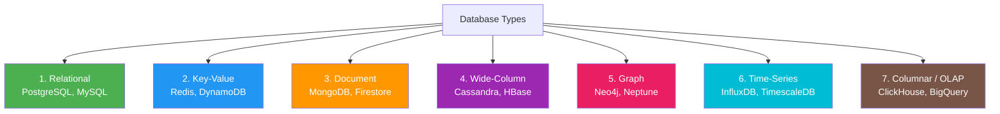

---

### 1. Relational Databases (SQL)

**Data model:** Tables with rows and columns, related by foreign keys. Fixed schema.

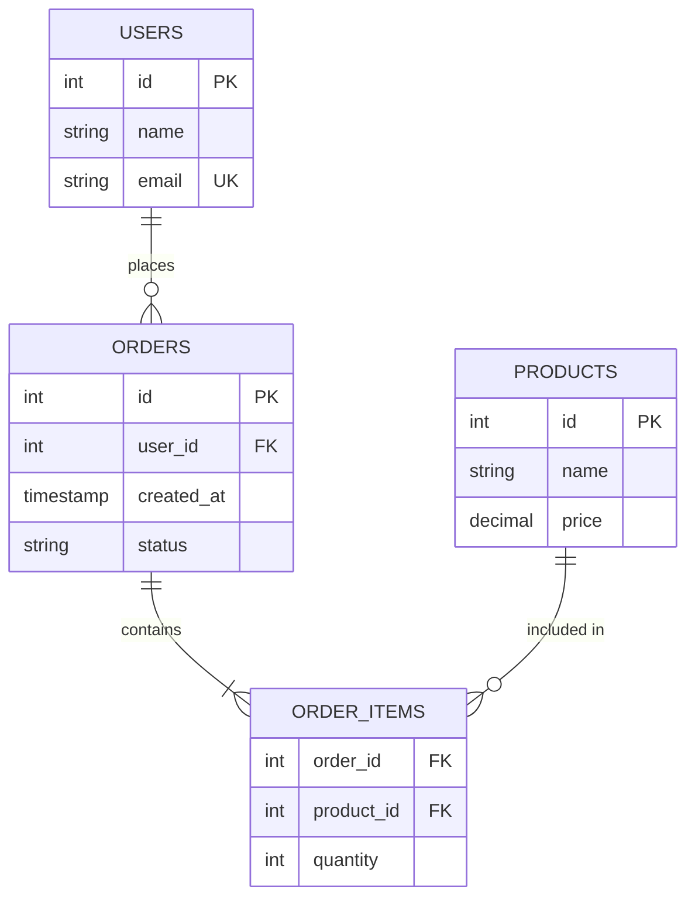

**How it stores data:**
- **Row-oriented** — stores data row by row on disk (entire row in one page)
- **B+ Tree indexes** — primary key clustered (InnoDB) or heap + separate indexes (PostgreSQL)
- **Pages/blocks** — 8 KB (PostgreSQL) or 16 KB (MySQL) as smallest I/O unit

**Strengths:**
- ACID transactions with strong guarantees
- Powerful query language (joins, subqueries, window functions, CTEs)
- Mature tooling, proven at scale for decades
- Schema enforcement catches bugs early

**Weaknesses:**
- Schema changes (ALTER TABLE) can be expensive on large tables
- Horizontal scaling requires add-ons (Vitess, Citus) or re-architecture
- Joins degrade at very high scale → need denormalization

**Key databases:**

| Database | Unique Strengths | Best For |
|----------|-----------------|----------|
| **PostgreSQL** | JSONB, PostGIS, extensions, rich types | Complex apps, analytics + OLTP, geospatial |
| **MySQL** | Simple, massive ecosystem, Aurora | CRUD-heavy apps, web backends |
| **CockroachDB** | Distributed SQL, serializable | Global distribution, strong consistency |
| **Google Spanner** | TrueTime, global consistency | Multi-region, financial systems |
| **SQLite** | Embedded, zero-config, single file | Mobile apps, embedded systems, testing |

**When to use:** You need ACID transactions, complex joins/queries, or your data is inherently relational (users → orders → items). Start here unless you have a specific reason not to.

---

### 2. Key-Value Stores

**Data model:** Simple hash map — `key → value`. Value is opaque (string, JSON, binary).

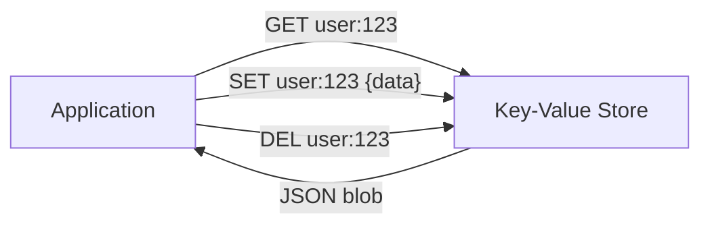

**How it stores data:**
- **In-memory** (Redis) — hash tables in RAM, optional persistence to disk
- **LSM tree** (DynamoDB, RocksDB) — write to memtable, flush to SSTables on disk
- **Lookup** — O(1) by key via hash function

**Strengths:**
- Extremely fast reads/writes (sub-millisecond for in-memory)
- Simple API (GET, SET, DEL) — hard to misuse
- Easy to shard (hash key → node)

**Weaknesses:**
- No relationships, no joins, no complex queries
- Value is opaque — can't query by fields within the value
- In-memory = expensive for large datasets

**Redis deep dive:**

| Feature | Details |
|---------|---------|
| **Data structures** | Strings, Lists, Sets, Sorted Sets (ZSET), Hashes, Streams, Bitmaps, HyperLogLog |
| **Persistence** | RDB (point-in-time snapshots) + AOF (append-only log), or both |
| **Eviction** | LRU, LFU, random, volatile-ttl, allkeys-lru, noeviction |
| **Clustering** | 16384 hash slots, multi-master, auto-sharding |
| **Pub/Sub** | Real-time message broadcasting between clients |
| **Pipelining** | Batch commands → 10x+ throughput (reduce network RTTs) |
| **Lua scripts** | Atomic execution of multi-step logic server-side |
| **Streams** | Kafka-like append-only log with consumer groups |

**DynamoDB deep dive:**

| Feature | Details |
|---------|---------|
| **Partition key** | Hash-based → determines which partition stores the item |
| **Sort key** | Optional, enables range queries within a partition |
| **GSI** | Global Secondary Index — alternate access patterns |
| **LSI** | Local Secondary Index — alternate sort key, same partition key |
| **Capacity** | On-demand (pay-per-request) or provisioned (RCU/WCU) |
| **DAX** | In-memory cache layer (microsecond reads) |
| **Streams** | CDC-like change feed for downstream processing |
| **Transactions** | `TransactWriteItems` (up to 100 items, 4 MB) |

**When to use:** Caching, sessions, rate-limiting counters, leaderboards, feature flags, distributed locks, pub/sub — anything where you look up by a known key.

---

### 3. Document Stores

**Data model:** Semi-structured documents (JSON/BSON) grouped into collections. Schema-flexible.

```json
// MongoDB document
{
  "_id": "order_abc",
  "user_id": "user_123",
  "status": "shipped",
  "items": [
    { "product": "Laptop", "price": 999, "qty": 1 },
    { "product": "Mouse", "price": 29, "qty": 2 }
  ],
  "shipping": {
    "address": "123 Main St",
    "carrier": "FedEx",
    "tracking": "FX123456"
  }
}
```

**How it stores data:**
- **WiredTiger** (MongoDB) — B+ tree with compression, document-level locking
- **Documents stored as BSON** (binary JSON) — supports richer types than JSON (dates, binary, decimal128)
- **Indexes** on any field, including nested fields and arrays

**Architecture (MongoDB sharded cluster):**

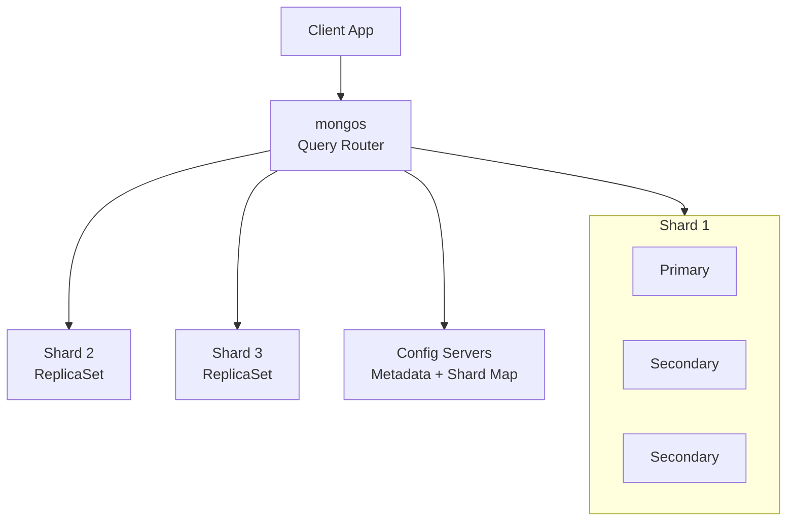

**Strengths:**
- Flexible schema — evolve without ALTER TABLE
- Natural mapping to objects in code (no ORM mismatch)
- Rich queries on nested fields, arrays
- Aggregation pipeline is extremely powerful
- Horizontal scaling with auto-sharding

**Weaknesses:**
- No native joins across collections (use `$lookup` — but it's slow)
- Denormalization leads to data duplication
- Transactions across shards are expensive
- Schema flexibility can lead to inconsistent data if not disciplined

**Key databases:**

| Database | Unique Strengths |
|----------|-----------------|
| **MongoDB** | Most popular, aggregation pipeline, change streams, Atlas (managed) |
| **Firestore** | Real-time listeners, offline sync, serverless, Google Cloud native |
| **CouchDB** | HTTP API, multi-master replication, conflict resolution |
| **Amazon DocumentDB** | MongoDB-compatible, managed AWS service |

**When to use:** Content management, product catalogs, user profiles, mobile app backends, rapid prototyping — when your data is naturally hierarchical/nested and access patterns are document-centric.

---

### 4. Wide-Column Stores

**Data model:** Row key + column families. Each row can have different columns. Sparse, distributed.

```
Row key: "user:alice"
  ├── profile:name        = "Alice"
  ├── profile:email       = "alice@example.com"
  ├── activity:login      = "2024-01-15T10:30:00Z"
  ├── activity:last_page  = "/dashboard"
  └── prefs:theme         = "dark"

Row key: "user:bob"
  ├── profile:name        = "Bob"
  └── activity:login      = "2024-01-15T09:00:00Z"
  (no prefs columns — sparse!)
```

**How it stores data:**

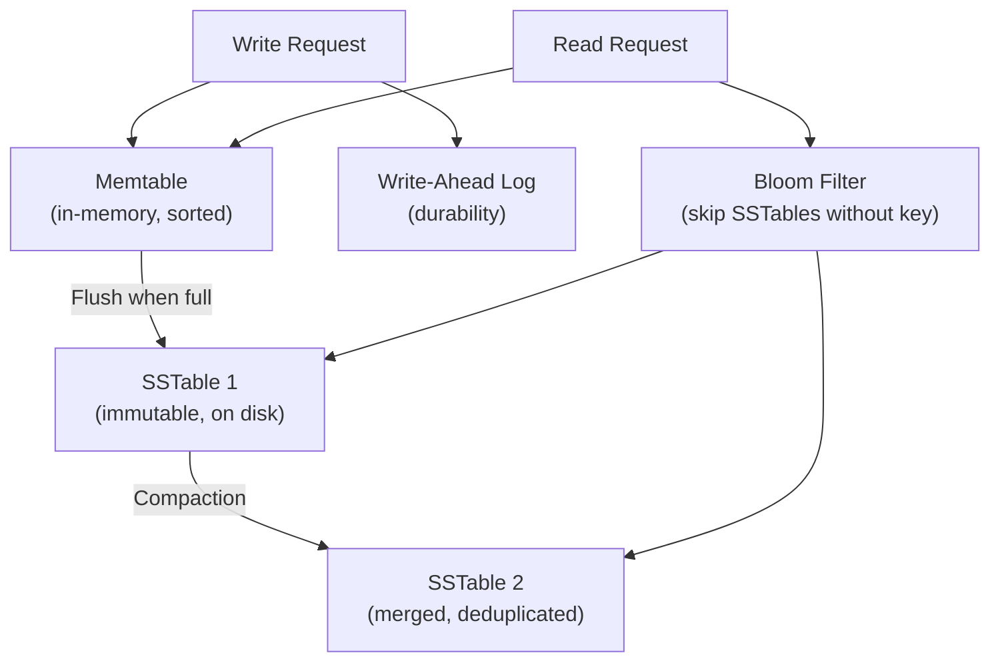

- **LSM tree** — writes go to in-memory memtable → flush to immutable SSTables → background compaction
- **Bloom filters** — probabilistic check to skip SSTables that don't contain the key
- **Consistent hashing** — partition data across a ring of nodes

**Cassandra deep dive:**

| Feature | Details |
|---------|---------|
| **Partition key** | Determines which node owns the data (consistent hash) |
| **Clustering columns** | Sort order within a partition (enables range scans) |
| **Replication factor** | Typically RF=3 (data on 3 nodes) |
| **Tunable consistency** | `ONE`, `QUORUM`, `ALL`, `LOCAL_QUORUM` per query |
| **CQL** | SQL-like, but no joins, no subqueries, no aggregations across partitions |
| **Compaction strategies** | SizeTiered, Leveled, TimeWindow |
| **Tombstones** | Soft deletes — accumulation causes read amplification |
| **Materialized views** | Auto-maintained denormalized views (use cautiously) |
| **Lightweight transactions** | Compare-and-set (Paxos-based, slow) |

**Data modeling rules:**
1. **Design tables for queries, not entities** — one table per access pattern
2. **Denormalization is expected** — duplicate data across tables
3. **Partition key design is critical** — avoid hot partitions, keep partitions < 100 MB
4. **Avoid reads from multiple partitions** — `SELECT WHERE partition_key = X` is fast, full table scan is catastrophic

**Other wide-column stores:**

| Database | Unique Strengths |
|----------|-----------------|
| **Cassandra** | Multi-DC, no single point of failure, tunable consistency |
| **ScyllaDB** | C++ rewrite of Cassandra, 10x throughput |
| **HBase** | Hadoop ecosystem, strong consistency (single-master) |
| **Google Bigtable** | Managed, powers Google Search/Maps/Analytics |

**When to use:** Time-series data, IoT sensor data, event logs, messaging systems, audit trails — any write-heavy workload with known access patterns and massive scale (billions of rows).

---

### 5. Graph Databases

**Data model:** Nodes (entities) + edges (relationships) + properties on both. Relationships are first-class citizens.

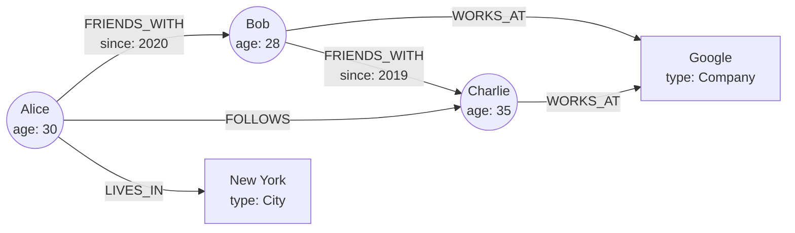

**How it stores data:**
- **Native graph storage** (Neo4j) — nodes and relationships stored with direct pointers (index-free adjacency)
- **Traversal** — following a relationship is O(1) regardless of total graph size (no joins!)
- **Non-native** (Amazon Neptune) — uses an underlying triple/quad store

**Query languages:**

```
// Cypher (Neo4j) — find friends of friends
MATCH (me:Person {name: "Alice"})-[:FRIENDS_WITH*2]->(fof:Person)
WHERE fof <> me
RETURN DISTINCT fof.name

// Gremlin (TinkerPop / Neptune)
g.V().has('name', 'Alice')
  .out('FRIENDS_WITH')
  .out('FRIENDS_WITH')
  .dedup()
  .values('name')
```

**Strengths:**
- Multi-hop traversals are O(depth), not O(data size) — no joins needed
- Naturally model connected data (what SQL needs 5+ JOIN tables for)
- Pattern matching and path-finding algorithms built in
- Schema-flexible (add new relationship types anytime)

**Weaknesses:**
- Poor at aggregation and analytics (SUM, GROUP BY)
- Limited horizontal scaling (hard to shard a graph)
- Smaller ecosystem, fewer developers
- Not suited for simple CRUD or tabular data

**Use cases with examples:**

| Use Case | Why Graph Excels |
|----------|-----------------|
| **Social networks** | Friends-of-friends, mutual connections, influence analysis |
| **Recommendation engines** | "People who bought X also bought Y" via product-user edges |
| **Fraud detection** | Detect rings of accounts with shared attributes (phones, devices, addresses) |
| **Knowledge graphs** | Entity relationships (Google Knowledge Graph, Wikipedia) |
| **Network topology** | Data center maps, dependency graphs, impact analysis |
| **Access control** | Role → Permission → Resource hierarchies |

**Key databases:**

| Database | Unique Strengths |
|----------|-----------------|
| **Neo4j** | Most popular, Cypher query language, native storage, ACID |
| **Amazon Neptune** | Managed, supports Gremlin + SPARQL |
| **ArangoDB** | Multi-model (graph + document + key-value) |
| **Dgraph** | Distributed, GraphQL-native |

**When to use:** Relationships ARE the primary query pattern. If you're doing multi-hop traversals (friend-of-friend, shortest path, connected components) or pattern matching, graph is the right choice.

**When NOT to use:** Simple CRUD, heavy aggregations, time-series data, or when data fits naturally in tables.

---

### 6. Time-Series Databases

**Data model:** Timestamped data points, typically append-only. Optimized for time-range queries and downsampling.

```
Metric: cpu.usage
Tags: {host: "web-01", region: "us-east"}
Timestamps:
  2024-01-15T10:00:00  →  72.5%
  2024-01-15T10:00:10  →  68.3%
  2024-01-15T10:00:20  →  75.1%
  2024-01-15T10:00:30  →  71.9%
```

**How it stores data:**

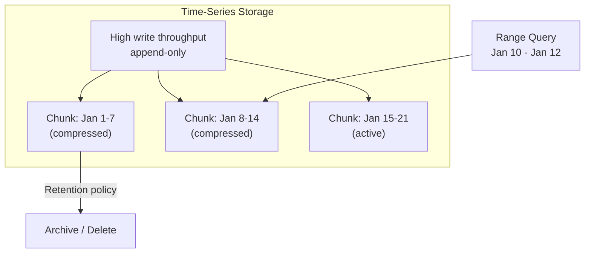

- **Time-partitioned chunks** — data split by time ranges for efficient range queries
- **Compression** — delta-of-delta encoding for timestamps, gorilla encoding for values (10-20x compression)
- **Downsampling** — automatically reduce granularity over time (1s → 1m → 1h)
- **Retention policies** — auto-delete data older than N days

**Strengths:**
- Optimized for time-range queries (WHERE time BETWEEN X AND Y)
- Extremely high write throughput (millions of data points/sec)
- Built-in downsampling and retention
- Specialized aggregation functions (rate, derivative, moving average, percentile)

**Weaknesses:**
- Poor for ad-hoc queries, joins, or non-time-based access
- Limited update/delete capabilities (append-only)
- Not suitable for transactional workloads

**Key databases:**

| Database | Architecture | Unique Strengths |
|----------|-------------|-----------------|
| **InfluxDB** | Custom TSM engine | InfluxQL + Flux languages, built-in retention/downsampling |
| **TimescaleDB** | PostgreSQL extension | Full SQL! Joins with relational data, hypertables |
| **Prometheus** | Pull-based monitoring | PromQL, Kubernetes-native, alerting rules |
| **QuestDB** | Column-based, JIT-compiled | Fastest ingestion (millions rows/sec), SQL |
| **Amazon Timestream** | Managed, serverless | AWS native, auto-tiering (memory → magnetic) |
| **VictoriaMetrics** | Prometheus-compatible | Long-term storage for Prometheus, lower resource usage |

**TimescaleDB advantage:** It's PostgreSQL underneath, so you get full SQL, joins with regular tables, and all PostgreSQL extensions. Best choice when you need time-series + relational in one system.

**When to use:** Monitoring/observability (metrics, logs), IoT sensor data, financial tick data, application analytics, fleet/device tracking.

---

### 7. Columnar / OLAP Databases

**Data model:** Same table abstraction as relational, but stored **column-by-column** instead of row-by-row.

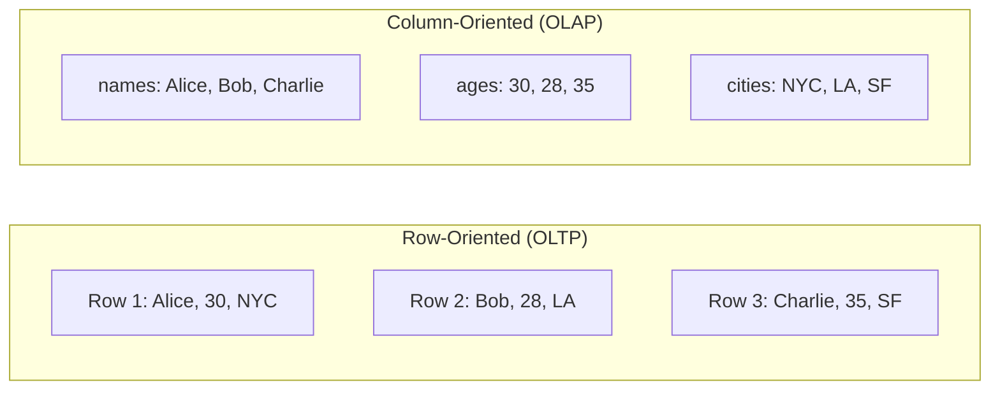

**How it stores data:**
- Each **column** stored separately on disk
- **Compression** — similar values in a column compress extremely well (dictionary, RLE, delta)
- **Vectorized execution** — process batches of column values using CPU SIMD instructions
- **Zone maps / min-max indexes** — skip entire data blocks based on column statistics

**Why columnar is faster for analytics:**

| Query | Row-Oriented | Column-Oriented |
|-------|-------------|----------------|
| `SELECT * FROM users WHERE id = 5` | ✅ Fast (read one row) | ❌ Must assemble from all columns |
| `SELECT AVG(age) FROM users` | ❌ Reads entire rows (wasteful) | ✅ Reads only age column |
| `SELECT city, COUNT(*) FROM users GROUP BY city` | ❌ Full row scan | ✅ Reads only city column, compresses well |
| Aggregation on 1B rows | Very slow | 100x+ faster |

**Strengths:**
- Orders of magnitude faster for analytical queries (aggregation, GROUP BY, scans)
- Excellent compression (10-40x for repetitive column data)
- Massive scan throughput (vectorized + SIMD)
- Materialized views for pre-computed results

**Weaknesses:**
- Slow for point lookups (single row by ID)
- Slow for row-level updates/deletes
- Not suitable for OLTP (high-frequency writes)
- Higher insert latency (must distribute across column files)

**Key databases:**

| Database | Deployment | Unique Strengths |
|----------|-----------|-----------------|
| **ClickHouse** | Self-hosted / Cloud | Fastest open-source OLAP, MergeTree engine, SQL |
| **BigQuery** | Google Cloud (serverless) | Pay-per-query, petabyte scale, no infra management |
| **Redshift** | AWS (managed) | PostgreSQL-compatible SQL, Spectrum for S3 access |
| **Snowflake** | Multi-cloud | Separate compute/storage, instant scaling, data sharing |
| **Apache Druid** | Self-hosted | Sub-second OLAP on streaming + batch data |
| **DuckDB** | Embedded (in-process) | SQLite for analytics, no server needed |

**ClickHouse specifics:**
- **MergeTree engine** — LSM-like: write to parts, merge in background
- **Primary key** — not unique! Determines data sort order for scan efficiency
- **Partitioning** — by date/month for lifecycle management
- **Materialized views** — incrementally updated as data inserts arrive
- **Approximate functions** — `uniqHLL`, `quantileTDigest` for fast approximations

**When to use:** Analytics dashboards, business intelligence, ad-hoc reporting, data warehousing, log analytics, A/B test analysis — any scenario where you're scanning millions/billions of rows with aggregation.

---

### Database Type Comparison Matrix

| Feature | Relational | Key-Value | Document | Wide-Column | Graph | Time-Series | Columnar |
|---------|-----------|-----------|----------|-------------|-------|-------------|----------|
| **Data model** | Tables + rows | Key → value | JSON documents | Row key + columns | Nodes + edges | Timestamped points | Tables (column-stored) |
| **Schema** | Fixed | None | Flexible | Flexible per row | Flexible | Semi-fixed (tags + fields) | Fixed |
| **Query** | SQL | GET/SET by key | Document queries | Partition key + range | Traversals | Time-range + aggregation | Analytical SQL |
| **Joins** | ✅ Native | ❌ | ⚠️ Limited ($lookup) | ❌ | ✅ Native (traversals) | ❌ | ✅ (but slow) |
| **Transactions** | ✅ ACID | ⚠️ Single-key | ⚠️ Multi-doc (v4+) | ⚠️ CAS only | ✅ (Neo4j) | ❌ | ❌ |
| **Write pattern** | Moderate | Very fast | Fast | Very fast (append) | Moderate | Very fast (append) | Batch (not real-time) |
| **Read pattern** | Flexible | By key only | By document/field | By partition + range | By traversal | By time range | Full column scans |
| **Scaling** | Vertical + add-ons | Horizontal | Horizontal | Horizontal | Limited | Horizontal | Horizontal |
| **Compression** | Low | Low | Medium | High | Low | Very high | Very high |
| **Examples** | PostgreSQL, MySQL | Redis, DynamoDB | MongoDB, Firestore | Cassandra, HBase | Neo4j, Neptune | InfluxDB, TimescaleDB | ClickHouse, BigQuery |

---

## Indexing — Deep Dive

### How B+ Tree Index Works

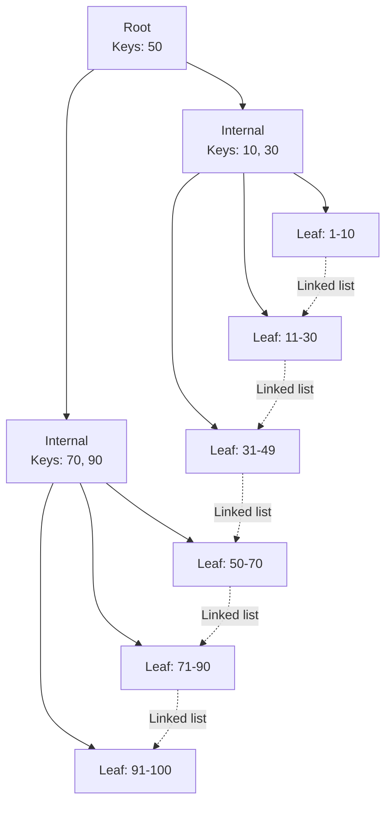

**Key properties:**
- All data is in **leaf nodes** (linked for range scans)
- **O(log n)** lookups — a table with 1 billion rows needs only ~4 levels
- Internal nodes only hold keys (high fan-out per page)
- Default index type in most relational databases

### Clustered vs Non-Clustered Index

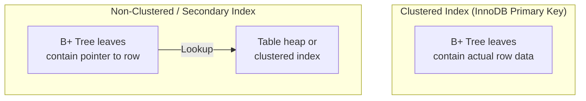

| Feature | Clustered Index | Non-Clustered (Secondary) |
|---------|----------------|--------------------------|
| **Data storage** | Row data stored in leaf nodes | Leaf stores pointer (row ID or PK) |
| **Count per table** | Exactly one | Many |
| **Range scans** | Very fast (data is physically sorted) | Requires extra lookup per row |
| **In MySQL InnoDB** | Primary key IS the clustered index | Secondary indexes store PK value |
| **In PostgreSQL** | `CLUSTER` command (one-time reorganization) | All indexes are non-clustered by default |

### Index Types

| Type | How It Works | Best For | Limitation |
|------|-------------|----------|-----------|
| **B+ Tree** | Balanced tree, sorted keys | Range queries, equality, ORDER BY, LIKE 'prefix%' | Doesn't help with LIKE '%middle%' |
| **Hash** | Hash function on key | Exact equality only | No range queries, ORDER BY |
| **GIN** (PostgreSQL) | Generalized inverted index | Full-text search, JSONB, arrays | Slower writes |
| **GiST** (PostgreSQL) | Generalized search tree | Geometric data, PostGIS | Specialized |
| **BRIN** (PostgreSQL) | Block range index | Large tables with natural ordering (timestamps) | Approximate |
| **Composite** | Multi-column B+ tree | Multi-column WHERE | Leftmost prefix rule applies |
| **Covering** | Index includes all query columns | Avoiding table lookups (index-only scan) | Larger index size |
| **Partial** | Index on subset of rows | Frequently filtered subsets (e.g., `WHERE active = true`) | Only helps matching queries |
| **Unique** | B+ tree with uniqueness constraint | Primary keys, email fields | Slightly slower inserts |

### The Leftmost Prefix Rule

For a composite index `(a, b, c)`:

| Query | Uses Index? | Why |
|-------|-----------|-----|
| `WHERE a = 1` | ✅ | First column |
| `WHERE a = 1 AND b = 2` | ✅ | First two columns |
| `WHERE a = 1 AND b = 2 AND c = 3` | ✅ | All three columns |
| `WHERE b = 2` | ❌ | Skipped first column |
| `WHERE a = 1 AND c = 3` | ⚠️ Partial | Uses `a`, can't skip `b` for `c` |
| `WHERE a = 1 ORDER BY b` | ✅ | Sort matches index order |

### Query Optimization with EXPLAIN

```sql
EXPLAIN ANALYZE SELECT * FROM orders WHERE user_id = 123 AND status = 'active';
```

**Key things to look for:**

| EXPLAIN Output | What It Means | Action |
|---------------|---------------|--------|
| **Seq Scan** | Full table scan | Add an index! |
| **Index Scan** | Using an index | Good |
| **Index Only Scan** | Serving from index alone | Best (covering index) |
| **Bitmap Index Scan** | Multiple indexes combined | OK, may need composite |
| **Nested Loop** | For each row in A, scan B | Fine for small datasets, check index on B |
| **Hash Join** | Build hash table on smaller set, probe with larger | Good for equality joins |
| **Merge Join** | Both sides sorted, merge | Good for large sorted datasets |
| **Sort** | Explicit sort step | May indicate missing index for ORDER BY |
| **rows=** high but actual low | Bad statistics | Run `ANALYZE` to update stats |

**Optimization checklist:**
1. Check `EXPLAIN ANALYZE` (not just `EXPLAIN`)
2. Look for sequential scans on large tables
3. Check estimated vs actual row counts (stale statistics?)
4. Add indexes for WHERE, JOIN, ORDER BY columns
5. Consider covering indexes for index-only scans
6. Watch for implicit type casts that prevent index usage

---

## Connection Pooling

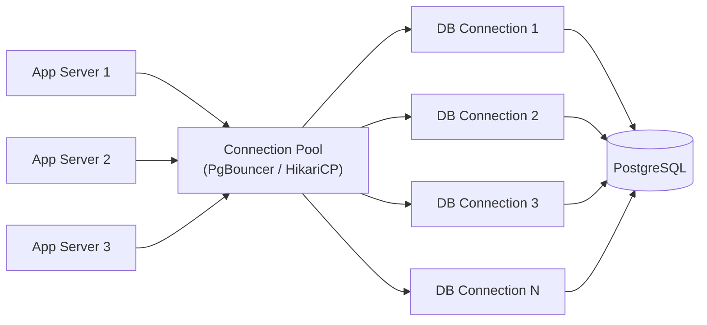

**Why pooling matters:**
- Each PostgreSQL connection = **one OS process** (~10 MB RAM)
- 1000 connections = 10 GB just for connection overhead
- Connection creation: TCP handshake + TLS + auth = **50-100ms**
- Pool reuses connections: **<1ms** to get a connection

| Tool | Type | Language |
|------|------|---------|
| **PgBouncer** | External proxy | PostgreSQL |
| **PgPool-II** | External proxy + LB | PostgreSQL |
| **HikariCP** | Library (in-app) | Java |
| **ProxySQL** | External proxy | MySQL |
| **RDS Proxy** | Managed | AWS |

**Pool sizing formula (rough):**
```
pool_size = number_of_CPU_cores * 2 + number_of_disks
```
A common starting point: 10-20 connections per app instance. Rarely need more than 100 total.

---

## Database Scaling Decision Tree

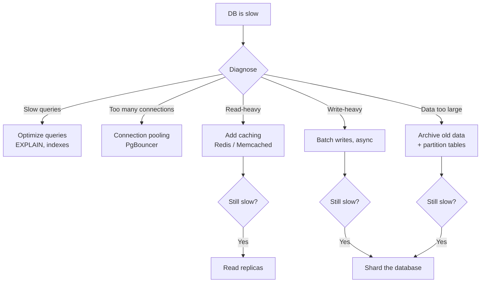

| Strategy | Complexity | When | Impact |
|----------|-----------|------|--------|
| Optimize queries + indexes | Low | Always first | High |
| Connection pooling | Low | Many connections | Medium |
| Table partitioning | Low | Large tables, time-based data | Medium |
| Add caching (Redis) | Low-Medium | Read-heavy, cacheable data | Very High |
| Read replicas | Medium | Read-heavy, can accept slight lag | High |
| Vertical scaling (bigger machine) | Low | Quick fix, has ceiling | Medium |
| Denormalization | Medium | Specific hot read paths | Medium |
| Sharding | High | Massive scale, nothing else works | Very High |

---

## PostgreSQL vs MySQL

| Feature | PostgreSQL | MySQL (InnoDB) |
|---------|-----------|----------------|
| **ACID** | Full | Full |
| **Default isolation** | Read Committed | Repeatable Read |
| **MVCC** | Heap + visibility map + vacuum | Undo log + rollback segment |
| **JSON support** | `jsonb` (binary, indexable with GIN) | `JSON` (text-based, less powerful) |
| **Full-text search** | Built-in (`tsvector`, `tsquery`) | Built-in (not as powerful) |
| **Geospatial** | PostGIS (industry standard) | Basic spatial |
| **Replication** | Logical + streaming | Binlog-based |
| **Extensions** | Very rich (PostGIS, pg_trgm, Citus) | Limited |
| **Clustered index** | No (heap-based) | Yes (PK = clustered by default) |
| **Partitioning** | Declarative (range, list, hash) | Range, list, hash, key |
| **Window functions** | Excellent | Good (since 8.0) |
| **CTEs (WITH)** | Optimized (inlined or materialized) | Optimized (since 8.0) |
| **Community** | Developer-focused, extensible | Widespread, simpler |

**Rule of thumb:** PostgreSQL for complex applications (analytics + OLTP, JSONB, geo). MySQL for simpler CRUD-heavy apps with proven tooling.

---

## Choosing the Right Database

| Requirement | Best Choice | Why |
|-------------|------------|-----|
| Complex transactions, joins, analytics | **PostgreSQL** | Most powerful open-source SQL, extensions |
| Simple CRUD, massive ecosystem | **MySQL / Aurora** | Widely adopted, AWS Aurora for scale |
| Flexible schema, rapid iteration | **MongoDB** | Schema-less documents, aggregation |
| High-write throughput, time-series | **Cassandra / ScyllaDB** | LSM-tree, distributed writes |
| Caching, leaderboards, sessions | **Redis** | In-memory, rich data structures |
| Search (full-text, fuzzy) | **Elasticsearch** | Inverted index, relevance scoring |
| Social graph, recommendations | **Neo4j / Neptune** | Native graph traversal |
| Analytics, data warehouse | **ClickHouse / BigQuery** | Columnar storage, fast aggregation |
| Global distribution, strong consistency | **CockroachDB / Spanner** | Distributed SQL, serializable |
| Serverless, low-config | **DynamoDB / Firestore** | Managed, pay-per-request |

---

## Advanced Topics

### Stored Procedures vs Application Logic

| Factor | Stored Procedures | Application Logic |
|--------|------------------|-------------------|
| **Performance** | No network round-trip per step | Network round-trip per query |
| **Portability** | Tied to DB vendor (PL/pgSQL vs MySQL) | DB-agnostic |
| **Testing** | Harder to unit test | Standard test frameworks |
| **Version control** | Separate migration workflow | Normal code deployment |
| **Best for** | Complex data transforms, batch ops | Business logic, most CRUD |

**Modern consensus:** Keep business logic in the application. Use stored procedures only for performance-critical batch operations.

### Materialized Views

Pre-computed query results stored as a table:

```sql
CREATE MATERIALIZED VIEW daily_sales AS
SELECT date, product_id, SUM(amount) as total
FROM orders
GROUP BY date, product_id;

-- Refresh periodically
REFRESH MATERIALIZED VIEW CONCURRENTLY daily_sales;
```

**Use when:** Expensive aggregations that don't need real-time freshness.

### Database Locking Patterns

| Lock Type | What | When |
|-----------|------|------|
| **Row-level lock** | `SELECT ... FOR UPDATE` | Update specific rows atomically |
| **Advisory lock** | Application-level named lock | Coordinate distributed processes |
| **Table-level lock** | `LOCK TABLE` | DDL, bulk operations |
| **Gap lock** (MySQL) | Lock range between index values | Prevent phantom reads in RR |
| **Optimistic lock** | `WHERE version = N` | Low-contention concurrent writes |

### Deadlocks

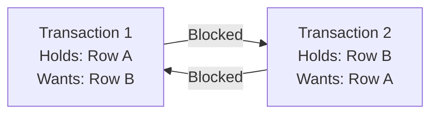

**Prevention:**
- Always lock rows in a consistent order
- Keep transactions short
- Use `lock_timeout` to fail fast
- DB auto-detects deadlocks and kills one transaction

---

## Common Interview Questions

1. **"SQL or NoSQL for this system?"** → SQL if you need transactions/joins/complex queries. NoSQL if you need horizontal scale, flexible schema, or specific access patterns. Often both (polyglot persistence).
2. **"How would you optimize a slow query?"** → Check `EXPLAIN ANALYZE` → look for seq scans → add indexes → check statistics → denormalize if needed → cache → read replica.
3. **"What's MVCC and why does it matter?"** → Multi-Version Concurrency Control. Readers see a snapshot, writers create new versions. Readers never block writers and vice versa. Essential for high-concurrency systems.
4. **"Difference between Read Committed and Repeatable Read?"** → RC takes a new snapshot per statement (sees committed changes mid-transaction). RR takes snapshot at transaction start (consistent view throughout).
5. **"When would you use a graph database?"** → When relationships ARE the query (social graphs, fraud rings, recommendation engines, knowledge graphs). Not for simple CRUD or aggregations.
6. **"How do you handle concurrent writes to the same row?"** → Optimistic locking (`@Version`/CAS), pessimistic locking (`SELECT FOR UPDATE`), or application-level conflict resolution. Start with optimistic.
7. **"How do you scale a database?"** → Optimize queries → connection pool → cache (Redis) → read replicas → shard. Each step adds complexity, only escalate when needed.
8. **"PostgreSQL vs MySQL?"** → PostgreSQL for complex queries, JSONB, extensions, analytics. MySQL for simpler apps with massive ecosystem support. Both are excellent choices.
9. **"What's connection pooling and why is it important?"** → Reuse DB connections instead of creating new ones. Each connection costs ~10 MB RAM + 50-100ms setup. PgBouncer can serve 10K clients with 50 actual connections.
10. **"What happens when a database transaction crashes mid-way?"** → WAL (Write-Ahead Log) ensures atomicity. On restart, DB replays WAL to recover committed transactions and rolls back incomplete ones.
