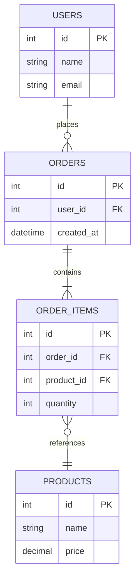
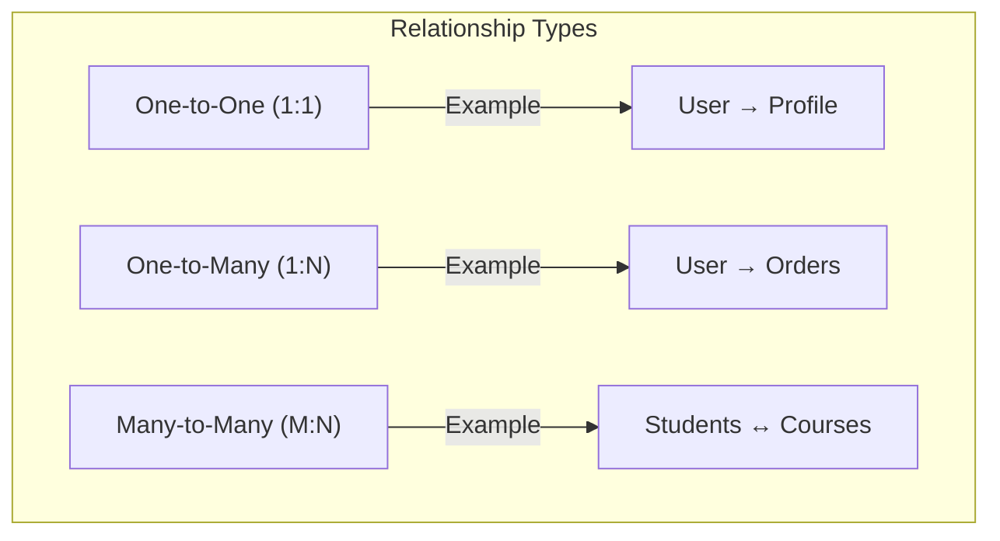

# Data Modeling

How to structure and organize data for your system — the bridge between requirements and database design.

---

## Why Data Modeling Matters

- **Shapes your queries** — the data model determines what's easy vs hard to query
- **Drives performance** — good models avoid expensive joins and full scans
- **Affects scalability** — normalized vs denormalized has massive scaling implications
- **Guides schema evolution** — well-modeled data is easier to extend

---

## Normalization vs Denormalization

### Normalization (Eliminate redundancy)



### Normal Forms (Quick Reference)

| Form | Rule | Example Violation |
|------|------|-------------------|
| **1NF** | Atomic values, no repeating groups | `tags = "java,python"` in one column |
| **2NF** | 1NF + no partial dependencies | Non-key depends on part of composite key |
| **3NF** | 2NF + no transitive dependencies | `zip → city` stored in user table |

### When to Normalize vs Denormalize

| Factor | Normalize | Denormalize |
|--------|-----------|-------------|
| **Reads** | Slower (joins needed) | Faster (data co-located) |
| **Writes** | Faster (update one place) | Slower (update multiple copies) |
| **Consistency** | Easy (single source of truth) | Hard (must sync copies) |
| **Storage** | Efficient (no duplication) | More storage |
| **Best for** | Write-heavy, OLTP, consistency | Read-heavy, OLAP, scale |

**Interview rule of thumb:** Start normalized. Denormalize strategically for performance when you can identify the hot read paths.

---

## Data Modeling for NoSQL

NoSQL requires **query-driven modeling** — design your data model around your access patterns, not around entities.

### SQL vs NoSQL Modeling Mindset

| SQL | NoSQL |
|-----|-------|
| "What data do I have?" | "What queries do I need?" |
| Normalize, join at query time | Denormalize, pre-join at write time |
| One model serves many query patterns | Different tables/collections for different queries |
| Schema first, queries later | Queries first, schema follows |

### DynamoDB Single-Table Design Example

Instead of separate tables, use one table with composite keys:

| PK | SK | Data |
|----|-----|------|
| `USER#123` | `PROFILE` | `{name, email, ...}` |
| `USER#123` | `ORDER#001` | `{total, status, ...}` |
| `USER#123` | `ORDER#002` | `{total, status, ...}` |
| `ORDER#001` | `ITEM#1` | `{product, qty, ...}` |

- **Get user profile:** `PK = USER#123, SK = PROFILE`
- **Get user's orders:** `PK = USER#123, SK begins_with ORDER#`
- **Get order items:** `PK = ORDER#001, SK begins_with ITEM#`

---

## Entity Relationships



### Modeling Strategies

| Relationship | SQL | NoSQL (Document) | NoSQL (Key-Value) |
|-------------|-----|------|------|
| **1:1** | Same table or FK | Embedded subdocument | Single key |
| **1:N** | FK on child table | Embedded array (if bounded) or reference | Composite key |
| **M:N** | Junction table | Array of references + denormalize | GSI / inverted index |

### Embedding vs Referencing (Document DBs)

| Factor | Embed | Reference |
|--------|-------|-----------|
| Read together? | ✅ Embed | ❌ Reference |
| Bounded size? | ✅ Embed | ❌ Reference (unbounded) |
| Updates? | Infrequent → Embed | Frequent → Reference |
| Size limit? | < 16MB (MongoDB) | No limit |

**Rule:** Embed what you read together. Reference what changes independently or grows unboundedly.

---

## Schema Evolution

### SQL Schema Changes
```sql
-- Adding a column (backward compatible)
ALTER TABLE users ADD COLUMN phone VARCHAR(20) DEFAULT NULL;

-- Renaming (breaking if code references old name)
ALTER TABLE users RENAME COLUMN name TO full_name;

-- Expand-contract pattern for zero-downtime
-- 1. Add new column
-- 2. Backfill data
-- 3. Update code to write to both columns
-- 4. Update code to read from new column
-- 5. Drop old column
```

### NoSQL Schema Changes
- Document DBs handle schema evolution naturally (just add fields)
- Old documents without new fields → handle with defaults in application code
- Use schema versioning: `{ "_schemaVersion": 2, ... }`

---

## Time-Series Data Modeling

| Approach | How | Example |
|----------|-----|---------|
| **Wide row** | One row per entity, columns per timestamp | Cassandra: `sensor_id → {t1: v1, t2: v2}` |
| **Narrow row** | One row per data point | `(sensor_id, timestamp) → value` |
| **Bucketing** | Group by time window | `(sensor_id, hour_bucket) → [data points]` |

**Best practices:**
- Partition by entity + time bucket (avoid hot partitions)
- Use TTL for automatic data expiration
- Pre-aggregate for dashboards (1-min, 5-min, 1-hour rollups)

---

## Data Modeling Patterns

| Pattern | When | How |
|---------|------|-----|
| **Materialized view** | Pre-compute expensive queries | Store result of complex query as a table, refresh periodically |
| **Event sourcing** | Need full audit trail | Store events, derive current state by replaying |
| **CQRS** | Read/write models differ significantly | Separate read and write databases |
| **Polymorphic** | Multiple entity types in one table | Discriminator column + nullable fields |
| **Soft delete** | Need to "undo" deletes | `deleted_at` timestamp instead of DELETE |
| **Audit trail** | Track all changes | Separate history table or event log |

---

## Common Interview Questions

1. **"How would you model the data for X?"** → Identify entities, relationships, access patterns. Start normalized. Denormalize for hot read paths.
2. **"SQL or NoSQL for this?"** → SQL if complex queries/transactions. NoSQL if need to scale writes, flexible schema, or specific access patterns (key-value, time-series).
3. **"How do you handle schema changes without downtime?"** → Expand-contract pattern: add new column → backfill → migrate code → drop old column.
4. **"How do you model many-to-many in NoSQL?"** → Denormalize: store references in both sides + use GSI/secondary index for reverse lookups.
5. **"How do you model hierarchical data?"** → Adjacency list (simple), nested sets (fast reads), materialized path (`/root/child/grandchild`), or closure table.
