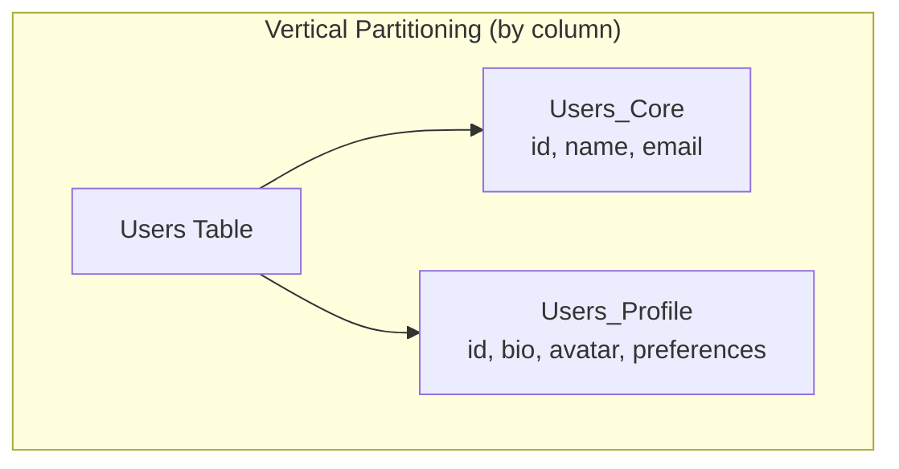
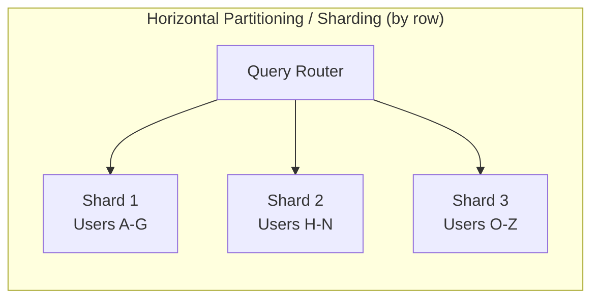
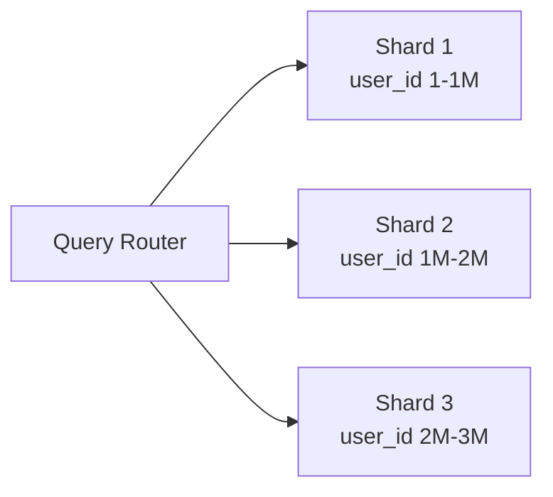
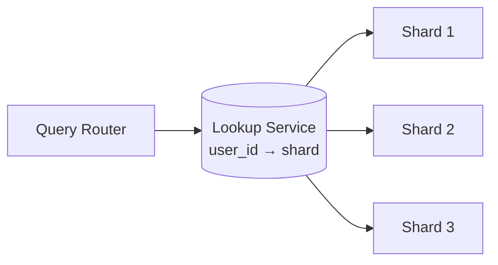

# Data Partitioning & Sharding

Splitting data across multiple database instances to handle datasets too large for a single machine.

---

## Why Partition?

- **Scale beyond single machine** — distribute data and load
- **Improve performance** — queries only scan relevant partitions
- **Increase availability** — failure of one partition doesn't affect others
- **Geographic distribution** — keep data close to users

---

## Horizontal vs Vertical Partitioning





| | Vertical Partitioning | Horizontal Partitioning (Sharding) |
|---|---|---|
| **Splits** | Columns into separate tables/DBs | Rows across multiple DB instances |
| **When** | Wide tables with distinct access patterns | Too many rows for one machine |
| **Example** | Separate frequently vs rarely accessed columns | Users A-M on Shard 1, N-Z on Shard 2 |

---

## Sharding Strategies

### 1. Range-Based Sharding



| Pros | Cons |
|------|------|
| Range queries efficient | Hot spots (new users hit latest shard) |
| Simple to understand | Uneven distribution if data isn't uniform |
| Easy to add new shards | Rebalancing is complex |

### 2. Hash-Based Sharding

```
shard_number = hash(user_id) % num_shards
```

| Pros | Cons |
|------|------|
| Even distribution | Range queries span all shards |
| No hot spots (with good hash) | Adding shards requires rehashing (see consistent hashing) |
| Simple and predictable | Cross-shard queries expensive |

### 3. Directory-Based Sharding



| Pros | Cons |
|------|------|
| Flexible mapping (any key to any shard) | Directory is single point of failure |
| Easy rebalancing (just update directory) | Extra lookup latency |
| Supports custom placement | Directory must be highly available |

### 4. Geographic Sharding

| Region | Shard | Data |
|--------|-------|------|
| US | us-shard | US users and their data |
| EU | eu-shard | EU users (GDPR compliance) |
| Asia | ap-shard | APAC users |

**Best for:** Regulatory compliance (GDPR), latency reduction, data sovereignty.

---

## Choosing a Shard Key

The shard key determines which shard a row lives on. **This is the most critical decision.**

### Good Shard Key Properties
- **High cardinality** — many unique values (avoids hot shards)
- **Even distribution** — writes spread equally across shards
- **Query alignment** — most queries include the shard key

### Examples

| System | Good Shard Key | Bad Shard Key | Why |
|--------|---------------|--------------|-----|
| Social media | `user_id` | `country` | Country is skewed (US >> Luxembourg) |
| E-commerce | `order_id` | `created_date` | All new orders hit one shard |
| Multi-tenant SaaS | `tenant_id` | `user_id` | Queries are per-tenant |
| Chat app | `channel_id` | `timestamp` | Most queries are per-channel |

---

## Cross-Shard Operations

The biggest challenge with sharding:

| Operation | Challenge | Solution |
|-----------|-----------|----------|
| **Cross-shard joins** | Data on different machines | Denormalize, or join in application |
| **Cross-shard transactions** | 2PC required, slow | Saga pattern, eventual consistency |
| **Aggregations** | Must scatter-gather across shards | Pre-aggregate, or use analytics DB |
| **Unique constraints** | Can't enforce globally | Globally unique ID generation (Snowflake) |
| **Rebalancing** | Moving data between shards | Consistent hashing, virtual shards |

---

## Rebalancing Strategies

When shards become uneven (data skew, load skew):

| Strategy | How | Disruption |
|----------|-----|-----------|
| **Fixed partitions** | Pre-create many partitions, assign to nodes | Low (move partitions, not data) |
| **Dynamic splitting** | Split when partition exceeds size threshold | Medium |
| **Consistent hashing** | Virtual nodes, smooth rebalancing | Low |
| **Manual rebalancing** | DBA decides when and how | Controllable |

---

## Sharding in Practice

| Database | Sharding Support |
|----------|-----------------|
| **MySQL** | Manual (Vitess, ProxySQL, application-level) |
| **PostgreSQL** | Citus extension, pg_partman |
| **MongoDB** | Built-in (mongos router, config servers) |
| **Cassandra** | Built-in (consistent hashing, vnodes) |
| **DynamoDB** | Built-in (partition key based) |
| **CockroachDB** | Built-in (automatic range-based) |

---

## Common Interview Questions

1. **"How would you shard a database?"** → Choose shard key based on access patterns, use hash-based for even distribution, plan for cross-shard queries.
2. **"What's the difference between partitioning and sharding?"** → Partitioning splits within one DB (e.g., table partitions). Sharding splits across multiple DB instances/machines.
3. **"How do you handle cross-shard queries?"** → Scatter-gather (query all shards, merge results), denormalize, or use a separate analytics database.
4. **"What if one shard gets too hot?"** → Re-shard (consistent hashing makes this easier), add read replicas for read-hot shards, or use directory-based sharding to move keys.
5. **"How do you choose a shard key?"** → High cardinality + even distribution + aligned with query patterns. Avoid keys that create temporal hotspots.
