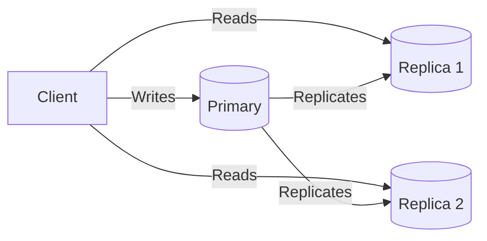
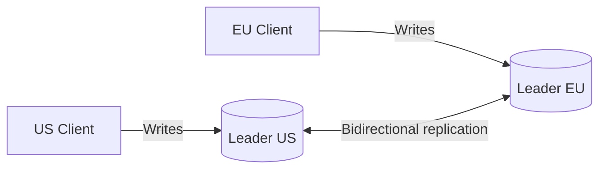
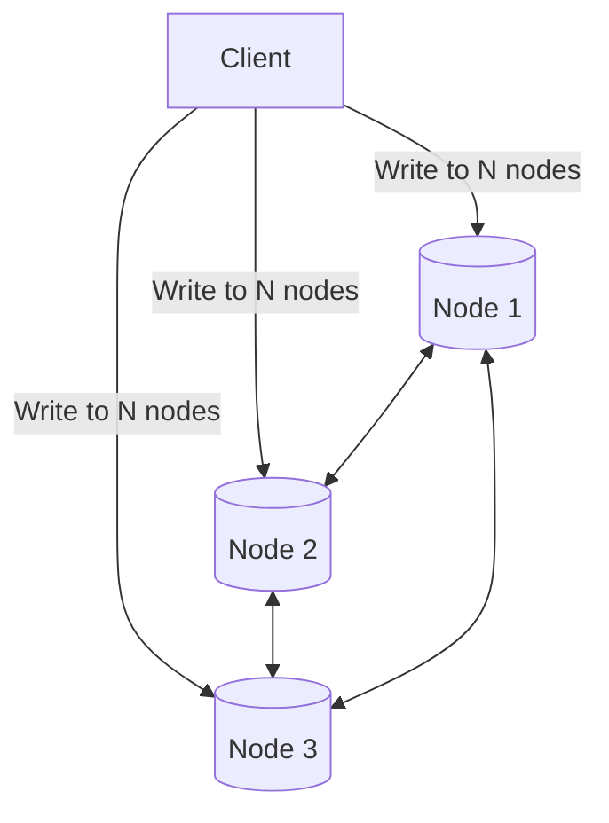
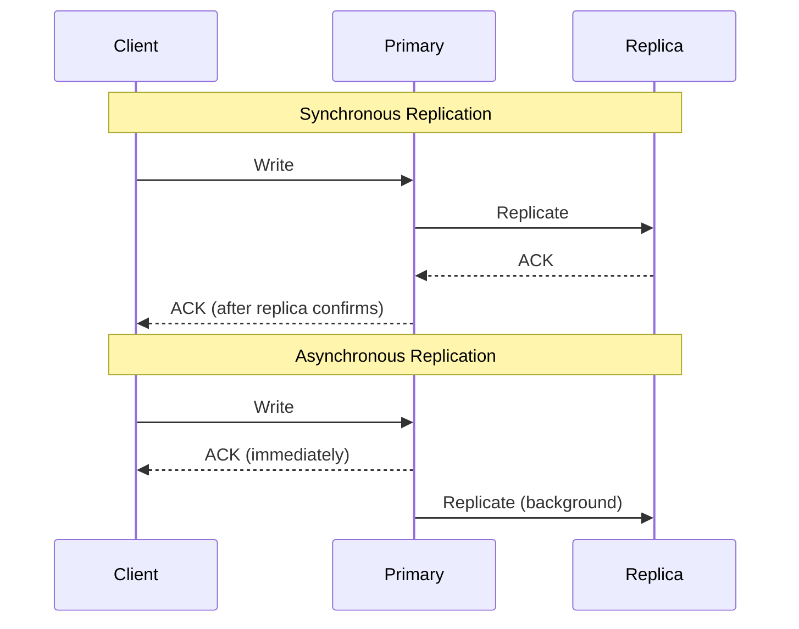
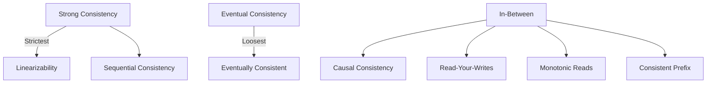

# Replication & Consistency

How data is copied across machines for reliability and performance, and the consistency trade-offs that come with it.

---

## Why Replication?

- **High availability** — survive node failures
- **Low latency** — serve reads from nearby replicas
- **Read scalability** — distribute read load across replicas
- **Disaster recovery** — survive data center failures

---

## Replication Topologies

### Single-Leader (Primary-Replica)



| Pros | Cons |
|------|------|
| Simple, well-understood | Single write bottleneck |
| No write conflicts | Leader failure = brief write outage |
| Read scalability via replicas | Replication lag → stale reads |

**Used by:** MySQL, PostgreSQL, MongoDB, Redis

### Multi-Leader



| Pros | Cons |
|------|------|
| Write in any region (low latency) | **Write conflicts** (same key updated in 2 DCs) |
| Survives entire DC failure | Complex conflict resolution |

**Conflict resolution strategies:**
- **Last-write-wins (LWW)** — latest timestamp wins (data loss risk)
- **Application-level** — merge conflicts in business logic
- **CRDTs** — conflict-free replicated data types (auto-merge)

### Leaderless (Peer-to-Peer)



- Write to W nodes, read from R nodes
- **Quorum:** W + R > N guarantees overlap (at least one node has latest)
- **Example:** N=3, W=2, R=2 → always read at least one fresh copy

**Used by:** Cassandra, DynamoDB, Riak

---

## Synchronous vs Asynchronous Replication



| | Synchronous | Asynchronous |
|---|---|---|
| **Durability** | Guaranteed on replica | Risk of data loss if leader fails |
| **Write latency** | Higher (wait for replica) | Lower (return immediately) |
| **Availability** | Replica failure blocks writes | Replica failure doesn't affect writes |
| **Use case** | Financial transactions | Most applications |

**Semi-synchronous:** One replica is synchronous (guaranteed consistent), rest are async.

---

## Consistency Models



| Model | Guarantee | Example |
|-------|-----------|---------|
| **Linearizability** | Every read returns the latest write, globally | Single-node DB, ZooKeeper |
| **Sequential** | Operations appear in some global order | Less strict than linearizable |
| **Causal** | Causally related ops seen in order | If A causes B, everyone sees A before B |
| **Read-your-writes** | You always see your own writes | After posting, you see your post |
| **Monotonic reads** | Never see older data after seeing newer | No "time travel" for a client |
| **Eventual** | All replicas converge eventually | DNS, Cassandra (default) |

---

## Replication Lag Problems

### Problem 1: Read-Your-Writes

```
User writes post → reads feed → post not visible (read hit stale replica)
```

**Fixes:**
- Read from leader for own data (read-after-write)
- Track write timestamp, route to replica that's caught up
- Use sticky sessions to same replica

### Problem 2: Monotonic Reads

```
User reads feed on Replica A (up-to-date) → next read hits Replica B (behind) → post disappears
```

**Fix:** Pin user to same replica (consistent hashing on user ID).

### Problem 3: Consistent Prefix

```
Observer sees answer before question because events replicate out of order
```

**Fix:** Causal ordering — tag events with causal dependencies.

---

## Quorum Reads/Writes

For leaderless systems (Cassandra, DynamoDB):

```
N = Total replicas
W = Write quorum (must acknowledge write)
R = Read quorum (must respond to read)

Rule: W + R > N guarantees consistency
```

| Config (N=3) | W | R | Consistency | Availability |
|-------------|---|---|-------------|-------------|
| Strong consistency | 2 | 2 | Strong | Moderate |
| Fast writes | 1 | 3 | Strong | High for writes |
| Fast reads | 3 | 1 | Strong | High for reads |
| Eventual consistency | 1 | 1 | Eventual | Highest |

### Sloppy Quorum
- If required nodes are down, write to **any available** node
- **Hinted handoff** — temporary node forwards data when original comes back
- Trades consistency for availability

---

## Vector Clocks

Used to track causality in distributed systems (detect concurrent updates):

```
Node A: {A:1}     → event at A
Node B: {B:1}     → concurrent event at B
Node A: {A:2,B:1} → A received B's update, wrote again

Concurrent: {A:1} and {B:1} → neither happened before the other → CONFLICT
Sequential: {A:1} happened before {A:2,B:1} → no conflict, merge
```

**Used by:** DynamoDB, Riak (for conflict detection)

---

## CRDTs (Conflict-Free Replicated Data Types)

Data structures that can be merged without conflicts:

| CRDT | What It Does | Example |
|------|-------------|---------|
| **G-Counter** | Grow-only counter | Like counts (each node increments locally, sum to get total) |
| **PN-Counter** | Counter with increment and decrement | Inventory count |
| **G-Set** | Grow-only set (add only) | Tags on a post |
| **OR-Set** | Set with add and remove | Shopping cart items |
| **LWW-Register** | Last-write-wins register | User profile fields |

**Used by:** Redis (CRDT-based active-active), Riak, collaborative editing

---

## Common Interview Questions

1. **"How does replication work?"** → Leader-based: writes go to leader, replicated to followers. Leaderless: write to W nodes, read from R nodes, quorum for consistency.
2. **"What's the difference between strong and eventual consistency?"** → Strong: every read returns latest write. Eventual: reads may return stale data but will converge.
3. **"How do you handle replication lag?"** → Read-your-writes (read from leader for own data), monotonic reads (pin to replica), causal consistency.
4. **"What are CRDTs?"** → Data structures that auto-merge without conflicts. Used for counters, sets, registers in distributed systems.
5. **"Multi-leader vs single-leader?"** → Single: simpler, no conflicts, write bottleneck. Multi: write in any region, must handle conflicts.
