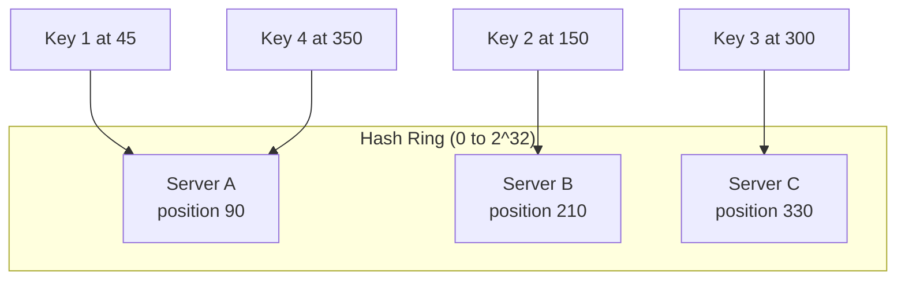
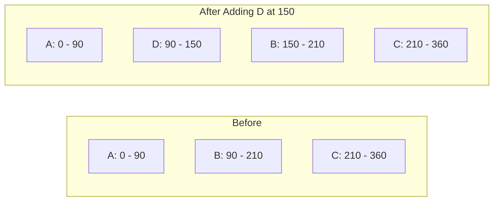
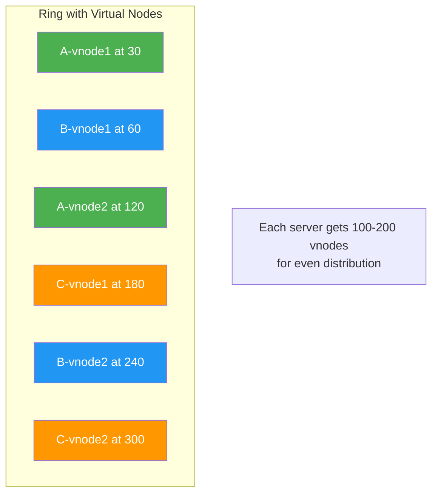

# Consistent Hashing

An elegant solution for distributing data across a changing set of nodes — essential for caches, databases, and distributed systems.

---

## The Problem with Simple Hashing

With basic modular hashing (`hash(key) % N`), adding or removing a server remaps **almost all keys**.

```
N=3 servers: hash(key) % 3
N=4 servers: hash(key) % 4  → ~75% of keys get remapped!
```

This is catastrophic for caches — a massive number of cache misses all at once (cache stampede).

---

## How Consistent Hashing Works

### The Hash Ring



1. Hash both **servers** and **keys** onto a circular ring (0 to 2^32)
2. Each key is assigned to the **first server clockwise** from its position
3. Adding/removing a server only remaps keys between it and its neighbor

### Adding a Server



**Only keys between B and D are remapped** — everything else stays. With N servers, only ~1/N keys move.

---

## Virtual Nodes (vnodes)

**Problem:** With few physical servers, data distribution can be very uneven.

**Solution:** Each physical server maps to multiple virtual nodes on the ring.



| Without vnodes | With vnodes |
|---------------|-------------|
| 3 positions per server | 100-200 positions per server |
| Uneven distribution | Very even distribution |
| Load skew with few servers | Balanced load |
| Large chunks move on rebalance | Small chunks move |

---

## Consistent Hashing in Practice

| System | How It Uses Consistent Hashing |
|--------|-------------------------------|
| **Amazon DynamoDB** | Partition data across storage nodes |
| **Apache Cassandra** | Token ring for data distribution (vnodes) |
| **Memcached** | Client-side consistent hashing for cache distribution |
| **Redis Cluster** | Hash slots (16384 fixed slots, not ring-based) |
| **Nginx** | Upstream consistent hashing for load balancing |
| **Akamai CDN** | Route content to edge servers |

---

## Implementation Sketch

```
class ConsistentHash:
    ring = SortedMap<Integer, Server>   # position → server

    addServer(server):
        for i in 0..NUM_VNODES:
            position = hash(server.id + "_" + i)
            ring.put(position, server)

    removeServer(server):
        for i in 0..NUM_VNODES:
            position = hash(server.id + "_" + i)
            ring.remove(position)

    getServer(key):
        position = hash(key)
        # Find first server clockwise from position
        entry = ring.ceilingEntry(position)
        if entry == null:
            entry = ring.firstEntry()  # wrap around
        return entry.server
```

Key properties:
- TreeMap/sorted structure for O(log N) lookup
- Typically 100-200 vnodes per server for balance
- MD5 or MurmurHash for uniform distribution

---

## Redis Cluster: Hash Slots (Alternative Approach)

Redis uses a **fixed 16384 hash slots** instead of a ring:

```
slot = CRC16(key) % 16384
```

| Node | Assigned Slots |
|------|---------------|
| Node A | 0 - 5460 |
| Node B | 5461 - 10922 |
| Node C | 10923 - 16383 |

**Rebalancing:** Move ranges of slots between nodes. Simpler than vnodes, but less granular.

---

## Common Interview Questions

1. **"What is consistent hashing and why is it needed?"** → Distributes keys on a ring so adding/removing a node only remaps ~1/N keys. Needed for caches, databases, and load balancers where rehashing everything is catastrophic.
2. **"What are virtual nodes?"** → Multiple positions per server on the ring for better distribution. More vnodes = more even load balance.
3. **"How does adding a server work?"** → Place server (+ vnodes) on ring. Only keys between new server and its predecessor are remapped. Other keys untouched.
4. **"Consistent hashing vs hash slots?"** → Ring is more flexible for heterogeneous servers. Hash slots (Redis) are simpler and easier to manage operationally.
5. **"Where is consistent hashing used?"** → DynamoDB, Cassandra, Memcached, CDNs, load balancers — any system that distributes data across a dynamic set of nodes.
