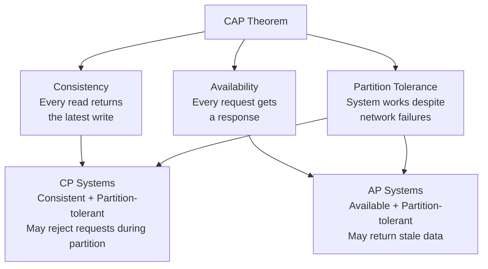
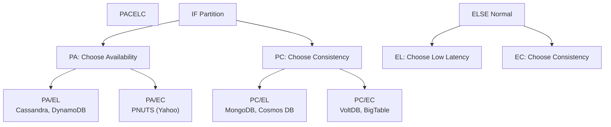
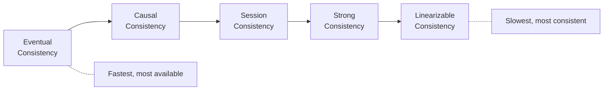

# CAP Theorem & PACELC

The fundamental trade-offs in distributed system design.

---

## CAP Theorem

In a distributed system, you can only guarantee **two of three** properties simultaneously:



### Why Not All Three?

During a **network partition** (some nodes can't communicate):
- **Choose Consistency (CP):** Reject requests rather than return stale data → sacrifices availability
- **Choose Availability (AP):** Return whatever data is available, even if stale → sacrifices consistency

**You must tolerate partitions** in any distributed system — they will happen. So the real choice is **C vs A during a partition**.

---

## CP vs AP Systems

| Aspect | CP (Consistency) | AP (Availability) |
|--------|-----------------|-------------------|
| **During partition** | Some requests fail / timeout | All requests succeed, may be stale |
| **Use when** | Correctness is critical | Availability is critical |
| **Examples** | Banking, inventory, leader election | Social media, DNS, shopping cart |
| **DB examples** | ZooKeeper, HBase, MongoDB (default) | Cassandra, DynamoDB, CouchDB |

### Real-World Examples

| System | Choice | Why |
|--------|--------|-----|
| **Bank transfer** | CP | Can't allow double-spend or lost money |
| **Stock trading** | CP | Must show accurate prices |
| **Social media feed** | AP | Better to show slightly stale feed than nothing |
| **DNS** | AP | Better to resolve to slightly stale IP than fail |
| **Shopping cart** | AP | Add items, reconcile later (Amazon's approach) |
| **User sessions** | AP | Better to stay logged in with stale data |

---

## PACELC Theorem

CAP only describes behavior **during a partition**. PACELC extends it to **normal operation**:

```
if (Partition) → choose A or C
else (normal) → choose Latency or Consistency
```



| Database | PACELC | Meaning |
|----------|--------|---------|
| **Cassandra** | PA/EL | Available during partition, low latency normally |
| **DynamoDB** | PA/EL | Same as Cassandra |
| **MongoDB** | PC/EC | Consistent during partition, consistent normally |
| **PostgreSQL** (single) | PC/EC | Consistent always (single node = no partition) |
| **Cosmos DB** | Configurable | Choose per-read consistency level |
| **CockroachDB** | PC/EC | Strong consistency, distributed SQL |

---

## Consistency Spectrum

CAP's "C" is binary, but in practice consistency is a spectrum:



Most real systems don't choose pure CP or AP — they offer **tunable consistency**:

| Database | Tunability |
|----------|-----------|
| **Cassandra** | Per-query: `ONE`, `QUORUM`, `ALL` |
| **DynamoDB** | Strong or eventual reads |
| **Cosmos DB** | 5 levels: strong, bounded staleness, session, consistent prefix, eventual |
| **MongoDB** | Read/write concern levels |

---

## BASE vs ACID

| Property | ACID | BASE |
|----------|------|------|
| **Consistency** | Strong (immediate) | Eventual |
| **Availability** | Lower during contention | Higher |
| **Concurrency** | Pessimistic locking | Optimistic, conflict resolution |
| **Use case** | Banking, inventory | Social media, analytics, caching |

```
ACID: Atomicity, Consistency, Isolation, Durability
BASE: Basically Available, Soft-state, Eventually consistent
```

---

## Practical Guidelines

### When to Choose CP
- Financial transactions (double-spend prevention)
- Inventory management (overselling prevention)
- Configuration systems (all nodes must agree)
- Leader election and distributed locks

### When to Choose AP
- User-facing features where stale data is acceptable
- Caching layers
- Analytics and logging
- Content delivery
- Shopping carts (reconcile on checkout)

### The Pragmatic Middle Ground
Most systems aren't purely CP or AP. They use different consistency levels for different operations:

```
User profile read → Eventual consistency (AP — fast, tolerate stale)
Password change  → Strong consistency (CP — must be immediate)
Payment          → Strong consistency (CP — can't lose money)
News feed        → Eventual consistency (AP — stale feed is fine)
```

---

## Common Interview Questions

1. **"Explain CAP theorem"** → In a distributed system during a network partition, you must choose between consistency (reject requests) and availability (serve stale data). In practice, partitions are inevitable.
2. **"Is this system CP or AP?"** → Depends on the operation. Most real systems are hybrid — strong consistency for critical paths, eventual for everything else.
3. **"What's PACELC?"** → Extends CAP: during partition choose A or C, during normal operation choose Latency or Consistency. More useful for real database comparisons.
4. **"What does eventual consistency mean?"** → All replicas will converge to the same value given enough time. Reads may return stale data temporarily.
5. **"How do you handle the trade-off in practice?"** → Use tunable consistency. Strong consistency for writes/payments/inventory. Eventual for reads/feeds/analytics.
