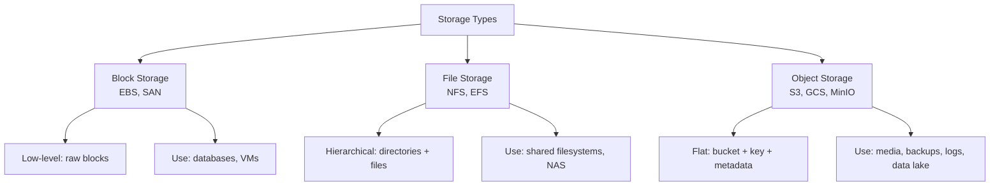
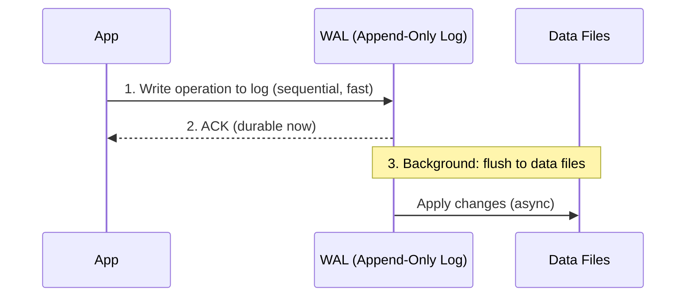
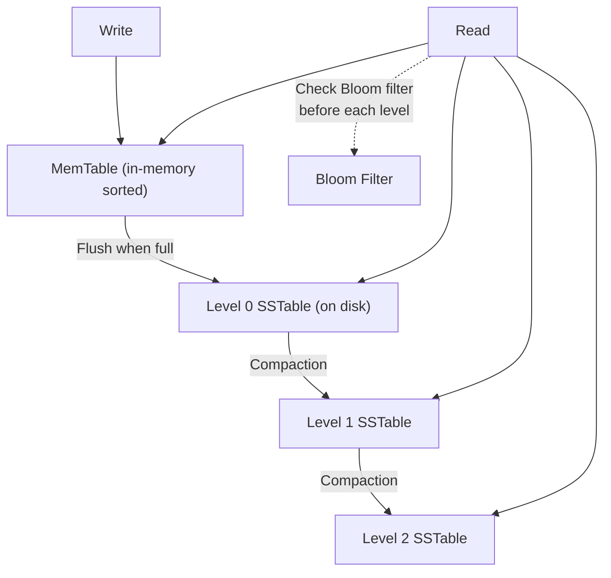
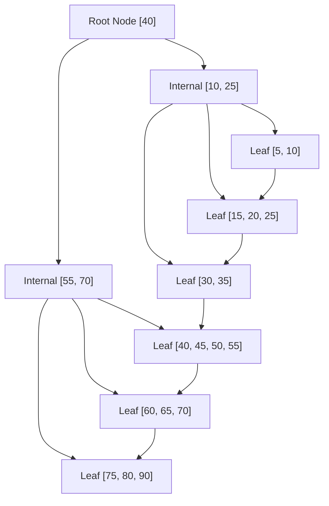
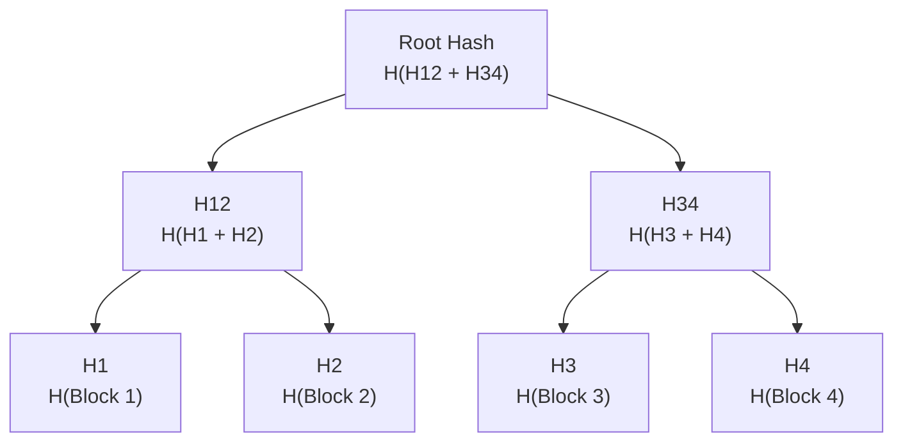
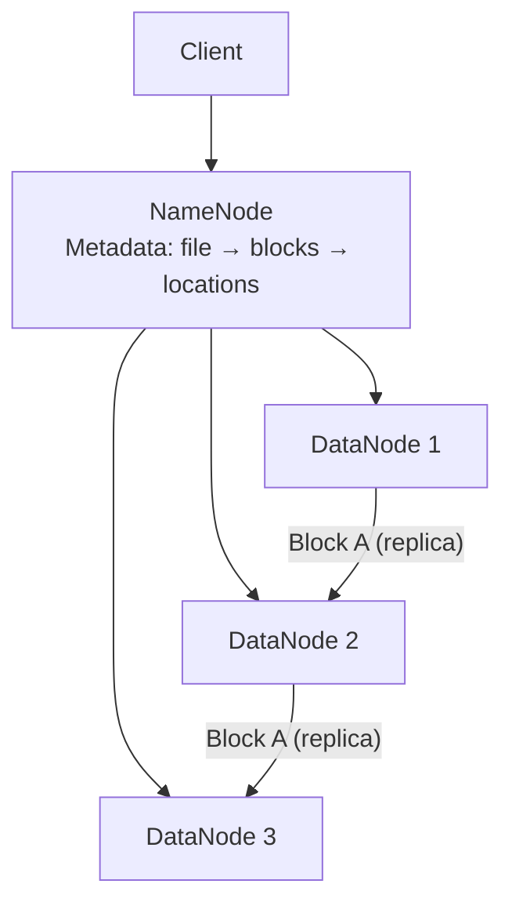
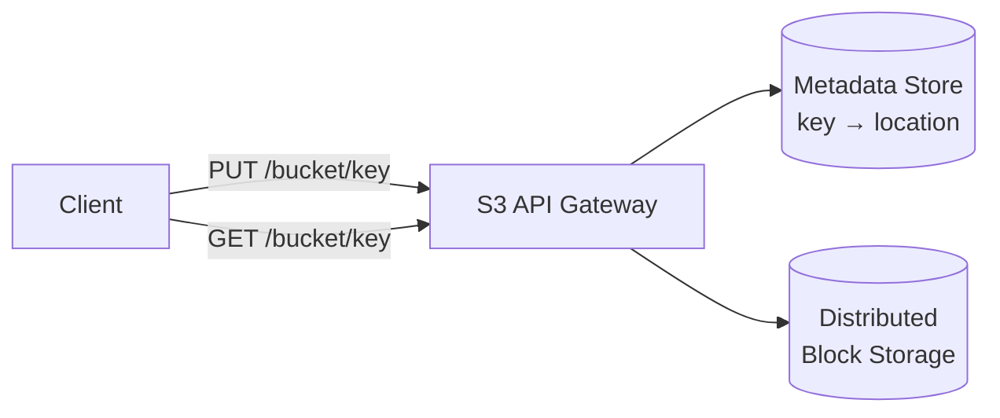

# Storage Systems

How data is stored at the infrastructure level — block storage, object storage, file systems, and the data structures that power them.

---

## Storage Types

| Feature | Block Storage | File Storage | Object Storage |
|---------|-------------|-------------|----------------|
| **Abstraction** | Raw blocks (sectors) | Files in directories | Objects in buckets |
| **Access** | Mount as disk, byte-level | NFS/SMB mount, file-level | REST API (GET/PUT) |
| **Performance** | Highest (low latency) | Moderate | Lower (HTTP overhead) |
| **Scalability** | Limited (single server) | Moderate | Virtually unlimited |
| **Cost** | $$$$ | $$$ | $ |
| **Use case** | Databases, OS disks | Shared files, CMS | Media, backups, data lake |
| **Examples** | AWS EBS, Azure Disk | AWS EFS, NFS | AWS S3, GCS, MinIO |

---

## Write-Ahead Log (WAL)

The foundational durability mechanism for databases.

**Why WAL?**
- Sequential writes to log are **10-100x faster** than random writes to data files
- On crash: replay WAL to recover uncommitted changes
- **Used by:** PostgreSQL, MySQL (InnoDB redo log), SQLite, Kafka, etcd

---

## LSM Tree (Log-Structured Merge Tree)

Optimized for **write-heavy** workloads. Used by Cassandra, RocksDB, LevelDB, HBase.

| Operation | How | Performance |
|-----------|-----|-------------|
| **Write** | Append to memtable → flush to SSTable | O(1) amortized — very fast |
| **Read** | Check memtable → L0 → L1 → ... | O(log N) — slower (check multiple levels) |
| **Compaction** | Merge SSTables, remove tombstones | Background I/O |

**Trade-off:** Fast writes, slower reads. Use **Bloom filters** to skip levels that don't contain the key.

### LSM vs B+ Tree

| Feature | LSM Tree | B+ Tree |
|---------|----------|---------|
| **Write** | Fast (sequential, append-only) | Slower (random I/O for page updates) |
| **Read** | Slower (check multiple levels) | Fast (single tree traversal) |
| **Space** | Write amplification from compaction | More predictable |
| **Best for** | Write-heavy (logs, time-series, ingestion) | Read-heavy (OLTP, general purpose) |
| **Used by** | Cassandra, RocksDB, LevelDB | PostgreSQL, MySQL, SQLite |

---

## B+ Tree

The default data structure for most relational database indexes.

Key properties:
- **All data in leaf nodes** (internal nodes are just guides)
- **Leaf nodes linked** for efficient range scans
- **Balanced** — O(log n) for all operations
- **High fan-out** — few levels even for billions of rows (typically 3-4 levels)

---

## Merkle Tree

Used for **data integrity verification** in distributed systems.

**How it works:**
- Hash every data block at the leaves
- Parent = hash of children
- To verify any block, only need O(log N) hashes (not entire dataset)

**Used by:**
- **Cassandra** — anti-entropy repair (detect out-of-sync replicas)
- **HDFS** — data integrity checks
- **Git** — commit tree integrity
- **Blockchain** — transaction verification
- **BitTorrent** — piece verification

---

## Distributed File Systems

### HDFS (Hadoop Distributed File System)

| Feature | Detail |
|---------|--------|
| **Block size** | 128MB (vs 4KB in regular FS) — optimized for large files |
| **Replication** | Default 3 replicas across racks |
| **NameNode** | Single master for metadata (SPOF → standby NameNode) |
| **DataNode** | Stores actual data blocks |
| **Best for** | Batch processing (MapReduce, Spark), data lakes |
| **Not for** | Low-latency random reads, small files |

---

## Object Storage (S3-style)

### S3 Key Concepts

| Concept | Detail |
|---------|--------|
| **Bucket** | Top-level container (like a namespace) |
| **Key** | Object identifier (can include `/` for folder-like structure) |
| **Versioning** | Keep all versions of an object |
| **Storage classes** | Standard → Infrequent Access → Glacier (cheaper, slower) |
| **Lifecycle rules** | Auto-transition objects between storage classes |
| **Consistency** | Strong read-after-write (since 2020) |
| **Durability** | 99.999999999% (11 nines) |

### When to Use Object Storage
- Media files (images, videos, audio)
- Backups and archives
- Log storage and data lakes
- Static website hosting
- ML training data

---

## Common Interview Questions

1. **"Block vs object storage?"** → Block for databases (low-latency, byte-level access). Object for media/backups (cheap, scalable, REST API).
2. **"How does a database ensure durability?"** → Write-Ahead Log: write to sequential log first, flush to data files asynchronously. On crash, replay WAL.
3. **"LSM tree vs B+ tree?"** → LSM: optimized for writes (Cassandra, RocksDB). B+: optimized for reads (PostgreSQL, MySQL).
4. **"How do distributed systems verify data integrity?"** → Merkle trees: compare root hashes. If different, traverse tree to find divergent blocks. O(log N) instead of comparing everything.
5. **"How would you store petabytes of data?"** → Object storage (S3) for raw data, HDFS for processing, tiered storage classes for cost optimization.
