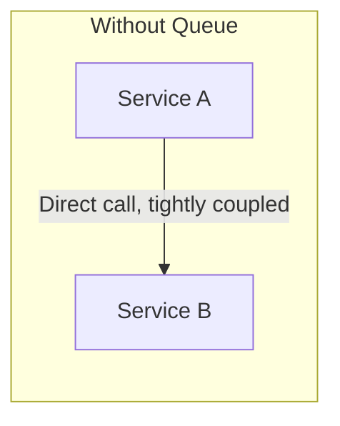
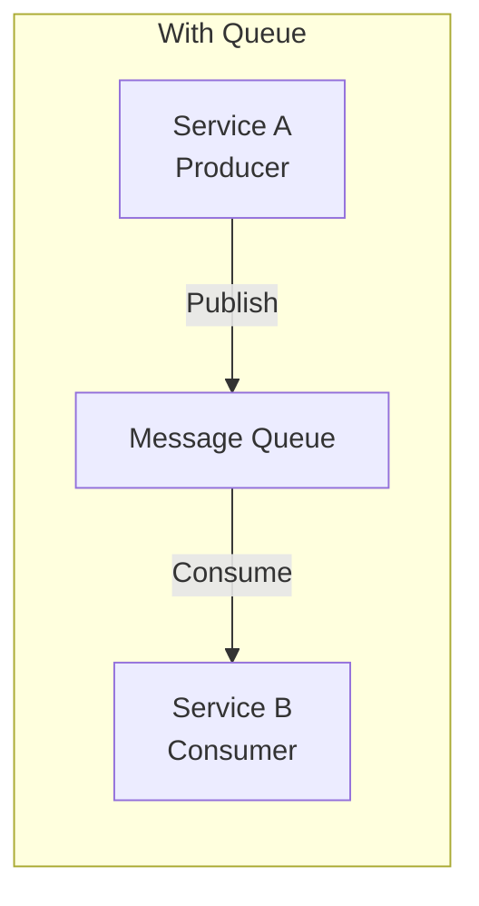
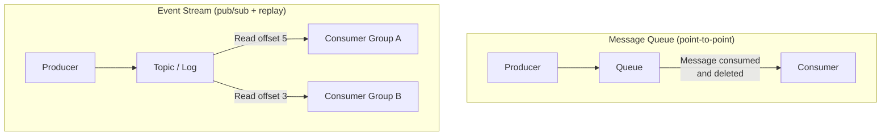
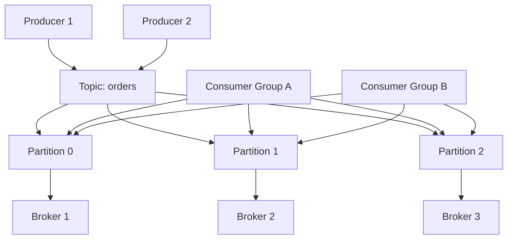
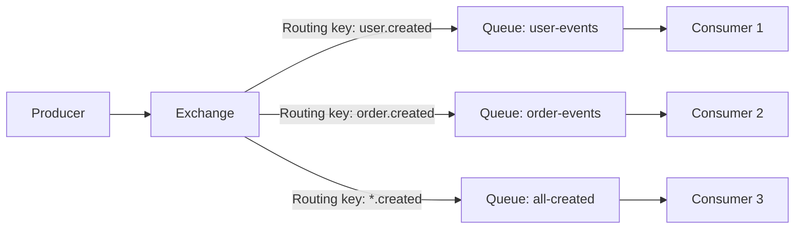
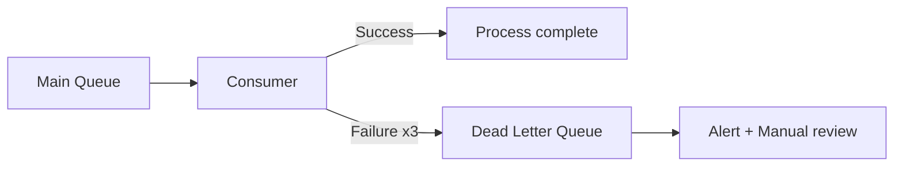
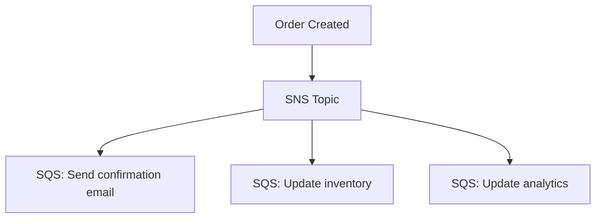
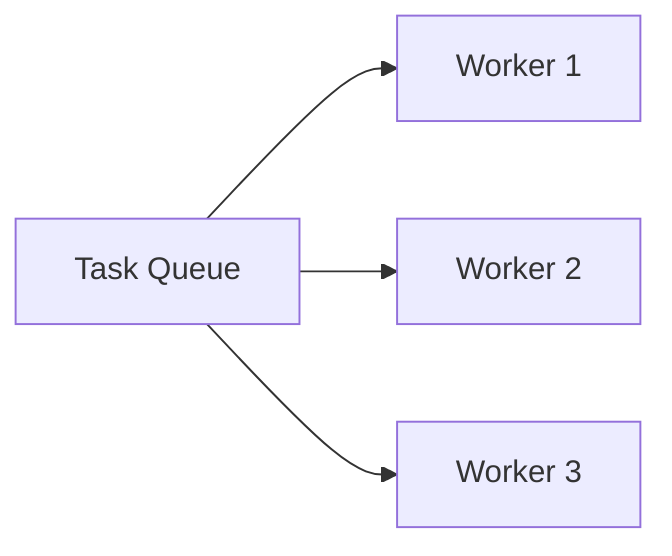

# Message Queues

Asynchronous communication between services — decouple producers from consumers for scalability, reliability, and resilience.

---

## Why Message Queues?

| Benefit | How |
|---------|-----|
| **Decoupling** | Producer doesn't know/care about consumer |
| **Buffering** | Queue absorbs traffic spikes |
| **Reliability** | Messages persist even if consumer is down |
| **Scalability** | Add more consumers to increase throughput |
| **Async processing** | Producer doesn't wait for consumer to finish |

---

## Message Queue vs Event Stream

| Feature | Message Queue | Event Stream |
|---------|-------------|-------------|
| **Message lifecycle** | Deleted after consumption | Retained (configurable, even forever) |
| **Replay** | ❌ Can't re-read | ✅ Replay from any offset |
| **Consumer groups** | Each message to one consumer | Each group gets all messages independently |
| **Ordering** | Per-queue FIFO | Per-partition ordering |
| **Use case** | Task processing, job queues | Event sourcing, analytics, data pipelines |
| **Examples** | RabbitMQ, SQS, ActiveMQ | Kafka, Amazon Kinesis, Pulsar |

---

## Apache Kafka — Deep Dive

### Architecture

### Key Concepts

| Concept | Description |
|---------|-------------|
| **Topic** | Named feed of messages (like a category) |
| **Partition** | Ordered, immutable log within a topic |
| **Offset** | Position of a message within a partition |
| **Producer** | Publishes messages to topics |
| **Consumer** | Reads messages from topics |
| **Consumer Group** | Set of consumers sharing the work (each partition → one consumer in group) |
| **Broker** | Kafka server that stores partitions |
| **Replication Factor** | Number of copies of each partition (typically 3) |

### Kafka Guarantees

| Guarantee | How |
|-----------|-----|
| **Ordering** | Within a partition only. Use same key for related messages. |
| **At-least-once** | Default. Consumer may process duplicates after restart. |
| **Exactly-once** | With idempotent producers + transactional consumers. |
| **Durability** | Messages replicated to N brokers, configurable acks. |

### Producer Acknowledgments

| `acks` | Meaning | Durability | Latency |
|--------|---------|-----------|---------|
| `0` | Don't wait for any ACK | Lowest (may lose) | Fastest |
| `1` | Wait for leader ACK | Medium | Medium |
| `all` | Wait for all ISR replicas | Highest | Slowest |

---

## RabbitMQ

Traditional message broker with rich routing capabilities.

### Exchange Types

| Type | Routing | Use Case |
|------|---------|----------|
| **Direct** | Exact routing key match | Task queues |
| **Fanout** | Broadcast to all bound queues | Notifications |
| **Topic** | Wildcard routing key (`user.*`, `#.created`) | Flexible pub/sub |
| **Headers** | Match on message headers | Complex routing rules |

### Kafka vs RabbitMQ

| Feature | Kafka | RabbitMQ |
|---------|-------|----------|
| **Model** | Distributed log (stream) | Message broker (queue) |
| **Ordering** | Per-partition | Per-queue |
| **Replay** | ✅ (seek to offset) | ❌ (consumed = done) |
| **Throughput** | Very high (millions/sec) | High (tens of thousands/sec) |
| **Routing** | Partition key | Exchange + routing key (flexible) |
| **Use case** | Event streaming, data pipelines | Task queues, RPC, complex routing |

---

## Amazon SQS

Fully managed message queue — simplest option for AWS workloads.

| Feature | SQS Standard | SQS FIFO |
|---------|-------------|----------|
| **Ordering** | Best-effort | Strict FIFO |
| **Deduplication** | No (at-least-once) | 5-minute dedup window |
| **Throughput** | Nearly unlimited | 300 msg/s (batching: 3000) |
| **Use case** | General async, high throughput | Ordering matters |

### SQS Features
- **Visibility timeout** — message hidden from other consumers while being processed
- **Dead letter queue (DLQ)** — failed messages after N retries go here
- **Long polling** — reduce empty responses, lower cost
- **Delay queues** — delay delivery of new messages

---

## Delivery Guarantees

| Guarantee | Description | Example |
|-----------|-------------|---------|
| **At-most-once** | May lose messages, never duplicate | Fire-and-forget logging |
| **At-least-once** | May duplicate, never lose | Default Kafka, SQS |
| **Exactly-once** | No loss, no duplicates | Kafka transactions, hardest to achieve |

**Practical approach:** Use **at-least-once + idempotent consumers**. Make consumers handle duplicates gracefully (idempotency keys, upserts).

---

## Patterns

### Dead Letter Queue (DLQ)

### Fan-out

### Competing Consumers

Each message processed by exactly one worker. Scale by adding workers.

---

## Common Interview Questions

1. **"When would you use a message queue?"** → Async processing (email, notifications), decoupling services, buffering spikes, reliable task processing.
2. **"Kafka vs RabbitMQ?"** → Kafka for event streaming, replay, high throughput. RabbitMQ for task queues, complex routing, lower throughput.
3. **"How do you ensure messages aren't lost?"** → Persistent messages + consumer acknowledgments + replication. Use DLQ for failed processing.
4. **"How do you handle duplicate messages?"** → Idempotent consumers: use message ID as dedup key, upserts instead of inserts, idempotency keys for payments.
5. **"How do you handle message ordering?"** → Use partition key (Kafka) to ensure related messages go to same partition. Or FIFO queues (SQS FIFO).
