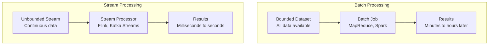
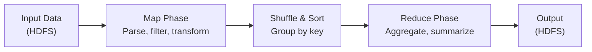
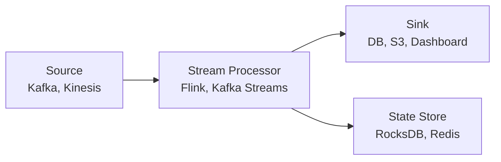
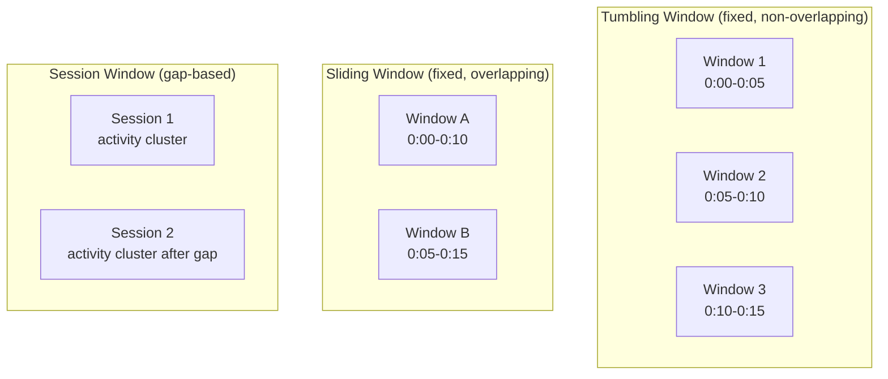
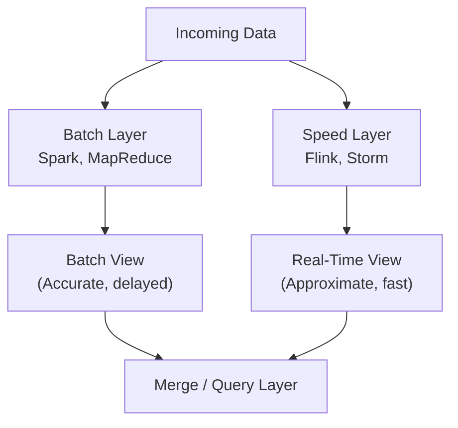
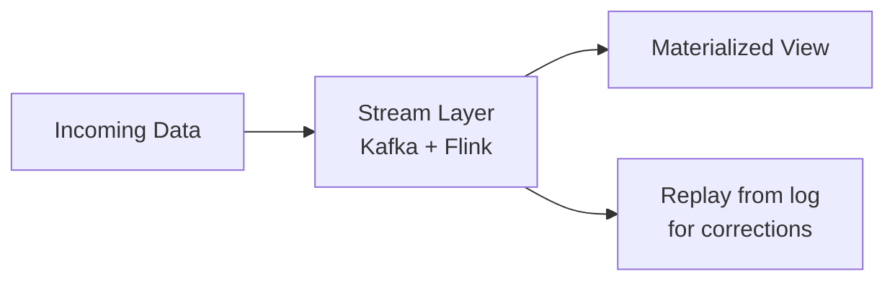

# Batch vs Stream Processing

Two paradigms for processing large volumes of data — choose based on latency requirements and data characteristics.

---

## Overview



| Feature | Batch Processing | Stream Processing |
|---------|-----------------|-------------------|
| **Data** | Bounded (finite dataset) | Unbounded (infinite stream) |
| **Latency** | Minutes to hours | Milliseconds to seconds |
| **Throughput** | Very high (optimized for bulk) | High (per-event) |
| **Complexity** | Simpler (process all, then done) | Complex (windowing, ordering, late data) |
| **Use case** | ETL, reporting, ML training | Real-time alerts, dashboards, fraud detection |
| **Examples** | MapReduce, Spark batch, Hive | Kafka Streams, Flink, Spark Streaming |

---

## Batch Processing

### MapReduce Pattern



**Example — Word Count:**
```
Map:    "hello world hello" → [(hello,1), (world,1), (hello,1)]
Shuffle: group by key     → {hello: [1,1], world: [1]}
Reduce: sum per key       → [(hello,2), (world,1)]
```

### Apache Spark

| Feature | MapReduce | Spark |
|---------|-----------|-------|
| **Processing** | Disk-based between stages | In-memory (RDDs) |
| **Speed** | Slower (disk I/O) | 10-100x faster |
| **API** | Low-level (map/reduce) | Rich (SQL, DataFrames, ML) |
| **Iterative** | Multiple jobs, slow | Efficient (cache in memory) |
| **Streaming** | No (separate tool) | Spark Streaming / Structured Streaming |

### Batch Use Cases
- **ETL** — extract data from sources, transform, load into warehouse
- **Reporting** — daily/weekly aggregate reports
- **ML training** — train models on historical data
- **Data migration** — bulk transform and move data
- **Log analysis** — aggregate logs for insights

---

## Stream Processing

### Key Concepts



| Concept | Description |
|---------|-------------|
| **Event** | Single data record (e.g., a click, a transaction) |
| **Stream** | Unbounded sequence of events |
| **Window** | Group events by time for aggregation |
| **Watermark** | Track event-time progress, handle late data |
| **State** | Per-key state maintained across events |
| **Checkpoint** | Snapshot of state for fault tolerance |

### Windowing Strategies



| Window | How | Use Case |
|--------|-----|----------|
| **Tumbling** | Fixed-size, non-overlapping | Per-minute aggregation, hourly reports |
| **Sliding** | Fixed-size, overlapping | Moving average, trailing 5-min metrics |
| **Session** | Dynamic, gap-based | User session analysis, clickstream |
| **Global** | All events in one window | Overall aggregates |

### Event Time vs Processing Time

| | Event Time | Processing Time |
|---|---|---|
| **What** | When event occurred | When event is processed |
| **Challenge** | Late/out-of-order events | Simple |
| **Accuracy** | Correct results | May be inaccurate |
| **Handling** | Watermarks + allowed lateness | Just process as received |

---

## Stream Processing Frameworks

| Framework | Strengths | Model |
|-----------|----------|-------|
| **Apache Flink** | True streaming, exactly-once, advanced windowing | Native stream |
| **Kafka Streams** | Lightweight (library, not cluster), Kafka-native | Stream |
| **Apache Spark Streaming** | Unified batch+stream API | Micro-batch |
| **Amazon Kinesis** | Managed, AWS-native | Stream |
| **Apache Storm** | Low-latency, older | Stream |

### Kafka Streams vs Flink

| Feature | Kafka Streams | Flink |
|---------|--------------|-------|
| **Deployment** | Library (runs in your app) | Standalone cluster |
| **Source** | Kafka only | Kafka, files, sockets, etc. |
| **Complexity** | Simpler | More powerful, more complex |
| **Exactly-once** | With Kafka transactions | Built-in checkpointing |
| **Best for** | Simple Kafka-centric pipes | Complex event processing |

---

## Lambda vs Kappa Architecture

### Lambda Architecture



| Pros | Cons |
|------|------|
| Accurate batch + fast real-time | Two codebases to maintain |
| Handles late data well | Complex merging logic |

### Kappa Architecture



| Pros | Cons |
|------|------|
| Single codebase | Requires powerful stream processor |
| Simpler architecture | Replay can be expensive |
| Kafka log as source of truth | Not all workloads fit |

**Modern trend:** Kappa with Kafka as the source of truth. Use Flink for complex processing, replay when logic changes.

---

## Common Interview Questions

1. **"Batch vs stream — when to use each?"** → Batch for historical analysis, ETL, ML training (latency OK). Stream for real-time alerts, dashboards, fraud detection (needs low latency).
2. **"How do you handle late events in stream processing?"** → Watermarks + allowed lateness window. Late events update results or go to a side output.
3. **"What's the Lambda architecture?"** → Dual path: batch for accuracy, stream for speed. Both feed a serving layer. Complex but comprehensive.
4. **"Why Kappa over Lambda?"** → Single codebase, simpler. Stream processor handles everything. Replay from Kafka for corrections.
5. **"How do you ensure exactly-once processing?"** → Checkpointing (Flink), idempotent sinks, Kafka transactions, or dedup at the consumer.
