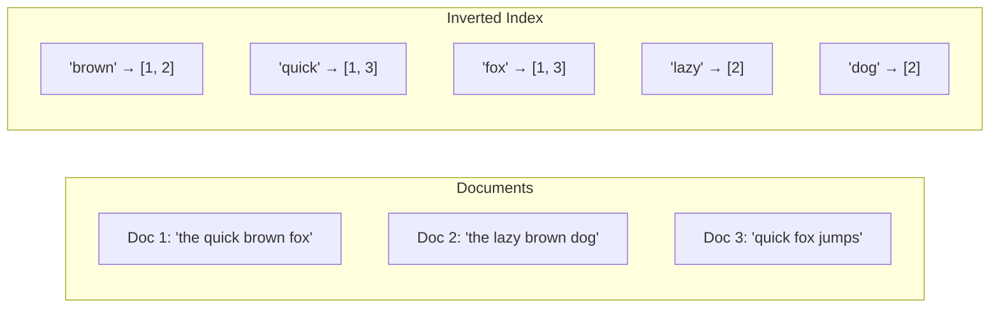
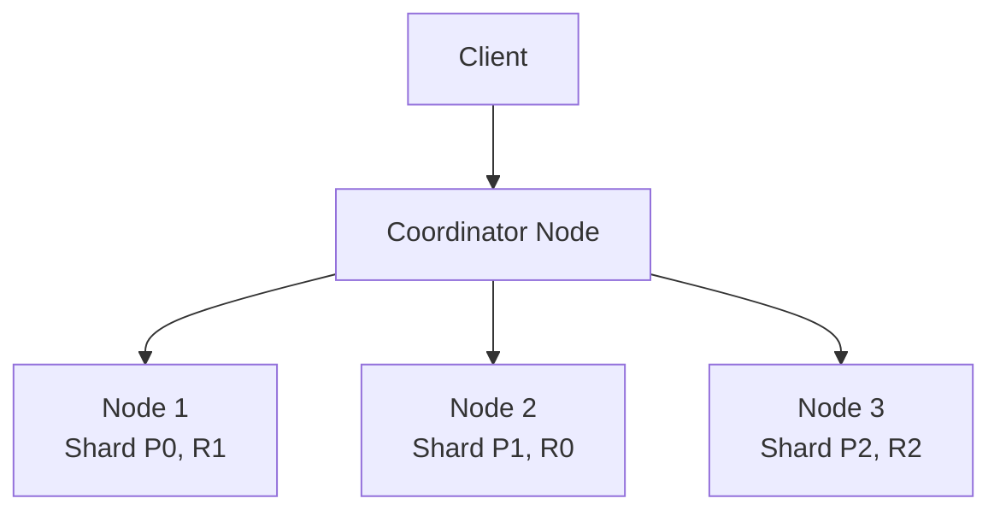
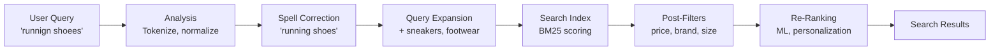
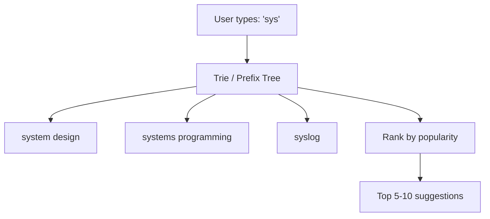
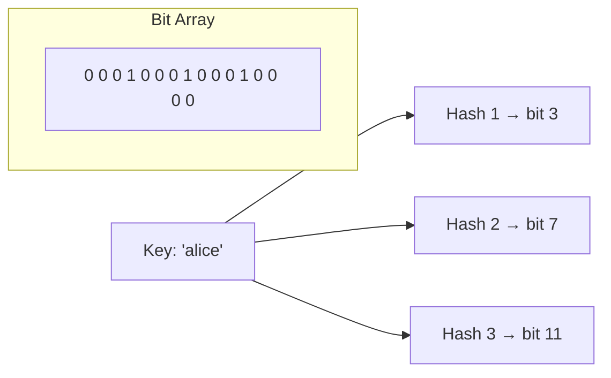
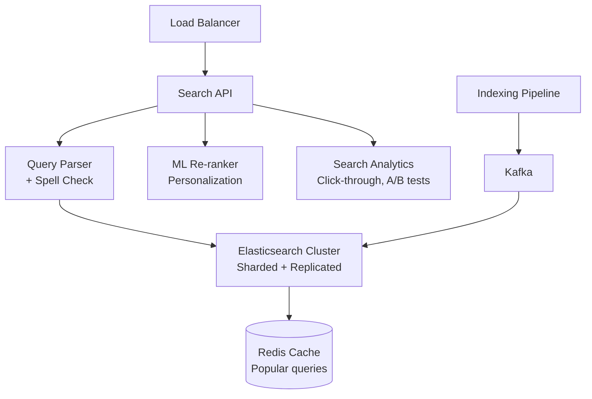

# Search & Indexing

How to build fast, relevant search — from inverted indexes to probabilistic data structures.

---

## Inverted Index

The core data structure behind full-text search.

**How it works:**
1. **Tokenize** — split text into terms ("the quick brown fox" → ["the", "quick", "brown", "fox"])
2. **Normalize** — lowercase, stem ("running" → "run"), remove stop words ("the", "a")
3. **Index** — map each term to list of document IDs + positions
4. **Query** — look up terms, intersect/union posting lists

**Time complexity:** O(1) to find term → O(k) to retrieve k matching documents (vs O(n) full scan)

---

## Elasticsearch

Distributed search engine built on Apache Lucene.

### Architecture

| Concept | Description |
|---------|-------------|
| **Index** | Collection of documents (like a database table) |
| **Document** | JSON record (like a row) |
| **Shard** | Partition of an index (a Lucene instance) |
| **Replica** | Copy of a shard for availability and read throughput |
| **Mapping** | Schema definition (field types, analyzers) |

### Query Types

| Query | Use Case | Example |
|-------|----------|---------|
| **Match** | Full-text search with relevance | `"quick brown fox"` |
| **Term** | Exact value (no analysis) | `status: "active"` |
| **Bool** | Combine queries (must, should, must_not) | Complex filters |
| **Range** | Numeric/date ranges | `price: 10-50` |
| **Fuzzy** | Typo tolerance (Levenshtein distance) | `"quik" → "quick"` |
| **Aggregation** | Analytics (group by, sum, avg) | Sales by region |

### Relevance Scoring (TF-IDF / BM25)

| Factor | What It Measures |
|--------|-----------------|
| **Term Frequency (TF)** | How often the term appears in this document |
| **Inverse Document Frequency (IDF)** | How rare the term is across all documents |
| **Field length** | Shorter fields boost relevance |
| **BM25** | Modern scoring (default in ES 5+), improved TF saturation |

**Intuition:** A term that appears frequently in a document but rarely across all documents is highly relevant.

---

## Search Pipeline

### Key Techniques

| Technique | What | Example |
|-----------|------|---------|
| **Autocomplete** | Suggest as user types | Edge n-gram tokenizer, completion suggester |
| **Spell correction** | Fix typos | Edit distance (Levenshtein), phonetic matching |
| **Synonyms** | Expand query semantically | "laptop" → "notebook computer" |
| **Faceted search** | Filter by categories | "Brand: Nike, Size: 10, Color: Red" |
| **Highlighting** | Show matched text in results | "The **quick** brown **fox**" |

---

## Typeahead / Autocomplete

### Implementation Approaches

| Approach | How | Pros | Cons |
|----------|-----|------|------|
| **Trie** | Prefix tree in memory | Fast O(prefix length) | Memory-heavy |
| **Elasticsearch prefix** | `prefix` or `edge_ngram` | Built-in, scalable | Heavier than trie |
| **Redis sorted set** | Store prefix → suggestions | Very fast | Manual management |
| **DB LIKE** | `WHERE name LIKE 'sys%'` | Simple | Slow at scale |

---

## Probabilistic Data Structures

When exact answers are too expensive, use approximate structures.

### Bloom Filter

| Feature | Detail |
|---------|--------|
| **Purpose** | Test if element is "probably in set" or "definitely not in set" |
| **False positive** | Possible (says "yes" but element not present) |
| **False negative** | Impossible (never says "no" when it's present) |
| **Space** | Very compact (10 bits per element for 1% FP rate) |
| **Operations** | Add, check — **no delete** (use counting Bloom filter for that) |

**Use cases:**
- Skip expensive DB lookups for non-existent keys (cache penetration prevention)
- Cassandra — check if SSTable might contain key before reading from disk
- Web crawlers — avoid revisiting URLs
- Spam filters — check against known spam signatures

### Count-Min Sketch

| Feature | Detail |
|---------|--------|
| **Purpose** | Estimate frequency of elements in a stream |
| **Accuracy** | Overestimates (never underestimates) |
| **Space** | Fixed, regardless of distinct elements |
| **Operations** | Increment, query estimated count |

**Use cases:** Real-time trending topics, heavy hitter detection, frequency estimation in analytics.

### HyperLogLog

| Feature | Detail |
|---------|--------|
| **Purpose** | Estimate count of distinct elements |
| **Accuracy** | ~2% error with 12KB of memory |
| **Space** | O(1) — fixed regardless of cardinality |
| **Operations** | Add element, get estimated count |

**Use cases:** Unique visitor counts, unique search queries, cardinality estimation across datasets. Built into Redis (`PFADD`, `PFCOUNT`).

---

## Search Architecture at Scale

**Scaling search:**
- Shard index by document ID for write distribution
- Replicate shards for read throughput
- Cache popular queries in Redis
- Index asynchronously via Kafka pipeline
- Separate read/write clusters for heavy indexing

---

## Common Interview Questions

1. **"How would you build a search system?"** → Inverted index (Elasticsearch), tokenization + normalization pipeline, BM25 scoring, pagination with cursor.
2. **"How does autocomplete work?"** → Trie or edge n-grams in Elasticsearch. Rank by popularity. Cache hot prefixes in Redis.
3. **"What's a Bloom filter?"** → Space-efficient probabilistic set membership test. False positives possible, false negatives impossible. Used to skip expensive lookups.
4. **"How do you count unique users efficiently?"** → HyperLogLog: 12KB gives ~2% accurate cardinality estimation over billions of elements.
5. **"How do you handle typos in search?"** → Fuzzy matching (Levenshtein distance), phonetic matching, "did you mean" suggestions via edit distance.
