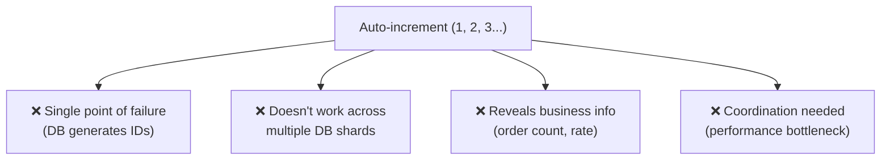
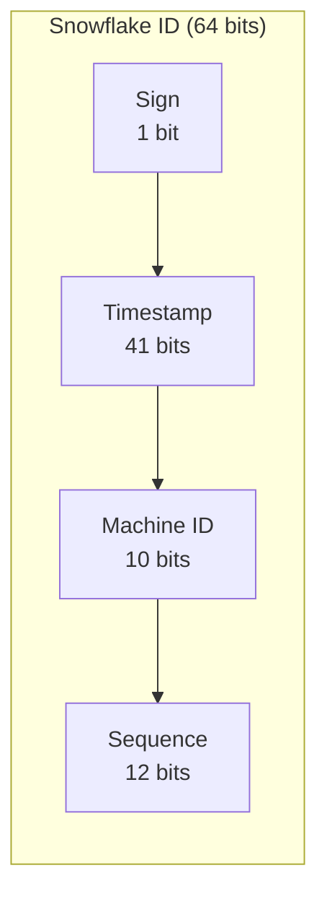
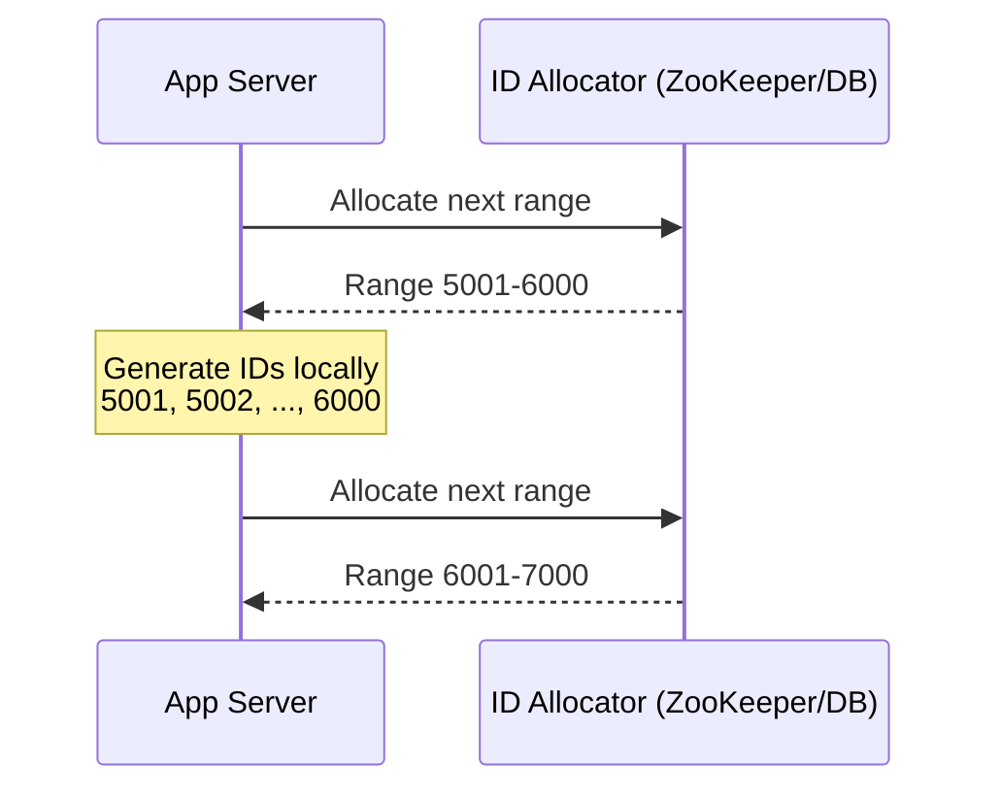

# Unique ID Generation

How to generate globally unique identifiers in distributed systems — critical for databases, events, and tracing.

---

## Why Not Auto-Increment?



---

## ID Generation Strategies

### UUID (Universally Unique Identifier)

```
550e8400-e29b-41d4-a716-446655440000
└──────┘ └──┘ └──┘ └──┘ └──────────┘
 time    vary  ver  var     random
```

| Version | How Generated | Sortable? |
|---------|--------------|-----------|
| **UUIDv1** | Timestamp + MAC address | Roughly (by time) |
| **UUIDv4** | Random | ❌ No |
| **UUIDv7** | Timestamp prefix + random | ✅ Yes (recommended) |

| Pros | Cons |
|------|------|
| No coordination needed | 128 bits (large, bad for indexes) |
| Generate anywhere (client, server) | UUIDv4 not sortable (random inserts fragment B+ tree) |
| No single point of failure | Not human-readable |

**Use when:** You need quick, decentralized ID generation and size doesn't matter.

### Snowflake ID (Twitter)

```
0 | 41 bits timestamp | 10 bits machine ID | 12 bits sequence
  │  ~69 years range  │  1024 machines     │  4096 IDs/ms/machine
```



| Pros | Cons |
|------|------|
| 64-bit (half of UUID, fits in long) | Requires time synchronization (NTP) |
| Time-sortable | Machine ID assignment needed |
| ~4 million IDs/sec per machine | Clock drift can cause duplicates |
| Decentralized (no coordinator) | Epoch-dependent (custom start time) |

**Capacity:** 1024 machines × 4096 IDs/ms = **~4M IDs/second** globally

### TSID (Time-Sorted ID)

Modern evolution of Snowflake, used in libraries like `tsid-creator`:
```
42 bits timestamp | 22 bits random/node
```
- Shorter, fits in 64-bit long
- Compatible with Snowflake concept but simpler (no explicit machine ID management)

### Database-Based Approaches

| Approach | How | Tradeoff |
|----------|-----|----------|
| **Single DB auto-increment** | `id SERIAL PRIMARY KEY` | Simple, but SPOF |
| **Ticket server** | Central DB generates IDs in ranges | Simple, but SPOF |
| **Multi-master** | DB 1: odd IDs, DB 2: even IDs | No SPOF, but limited scalability |
| **Range allocation** | Service claims range (1-1000, 1001-2000) | Efficient, minor gaps |

### Range Allocation (Flickr/Instagram approach)



- **Pros:** Minimal coordination (only when range exhausted), fast local generation
- **Cons:** Gaps if server crashes with unused range, IDs not globally sorted across servers

---

## Comparison

| Strategy | Size | Sorted? | Coordination | Throughput | Best For |
|----------|------|---------|-------------|-----------|----------|
| **UUIDv4** | 128 bit | ❌ | None | Unlimited | Simple, any language |
| **UUIDv7** | 128 bit | ✅ | None | Unlimited | Modern alternative to v4 |
| **Snowflake** | 64 bit | ✅ | Machine ID | ~4M/sec/cluster | High-scale, sorted |
| **TSID** | 64 bit | ✅ | Minimal | Very high | Modern Snowflake alternative |
| **Auto-increment** | 32/64 bit | ✅ | DB lock | Moderate | Simple CRUD apps |
| **Range allocation** | 64 bit | Partial | Periodic | Very high | Large-scale services |

---

## Common Interview Questions

1. **"How would you generate unique IDs across distributed servers?"** → Snowflake: 64-bit ID = timestamp + machine ID + sequence. No coordination, time-sortable, 4M IDs/sec.
2. **"Why not use UUIDs?"** → 128-bit is large for DB indexes. UUIDv4 is random (fragments B+ tree). UUIDv7 fixes sorting but still 128-bit.
3. **"What if clocks are out of sync?"** → Snowflake: wait until clock catches up (refuse to generate if clock goes backwards). Use NTP for synchronization.
4. **"How does Instagram generate IDs?"** → Modified Snowflake: timestamp + shard ID + auto-increment per shard. 64-bit, sortable.
5. **"What properties should a good ID have?"** → Globally unique, sortable by time (for DB performance), compact (64-bit ideal), no coordination required.
