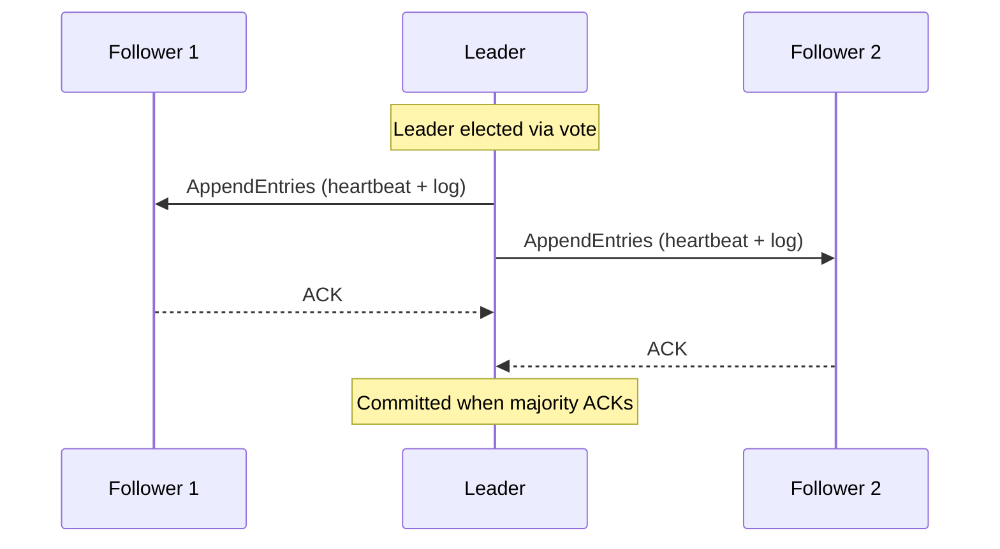
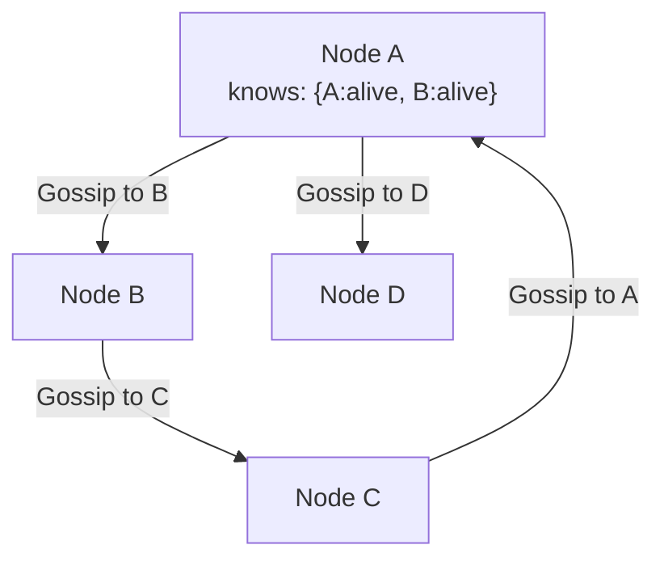
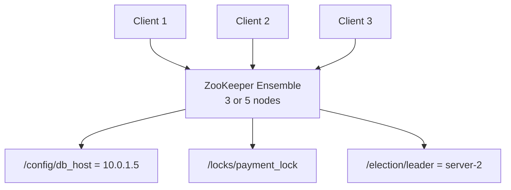
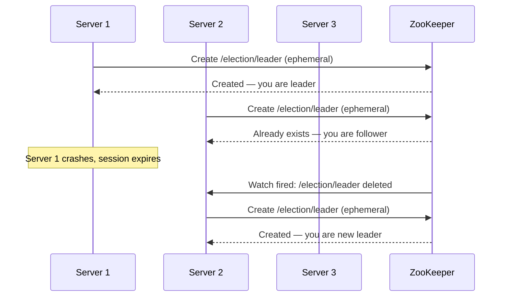
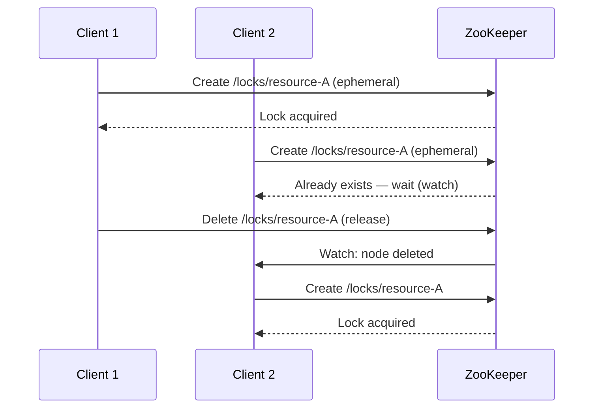

# Coordination & Consensus

How distributed systems agree on shared state — leader election, configuration, and distributed coordination.

---

## The Problem

In a distributed system, nodes need to **agree** on:
- Who is the leader?
- What's the current configuration?
- Is this lock acquired or released?
- What's the committed order of transactions?

This is the **consensus problem** — getting all nodes to agree on a single value.

---

## Consensus Algorithms

### Raft (Understandable Consensus)

**Raft states:** Follower → Candidate → Leader

| Phase | What Happens |
|-------|-------------|
| **Leader Election** | If follower doesn't hear heartbeat, becomes candidate. Requests votes. Majority wins. |
| **Log Replication** | Leader sends log entries to followers. Entry committed when majority acknowledge. |
| **Safety** | Only candidates with up-to-date logs can win election. |

**Key properties:**
- Leader-based (all writes go through leader)
- Majority quorum (N/2 + 1 nodes must agree)
- **5 nodes → tolerates 2 failures**
- **Used by:** etcd, Consul, CockroachDB, TiKV

### Paxos

Original consensus algorithm (Leslie Lamport, 1989). Same guarantees as Raft but harder to understand.

| Phase | What Happens |
|-------|-------------|
| **Prepare** | Proposer sends proposal number. Acceptors promise not to accept lower numbers. |
| **Accept** | Proposer sends value with proposal number. Acceptors accept if no higher promise. |
| **Learn** | Once majority accept, value is chosen. Learners are notified. |

**Variants:**
- **Multi-Paxos** — optimized for repeated consensus (leader-based, skip prepare phase)
- **Fast Paxos** — fewer round trips
- **Raft** was designed as an understandable alternative to Multi-Paxos

### Gossip Protocol

Not consensus, but used for **information dissemination** in decentralized systems.

| Feature | Detail |
|---------|--------|
| **How** | Each node periodically shares state with random peers |
| **Convergence** | O(log N) rounds for full propagation |
| **Fault tolerance** | Highly resilient (no leader, no SPOF) |
| **Use cases** | Membership (who's alive?), failure detection, state dissemination |
| **Used by** | Cassandra, DynamoDB, Consul (Serf), Akka Cluster |

---

## Coordination Services

### Apache ZooKeeper

| Feature | Detail |
|---------|--------|
| **Data model** | Hierarchical znodes (like a filesystem) |
| **Consensus** | ZAB protocol (similar to Raft) |
| **Watches** | Clients get notified when znodes change |
| **Ephemeral nodes** | Disappear when client disconnects (for locks, presence) |
| **Sequential nodes** | Auto-incrementing (for leader election, queues) |

### etcd

| Feature | Detail |
|---------|--------|
| **Data model** | Flat key-value store |
| **Consensus** | Raft |
| **API** | gRPC + HTTP |
| **Watch** | Stream changes on key prefixes |
| **Used by** | Kubernetes (all cluster state stored in etcd) |

### ZooKeeper vs etcd vs Consul

| Feature | ZooKeeper | etcd | Consul |
|---------|-----------|------|--------|
| **Consensus** | ZAB | Raft | Raft |
| **Data model** | Hierarchical (znodes) | Flat (key-value) | Key-value + service catalog |
| **Language** | Java | Go | Go |
| **Service discovery** | Manual (use znodes) | Manual | Built-in |
| **Health checking** | Manual | Manual | Built-in |
| **Use case** | Legacy, Kafka, Hadoop | Kubernetes | Service mesh, microservices |

---

## Common Use Cases

### Leader Election

### Distributed Locks

### Configuration Management
- Store config in ZooKeeper/etcd (`/config/feature-flags/dark-mode = true`)
- Clients watch for changes, update in real-time
- No need to restart services for config changes

---

## Common Interview Questions

1. **"How does leader election work?"** → Use ZooKeeper/etcd ephemeral nodes. First to create the node is leader. If leader dies, session expires, node deleted, next candidate becomes leader.
2. **"What's the difference between Raft and Paxos?"** → Same guarantees (safe consensus with majority). Raft is designed to be understandable: explicit leader election, sequential log replication.
3. **"How does gossip protocol differ from consensus?"** → Gossip: eventually consistent information dissemination (no agreement). Consensus: strong agreement on a single value (Raft/Paxos).
4. **"ZooKeeper vs etcd?"** → ZooKeeper: hierarchical, proven (Kafka/Hadoop). etcd: simpler, modern (Kubernetes). Both provide linearizable reads/writes.
5. **"How do you implement a distributed lock?"** → ZooKeeper ephemeral nodes, or Redis SETNX + TTL (Redlock for multi-node). ZK is safer (auto-release on disconnect).
