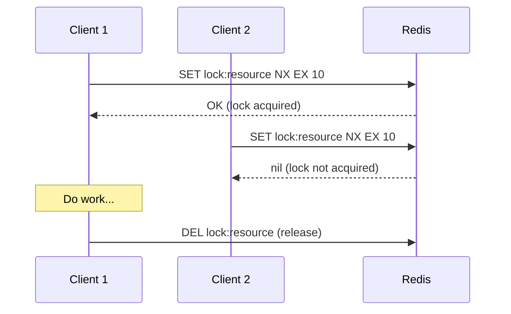
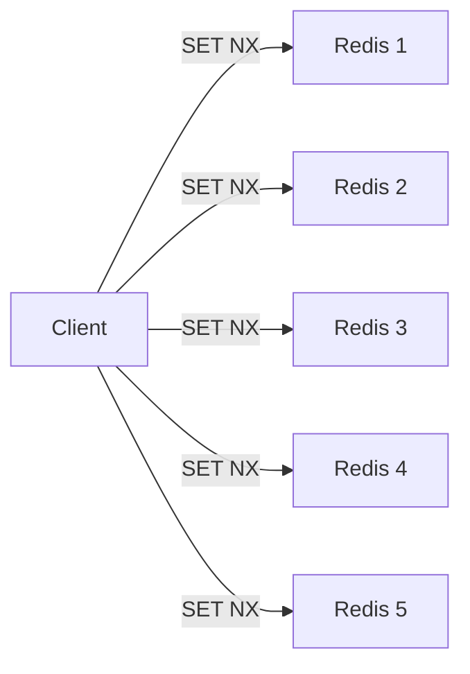
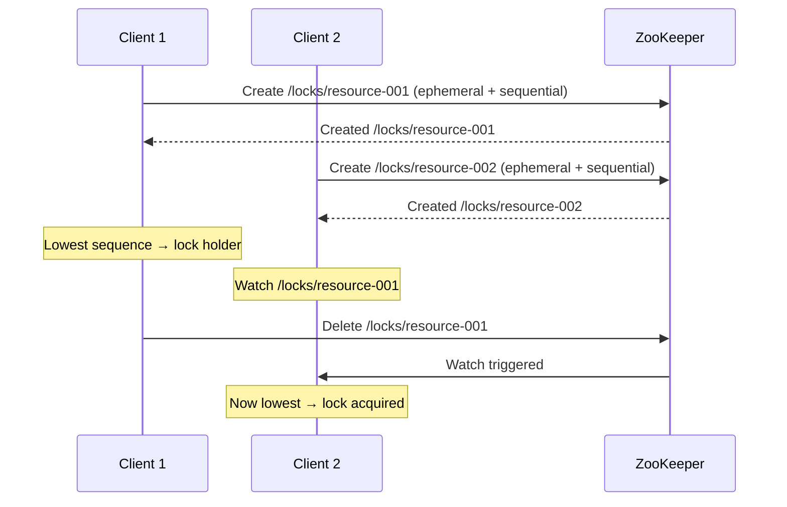
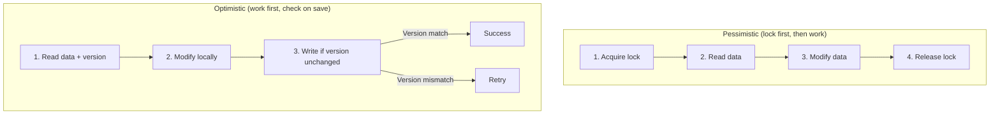
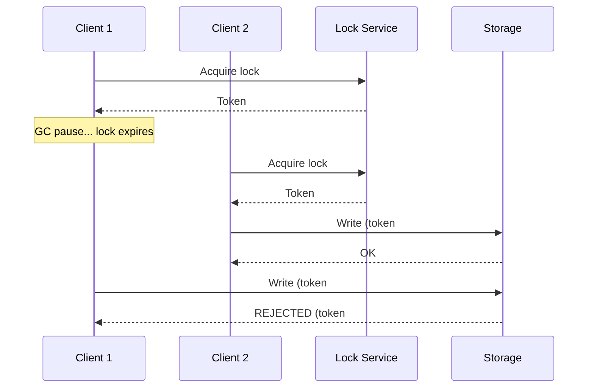

# Synchronization & Locking

Coordinating access to shared resources in distributed systems — from database locks to distributed mutexes.

---

## Why Distributed Locking?

In a single process, you use mutexes. In a distributed system, you need **distributed locks**:
- **Prevent double-processing** — only one worker handles a job
- **Protect shared resources** — only one service writes to a resource
- **Leader election** — only one instance acts as leader
- **Rate limiting** — distributed token bucket coordination

---

## Distributed Lock Implementations

### Redis-Based Locking (Simple)



```
SET lock:resource <unique-token> NX EX 10
  NX = only set if not exists
  EX = expire after 10 seconds (safety net)
  unique-token = prevent releasing someone else's lock
```

**Release safely (Lua script for atomicity):**
```lua
if redis.call("get", KEYS[1]) == ARGV[1] then
    return redis.call("del", KEYS[1])
else
    return 0
end
```

### Redlock (Multi-Node Redis)

For single-node Redis, if the node crashes, the lock is lost. Redlock uses multiple independent Redis nodes:



1. Try to acquire lock on all N nodes (e.g., 5)
2. Lock is acquired if **majority** (3+) succeed within time limit
3. Lock validity = TTL - time spent acquiring

**Controversy:** Martin Kleppmann argues Redlock has edge cases (GC pauses, clock drift). For critical correctness, use ZooKeeper or database locks.

### ZooKeeper-Based Locking



**Advantages over Redis:**
- **Ephemeral nodes** — lock auto-released if client dies (no stale locks)
- **Sequential nodes** — fair ordering (no thundering herd)
- **Strong consistency** — ZAB consensus guarantees

### Database-Based Locking

```sql
-- Pessimistic lock
SELECT * FROM orders WHERE id = 123 FOR UPDATE;
-- Row is locked until transaction commits/rolls back

-- Advisory lock (PostgreSQL)
SELECT pg_advisory_lock(123);
-- Application-level lock, not tied to a row

-- Optimistic lock
UPDATE orders SET status = 'completed', version = version + 1
WHERE id = 123 AND version = 5;
-- Returns 0 rows if version changed (someone else updated first)
```

---

## Optimistic vs Pessimistic Locking



| Feature | Optimistic | Pessimistic |
|---------|-----------|-------------|
| **When to lock** | At save time (version check) | Before reading |
| **Contention** | Best for low contention | Best for high contention |
| **Blocking** | Non-blocking (retry on conflict) | Blocking (waits for lock) |
| **Throughput** | Higher (under low contention) | Lower (locks held longer) |
| **Complexity** | Handle retries in application | Handle deadlocks |
| **Example** | `@Version` in JPA, ETags | `SELECT FOR UPDATE`, Redis SETNX |

---

## Fencing Tokens

Prevent stale lock holders from making changes after their lock expires:



**Key insight:** The storage service must reject writes with a fencing token lower than what it has seen. This prevents the "zombie leader" problem.

---

## Comparison of Approaches

| Approach | Consistency | Performance | Complexity | Best For |
|----------|-----------|-------------|-----------|----------|
| **Redis SETNX** | Weak (single node) | Very fast | Simple | Non-critical locks, rate limiting |
| **Redlock** | Moderate | Fast | Moderate | Moderate criticality |
| **ZooKeeper** | Strong | Slower | High (ZK cluster) | Critical locks, leader election |
| **DB locks** | Strong (within DB) | Moderate | Simple | Already using DB, per-row locks |
| **Optimistic (version)** | Strong | Fast (low contention) | Moderate | Concurrent writes, CAS |

---

## Common Interview Questions

1. **"How do you implement a distributed lock?"** → Redis SETNX with TTL for simple cases. ZooKeeper ephemeral nodes for critical correctness. Always include fencing tokens.
2. **"Optimistic vs pessimistic locking?"** → Optimistic: read + version check on write (low contention). Pessimistic: lock before reading (high contention). Start with optimistic.
3. **"What happens if the lock holder crashes?"** → TTL expiration (Redis) or ephemeral node deletion (ZooKeeper). Always have a timeout as safety net.
4. **"What's the fencing token problem?"** → Stale lock holder (GC pause, network delay) writes after new holder. Fix: monotonically increasing fencing tokens rejected by storage.
5. **"Redlock — safe or not?"** → Works for most cases but not 100% safe under extreme conditions (GC pauses, clock drift). Use ZooKeeper for life-or-death correctness.
