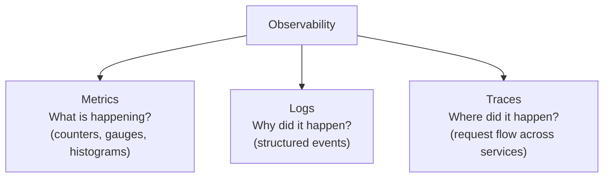
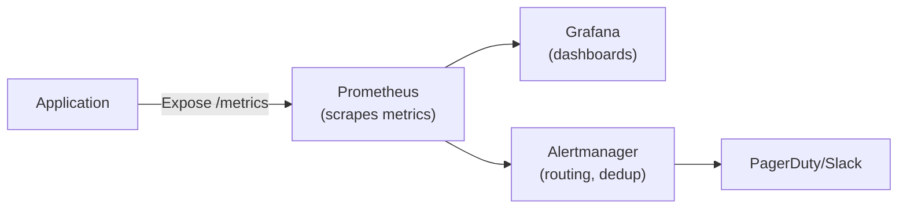
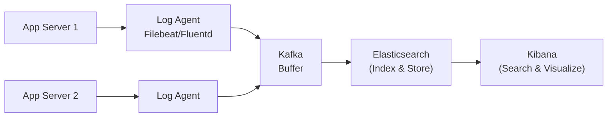
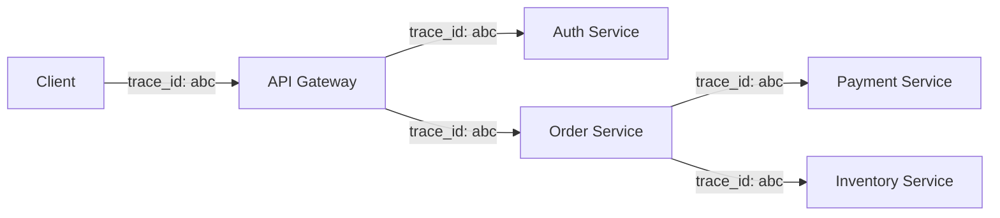
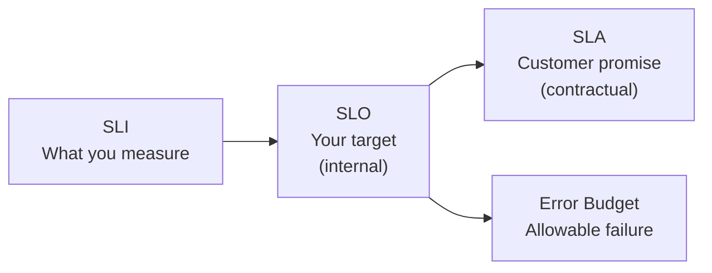

# Monitoring & Observability

How to understand what's happening inside your production systems — the three pillars plus alerting, dashboards, and SRE practices.

---

## Three Pillars of Observability



---

## Metrics

Numeric measurements collected over time.

### Metric Types

| Type | Description | Example |
|------|------------|---------|
| **Counter** | Monotonically increasing value | Total requests served, errors, bytes sent |
| **Gauge** | Value that goes up and down | CPU usage, memory, active connections, queue size |
| **Histogram** | Distribution of values (buckets) | Request latency (p50, p95, p99) |
| **Summary** | Pre-calculated quantiles (client-side) | Similar to histogram, less aggregatable |

### Key Metrics to Monitor (RED + USE)

**RED Method** (for request-driven services):

| Metric | What | Alert On |
|--------|------|----------|
| **Rate** | Requests per second | Sudden drop or spike |
| **Errors** | Error rate (%) | > threshold (e.g., > 1%) |
| **Duration** | Latency (p50, p95, p99) | p99 > SLO target |

**USE Method** (for resources — CPU, memory, disk, network):

| Metric | What | Alert On |
|--------|------|----------|
| **Utilization** | % of resource used | > 80% sustained |
| **Saturation** | Queue depth / backlog | Growing queue |
| **Errors** | Resource errors | Disk errors, network drops |

### Monitoring Stack



---

## Logging

### Structured Logging

```json
{
  "timestamp": "2024-01-15T10:30:00Z",
  "level": "ERROR",
  "service": "payment-service",
  "trace_id": "abc123",
  "user_id": "user_456",
  "message": "Payment failed",
  "error": "InsufficientFundsException",
  "amount": 99.99,
  "currency": "USD"
}
```

**Why structured?** Searchable, parseable, aggregatable. Never use unstructured log lines in production.

### Log Levels

| Level | When to Use |
|-------|------------|
| **ERROR** | Something failed, needs attention |
| **WARN** | Unexpected but handled gracefully |
| **INFO** | Normal business events (request completed, user signed up) |
| **DEBUG** | Detailed debugging (request/response bodies, internal state) |

### Log Aggregation Pipeline



**ELK Stack:** Elasticsearch + Logstash + Kibana
**Modern alternatives:** Grafana Loki (lightweight, log labels), Datadog, Splunk

---

## Distributed Tracing

Track a single request as it flows across multiple services.



### Trace Anatomy

```
Trace: abc123 (entire request journey)
├── Span: API Gateway (50ms)
│   ├── Span: Auth Service (10ms)
│   └── Span: Order Service (35ms)
│       ├── Span: Payment Service (20ms)
│       └── Span: Inventory Service (8ms)
```

| Concept | Description |
|---------|-------------|
| **Trace** | End-to-end journey of a request (unique trace ID) |
| **Span** | Single operation within a trace (service call, DB query) |
| **Context propagation** | Passing trace ID across service boundaries (headers) |
| **Sampling** | Only trace a percentage of requests (1-10%) to reduce overhead |

### Tracing Tools

| Tool | Type | Notes |
|------|------|-------|
| **Jaeger** | Open-source (CNCF) | Uber-developed, popular |
| **Zipkin** | Open-source | Twitter-developed |
| **OpenTelemetry** | Standard/SDK | Vendor-neutral, unified metrics+traces+logs |
| **Datadog APM** | SaaS | Full-featured, expensive |
| **AWS X-Ray** | AWS-managed | Good for AWS services |

---

## Alerting

### Good Alerting Principles

| Principle | Why |
|-----------|-----|
| **Alert on symptoms, not causes** | "Error rate > 5%" not "CPU > 80%" |
| **Actionable alerts only** | Every alert should require human action |
| **Reduce noise** | Group, deduplicate, silence during maintenance |
| **Tiered severity** | P1 (page), P2 (Slack), P3 (dashboard) |
| **Include runbook link** | Alert should link to fix instructions |

### SLI / SLO / SLA

| Concept | What | Example |
|---------|------|---------|
| **SLI** (Service Level Indicator) | What you measure | Request latency p99 |
| **SLO** (Service Level Objective) | Your internal target | p99 < 200ms, 99.9% availability |
| **SLA** (Service Level Agreement) | External commitment (contract) | 99.9% uptime or credits |
| **Error Budget** | How much failure SLO allows | 0.1% = ~8.7 hours/year downtime |



---

## Dashboards

### Essential Dashboards

| Dashboard | Shows | Audience |
|-----------|-------|----------|
| **Service overview** | RED metrics, error rates, top endpoints | On-call engineers |
| **Infrastructure** | CPU, memory, disk, network per host | SRE / platform team |
| **Business** | Signups, orders, revenue, conversion | Product / leadership |
| **Deployment** | Deploy timeline, rollback events, error rate delta | Release engineers |

### Dashboard Best Practices
- **Top of dashboard:** Are we healthy? (single green/red indicator)
- **Time range:** Default to last 1-6 hours, with drill-down
- **Compare:** Show current vs previous period (last week, last deploy)
- **Avoid vanity metrics:** Focus on actionable metrics

---

## Common Interview Questions

1. **"How would you monitor this system?"** → RED metrics (rate, errors, duration) per service. Distributed tracing for debugging cross-service issues. Structured logs for detail.
2. **"What's the difference between monitoring and observability?"** → Monitoring tells you something is wrong. Observability lets you understand WHY (via traces, logs, arbitrary queries).
3. **"How do you set up alerting?"** → SLO-based: define error budget, alert when burning too fast. Alert on symptoms (error rate), not causes (CPU).
4. **"What are SLI/SLO/SLA?"** → SLI: what you measure. SLO: your target. SLA: customer contract. Error budget: allowed failure before taking action.
5. **"How does distributed tracing work?"** → Unique trace ID propagated in headers. Each service creates spans. Assembled into a trace tree for visualization.
