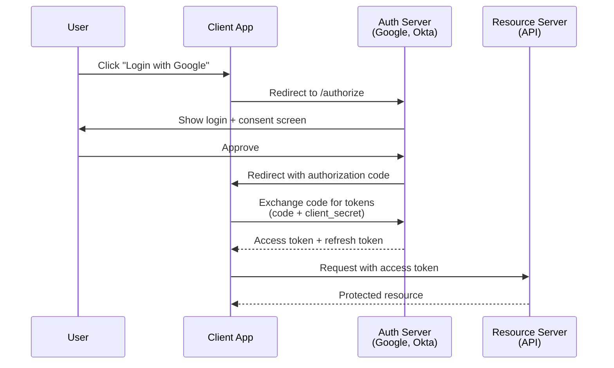
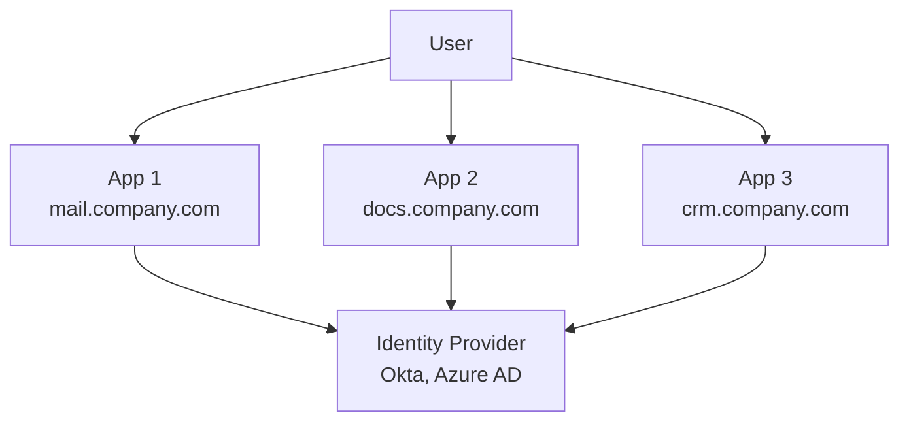

# Security & Authentication

How to protect systems and verify identity — OAuth, JWT, TLS, and security patterns for system design interviews.

---

## Authentication vs Authorization

| | Authentication (AuthN) | Authorization (AuthZ) |
|---|---|---|
| **Question** | "Who are you?" | "What can you do?" |
| **Mechanism** | Username/password, tokens, certificates | Roles, permissions, policies |
| **When** | Login, token verification | Every resource access check |
| **Example** | JWT validation | Role-based access control (RBAC) |

---

## OAuth 2.0

Delegated authorization framework — lets a third-party app access resources on behalf of a user.

### Authorization Code Flow (Most Common)



### OAuth Grant Types

| Grant | Use Case | Security |
|-------|----------|----------|
| **Authorization Code** | Web apps with backend | Most secure (code exchanged server-side) |
| **Authorization Code + PKCE** | SPAs, mobile apps | Secure for public clients (no client_secret) |
| **Client Credentials** | Service-to-service | Machine-to-machine (no user involved) |
| **Refresh Token** | Long-lived sessions | Get new access token without re-login |

### OAuth Tokens

| Token | Lifetime | Purpose |
|-------|----------|---------|
| **Access token** | Short (15 min - 1 hour) | Authorize API requests |
| **Refresh token** | Long (days - months) | Get new access token |
| **ID token** | Short | User identity info (OpenID Connect) |

---

## JWT (JSON Web Token)

Stateless, self-contained token for authentication.

```
Header.Payload.Signature

eyJhbGciOiJIUzI1NiJ9.           ← Header (alg: HS256)
eyJzdWIiOiIxMjMiLCJyb2xlIjoi   ← Payload (sub, role, exp)
YWRtaW4ifQ.                     
SflKxwRJSMeKKF2QT4fwpMeJf36POk ← Signature (HMAC or RSA)
```

### JWT Structure

| Part | Contains | Encoded |
|------|----------|---------|
| **Header** | Algorithm (HS256, RS256), type (JWT) | Base64url |
| **Payload** | Claims (sub, iss, exp, iat, custom) | Base64url |
| **Signature** | HMAC(header + payload, secret) or RSA-signed | Binary |

### JWT vs Session Cookies

| Feature | JWT | Session Cookie |
|---------|-----|----------------|
| **Storage** | Client-side (localStorage, cookie) | Server-side (Redis, DB) |
| **Stateless** | ✅ (no server lookup) | ❌ (server must look up session) |
| **Revocation** | ❌ Hard (must wait for expiry or use denylist) | ✅ Easy (delete from store) |
| **Scalability** | Better (no shared state) | Needs shared session store |
| **Security** | Token theft = full access until expiry | Can force logout immediately |
| **Size** | Larger (all claims in token) | Small (just session ID) |

**Best practice:** Short-lived JWTs (15 min) + refresh tokens + token rotation.

---

## SSO (Single Sign-On)



One login → access to all applications.

| Protocol | Standard | Use Case |
|----------|----------|----------|
| **SAML** | XML-based, enterprise | Legacy enterprise SSO |
| **OpenID Connect** | OAuth 2.0 extension | Modern SSO, web/mobile |
| **LDAP** | Directory protocol | Corporate directory authentication |

---

## API Security Patterns

### Authentication Methods

| Method | How | Best For |
|--------|-----|----------|
| **API Key** | Static key in header/query | Server-to-server (simple) |
| **Bearer Token (JWT)** | Token in `Authorization: Bearer <token>` | User-facing APIs |
| **mTLS** | Client + server certificates | Service mesh, zero-trust |
| **HMAC Signature** | Sign request body + timestamp | Webhooks (Stripe, GitHub) |

### Common Attacks & Defenses

| Attack | What | Defense |
|--------|------|---------|
| **Injection (SQL, NoSQL)** | Malicious input in queries | Parameterized queries, input validation |
| **XSS** | Inject scripts in web pages | Output encoding, CSP headers |
| **CSRF** | Trick user into making unintended requests | CSRF tokens, SameSite cookies |
| **MITM** | Intercept communication | TLS everywhere, certificate pinning |
| **Brute force** | Try many passwords | Rate limiting, account lockout, MFA |
| **Token theft** | Steal access tokens | Short TTL, refresh token rotation, HTTPS only |

---

## Encryption

| Type | How | Use Case | Speed |
|------|-----|----------|-------|
| **Symmetric** (AES-256) | Same key encrypts/decrypts | Data at rest, bulk encryption | Fast |
| **Asymmetric** (RSA, ECDSA) | Public key encrypts, private key decrypts | Key exchange, digital signatures | Slow |
| **Hashing** (SHA-256, bcrypt) | One-way (can't reverse) | Passwords, integrity verification | Varies |

### Data Protection

| Scope | What | Example |
|-------|------|---------|
| **Encryption at rest** | Data stored encrypted | AWS EBS encryption, DB transparent encryption |
| **Encryption in transit** | Data encrypted during transfer | TLS/HTTPS |
| **Encryption in use** | Data encrypted while being processed | Homomorphic encryption (rare) |

---

## Common Interview Questions

1. **"How do you secure an API?"** → HTTPS, JWT authentication, rate limiting, input validation, RBAC, audit logging.
2. **"JWT vs session cookies?"** → JWT: stateless, scalable, hard to revoke. Sessions: stateful, easy to revoke, needs shared store. Use short-lived JWTs + refresh tokens.
3. **"How does OAuth work?"** → Authorization code flow: user approves, app gets code, exchanges for tokens server-side. Access token for API calls, refresh token for renewal.
4. **"How do you store passwords?"** → Never plaintext. Use bcrypt/scrypt/argon2 (slow hashing + salt). Never MD5/SHA (too fast).
5. **"How do you implement SSO?"** → OpenID Connect (modern) or SAML (enterprise). Centralized identity provider, token-based federation across apps.
