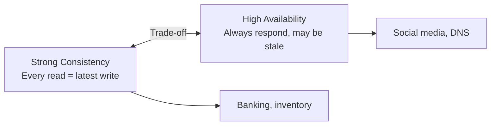

# Tradeoff Analysis

The meta-skill of system design — every decision has tradeoffs. Interviewers care about your ability to reason through them, not just pick a solution.

---

## Core Tradeoffs

### Consistency vs Availability



See [13-cap-theorem.md](13-cap-theorem.md) for deep dive.

### Latency vs Throughput

| Optimizing For | Technique | Cost |
|---------------|-----------|------|
| **Low latency** | In-memory cache, CDN, edge computing | More infrastructure, cost |
| **High throughput** | Batching, async processing, queues | Higher latency per request |

**Example:** Kafka batches messages for throughput (higher latency per message) vs WebSocket for low-latency individual messages.

### Latency vs Consistency

| Choice | Mechanism | Example |
|--------|-----------|---------|
| **Low latency** | Read from local replica (may be stale) | Cassandra with `ONE` consistency |
| **Strong consistency** | Read from leader / quorum (slower) | Cassandra with `QUORUM` |

### Simplicity vs Flexibility

| Choice | Example | Tradeoff |
|--------|---------|----------|
| **Monolith** | Single deployable, simple | Hard to scale parts independently |
| **Microservices** | Independent services | Operational complexity, network overhead |
| **SQL** | Rigid schema, powerful queries | Schema changes are expensive |
| **NoSQL** | Flexible schema | Limited query capabilities |

### Cost vs Performance

| Budget | Approach |
|--------|---------|
| **Low cost** | Fewer replicas, longer TTL, eventual consistency |
| **High performance** | More replicas, cache everything, premium instances |

---

## Decision Frameworks

### When Discussing Storage

| If you need... | Choose | Trade away |
|---------------|--------|-----------|
| Complex queries, joins, ACID | SQL (PostgreSQL) | Horizontal scalability |
| Massive write throughput | LSM-based (Cassandra) | Read performance |
| Flexible schema, rapid iteration | Document DB (MongoDB) | ACID transactions |
| Real-time analytics | Columnar (ClickHouse) | Write latency |
| Sub-millisecond lookups | Key-value (Redis) | Query flexibility |

### When Discussing Communication

| If you need... | Choose | Trade away |
|---------------|--------|-----------|
| Decoupled services | Message queue (Kafka) | Latency, complexity |
| Real-time updates | WebSocket | Scalability (stateful) |
| Simple request-response | REST | Real-time capability |
| High-performance internal | gRPC | Browser compatibility |

### When Discussing Caching

| If you need... | Choose | Trade away |
|---------------|--------|-----------|
| Fresh data | No cache / short TTL | Performance, DB load |
| Fast reads | Aggressive caching | Data staleness |
| Write consistency | Write-through | Write latency |
| Write speed | Write-behind | Durability risk |

---

## How to Present Tradeoffs in Interviews

### The Framework

```
1. State the options: "We could do X or Y"
2. Explain the tradeoff: "X gives us ___ but costs us ___"
3. Make a recommendation: "I'd choose X because ___"
4. Acknowledge the cost: "The downside is ___, which we'd mitigate by ___"
```

### Example Dialogue

> **"Should we use a relational database or NoSQL?"**
>
> "For this use case — a social media feed with 100M DAU — I'd lean toward a **combination**:
>
> **PostgreSQL for user profiles and relationships** — we need ACID for follows/unfollows and complex queries for friend-of-friend recommendations.
>
> **Cassandra for the feed timeline** — it's write-heavy (every post writes to many followers' timelines), needs horizontal scalability, and eventual consistency is acceptable for feeds.
>
> The tradeoff is **operational complexity** (maintaining two databases), but the performance and scalability gains justify it at this scale."

---

## Anti-Patterns

| Anti-Pattern | Problem | Better Approach |
|-------------|---------|-----------------|
| "Just use Kafka for everything" | Not everything needs async, adds complexity | Use sync when latency matters |
| "Microservices from day one" | Complex for small teams, premature | Start monolith, break out when needed |
| "NoSQL because it scales" | Lose transactions, joins | SQL can scale (read replicas, Vitess, Citus) |
| "Cache everything" | Stale data, invalidation hell | Cache selectively where latency matters |
| Premature optimization | Building for 1B users on day one | Design for 10x current, not 1000x |

---

## Common Interview Questions

1. **"What are the tradeoffs of your design?"** → Always have 2-3 tradeoffs ready. Lead with the primary tradeoff and explain your reasoning.
2. **"Why did you choose X over Y?"** → State requirements that drove the choice. Acknowledge what you lose and how you'd mitigate.
3. **"How would you make this more [available/consistent/fast]?"** → Show you understand the cost: more availability = weaker consistency, more speed = more cost/complexity.
4. **"What would you do differently at 100x scale?"** → Caching, sharding, async processing, denormalization, separate read/write paths.
