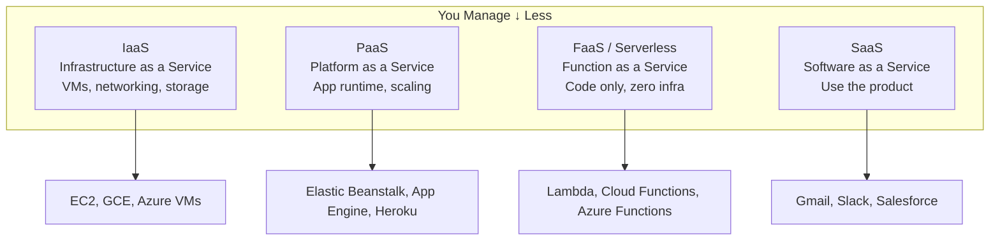
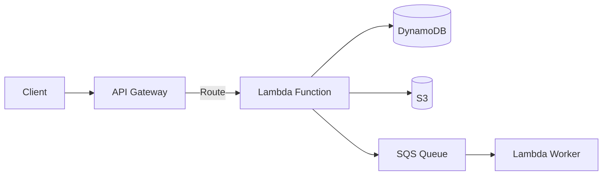
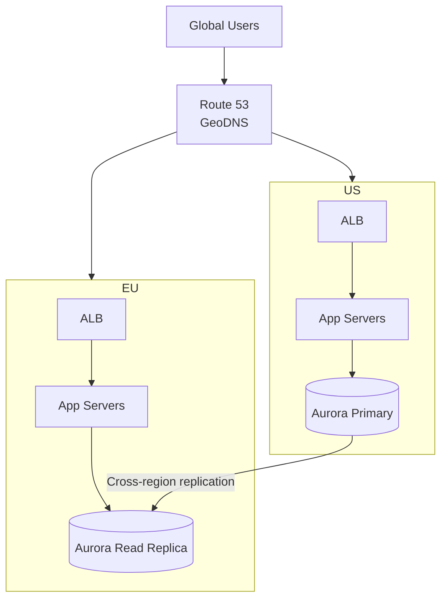

# Cloud Technologies

Core cloud concepts for system design interviews — compute, storage, networking, and managed services.

---

## Cloud Service Models

| Model | You Manage | Provider Manages | Example |
|-------|-----------|-----------------|---------|
| **IaaS** | OS, runtime, app, data | Hardware, networking, virtualization | EC2, GCE |
| **PaaS** | App code, data | OS, runtime, scaling, infra | Elastic Beanstalk |
| **FaaS** | Function code | Everything else | Lambda |
| **SaaS** | Config only | Everything | Gmail |

---

## AWS Core Services (Most Asked)

### Compute

| Service | What | When |
|---------|------|------|
| **EC2** | Virtual machines | Full control, custom setup |
| **ECS/EKS** | Container orchestration | Dockerized apps |
| **Lambda** | Serverless functions | Event-driven, short tasks (<15 min) |
| **Fargate** | Serverless containers | Containers without managing servers |

### Storage

| Service | Type | When |
|---------|------|------|
| **S3** | Object storage | Media, backups, data lake |
| **EBS** | Block storage | EC2 disk volumes |
| **EFS** | File storage | Shared filesystem across instances |
| **Glacier** | Archive storage | Long-term, infrequent access |

### Database

| Service | Type | When |
|---------|------|------|
| **RDS** | Managed SQL (Postgres, MySQL) | Traditional CRUD apps |
| **DynamoDB** | Managed NoSQL (key-value) | High-scale, simple access patterns |
| **ElastiCache** | Managed Redis/Memcached | Caching, sessions |
| **Redshift** | Data warehouse (columnar) | Analytics, OLAP |
| **Aurora** | MySQL/Postgres compatible | High-performance managed SQL |

### Networking & Delivery

| Service | What | When |
|---------|------|------|
| **CloudFront** | CDN | Static content delivery |
| **Route 53** | DNS + health checks | Domain resolution, failover |
| **ALB / NLB** | Load balancers (L7 / L4) | Traffic distribution |
| **API Gateway** | Managed API gateway | REST/WebSocket API management |
| **VPC** | Virtual private network | Network isolation |

### Messaging & Integration

| Service | What | When |
|---------|------|------|
| **SQS** | Message queue | Async task processing |
| **SNS** | Pub/Sub notifications | Fan-out to multiple subscribers |
| **Kinesis** | Real-time data streaming | Data pipelines, analytics |
| **EventBridge** | Event bus | Event-driven architectures |

---

## Serverless Architecture

| Pros | Cons |
|------|------|
| Zero server management | Cold start latency (100ms-few seconds) |
| Auto-scaling (0 to thousands) | 15-minute execution limit |
| Pay per invocation | Vendor lock-in |
| Built-in HA and fault tolerance | Debugging/monitoring harder |

**When to use:** Event-driven workloads, APIs with variable traffic, scheduled tasks, data processing pipelines.

**When NOT to use:** Long-running jobs, steady high-throughput, latency-sensitive (cold starts), complex stateful applications.

---

## Multi-Region Architecture

### Multi-Region Considerations

| Factor | Decision |
|--------|----------|
| **Data replication** | Active-passive (simple) or active-active (complex) |
| **Consistency** | Cross-region replication lag (accept eventual or pay latency) |
| **Failover** | DNS-based (Route 53 health checks), automated vs manual |
| **Data residency** | GDPR/compliance may require data in specific regions |
| **Cost** | 2x+ infrastructure, cross-region data transfer fees |

---

## Cloud-Native Design Principles

| Principle | Why | How |
|-----------|-----|-----|
| **Design for failure** | Everything fails eventually | Retry, circuit breaker, timeouts |
| **Decouple components** | Independent scaling, deployment | Queues, events, APIs |
| **Automate everything** | Reduce manual toil | IaC (Terraform), CI/CD, auto-scaling |
| **Prefer managed services** | Focus on business logic | RDS over self-managed DB, SQS over self-hosted queue |
| **Observe everything** | Can't fix what you can't see | CloudWatch, X-Ray, structured logging |

---

## Common Interview Questions

1. **"How would you deploy this globally?"** → Multi-region with GeoDNS, cross-region DB replication, CDN for static assets, regional caches.
2. **"EC2 vs Lambda?"** → EC2 for steady high-load. Lambda for variable/event-driven workloads. Consider cold starts and execution limits.
3. **"How do you handle failover?"** → Route 53 health checks auto-route to healthy region. Database failover with read replicas promoted. Pre-warmed standby.
4. **"What's serverless?"** → No server management, auto-scaling, pay-per-use. Great for event-driven, bad for long-running or latency-sensitive.
