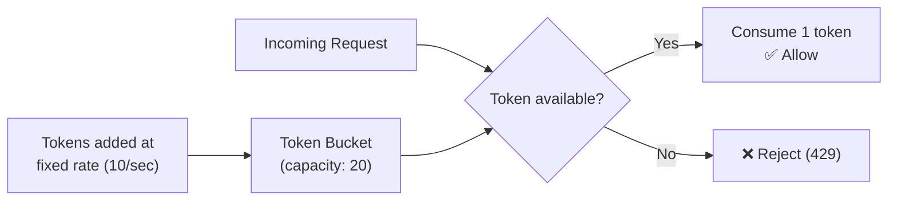
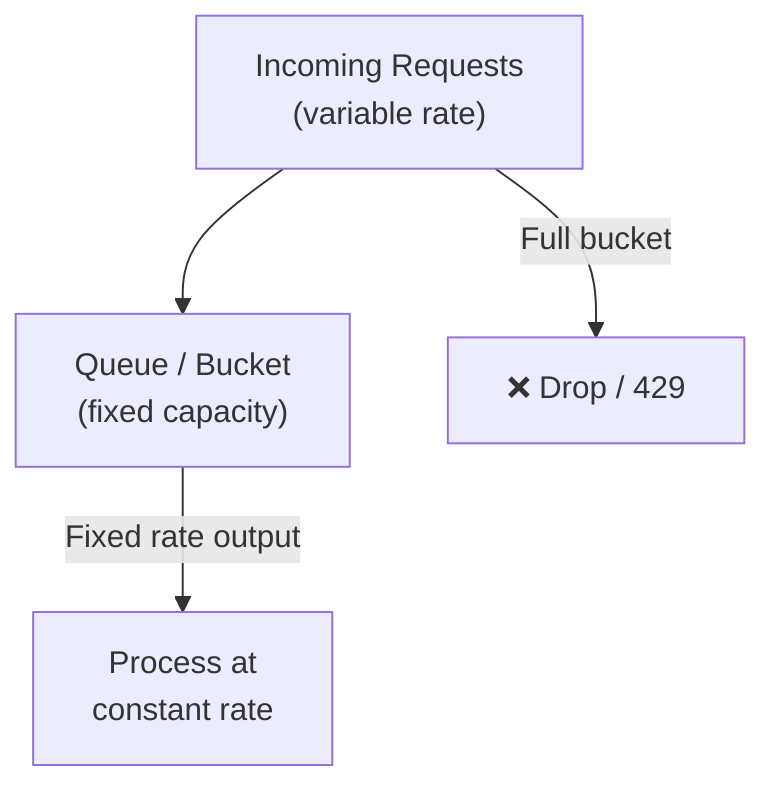
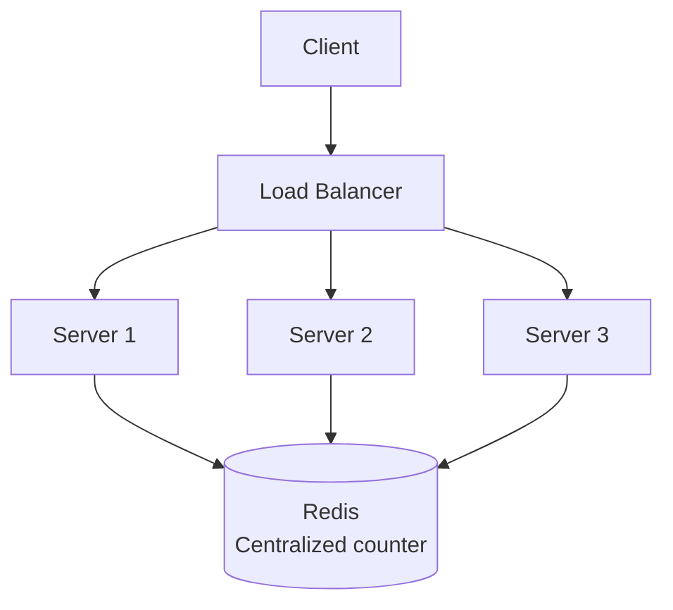

# Rate Limiting & Throttling

Protecting your system from abuse and overload — essential for APIs, distributed systems, and multi-tenant platforms.

---

## Why Rate Limit?

- **Prevent abuse** — stop DDoS attacks, brute-force attempts
- **Fair usage** — prevent one client from hogging resources
- **Protect downstream** — keep backends from being overwhelmed
- **Cost control** — limit expensive operations (API calls, compute)

---

## Rate Limiting Algorithms

### 1. Token Bucket



| Pros | Cons |
|------|------|
| Allows bursts (up to bucket size) | Slightly more complex than counter |
| Smooth rate over time | Need to track last refill time |
| Memory efficient (2 values per key) | |

**Used by:** AWS API Gateway, Stripe, most production systems.

### 2. Leaky Bucket



| Pros | Cons |
|------|------|
| Smooths bursts to constant rate | No burst allowance |
| Predictable output rate | Slow during quiet periods |

### 3. Fixed Window Counter

```
Window: 1-minute intervals
Limit: 100 requests per minute

[0:00-1:00] → 100 allowed, counter resets at 1:00
```

| Pros | Cons |
|------|------|
| Simple, memory efficient | **Boundary burst**: 100 at 0:59 + 100 at 1:00 = 200 in 2 seconds |
| Easy to understand | Spiky at window edges |

### 4. Sliding Window Log

- Store timestamp of each request
- Count requests in last N seconds
- **Pros:** Precise, no boundary burst. **Cons:** Memory-heavy (stores all timestamps).

### 5. Sliding Window Counter

Hybrid: fixed window + weighted interpolation from previous window.

```
Previous window (0:00-1:00): 80 requests
Current window (1:00-2:00): 40 requests so far
Time: 1:15 (25% into current window)

Weighted count = 80 × 0.75 + 40 × 1.0 = 100
```

| Pros | Cons |
|------|------|
| Smooth, no boundary burst | Approximate (not exact) |
| Memory efficient | Slightly complex |

### Algorithm Comparison

| Algorithm | Burst? | Precision | Memory | Best For |
|-----------|--------|-----------|--------|----------|
| **Token Bucket** | ✅ Controlled | Good | O(1) per key | Most use cases (default) |
| **Leaky Bucket** | ❌ Smoothed | Good | O(1) per key | Constant-rate processing |
| **Fixed Window** | ⚠️ Edge bursts | Approximate | O(1) per key | Simple, low-traffic |
| **Sliding Log** | ❌ | Exact | O(N) per key | Need precision |
| **Sliding Counter** | ✅ Controlled | Approximate | O(1) per key | Balanced |

---

## Distributed Rate Limiting



### Approaches

| Approach | How | Tradeoff |
|----------|-----|----------|
| **Centralized (Redis)** | All servers check/update Redis | Accurate, but Redis is SPOF |
| **Local per-server** | Each server tracks independently | Fast, but limit = limit/N per server |
| **Sliding window in Redis** | Lua script for atomicity | Best balance of accuracy and performance |
| **Race condition fix** | `MULTI`/`EXEC` or Lua scripts in Redis | Prevents counter drift |

### Redis Implementation (Token Bucket)

```
-- Lua script (atomic)
local key = KEYS[1]
local tokens = tonumber(redis.call("get", key) or ARGV[1])  -- bucket capacity
local last_refill = redis.call("get", key..":time") or ARGV[3]
local now = ARGV[3]

-- Refill tokens based on elapsed time
local elapsed = now - last_refill
tokens = math.min(ARGV[1], tokens + elapsed * ARGV[2])  -- rate

if tokens >= 1 then
    redis.call("set", key, tokens - 1)
    redis.call("set", key..":time", now)
    return 1  -- allowed
else
    return 0  -- rejected
end
```

---

## Rate Limiting at Different Layers

| Layer | Tool | Granularity |
|-------|------|-------------|
| **API Gateway** | AWS API Gateway, Kong, Envoy | Per-API, per-client |
| **Load Balancer** | Nginx `limit_req`, HAProxy | Per-IP, per-URL |
| **Application** | Custom middleware + Redis | Per-user, per-endpoint |
| **Database** | Connection pooling, query limits | Per-connection |

---

## Response Headers

```
HTTP/1.1 429 Too Many Requests
Retry-After: 30
X-RateLimit-Limit: 100
X-RateLimit-Remaining: 0
X-RateLimit-Reset: 1672531500
```

---

## Common Interview Questions

1. **"Design a rate limiter"** → Token bucket with Redis for distributed. Lua scripts for atomicity. Return 429 + retry-after. Discuss algorithm tradeoffs.
2. **"How do you rate limit in a distributed system?"** → Centralized Redis counter. Use Lua scripts for atomic check-and-decrement. Accept slight inaccuracy for performance.
3. **"Token bucket vs sliding window?"** → Token bucket allows controlled bursts. Sliding window is smoother. Token bucket is simpler to implement.
4. **"How do you handle rate limit for different tiers?"** → Different limits per plan (free: 100/min, pro: 1000/min). Store plan info, look up on each request.
