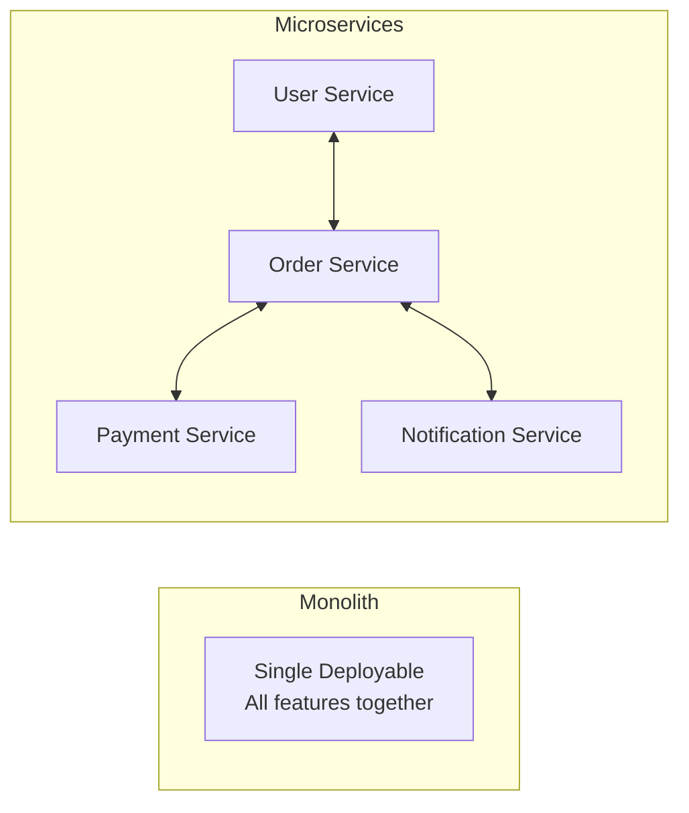
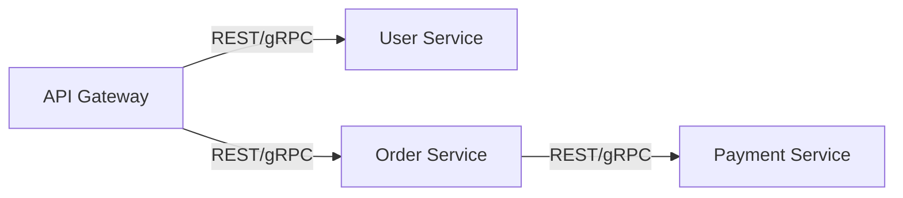
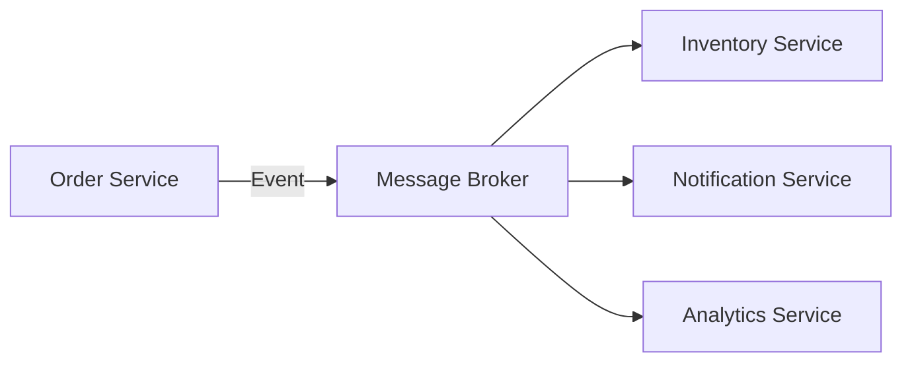
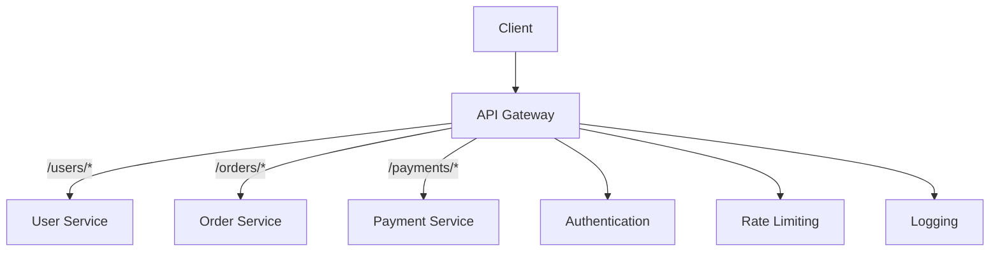
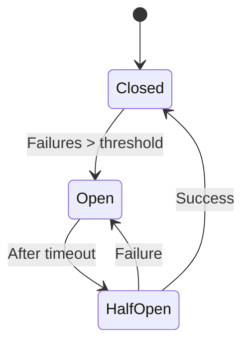
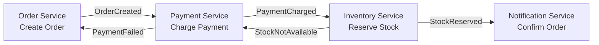
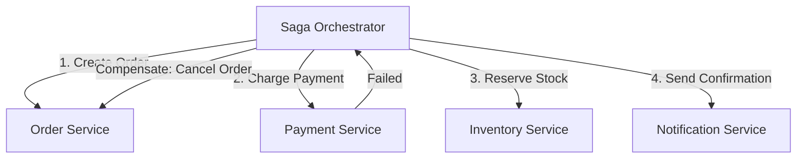
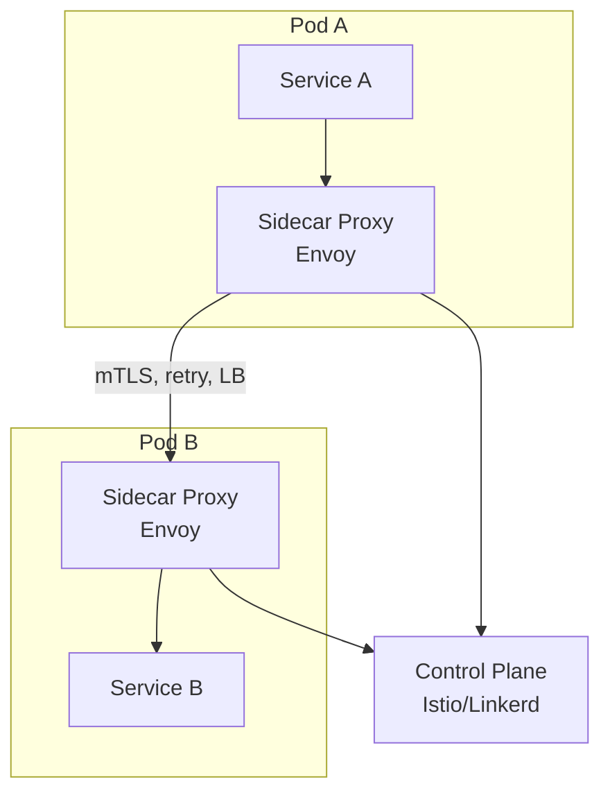
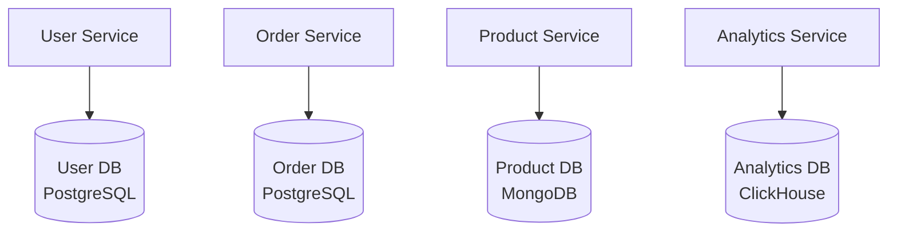

# Microservices Patterns

Patterns for building, communicating, and managing microservices at scale.

---

## Monolith vs Microservices



| Factor | Monolith | Microservices |
|--------|----------|---------------|
| **Complexity** | Simple to start | Complex (networking, deployment) |
| **Scaling** | Scale everything together | Scale each service independently |
| **Deployment** | Deploy everything at once | Independent deployments |
| **Team ownership** | Shared codebase | Service-per-team |
| **Data** | Shared database | Database per service |
| **Best stage** | Early startup, small team | Grown product, large org |

**Rule of thumb:** Start monolith. Extract to microservices when you have clear bounded contexts and team scaling needs.

---

## Communication Patterns

### Synchronous



| Pattern | When | Tradeoff |
|---------|------|----------|
| **REST** | Public APIs, simple CRUD | Slower, text-based |
| **gRPC** | Internal services, high throughput | Binary, typed, not browser-friendly |
| **Direct call** | Simple, low latency needed | Tight coupling |

### Asynchronous



| Pattern | When | Tradeoff |
|---------|------|----------|
| **Event-driven** | Decoupled, fan-out | Eventually consistent, complex debugging |
| **Request-reply via queue** | Async with response needed | Higher latency |
| **Choreography** | Each service reacts to events | No central coordination, emergent behavior |
| **Orchestration** | Central service coordinates workflow | Central service is a dependency |

---

## API Gateway



**Responsibilities:** Routing, authentication, rate limiting, request/response transformation, load balancing, circuit breaking.

**Tools:** Kong, AWS API Gateway, Envoy, Traefik, Zuul.

---

## Resilience Patterns

### Circuit Breaker



| State | Behavior |
|-------|----------|
| **Closed** | Normal — requests pass through |
| **Open** | Fail fast — return error immediately without calling downstream |
| **Half-Open** | Test — allow one request through to check if service recovered |

**Tools:** Resilience4j (Java), Polly (.NET), Hystrix (legacy).

### Retry with Backoff

```
Attempt 1: immediate
Attempt 2: wait 1s
Attempt 3: wait 2s
Attempt 4: wait 4s + jitter (random 0-1s)
```

**Important:** Add **jitter** to prevent thundering herd. Set **max retries** to avoid infinite loops. Only retry **transient** failures (5xx, timeout), not **permanent** (4xx).

### Bulkhead

Isolate failures so one failing component doesn't take down everything:
- **Thread pool bulkhead** — each service call gets its own thread pool
- **Connection pool bulkhead** — separate connection pools per dependency
- **Semaphore bulkhead** — limit concurrent calls per dependency

### Timeout

Always set timeouts on all external calls:
```
Connection timeout: 1-3 seconds
Read timeout: 5-30 seconds (depending on operation)
```

---

## Saga Pattern (Distributed Transactions)

For transactions that span multiple services (can't use a single DB transaction):

### Choreography-Based Saga



Each service listens to events and performs its action or compensating action.

### Orchestration-Based Saga



| | Choreography | Orchestration |
|---|---|---|
| **Coordination** | No central controller | Central orchestrator |
| **Coupling** | Loose (events) | Tighter (orchestrator knows all steps) |
| **Visibility** | Hard to track flow | Easy (orchestrator has full view) |
| **Complexity** | Complex at scale (cyclic events) | Orchestrator can become complex |

### Compensating Transactions

When a step fails, undo previous steps:
```
1. Create Order ✅
2. Charge Payment ✅
3. Reserve Stock ❌ (out of stock)
→ Compensate: Refund Payment
→ Compensate: Cancel Order
```

---

## Service Mesh



**What it provides:** mTLS between services, load balancing, circuit breaking, observability (distributed tracing), traffic management (canary, A/B) — all without application code changes.

**When to use:** Large number of microservices (50+), need consistent observability and security.
**When NOT to use:** Small number of services, adds significant operational complexity.

**Tools:** Istio, Linkerd, Consul Connect.

---

## Database Per Service



| Pros | Cons |
|------|------|
| Independent schemas | Cross-service queries are hard |
| Independent scaling | Data duplication |
| Technology freedom | Distributed transactions (use Saga) |
| No shared bottleneck | Eventual consistency between services |

---

## Common Interview Questions

1. **"Monolith vs microservices?"** → Start monolith for speed. Move to microservices when team/product grows with clear bounded contexts.
2. **"How do services communicate?"** → Sync (REST/gRPC) for request-response. Async (events/Kafka) for decoupled, fire-and-forget.
3. **"How do you handle distributed transactions?"** → Saga pattern: choreography (events) or orchestration (coordinator). Each step has a compensating action.
4. **"What's a circuit breaker?"** → Stop calling a failing service. Fail fast instead. Recover by periodically testing (half-open state).
5. **"How do you prevent cascading failures?"** → Circuit breaker + timeout + bulkhead + retry with backoff + fallback.
