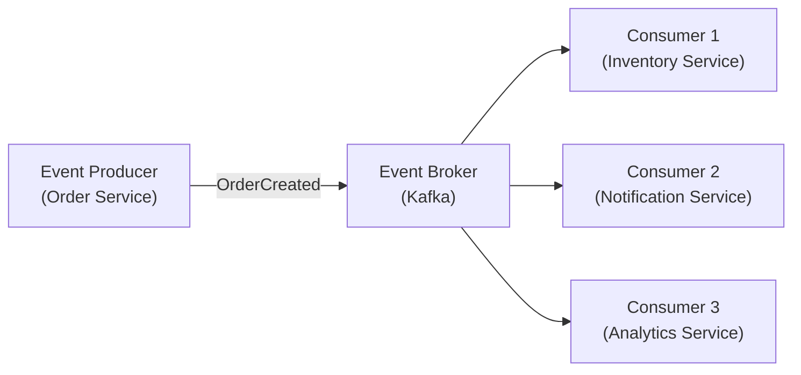
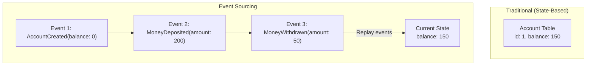
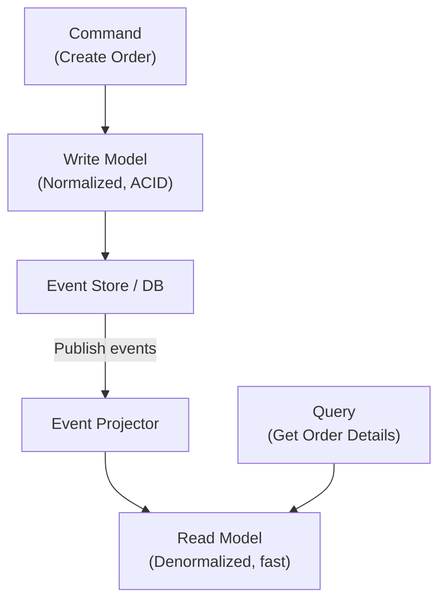
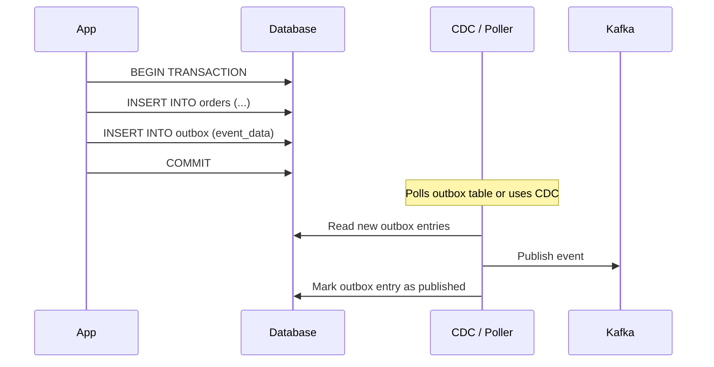
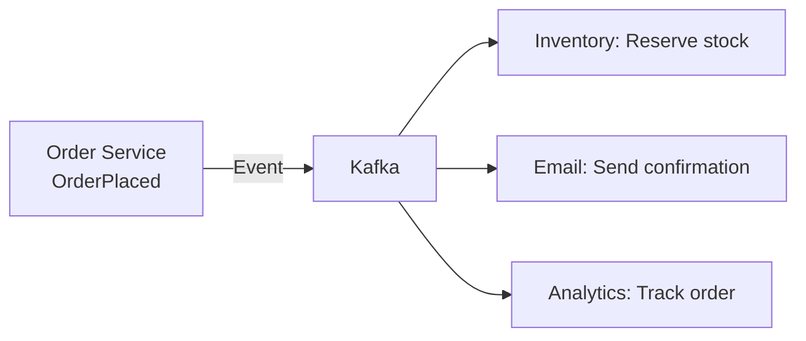
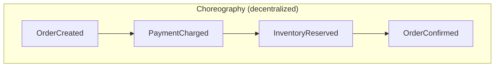
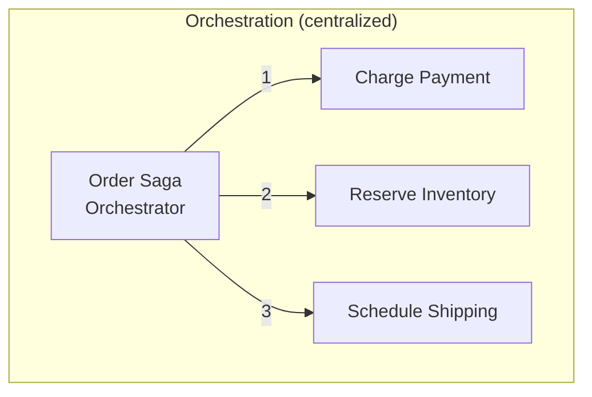

# Event-Driven Architecture

Building systems around events — decouple services, enable real-time processing, and create auditable, replayable systems.

---

## Core Concepts



| Concept | Description |
|---------|-------------|
| **Event** | A record of something that happened (immutable fact) |
| **Producer** | Service that publishes events |
| **Consumer** | Service that reacts to events |
| **Broker** | Middleware that routes events (Kafka, RabbitMQ, SNS) |
| **Event schema** | Structure of the event payload (use Avro, Protobuf, or JSON Schema) |

### Event Types

| Type | Description | Example |
|------|-------------|---------|
| **Domain event** | Business fact that happened | `OrderPlaced`, `PaymentProcessed` |
| **Integration event** | Event shared across services | `UserCreated` → notify all services |
| **Command** | Request to do something | `ProcessPayment` (imperative, not a fact) |

---

## Event Sourcing

Instead of storing current state, store the **sequence of events** that produced it.



| Pros | Cons |
|------|------|
| Full audit trail (every change recorded) | Event store grows forever (snapshots needed) |
| Time travel (reconstruct any past state) | Complex queries (need projections/CQRS) |
| Replay to fix bugs or build new views | Event schema evolution is tricky |
| Natural fit for event-driven architecture | Steeper learning curve |

### Event Store

```
Event Store (append-only log):
┌────┬──────────────┬──────────┬───────────────────────────┐
│ ID │ Aggregate ID │ Version  │ Event Data                │
├────┼──────────────┼──────────┼───────────────────────────┤
│ 1  │ order-123    │ 1        │ OrderCreated{items: [...]} │
│ 2  │ order-123    │ 2        │ PaymentReceived{amount: 50}│
│ 3  │ order-123    │ 3        │ OrderShipped{tracking: ...}│
└────┴──────────────┴──────────┴───────────────────────────┘
```

**Tools:** EventStoreDB, Kafka (as event store), Axon Framework, PostgreSQL (with append-only pattern).

---

## CQRS (Command Query Responsibility Segregation)

Separate the read and write models for different optimization.



### CQRS Models

| Model | Optimized For | Storage | Example |
|-------|--------------|---------|---------|
| **Write** | Consistency, validation | Normalized SQL, event store | PostgreSQL |
| **Read** | Query performance | Denormalized, cached | Elasticsearch, Redis, materialized views |

| Pros | Cons |
|------|------|
| Optimize reads and writes independently | Complexity (two models to maintain) |
| Scale read and write separately | Eventual consistency between models |
| Different tech for each (SQL + Elasticsearch) | Must handle projection lag |

**When to use:** Read/write patterns differ significantly, high read:write ratio, complex queries on read side.

---

## Outbox Pattern

Ensure events are published reliably when database state changes.

**Problem:** Writing to DB and publishing to Kafka isn't atomic — one might succeed and the other fail.



**Two approaches:**
1. **Polling publisher** — periodically query outbox table for unpublished events
2. **CDC (Change Data Capture)** — use Debezium to capture DB changes and publish to Kafka

---

## Event-Driven Patterns

### Event Notification

Fire-and-forget: "something happened, react if you care."



### Event-Carried State Transfer

Event includes all the data the consumer needs (no callback needed):

```json
{
  "type": "OrderPlaced",
  "data": {
    "orderId": "123",
    "userId": "456",
    "items": [{"productId": "789", "qty": 2, "price": 29.99}],
    "total": 59.98,
    "shippingAddress": { "city": "NYC", "zip": "10001" }
  }
}
```

**Pros:** Consumer is self-sufficient (no API calls needed). **Cons:** Large events, data coupling.

### Choreography vs Orchestration





| | Choreography | Orchestration |
|---|---|---|
| **Control** | Distributed (each service decides) | Centralized (orchestrator decides) |
| **Coupling** | Lower (events only) | Higher (orchestrator knows all steps) |
| **Visibility** | Hard to see full flow | Easy (one place to see workflow) |
| **Best for** | Simple flows, few services | Complex flows, many steps |

---

## Schema Evolution

Events live forever — how do you change their schema?

| Strategy | How | Tradeoff |
|----------|-----|----------|
| **Backward compatible** | Only add optional fields | Safe, recommended default |
| **Schema registry** | Centralize schemas (Confluent Schema Registry) | Enforced compatibility |
| **Versioned events** | `OrderCreatedV1`, `OrderCreatedV2` | Clear, but clutters codebase |
| **Upcasting** | Transform old events to new format on read | Flexible, complex |

---

## Common Interview Questions

1. **"What is event sourcing?"** → Store events (facts) instead of current state. Replay events to derive state. Full audit trail, time travel, replayable.
2. **"What is CQRS?"** → Separate read and write models. Write model optimized for consistency, read model for query performance. Eventually consistent.
3. **"How do you ensure events are published reliably?"** → Outbox pattern: write event to DB table in same transaction as state change. CDC or poller publishes to Kafka.
4. **"Choreography vs orchestration?"** → Choreography: each service reacts to events (decentralized). Orchestration: central coordinator manages workflow (centralized). Choreography for simple, orchestration for complex.
5. **"How do you handle event schema changes?"** → Backward-compatible changes only (add optional fields). Use schema registry for enforcement.
