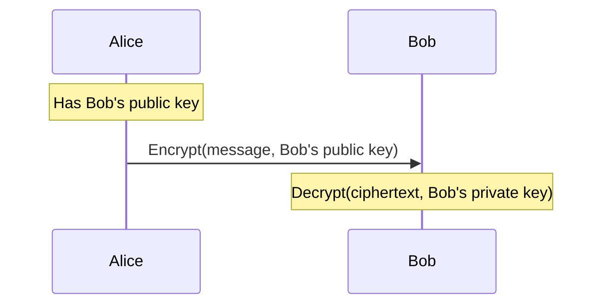
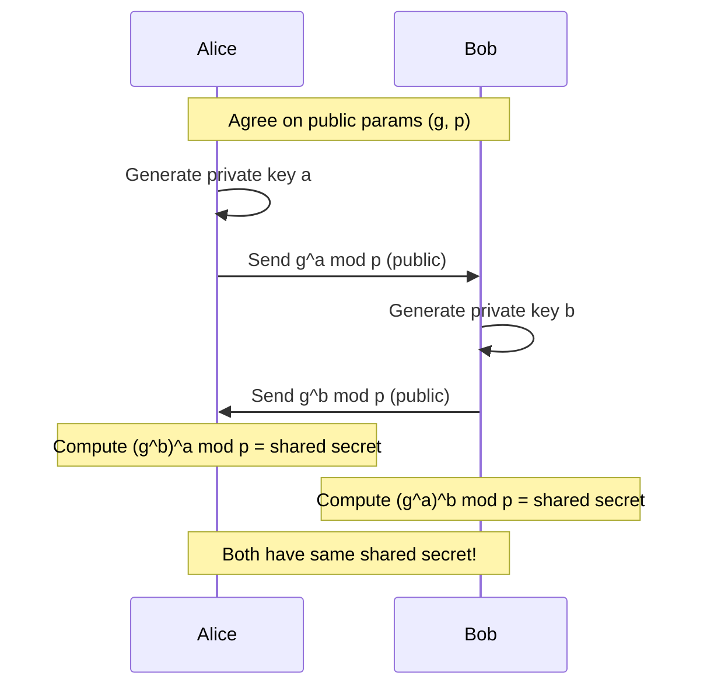
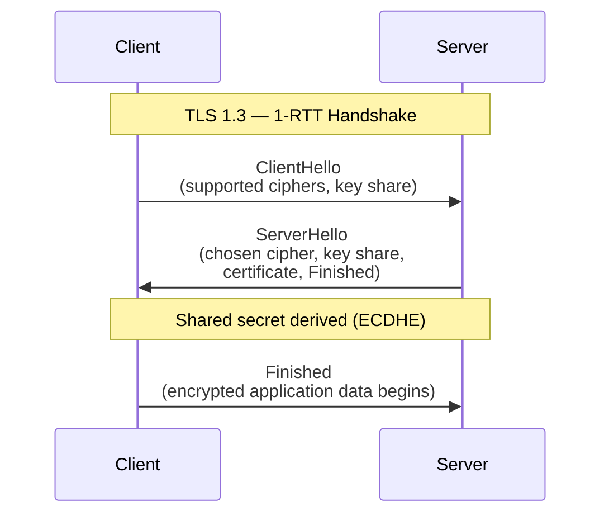
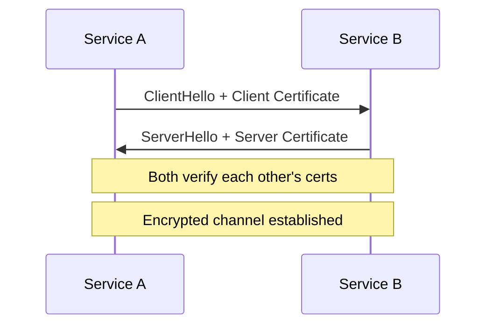
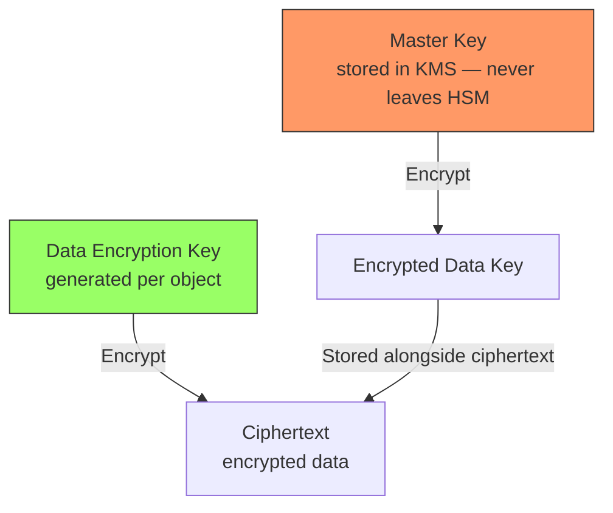
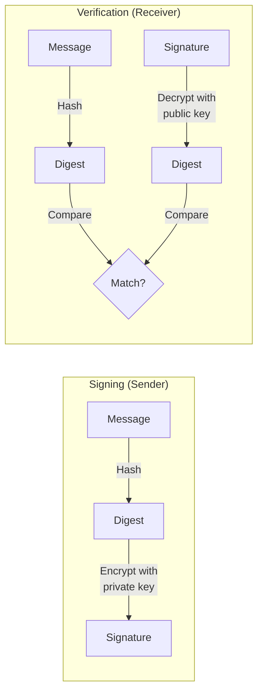

# Encryption

Cryptographic primitives and protocols that protect data confidentiality, integrity, and authenticity — the foundation of every secure system design.

---

## Symmetric Encryption

One key for both encryption and decryption. Fast, used for bulk data.

```
Plaintext ──[ Key ]──▶ Ciphertext ──[ Same Key ]──▶ Plaintext
```

### AES (Advanced Encryption Standard)

The industry standard. 128/192/256-bit key sizes.

| Mode | How It Works | Pros | Cons | Use When |
|------|-------------|------|------|----------|
| **ECB** | Each block encrypted independently | Simple, parallelizable | Identical blocks → identical ciphertext (pattern leakage) | Never in production |
| **CBC** | Each block XOR'd with previous ciphertext block | No pattern leakage | Sequential (can't parallelize), needs IV | Legacy systems |
| **CTR** | Encrypts counter values, XOR'd with plaintext | Parallelizable, no padding | Nonce reuse = catastrophic | Stream-like encryption |
| **GCM** | CTR mode + authentication tag (AEAD) | Authenticated encryption, parallelizable | 96-bit nonce (risk of collision at scale) | **Default choice** — TLS 1.3, cloud KMS |

### ChaCha20-Poly1305

| Feature | AES-256-GCM | ChaCha20-Poly1305 |
|---------|-------------|-------------------|
| **Speed (software)** | Slower without AES-NI | Faster on devices without hardware AES |
| **Speed (hardware)** | Faster with AES-NI instruction set | Comparable |
| **Nonce size** | 96-bit | 96-bit (XChaCha20: 192-bit) |
| **Best for** | Servers, cloud (AES-NI available) | Mobile, IoT, embedded devices |
| **Used by** | TLS 1.3, AWS, most cloud providers | TLS 1.3 (fallback), WireGuard, Signal |

---

## Asymmetric Encryption

Key pair: public key encrypts (or verifies), private key decrypts (or signs). Slow — used for key exchange and signatures, not bulk data.



### Algorithm Comparison

| Algorithm | Type | Key Size | Security Equivalent | Use Case |
|-----------|------|----------|-------------------|----------|
| **RSA-2048** | Encryption + signatures | 2048-bit | 112-bit symmetric | Legacy TLS, JWT (RS256) |
| **RSA-4096** | Encryption + signatures | 4096-bit | 140-bit symmetric | High-security signing |
| **ECDSA (P-256)** | Signatures only | 256-bit | 128-bit symmetric | TLS certificates, JWT (ES256), Bitcoin |
| **Ed25519** | Signatures only | 256-bit | 128-bit symmetric | SSH keys, modern protocols |
| **X25519** | Key exchange only | 256-bit | 128-bit symmetric | TLS 1.3 key exchange |

### Diffie-Hellman Key Exchange

Allows two parties to agree on a shared secret over an insecure channel without transmitting the secret.



**ECDH (Elliptic Curve DH)** is the modern variant — smaller keys, same security. Used in TLS 1.3.

---

## Hashing

One-way function: input → fixed-size digest. Cannot be reversed.

| Algorithm | Output Size | Speed | Use Case |
|-----------|------------|-------|----------|
| **SHA-256** | 256-bit | Fast | File integrity, digital signatures, blockchain |
| **SHA-3** | 256/512-bit | Fast | Alternative to SHA-2 (different construction) |
| **MD5** | 128-bit | Fast | ❌ Broken — collision attacks. Legacy checksums only |
| **BLAKE3** | 256-bit | Very fast | Modern alternative, parallelizable |

### Password Hashing

General-purpose hashes (SHA-256) are too fast — attackers can brute-force billions per second. Use **slow, salted** hashes:

| Algorithm | Memory-Hard | Tunable Cost | Recommended |
|-----------|------------|--------------|-------------|
| **bcrypt** | No | Work factor (rounds) | ✅ Widely supported, proven |
| **scrypt** | Yes | CPU + memory cost | ✅ Better than bcrypt for GPU resistance |
| **Argon2id** | Yes | Time, memory, parallelism | ✅ **Best choice** — winner of Password Hashing Competition |

**Always salt passwords** — a random value prepended to each password before hashing. Prevents rainbow table attacks and ensures identical passwords produce different hashes.

### HMAC (Hash-based Message Authentication Code)

Combines a hash function with a secret key to verify both integrity and authenticity.

```
HMAC(key, message) = Hash((key ⊕ opad) || Hash((key ⊕ ipad) || message))
```

| Use Case | Example |
|----------|---------|
| API request signing | AWS Signature V4 (HMAC-SHA256) |
| Webhook verification | Stripe signs payloads with HMAC-SHA256 |
| JWT signing | HS256 = HMAC-SHA256 |

---

## TLS / HTTPS

Transport Layer Security — encrypts data in transit. HTTPS = HTTP over TLS.

### TLS 1.3 Handshake

Reduced from 2 round trips (TLS 1.2) to **1 round trip** (1-RTT), with support for 0-RTT resumption.



### TLS 1.2 vs TLS 1.3

| Feature | TLS 1.2 | TLS 1.3 |
|---------|---------|---------|
| **Handshake** | 2-RTT | 1-RTT (0-RTT resumption) |
| **Key exchange** | RSA or ECDHE | ECDHE only (forward secrecy mandatory) |
| **Ciphers** | Many (some weak) | Only 5 strong AEAD ciphers |
| **Removed** | — | RSA key exchange, CBC ciphers, RC4, MD5, SHA-1 |

### Certificate Chain

```
Root CA (self-signed, in browser trust store)
  └── Intermediate CA (signed by Root)
        └── Server Certificate (signed by Intermediate)
              └── Your domain: api.example.com
```

Clients verify the chain bottom-up: server cert → intermediate → root (trusted).

### mTLS (Mutual TLS)

Both client **and** server present certificates. Used in service-to-service communication (zero-trust).



| Standard TLS | mTLS |
|-------------|------|
| Server proves identity to client | Both prove identity |
| Browser → website | Service mesh (Istio, Linkerd) |
| One certificate | Two certificates |

---

## Key Management

The hardest part of encryption. Compromised keys = compromised data regardless of algorithm strength.

### Key Management Services (KMS)

| Service | Provider | Key Feature |
|---------|----------|-------------|
| **AWS KMS** | AWS | Integrated with all AWS services, HSM-backed |
| **Cloud KMS** | GCP | Automatic key rotation, IAM integration |
| **Azure Key Vault** | Azure | Certificates + secrets + keys in one service |
| **HashiCorp Vault** | Open source / Enterprise | Multi-cloud, dynamic secrets, PKI |

### Envelope Encryption

The standard pattern used by all cloud KMS providers. Encrypt data with a data key, encrypt the data key with a master key.



**Why envelope encryption?**

| Benefit | Explanation |
|---------|-------------|
| **Master key never leaves KMS** | Reduced exposure — only the DEK travels |
| **Unique key per object** | Limits blast radius if one DEK is compromised |
| **Fast encryption** | AES with DEK locally, only the small DEK goes to KMS |
| **Easy key rotation** | Re-encrypt DEKs with new master key (data stays unchanged) |

### Key Rotation

| Strategy | How | Impact |
|----------|-----|--------|
| **Automatic rotation** | KMS generates new key version on schedule (e.g., 90 days) | Zero downtime — KMS handles versioning |
| **Manual rotation** | Generate new key, re-encrypt existing data | Needed when key may be compromised |
| **Crypto-shredding** | Delete the encryption key to make data unrecoverable | GDPR "right to erasure" compliance |

---

## Encryption at Rest / In Transit / In Use

| Scope | What | Threat Mitigated | Example |
|-------|------|-----------------|---------|
| **At rest** | Data stored on disk encrypted | Disk theft, unauthorized DB access | AWS EBS encryption, TDE (Transparent Data Encryption) |
| **In transit** | Data encrypted during transfer | MITM attacks, network sniffing | TLS/HTTPS, mTLS, VPN |
| **In use** | Data encrypted while being processed | Memory dumps, insider threats | Confidential computing (AWS Nitro Enclaves, Intel SGX) |

### Encryption at Rest — Approaches

| Approach | Level | Who Manages Keys | Example |
|----------|-------|-----------------|---------|
| **Full-disk encryption** | Storage layer | Cloud provider | AWS EBS default encryption |
| **Database TDE** | Database layer | DBA / KMS | PostgreSQL TDE, Oracle TDE |
| **Application-level** | Application layer | Application team | Encrypt PII before storing |
| **Client-side** | Client | End user | E2E encryption (Signal, WhatsApp) |

**Layered defense:** Use multiple levels. Even if application-level encryption is bypassed, disk encryption still protects against physical access.

---

## Digital Signatures & Certificates

### How Digital Signatures Work



### PKI (Public Key Infrastructure)

| Component | Role |
|-----------|------|
| **Certificate Authority (CA)** | Issues and signs certificates (Let's Encrypt, DigiCert) |
| **Registration Authority (RA)** | Verifies identity before CA issues cert |
| **Certificate (X.509)** | Binds a public key to an identity (domain, organization) |
| **CRL / OCSP** | Certificate revocation — check if cert is still valid |

### X.509 Certificate Fields

| Field | Description |
|-------|-------------|
| **Subject** | Who the cert belongs to (CN=api.example.com) |
| **Issuer** | CA that signed the cert |
| **Validity** | Not Before / Not After dates |
| **Public Key** | The subject's public key |
| **Signature** | CA's signature over all fields |
| **SANs** | Subject Alternative Names (additional domains) |

---

## Common Interview Questions

**1. "How does HTTPS work?"**
→ Client initiates TLS handshake: exchanges supported ciphers, performs ECDH key exchange, verifies server certificate chain. After handshake, all data encrypted with symmetric key (AES-GCM). TLS 1.3 completes in 1-RTT.

**2. "Symmetric vs asymmetric encryption — when do you use each?"**
→ Symmetric (AES) for bulk data encryption — fast, single key. Asymmetric (RSA/ECC) for key exchange and digital signatures — slow, key pair. In practice, use asymmetric to exchange a symmetric key, then symmetric for data (this is exactly how TLS works).

**3. "How do you store passwords securely?"**
→ Never store plaintext or fast hashes (MD5/SHA). Use Argon2id (best), bcrypt, or scrypt — slow, salted, memory-hard. Add a unique random salt per user. Enforce MFA as a second factor.

**4. "What is envelope encryption and why use it?"**
→ Encrypt data with a Data Encryption Key (DEK), then encrypt the DEK with a Master Key in KMS. The master key never leaves the HSM. Benefits: unique key per object limits blast radius, key rotation only re-encrypts DEKs (not all data), and encryption is fast because AES happens locally.

**5. "How would you design encryption for a multi-tenant SaaS?"**
→ Per-tenant encryption keys (stored in KMS), envelope encryption pattern, key rotation per tenant. Use application-level encryption for PII fields + disk encryption as defense-in-depth. Crypto-shredding for tenant offboarding (delete key = data unrecoverable).

**6. "What is forward secrecy and why does it matter?"**
→ Even if the server's long-term private key is compromised, past sessions can't be decrypted. Achieved with ephemeral Diffie-Hellman (ECDHE) — each session generates a unique key pair. TLS 1.3 mandates forward secrecy; TLS 1.2 with RSA key exchange does not provide it.
