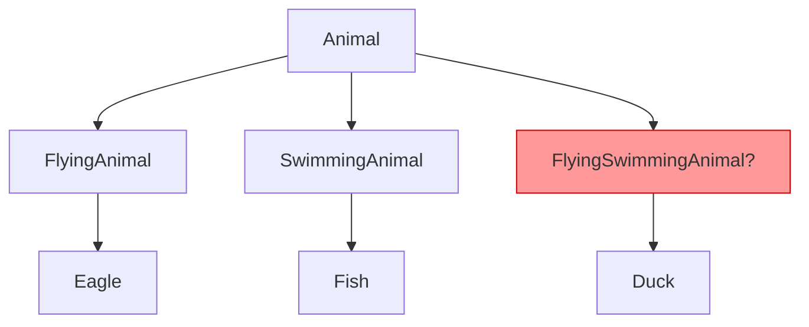
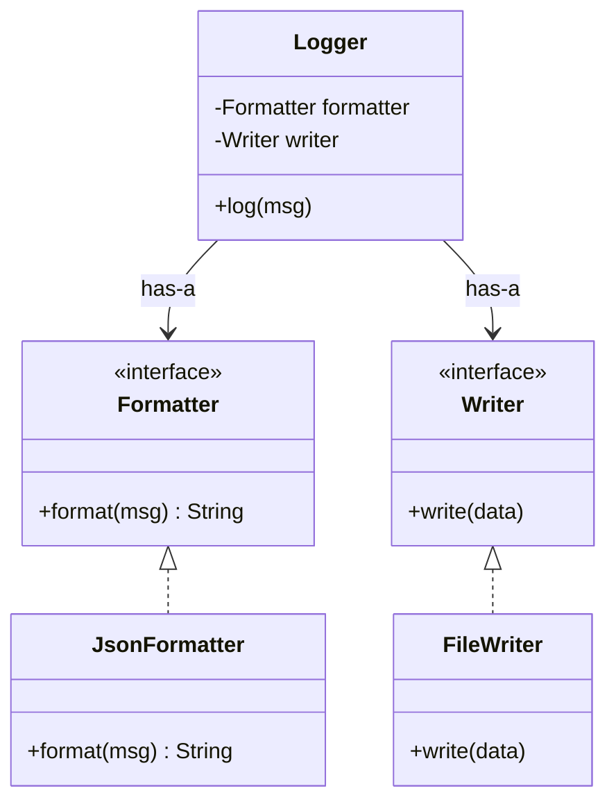
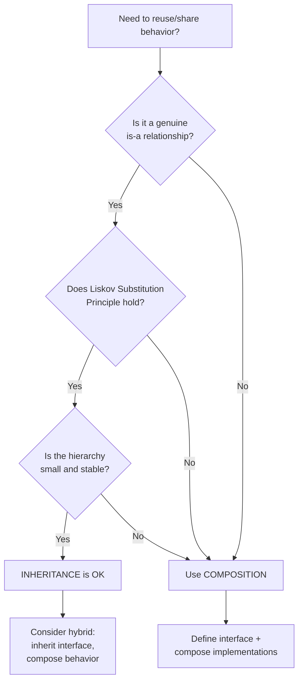

# Composition vs Inheritance

Two fundamental approaches to code reuse in object-oriented design, and understanding when to apply each is a hallmark of senior engineering maturity.

---

## Inheritance (is-a Relationship)

Inheritance models a **subtype** relationship: a `Dog` **is-a** `Animal`, a `SavingsAccount` **is-a** `BankAccount`. The subclass inherits fields and methods from its parent and can override behavior.

### When to Use

- There is a **genuine taxonomic** relationship (not just shared behavior)
- The **Liskov Substitution Principle** holds: every instance of the subclass can replace the parent without breaking correctness
- You want **polymorphic dispatch** through a stable, well-understood hierarchy

### Advantages

| Advantage | Explanation |
|-----------|-------------|
| **Code reuse** | Shared logic lives in the base class once |
| **Polymorphism** | Callers program to the base type; behavior varies by subclass |
| **Simplicity** | For small, stable hierarchies, inheritance is the most concise model |

### Code Examples

#### Java

```java
abstract class Animal {
    private String name;

    public Animal(String name) { this.name = name; }

    public String getName() { return name; }

    /** Template method — subclasses override */
    public abstract String speak();

    public String describe() {
        return getName() + " says " + speak();
    }
}

class Dog extends Animal {
    public Dog(String name) { super(name); }

    @Override
    public String speak() { return "Woof!"; }
}

class Cat extends Animal {
    public Cat(String name) { super(name); }

    @Override
    public String speak() { return "Meow!"; }
}

// Usage
Animal a = new Dog("Rex");
System.out.println(a.describe());  // Rex says Woof!
```

#### C++

```cpp
#include <iostream>
#include <string>
#include <memory>

class Animal {
    std::string name_;
public:
    explicit Animal(std::string name) : name_(std::move(name)) {}
    virtual ~Animal() = default;

    const std::string& getName() const { return name_; }
    virtual std::string speak() const = 0;  // pure virtual

    std::string describe() const {
        return getName() + " says " + speak();
    }
};

class Dog : public Animal {
public:
    explicit Dog(std::string name) : Animal(std::move(name)) {}
    std::string speak() const override { return "Woof!"; }
};

class Cat : public Animal {
public:
    explicit Cat(std::string name) : Animal(std::move(name)) {}
    std::string speak() const override { return "Meow!"; }
};

// Usage
std::unique_ptr<Animal> a = std::make_unique<Dog>("Rex");
std::cout << a->describe() << "\n";  // Rex says Woof!
```

#### Python

```python
from abc import ABC, abstractmethod

class Animal(ABC):
    def __init__(self, name: str):
        self._name = name

    @property
    def name(self) -> str:
        return self._name

    @abstractmethod
    def speak(self) -> str: ...

    def describe(self) -> str:
        return f"{self.name} says {self.speak()}"

class Dog(Animal):
    def speak(self) -> str:
        return "Woof!"

class Cat(Animal):
    def speak(self) -> str:
        return "Meow!"

# Usage
a: Animal = Dog("Rex")
print(a.describe())  # Rex says Woof!
```

---

## Problems with Inheritance

### 1. Fragile Base Class Problem

A change in the base class can **silently break** subclasses. Subclasses depend on internal implementation details they did not write.

```java
// Base class adds a new method or changes an existing one
class HashSet<E> {
    public boolean add(E e) { /* ... */ }
    public boolean addAll(Collection<E> c) {
        // Internally calls add() for each element
        for (E e : c) add(e);
        return true;
    }
}

class CountingHashSet<E> extends HashSet<E> {
    private int count = 0;

    @Override
    public boolean add(E e) {
        count++;
        return super.add(e);
    }

    @Override
    public boolean addAll(Collection<E> c) {
        count += c.size();
        return super.addAll(c);  // BUG: super.addAll calls this.add()
    }                             // so count is incremented TWICE per element
}
```

This is the classic example from *Effective Java* (Item 18). The subclass cannot safely override `addAll` because it depends on the base class's implementation detail that `addAll` calls `add`.

### 2. Tight Coupling

The subclass is **intimately bound** to the parent's interface and implementation. You cannot change the parent without auditing every subclass.

### 3. Rigid Hierarchies

Once you commit to an inheritance tree, restructuring is expensive. Adding a new axis of variation (e.g., flying animals vs. swimming animals vs. both) leads to a **combinatorial explosion** of subclasses.



### 4. Diamond Problem (C++ / Python)

When a class inherits from two classes that share a common ancestor, which version of the ancestor's methods does it get?

```cpp
class Animal      { public: virtual void eat() { /* ... */ } };
class FlyingAnimal : public Animal { /* ... */ };
class Swimming     : public Animal { /* ... */ };
class Duck : public FlyingAnimal, public Swimming { };
// Which Animal::eat() does Duck inherit? Ambiguous without virtual inheritance.
```

C++ solves this with **virtual inheritance**; Java avoids it by disallowing multiple class inheritance (interfaces only). Python uses the **C3 linearization (MRO)** algorithm.

---

## Composition (has-a Relationship)

Composition models **containment**: an object holds a reference to another object and **delegates** work to it. A `Car` **has-a** `Engine`; a `Logger` **has-a** `Formatter`.

### Delegation Pattern

Instead of inheriting behavior, you hold a reference and forward calls:



### Advantages

| Advantage | Explanation |
|-----------|-------------|
| **Loose coupling** | The outer class depends only on the interface, not the implementation |
| **Runtime flexibility** | Swap implementations at runtime (e.g., change strategy) |
| **Avoids hierarchy explosion** | Combine behaviors freely without deep trees |
| **Easier testing** | Mock or stub composed dependencies independently |
| **No fragile base class** | Delegation cannot break when the delegate's internals change (contract stays stable) |

### Code Examples

#### Java

```java
// Define behavior as interfaces
interface MovementStrategy {
    void move();
}

interface SoundStrategy {
    String makeSound();
}

// Concrete implementations
class FlyMovement implements MovementStrategy {
    @Override
    public void move() { System.out.println("Flying through the air"); }
}

class SwimMovement implements MovementStrategy {
    @Override
    public void move() { System.out.println("Swimming through water"); }
}

class WalkMovement implements MovementStrategy {
    @Override
    public void move() { System.out.println("Walking on land"); }
}

class BarkSound implements SoundStrategy {
    @Override
    public String makeSound() { return "Woof!"; }
}

class QuackSound implements SoundStrategy {
    @Override
    public String makeSound() { return "Quack!"; }
}

// Compose behaviors — no inheritance needed
class Animal {
    private final String name;
    private MovementStrategy movement;
    private SoundStrategy sound;

    public Animal(String name, MovementStrategy movement, SoundStrategy sound) {
        this.name = name;
        this.movement = movement;
        this.sound = sound;
    }

    public void setMovement(MovementStrategy movement) { this.movement = movement; }

    public void performMove() { movement.move(); }
    public String describe() { return name + " says " + sound.makeSound(); }
}

// Usage — a duck that can switch from swimming to flying
Animal duck = new Animal("Duck", new SwimMovement(), new QuackSound());
duck.performMove();           // Swimming through water
duck.setMovement(new FlyMovement());
duck.performMove();           // Flying through the air
```

#### C++

```cpp
#include <iostream>
#include <string>
#include <memory>

// Interfaces
class MovementStrategy {
public:
    virtual ~MovementStrategy() = default;
    virtual void move() const = 0;
};

class SoundStrategy {
public:
    virtual ~SoundStrategy() = default;
    virtual std::string makeSound() const = 0;
};

// Concrete implementations
class FlyMovement : public MovementStrategy {
public:
    void move() const override { std::cout << "Flying through the air\n"; }
};

class SwimMovement : public MovementStrategy {
public:
    void move() const override { std::cout << "Swimming through water\n"; }
};

class BarkSound : public SoundStrategy {
public:
    std::string makeSound() const override { return "Woof!"; }
};

class QuackSound : public SoundStrategy {
public:
    std::string makeSound() const override { return "Quack!"; }
};

// Compose behaviors
class Animal {
    std::string name_;
    std::unique_ptr<MovementStrategy> movement_;
    std::unique_ptr<SoundStrategy> sound_;
public:
    Animal(std::string name,
           std::unique_ptr<MovementStrategy> movement,
           std::unique_ptr<SoundStrategy> sound)
        : name_(std::move(name)),
          movement_(std::move(movement)),
          sound_(std::move(sound)) {}

    void setMovement(std::unique_ptr<MovementStrategy> m) { movement_ = std::move(m); }
    void performMove() const { movement_->move(); }
    std::string describe() const { return name_ + " says " + sound_->makeSound(); }
};

// Usage
auto duck = Animal("Duck",
    std::make_unique<SwimMovement>(),
    std::make_unique<QuackSound>());
duck.performMove();  // Swimming through water
duck.setMovement(std::make_unique<FlyMovement>());
duck.performMove();  // Flying through the air
```

#### Python

```python
from typing import Protocol

# Interfaces (structural typing via Protocol)
class MovementStrategy(Protocol):
    def move(self) -> None: ...

class SoundStrategy(Protocol):
    def make_sound(self) -> str: ...

# Concrete implementations
class FlyMovement:
    def move(self) -> None:
        print("Flying through the air")

class SwimMovement:
    def move(self) -> None:
        print("Swimming through water")

class BarkSound:
    def make_sound(self) -> str:
        return "Woof!"

class QuackSound:
    def make_sound(self) -> str:
        return "Quack!"

# Compose behaviors
class Animal:
    def __init__(self, name: str, movement: MovementStrategy, sound: SoundStrategy):
        self.name = name
        self.movement = movement
        self.sound = sound

    def perform_move(self) -> None:
        self.movement.move()

    def describe(self) -> str:
        return f"{self.name} says {self.sound.make_sound()}"

# Usage
duck = Animal("Duck", SwimMovement(), QuackSound())
duck.perform_move()           # Swimming through water
duck.movement = FlyMovement()
duck.perform_move()           # Flying through the air
```

---

## "Favor Composition Over Inheritance"

This is one of the two core principles from the Gang of Four (GoF) *Design Patterns* book (1994). The full quote:

> "Favor object composition over class inheritance."
> -- *Design Patterns: Elements of Reusable Object-Oriented Software*

### Why the GoF Recommends This

1. **Inheritance breaks encapsulation** -- a subclass depends on the parent's implementation, not just its interface
2. **Composition is defined at runtime**, inheritance at compile time -- composition is inherently more flexible
3. **Small, focused objects** are easier to reason about than deep class hierarchies
4. **Reuse via composition** lets you mix and match capabilities without creating new classes for every combination

### Design Patterns That Use Composition Over Inheritance

| Pattern | How It Uses Composition |
|---------|------------------------|
| **Strategy** | Encapsulate interchangeable algorithms behind an interface; the context holds a strategy reference |
| **Decorator** | Wrap an object to add behavior; decorators compose around the original |
| **Bridge** | Separate abstraction from implementation; each side varies independently |
| **Observer** | Subject holds a list of observer references; no inheritance needed |
| **State** | Context delegates to a state object; state transitions swap the composed object |

### Real-World Refactoring: Inheritance to Composition

**Before (inheritance)** -- rigid, hard to extend:

```java
// Every new notification type requires a new subclass
abstract class Notification {
    abstract void send(String message, String recipient);
}

class EmailNotification extends Notification {
    @Override
    void send(String message, String recipient) {
        // send via SMTP
    }
}

class SmsNotification extends Notification {
    @Override
    void send(String message, String recipient) {
        // send via SMS gateway
    }
}

// What if we want to send via Email AND SMS?
// What if we want to add logging, retry, rate-limiting to some but not all?
// Subclass explosion!
```

**After (composition)** -- flexible, combinable:

```java
interface NotificationChannel {
    void send(String message, String recipient);
}

class EmailChannel implements NotificationChannel {
    @Override
    public void send(String message, String recipient) { /* SMTP */ }
}

class SmsChannel implements NotificationChannel {
    @Override
    public void send(String message, String recipient) { /* SMS gateway */ }
}

// Decorator for cross-cutting concerns
class RetryChannel implements NotificationChannel {
    private final NotificationChannel delegate;
    private final int maxRetries;

    public RetryChannel(NotificationChannel delegate, int maxRetries) {
        this.delegate = delegate;
        this.maxRetries = maxRetries;
    }

    @Override
    public void send(String message, String recipient) {
        for (int i = 0; i <= maxRetries; i++) {
            try {
                delegate.send(message, recipient);
                return;
            } catch (Exception e) {
                if (i == maxRetries) throw e;
            }
        }
    }
}

// Compose behaviors at runtime
class NotificationService {
    private final List<NotificationChannel> channels;

    public NotificationService(List<NotificationChannel> channels) {
        this.channels = channels;
    }

    public void notify(String message, String recipient) {
        for (NotificationChannel ch : channels) {
            ch.send(message, recipient);
        }
    }
}

// Usage — send via both channels, with retry on email
NotificationService svc = new NotificationService(List.of(
    new RetryChannel(new EmailChannel(), 3),
    new SmsChannel()
));
svc.notify("Server is down!", "oncall@example.com");
```

---

## Decision Framework



### Summary Table

| Criterion | Use Inheritance | Use Composition |
|-----------|----------------|-----------------|
| **Relationship** | Genuine is-a (Dog is-a Animal) | has-a or uses-a (Car has-a Engine) |
| **LSP** | Subtype is fully substitutable | N/A |
| **Hierarchy depth** | Shallow (1-2 levels) | Any depth of delegation |
| **Variation axes** | Single axis of variation | Multiple independent axes |
| **Runtime flexibility** | Not needed (type fixed at creation) | Need to swap behavior at runtime |
| **Stability** | Base class is stable, rarely changes | Implementation likely to evolve |

### The Hybrid Approach: Inherit Interface, Compose Behavior

The best designs often combine both: **inherit from an interface** (or abstract class with no state) for polymorphism, and **compose concrete behavior** via delegation.

```java
// Inherit the interface
interface Sorter<T extends Comparable<T>> {
    void sort(List<T> items);
}

// Compose the comparison strategy
class FlexibleSorter<T extends Comparable<T>> implements Sorter<T> {
    private final Comparator<T> comparator;  // composed behavior
    private final SortAlgorithm algorithm;   // composed behavior

    public FlexibleSorter(Comparator<T> comparator, SortAlgorithm algorithm) {
        this.comparator = comparator;
        this.algorithm = algorithm;
    }

    @Override
    public void sort(List<T> items) {
        algorithm.sort(items, comparator);
    }
}
```

This pattern gives you:
- **Polymorphism** from the interface (callers program to `Sorter<T>`)
- **Flexibility** from composition (swap comparator or algorithm independently)
- **Testability** (mock `SortAlgorithm` or `Comparator` independently)

---

## Common Interview Questions

**Q1: When should you use inheritance over composition?**

Use inheritance when there is a genuine is-a relationship, the Liskov Substitution Principle holds without exceptions, the hierarchy is shallow and stable, and you need polymorphic dispatch. Examples: exception hierarchies, UI widget base classes. In all other cases, prefer composition.

**Q2: What is the fragile base class problem?**

When a subclass depends on internal implementation details of its parent, changes to the base class can silently break the subclass. The classic example is overriding `addAll()` in a subclass of `HashSet`, where `addAll()` internally calls `add()` -- the subclass cannot know this without reading the source. This violates encapsulation and is a key argument against deep inheritance.

**Q3: How does composition enable runtime flexibility that inheritance cannot?**

With composition, you hold a reference to an interface. You can swap the concrete implementation at any time (e.g., `setMovement(new FlyMovement())`). With inheritance, the type hierarchy is fixed at compile time -- a `Dog` cannot become a `Cat`. The Strategy and State patterns exploit this directly.

**Q4: Explain the diamond problem and how different languages solve it.**

The diamond problem occurs when class D inherits from B and C, which both inherit from A. D has two copies of A's state and ambiguous method resolution. C++ solves it with **virtual inheritance** (single shared base). Java avoids it by allowing only single class inheritance (multiple interface inheritance is fine since interfaces carry no state). Python uses **C3 linearization (MRO)** to define a deterministic method resolution order.

**Q5: What does "inherit interface, compose behavior" mean?**

It is the hybrid approach: implement an interface (or extend an abstract class) to gain polymorphism, but delegate the actual work to composed objects. This gives you the best of both worlds -- callers can program to the abstract type, but the concrete behavior is assembled from small, swappable components. The Bridge and Strategy patterns are prime examples.

**Q6: Refactor this inheritance hierarchy into composition: `Rectangle -> Button -> AnimatedButton -> ThemeableAnimatedButton`.**

The deep hierarchy mixes concerns (shape, interactivity, animation, theming). Refactor by defining interfaces for each concern -- `Renderer`, `Animator`, `Theme` -- and composing them inside a single `Button` class. The button holds references to each and delegates: `button = new Button(new RectRenderer(), new FadeAnimator(), new DarkTheme())`. Each axis of variation can change independently without creating new subclasses.
