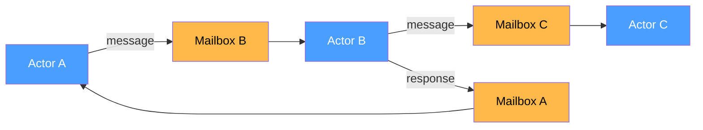
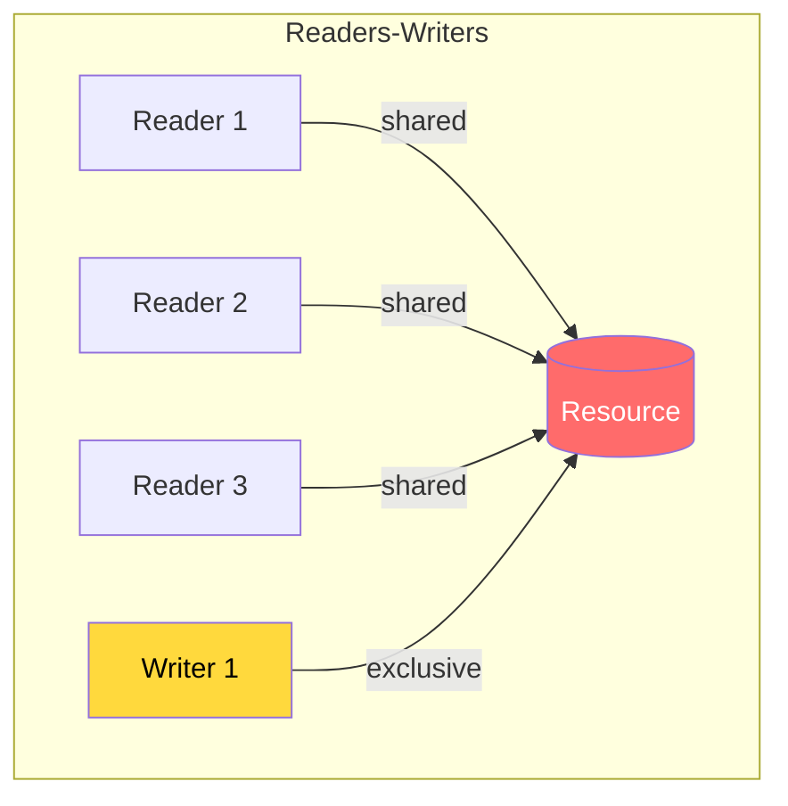
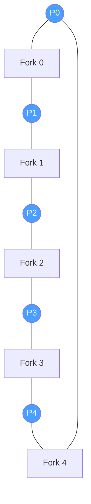

# Advanced Concurrency

Beyond locks and threads, senior engineers must understand lock-free programming, memory models, actor-based concurrency, and classic synchronization problems that appear frequently in system design and coding interviews.

---

## 1. Lock-Free Data Structures

Lock-free algorithms guarantee that **at least one thread makes progress** in a finite number of steps, even if other threads are suspended. They rely on atomic **Compare-And-Swap (CAS)** operations instead of mutual exclusion.

### CAS (Compare-And-Swap)

CAS takes three arguments: a memory location, an expected value, and a new value. It atomically updates the location only if it currently holds the expected value.

```
CAS(address, expected, new_value):
    if *address == expected:
        *address = new_value
        return true
    return false
```

### Lock-Free Stack (Treiber Stack)

**Java**
```java
import java.util.concurrent.atomic.AtomicReference;

public class LockFreeStack<T> {
    private static class Node<T> {
        final T value;
        Node<T> next;
        Node(T value) { this.value = value; }
    }

    private final AtomicReference<Node<T>> top = new AtomicReference<>(null);

    public void push(T value) {
        Node<T> newNode = new Node<>(value);
        Node<T> oldTop;
        do {
            oldTop = top.get();
            newNode.next = oldTop;
        } while (!top.compareAndSet(oldTop, newNode)); // CAS retry loop
    }

    public T pop() {
        Node<T> oldTop;
        Node<T> newTop;
        do {
            oldTop = top.get();
            if (oldTop == null) return null;
            newTop = oldTop.next;
        } while (!top.compareAndSet(oldTop, newTop));
        return oldTop.value;
    }
}
```

**C++**
```cpp
#include <atomic>
#include <memory>

template <typename T>
class LockFreeStack {
    struct Node {
        T value;
        Node* next;
        Node(T val) : value(std::move(val)), next(nullptr) {}
    };

    std::atomic<Node*> top{nullptr};

public:
    void push(T value) {
        Node* newNode = new Node(std::move(value));
        newNode->next = top.load(std::memory_order_relaxed);
        // CAS: update top only if it hasn't changed
        while (!top.compare_exchange_weak(
            newNode->next, newNode,
            std::memory_order_release,
            std::memory_order_relaxed));
    }

    bool pop(T& result) {
        Node* oldTop = top.load(std::memory_order_acquire);
        while (oldTop) {
            if (top.compare_exchange_weak(
                    oldTop, oldTop->next,
                    std::memory_order_acquire,
                    std::memory_order_relaxed)) {
                result = std::move(oldTop->value);
                delete oldTop; // simplified; real code needs hazard pointers / epoch-based reclamation
                return true;
            }
        }
        return false;
    }
};
```

**Python** (using `threading` -- Python lacks hardware CAS, but the concept applies)
```python
import threading

class LockFreeStack:
    """Simulated lock-free stack using a lock to emulate CAS.
    True lock-free requires native atomic operations (e.g., via ctypes or C extensions).
    """
    def __init__(self):
        self._top = None
        self._lock = threading.Lock()  # simulates atomic CAS

    def push(self, value):
        node = {"value": value, "next": None}
        while True:
            with self._lock:
                node["next"] = self._top
                self._top = node
                return

    def pop(self):
        while True:
            with self._lock:
                if self._top is None:
                    return None
                node = self._top
                self._top = node["next"]
                return node["value"]
```

> **Note:** Python's GIL prevents true parallel execution of pure Python threads. Real lock-free structures in Python are typically implemented in C extensions.

### ConcurrentHashMap Internals (Java)

Java's `ConcurrentHashMap` uses a combination of techniques across versions:

| Aspect | Java 7 (Segment-based) | Java 8+ (Node-based) |
|--------|------------------------|----------------------|
| Locking granularity | Per-segment (16 segments default) | Per-bucket (individual bin) |
| Lock type | `ReentrantLock` per segment | `synchronized` on bin head node |
| Read operations | Mostly lock-free (volatile reads) | Lock-free (volatile + CAS) |
| Collision handling | Linked list | Linked list -> Red-black tree (at 8 nodes) |
| CAS usage | Limited | `putIfAbsent`, size counting, bin initialization |
| Resize strategy | Per-segment rehash | Cooperative incremental resize (transfer) |

Key operations in Java 8+:
- **get()** -- fully lock-free, uses `volatile` reads of `Node.val` and `Node.next`
- **put()** -- CAS to insert into empty bin; `synchronized` on bin head for non-empty bins
- **size()** -- uses a `CounterCell[]` array (striped counter) with CAS to avoid contention

### ABA Problem

A critical pitfall in CAS-based algorithms: a value changes from A to B to A, and the CAS succeeds even though the state has changed. Solutions:

- **Tagged pointers / version counters** -- pair the pointer with a monotonically increasing stamp
- **Java `AtomicStampedReference`** -- CAS checks both value and stamp
- **Hazard pointers / epoch-based reclamation** -- prevents reuse of memory that another thread might reference

---

## 2. Wait-Free Algorithms

Wait-free is a stronger guarantee than lock-free: **every thread completes its operation in a bounded number of steps**, regardless of other threads' behavior.

| Property | Lock-Free | Wait-Free |
|----------|-----------|-----------|
| Progress guarantee | At least one thread progresses | Every thread progresses |
| Starvation possible? | Yes (a thread can starve) | No |
| Bounded steps? | No (retries can be unbounded) | Yes (bounded by N or constant) |
| Complexity | Moderate | High |
| Performance | Generally faster in practice | Overhead from helping mechanism |
| Example | Treiber stack, Michael-Scott queue | `AtomicInteger.getAndIncrement()` |

### Key Techniques

- **Helping mechanism** -- fast threads help slow threads complete their operations
- **Announce-and-help** -- each thread publishes its pending operation; any thread can complete it
- **Universal construction** -- any sequential object can be made wait-free, but with high overhead

```java
// Java's AtomicInteger.getAndIncrement() is wait-free
// Internally uses a hardware CAS instruction that is bounded
import java.util.concurrent.atomic.AtomicInteger;

AtomicInteger counter = new AtomicInteger(0);
int prev = counter.getAndIncrement(); // wait-free on most architectures
```

---

## 3. Memory Models

A memory model defines the rules for how memory operations (reads and writes) become visible across threads. Without understanding memory models, concurrent code can appear to work in testing but fail under different hardware or optimizations.

### Java Memory Model (JMM)

The JMM defines **happens-before** relationships that guarantee visibility:

| Happens-Before Rule | Description |
|---------------------|-------------|
| Program order | Each action in a thread happens-before every subsequent action in that thread |
| Monitor lock | An unlock on a monitor happens-before every subsequent lock on that monitor |
| Volatile | A write to a `volatile` field happens-before every subsequent read of that field |
| Thread start | `thread.start()` happens-before any action in the started thread |
| Thread join | All actions in a thread happen-before `thread.join()` returns |
| Transitivity | If A happens-before B, and B happens-before C, then A happens-before C |

**Java**
```java
public class VisibilityExample {
    private volatile boolean flag = false;
    private int data = 0;

    // Thread 1
    public void writer() {
        data = 42;           // (1) write to non-volatile
        flag = true;         // (2) volatile write -- publishes data too
    }

    // Thread 2
    public void reader() {
        if (flag) {          // (3) volatile read -- sees (2)
            // Guaranteed to see data == 42 because of happens-before:
            // (1) hb (2) [program order] and (2) hb (3) [volatile rule]
            // Therefore (1) hb (3) [transitivity]
            System.out.println(data); // prints 42
        }
    }
}
```

### C++ Memory Ordering

C++11 provides fine-grained control over memory ordering via `std::memory_order`:

| Memory Order | Guarantee | Use Case |
|-------------|-----------|----------|
| `memory_order_relaxed` | Atomicity only, no ordering | Counters, statistics |
| `memory_order_acquire` | Reads after this see writes before a paired release | Loading a flag/pointer |
| `memory_order_release` | Writes before this are visible after a paired acquire | Storing a flag/pointer |
| `memory_order_acq_rel` | Both acquire and release | Read-modify-write operations |
| `memory_order_seq_cst` | Total order across all threads (default) | When simplicity matters |

**C++**
```cpp
#include <atomic>
#include <thread>
#include <cassert>

std::atomic<bool> flag{false};
int data = 0;

void writer() {
    data = 42;                                          // non-atomic write
    flag.store(true, std::memory_order_release);        // release: publishes data
}

void reader() {
    while (!flag.load(std::memory_order_acquire)) {}    // acquire: syncs with release
    assert(data == 42);                                 // guaranteed to hold
}

// Relaxed ordering example -- only guarantees atomicity
std::atomic<int> counter{0};
void increment() {
    counter.fetch_add(1, std::memory_order_relaxed);    // fine for a simple counter
}
```

**Python**
```python
import threading

# Python's threading module provides implicit memory visibility
# through the GIL and synchronization primitives.
# After acquiring a lock, all previous writes by other threads
# that released the same lock are visible.

data = 0
ready = threading.Event()

def writer():
    global data
    data = 42
    ready.set()  # acts as a release barrier

def reader():
    ready.wait()  # acts as an acquire barrier
    assert data == 42  # guaranteed

t1 = threading.Thread(target=writer)
t2 = threading.Thread(target=reader)
t1.start(); t2.start()
t1.join(); t2.join()
```

---

## 4. Concurrent Data Structures

### Comparison Table

| Data Structure | Thread-Safe? | Read Performance | Write Performance | Iterator Behavior | Best For |
|---------------|-------------|-----------------|-------------------|-------------------|----------|
| `HashMap` | No | O(1) | O(1) | Fail-fast | Single-threaded |
| `ConcurrentHashMap` | Yes | O(1), lock-free | O(1), per-bin lock | Weakly consistent | High-concurrency read/write |
| `Collections.synchronizedMap` | Yes | O(1), global lock | O(1), global lock | Fail-fast (must sync) | Low-concurrency retrofit |
| `Hashtable` | Yes | O(1), global lock | O(1), global lock | Fail-fast | Legacy (avoid) |
| `CopyOnWriteArrayList` | Yes | O(1), lock-free | O(n), copies array | Snapshot | Read-heavy, rare writes |
| `BlockingQueue` | Yes | Blocks if empty | Blocks if full | N/A | Producer-consumer |
| `ConcurrentLinkedQueue` | Yes | O(1), lock-free | O(1), CAS | Weakly consistent | Non-blocking FIFO |
| `ConcurrentSkipListMap` | Yes | O(log n) | O(log n) | Weakly consistent | Sorted concurrent map |

### BlockingQueue Implementations

| Implementation | Bounded? | Backing Structure | Special Feature |
|---------------|----------|-------------------|-----------------|
| `ArrayBlockingQueue` | Yes | Circular array | Fair ordering option |
| `LinkedBlockingQueue` | Optional | Linked nodes | Separate put/take locks |
| `PriorityBlockingQueue` | No | Heap | Priority ordering |
| `SynchronousQueue` | Yes (0 capacity) | None | Direct handoff |
| `DelayQueue` | No | Priority heap | Elements available after delay |

**Java -- Producer-Consumer with BlockingQueue**
```java
import java.util.concurrent.*;

public class ProducerConsumer {
    private final BlockingQueue<Integer> queue = new ArrayBlockingQueue<>(10);

    public void producer() throws InterruptedException {
        for (int i = 0; i < 100; i++) {
            queue.put(i);  // blocks if queue is full
            System.out.println("Produced: " + i);
        }
        queue.put(-1);  // poison pill to signal termination
    }

    public void consumer() throws InterruptedException {
        while (true) {
            int item = queue.take();  // blocks if queue is empty
            if (item == -1) break;    // poison pill
            System.out.println("Consumed: " + item);
        }
    }

    public static void main(String[] args) {
        ProducerConsumer pc = new ProducerConsumer();
        new Thread(() -> { try { pc.producer(); } catch (InterruptedException e) {} }).start();
        new Thread(() -> { try { pc.consumer(); } catch (InterruptedException e) {} }).start();
    }
}
```

**C++ -- Producer-Consumer with condition_variable**
```cpp
#include <queue>
#include <mutex>
#include <condition_variable>
#include <thread>
#include <iostream>

template <typename T>
class BlockingQueue {
    std::queue<T> queue_;
    std::mutex mtx_;
    std::condition_variable not_empty_;
    std::condition_variable not_full_;
    size_t capacity_;

public:
    BlockingQueue(size_t cap) : capacity_(cap) {}

    void put(T item) {
        std::unique_lock<std::mutex> lock(mtx_);
        not_full_.wait(lock, [this] { return queue_.size() < capacity_; });
        queue_.push(std::move(item));
        not_empty_.notify_one();
    }

    T take() {
        std::unique_lock<std::mutex> lock(mtx_);
        not_empty_.wait(lock, [this] { return !queue_.empty(); });
        T item = std::move(queue_.front());
        queue_.pop();
        not_full_.notify_one();
        return item;
    }
};
```

**Python -- Producer-Consumer with queue.Queue**
```python
import queue
import threading

def producer(q: queue.Queue):
    for i in range(100):
        q.put(i)  # blocks if full
        print(f"Produced: {i}")
    q.put(None)  # sentinel

def consumer(q: queue.Queue):
    while True:
        item = q.get()  # blocks if empty
        if item is None:
            break
        print(f"Consumed: {item}")
        q.task_done()

q = queue.Queue(maxsize=10)
t1 = threading.Thread(target=producer, args=(q,))
t2 = threading.Thread(target=consumer, args=(q,))
t1.start(); t2.start()
t1.join(); t2.join()
```

---

## 5. Barrier Synchronization

Barriers force multiple threads to wait at a synchronization point until all (or a set number) have arrived.

### Comparison

| Primitive | Reusable? | Parties Fixed? | Action on Trip? | Java Class |
|-----------|-----------|---------------|-----------------|------------|
| CountDownLatch | No (one-shot) | Yes | No | `java.util.concurrent.CountDownLatch` |
| CyclicBarrier | Yes (resets) | Yes | Optional Runnable | `java.util.concurrent.CyclicBarrier` |
| Phaser | Yes | Dynamic (register/deregister) | Optional | `java.util.concurrent.Phaser` |

### CountDownLatch -- "Wait for N events"

**Java**
```java
import java.util.concurrent.CountDownLatch;

public class ServiceStartup {
    public static void main(String[] args) throws InterruptedException {
        int serviceCount = 3;
        CountDownLatch latch = new CountDownLatch(serviceCount);

        for (int i = 0; i < serviceCount; i++) {
            final int id = i;
            new Thread(() -> {
                System.out.println("Service " + id + " started");
                latch.countDown();  // decrement count
            }).start();
        }

        latch.await();  // blocks until count reaches 0
        System.out.println("All services started. System ready.");
    }
}
```

### CyclicBarrier -- "All threads meet, then proceed together"

**Java**
```java
import java.util.concurrent.CyclicBarrier;

public class ParallelComputation {
    public static void main(String[] args) {
        int workers = 3;
        CyclicBarrier barrier = new CyclicBarrier(workers, () -> {
            System.out.println("--- All workers reached barrier, merging results ---");
        });

        for (int i = 0; i < workers; i++) {
            final int id = i;
            new Thread(() -> {
                try {
                    for (int round = 0; round < 3; round++) {
                        System.out.println("Worker " + id + " computing round " + round);
                        Thread.sleep((long)(Math.random() * 1000));
                        barrier.await();  // wait for all workers
                    }
                } catch (Exception e) { e.printStackTrace(); }
            }).start();
        }
    }
}
```

### Phaser -- Dynamic barrier with phases

**Java**
```java
import java.util.concurrent.Phaser;

public class PhaserExample {
    public static void main(String[] args) {
        Phaser phaser = new Phaser(1); // register self (main thread)

        for (int i = 0; i < 3; i++) {
            phaser.register(); // dynamically add a party
            final int id = i;
            new Thread(() -> {
                System.out.println("Worker " + id + " phase 0");
                phaser.arriveAndAwaitAdvance(); // wait for phase 0

                System.out.println("Worker " + id + " phase 1");
                phaser.arriveAndDeregister();   // leave after phase 1
            }).start();
        }

        phaser.arriveAndDeregister(); // main thread deregisters
    }
}
```

**C++ -- Barrier (C++20)**
```cpp
#include <barrier>
#include <thread>
#include <iostream>
#include <vector>

int main() {
    constexpr int num_workers = 3;

    auto on_completion = []() noexcept {
        std::cout << "--- All workers reached barrier ---\n";
    };

    std::barrier sync_point(num_workers, on_completion);
    std::vector<std::thread> workers;

    for (int i = 0; i < num_workers; i++) {
        workers.emplace_back([&sync_point, i] {
            for (int round = 0; round < 3; round++) {
                std::cout << "Worker " << i << " round " << round << "\n";
                sync_point.arrive_and_wait();
            }
        });
    }

    for (auto& t : workers) t.join();
}
```

**Python -- threading.Barrier**
```python
import threading

def worker(barrier: threading.Barrier, worker_id: int):
    for round_num in range(3):
        print(f"Worker {worker_id} computing round {round_num}")
        barrier.wait()  # blocks until all parties arrive
        print(f"Worker {worker_id} proceeding after barrier")

barrier = threading.Barrier(3, action=lambda: print("--- All arrived ---"))
threads = [threading.Thread(target=worker, args=(barrier, i)) for i in range(3)]
for t in threads:
    t.start()
for t in threads:
    t.join()
```

---

## 6. Actor Model

The Actor Model avoids shared state entirely. Each **actor** is an independent unit of computation that:
- Has private state (no shared memory)
- Communicates exclusively via **asynchronous messages**
- Processes one message at a time (inherently thread-safe)
- Can create new actors, send messages, and change its own behavior



### Actor Model vs Shared Memory

| Aspect | Shared Memory + Locks | Actor Model |
|--------|----------------------|-------------|
| State | Shared, protected by locks | Private, no sharing |
| Communication | Direct memory access | Asynchronous messages |
| Deadlock risk | High | None (no locks) |
| Scalability | Limited by lock contention | Excellent (location-transparent) |
| Debugging | Difficult (non-deterministic) | Easier (message traces) |
| Distribution | Requires distributed locking | Natural (actors can be remote) |
| Overhead | Low per operation | Message serialization cost |

### Implementations

- **Akka (JVM)** -- mature actor framework for Java/Scala
- **Erlang/OTP** -- built-in actor model ("processes"), "let it crash" philosophy
- **Go channels** -- not pure actors, but message-passing concurrency via goroutines + channels
- **Python `asyncio`** -- can simulate actors with async message queues

**Java (Akka-style pseudocode)**
```java
// Conceptual actor in Akka (simplified)
public class CounterActor extends AbstractActor {
    private int count = 0;  // private state -- no locks needed

    @Override
    public Receive createReceive() {
        return receiveBuilder()
            .match(Increment.class, msg -> {
                count++;
                getSender().tell(new Count(count), getSelf());
            })
            .match(GetCount.class, msg -> {
                getSender().tell(new Count(count), getSelf());
            })
            .build();
    }
}

// Usage:
// ActorRef counter = system.actorOf(Props.create(CounterActor.class));
// counter.tell(new Increment(), ActorRef.noSender());
```

**Python -- Actor simulation with asyncio**
```python
import asyncio

class Actor:
    def __init__(self):
        self._mailbox = asyncio.Queue()
        self._running = False

    async def send(self, message):
        await self._mailbox.put(message)

    async def start(self):
        self._running = True
        while self._running:
            message = await self._mailbox.get()
            if message == "STOP":
                self._running = False
            else:
                await self.handle(message)

    async def handle(self, message):
        raise NotImplementedError

class CounterActor(Actor):
    def __init__(self):
        super().__init__()
        self.count = 0

    async def handle(self, message):
        if message == "increment":
            self.count += 1
        elif message == "get":
            print(f"Count: {self.count}")

async def main():
    counter = CounterActor()
    task = asyncio.create_task(counter.start())
    await counter.send("increment")
    await counter.send("increment")
    await counter.send("get")       # prints: Count: 2
    await counter.send("STOP")
    await task

asyncio.run(main())
```

---

## 7. Software Transactional Memory (STM)

STM applies the database **transaction** concept to in-memory concurrency. Instead of locking shared variables, threads execute within transactions that are **atomic**, **consistent**, and **isolated**.

### How It Works

1. A transaction reads/writes to **transactional variables** (TVars)
2. All operations are performed tentatively on a thread-local copy
3. At commit time, the runtime checks if any read variable was modified by another transaction
4. If conflict is detected: **abort and retry** the transaction automatically
5. If no conflict: **commit** all writes atomically

### STM vs Locks

| Aspect | Locks | STM |
|--------|-------|-----|
| Composability | Not composable (lock ordering required) | Fully composable |
| Deadlock | Possible | Impossible |
| Performance (low contention) | Better (no overhead) | Retry overhead |
| Performance (high contention) | Degrades (contention on locks) | Degrades (many retries) |
| Ease of use | Error-prone | Simpler mental model |
| Adoption | Universal | Limited (Clojure, Haskell) |

**Clojure (native STM support)**
```clojure
(def balance-a (ref 1000))
(def balance-b (ref 500))

;; Transfer $200 from A to B -- fully atomic, composable
(dosync
  (alter balance-a - 200)
  (alter balance-b + 200))
```

**Java (conceptual with Multiverse library)**
```java
// Using Multiverse STM (conceptual)
import org.multiverse.api.references.*;

TxnLong balanceA = StmUtils.newTxnLong(1000);
TxnLong balanceB = StmUtils.newTxnLong(500);

// Atomic transfer
StmUtils.atomic(() -> {
    balanceA.decrement(200);
    balanceB.increment(200);
});
// If another thread modifies balanceA concurrently, this retries automatically
```

**Python (conceptual)**
```python
# Python doesn't have built-in STM, but the concept can be illustrated
# Libraries like 'transaction' (ZODB) provide similar semantics

class TVar:
    """Simplified transactional variable."""
    def __init__(self, value):
        self._value = value
        self._version = 0
        self._lock = threading.Lock()

    def read(self, txn_log):
        txn_log.setdefault("reads", {})[id(self)] = (self, self._version)
        return self._value

    def write(self, value, txn_log):
        txn_log.setdefault("writes", {})[id(self)] = (self, value)

    def commit(self, value):
        with self._lock:
            self._value = value
            self._version += 1

# Real STM frameworks: Haskell (built-in), Clojure (built-in), Scala (ScalaSTM)
```

---

## 8. Classic Problems

### Readers-Writers Problem

Multiple readers can access a resource simultaneously, but writers need exclusive access.



**Three variants:**
1. **First readers-writers** -- readers have priority (writers can starve)
2. **Second readers-writers** -- writers have priority (readers can starve)
3. **Third (fair)** -- requests served in arrival order

**Java -- Fair Readers-Writers with ReadWriteLock**
```java
import java.util.concurrent.locks.ReadWriteLock;
import java.util.concurrent.locks.ReentrantReadWriteLock;

public class SharedResource {
    private final ReadWriteLock lock = new ReentrantReadWriteLock(true); // fair=true
    private String data = "initial";

    public String read() {
        lock.readLock().lock();
        try {
            System.out.println(Thread.currentThread().getName() + " reading: " + data);
            return data;
        } finally {
            lock.readLock().unlock();
        }
    }

    public void write(String newData) {
        lock.writeLock().lock();
        try {
            System.out.println(Thread.currentThread().getName() + " writing: " + newData);
            data = newData;
        } finally {
            lock.writeLock().unlock();
        }
    }
}
```

**C++ -- shared_mutex (C++17)**
```cpp
#include <shared_mutex>
#include <string>
#include <iostream>

class SharedResource {
    mutable std::shared_mutex mtx_;
    std::string data_ = "initial";

public:
    std::string read() const {
        std::shared_lock lock(mtx_);  // multiple readers allowed
        std::cout << "Reading: " << data_ << "\n";
        return data_;
    }

    void write(const std::string& new_data) {
        std::unique_lock lock(mtx_);  // exclusive access
        std::cout << "Writing: " << new_data << "\n";
        data_ = new_data;
    }
};
```

**Python -- Readers-Writers with threading**
```python
import threading

class ReadWriteLock:
    def __init__(self):
        self._readers = 0
        self._lock = threading.Lock()        # protects _readers count
        self._write_lock = threading.Lock()  # exclusive write access

    def acquire_read(self):
        with self._lock:
            self._readers += 1
            if self._readers == 1:
                self._write_lock.acquire()  # first reader blocks writers

    def release_read(self):
        with self._lock:
            self._readers -= 1
            if self._readers == 0:
                self._write_lock.release()  # last reader unblocks writers

    def acquire_write(self):
        self._write_lock.acquire()

    def release_write(self):
        self._write_lock.release()

# Usage
rw_lock = ReadWriteLock()
shared_data = {"value": 0}

def reader(reader_id):
    rw_lock.acquire_read()
    try:
        print(f"Reader {reader_id}: {shared_data['value']}")
    finally:
        rw_lock.release_read()

def writer(writer_id, value):
    rw_lock.acquire_write()
    try:
        shared_data["value"] = value
        print(f"Writer {writer_id} wrote: {value}")
    finally:
        rw_lock.release_write()
```

> **Note:** The Python implementation above is the "first readers-writers" variant. Readers have priority and writers can starve.

### Dining Philosophers

Five philosophers sit around a table. Each needs two forks (left and right) to eat. Picking up forks naively can lead to deadlock.



**Solutions:**
1. **Resource ordering** -- always pick up the lower-numbered fork first (breaks circular wait)
2. **Arbitrator** -- a global mutex allows only one philosopher to attempt picking up forks at a time
3. **Chandy/Misra** -- token-based distributed solution
4. **Limit diners** -- allow at most N-1 philosophers to sit simultaneously (use a semaphore)

**Java -- Resource ordering solution**
```java
import java.util.concurrent.locks.Lock;
import java.util.concurrent.locks.ReentrantLock;

public class DiningPhilosophers {
    private static final int N = 5;
    private static final Lock[] forks = new Lock[N];

    static {
        for (int i = 0; i < N; i++) forks[i] = new ReentrantLock();
    }

    static void philosopher(int id) {
        int left = id;
        int right = (id + 1) % N;

        // Always pick up lower-numbered fork first to prevent deadlock
        int first = Math.min(left, right);
        int second = Math.max(left, right);

        while (true) {
            forks[first].lock();
            forks[second].lock();
            try {
                System.out.println("Philosopher " + id + " is eating");
                Thread.sleep((long)(Math.random() * 100));
            } catch (InterruptedException e) {
                Thread.currentThread().interrupt();
            } finally {
                forks[second].unlock();
                forks[first].unlock();
            }
            // Think
            System.out.println("Philosopher " + id + " is thinking");
        }
    }

    public static void main(String[] args) {
        for (int i = 0; i < N; i++) {
            final int id = i;
            new Thread(() -> philosopher(id)).start();
        }
    }
}
```

**C++**
```cpp
#include <mutex>
#include <thread>
#include <vector>
#include <iostream>
#include <chrono>

constexpr int N = 5;
std::mutex forks[N];

void philosopher(int id) {
    int left = id;
    int right = (id + 1) % N;
    int first = std::min(left, right);
    int second = std::max(left, right);

    while (true) {
        std::scoped_lock lock(forks[first], forks[second]); // deadlock-free
        std::cout << "Philosopher " << id << " is eating\n";
        std::this_thread::sleep_for(std::chrono::milliseconds(100));
    }
}

int main() {
    std::vector<std::thread> threads;
    for (int i = 0; i < N; i++)
        threads.emplace_back(philosopher, i);
    for (auto& t : threads)
        t.join();
}
```

> **C++ note:** `std::scoped_lock` (C++17) locks multiple mutexes simultaneously using a deadlock-avoidance algorithm, making it ideal for this problem.

**Python**
```python
import threading
import time
import random

N = 5
forks = [threading.Lock() for _ in range(N)]

def philosopher(pid):
    left, right = pid, (pid + 1) % N
    first, second = min(left, right), max(left, right)

    while True:
        forks[first].acquire()
        forks[second].acquire()
        try:
            print(f"Philosopher {pid} is eating")
            time.sleep(random.uniform(0.01, 0.1))
        finally:
            forks[second].release()
            forks[first].release()
        print(f"Philosopher {pid} is thinking")
        time.sleep(random.uniform(0.01, 0.1))

threads = [threading.Thread(target=philosopher, args=(i,), daemon=True) for i in range(N)]
for t in threads:
    t.start()
time.sleep(2)  # let it run for a bit
```

---

## 9. Linearizability vs Serializability

These terms describe consistency guarantees in concurrent systems but apply to different domains.

| Aspect | Linearizability | Serializability |
|--------|----------------|-----------------|
| Domain | Single-object operations (registers, queues) | Multi-object transactions (databases) |
| Guarantee | Each operation appears to take effect at a single instant between its invocation and response | Transactions appear to execute in some serial order |
| Real-time ordering | Yes -- respects wall-clock order | No -- any serial order is valid |
| Composable? | Yes -- linearizable objects compose | No |
| Cost | Expensive (requires consensus in distributed systems) | Less expensive (various isolation levels) |
| Example | A linearizable register: if write(1) completes before read() starts, read returns 1 | Two bank transfers produce a result equivalent to running them one after another |
| Found in | Distributed KV stores (etcd, ZooKeeper) | Databases (SSI in PostgreSQL) |

**Strict Serializability** = Serializability + real-time ordering = the strongest guarantee (equivalent to linearizability generalized to transactions).

---

## 10. Thundering Herd Problem

When many threads/processes are waiting for the same event, and the event occurs, **all of them wake up simultaneously** and contend for the same resource. Only one succeeds; the rest wasted CPU cycles.

### Common Scenarios

- **Cache expiration** -- a popular cache key expires; hundreds of threads simultaneously query the database
- **Accept on socket** -- multiple processes call `accept()` on the same listening socket; a new connection wakes all of them
- **Lock release** -- a lock is released and all waiting threads are notified (`notifyAll`)

### Mitigation Strategies

| Strategy | How It Works | Best For |
|----------|-------------|----------|
| **Mutex/single wake** | Wake only one waiter (`notify` vs `notifyAll`, `EPOLLEXCLUSIVE`) | Socket accept, lock release |
| **Cache stampede lock** | First thread to find a miss acquires a lock and regenerates; others wait or get stale data | Cache systems |
| **Jittered expiry** | Add random offset to TTLs so keys expire at different times | Cache expiration |
| **Request coalescing** | Deduplicate identical in-flight requests; share the result | API gateways, CDNs |
| **Lease / early expiry** | Return stale data while one thread refreshes in the background | Read-heavy caches |
| **Semaphore limiting** | Allow at most N threads to hit the backend simultaneously | Database protection |

**Java -- Cache stampede prevention**
```java
import java.util.concurrent.*;

public class StampedeProtectedCache<K, V> {
    private final ConcurrentHashMap<K, Future<V>> cache = new ConcurrentHashMap<>();

    public V get(K key, Callable<V> loader) throws Exception {
        Future<V> future = cache.get(key);
        if (future == null) {
            FutureTask<V> task = new FutureTask<>(loader);
            future = cache.putIfAbsent(key, task);  // only one thread wins
            if (future == null) {
                future = task;
                task.run();  // winner computes the value
            }
        }
        return future.get();  // all threads get the same result
    }
}
```

**Python -- Cache stampede prevention**
```python
import threading
from typing import Callable, TypeVar

K = TypeVar("K")
V = TypeVar("V")

class StampedeProtectedCache:
    def __init__(self):
        self._cache: dict = {}
        self._locks: dict = {}
        self._global_lock = threading.Lock()

    def get(self, key, loader: Callable):
        if key in self._cache:
            return self._cache[key]

        # Get or create a per-key lock
        with self._global_lock:
            if key not in self._locks:
                self._locks[key] = threading.Lock()
            key_lock = self._locks[key]

        with key_lock:
            # Double-check after acquiring lock
            if key in self._cache:
                return self._cache[key]
            value = loader()
            self._cache[key] = value
            return value
```

---

## Common Interview Questions

**Q1: What is the difference between lock-free and wait-free?**
Lock-free guarantees system-wide progress (at least one thread completes in finite steps), but individual threads may starve. Wait-free guarantees per-thread progress -- every thread completes in a bounded number of steps. Wait-free is strictly stronger but typically has more overhead due to the helping mechanism.

**Q2: Explain the Java Memory Model's happens-before relationship and why volatile alone is insufficient for compound actions.**
Happens-before is a partial ordering that guarantees memory visibility. If action A happens-before action B, then B sees all of A's effects. A `volatile` variable establishes happens-before between a write and subsequent reads, but it does not make compound actions (e.g., check-then-act, read-modify-write) atomic. For example, `volatile int count; count++` is not thread-safe because the increment is three separate operations (read, add, write). You need `AtomicInteger` or synchronization for compound actions.

**Q3: How does ConcurrentHashMap achieve thread safety without locking the entire map?**
In Java 8+, `ConcurrentHashMap` uses per-bucket locking. Empty buckets are initialized with CAS. Non-empty buckets use `synchronized` on the first node in the bin. Reads are fully lock-free via `volatile` fields. The size is tracked with a striped counter (`CounterCell[]`) to reduce contention. The combination of CAS for low-contention paths and fine-grained locking for high-contention paths gives excellent throughput.

**Q4: How would you solve the Dining Philosophers problem without deadlock?**
The simplest solution is resource ordering: always acquire the lower-numbered fork first. This breaks the circular wait condition required for deadlock. Alternatively, use `std::scoped_lock` (C++) or `tryLock` with backoff. Another approach is to limit concurrency with a semaphore that allows at most N-1 philosophers to attempt eating simultaneously, ensuring at least one can always acquire both forks.

**Q5: What is the thundering herd problem, and how do you prevent it in a caching layer?**
When a popular cache key expires, many concurrent requests discover the miss simultaneously and all hit the database, potentially overwhelming it. Mitigations include: (1) request coalescing -- use a `FutureTask` or per-key lock so only one thread regenerates the cache while others wait for the result; (2) jittered TTLs -- add randomness to expiration times; (3) early refresh -- proactively regenerate the cache before expiry using a background thread while still serving stale data.

**Q6: Compare linearizability and serializability. When would you need each?**
Linearizability is a single-object consistency model: each operation appears to take effect atomically at some point between invocation and response, respecting real-time order. It is used for distributed coordination primitives (e.g., etcd, ZooKeeper). Serializability is a multi-object transaction isolation level: transactions appear to execute in some serial order, but that order need not match real time. It is used in databases. Strict serializability (the combination) provides the strongest guarantee and is equivalent to linearizability generalized to transactions.
