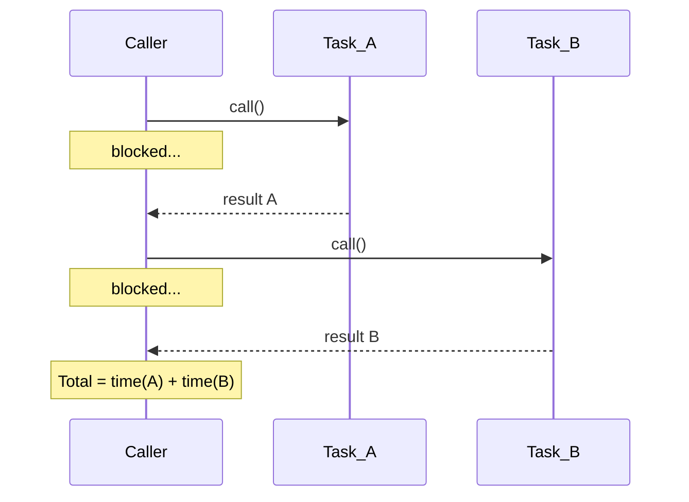
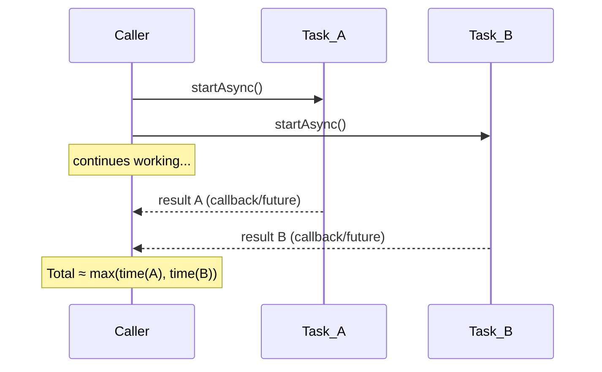
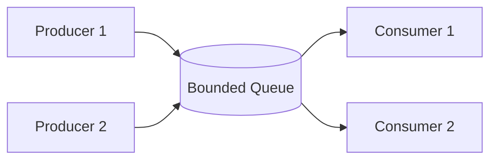
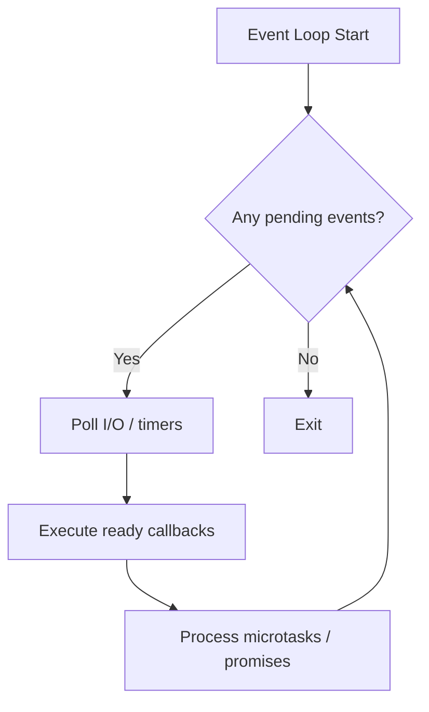
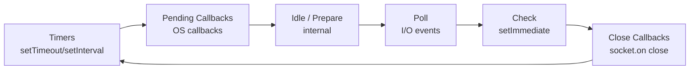
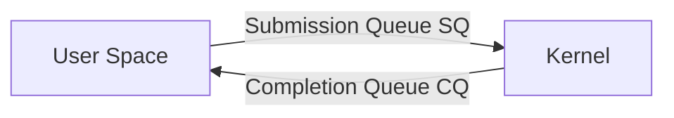
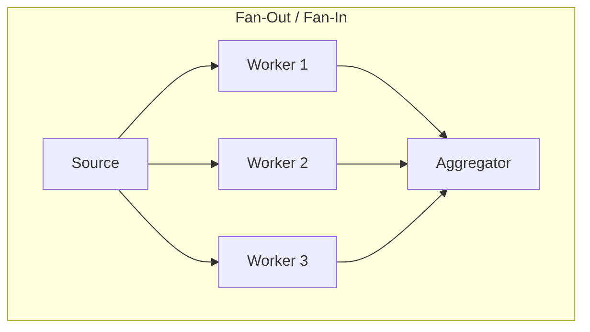

# Asynchronous Processing

A comprehensive guide to async execution models, patterns, and primitives that appear frequently in senior-level system design and LLD interviews.

---

## 1. Synchronous vs Asynchronous Execution

### Synchronous (Blocking)
The caller **waits** for each operation to complete before moving to the next. Simple to reason about, but wastes CPU time during I/O waits.

### Asynchronous (Non-Blocking)
The caller **initiates** an operation and continues executing. The result is retrieved later via callbacks, futures, or event notifications.

### Comparison Table

| Aspect | Synchronous | Asynchronous |
|--------|------------|--------------|
| Execution | Blocks until complete | Returns immediately |
| Thread usage | One thread per blocking call | Few threads serve many tasks |
| Complexity | Simple, linear flow | Callbacks / state machines |
| Throughput | Limited by thread count | High (thousands of concurrent I/O) |
| Debugging | Straightforward stack traces | Harder — scattered control flow |
| Use case | CPU-bound, simple scripts | I/O-bound, high-concurrency servers |

### Execution Flow Diagrams

**Synchronous Model**



**Asynchronous Model**



---

## 2. Producer-Consumer Pattern

The classic pattern for decoupling work generation from work processing. A **bounded buffer** (blocking queue) sits between producers and consumers, providing backpressure and flow control.



### Key Design Decisions
- **Buffer size** — too small causes producer stalls; too large wastes memory and delays backpressure signals
- **Blocking vs dropping** — block the producer when full, or drop/reject items?
- **Ordering** — FIFO is typical; priority queues enable task prioritization
- **Shutdown** — use a poison pill / sentinel value to signal consumers to exit

### Java — BlockingQueue

```java
import java.util.concurrent.*;

public class ProducerConsumer {
    private static final BlockingQueue<Integer> queue = new ArrayBlockingQueue<>(10);

    public static void main(String[] args) {
        // Producer
        Thread producer = new Thread(() -> {
            try {
                for (int i = 0; i < 20; i++) {
                    queue.put(i);  // blocks if queue is full
                    System.out.println("Produced: " + i);
                }
                queue.put(-1);  // poison pill
            } catch (InterruptedException e) {
                Thread.currentThread().interrupt();
            }
        });

        // Consumer
        Thread consumer = new Thread(() -> {
            try {
                while (true) {
                    int item = queue.take();  // blocks if queue is empty
                    if (item == -1) break;    // poison pill
                    System.out.println("Consumed: " + item);
                    Thread.sleep(100);  // simulate processing
                }
            } catch (InterruptedException e) {
                Thread.currentThread().interrupt();
            }
        });

        producer.start();
        consumer.start();
    }
}
```

### C++ — condition_variable + mutex

```cpp
#include <iostream>
#include <queue>
#include <thread>
#include <mutex>
#include <condition_variable>

class BoundedQueue {
    std::queue<int> queue_;
    std::mutex mtx_;
    std::condition_variable not_full_, not_empty_;
    size_t capacity_;

public:
    explicit BoundedQueue(size_t cap) : capacity_(cap) {}

    void put(int item) {
        std::unique_lock<std::mutex> lock(mtx_);
        not_full_.wait(lock, [this] { return queue_.size() < capacity_; });
        queue_.push(item);
        not_empty_.notify_one();
    }

    int take() {
        std::unique_lock<std::mutex> lock(mtx_);
        not_empty_.wait(lock, [this] { return !queue_.empty(); });
        int item = queue_.front();
        queue_.pop();
        not_full_.notify_one();
        return item;
    }
};

int main() {
    BoundedQueue bq(10);

    std::thread producer([&bq] {
        for (int i = 0; i < 20; i++) {
            bq.put(i);
            std::cout << "Produced: " << i << "\n";
        }
        bq.put(-1);  // poison pill
    });

    std::thread consumer([&bq] {
        while (true) {
            int item = bq.take();
            if (item == -1) break;
            std::cout << "Consumed: " << item << "\n";
        }
    });

    producer.join();
    consumer.join();
}
```

### Python — queue.Queue

```python
import queue
import threading
import time

def producer(q: queue.Queue):
    for i in range(20):
        q.put(i)  # blocks if full
        print(f"Produced: {i}")
    q.put(None)  # sentinel

def consumer(q: queue.Queue):
    while True:
        item = q.get()  # blocks if empty
        if item is None:
            break
        print(f"Consumed: {item}")
        time.sleep(0.1)
        q.task_done()

q = queue.Queue(maxsize=10)
t1 = threading.Thread(target=producer, args=(q,))
t2 = threading.Thread(target=consumer, args=(q,))
t1.start()
t2.start()
t1.join()
t2.join()
```

---

## 3. Callback-Based Async

The earliest async pattern: pass a function to be invoked when the operation completes.

### Basic Callback Structure

```java
// Java — callback interface
interface Callback<T> {
    void onSuccess(T result);
    void onError(Exception e);
}

void fetchDataAsync(String url, Callback<String> callback) {
    new Thread(() -> {
        try {
            String result = httpGet(url);  // blocking I/O in background thread
            callback.onSuccess(result);
        } catch (Exception e) {
            callback.onError(e);
        }
    }).start();
}

// Usage
fetchDataAsync("https://api.example.com/data", new Callback<>() {
    @Override
    public void onSuccess(String result) {
        System.out.println("Got: " + result);
    }
    @Override
    public void onError(Exception e) {
        System.err.println("Failed: " + e.getMessage());
    }
});
```

### Callback Hell

When multiple async operations depend on each other, callbacks nest deeply, making code unreadable and error-prone.

```python
# Python pseudo-code showing "callback hell"
def step1(callback):
    fetch_user(user_id, lambda user:
        fetch_orders(user.id, lambda orders:
            fetch_items(orders[0].id, lambda items:
                callback(items)  # deeply nested — hard to follow
            )
        )
    )
```

### Problems with Callbacks
- **Inversion of control** — you hand execution flow to the callee
- **Error handling** — each level needs its own error handler; easy to miss
- **Composition** — hard to combine results from multiple async calls
- **Cancellation** — no standard way to cancel in-flight operations

> **Interview tip:** Callbacks are the motivation for Futures/Promises. Be ready to explain *why* callbacks fell out of favor and how Futures fix the problems.

---

## 4. Futures and Promises

A **Future** (or **Promise**) represents a value that will be available at some point in the future. It decouples the initiation of an async operation from the consumption of its result.

| Term | Meaning |
|------|---------|
| **Future** | A read-only handle to a result that may not exist yet |
| **Promise** | The writable side — the producer completes the promise, the consumer reads the future |
| **CompletableFuture** (Java) | Both future and promise in one object |
| **std::future / std::promise** (C++) | Separate read / write handles |
| **asyncio.Future** (Python) | Low-level; typically use coroutines + `await` instead |

### Java — CompletableFuture

```java
import java.util.concurrent.CompletableFuture;

public class FutureExample {
    // Basic async execution
    static CompletableFuture<String> fetchUser(int id) {
        return CompletableFuture.supplyAsync(() -> {
            // simulate I/O
            sleep(200);
            return "User-" + id;
        });
    }

    static CompletableFuture<String> fetchOrders(String user) {
        return CompletableFuture.supplyAsync(() -> {
            sleep(150);
            return "Orders for " + user;
        });
    }

    public static void main(String[] args) {
        // --- Chaining (eliminates callback hell) ---
        CompletableFuture<String> pipeline = fetchUser(42)
            .thenCompose(user -> fetchOrders(user))    // sequential composition
            .thenApply(orders -> orders.toUpperCase())  // transform result
            .exceptionally(ex -> "Fallback: " + ex.getMessage());  // error handling

        System.out.println(pipeline.join());

        // --- Parallel composition ---
        CompletableFuture<String> userFuture = fetchUser(1);
        CompletableFuture<String> orderFuture = fetchOrders("User-1");

        CompletableFuture<Void> both = CompletableFuture.allOf(userFuture, orderFuture);
        both.thenRun(() -> {
            System.out.println(userFuture.join() + " | " + orderFuture.join());
        }).join();

        // anyOf — first one wins (useful for redundancy / timeouts)
        CompletableFuture<Object> fastest = CompletableFuture.anyOf(userFuture, orderFuture);
        System.out.println("First result: " + fastest.join());
    }

    static void sleep(long ms) {
        try { Thread.sleep(ms); } catch (InterruptedException e) {
            Thread.currentThread().interrupt();
        }
    }
}
```

**Key CompletableFuture methods:**

| Method | Purpose |
|--------|---------|
| `supplyAsync(Supplier)` | Run supplier in ForkJoinPool, return CF |
| `thenApply(Function)` | Transform result (like `map`) |
| `thenCompose(Function)` | Chain dependent async call (like `flatMap`) |
| `thenCombine(CF, BiFunction)` | Combine two independent futures |
| `allOf(CF...)` | Wait for all to complete |
| `anyOf(CF...)` | Wait for first to complete |
| `exceptionally(Function)` | Handle errors |
| `handle(BiFunction)` | Handle both success and failure |

### C++ — std::future and std::async

```cpp
#include <iostream>
#include <future>
#include <string>
#include <chrono>

std::string fetchUser(int id) {
    std::this_thread::sleep_for(std::chrono::milliseconds(200));
    return "User-" + std::to_string(id);
}

std::string fetchOrders(const std::string& user) {
    std::this_thread::sleep_for(std::chrono::milliseconds(150));
    return "Orders for " + user;
}

int main() {
    // Launch async tasks
    std::future<std::string> userFuture = std::async(std::launch::async, fetchUser, 42);
    std::future<std::string> orderFuture = std::async(std::launch::async, fetchOrders, "User-1");

    // .get() blocks until result is ready — call it when you need the value
    std::string user = userFuture.get();
    std::string orders = orderFuture.get();
    std::cout << user << " | " << orders << "\n";

    // std::promise — manual completion
    std::promise<int> promise;
    std::future<int> future = promise.get_future();

    std::thread t([&promise] {
        // simulate work
        std::this_thread::sleep_for(std::chrono::milliseconds(100));
        promise.set_value(42);  // fulfill the promise
    });

    std::cout << "Promise result: " << future.get() << "\n";
    t.join();

    // Error propagation
    std::promise<int> errPromise;
    std::future<int> errFuture = errPromise.get_future();
    errPromise.set_exception(std::make_exception_ptr(std::runtime_error("oops")));

    try {
        errFuture.get();
    } catch (const std::runtime_error& e) {
        std::cout << "Caught: " << e.what() << "\n";
    }
}
```

> **C++ note:** `std::async` with `std::launch::async` guarantees a new thread. With `std::launch::deferred`, the call is lazy — executed when `.get()` is called.

### Python — asyncio

```python
import asyncio

async def fetch_user(user_id: int) -> str:
    await asyncio.sleep(0.2)  # simulate I/O
    return f"User-{user_id}"

async def fetch_orders(user: str) -> str:
    await asyncio.sleep(0.15)
    return f"Orders for {user}"

async def main():
    # --- Sequential (chaining) ---
    user = await fetch_user(42)
    orders = await fetch_orders(user)
    print(f"{user} | {orders}")

    # --- Parallel (gather) ---
    user, orders = await asyncio.gather(
        fetch_user(1),
        fetch_orders("User-1")
    )
    print(f"{user} | {orders}")

    # --- First completed (like anyOf) ---
    tasks = [
        asyncio.create_task(fetch_user(1)),
        asyncio.create_task(fetch_orders("User-2"))
    ]
    done, pending = await asyncio.wait(tasks, return_when=asyncio.FIRST_COMPLETED)
    for task in done:
        print(f"First result: {task.result()}")
    for task in pending:
        task.cancel()

    # --- Error handling ---
    try:
        result = await fetch_user(-1)
    except ValueError as e:
        print(f"Error: {e}")

    # --- Timeout ---
    try:
        result = await asyncio.wait_for(fetch_user(99), timeout=0.05)
    except asyncio.TimeoutError:
        print("Timed out!")

asyncio.run(main())
```

---

## 5. Event Loop Architecture

An **event loop** is a single-threaded construct that multiplexes I/O operations using OS-level mechanisms (`epoll`, `kqueue`, `IOCP`). It is the foundation of Node.js, Python asyncio, and many high-performance servers.

### How It Works



### Event Loop Phases (Node.js model)



### Python asyncio Event Loop

```python
import asyncio

async def handle_client(reader, writer):
    data = await reader.read(1024)
    message = data.decode()
    addr = writer.get_extra_info("peername")
    print(f"Received '{message}' from {addr}")

    writer.write(data)  # echo back
    await writer.drain()
    writer.close()

async def main():
    server = await asyncio.start_server(handle_client, "127.0.0.1", 8888)
    async with server:
        await server.serve_forever()

asyncio.run(main())
```

### Single-Threaded Advantages and Limitations

| Advantage | Limitation |
|-----------|-----------|
| No locks, no race conditions | CPU-bound work blocks the loop |
| Low memory (no thread stacks) | Must never call blocking I/O directly |
| High concurrency for I/O | Requires async-aware libraries |
| Predictable execution order | Debugging async stack traces is harder |

> **Interview tip:** A common question is "How does Node.js handle 10K concurrent connections with one thread?" The answer is the event loop + non-blocking I/O via `epoll`/`kqueue`. Each connection is just a file descriptor in a poll set, not a thread.

---

## 6. Reactive Programming

Reactive programming models data as **asynchronous streams** (Observables) that emit items over time. Consumers subscribe and react to each item as it arrives.

### Core Abstractions

| Concept | Description |
|---------|-------------|
| **Observable / Flux** | Emits 0..N items + completion or error |
| **Observer / Subscriber** | Receives items via `onNext`, `onError`, `onComplete` |
| **Operator** | Transforms streams (`map`, `filter`, `flatMap`, `merge`, `zip`) |
| **Scheduler** | Controls which thread executes work |
| **Backpressure** | Mechanism for slow consumers to signal fast producers to slow down |

### Backpressure Strategies

| Strategy | Behavior |
|----------|----------|
| **Buffer** | Queue items until consumer catches up (risk: OOM) |
| **Drop** | Discard items the consumer cannot handle |
| **Latest** | Keep only the most recent item |
| **Error** | Signal an error if consumer is too slow |
| **Request(N)** | Consumer explicitly requests N items (Reactive Streams spec) |

### Java — Project Reactor (Spring WebFlux)

```java
import reactor.core.publisher.Flux;
import reactor.core.publisher.Mono;
import reactor.core.scheduler.Schedulers;

public class ReactiveExample {
    public static void main(String[] args) throws InterruptedException {
        // Basic stream processing
        Flux.range(1, 10)
            .filter(n -> n % 2 == 0)
            .map(n -> n * n)
            .subscribe(
                item -> System.out.println("Item: " + item),
                err  -> System.err.println("Error: " + err),
                ()   -> System.out.println("Done!")
            );

        // Async composition
        Mono<String> user = Mono.fromCallable(() -> fetchUser())
            .subscribeOn(Schedulers.boundedElastic());

        Mono<String> orders = Mono.fromCallable(() -> fetchOrders())
            .subscribeOn(Schedulers.boundedElastic());

        // Combine results when both complete
        Mono.zip(user, orders)
            .map(tuple -> tuple.getT1() + " | " + tuple.getT2())
            .subscribe(System.out::println);

        Thread.sleep(1000);  // wait for async completion
    }

    static String fetchUser() { return "User-42"; }
    static String fetchOrders() { return "Orders-99"; }
}
```

### Reactive vs CompletableFuture

| Aspect | CompletableFuture | Reactive (Flux/Mono) |
|--------|------------------|---------------------|
| Cardinality | Single value | 0..N values (stream) |
| Laziness | Eager (starts on creation) | Lazy (starts on subscribe) |
| Backpressure | None | Built-in (Reactive Streams) |
| Cancellation | Limited | `Disposable.dispose()` |
| Operators | Basic chaining | Rich operator library |

---

## 7. Async I/O

At the OS level, there are several mechanisms for performing non-blocking I/O.

### I/O Models Comparison

| Model | Mechanism | Scalability | Notes |
|-------|-----------|-------------|-------|
| **Blocking I/O** | One thread per connection | Poor (threads are expensive) | Simplest model |
| **select** | Bitmap of FDs, O(n) scan | ~1K connections | Portable but slow |
| **poll** | Array of `pollfd`, O(n) scan | Similar to select | No FD limit |
| **epoll** (Linux) | Kernel event list, O(1) per event | Millions of FDs | Edge-triggered or level-triggered |
| **kqueue** (BSD/macOS) | Kernel event queue | Millions of FDs | Similar to epoll |
| **IOCP** (Windows) | Completion ports | Millions of FDs | True async (completion-based) |
| **io_uring** (Linux 5.1+) | Shared ring buffers | Millions of FDs | Lowest overhead, batched syscalls |

### epoll Example (C++)

```cpp
#include <sys/epoll.h>
#include <netinet/in.h>
#include <unistd.h>
#include <fcntl.h>
#include <cstring>
#include <iostream>

void set_nonblocking(int fd) {
    int flags = fcntl(fd, F_GETFL, 0);
    fcntl(fd, F_SETFL, flags | O_NONBLOCK);
}

int main() {
    int server_fd = socket(AF_INET, SOCK_STREAM, 0);
    set_nonblocking(server_fd);

    sockaddr_in addr{};
    addr.sin_family = AF_INET;
    addr.sin_port = htons(8080);
    addr.sin_addr.s_addr = INADDR_ANY;
    bind(server_fd, (sockaddr*)&addr, sizeof(addr));
    listen(server_fd, SOMAXCONN);

    int epoll_fd = epoll_create1(0);
    epoll_event ev{};
    ev.events = EPOLLIN;
    ev.data.fd = server_fd;
    epoll_ctl(epoll_fd, EPOLL_CTL_ADD, server_fd, &ev);

    constexpr int MAX_EVENTS = 64;
    epoll_event events[MAX_EVENTS];

    while (true) {
        int n = epoll_wait(epoll_fd, events, MAX_EVENTS, -1);
        for (int i = 0; i < n; i++) {
            if (events[i].data.fd == server_fd) {
                // Accept new connection
                int client_fd = accept(server_fd, nullptr, nullptr);
                set_nonblocking(client_fd);
                ev.events = EPOLLIN | EPOLLET;  // edge-triggered
                ev.data.fd = client_fd;
                epoll_ctl(epoll_fd, EPOLL_CTL_ADD, client_fd, &ev);
            } else {
                // Handle client data
                char buf[1024];
                ssize_t bytes = read(events[i].data.fd, buf, sizeof(buf));
                if (bytes <= 0) {
                    close(events[i].data.fd);
                } else {
                    write(events[i].data.fd, buf, bytes);  // echo
                }
            }
        }
    }
}
```

### Java — NIO (Non-blocking I/O)

```java
import java.nio.*;
import java.nio.channels.*;
import java.net.*;
import java.util.*;

public class NioServer {
    public static void main(String[] args) throws Exception {
        Selector selector = Selector.open();
        ServerSocketChannel serverChannel = ServerSocketChannel.open();
        serverChannel.bind(new InetSocketAddress(8080));
        serverChannel.configureBlocking(false);
        serverChannel.register(selector, SelectionKey.OP_ACCEPT);

        while (true) {
            selector.select();  // blocks until events are ready
            Iterator<SelectionKey> keys = selector.selectedKeys().iterator();

            while (keys.hasNext()) {
                SelectionKey key = keys.next();
                keys.remove();

                if (key.isAcceptable()) {
                    SocketChannel client = serverChannel.accept();
                    client.configureBlocking(false);
                    client.register(selector, SelectionKey.OP_READ);
                } else if (key.isReadable()) {
                    SocketChannel client = (SocketChannel) key.channel();
                    ByteBuffer buffer = ByteBuffer.allocate(1024);
                    int bytesRead = client.read(buffer);
                    if (bytesRead == -1) {
                        client.close();
                    } else {
                        buffer.flip();
                        client.write(buffer);  // echo
                    }
                }
            }
        }
    }
}
```

### Python — selectors (high-level non-blocking I/O)

```python
import selectors
import socket

sel = selectors.DefaultSelector()

def accept(sock, mask):
    conn, addr = sock.accept()
    conn.setblocking(False)
    sel.register(conn, selectors.EVENT_READ, read)

def read(conn, mask):
    data = conn.recv(1024)
    if data:
        conn.send(data)  # echo
    else:
        sel.unregister(conn)
        conn.close()

server = socket.socket(socket.AF_INET, socket.SOCK_STREAM)
server.bind(("localhost", 8080))
server.listen(100)
server.setblocking(False)
sel.register(server, selectors.EVENT_READ, accept)

while True:
    events = sel.select()  # blocks until ready
    for key, mask in events:
        callback = key.data
        callback(key.fileobj, mask)
```

### io_uring (Conceptual Overview)

`io_uring` (Linux 5.1+) uses two shared ring buffers between user space and kernel:



- **Submission Queue (SQ):** User pushes I/O requests without syscalls (memory-mapped)
- **Completion Queue (CQ):** Kernel pushes results; user polls without syscalls
- **Advantage:** Batched submissions, zero-copy, no context switches per I/O operation

---

## 8. Message Passing vs Shared Memory

Two fundamental models for inter-thread or inter-process communication.

### Comparison

| Aspect | Shared Memory | Message Passing |
|--------|---------------|-----------------|
| Communication | Read/write shared variables | Send/receive messages via channels |
| Synchronization | Explicit (locks, atomics) | Implicit (channel semantics) |
| Coupling | Tight — threads share state | Loose — processes can be remote |
| Performance | Faster (no copy) | Slower (serialization + copy) |
| Correctness | Prone to races, deadlocks | Safer — no shared mutable state |
| Scalability | Hard across machines | Natural fit for distributed systems |
| Examples | Threads + mutex, mmap | Go channels, Erlang actors, message queues |

### Shared Memory Example (Java)

```java
import java.util.concurrent.atomic.AtomicInteger;

public class SharedMemory {
    private static final AtomicInteger counter = new AtomicInteger(0);

    public static void main(String[] args) throws InterruptedException {
        Runnable increment = () -> {
            for (int i = 0; i < 10000; i++) {
                counter.incrementAndGet();  // atomic — no lock needed
            }
        };

        Thread t1 = new Thread(increment);
        Thread t2 = new Thread(increment);
        t1.start(); t2.start();
        t1.join(); t2.join();

        System.out.println("Counter: " + counter.get());  // 20000
    }
}
```

### Message Passing Example (Python — multiprocessing.Queue)

```python
from multiprocessing import Process, Queue

def worker(task_queue: Queue, result_queue: Queue):
    while True:
        item = task_queue.get()
        if item is None:  # shutdown signal
            break
        result_queue.put(item * item)

if __name__ == "__main__":
    task_q = Queue()
    result_q = Queue()

    workers = [Process(target=worker, args=(task_q, result_q)) for _ in range(4)]
    for w in workers:
        w.start()

    # Send tasks
    for i in range(20):
        task_q.put(i)

    # Send shutdown signals
    for _ in workers:
        task_q.put(None)

    for w in workers:
        w.join()

    results = []
    while not result_q.empty():
        results.append(result_q.get())
    print(sorted(results))
```

### Message Passing Example (C++ — std::async + channels via queues)

```cpp
#include <iostream>
#include <thread>
#include <queue>
#include <mutex>
#include <condition_variable>
#include <optional>

template<typename T>
class Channel {
    std::queue<T> queue_;
    std::mutex mtx_;
    std::condition_variable cv_;
    bool closed_ = false;

public:
    void send(T value) {
        std::lock_guard<std::mutex> lock(mtx_);
        queue_.push(std::move(value));
        cv_.notify_one();
    }

    std::optional<T> receive() {
        std::unique_lock<std::mutex> lock(mtx_);
        cv_.wait(lock, [this] { return !queue_.empty() || closed_; });
        if (queue_.empty()) return std::nullopt;
        T val = std::move(queue_.front());
        queue_.pop();
        return val;
    }

    void close() {
        std::lock_guard<std::mutex> lock(mtx_);
        closed_ = true;
        cv_.notify_all();
    }
};

int main() {
    Channel<int> tasks;
    Channel<int> results;

    // Worker thread
    std::thread worker([&] {
        while (auto item = tasks.receive()) {
            results.send(*item * *item);
        }
        results.close();
    });

    for (int i = 0; i < 10; i++) tasks.send(i);
    tasks.close();

    worker.join();

    while (auto r = results.receive()) {
        std::cout << *r << " ";
    }
    std::cout << "\n";
}
```

### When to Use Each

- **Shared memory:** Threads within the same process, low-latency requirements, cache-line-sized updates
- **Message passing:** Cross-process/cross-machine communication, actor systems, when correctness is more important than raw speed

> **Interview tip:** The famous Go proverb — "Don't communicate by sharing memory; share memory by communicating" — captures the message-passing philosophy.

---

## 9. Work Queues and Task Distribution

Work queues distribute tasks across a pool of workers for parallel processing.

### Common Patterns



### Distribution Strategies

| Strategy | Description | Use Case |
|----------|-------------|----------|
| **Round-robin** | Assign tasks in order to workers | Equal-cost tasks |
| **Least-loaded** | Assign to worker with smallest queue | Variable-cost tasks |
| **Consistent hashing** | Route by key hash | Sticky sessions, caching |
| **Work stealing** | Idle workers steal from busy workers' queues | Fork-join, uneven workloads |
| **Priority queue** | High-priority tasks processed first | SLA-driven systems |

### Java — ExecutorService with Work Queue

```java
import java.util.concurrent.*;
import java.util.List;
import java.util.ArrayList;

public class WorkQueueExample {
    public static void main(String[] args) throws Exception {
        // Fixed thread pool with bounded work queue
        ExecutorService executor = new ThreadPoolExecutor(
            4,                                       // core threads
            8,                                       // max threads
            60L, TimeUnit.SECONDS,                   // idle timeout
            new LinkedBlockingQueue<>(100),           // bounded queue
            new ThreadPoolExecutor.CallerRunsPolicy() // backpressure: caller executes
        );

        // Submit tasks and collect futures
        List<Future<Integer>> futures = new ArrayList<>();
        for (int i = 0; i < 50; i++) {
            final int taskId = i;
            futures.add(executor.submit(() -> {
                Thread.sleep(100);  // simulate work
                return taskId * taskId;
            }));
        }

        // Gather results
        for (Future<Integer> f : futures) {
            System.out.println("Result: " + f.get());
        }

        executor.shutdown();
    }
}
```

### C++ — Thread Pool

```cpp
#include <iostream>
#include <vector>
#include <thread>
#include <queue>
#include <functional>
#include <mutex>
#include <condition_variable>
#include <future>

class ThreadPool {
    std::vector<std::thread> workers_;
    std::queue<std::function<void()>> tasks_;
    std::mutex mtx_;
    std::condition_variable cv_;
    bool stop_ = false;

public:
    explicit ThreadPool(size_t num_threads) {
        for (size_t i = 0; i < num_threads; i++) {
            workers_.emplace_back([this] {
                while (true) {
                    std::function<void()> task;
                    {
                        std::unique_lock<std::mutex> lock(mtx_);
                        cv_.wait(lock, [this] { return stop_ || !tasks_.empty(); });
                        if (stop_ && tasks_.empty()) return;
                        task = std::move(tasks_.front());
                        tasks_.pop();
                    }
                    task();
                }
            });
        }
    }

    template<typename F, typename... Args>
    auto submit(F&& f, Args&&... args) -> std::future<decltype(f(args...))> {
        using ReturnType = decltype(f(args...));
        auto task = std::make_shared<std::packaged_task<ReturnType()>>(
            std::bind(std::forward<F>(f), std::forward<Args>(args)...)
        );
        std::future<ReturnType> result = task->get_future();
        {
            std::lock_guard<std::mutex> lock(mtx_);
            tasks_.emplace([task] { (*task)(); });
        }
        cv_.notify_one();
        return result;
    }

    ~ThreadPool() {
        { std::lock_guard<std::mutex> lock(mtx_); stop_ = true; }
        cv_.notify_all();
        for (auto& w : workers_) w.join();
    }
};

int main() {
    ThreadPool pool(4);
    std::vector<std::future<int>> futures;

    for (int i = 0; i < 20; i++) {
        futures.push_back(pool.submit([i] { return i * i; }));
    }

    for (auto& f : futures) {
        std::cout << f.get() << " ";
    }
    std::cout << "\n";
}
```

### Python — concurrent.futures

```python
from concurrent.futures import ThreadPoolExecutor, ProcessPoolExecutor, as_completed

def compute(n: int) -> int:
    return n * n

# Thread pool for I/O-bound work
with ThreadPoolExecutor(max_workers=4) as executor:
    futures = {executor.submit(compute, i): i for i in range(20)}
    for future in as_completed(futures):
        task_id = futures[future]
        print(f"Task {task_id}: {future.result()}")

# Process pool for CPU-bound work (bypasses GIL)
with ProcessPoolExecutor(max_workers=4) as executor:
    results = list(executor.map(compute, range(20)))
    print(results)
```

### Work Stealing (Fork-Join)

Java's `ForkJoinPool` implements **work stealing** — each worker has its own deque. When a worker finishes its tasks, it steals from the tail of another worker's deque.

```java
import java.util.concurrent.*;

public class ForkJoinExample extends RecursiveTask<Long> {
    private final long[] array;
    private final int start, end;
    private static final int THRESHOLD = 1000;

    ForkJoinExample(long[] array, int start, int end) {
        this.array = array; this.start = start; this.end = end;
    }

    @Override
    protected Long compute() {
        if (end - start <= THRESHOLD) {
            long sum = 0;
            for (int i = start; i < end; i++) sum += array[i];
            return sum;
        }
        int mid = (start + end) / 2;
        ForkJoinExample left = new ForkJoinExample(array, start, mid);
        ForkJoinExample right = new ForkJoinExample(array, mid, end);
        left.fork();       // push to deque — may be stolen
        long rightResult = right.compute();  // compute locally
        long leftResult = left.join();       // wait for left
        return leftResult + rightResult;
    }

    public static void main(String[] args) {
        long[] array = new long[10_000_000];
        for (int i = 0; i < array.length; i++) array[i] = i;

        ForkJoinPool pool = new ForkJoinPool();
        long sum = pool.invoke(new ForkJoinExample(array, 0, array.length));
        System.out.println("Sum: " + sum);
    }
}
```

---

## Common Interview Questions

**Q1: What is the difference between concurrency and parallelism in the context of async processing?**

Concurrency is about **managing** multiple tasks that may overlap in time (interleaving on one core). Parallelism is about **executing** multiple tasks simultaneously on multiple cores. Async processing primarily addresses concurrency — a single event loop can handle thousands of concurrent I/O operations on one thread without any parallelism.

**Q2: How does a single-threaded event loop handle thousands of concurrent connections?**

The event loop uses OS-level I/O multiplexing (`epoll`, `kqueue`, `IOCP`) to monitor many file descriptors simultaneously. When data is ready on any FD, the kernel notifies the loop, which dispatches the corresponding callback. Since most time is spent waiting for I/O (not computing), one thread can service many connections by quickly switching between ready callbacks.

**Q3: When would you choose CompletableFuture over Reactive Streams in Java?**

Use `CompletableFuture` for **single-value** async results (one request, one response) — it is simpler and sufficient for most REST API composition. Use Reactive Streams (`Flux`/`Mono`) when you need **streaming data**, **backpressure**, or **lazy evaluation**. Reactive is better for high-throughput event-driven pipelines (e.g., processing a live feed), while `CompletableFuture` is better for request-response patterns.

**Q4: Explain backpressure and why it matters.**

Backpressure is a flow-control mechanism that lets a slow consumer signal a fast producer to slow down. Without backpressure, the producer overwhelms the consumer, causing unbounded memory growth (queue overflow) or dropped messages. Reactive Streams solve this with the `request(n)` protocol — the subscriber explicitly requests N items, and the publisher sends no more than N until the subscriber requests again.

**Q5: What is the difference between `epoll` edge-triggered and level-triggered modes?**

**Level-triggered (default):** `epoll_wait` returns an FD every time it is ready — if you do not read all available data, it will fire again next time. Easier to use but more syscalls. **Edge-triggered:** `epoll_wait` returns an FD only when its state *changes* (e.g., new data arrives). You must read all available data in one go or you will miss events. More efficient but harder to program correctly.

**Q6: Why does Go prefer message passing ("share memory by communicating") over shared memory?**

Message passing via channels eliminates the need for explicit locks, reducing the risk of deadlocks and data races. Channels enforce a clear ownership model: once a value is sent on a channel, the sender should no longer access it. This makes concurrent code easier to reason about, test, and debug. Shared memory with locks is still available in Go (via `sync.Mutex`) for performance-critical hot paths, but channels are the idiomatic default.
