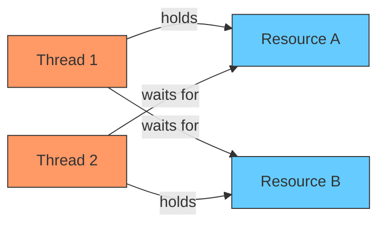
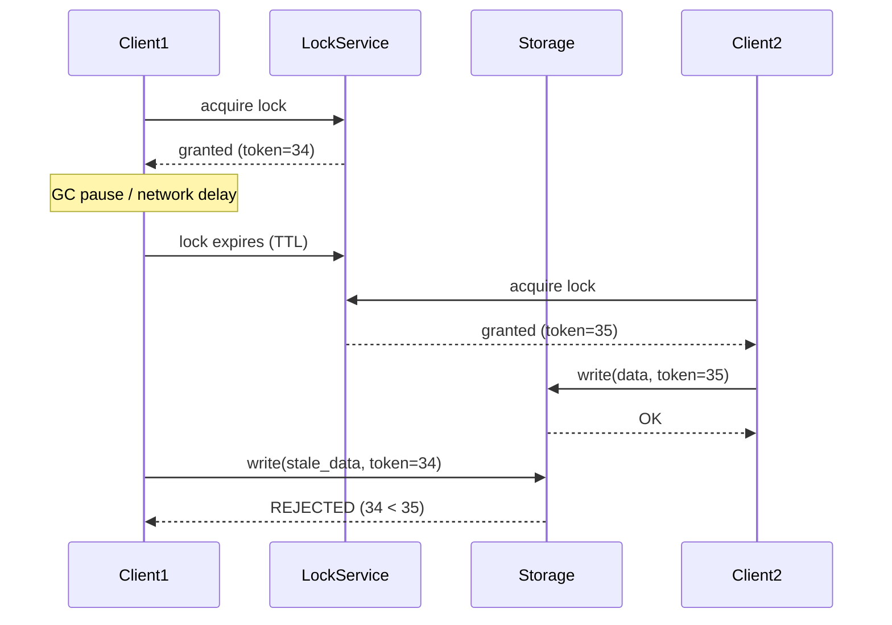
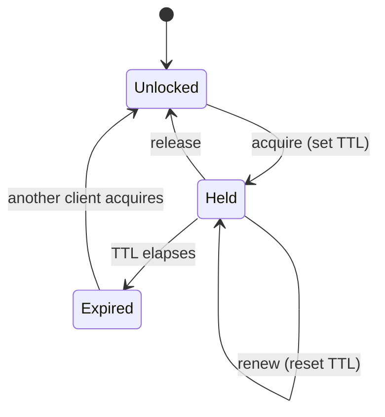
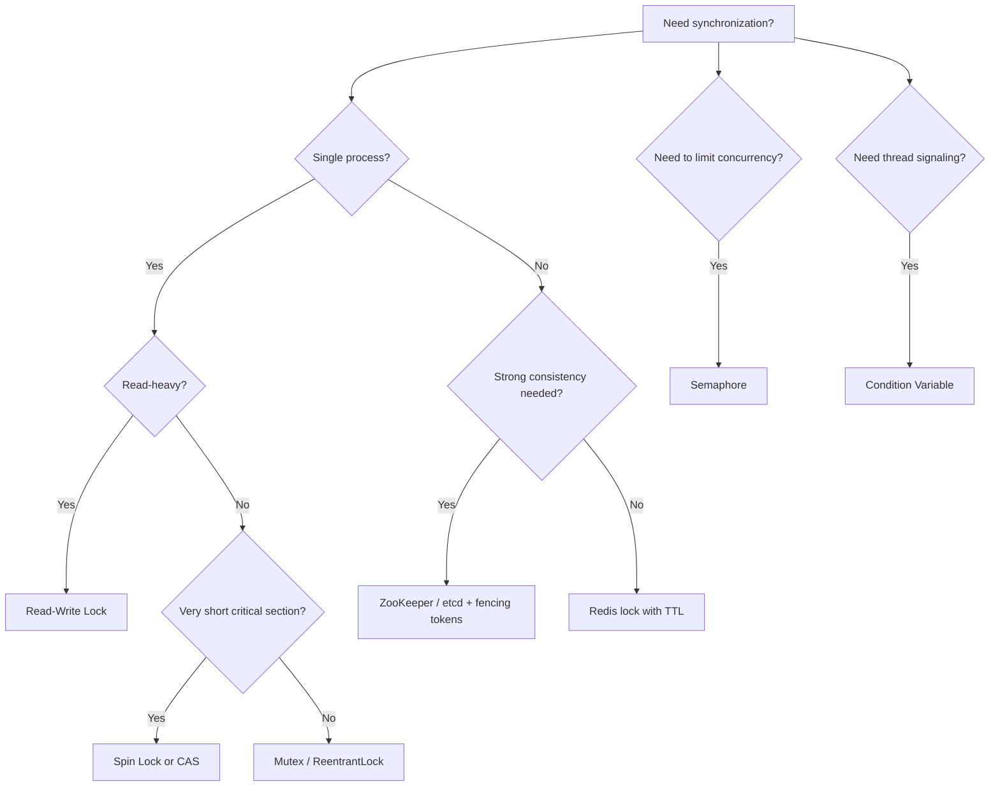

# Locking & Synchronization

A comprehensive guide to locks, synchronization primitives, and concurrency control mechanisms — from single-process mutexes to distributed locks — essential for senior engineer interviews.

---

## 1. Mutex / Lock

A **mutex** (mutual exclusion) ensures that only one thread can access a critical section at a time. A **reentrant lock** (recursive lock) allows the same thread to acquire the lock multiple times without deadlocking itself.

### Key Properties

| Property | Mutex | Reentrant Lock |
|----------|-------|----------------|
| Same thread re-acquire | Deadlocks | Allowed (reference counted) |
| Ownership | Yes (only owner can unlock) | Yes |
| Fairness option | Implementation-dependent | Often configurable |

### Code Examples

**Java**
```java
import java.util.concurrent.locks.ReentrantLock;

public class Counter {
    private int count = 0;
    private final ReentrantLock lock = new ReentrantLock();

    // Basic mutex usage with ReentrantLock
    public void increment() {
        lock.lock();
        try {
            count++;
        } finally {
            lock.unlock(); // always unlock in finally
        }
    }

    // synchronized keyword — intrinsic lock (reentrant by default)
    public synchronized void syncIncrement() {
        count++;
    }

    // Reentrant: same thread can call nested locked methods
    public void outerMethod() {
        lock.lock();
        try {
            innerMethod(); // same thread acquires lock again — no deadlock
        } finally {
            lock.unlock();
        }
    }

    private void innerMethod() {
        lock.lock();
        try {
            count += 10;
        } finally {
            lock.unlock();
        }
    }
}
```

**C++**
```cpp
#include <mutex>
#include <iostream>

class Counter {
    int count = 0;
    std::mutex mtx;              // non-reentrant
    std::recursive_mutex rmtx;   // reentrant

public:
    void increment() {
        std::lock_guard<std::mutex> guard(mtx); // RAII — auto unlock
        count++;
    }

    // unique_lock gives more flexibility (deferred locking, try_lock, etc.)
    bool tryIncrement() {
        std::unique_lock<std::mutex> lock(mtx, std::try_to_lock);
        if (lock.owns_lock()) {
            count++;
            return true;
        }
        return false;
    }

    void reentrantOuter() {
        std::lock_guard<std::recursive_mutex> guard(rmtx);
        reentrantInner(); // same thread, no deadlock
    }

    void reentrantInner() {
        std::lock_guard<std::recursive_mutex> guard(rmtx);
        count += 10;
    }
};
```

**Python**
```python
import threading

class Counter:
    def __init__(self):
        self.count = 0
        self.lock = threading.Lock()       # non-reentrant
        self.rlock = threading.RLock()      # reentrant

    def increment(self):
        with self.lock:          # context manager — auto release
            self.count += 1

    def reentrant_outer(self):
        with self.rlock:
            self.reentrant_inner()  # same thread, no deadlock

    def reentrant_inner(self):
        with self.rlock:
            self.count += 10
```

> **Interview tip:** Always prefer RAII / context managers (`lock_guard`, `with` statement, `try/finally`) over manual lock/unlock to guarantee release even on exceptions.

---

## 2. Read-Write Locks

A **read-write lock** (shared-exclusive lock) allows **multiple concurrent readers** but only **one exclusive writer**. This dramatically improves throughput for read-heavy workloads.

### Semantics

| State | New Reader | New Writer |
|-------|-----------|------------|
| No lock held | Granted (shared) | Granted (exclusive) |
| Read lock(s) held | Granted | Blocks |
| Write lock held | Blocks | Blocks |

### When to Use

- Read-heavy workloads (caches, configuration stores, lookup tables)
- Reads vastly outnumber writes (e.g., 95% reads)
- Read operations are non-trivial in duration (otherwise mutex overhead is similar)

### Code Examples

**Java**
```java
import java.util.concurrent.locks.ReadWriteLock;
import java.util.concurrent.locks.ReentrantReadWriteLock;
import java.util.HashMap;
import java.util.Map;

public class ThreadSafeCache<K, V> {
    private final Map<K, V> cache = new HashMap<>();
    private final ReadWriteLock rwLock = new ReentrantReadWriteLock();

    public V get(K key) {
        rwLock.readLock().lock();
        try {
            return cache.get(key);       // multiple readers concurrently
        } finally {
            rwLock.readLock().unlock();
        }
    }

    public void put(K key, V value) {
        rwLock.writeLock().lock();
        try {
            cache.put(key, value);       // exclusive access
        } finally {
            rwLock.writeLock().unlock();
        }
    }
}
```

**C++**
```cpp
#include <shared_mutex>
#include <unordered_map>
#include <string>

class ThreadSafeCache {
    std::unordered_map<std::string, std::string> cache;
    mutable std::shared_mutex rwMutex;

public:
    std::string get(const std::string& key) const {
        std::shared_lock lock(rwMutex);       // shared (read) lock
        auto it = cache.find(key);
        return (it != cache.end()) ? it->second : "";
    }

    void put(const std::string& key, const std::string& value) {
        std::unique_lock lock(rwMutex);       // exclusive (write) lock
        cache[key] = value;
    }
};
```

**Python**
```python
import threading

class ThreadSafeCache:
    def __init__(self):
        self._cache = {}
        self._lock = threading.RLock()
        self._readers = 0
        self._readers_lock = threading.Lock()

    # Python stdlib doesn't have a built-in RWLock; here's a simple one.
    # In practice, use a library or concurrent.futures for read-heavy patterns.

    def get(self, key):
        with self._readers_lock:
            self._readers += 1
            if self._readers == 1:
                self._lock.acquire()
        try:
            return self._cache.get(key)
        finally:
            with self._readers_lock:
                self._readers -= 1
                if self._readers == 0:
                    self._lock.release()

    def put(self, key, value):
        with self._lock:
            self._cache[key] = value
```

> **Caveat — Writer starvation:** If readers continuously arrive, a writer may never get the lock. `ReentrantReadWriteLock(true)` in Java enables a fair policy that gives preference to the longest-waiting thread.

---

## 3. Semaphores

A **semaphore** is a signaling mechanism that maintains a count. Threads **acquire** (decrement) and **release** (increment) permits. Unlike a mutex, any thread can release a semaphore — it has no ownership concept.

| Type | Permits | Use Case |
|------|---------|----------|
| **Binary semaphore** | 0 or 1 | Similar to mutex (but no ownership) |
| **Counting semaphore** | 0 to N | Resource pool limiting (DB connections, thread pools) |

### Resource Pool Example

**Java**
```java
import java.util.concurrent.Semaphore;

public class ConnectionPool {
    private static final int MAX_CONNECTIONS = 5;
    private final Semaphore semaphore = new Semaphore(MAX_CONNECTIONS, true); // fair

    public Connection acquire() throws InterruptedException {
        semaphore.acquire();       // blocks if all 5 permits taken
        return createConnection();
    }

    public void release(Connection conn) {
        closeConnection(conn);
        semaphore.release();       // return permit
    }
}
```

**C++**
```cpp
#include <semaphore>   // C++20
#include <iostream>

class ConnectionPool {
    static constexpr int MAX_CONNECTIONS = 5;
    std::counting_semaphore<MAX_CONNECTIONS> sem{MAX_CONNECTIONS};

public:
    void acquire() {
        sem.acquire();             // blocks if no permits
        std::cout << "Connection acquired\n";
    }

    void release() {
        std::cout << "Connection released\n";
        sem.release();             // return permit
    }
};
```

**Python**
```python
import threading

class ConnectionPool:
    MAX_CONNECTIONS = 5

    def __init__(self):
        self._semaphore = threading.Semaphore(self.MAX_CONNECTIONS)

    def acquire(self):
        self._semaphore.acquire()  # blocks if no permits
        return self._create_connection()

    def release(self, conn):
        self._close_connection(conn)
        self._semaphore.release()  # return permit
```

> **Mutex vs Binary Semaphore:** A mutex has ownership — only the locking thread can unlock it. A binary semaphore has no ownership, making it suitable for signaling between threads (one thread signals, another waits).

---

## 4. Condition Variables

A **condition variable** lets threads wait until a particular condition becomes true. They are always used together with a mutex. The standard pattern is:

1. Acquire the lock
2. While the condition is not met, **wait** (atomically releases lock and suspends thread)
3. On wake-up, re-check the condition (guard against **spurious wakeups**)
4. Perform work and release the lock

### Spurious Wakeups

Threads can wake up from `wait()` even when no signal was sent. This is a known behavior on most OS implementations. **Always use a while-loop (predicate check), never an if-statement.**

### Producer-Consumer Example

**Java**
```java
import java.util.LinkedList;
import java.util.Queue;

public class BoundedBuffer<T> {
    private final Queue<T> queue = new LinkedList<>();
    private final int capacity;

    public BoundedBuffer(int capacity) {
        this.capacity = capacity;
    }

    public synchronized void produce(T item) throws InterruptedException {
        while (queue.size() == capacity) {
            wait();                        // release lock and wait
        }
        queue.add(item);
        notifyAll();                       // wake waiting consumers
    }

    public synchronized T consume() throws InterruptedException {
        while (queue.isEmpty()) {
            wait();                        // release lock and wait
        }
        T item = queue.poll();
        notifyAll();                       // wake waiting producers
        return item;
    }
}
```

**C++**
```cpp
#include <mutex>
#include <condition_variable>
#include <queue>

template <typename T>
class BoundedBuffer {
    std::queue<T> queue;
    int capacity;
    std::mutex mtx;
    std::condition_variable notFull;
    std::condition_variable notEmpty;

public:
    BoundedBuffer(int cap) : capacity(cap) {}

    void produce(const T& item) {
        std::unique_lock<std::mutex> lock(mtx);
        notFull.wait(lock, [this]{ return (int)queue.size() < capacity; }); // predicate form
        queue.push(item);
        notEmpty.notify_one();
    }

    T consume() {
        std::unique_lock<std::mutex> lock(mtx);
        notEmpty.wait(lock, [this]{ return !queue.empty(); });
        T item = queue.front();
        queue.pop();
        notFull.notify_one();
        return item;
    }
};
```

**Python**
```python
import threading
from collections import deque

class BoundedBuffer:
    def __init__(self, capacity: int):
        self._queue = deque()
        self._capacity = capacity
        self._lock = threading.Lock()
        self._not_full = threading.Condition(self._lock)
        self._not_empty = threading.Condition(self._lock)

    def produce(self, item):
        with self._not_full:
            while len(self._queue) >= self._capacity:  # guard spurious wakeups
                self._not_full.wait()
            self._queue.append(item)
            self._not_empty.notify()

    def consume(self):
        with self._not_empty:
            while not self._queue:                     # guard spurious wakeups
                self._not_empty.wait()
            item = self._queue.popleft()
            self._not_full.notify()
            return item
```

---

## 5. Deadlock

A **deadlock** occurs when two or more threads are blocked forever, each waiting for a resource held by the other.

### The Four Coffman Conditions

All four must hold simultaneously for deadlock to occur:

| # | Condition | Description |
|---|-----------|-------------|
| 1 | **Mutual exclusion** | At least one resource is non-shareable |
| 2 | **Hold and wait** | A thread holds one resource while waiting for another |
| 3 | **No preemption** | Resources cannot be forcibly taken from a thread |
| 4 | **Circular wait** | A circular chain of threads, each waiting on the next |

### Deadlock Diagram



### Strategies

| Strategy | Description | Trade-off |
|----------|-------------|-----------|
| **Prevention** | Break one of the four Coffman conditions at design time | Restrictive; may hurt performance |
| **Avoidance** | Use algorithms (Banker's algorithm) to deny unsafe requests | High overhead; requires advance knowledge |
| **Detection** | Build a wait-for graph, detect cycles, kill a thread | Recovery can be expensive |
| **Ignoring** | Ostrich algorithm — assume deadlocks are rare enough | Used by most OSes in practice |

### Most Common Prevention: Lock Ordering

Always acquire locks in a **globally consistent order** to break the circular-wait condition.

**Java — Deadlock and Fix**
```java
public class DeadlockDemo {
    private final Object lockA = new Object();
    private final Object lockB = new Object();

    // BAD: Thread 1 calls method1(), Thread 2 calls method2() => deadlock
    public void method1() {
        synchronized (lockA) {             // acquires A first
            synchronized (lockB) {         // then waits for B
                System.out.println("method1");
            }
        }
    }

    public void method2() {
        synchronized (lockB) {             // acquires B first
            synchronized (lockA) {         // then waits for A  => DEADLOCK
                System.out.println("method2");
            }
        }
    }

    // FIX: Always acquire locks in the same order (A before B)
    public void method1Fixed() {
        synchronized (lockA) {
            synchronized (lockB) {
                System.out.println("method1Fixed");
            }
        }
    }

    public void method2Fixed() {
        synchronized (lockA) {             // same order: A first
            synchronized (lockB) {
                System.out.println("method2Fixed");
            }
        }
    }
}
```

**C++ — Using std::lock to Avoid Deadlock**
```cpp
#include <mutex>
#include <thread>

std::mutex mutexA, mutexB;

void deadlockProne() {
    // Thread 1                          // Thread 2
    // lock(mutexA)                      // lock(mutexB)
    // lock(mutexB)  <-- blocks          // lock(mutexA) <-- blocks => DEADLOCK
}

void deadlockFree() {
    // std::lock acquires both without deadlock (uses try-and-back-off internally)
    std::lock(mutexA, mutexB);
    std::lock_guard<std::mutex> lgA(mutexA, std::adopt_lock);
    std::lock_guard<std::mutex> lgB(mutexB, std::adopt_lock);
    // ... safe critical section ...
}

// C++17: even cleaner
void deadlockFreeCpp17() {
    std::scoped_lock lock(mutexA, mutexB);   // acquires both atomically
    // ... safe critical section ...
}
```

**Python — Timeout to Detect Deadlock**
```python
import threading

lock_a = threading.Lock()
lock_b = threading.Lock()

def safe_transfer():
    # Use timeout to detect potential deadlock
    acquired_a = lock_a.acquire(timeout=5)
    if not acquired_a:
        raise TimeoutError("Could not acquire lock A — possible deadlock")
    try:
        acquired_b = lock_b.acquire(timeout=5)
        if not acquired_b:
            raise TimeoutError("Could not acquire lock B — possible deadlock")
        try:
            print("Both locks acquired safely")
        finally:
            lock_b.release()
    finally:
        lock_a.release()
```

---

## 6. Database Locks

Database engines use locking to enforce **ACID isolation**. Understanding lock granularity and strategy is critical for designing high-performance data access layers.

### Lock Granularity

| Level | Scope | Concurrency | Overhead |
|-------|-------|-------------|----------|
| **Row-level** | Single row | High — other rows accessible | Higher (more locks to manage) |
| **Page-level** | A disk page (group of rows) | Medium | Medium |
| **Table-level** | Entire table | Low — blocks all access | Low |

### Optimistic vs Pessimistic Locking

| Aspect | Pessimistic Locking | Optimistic Locking |
|--------|--------------------|--------------------|
| **Mechanism** | Acquire lock before reading | Check for conflicts at write time |
| **SQL** | `SELECT ... FOR UPDATE` | Version column check on `UPDATE` |
| **Conflict handling** | Prevent conflicts (block) | Detect conflicts (retry) |
| **Best for** | High contention, short transactions | Low contention, read-heavy |
| **Throughput** | Lower (blocks readers/writers) | Higher (no locks held during reads) |
| **Risk** | Deadlocks possible | Starvation under high contention |

### SQL Examples

```sql
-- Pessimistic: row-level lock (other transactions block on this row)
BEGIN;
SELECT balance FROM accounts WHERE id = 42 FOR UPDATE;
UPDATE accounts SET balance = balance - 100 WHERE id = 42;
COMMIT;

-- Optimistic: version-based conflict detection
-- Application reads version, then checks it hasn't changed at write time
BEGIN;
SELECT balance, version FROM accounts WHERE id = 42;
-- application logic: new_balance = balance - 100
UPDATE accounts
   SET balance = :new_balance, version = version + 1
 WHERE id = 42 AND version = :read_version;
-- If affected rows = 0, version changed => retry
COMMIT;
```

### Lock Modes (SQL Standard)

| Mode | Allows Concurrent Reads | Allows Concurrent Writes |
|------|------------------------|-------------------------|
| **SHARE (S)** | Yes | No |
| **EXCLUSIVE (X)** | No | No |
| **UPDATE (U)** | Yes (reads) | No (prevents upgrade deadlocks) |

> **Interview tip:** JPA/Hibernate map these via `@Version` for optimistic locking and `LockModeType.PESSIMISTIC_WRITE` for pessimistic locking.

---

## 7. Distributed Locks

In distributed systems, a single-process mutex is insufficient. Distributed locks coordinate access across multiple nodes.

### Comparison

| Feature | Redis (Redlock) | ZooKeeper | etcd |
|---------|----------------|-----------|------|
| **Algorithm** | Quorum-based (N/2+1 Redis nodes) | Ephemeral sequential znodes | Lease-based with revision |
| **Consistency** | Approximate (no consensus) | Strong (ZAB protocol) | Strong (Raft consensus) |
| **Failure mode** | Lock may be granted twice under clock skew | Safe — ephemeral nodes auto-delete on session loss | Safe — lease expires deterministically |
| **Fencing token** | Not built-in (must add manually) | Znode sequence number | Revision number |
| **Performance** | Very fast | Moderate | Moderate |
| **Complexity** | Simple to deploy | Complex (ensemble management) | Moderate (built into Kubernetes) |

### Fencing Tokens

A **fencing token** is a monotonically increasing number returned with each lock acquisition. The resource (e.g., database) rejects requests with a token lower than the highest it has seen. This prevents a delayed process (which still thinks it holds the lock) from corrupting data.



### Redis Distributed Lock (Pseudocode)

```python
import redis
import uuid
import time

class RedisLock:
    def __init__(self, client: redis.Redis, key: str, ttl_ms: int = 10000):
        self._client = client
        self._key = key
        self._ttl_ms = ttl_ms
        self._token = str(uuid.uuid4())

    def acquire(self) -> bool:
        # SET key value NX PX ttl — atomic set-if-not-exists with expiry
        return self._client.set(
            self._key, self._token, nx=True, px=self._ttl_ms
        )

    def release(self) -> bool:
        # Lua script ensures we only delete if we still own the lock
        lua = """
        if redis.call("get", KEYS[1]) == ARGV[1] then
            return redis.call("del", KEYS[1])
        else
            return 0
        end
        """
        return self._client.eval(lua, 1, self._key, self._token)
```

> **Warning:** Martin Kleppmann's critique of Redlock shows it is unsafe under process pauses and clock drift. For strong safety guarantees, prefer ZooKeeper or etcd with fencing tokens.

---

## 8. Compare-and-Swap (CAS)

**CAS** is a hardware-level atomic instruction: `CAS(address, expected, new)`. It atomically compares the value at `address` with `expected` — if they match, it writes `new` and returns success; otherwise it fails. CAS is the foundation of **lock-free** data structures.

### CAS Loop Pattern

```
do {
    old_value = read(address)
    new_value = compute(old_value)
} while (!CAS(address, old_value, new_value))
```

### Code Examples

**Java**
```java
import java.util.concurrent.atomic.AtomicInteger;

public class LockFreeCounter {
    private final AtomicInteger count = new AtomicInteger(0);

    public void increment() {
        int oldVal, newVal;
        do {
            oldVal = count.get();
            newVal = oldVal + 1;
        } while (!count.compareAndSet(oldVal, newVal));
        // Simpler: count.incrementAndGet(); — uses CAS internally
    }

    // Lock-free stack push (ABA-safe with AtomicReference)
    // AtomicStampedReference guards against the ABA problem
}
```

**C++**
```cpp
#include <atomic>

class LockFreeCounter {
    std::atomic<int> count{0};

public:
    void increment() {
        int oldVal = count.load();
        // compare_exchange_weak may fail spuriously (use in a loop)
        while (!count.compare_exchange_weak(oldVal, oldVal + 1)) {
            // oldVal is updated to current value on failure
        }
        // Simpler: count.fetch_add(1);
    }
};
```

**Python**
```python
# Python's GIL makes true CAS less common, but ctypes or multiprocessing
# scenarios may use it. The threading-friendly way:

import threading

class LockFreeishCounter:
    """
    Python doesn't expose CAS directly. For true atomics, use
    multiprocessing.Value with a lock, or ctypes.
    Demonstrating the CAS concept:
    """
    def __init__(self):
        self._value = 0
        self._lock = threading.Lock()  # simulating CAS with a lock

    def compare_and_swap(self, expected: int, new_val: int) -> bool:
        with self._lock:
            if self._value == expected:
                self._value = new_val
                return True
            return False

    def increment(self):
        while True:
            old = self._value
            if self.compare_and_swap(old, old + 1):
                break
```

### The ABA Problem

CAS can be fooled if a value changes from A to B and back to A. The CAS sees A and succeeds, but the state may have changed in between. Solutions:
- **Stamped/versioned references:** `AtomicStampedReference` (Java), double-width CAS (C++)
- **Hazard pointers** or **epoch-based reclamation** for lock-free memory management

---

## 9. Spin Locks

A **spin lock** is a lock where the waiting thread **busy-waits** (loops) instead of blocking (sleeping). The thread burns CPU cycles while waiting.

### When to Use Spin Locks

| Use Spin Lock | Use Blocking Lock |
|---------------|-------------------|
| Critical section is very short (nanoseconds) | Critical section is long |
| Low contention (few threads competing) | High contention |
| Thread cannot afford sleep/wake overhead | Thread can tolerate context switch overhead |
| Real-time or kernel code | User-space application code |
| Multi-core system | Single-core system (spinning wastes the only core) |

### Code Example (C++)

```cpp
#include <atomic>

class SpinLock {
    std::atomic_flag flag = ATOMIC_FLAG_INIT;

public:
    void lock() {
        while (flag.test_and_set(std::memory_order_acquire)) {
            // spin — optionally add a pause/yield hint
            #ifdef __x86_64__
            __builtin_ia32_pause();  // reduces power and improves perf on x86
            #endif
        }
    }

    void unlock() {
        flag.clear(std::memory_order_release);
    }
};
```

**Java — Spin Lock with CAS**
```java
import java.util.concurrent.atomic.AtomicBoolean;

public class SpinLock {
    private final AtomicBoolean locked = new AtomicBoolean(false);

    public void lock() {
        while (!locked.compareAndSet(false, true)) {
            Thread.onSpinWait();   // JDK 9+ hint to the CPU
        }
    }

    public void unlock() {
        locked.set(false);
    }
}
```

> **Adaptive spinning:** Modern JVM and OS implementations often start with a spin phase and then fall back to blocking if the lock is not acquired quickly (e.g., Java's `synchronized` uses adaptive spinning internally).

---

## 10. Lease-based Locking

A **lease** is a lock with a **time-to-live (TTL)**. If the holder crashes or becomes unresponsive, the lease expires automatically, preventing indefinite lock retention.

### Properties

| Property | Description |
|----------|-------------|
| **TTL** | Lock auto-expires after a configured duration |
| **Renewal** | Holder must periodically renew before expiry |
| **Safety risk** | If the holder is slow (GC pause, network delay), the lease may expire while it still believes it holds the lock |
| **Mitigation** | Combine with fencing tokens (see Section 7) |

### Lease Lifecycle



### Example Pattern

```java
public class LeaseBasedLock {
    private final RedisClient redis;
    private final String lockKey;
    private final String ownerId;
    private final long ttlMs;
    private volatile boolean held = false;

    public boolean acquire() {
        // SET key owner NX PX ttl
        boolean acquired = redis.setNxPx(lockKey, ownerId, ttlMs);
        if (acquired) {
            held = true;
            startRenewalThread();   // periodically renew at ttl/3 intervals
        }
        return acquired;
    }

    private void startRenewalThread() {
        new Thread(() -> {
            while (held) {
                try {
                    Thread.sleep(ttlMs / 3);
                    redis.expire(lockKey, ttlMs);  // extend TTL
                } catch (InterruptedException e) {
                    Thread.currentThread().interrupt();
                    break;
                }
            }
        }).start();
    }

    public void release() {
        held = false;
        redis.deleteIfOwner(lockKey, ownerId);  // Lua script for safety
    }
}
```

> **Key insight:** Lease-based locking trades absolute safety for liveness. A crashed lock holder will not block the system forever, but a slow holder might lose its lease. Always pair with fencing tokens for correctness.

---

## Summary: Choosing the Right Mechanism



---

## Common Interview Questions

**Q1: What is the difference between a mutex and a semaphore?**
A mutex provides **mutual exclusion with ownership** — only the thread that locked it can unlock it. A semaphore is a **signaling mechanism with a counter** and no ownership — any thread can release it. A binary semaphore is functionally similar to a mutex but lacks ownership semantics, making it suitable for cross-thread signaling rather than protecting critical sections.

**Q2: How do you prevent deadlock?**
Break at least one of the four Coffman conditions. The most practical approach is to **enforce a global lock ordering** (break circular wait). Other techniques include: using `tryLock` with timeouts (break hold-and-wait), acquiring all locks atomically (`std::lock`, `std::scoped_lock` in C++), or using lock-free algorithms. In databases, use shorter transactions and consistent access order.

**Q3: Explain optimistic vs pessimistic locking. When would you use each?**
**Pessimistic** locking acquires a lock before reading data (`SELECT FOR UPDATE`), blocking concurrent access. Use it when conflicts are frequent and transactions are short. **Optimistic** locking reads data with a version number and checks the version at write time; if it changed, the operation retries. Use it when conflicts are rare, reads vastly outnumber writes, and you want maximum throughput.

**Q4: What are fencing tokens and why are they needed in distributed locks?**
A fencing token is a monotonically increasing number issued with each lock grant. The storage system rejects writes with a token lower than the highest it has seen. They are needed because distributed locks can fail silently — a client may experience a GC pause or network partition, its lease expires, and another client acquires the lock. Without fencing, the first client (unaware its lock expired) could overwrite the second client's changes.

**Q5: What is the ABA problem in CAS operations?**
In a CAS loop, a thread reads value A, computes a new value, then attempts `CAS(addr, A, new)`. If between the read and the CAS, another thread changed the value from A to B and back to A, the CAS succeeds despite the intermediate change. This can corrupt lock-free data structures (e.g., a node was freed and reallocated). Solutions include **stamped references** (AtomicStampedReference in Java) that pair the value with a monotonic counter.

**Q6: Why should you use a while-loop (not if) when waiting on a condition variable?**
Because of **spurious wakeups** — the OS may wake a thread without an explicit signal. Additionally, between the signal and the thread re-acquiring the lock, another thread might have changed the condition. The while-loop re-checks the predicate after every wake-up, ensuring the thread only proceeds when the condition is actually true.
