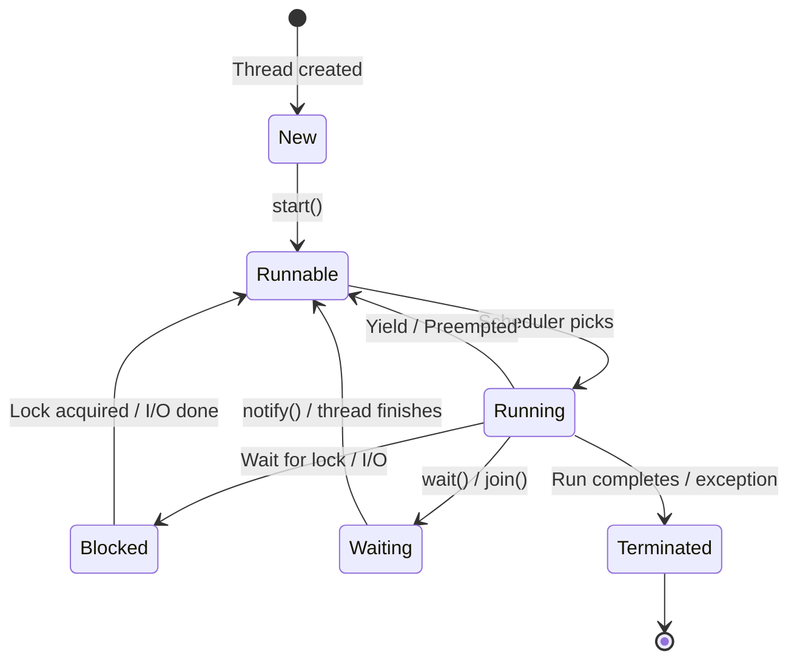
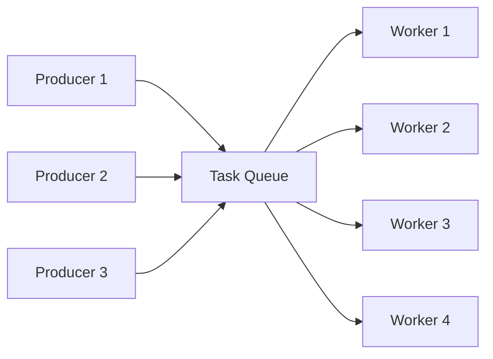

# Multithreading & Thread Management

The foundation of concurrent programming -- understanding how to create, manage, and coordinate threads is essential for every senior engineering interview.

---

## 1. Threads vs Processes

A **process** is an independent execution unit with its own memory space. A **thread** is a lightweight unit of execution within a process that shares the process's memory.

### Memory Model

```
Process A                          Process B
┌─────────────────────┐            ┌─────────────────────┐
│  Code   │   Data    │            │  Code   │   Data    │
│  Heap   │   Stack   │            │  Heap   │   Stack   │
│  (own address space)│            │  (own address space)│
└─────────────────────┘            └─────────────────────┘

Process with Multiple Threads
┌──────────────────────────────────────────┐
│  Shared: Code, Data, Heap, Open Files    │
│  ┌──────────┐ ┌──────────┐ ┌──────────┐ │
│  │ Thread 1 │ │ Thread 2 │ │ Thread 3 │ │
│  │ Stack    │ │ Stack    │ │ Stack    │ │
│  │ Regs     │ │ Regs     │ │ Regs     │ │
│  │ PC       │ │ PC       │ │ PC       │ │
│  └──────────┘ └──────────┘ └──────────┘ │
└──────────────────────────────────────────┘
```

### Comparison Table

| Aspect | Process | Thread |
|--------|---------|--------|
| Memory | Separate address space | Shared heap, separate stack |
| Creation cost | High (fork, copy page tables) | Low (allocate stack only) |
| Context switch | Expensive (TLB flush, cache cold) | Cheaper (same address space) |
| Communication | IPC (pipes, sockets, shared mem) | Direct shared memory |
| Isolation | Strong (crash doesn't affect others) | Weak (one crash kills all threads) |
| Overhead | Higher memory footprint | Lower memory footprint |
| Scalability | Across machines (multi-process) | Within a single machine |

### Context Switching Costs

Context switching between threads is cheaper than between processes because:
- **No TLB flush** -- threads share the same virtual address space
- **No page table swap** -- same memory mappings
- **Warm caches** -- shared data likely still in cache

Typical costs: process switch ~1-10 microseconds, thread switch ~0.1-1 microseconds (varies by OS and hardware).

---

## 2. Thread Lifecycle



### Thread Creation in All Three Languages

**Java**
```java
// Method 1: Extending Thread
class MyThread extends Thread {
    @Override
    public void run() {
        System.out.println("Thread: " + Thread.currentThread().getName());
    }
}

// Method 2: Implementing Runnable (preferred -- allows extending other classes)
class MyTask implements Runnable {
    @Override
    public void run() {
        System.out.println("Task running on: " + Thread.currentThread().getName());
    }
}

// Method 3: Lambda (Java 8+)
public class ThreadDemo {
    public static void main(String[] args) throws InterruptedException {
        // Extend Thread
        Thread t1 = new MyThread();
        t1.start();

        // Runnable
        Thread t2 = new Thread(new MyTask());
        t2.start();

        // Lambda
        Thread t3 = new Thread(() -> System.out.println("Lambda thread"));
        t3.start();

        // Join -- wait for threads to finish
        t1.join();
        t2.join();
        t3.join();
        System.out.println("All threads completed");
    }
}
```

**C++**
```cpp
#include <iostream>
#include <thread>
#include <functional>

void taskFunction(int id) {
    std::cout << "Thread " << id << " running on thread: "
              << std::this_thread::get_id() << std::endl;
}

class TaskObject {
public:
    void operator()(int id) const {
        std::cout << "Functor thread " << id << std::endl;
    }
};

int main() {
    // Function pointer
    std::thread t1(taskFunction, 1);

    // Functor (callable object)
    TaskObject task;
    std::thread t2(task, 2);

    // Lambda
    std::thread t3([](int id) {
        std::cout << "Lambda thread " << id << std::endl;
    }, 3);

    // Must join or detach before thread object is destroyed
    t1.join();   // Block until t1 finishes
    t2.join();
    t3.detach(); // Let t3 run independently (dangerous if main exits)

    return 0;
}
```

**Python**
```python
import threading
import time

def task_function(name: str) -> None:
    print(f"Thread {name} started (id={threading.current_thread().ident})")
    time.sleep(1)
    print(f"Thread {name} finished")

# Method 1: Target function
t1 = threading.Thread(target=task_function, args=("Worker-1",))

# Method 2: Subclass Thread
class MyThread(threading.Thread):
    def __init__(self, name: str):
        super().__init__(name=name)

    def run(self):
        print(f"Custom thread {self.name} running")

t2 = MyThread("Worker-2")

# Start and join
t1.start()
t2.start()
t1.join(timeout=5)  # Optional timeout
t2.join()
print("All threads done")
```

> **Note on Python GIL:** CPython's Global Interpreter Lock (GIL) prevents true parallel execution of Python bytecode. Threads are still useful for I/O-bound tasks but not for CPU-bound parallelism. Use `multiprocessing` or C extensions for CPU-bound work. Python 3.13+ introduces experimental free-threaded mode (PEP 703).

---

## 3. Thread Pools

Creating and destroying threads for every task is expensive. Thread pools maintain a set of reusable threads that pull work from a shared task queue.

### Why Thread Pools Matter

- **Reduced overhead** -- avoid thread creation/destruction cost per task
- **Resource control** -- cap the number of concurrent threads to prevent resource exhaustion
- **Improved throughput** -- tasks are queued and processed as threads become available
- **Backpressure** -- bounded queues signal when the system is overloaded

### Java: ExecutorService Framework

```java
import java.util.concurrent.*;

public class ThreadPoolDemo {
    public static void main(String[] args) throws Exception {
        // Fixed thread pool -- exactly N threads
        ExecutorService fixed = Executors.newFixedThreadPool(4);

        // Cached thread pool -- creates threads as needed, reuses idle ones (60s TTL)
        ExecutorService cached = Executors.newCachedThreadPool();

        // Scheduled thread pool -- for delayed/periodic tasks
        ScheduledExecutorService scheduled = Executors.newScheduledThreadPool(2);

        // Fork-Join pool -- work-stealing for recursive divide-and-conquer tasks
        ForkJoinPool forkJoin = new ForkJoinPool(4);

        // Submit tasks to fixed pool
        List<Future<Integer>> futures = new ArrayList<>();
        for (int i = 0; i < 10; i++) {
            final int taskId = i;
            futures.add(fixed.submit(() -> {
                Thread.sleep(100);
                return taskId * taskId;
            }));
        }

        // Collect results
        for (Future<Integer> f : futures) {
            System.out.println("Result: " + f.get());  // Blocks until done
        }

        // Schedule a task with delay
        scheduled.schedule(() -> System.out.println("Delayed task"), 2, TimeUnit.SECONDS);

        // Schedule a periodic task
        scheduled.scheduleAtFixedRate(
            () -> System.out.println("Periodic tick"),
            0, 1, TimeUnit.SECONDS  // initial delay, period
        );

        // Shutdown (waits for submitted tasks to finish)
        fixed.shutdown();
        fixed.awaitTermination(30, TimeUnit.SECONDS);
    }
}
```

**Production best practice** -- avoid `Executors` factory methods; use `ThreadPoolExecutor` directly for control over queue size and rejection policy:

```java
ThreadPoolExecutor executor = new ThreadPoolExecutor(
    4,                              // core pool size
    8,                              // max pool size
    60, TimeUnit.SECONDS,           // idle thread keep-alive
    new ArrayBlockingQueue<>(100),  // bounded work queue
    new ThreadPoolExecutor.CallerRunsPolicy()  // rejection policy
);
```

| Rejection Policy | Behavior |
|-----------------|----------|
| `AbortPolicy` (default) | Throws `RejectedExecutionException` |
| `CallerRunsPolicy` | Caller thread runs the task (provides backpressure) |
| `DiscardPolicy` | Silently drops the task |
| `DiscardOldestPolicy` | Drops the oldest queued task, retries submit |

### C++: Thread Pool (Manual Implementation)

C++ does not have a built-in thread pool in the standard library. Here is a common pattern:

```cpp
#include <thread>
#include <queue>
#include <mutex>
#include <condition_variable>
#include <functional>
#include <vector>
#include <future>

class ThreadPool {
public:
    explicit ThreadPool(size_t numThreads) : stop_(false) {
        for (size_t i = 0; i < numThreads; ++i) {
            workers_.emplace_back([this]() {
                while (true) {
                    std::function<void()> task;
                    {
                        std::unique_lock<std::mutex> lock(mutex_);
                        cv_.wait(lock, [this]() {
                            return stop_ || !tasks_.empty();
                        });
                        if (stop_ && tasks_.empty()) return;
                        task = std::move(tasks_.front());
                        tasks_.pop();
                    }
                    task();
                }
            });
        }
    }

    template <class F, class... Args>
    auto submit(F&& f, Args&&... args)
        -> std::future<std::invoke_result_t<F, Args...>> {
        using ReturnType = std::invoke_result_t<F, Args...>;
        auto task = std::make_shared<std::packaged_task<ReturnType()>>(
            std::bind(std::forward<F>(f), std::forward<Args>(args)...)
        );
        std::future<ReturnType> result = task->get_future();
        {
            std::unique_lock<std::mutex> lock(mutex_);
            tasks_.emplace([task]() { (*task)(); });
        }
        cv_.notify_one();
        return result;
    }

    ~ThreadPool() {
        {
            std::unique_lock<std::mutex> lock(mutex_);
            stop_ = true;
        }
        cv_.notify_all();
        for (auto& worker : workers_) {
            worker.join();
        }
    }

private:
    std::vector<std::thread> workers_;
    std::queue<std::function<void()>> tasks_;
    std::mutex mutex_;
    std::condition_variable cv_;
    bool stop_;
};

// Usage
int main() {
    ThreadPool pool(4);
    auto future = pool.submit([](int a, int b) { return a + b; }, 3, 7);
    std::cout << "Result: " << future.get() << std::endl;
    return 0;
}
```

### Python: ThreadPoolExecutor

```python
from concurrent.futures import ThreadPoolExecutor, as_completed
import urllib.request

def fetch_url(url: str) -> tuple[str, int]:
    with urllib.request.urlopen(url) as response:
        data = response.read()
        return url, len(data)

urls = [
    "https://example.com",
    "https://httpbin.org/get",
    "https://jsonplaceholder.typicode.com/posts/1",
]

# max_workers defaults to min(32, os.cpu_count() + 4) in Python 3.8+
with ThreadPoolExecutor(max_workers=5) as executor:
    # Submit all tasks
    future_to_url = {executor.submit(fetch_url, url): url for url in urls}

    # Process results as they complete
    for future in as_completed(future_to_url):
        url = future_to_url[future]
        try:
            url, size = future.result(timeout=10)
            print(f"{url}: {size} bytes")
        except Exception as e:
            print(f"{url} failed: {e}")
```

---

## 4. Worker Threads

The **worker thread** pattern decouples task submission from execution. Producers enqueue work items; a pool of worker threads dequeue and process them.



### Load Balancing Strategies

| Strategy | Description | Use Case |
|----------|-------------|----------|
| Shared queue | All workers pull from one queue | Simple, good for uniform tasks |
| Per-worker queues | Each worker has its own queue | Reduces contention |
| Work stealing | Idle workers steal from busy workers' queues | Best for uneven task sizes (Fork/Join) |
| Consistent hashing | Route tasks by key to specific workers | Stateful processing, cache affinity |

### Java: BlockingQueue + Workers

```java
import java.util.concurrent.*;

public class WorkerDemo {
    public static void main(String[] args) throws InterruptedException {
        BlockingQueue<Runnable> taskQueue = new LinkedBlockingQueue<>(100);

        // Start worker threads
        int numWorkers = 4;
        for (int i = 0; i < numWorkers; i++) {
            final int workerId = i;
            new Thread(() -> {
                while (!Thread.currentThread().isInterrupted()) {
                    try {
                        Runnable task = taskQueue.take(); // Blocks if empty
                        task.run();
                    } catch (InterruptedException e) {
                        Thread.currentThread().interrupt();
                        break;
                    }
                }
                System.out.println("Worker " + workerId + " shutting down");
            }, "Worker-" + i).start();
        }

        // Producer: enqueue tasks
        for (int i = 0; i < 20; i++) {
            final int taskId = i;
            taskQueue.put(() -> {  // Blocks if queue is full (backpressure)
                System.out.println(Thread.currentThread().getName()
                    + " processing task " + taskId);
            });
        }
    }
}
```

### Python: Queue + Workers

```python
import threading
import queue
import time

def worker(task_queue: queue.Queue, worker_id: int) -> None:
    while True:
        task = task_queue.get()  # Blocks until item available
        if task is None:         # Poison pill -- shutdown signal
            break
        print(f"Worker-{worker_id} processing: {task}")
        time.sleep(0.1)
        task_queue.task_done()

# Create queue and workers
task_queue: queue.Queue = queue.Queue(maxsize=50)
workers = []
for i in range(4):
    t = threading.Thread(target=worker, args=(task_queue, i), daemon=True)
    t.start()
    workers.append(t)

# Enqueue tasks
for i in range(20):
    task_queue.put(f"Task-{i}")

# Wait for all tasks to be processed
task_queue.join()

# Send poison pills to shut down workers
for _ in workers:
    task_queue.put(None)
for t in workers:
    t.join()
```

---

## 5. Daemon Threads

A **daemon thread** is a background thread that does not prevent the program from exiting. When all non-daemon threads finish, daemon threads are abruptly terminated.

### Use Cases
- Background logging or metrics collection
- Periodic cache cleanup
- Heartbeat/health-check senders
- Garbage collection (JVM's GC threads are daemon threads)

### Behavior by Language

| Language | Default | Set Daemon | Shutdown Behavior |
|----------|---------|-----------|-------------------|
| Java | Non-daemon | `t.setDaemon(true)` before `start()` | JVM exits when only daemon threads remain; no `finally` blocks run |
| C++ | N/A | `t.detach()` (similar concept) | Detached threads terminated when `main()` returns (undefined behavior) |
| Python | Non-daemon | `t.daemon = True` before `start()` | Interpreter exits; daemon threads killed abruptly |

**Java**
```java
Thread daemon = new Thread(() -> {
    while (true) {
        System.out.println("Daemon heartbeat...");
        try { Thread.sleep(1000); }
        catch (InterruptedException e) { break; }
    }
});
daemon.setDaemon(true);  // Must set BEFORE start()
daemon.start();

// Main thread finishes -> JVM exits -> daemon is killed
System.out.println("Main thread done");
```

**Python**
```python
import threading, time

def background_cleanup():
    while True:
        print("Cleaning up stale cache entries...")
        time.sleep(5)

t = threading.Thread(target=background_cleanup, daemon=True)
t.start()

# Main thread work
time.sleep(2)
print("Main done -- daemon will be killed")
# Program exits here; daemon thread is terminated
```

> **Warning:** Daemon threads should not hold resources that require cleanup (open files, database connections). They are killed without running `finally` or `atexit` handlers.

---

## 6. Green Threads / Virtual Threads

Traditional OS threads (1:1 mapping to kernel threads) are expensive -- each uses ~1 MB stack memory and context switches go through the kernel. **Green threads** are user-space threads multiplexed onto a smaller number of OS threads (M:N model).

### Comparison

| Feature | OS Threads | Green / Virtual Threads |
|---------|-----------|------------------------|
| Managed by | OS kernel | Language runtime / VM |
| Memory per thread | ~1 MB stack | ~1 KB (resizable) |
| Max practical count | ~10K | ~1M+ |
| Context switch | Kernel mode (expensive) | User-space (cheap) |
| Blocking I/O | Blocks OS thread | Runtime can park and switch |
| Best for | CPU-bound parallelism | High-concurrency I/O-bound workloads |

### Java 21: Virtual Threads (Project Loom)

```java
import java.util.concurrent.*;

public class VirtualThreadDemo {
    public static void main(String[] args) throws Exception {
        // Create a single virtual thread
        Thread vt = Thread.ofVirtual().name("vt-1").start(() -> {
            System.out.println("Virtual thread: " + Thread.currentThread());
        });
        vt.join();

        // Virtual thread executor -- one virtual thread per task
        try (var executor = Executors.newVirtualThreadPerTaskExecutor()) {
            List<Future<String>> futures = new ArrayList<>();
            for (int i = 0; i < 100_000; i++) {
                final int id = i;
                futures.add(executor.submit(() -> {
                    Thread.sleep(100);  // Does NOT block an OS thread
                    return "Result-" + id;
                }));
            }
            System.out.println("Submitted 100K tasks on virtual threads");
            System.out.println("First result: " + futures.getFirst().get());
        }
    }
}
```

Key points about virtual threads:
- Do **not** pool them -- they are cheap to create; use one per task
- Avoid `synchronized` blocks (pins the carrier thread); prefer `ReentrantLock`
- Ideal for I/O-heavy servers (web servers, database clients)

### Go: Goroutines

Goroutines are the canonical green thread implementation. They are multiplexed onto OS threads by Go's runtime scheduler (M:N model).

```go
func main() {
    for i := 0; i < 100000; i++ {
        go func(id int) {
            time.Sleep(100 * time.Millisecond)
            fmt.Printf("goroutine %d\n", id)
        }(i)
    }
    time.Sleep(1 * time.Second)
}
```

### Python: Coroutines (asyncio)

Python's coroutines are **not** true green threads but provide concurrency via cooperative multitasking on a single thread.

```python
import asyncio

async def fetch_data(id: int) -> str:
    await asyncio.sleep(0.1)  # Non-blocking sleep
    return f"Data-{id}"

async def main():
    # Launch 1000 concurrent coroutines
    tasks = [asyncio.create_task(fetch_data(i)) for i in range(1000)]
    results = await asyncio.gather(*tasks)
    print(f"Got {len(results)} results")

asyncio.run(main())
```

---

## 7. Thread-Local Storage

Thread-local storage (TLS) gives each thread its own independent copy of a variable. No synchronization is needed because the data is never shared.

### Use Cases
- Per-thread database connections
- Request-scoped context (user ID, trace ID, locale)
- Per-thread random number generators or buffers

**Java: `ThreadLocal`**
```java
public class RequestContext {
    private static final ThreadLocal<String> currentUser = new ThreadLocal<>();

    public static void setUser(String user) { currentUser.set(user); }
    public static String getUser() { return currentUser.get(); }
    public static void clear() { currentUser.remove(); }  // Prevent memory leaks!
}

// Usage in a web server thread
public void handleRequest(HttpRequest request) {
    try {
        RequestContext.setUser(request.getHeader("X-User-Id"));
        processBusinessLogic();  // Any code can call RequestContext.getUser()
    } finally {
        RequestContext.clear();  // CRITICAL: clean up to avoid leaks in pooled threads
    }
}
```

> **Pitfall:** In thread pools, `ThreadLocal` values persist across task executions on the same thread. Always clean up in a `finally` block. Java 21's `ScopedValue` (preview) addresses this for virtual threads.

**C++: `thread_local`**
```cpp
#include <iostream>
#include <thread>

thread_local int requestCount = 0;  // Each thread gets its own copy

void handleRequests(int numRequests) {
    for (int i = 0; i < numRequests; i++) {
        requestCount++;
    }
    std::cout << "Thread " << std::this_thread::get_id()
              << " handled " << requestCount << " requests" << std::endl;
}

int main() {
    std::thread t1(handleRequests, 5);
    std::thread t2(handleRequests, 3);
    t1.join();  // Prints: handled 5 requests
    t2.join();  // Prints: handled 3 requests
    return 0;
}
```

**Python: `threading.local`**
```python
import threading

_context = threading.local()

def set_trace_id(trace_id: str) -> None:
    _context.trace_id = trace_id

def get_trace_id() -> str:
    return getattr(_context, "trace_id", "unknown")

def worker(trace_id: str) -> None:
    set_trace_id(trace_id)
    # Any function in this thread can access the trace ID
    print(f"Thread {threading.current_thread().name}: trace={get_trace_id()}")

t1 = threading.Thread(target=worker, args=("abc-123",))
t2 = threading.Thread(target=worker, args=("def-456",))
t1.start(); t2.start()
t1.join(); t2.join()
```

---

## 8. Thread Safety

Code is **thread-safe** if it behaves correctly when accessed from multiple threads simultaneously without requiring external synchronization by the caller.

### Strategies for Thread Safety

| Strategy | Description | Trade-off |
|----------|-------------|-----------|
| **Immutability** | Objects that cannot be modified after creation | Safest; may increase memory usage |
| **Thread confinement** | Data accessed by only one thread | No synchronization needed; limits design |
| **Synchronization** | Locks, semaphores, monitors | Correctness; risk of deadlocks and contention |
| **Atomic operations** | CAS-based lock-free data structures | High performance; complex to implement |
| **Synchronized collections** | Thread-safe wrappers around collections | Easy to use; may be too coarse-grained |

### Immutability Example

**Java**
```java
// Immutable class -- inherently thread-safe
public final class Money {
    private final int amount;
    private final String currency;

    public Money(int amount, String currency) {
        this.amount = amount;
        this.currency = currency;
    }

    public int getAmount() { return amount; }
    public String getCurrency() { return currency; }

    public Money add(Money other) {
        if (!this.currency.equals(other.currency))
            throw new IllegalArgumentException("Currency mismatch");
        return new Money(this.amount + other.amount, this.currency);
    }
}
```

### Thread-Safe Collections

**Java**
```java
// Legacy synchronized collections (coarse-grained locking)
List<String> syncList = Collections.synchronizedList(new ArrayList<>());
Map<String, Integer> syncMap = Collections.synchronizedMap(new HashMap<>());

// Concurrent collections (fine-grained / lock-free -- preferred)
ConcurrentHashMap<String, Integer> concMap = new ConcurrentHashMap<>();
CopyOnWriteArrayList<String> cowList = new CopyOnWriteArrayList<>();
ConcurrentLinkedQueue<String> concQueue = new ConcurrentLinkedQueue<>();
BlockingQueue<String> blockingQ = new LinkedBlockingQueue<>(100);
```

**C++**
```cpp
// No built-in concurrent containers in the standard library.
// Protect standard containers with mutexes:
#include <mutex>
#include <unordered_map>

class ThreadSafeMap {
public:
    void put(const std::string& key, int value) {
        std::lock_guard<std::mutex> lock(mutex_);
        map_[key] = value;
    }

    std::optional<int> get(const std::string& key) {
        std::lock_guard<std::mutex> lock(mutex_);
        auto it = map_.find(key);
        if (it != map_.end()) return it->second;
        return std::nullopt;
    }

private:
    std::unordered_map<std::string, int> map_;
    mutable std::mutex mutex_;
};
```

**Python**
```python
import queue
from collections import deque

# queue.Queue is thread-safe (uses internal locks)
safe_queue = queue.Queue(maxsize=100)

# deque.append() and deque.popleft() are atomic in CPython due to GIL
# but this is an implementation detail, not a guarantee
safe_deque = deque()

# For dicts: CPython GIL makes single operations atomic,
# but compound operations (check-then-act) still need locks
```

---

## 9. Race Conditions

A **race condition** occurs when the correctness of a program depends on the relative timing of thread execution. Two common types:

### Data Race

Two threads access the same memory location concurrently, and at least one is a write, with no synchronization.

**Java -- Broken Counter**
```java
public class UnsafeCounter {
    private int count = 0;

    // NOT thread-safe: count++ is actually read-modify-write (3 operations)
    public void increment() {
        count++;  // Thread A reads 5, Thread B reads 5, both write 6 -- lost update!
    }

    public int getCount() { return count; }
}

// Fix 1: synchronized
public synchronized void increment() { count++; }

// Fix 2: AtomicInteger
private final AtomicInteger count = new AtomicInteger(0);
public void increment() { count.incrementAndGet(); }
```

**C++ -- Data Race**
```cpp
#include <thread>
#include <atomic>
#include <iostream>

int unsafeCounter = 0;
std::atomic<int> safeCounter{0};

void unsafeIncrement(int n) {
    for (int i = 0; i < n; i++)
        unsafeCounter++;  // DATA RACE: undefined behavior in C++
}

void safeIncrement(int n) {
    for (int i = 0; i < n; i++)
        safeCounter.fetch_add(1, std::memory_order_relaxed);
}

int main() {
    std::thread t1(unsafeIncrement, 100000);
    std::thread t2(unsafeIncrement, 100000);
    t1.join(); t2.join();
    // Expected: 200000, Actual: unpredictable (e.g., 137482)
    std::cout << "Unsafe: " << unsafeCounter << std::endl;

    std::thread t3(safeIncrement, 100000);
    std::thread t4(safeIncrement, 100000);
    t3.join(); t4.join();
    std::cout << "Safe: " << safeCounter << std::endl;  // Always 200000
    return 0;
}
```

**Python -- Race Condition**
```python
import threading

counter = 0

def unsafe_increment(n: int) -> None:
    global counter
    for _ in range(n):
        counter += 1  # Not atomic! Read-modify-write under the hood

threads = [threading.Thread(target=unsafe_increment, args=(100000,)) for _ in range(4)]
for t in threads: t.start()
for t in threads: t.join()
print(f"Expected: 400000, Got: {counter}")  # Often less than 400000

# Fix: use a Lock
lock = threading.Lock()
counter = 0

def safe_increment(n: int) -> None:
    global counter
    for _ in range(n):
        with lock:
            counter += 1
```

### TOCTOU (Time-of-Check-Time-of-Use)

A check is followed by a use, but the condition may change between the two steps.

```java
// TOCTOU bug in a file system
if (file.exists()) {       // Time of check
    file.delete();          // Time of use -- file may already be deleted by another thread!
}

// TOCTOU bug in a map
if (!map.containsKey(key)) {   // Check
    map.put(key, value);       // Use -- another thread may have inserted between check and put
}

// Fix: use atomic operations
map.putIfAbsent(key, value);   // Single atomic operation
map.computeIfAbsent(key, k -> expensiveCompute(k));
```

---

## 10. Volatile / Memory Visibility

In modern CPUs, each core has its own cache. Without proper synchronization, a write by one thread may not be visible to another thread for an indefinite amount of time.

```
Core 1 Cache        Core 2 Cache
┌───────────┐       ┌───────────┐
│ x = 42    │       │ x = 0     │  <-- stale value!
└───────────┘       └───────────┘
        ↕                   ↕
    ┌──────────────────────────┐
    │      Main Memory         │
    │      x = 42              │
    └──────────────────────────┘
```

### Java: `volatile`

The `volatile` keyword guarantees:
1. **Visibility** -- writes are immediately flushed to main memory; reads always fetch from main memory
2. **Ordering** -- prevents instruction reordering around volatile accesses (happens-before relationship)

`volatile` does **NOT** guarantee atomicity of compound operations (e.g., `volatile int count; count++` is still broken).

```java
public class VolatileExample {
    private volatile boolean running = true;  // Visibility guarantee

    public void stop() {
        running = false;  // Visible to the worker thread immediately
    }

    public void work() {
        while (running) {  // Without volatile, this might loop forever
            // ... do work ...
        }
        System.out.println("Stopped cleanly");
    }
}
```

**When to use `volatile` vs locks vs atomics:**

| Scenario | Use |
|----------|-----|
| Simple flag (boolean read/write) | `volatile` |
| Counter (increment/decrement) | `AtomicInteger` |
| Multiple fields updated together | `synchronized` block or `Lock` |
| Complex invariants | `synchronized` block or `Lock` |

### C++: `std::atomic` and `volatile`

In C++, `volatile` does **not** provide thread safety -- it only prevents compiler optimization of reads/writes (designed for memory-mapped I/O). For thread-safe memory visibility, use `std::atomic`.

```cpp
#include <atomic>
#include <thread>
#include <iostream>

std::atomic<bool> ready{false};   // Thread-safe visibility
std::atomic<int> data{0};

void producer() {
    data.store(42, std::memory_order_relaxed);
    ready.store(true, std::memory_order_release);  // All writes before this are visible
}

void consumer() {
    while (!ready.load(std::memory_order_acquire)) {  // Sync point
        // spin
    }
    std::cout << "Data: " << data.load(std::memory_order_relaxed) << std::endl;  // Guaranteed 42
}

int main() {
    std::thread t1(producer);
    std::thread t2(consumer);
    t1.join();
    t2.join();
    return 0;
}
```

**C++ Memory Orderings (from weakest to strongest):**

| Ordering | Guarantee | Use Case |
|----------|-----------|----------|
| `memory_order_relaxed` | Atomicity only, no ordering | Counters where order doesn't matter |
| `memory_order_acquire` | No reads/writes move before this load | Consumer side of producer-consumer |
| `memory_order_release` | No reads/writes move after this store | Producer side of producer-consumer |
| `memory_order_acq_rel` | Both acquire and release | Read-modify-write operations |
| `memory_order_seq_cst` (default) | Total ordering across all threads | Simple correctness (default; highest cost) |

### Python: Memory Visibility

Python's GIL serializes bytecode execution, so visibility is generally not an issue for single bytecode operations. However, compound operations still require explicit synchronization (as shown in the race conditions section).

---

## Common Interview Questions

**Q1: What is the difference between a thread and a process?**
A process has its own address space, while threads within a process share heap memory but have separate stacks. Threads are cheaper to create and context-switch because there is no need to flush TLBs or swap page tables. However, a bug in one thread can crash the entire process, whereas processes are isolated.

**Q2: Why use a thread pool instead of creating a new thread per task?**
Thread creation and destruction have non-trivial overhead (memory allocation for stack, OS kernel calls). A thread pool amortizes this cost by reusing threads. It also provides resource control (capping concurrent threads), prevents thread explosion under load, and enables backpressure via bounded task queues.

**Q3: What is a race condition and how do you prevent it?**
A race condition occurs when program correctness depends on thread scheduling order. The classic example is a lost-update bug where two threads read-modify-write a shared variable without synchronization. Prevention strategies include: locks/synchronization, atomic operations (CAS), immutable data, thread confinement, and using thread-safe collections with atomic compound operations like `putIfAbsent`.

**Q4: Explain the difference between `volatile` in Java and C++.**
Java's `volatile` provides visibility guarantees (writes are flushed to main memory) and ordering guarantees (happens-before relationship). C++'s `volatile` only prevents compiler optimization and has **no** thread-safety guarantees -- it was designed for memory-mapped I/O. In C++, use `std::atomic` for thread-safe visibility and ordering.

**Q5: What are virtual threads (Java 21) and when would you use them?**
Virtual threads are lightweight, user-space threads managed by the JVM rather than the OS. They use minimal memory (~1 KB vs ~1 MB) and can scale to millions of concurrent threads. They are ideal for I/O-bound workloads like web servers handling many concurrent requests. Unlike OS threads, they should not be pooled -- create one per task. Avoid pinning them with `synchronized` blocks; use `ReentrantLock` instead.

**Q6: What is thread-local storage and what is a common pitfall?**
Thread-local storage gives each thread its own independent copy of a variable, eliminating the need for synchronization. It is commonly used for per-request context (user ID, trace ID) in web servers. The main pitfall is **memory leaks in thread pools**: since threads are reused, thread-local values persist across tasks. Always clean up thread-local values in a `finally` block. Java 21's `ScopedValue` addresses this for virtual threads.
