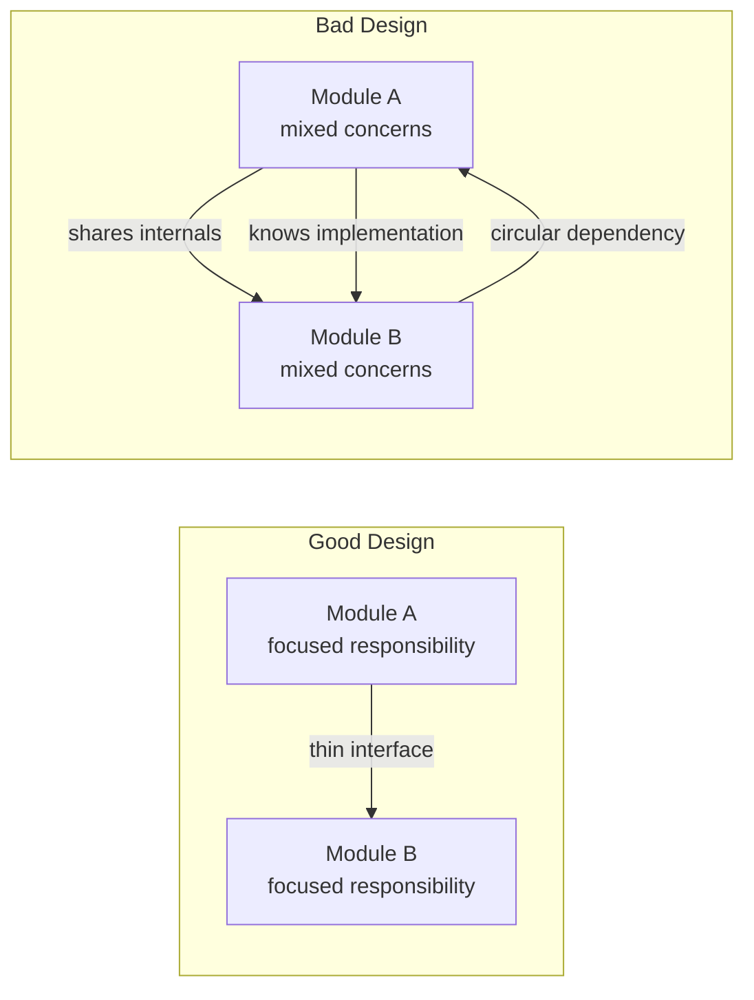
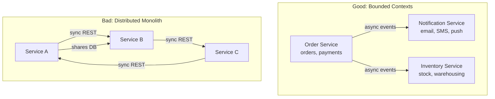

# Coupling & Cohesion

Two complementary metrics that define the quality of a software design: aim for **low coupling** between modules and **high cohesion** within each module.

---

## Overview

```
Good Design = Low Coupling + High Cohesion
```

| Metric | Goal | Meaning |
|--------|------|---------|
| **Coupling** | LOW | How much one module depends on another |
| **Cohesion** | HIGH | How strongly related the responsibilities within a module are |



---

## Coupling (Aim for LOW)

Coupling measures the degree of interdependence between modules. High coupling means a change in one module forces changes in others; low coupling means modules can evolve independently.

### Tight vs Loose Coupling

| Aspect | Tight Coupling | Loose Coupling |
|--------|---------------|----------------|
| Dependencies | Concrete classes, internal state | Interfaces, abstractions |
| Change impact | Ripples across many classes | Localized to one module |
| Testability | Hard to mock, needs full system | Easy to mock, unit-testable |
| Reusability | Low -- class drags its dependencies | High -- module works in new contexts |
| Deployment | Monolithic, deploy everything | Independent, deploy in isolation |

### Types of Coupling (Worst to Best)

| Type | Description | Example | Severity |
|------|-------------|---------|----------|
| **Content** | One module directly modifies or reads internal data of another | Reaching into another class's private fields via reflection | Worst |
| **Common** | Multiple modules share global/mutable state | Two classes reading/writing the same global variable | Very Bad |
| **Control** | One module controls the flow of another by passing flags | `process(data, isAdmin=true)` where caller dictates callee's logic | Bad |
| **Stamp** | Modules share a composite data structure but only use part of it | Passing an entire `User` object when only `email` is needed | Moderate |
| **Data** | Modules communicate through simple, well-defined parameters | `sendEmail(String to, String subject, String body)` | Good |
| **Message** | Modules communicate only through messages/events, no direct calls | Event bus, message queues, publish-subscribe | Best |


### Example: Tight Coupling (BAD)

`OrderService` directly instantiates `MySQLDatabase` -- any change in the database class forces changes in the order service.

**Java**
```java
// BAD: Tight coupling -- OrderService depends on concrete MySQLDatabase
class MySQLDatabase {
    public void save(String table, Map<String, Object> data) {
        // MySQL-specific implementation
    }
}

class OrderService {
    private MySQLDatabase db = new MySQLDatabase(); // hardcoded dependency

    public void placeOrder(Order order) {
        Map<String, Object> data = Map.of("id", order.getId(), "total", order.getTotal());
        db.save("orders", data); // coupled to MySQL internals
    }
}
```

**C++**
```cpp
// BAD: Tight coupling -- OrderService hardcodes MySQLDatabase
class MySQLDatabase {
public:
    void save(const std::string& table, const std::map<std::string, std::string>& data) {
        // MySQL-specific implementation
    }
};

class OrderService {
    MySQLDatabase db; // hardcoded concrete dependency
public:
    void placeOrder(const Order& order) {
        std::map<std::string, std::string> data = {{"id", order.id}, {"total", order.total}};
        db.save("orders", data); // coupled to MySQL internals
    }
};
```

**Python**
```python
# BAD: Tight coupling -- OrderService hardcodes MySQLDatabase
class MySQLDatabase:
    def save(self, table: str, data: dict) -> None:
        # MySQL-specific implementation
        pass

class OrderService:
    def __init__(self):
        self.db = MySQLDatabase()  # hardcoded dependency

    def place_order(self, order: Order) -> None:
        data = {"id": order.id, "total": order.total}
        self.db.save("orders", data)  # coupled to MySQL internals
```

### Example: Loose Coupling (GOOD)

Introduce an interface/abstraction and inject the dependency. `OrderService` no longer knows which database is in use.

**Java**
```java
// GOOD: Loose coupling via interface + dependency injection
interface Database {
    void save(String table, Map<String, Object> data);
}

class MySQLDatabase implements Database {
    @Override
    public void save(String table, Map<String, Object> data) {
        // MySQL-specific implementation
    }
}

class PostgresDatabase implements Database {
    @Override
    public void save(String table, Map<String, Object> data) {
        // Postgres-specific implementation
    }
}

class OrderService {
    private final Database db; // depends on abstraction, not concrete class

    public OrderService(Database db) { // dependency injected
        this.db = db;
    }

    public void placeOrder(Order order) {
        Map<String, Object> data = Map.of("id", order.getId(), "total", order.getTotal());
        db.save("orders", data);
    }
}

// Usage -- wiring happens at composition root
Database db = new PostgresDatabase();
OrderService service = new OrderService(db);
```

**C++**
```cpp
// GOOD: Loose coupling via abstract base class + dependency injection
class Database {
public:
    virtual ~Database() = default;
    virtual void save(const std::string& table,
                      const std::map<std::string, std::string>& data) = 0;
};

class MySQLDatabase : public Database {
public:
    void save(const std::string& table,
              const std::map<std::string, std::string>& data) override {
        // MySQL-specific implementation
    }
};

class PostgresDatabase : public Database {
public:
    void save(const std::string& table,
              const std::map<std::string, std::string>& data) override {
        // Postgres-specific implementation
    }
};

class OrderService {
    std::unique_ptr<Database> db; // depends on abstraction
public:
    explicit OrderService(std::unique_ptr<Database> db) : db(std::move(db)) {}

    void placeOrder(const Order& order) {
        std::map<std::string, std::string> data = {{"id", order.id}, {"total", order.total}};
        db->save("orders", data);
    }
};

// Usage
auto db = std::make_unique<PostgresDatabase>();
OrderService service(std::move(db));
```

**Python**
```python
# GOOD: Loose coupling via abstraction + dependency injection
from abc import ABC, abstractmethod

class Database(ABC):
    @abstractmethod
    def save(self, table: str, data: dict) -> None:
        pass

class MySQLDatabase(Database):
    def save(self, table: str, data: dict) -> None:
        # MySQL-specific implementation
        pass

class PostgresDatabase(Database):
    def save(self, table: str, data: dict) -> None:
        # Postgres-specific implementation
        pass

class OrderService:
    def __init__(self, db: Database):  # dependency injected
        self.db = db

    def place_order(self, order: Order) -> None:
        data = {"id": order.id, "total": order.total}
        self.db.save("orders", data)

# Usage
db = PostgresDatabase()
service = OrderService(db)
```

### Techniques to Reduce Coupling

| Technique | How It Helps |
|-----------|-------------|
| **Dependency Injection** | Invert control -- receive dependencies rather than creating them |
| **Program to Interfaces** | Depend on abstractions, not concrete implementations |
| **Observer Pattern** | Subject does not know its observers; communication via events |
| **Mediator Pattern** | Objects communicate through a central mediator, not directly with each other |
| **Event-Driven Architecture** | Producers and consumers are decoupled via message broker |
| **Facade Pattern** | Simplify a complex subsystem behind a single interface |
| **Law of Demeter** | Only talk to your immediate friends -- `a.getB().getC().doThing()` is a red flag |

---

## Cohesion (Aim for HIGH)

Cohesion measures how strongly the elements within a single module relate to each other. A highly cohesive class has a single, clear purpose. A low-cohesion class is a grab-bag of unrelated functionality.

### High Cohesion vs Low Cohesion

| Aspect | High Cohesion | Low Cohesion |
|--------|--------------|-------------|
| Responsibility | Single, focused purpose | Multiple unrelated tasks |
| Naming | Clear, specific (`EmailSender`, `OrderValidator`) | Vague (`AppManager`, `Utils`, `Helper`) |
| Method relationships | All methods operate on the same data | Methods operate on unrelated data |
| Size | Compact, manageable | Large "God class" with 20+ methods |
| Maintainability | Easy to understand and modify | Risky to change -- might break unrelated features |

### Types of Cohesion (Worst to Best)

| Type | Description | Example |
|------|-------------|---------|
| **Coincidental** | Elements are arbitrarily grouped, no logical relationship | `Utils` class with `parseDate()`, `sendEmail()`, `calculateTax()` |
| **Logical** | Elements perform similar category of tasks but are unrelated | `IOHandler` that reads files, network sockets, and stdin in one class |
| **Temporal** | Elements are grouped because they execute at the same time | `Startup` class that initializes DB, cache, logging, config |
| **Procedural** | Elements are grouped because they follow a sequence | `ProcessOrder` that validates, charges, ships, emails -- all in one class |
| **Communicational** | Elements operate on the same data | `CustomerReport` that queries and formats customer data |
| **Sequential** | Output of one element is the input of the next | Pipeline stages within one class |
| **Functional** | Every element contributes to a single, well-defined task | `EmailSender` that only sends emails |


### Example: Low Cohesion (BAD)

A "God class" that does everything -- user management, email, and reporting all in one place.

**Java**
```java
// BAD: Low cohesion -- UserManager does too many unrelated things
class UserManager {
    public void createUser(String name, String email) { /* ... */ }
    public void deleteUser(int userId) { /* ... */ }
    public void sendWelcomeEmail(String email) { /* ... */ }       // email concern
    public void sendPasswordReset(String email) { /* ... */ }      // email concern
    public String generateMonthlyReport() { /* ... */ return ""; } // reporting concern
    public void exportUsersToCSV(String path) { /* ... */ }        // export concern
    public boolean validateEmail(String email) { /* ... */ return true; } // validation concern
    public void logActivity(int userId, String action) { /* ... */ } // logging concern
}
```

**C++**
```cpp
// BAD: Low cohesion -- UserManager does too many unrelated things
class UserManager {
public:
    void createUser(const std::string& name, const std::string& email) { /* ... */ }
    void deleteUser(int userId) { /* ... */ }
    void sendWelcomeEmail(const std::string& email) { /* ... */ }
    void sendPasswordReset(const std::string& email) { /* ... */ }
    std::string generateMonthlyReport() { /* ... */ return ""; }
    void exportUsersToCSV(const std::string& path) { /* ... */ }
    bool validateEmail(const std::string& email) { /* ... */ return true; }
    void logActivity(int userId, const std::string& action) { /* ... */ }
};
```

**Python**
```python
# BAD: Low cohesion -- UserManager does too many unrelated things
class UserManager:
    def create_user(self, name: str, email: str) -> None: ...
    def delete_user(self, user_id: int) -> None: ...
    def send_welcome_email(self, email: str) -> None: ...       # email concern
    def send_password_reset(self, email: str) -> None: ...      # email concern
    def generate_monthly_report(self) -> str: ...               # reporting concern
    def export_users_to_csv(self, path: str) -> None: ...       # export concern
    def validate_email(self, email: str) -> bool: ...           # validation concern
    def log_activity(self, user_id: int, action: str) -> None: ... # logging concern
```

### Example: High Cohesion (GOOD)

Split into focused classes, each with a single responsibility.

**Java**
```java
// GOOD: High cohesion -- each class has one focused responsibility
class UserRepository {
    public void create(String name, String email) { /* ... */ }
    public void delete(int userId) { /* ... */ }
    public User findById(int userId) { /* ... */ return null; }
}

class EmailService {
    public void sendWelcomeEmail(String email) { /* ... */ }
    public void sendPasswordReset(String email) { /* ... */ }
}

class UserReportGenerator {
    public String generateMonthlyReport(List<User> users) { /* ... */ return ""; }
    public void exportToCSV(List<User> users, String path) { /* ... */ }
}

class EmailValidator {
    public boolean isValid(String email) { /* ... */ return true; }
}
```

**C++**
```cpp
// GOOD: High cohesion -- each class has one focused responsibility
class UserRepository {
public:
    void create(const std::string& name, const std::string& email) { /* ... */ }
    void remove(int userId) { /* ... */ }
    User findById(int userId) { /* ... */ return {}; }
};

class EmailService {
public:
    void sendWelcomeEmail(const std::string& email) { /* ... */ }
    void sendPasswordReset(const std::string& email) { /* ... */ }
};

class UserReportGenerator {
public:
    std::string generateMonthlyReport(const std::vector<User>& users) { return ""; }
    void exportToCSV(const std::vector<User>& users, const std::string& path) { /* ... */ }
};

class EmailValidator {
public:
    bool isValid(const std::string& email) { return true; }
};
```

**Python**
```python
# GOOD: High cohesion -- each class has one focused responsibility
class UserRepository:
    def create(self, name: str, email: str) -> None: ...
    def delete(self, user_id: int) -> None: ...
    def find_by_id(self, user_id: int) -> User: ...

class EmailService:
    def send_welcome_email(self, email: str) -> None: ...
    def send_password_reset(self, email: str) -> None: ...

class UserReportGenerator:
    def generate_monthly_report(self, users: list[User]) -> str: ...
    def export_to_csv(self, users: list[User], path: str) -> None: ...

class EmailValidator:
    def is_valid(self, email: str) -> bool: ...
```

### Signs of Low Cohesion

- Class name contains "Manager", "Handler", "Processor", "Helper", or "Utils" and has 20+ methods
- Methods in the class operate on completely different data
- You have trouble naming the class without using "And" (e.g., `UserAndEmailAndReportService`)
- Changes to one feature require modifying a method that shares a class with unrelated features
- The class has many instance variables, but each method only uses a small subset

---

## Measuring Quality

### Coupling & Cohesion Map to SOLID

| SOLID Principle | Coupling Effect | Cohesion Effect |
|----------------|----------------|-----------------|
| **S** -- Single Responsibility | Reduces coupling (fewer reasons to depend on a class) | Directly increases cohesion (one responsibility per class) |
| **O** -- Open/Closed | Reduces coupling (extend via new classes, not modifying existing) | Maintains cohesion (extensions are separate classes) |
| **L** -- Liskov Substitution | Enables loose coupling (subtypes are interchangeable) | Ensures cohesion of class hierarchies |
| **I** -- Interface Segregation | Reduces stamp/control coupling (clients depend on small interfaces) | Increases cohesion of interfaces |
| **D** -- Dependency Inversion | Directly reduces coupling (depend on abstractions) | Supports cohesion (implementations are focused) |

### Package/Module-Level Cohesion

At the package or module level, the same principles apply but at a larger scale:

| Principle | Description |
|-----------|-------------|
| **Common Reuse** | Classes in a package are used together -- if you depend on one, you depend on all |
| **Common Closure** | Classes that change together belong in the same package |
| **Reuse/Release Equivalence** | The unit of reuse is the unit of release -- a package should be releasable as a whole |

**Rule of thumb:** If two classes are always modified in the same PR, they probably belong in the same package. If a class is imported by packages for completely different reasons, it probably needs to be split.

### Microservices: Coupling & Cohesion at Scale

Each microservice should be a **high-cohesion, loosely-coupled** unit:



| Aspect | Good Microservice Design | Distributed Monolith (Bad) |
|--------|-------------------------|---------------------------|
| Communication | Async events, well-defined APIs | Synchronous chains, shared databases |
| Data ownership | Each service owns its data | Multiple services read/write the same tables |
| Deployment | Deploy independently | Must deploy multiple services together |
| Failure isolation | One failure does not cascade | One failure takes down the chain |
| Cohesion | Each service = one bounded context | Logic for one feature spread across services |

### Quick Smell Test

Ask these questions during design:

1. **Can I test this class without instantiating half the application?** (If no -- coupling is too high)
2. **Can I describe this class's purpose in one sentence without "and"?** (If no -- cohesion is too low)
3. **If I change one feature, how many files do I touch?** (More files = more coupling)
4. **Does this class have methods that never use the same instance variables?** (If yes -- cohesion is too low)

---

## Common Interview Questions

**Q1: What is the relationship between coupling and cohesion? Why do we want low coupling and high cohesion?**

Low coupling means modules can be developed, tested, and deployed independently -- changes in one module do not ripple through the system. High cohesion means each module has a clear, focused purpose, making it easier to understand, maintain, and reuse. Together, they produce systems that are flexible, testable, and resilient to change.

**Q2: Give an example of tight coupling and explain how to fix it.**

A `PaymentService` that directly instantiates `StripeGateway` is tightly coupled. If you switch to PayPal, you must modify `PaymentService`. Fix: introduce a `PaymentGateway` interface, have both `StripeGateway` and `PayPalGateway` implement it, and inject the dependency via the constructor. Now `PaymentService` depends on an abstraction, not a concrete class.

**Q3: What is a "God class" and how does it relate to cohesion?**

A God class is a class that has taken on too many responsibilities -- it knows too much and does too much. It has very low cohesion because its methods are not related to a single purpose. The fix is to decompose it into multiple smaller, highly cohesive classes, each owning one responsibility. Common symptoms: vague names like `AppManager`, 1000+ lines, dozens of methods, many unrelated instance variables.

**Q4: How do coupling and cohesion apply to microservices?**

Each microservice should have high internal cohesion (encapsulating one bounded context) and loose coupling with other services (communicating via well-defined APIs or async events, owning its own data). A "distributed monolith" violates both: services share databases (tight coupling) and feature logic is split across services (low cohesion), resulting in the worst of both worlds.

**Q5: How does the Dependency Inversion Principle reduce coupling?**

DIP states that high-level modules should not depend on low-level modules; both should depend on abstractions. By introducing an interface between the caller and the implementation, you break the direct dependency. The high-level module only knows about the interface, so you can swap implementations (e.g., MySQL to Postgres, real service to mock) without changing the high-level code.

**Q6: Name three design patterns that help reduce coupling and explain briefly.**

1. **Observer** -- subject notifies observers via an event interface; it never calls observer methods directly, so new observers can be added without modifying the subject.
2. **Strategy** -- algorithm is injected via an interface, decoupling the context class from specific algorithm implementations.
3. **Mediator** -- objects communicate through a central mediator rather than directly referencing each other, reducing N-to-N dependencies to N-to-1.
