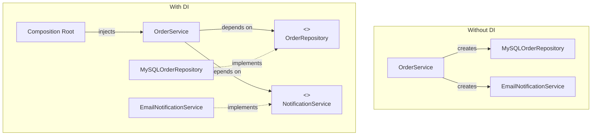
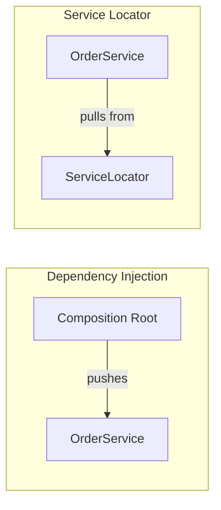
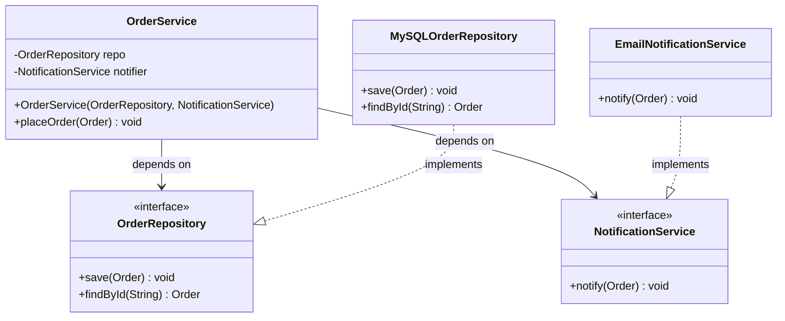

# Dependency Injection

A design technique where an object receives its dependencies from the outside rather than creating them itself, enabling loose coupling, testability, and flexibility.

---

## What & Why

### Inversion of Control (IoC)

Traditional control flow has a class creating its own dependencies. **Inversion of Control** flips this: a class *declares* what it needs, and something external *provides* it. Dependency Injection (DI) is the most common implementation of IoC.

> "Don't call us, we'll call you." — The Hollywood Principle

### Without DI: Tight Coupling

```java
// BAD: OrderService creates its own dependencies
class OrderService {
    private final MySQLOrderRepository repository = new MySQLOrderRepository();
    private final EmailNotificationService notifier = new EmailNotificationService();

    public void placeOrder(Order order) {
        repository.save(order);
        notifier.notify(order);
    }
}
```

Problems:
- **Cannot test** without a real MySQL database and email server
- **Cannot swap** implementations (e.g., switch to PostgreSQL or SMS notifications)
- **Violates SRP** — the class is responsible for choosing *and* using its collaborators
- **Violates DIP** — high-level module depends on concrete low-level modules

### With DI: Loose Coupling

```java
// GOOD: OrderService receives its dependencies
class OrderService {
    private final OrderRepository repository;
    private final NotificationService notifier;

    OrderService(OrderRepository repository, NotificationService notifier) {
        this.repository = repository;
        this.notifier = notifier;
    }

    public void placeOrder(Order order) {
        repository.save(order);
        notifier.notify(order);
    }
}
```

Now we can inject a `MockOrderRepository` in tests and swap to `PostgresOrderRepository` in production without touching `OrderService`.

### Benefits Summary

| Benefit | How DI Achieves It |
|---|---|
| **Testability** | Inject mocks/stubs instead of real implementations |
| **Flexibility** | Swap implementations without modifying consumer code |
| **Single Responsibility** | Class focuses on its own logic, not dependency creation |
| **Open/Closed Principle** | Extend behavior by injecting new implementations |
| **Explicit dependencies** | Constructor signature documents what a class needs |

### Dependency Graph Visualization



---

## Injection Types

### 1. Constructor Injection (Preferred)

Dependencies are provided through the constructor. This is the **recommended default** because:
- Dependencies are **immutable** (assigned to `final`/`const` fields)
- Object is **fully initialized** — no partially constructed state
- Dependencies are **explicit** — visible in the constructor signature
- Easy to see when a class has **too many responsibilities** (too many constructor params)

**Java**
```java
public interface MessageService {
    void send(String to, String body);
}

public class EmailService implements MessageService {
    @Override
    public void send(String to, String body) {
        System.out.println("Email to " + to + ": " + body);
    }
}

public class UserController {
    private final MessageService messageService;

    // Constructor injection — dependency is required and immutable
    public UserController(MessageService messageService) {
        this.messageService = messageService;
    }

    public void registerUser(String email) {
        // ... registration logic
        messageService.send(email, "Welcome!");
    }
}
```

**C++**
```cpp
#include <iostream>
#include <memory>
#include <string>

class MessageService {
public:
    virtual ~MessageService() = default;
    virtual void send(const std::string& to, const std::string& body) = 0;
};

class EmailService : public MessageService {
public:
    void send(const std::string& to, const std::string& body) override {
        std::cout << "Email to " << to << ": " << body << std::endl;
    }
};

class UserController {
    std::unique_ptr<MessageService> messageService_;

public:
    // Constructor injection with ownership transfer
    explicit UserController(std::unique_ptr<MessageService> service)
        : messageService_(std::move(service)) {}

    void registerUser(const std::string& email) {
        // ... registration logic
        messageService_->send(email, "Welcome!");
    }
};
```

**Python**
```python
from abc import ABC, abstractmethod

class MessageService(ABC):
    @abstractmethod
    def send(self, to: str, body: str) -> None: ...

class EmailService(MessageService):
    def send(self, to: str, body: str) -> None:
        print(f"Email to {to}: {body}")

class UserController:
    def __init__(self, message_service: MessageService) -> None:
        self._message_service = message_service  # constructor injection

    def register_user(self, email: str) -> None:
        # ... registration logic
        self._message_service.send(email, "Welcome!")
```

### 2. Setter Injection

Dependencies are provided through setter methods after construction. Use this for **optional** dependencies or when a dependency can change at runtime.

**Java**
```java
public class ReportGenerator {
    private Formatter formatter;  // optional — defaults to plain text

    // Setter injection
    public void setFormatter(Formatter formatter) {
        this.formatter = formatter;
    }

    public String generate(Data data) {
        if (formatter == null) {
            return data.toPlainText();
        }
        return formatter.format(data);
    }
}
```

**C++**
```cpp
class ReportGenerator {
    std::shared_ptr<Formatter> formatter_;  // optional

public:
    void setFormatter(std::shared_ptr<Formatter> formatter) {
        formatter_ = std::move(formatter);
    }

    std::string generate(const Data& data) {
        if (!formatter_) {
            return data.toPlainText();
        }
        return formatter_->format(data);
    }
};
```

**Python**
```python
class ReportGenerator:
    def __init__(self) -> None:
        self._formatter: Formatter | None = None

    def set_formatter(self, formatter: Formatter) -> None:
        self._formatter = formatter

    def generate(self, data: Data) -> str:
        if self._formatter is None:
            return data.to_plain_text()
        return self._formatter.format(data)
```

**Drawback:** Object can be used in an incomplete state. Prefer constructor injection unless the dependency is truly optional.

### 3. Interface Injection

The dependency provides an injector method via an interface that the consumer must implement. This is less common and mainly seen in framework callback patterns.

**Java**
```java
// The injection interface
public interface MessageServiceAware {
    void setMessageService(MessageService service);
}

// Consumer implements the injection interface
public class NotificationHandler implements MessageServiceAware {
    private MessageService messageService;

    @Override
    public void setMessageService(MessageService service) {
        this.messageService = service;
    }

    public void handle(Event event) {
        messageService.send(event.getTarget(), event.getMessage());
    }
}
```

### 4. Method Injection

The dependency is passed as a parameter to the method that needs it. Useful when different calls require different implementations.

**Java**
```java
public class DataExporter {
    // Method injection — caller decides the format each time
    public byte[] export(Data data, Serializer serializer) {
        return serializer.serialize(data);
    }
}

// Usage
exporter.export(data, new JsonSerializer());
exporter.export(data, new CsvSerializer());
```

**Python**
```python
class DataExporter:
    def export(self, data: Data, serializer: Serializer) -> bytes:
        return serializer.serialize(data)

# Usage
exporter.export(data, JsonSerializer())
exporter.export(data, CsvSerializer())
```

### Injection Type Comparison

| Type | When to Use | Pros | Cons |
|---|---|---|---|
| **Constructor** | Required dependencies (default choice) | Immutable, explicit, fail-fast | Long parameter lists if overused |
| **Setter** | Optional/changeable dependencies | Flexible, readable for many deps | Mutable, possible incomplete state |
| **Interface** | Framework-managed injection | Contract-based | Verbose, rarely needed |
| **Method** | Per-call varying dependency | Maximum flexibility per call | Caller must supply dependency each time |

---

## DI Without Frameworks (Manual DI)

In interviews and small projects, you will wire dependencies by hand. This is called **Manual DI** or **Poor Man's DI**.

### Composition Root

The **composition root** is the single place (typically `main()`) where you construct and wire all dependencies. No other part of the code should use `new` for service classes.

**Java**
```java
public class Main {
    public static void main(String[] args) {
        // --- Composition Root: wire everything here ---
        OrderRepository repo = new MySQLOrderRepository(
            new ConnectionPool("jdbc:mysql://localhost/orders")
        );
        NotificationService notifier = new EmailNotificationService(
            new SmtpClient("smtp.company.com")
        );
        PaymentGateway payments = new StripePaymentGateway("sk_live_...");
        OrderService orderService = new OrderService(repo, notifier, payments);

        // --- Start the application ---
        new HttpServer(orderService).start(8080);
    }
}
```

**C++**
```cpp
int main() {
    // --- Composition Root ---
    auto pool = std::make_unique<ConnectionPool>("postgresql://localhost/orders");
    auto repo = std::make_unique<PostgresOrderRepository>(std::move(pool));
    auto notifier = std::make_unique<EmailNotificationService>(
        std::make_unique<SmtpClient>("smtp.company.com")
    );
    auto payments = std::make_unique<StripePaymentGateway>("sk_live_...");
    auto orderService = std::make_unique<OrderService>(
        std::move(repo), std::move(notifier), std::move(payments)
    );

    HttpServer server(std::move(orderService));
    server.start(8080);
    return 0;
}
```

**Python**
```python
def main():
    # --- Composition Root ---
    pool = ConnectionPool("postgresql://localhost/orders")
    repo = PostgresOrderRepository(pool)
    notifier = EmailNotificationService(SmtpClient("smtp.company.com"))
    payments = StripePaymentGateway("sk_live_...")
    order_service = OrderService(repo, notifier, payments)

    # --- Start the application ---
    server = HttpServer(order_service)
    server.start(8080)

if __name__ == "__main__":
    main()
```

### Factory Pattern for Complex Creation

When object creation is complex or conditional, extract a factory to keep the composition root clean.

**Java**
```java
public class OrderServiceFactory {
    public static OrderService create(Config config) {
        OrderRepository repo;
        if (config.getDbType().equals("mysql")) {
            repo = new MySQLOrderRepository(config.getDbUrl());
        } else {
            repo = new PostgresOrderRepository(config.getDbUrl());
        }

        NotificationService notifier = config.isSmsEnabled()
            ? new SmsNotificationService(config.getSmsApiKey())
            : new EmailNotificationService(config.getSmtpHost());

        return new OrderService(repo, notifier);
    }
}
```

### When Manual DI Is Sufficient

Manual DI is the right choice when:
- **Interview settings** — always use manual DI; frameworks add unnecessary complexity
- **Small projects** — fewer than ~20 services
- **Libraries** — libraries should not force a DI framework on consumers
- **Learning** — understand DI mechanics before using framework magic

---

## DI Frameworks

Frameworks automate the composition root by scanning for components, resolving dependency graphs, and managing object lifecycles.

### Spring (Java)

Spring is the most widely used DI framework in the Java ecosystem.

```java
// 1. Define interfaces
public interface OrderRepository {
    void save(Order order);
}

// 2. Mark implementations as components
@Repository
public class MySQLOrderRepository implements OrderRepository {
    @Override
    public void save(Order order) {
        // ... persist to MySQL
    }
}

@Service
public class OrderService {
    private final OrderRepository repository;
    private final NotificationService notifier;

    // Spring auto-injects matching beans via constructor
    // (@Autowired is optional on single-constructor classes since Spring 4.3)
    public OrderService(OrderRepository repository, NotificationService notifier) {
        this.repository = repository;
        this.notifier = notifier;
    }

    public void placeOrder(Order order) {
        repository.save(order);
        notifier.notify(order);
    }
}
```

**Explicit bean configuration** (useful when you don't own the class):
```java
@Configuration
public class AppConfig {
    @Bean
    public ConnectionPool connectionPool() {
        return new ConnectionPool("jdbc:mysql://localhost/orders");
    }

    @Bean
    public OrderRepository orderRepository(ConnectionPool pool) {
        return new MySQLOrderRepository(pool);
    }
}
```

| Spring Annotation | Purpose |
|---|---|
| `@Component` | Generic Spring-managed bean |
| `@Service` | Business logic layer bean |
| `@Repository` | Data access layer bean |
| `@Controller` | Web controller bean |
| `@Autowired` | Inject a dependency (optional on single constructors) |
| `@Bean` | Define a bean in a `@Configuration` class |
| `@Qualifier` | Disambiguate when multiple implementations exist |

### Google Guice (Java)

A lightweight alternative to Spring, focused purely on DI.

```java
// Module defines bindings
public class OrderModule extends AbstractModule {
    @Override
    protected void configure() {
        bind(OrderRepository.class).to(MySQLOrderRepository.class);
        bind(NotificationService.class).to(EmailNotificationService.class);
    }
}

// Consumer uses @Inject
public class OrderService {
    private final OrderRepository repository;

    @Inject
    public OrderService(OrderRepository repository) {
        this.repository = repository;
    }
}

// Bootstrap
Injector injector = Guice.createInjector(new OrderModule());
OrderService service = injector.getInstance(OrderService.class);
```

### C++ (Manual or Boost.DI)

C++ has no standard DI framework. Most projects use **manual constructor injection**. For larger projects, [Boost.DI](https://github.com/boost-ext/di) provides compile-time DI:

```cpp
#include <boost/di.hpp>
namespace di = boost::di;

auto injector = di::make_injector(
    di::bind<MessageService>.to<EmailService>(),
    di::bind<OrderRepository>.to<MySQLOrderRepository>()
);

auto service = injector.create<OrderService>();
```

Boost.DI resolves the dependency graph at compile time with zero runtime overhead.

### Python (dependency-injector or Constructor Params)

Python's dynamic nature makes DI simple without a framework. Constructor parameters with type hints are usually sufficient:

```python
# Simple approach — just use constructor params + protocols
from typing import Protocol

class OrderRepository(Protocol):
    def save(self, order: Order) -> None: ...

class OrderService:
    def __init__(self, repo: OrderRepository, notifier: NotificationService) -> None:
        self._repo = repo
        self._notifier = notifier
```

For larger applications, the `dependency-injector` library provides container-based DI:

```python
from dependency_injector import containers, providers

class Container(containers.DeclarativeContainer):
    config = providers.Configuration()

    order_repo = providers.Singleton(
        MySQLOrderRepository,
        db_url=config.db_url,
    )

    notification_service = providers.Factory(
        EmailNotificationService,
        smtp_host=config.smtp_host,
    )

    order_service = providers.Factory(
        OrderService,
        repo=order_repo,
        notifier=notification_service,
    )

# Usage
container = Container()
container.config.from_yaml("config.yml")
service = container.order_service()
```

---

## Service Locator (Anti-Pattern)

### What It Is

A **Service Locator** is a global registry that objects query at runtime to obtain their dependencies.

```java
// Service Locator — a global registry
public class ServiceLocator {
    private static final Map<Class<?>, Object> services = new HashMap<>();

    public static <T> void register(Class<T> type, T instance) {
        services.put(type, instance);
    }

    @SuppressWarnings("unchecked")
    public static <T> T get(Class<T> type) {
        return (T) services.get(type);
    }
}

// Consumer fetches its own dependencies
public class OrderService {
    public void placeOrder(Order order) {
        // Hidden dependency — not visible in the API
        OrderRepository repo = ServiceLocator.get(OrderRepository.class);
        repo.save(order);
    }
}
```

### Why It Is an Anti-Pattern

| Problem | Explanation |
|---|---|
| **Hidden dependencies** | Constructor/method signatures don't reveal what the class needs |
| **Hard to test** | Must set up global state before each test; tests can interfere with each other |
| **Runtime failures** | Missing registrations cause `NullPointerException` at runtime instead of compile-time errors |
| **Tight coupling to locator** | Every class depends on the `ServiceLocator` itself |
| **Difficult to reason about** | Any method could pull in any dependency at any time |

### DI vs Service Locator



With DI, dependencies are **pushed** into the class (inversion of control). With a Service Locator, the class **pulls** dependencies from a global registry (no inversion).

**Rule of thumb:** If you can use DI, always prefer it over Service Locator. The only legitimate use of Service Locator is in legacy code where constructor injection is not feasible.

---

## Interview Application

### DI Enables Mocking in Unit Tests

This is one of the most important practical benefits of DI, and interviewers frequently ask about it.

**Java (with Mockito)**
```java
@Test
void placeOrder_savesAndNotifies() {
    // Arrange — inject mocks
    OrderRepository mockRepo = mock(OrderRepository.class);
    NotificationService mockNotifier = mock(NotificationService.class);
    OrderService service = new OrderService(mockRepo, mockNotifier);

    Order order = new Order("item-1", 29.99);

    // Act
    service.placeOrder(order);

    // Assert
    verify(mockRepo).save(order);
    verify(mockNotifier).notify(order);
}
```

**Python (with unittest.mock)**
```python
from unittest.mock import Mock

def test_place_order_saves_and_notifies():
    mock_repo = Mock(spec=OrderRepository)
    mock_notifier = Mock(spec=NotificationService)
    service = OrderService(mock_repo, mock_notifier)

    order = Order("item-1", 29.99)
    service.place_order(order)

    mock_repo.save.assert_called_once_with(order)
    mock_notifier.notify.assert_called_once_with(order)
```

Without DI, mocking would require monkey-patching or test-specific subclasses -- fragile and error-prone.

### DI in LLD Interview Problems

In low-level design interviews, DI shows up whenever you need to inject interchangeable behavior:

- **Strategy Pattern** — inject the strategy (e.g., `PricingStrategy`) via constructor
- **Repository Pattern** — inject `UserRepository` interface so the service is database-agnostic
- **Notification systems** — inject `NotificationService` to support email, SMS, push without modifying sender
- **Payment processing** — inject `PaymentGateway` to support Stripe, PayPal, etc.

**Example: Parking Lot LLD**
```java
public class ParkingLot {
    private final PricingStrategy pricingStrategy;
    private final PaymentProcessor paymentProcessor;
    private final NotificationService notificationService;

    public ParkingLot(PricingStrategy pricingStrategy,
                      PaymentProcessor paymentProcessor,
                      NotificationService notificationService) {
        this.pricingStrategy = pricingStrategy;
        this.paymentProcessor = paymentProcessor;
        this.notificationService = notificationService;
    }

    public Receipt checkout(Ticket ticket) {
        double fee = pricingStrategy.calculate(ticket);
        paymentProcessor.charge(ticket.getVehicleOwner(), fee);
        Receipt receipt = new Receipt(ticket, fee);
        notificationService.send(ticket.getVehicleOwner(), receipt);
        return receipt;
    }
}
```

### Explaining DI in Class Diagrams

When drawing UML class diagrams in an interview, show DI by:
1. Drawing **interfaces** (dashed boxes or `<<interface>>` stereotype)
2. Having the consumer point to the **interface** (dependency arrow), not the concrete class
3. Having concrete classes implement the interface (dashed arrow with hollow triangle)
4. Annotating the constructor with the interface parameters



**Interview tip:** When the interviewer asks "how would you make this testable?" or "how would you make this extensible?", DI is almost always part of the answer. Introduce an interface, inject via constructor, and wire in the composition root.

---

## Common Interview Questions

**Q1: What is Dependency Injection and how does it relate to Inversion of Control?**
DI is a specific technique for implementing IoC. Instead of a class creating its own dependencies (`new ConcreteService()`), those dependencies are provided externally -- typically through the constructor. IoC is the broader principle that control of dependency creation is inverted from the consumer to an external assembler.

**Q2: Why is constructor injection preferred over setter injection?**
Constructor injection guarantees the object is fully initialized at creation time, prevents the dependency from being changed later (immutability via `final`/`const`), makes dependencies explicit in the API, and causes a compile-time error if a dependency is missing. Setter injection can leave an object in a partially initialized state and allows accidental re-assignment.

**Q3: What is the difference between Dependency Injection and Service Locator?**
With DI, dependencies are **pushed** into a class by an external assembler (composition root or framework). With Service Locator, the class **pulls** its dependencies from a global registry. DI is preferred because it makes dependencies explicit, whereas Service Locator hides them, making code harder to test and reason about.

**Q4: How does DI improve testability?**
DI allows you to inject mock or stub implementations during testing. For example, inject a `MockOrderRepository` that stores data in memory instead of a real database. Without DI, the class creates its own concrete dependencies, requiring the real infrastructure (database, network, etc.) for every test.

**Q5: When would you NOT use a DI framework?**
In interviews (manual DI is clearer), in small projects with few services (a framework adds unnecessary complexity), in libraries (frameworks should not be forced on consumers), and when learning DI concepts (understand the mechanics first). Manual DI in `main()` is perfectly valid and often preferred for its simplicity and explicitness.

**Q6: How do you handle circular dependencies with DI?**
Circular dependencies (A depends on B, B depends on A) indicate a design flaw. Solutions: (1) Extract the shared logic into a third class that both depend on. (2) Use an event/observer pattern so one class publishes events instead of calling the other directly. (3) As a last resort, use setter injection to break the cycle, but this is a code smell that should trigger a redesign.
