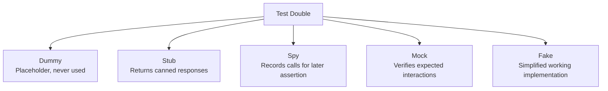
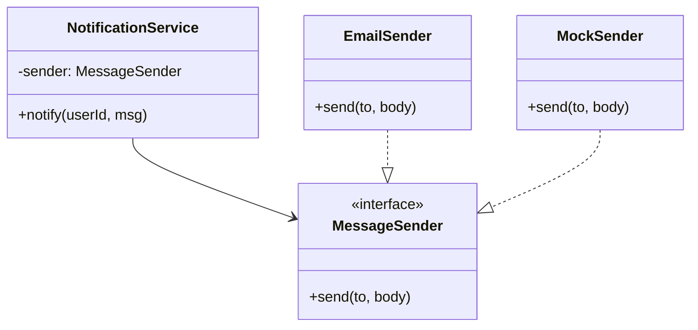
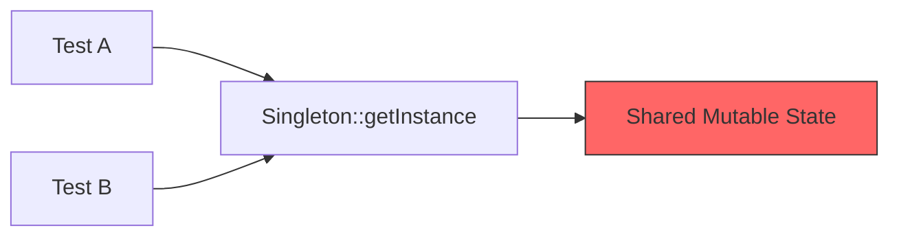

# Design for Testability

Writing code that is easy to test is one of the strongest signals of senior engineering skill — it forces good design.

---

## What Makes Code Testable

Testable code has five key properties:

| Property | Why It Matters |
|----------|---------------|
| **Injectable dependencies** | Swap real services for test doubles |
| **No hidden global/static state** | Tests run in isolation, no ordering issues |
| **Single Responsibility** | Small, focused units are easy to test in isolation |
| **Pure functions** | Same input always produces same output — no setup needed |
| **Seams** | Points where behavior can be substituted without changing production code |

### Seams Explained

A **seam** is a place in code where you can alter behavior without editing the source. The three main types:

| Seam Type | Mechanism | Example |
|-----------|-----------|---------|
| **Object seam** | Polymorphism / interface | Pass a mock implementing an interface |
| **Compile seam** | Templates / generics | C++ template parameter replaced in test |
| **Link seam** | Linking a different implementation | Swap `.o` / `.so` file at link time |

### Testable vs Untestable — Side by Side

**Untestable** — hard-coded dependency, hidden state:

```java
// Java — UNTESTABLE
public class OrderService {
    public void placeOrder(Order order) {
        // Hidden dependency — impossible to mock
        PaymentGateway gateway = new PaymentGateway();
        gateway.charge(order.getTotal());

        // Static call — no seam
        AuditLog.record("order_placed", order.getId());
    }
}
```

**Testable** — dependencies injected via constructor:

```java
// Java — TESTABLE
public class OrderService {
    private final PaymentGateway gateway;
    private final AuditLog auditLog;

    public OrderService(PaymentGateway gateway, AuditLog auditLog) {
        this.gateway = gateway;
        this.auditLog = auditLog;
    }

    public void placeOrder(Order order) {
        gateway.charge(order.getTotal());
        auditLog.record("order_placed", order.getId());
    }
}
```

```cpp
// C++ — TESTABLE
class OrderService {
public:
    OrderService(std::unique_ptr<IPaymentGateway> gw,
                 std::unique_ptr<IAuditLog> log)
        : gateway_(std::move(gw)), auditLog_(std::move(log)) {}

    void placeOrder(const Order& order) {
        gateway_->charge(order.getTotal());
        auditLog_->record("order_placed", order.getId());
    }

private:
    std::unique_ptr<IPaymentGateway> gateway_;
    std::unique_ptr<IAuditLog> auditLog_;
};
```

```python
# Python — TESTABLE
class OrderService:
    def __init__(self, gateway: PaymentGateway, audit_log: AuditLog):
        self._gateway = gateway
        self._audit_log = audit_log

    def place_order(self, order: Order) -> None:
        self._gateway.charge(order.total)
        self._audit_log.record("order_placed", order.id)
```

---

## Test Doubles

Test doubles replace real dependencies during testing. Each type serves a different purpose.



| Double | Purpose | Verifies? | Has Logic? | Example |
|--------|---------|-----------|------------|---------|
| **Dummy** | Fill a required parameter | No | No | `new DummyLogger()` passed but never called |
| **Stub** | Return predetermined data | No | Minimal | `when(repo.findById(1)).thenReturn(user)` |
| **Spy** | Record calls, allow real behavior | After the fact | Delegates to real | Verify `sendEmail` was called twice |
| **Mock** | Verify interactions happened | Yes (expectations set upfront) | No | Expect `charge()` called with $50 |
| **Fake** | Working but simplified | No | Yes | In-memory database, local file store |

### Test Double Examples

**Java (Mockito)**

```java
// Stub — predetermined response
@Test
void should_returnUser_when_userExists() {
    UserRepository repo = mock(UserRepository.class);
    when(repo.findById(1L)).thenReturn(Optional.of(new User(1L, "Alice")));

    UserService service = new UserService(repo);
    User user = service.getUser(1L);

    assertEquals("Alice", user.getName());
}

// Mock — verify interaction
@Test
void should_sendWelcomeEmail_when_userRegisters() {
    EmailService emailService = mock(EmailService.class);
    UserService service = new UserService(mock(UserRepository.class), emailService);

    service.register(new User(1L, "Bob"));

    verify(emailService).sendWelcome("Bob");
}

// Spy — partial mock, record calls
@Test
void should_logWarning_when_retryExhausted() {
    Logger logger = spy(new ConsoleLogger());
    RetryService service = new RetryService(logger);

    service.executeWithRetry(() -> { throw new RuntimeException(); });

    verify(logger, times(3)).warn(anyString());
}
```

**C++ (Google Mock)**

```cpp
// Define mock class
class MockPaymentGateway : public IPaymentGateway {
public:
    MOCK_METHOD(bool, charge, (double amount), (override));
    MOCK_METHOD(void, refund, (const std::string& txnId), (override));
};

// Stub — return canned value
TEST(OrderServiceTest, AppliesDiscountBeforeCharging) {
    auto mockGw = std::make_unique<MockPaymentGateway>();
    EXPECT_CALL(*mockGw, charge(90.0)).WillOnce(Return(true));

    OrderService service(std::move(mockGw));
    service.placeOrder(Order{100.0, 0.10}); // 10% discount
}

// Mock — verify interaction
TEST(OrderServiceTest, RefundsOnCancellation) {
    auto mockGw = std::make_unique<MockPaymentGateway>();
    EXPECT_CALL(*mockGw, refund("txn_123")).Times(1);

    OrderService service(std::move(mockGw));
    service.cancelOrder("txn_123");
}
```

**Python (unittest.mock)**

```python
from unittest.mock import Mock, patch, MagicMock

# Stub — predetermined response
def test_get_user_returns_user():
    repo = Mock()
    repo.find_by_id.return_value = User(1, "Alice")

    service = UserService(repo)
    user = service.get_user(1)

    assert user.name == "Alice"

# Mock — verify interaction
def test_register_sends_welcome_email():
    email_service = Mock()
    service = UserService(Mock(), email_service)

    service.register(User(1, "Bob"))

    email_service.send_welcome.assert_called_once_with("Bob")

# Spy — wraps real object, records calls
def test_retry_logs_warnings():
    real_logger = ConsoleLogger()
    spy_logger = Mock(wraps=real_logger)
    service = RetryService(spy_logger)

    service.execute_with_retry(lambda: (_ for _ in ()).throw(RuntimeError()))

    assert spy_logger.warn.call_count == 3

# Fake — simplified working implementation
class FakeUserRepository:
    def __init__(self):
        self._store: dict[int, User] = {}

    def save(self, user: User) -> None:
        self._store[user.id] = user

    def find_by_id(self, user_id: int) -> User | None:
        return self._store.get(user_id)

def test_save_and_retrieve():
    repo = FakeUserRepository()
    service = UserService(repo)

    service.register(User(1, "Alice"))
    assert service.get_user(1).name == "Alice"
```

---

## Patterns That Help Testability

### 1. Dependency Injection

The single most impactful pattern for testability. Inject dependencies through the constructor so tests can substitute them.



```java
// Java — DI enables testing
public interface MessageSender {
    void send(String to, String body);
}

public class NotificationService {
    private final MessageSender sender;

    public NotificationService(MessageSender sender) {
        this.sender = sender;
    }

    public void notify(String userId, String msg) {
        sender.send(userId, msg);
    }
}

// In test:
MessageSender mock = mock(MessageSender.class);
NotificationService service = new NotificationService(mock);
service.notify("u1", "Hello");
verify(mock).send("u1", "Hello");
```

### 2. Strategy Pattern

Swap algorithms at runtime — and in tests.

```cpp
// C++ — Strategy pattern for testability
class CompressionStrategy {
public:
    virtual ~CompressionStrategy() = default;
    virtual std::vector<uint8_t> compress(const std::vector<uint8_t>& data) = 0;
};

class GzipCompression : public CompressionStrategy {
public:
    std::vector<uint8_t> compress(const std::vector<uint8_t>& data) override {
        // Real gzip compression
    }
};

class NoOpCompression : public CompressionStrategy {
public:
    std::vector<uint8_t> compress(const std::vector<uint8_t>& data) override {
        return data; // Pass-through for testing
    }
};

class FileArchiver {
public:
    explicit FileArchiver(std::unique_ptr<CompressionStrategy> strategy)
        : strategy_(std::move(strategy)) {}

    void archive(const std::string& path) {
        auto data = readFile(path);
        auto compressed = strategy_->compress(data);
        writeFile(path + ".arc", compressed);
    }

private:
    std::unique_ptr<CompressionStrategy> strategy_;
};

// Test uses NoOpCompression — fast, deterministic
TEST(FileArchiverTest, ArchivesFileWithExtension) {
    auto noop = std::make_unique<NoOpCompression>();
    FileArchiver archiver(std::move(noop));
    archiver.archive("/tmp/test.txt");
    ASSERT_TRUE(std::filesystem::exists("/tmp/test.txt.arc"));
}
```

### 3. Repository Pattern

Abstract data access behind an interface; test with an in-memory implementation.

```python
# Python — Repository pattern
from abc import ABC, abstractmethod

class OrderRepository(ABC):
    @abstractmethod
    def save(self, order: Order) -> None: ...

    @abstractmethod
    def find_by_id(self, order_id: str) -> Order | None: ...

    @abstractmethod
    def find_by_customer(self, customer_id: str) -> list[Order]: ...


class PostgresOrderRepository(OrderRepository):
    """Production — talks to real database."""
    def __init__(self, connection):
        self._conn = connection

    def save(self, order):
        self._conn.execute("INSERT INTO orders ...", order.to_dict())

    def find_by_id(self, order_id):
        row = self._conn.execute("SELECT * FROM orders WHERE id = %s", order_id)
        return Order.from_row(row) if row else None

    def find_by_customer(self, customer_id):
        rows = self._conn.execute("SELECT * FROM orders WHERE customer = %s", customer_id)
        return [Order.from_row(r) for r in rows]


class InMemoryOrderRepository(OrderRepository):
    """Test — fast, no database required."""
    def __init__(self):
        self._store: dict[str, Order] = {}

    def save(self, order):
        self._store[order.id] = order

    def find_by_id(self, order_id):
        return self._store.get(order_id)

    def find_by_customer(self, customer_id):
        return [o for o in self._store.values() if o.customer_id == customer_id]


# Test is fast, isolated, no DB setup
def test_order_total_for_customer():
    repo = InMemoryOrderRepository()
    repo.save(Order("o1", "c1", total=50))
    repo.save(Order("o2", "c1", total=30))
    repo.save(Order("o3", "c2", total=100))

    service = OrderService(repo)
    assert service.customer_total("c1") == 80
```

### 4. Interface-Based Design

Program to interfaces, not implementations. Every dependency behind an interface becomes a seam.

```java
// Java — interface-based design
public interface Clock {
    Instant now();
}

public class SystemClock implements Clock {
    public Instant now() { return Instant.now(); }
}

public class FixedClock implements Clock {
    private final Instant fixed;
    public FixedClock(Instant fixed) { this.fixed = fixed; }
    public Instant now() { return fixed; }
}

// Production: new AuctionService(new SystemClock())
// Test:       new AuctionService(new FixedClock(Instant.parse("2025-01-01T00:00:00Z")))
public class AuctionService {
    private final Clock clock;

    public AuctionService(Clock clock) {
        this.clock = clock;
    }

    public boolean isExpired(Auction auction) {
        return clock.now().isAfter(auction.getEndTime());
    }
}

@Test
void should_markAuctionExpired_when_pastEndTime() {
    Clock clock = new FixedClock(Instant.parse("2025-06-01T00:00:00Z"));
    AuctionService service = new AuctionService(clock);
    Auction auction = new Auction(Instant.parse("2025-05-01T00:00:00Z"));

    assertTrue(service.isExpired(auction));
}
```

---

## Anti-Patterns That Hurt Testability

### 1. Singleton



The Singleton holds global state that leaks between tests, causing flaky failures that depend on test execution order.

```java
// UNTESTABLE — Singleton
public class ConfigManager {
    private static ConfigManager instance;
    private Map<String, String> config = new HashMap<>();

    private ConfigManager() {
        // Loads from disk — slow, side-effecting
        config = loadFromFile("/etc/app.conf");
    }

    public static ConfigManager getInstance() {
        if (instance == null) instance = new ConfigManager();
        return instance;
    }

    public String get(String key) { return config.get(key); }
}

// TESTABLE — Inject a ConfigProvider interface instead
public interface ConfigProvider {
    String get(String key);
}

public class FileConfigProvider implements ConfigProvider { /* production */ }
public class MapConfigProvider implements ConfigProvider {
    private final Map<String, String> map;
    public MapConfigProvider(Map<String, String> map) { this.map = map; }
    public String get(String key) { return map.get(key); }
}
```

### 2. Static Methods

Static methods cannot be overridden or mocked (without bytecode manipulation). They eliminate the object seam.

```cpp
// UNTESTABLE — static call
class PriceCalculator {
public:
    double calculate(const Item& item) {
        double tax = TaxService::getCurrentRate(); // Static — no seam
        return item.price * (1 + tax);
    }
};

// TESTABLE — inject the tax provider
class ITaxProvider {
public:
    virtual ~ITaxProvider() = default;
    virtual double getCurrentRate() = 0;
};

class PriceCalculator {
public:
    explicit PriceCalculator(std::unique_ptr<ITaxProvider> tax)
        : tax_(std::move(tax)) {}

    double calculate(const Item& item) {
        return item.price * (1 + tax_->getCurrentRate());
    }

private:
    std::unique_ptr<ITaxProvider> tax_;
};
```

### 3. Deep Inheritance Hierarchies

```
AbstractBaseProcessor
  └── AbstractValidatingProcessor
        └── AbstractLoggingProcessor
              └── ConcreteOrderProcessor  ← you want to test this
```

To instantiate `ConcreteOrderProcessor`, you must satisfy every constructor in the chain — often requiring mocks for things irrelevant to the test.

**Fix:** Favor composition. Inject a `Validator` and a `Logger` rather than inheriting from them.

### 4. Law of Demeter Violations

```python
# UNTESTABLE — chain of calls ("train wreck")
def get_city(order):
    return order.get_customer().get_address().get_city()

# To test, you must mock: order -> customer -> address -> city
# Each mock returns another mock — fragile and verbose

# TESTABLE — ask, don't dig
def get_city(order):
    return order.get_shipping_city()  # Order encapsulates the traversal
```

### 5. Constructors That Do Work

```java
// UNTESTABLE — constructor has side effects
public class ReportGenerator {
    private final Connection dbConn;
    private final List<Template> templates;

    public ReportGenerator() {
        this.dbConn = DriverManager.getConnection("jdbc:mysql://prod:3306/db");
        this.templates = loadTemplatesFromDisk("/opt/templates/");
    }
}

// TESTABLE — constructor only assigns fields
public class ReportGenerator {
    private final Connection dbConn;
    private final List<Template> templates;

    public ReportGenerator(Connection dbConn, List<Template> templates) {
        this.dbConn = dbConn;
        this.templates = templates;
    }
}
```

### Anti-Pattern Summary

| Anti-Pattern | Problem | Fix |
|-------------|---------|-----|
| Singleton | Shared state across tests | Inject an interface |
| Static methods | No seam for substitution | Wrap in an instance method / inject |
| Deep inheritance | Complex setup, irrelevant dependencies | Composition over inheritance |
| Law of Demeter violations | Must mock entire chain | Encapsulate traversal |
| Constructor does work | Side effects on instantiation | Move work to factory / init method |

---

## Test Organization

### The AAA Pattern (Arrange-Act-Assert)

Every test should have three clearly separated sections:

```java
@Test
void should_applyDiscount_when_customerIsVIP() {
    // Arrange — set up the world
    PricingService service = new PricingService();
    Customer vip = new Customer("Alice", CustomerTier.VIP);
    Item item = new Item("Laptop", 1000.0);

    // Act — exercise the behavior
    double price = service.calculatePrice(item, vip);

    // Assert — verify the outcome
    assertEquals(850.0, price, 0.01); // 15% VIP discount
}
```

```cpp
TEST(PricingServiceTest, AppliesVipDiscount) {
    // Arrange
    PricingService service;
    Customer vip{"Alice", CustomerTier::VIP};
    Item item{"Laptop", 1000.0};

    // Act
    double price = service.calculatePrice(item, vip);

    // Assert
    EXPECT_NEAR(850.0, price, 0.01);
}
```

```python
def test_applies_vip_discount():
    # Arrange
    service = PricingService()
    vip = Customer("Alice", CustomerTier.VIP)
    item = Item("Laptop", 1000.0)

    # Act
    price = service.calculate_price(item, vip)

    # Assert
    assert price == pytest.approx(850.0, abs=0.01)
```

### Test Naming Conventions

Good test names document behavior. Common patterns:

| Convention | Example |
|-----------|---------|
| `should_X_when_Y` | `should_returnEmpty_when_noItemsExist` |
| `givenX_whenY_thenZ` | `givenVipCustomer_whenCheckout_thenApplyDiscount` |
| `methodName_scenario_expected` | `calculatePrice_vipCustomer_returns15PercentOff` |
| Plain English (Python) | `test_empty_cart_returns_zero_total` |

Choose one convention per project and stick with it.

### One Assertion Per Test vs Behavior-Focused

| Approach | Pros | Cons |
|----------|------|------|
| **One assertion per test** | Pinpoints exact failure; clear naming | Many small tests; more boilerplate |
| **Behavior-focused** (multiple related assertions) | Fewer tests; tests read like scenarios | Failures can mask each other |

**Pragmatic guideline:** Assert one logical behavior per test, which may involve multiple `assert` statements that verify the same concept.

```python
# Good — one logical behavior, two assertions
def test_register_creates_user_with_defaults():
    service = UserService(FakeUserRepository())
    user = service.register("Alice", "alice@example.com")

    assert user.name == "Alice"
    assert user.role == Role.MEMBER  # both verify "created with defaults"
```

### Test Isolation

Tests must not depend on each other. Key rules:

1. **No shared mutable state** — each test creates its own fixtures.
2. **No ordering dependency** — tests pass in any order.
3. **No external state** — use fakes for databases, file systems, network.
4. **Clean up after yourself** — if a test writes to a temp directory, delete it in teardown.

```java
// BAD — shared mutable state
static List<User> users = new ArrayList<>();

@Test void testAdd()    { users.add(new User("A")); assertEquals(1, users.size()); }
@Test void testAddTwo() { users.add(new User("B")); assertEquals(1, users.size()); } // FAILS if testAdd ran first

// GOOD — each test has its own state
@Test void testAdd() {
    List<User> users = new ArrayList<>();
    users.add(new User("A"));
    assertEquals(1, users.size());
}
```

---

## Common Interview Questions

**Q1: What makes code hard to test?**
Hard-coded dependencies (using `new` inside methods), static/global state, constructors that perform work (I/O, network calls), Law of Demeter violations requiring deep mock chains, and tight coupling where classes know too much about each other's internals. The common thread is the absence of seams — points where you can substitute behavior.

**Q2: What is the difference between a mock and a stub?**
A **stub** provides canned return values and does not verify how it was called. A **mock** sets expectations about interactions (which methods are called, with what arguments, how many times) and fails the test if those expectations are not met. Stubs test state; mocks test behavior.

**Q3: How does dependency injection improve testability?**
DI lets you pass dependencies through the constructor (or method parameters) instead of creating them internally. In tests, you substitute real dependencies with test doubles (mocks, stubs, fakes). This decouples the class under test from infrastructure concerns like databases, APIs, and file systems, making tests fast, isolated, and deterministic.

**Q4: Why are Singletons considered an anti-pattern for testing?**
Singletons introduce hidden shared mutable state. Tests that modify singleton state affect other tests, causing order-dependent failures. They also hide dependencies — the class's constructor signature does not reveal that it depends on the singleton. The fix is to extract an interface and inject the dependency.

**Q5: Explain the Arrange-Act-Assert pattern.**
AAA divides a test into three phases: **Arrange** sets up the object under test and its dependencies, **Act** calls the method being tested, and **Assert** verifies the result or side effects. This structure makes tests readable, consistent, and easy to diagnose when they fail.

**Q6: When would you use a Fake instead of a Mock?**
Use a fake when you need a simplified but working implementation — for example, an in-memory repository instead of a real database. Fakes are better than mocks when (a) the dependency has complex behavior that is hard to stub method-by-method, (b) you want integration-level confidence without external infrastructure, or (c) multiple tests share the same setup and a fake is simpler than repeating mock configurations.
