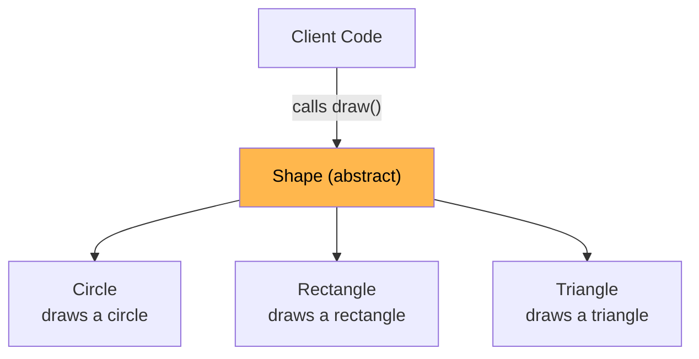
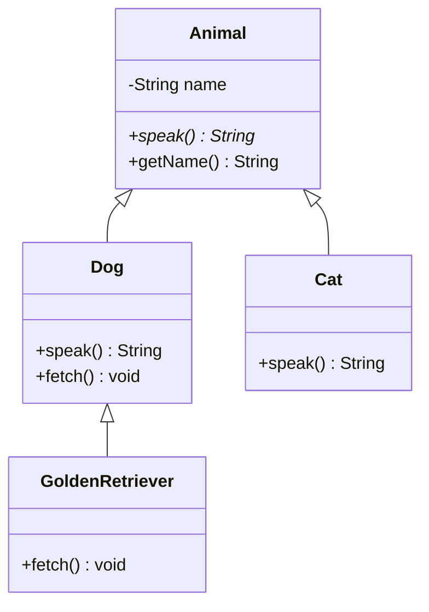
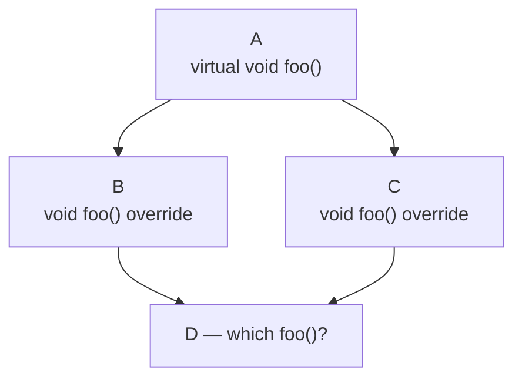
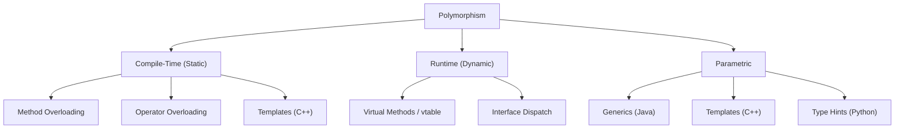
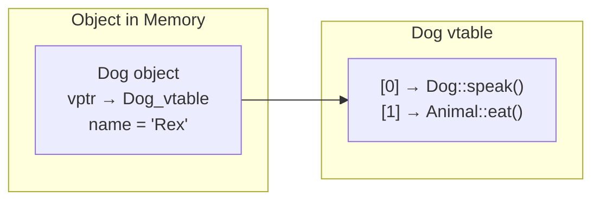

# OOP Fundamentals

The four pillars of object-oriented programming — the foundation of every low-level design interview.

---

## Abstraction

Hiding implementation details and exposing only the essential behavior. The caller doesn't need to know *how* something works, only *what* it does.



### Abstract Classes vs Interfaces

| Feature | Abstract Class | Interface |
|---------|---------------|-----------|
| **Purpose** | Partial implementation + contract | Pure contract (behavior specification) |
| **State** | Can have instance fields | No state (Java 8+ allows constants only) |
| **Constructors** | Yes | No |
| **Method types** | Abstract + concrete methods | All abstract (Java 8+ allows `default`) |
| **Inheritance** | Single (Java/C++), extends one class | Multiple — a class can implement many |
| **When to use** | Shared code among closely related classes | Unrelated classes sharing a capability |

**Rule of thumb:** Use an abstract class when classes share *state and behavior*. Use an interface when classes share only *behavior*.

### Java — Abstract Class & Interface

```java
// Abstract class — shared state + partial implementation
abstract class Shape {
    protected String color;

    public Shape(String color) { this.color = color; }

    // Concrete method — shared behavior
    public String getColor() { return color; }

    // Abstract method — subclass must implement
    public abstract double area();
}

// Interface — pure behavior contract
interface Drawable {
    void draw();    // implicitly public abstract
}

interface Resizable {
    void resize(double factor);
}

// Concrete class — single abstract class + multiple interfaces
class Circle extends Shape implements Drawable, Resizable {
    private double radius;

    public Circle(String color, double radius) {
        super(color);
        this.radius = radius;
    }

    @Override
    public double area() { return Math.PI * radius * radius; }

    @Override
    public void draw() { System.out.println("Drawing circle, r=" + radius); }

    @Override
    public void resize(double factor) { radius *= factor; }
}
```

### C++ — Pure Virtual Functions

```cpp
#include <iostream>
#include <cmath>

// Abstract class (has at least one pure virtual function)
class Shape {
protected:
    std::string color;
public:
    Shape(const std::string& color) : color(color) {}
    virtual ~Shape() = default;               // virtual destructor — essential

    std::string getColor() const { return color; }  // concrete method
    virtual double area() const = 0;                 // pure virtual = abstract
};

// "Interface" in C++ — all pure virtual, no state
class Drawable {
public:
    virtual ~Drawable() = default;
    virtual void draw() const = 0;
};

class Circle : public Shape, public Drawable {
    double radius;
public:
    Circle(const std::string& color, double r) : Shape(color), radius(r) {}

    double area() const override { return M_PI * radius * radius; }
    void draw() const override {
        std::cout << "Drawing circle, r=" << radius << std::endl;
    }
};
```

**C++ note:** There is no `interface` keyword. An interface is simulated by a class with *only* pure virtual functions and a virtual destructor.

### Python — ABC (Abstract Base Class)

```python
from abc import ABC, abstractmethod
import math

class Shape(ABC):
    def __init__(self, color: str):
        self.color = color                # state is allowed

    def get_color(self) -> str:           # concrete method
        return self.color

    @abstractmethod
    def area(self) -> float:              # abstract — must override
        ...

class Drawable(ABC):
    @abstractmethod
    def draw(self) -> None:
        ...

class Circle(Shape, Drawable):
    def __init__(self, color: str, radius: float):
        super().__init__(color)
        self._radius = radius

    def area(self) -> float:
        return math.pi * self._radius ** 2

    def draw(self) -> None:
        print(f"Drawing circle, r={self._radius}")
```

**Python note:** Without `ABC` + `@abstractmethod`, nothing prevents instantiation of incomplete subclasses. Python relies on convention more than enforcement.

---

## Encapsulation

Bundling data and the methods that operate on it into a single unit, and restricting direct access to the internal state. The object controls how its data is read and modified.

### Access Modifiers

| Modifier | Java | C++ | Python |
|----------|------|-----|--------|
| **Public** | `public` — accessible everywhere | `public:` | No prefix — all public by default |
| **Protected** | `protected` — same package + subclasses | `protected:` — subclasses + friends | `_single_underscore` (convention, not enforced) |
| **Private** | `private` — same class only | `private:` — same class + friends | `__double_underscore` (name mangling) |
| **Package/Internal** | default (no modifier) — same package | N/A | N/A |

### Java

```java
public class BankAccount {
    private double balance;       // hidden — direct access impossible
    private String owner;

    public BankAccount(String owner, double initialBalance) {
        this.owner = owner;
        if (initialBalance < 0) throw new IllegalArgumentException("Negative balance");
        this.balance = initialBalance;
    }

    // Controlled access — enforces business rules
    public void deposit(double amount) {
        if (amount <= 0) throw new IllegalArgumentException("Must be positive");
        balance += amount;
    }

    public void withdraw(double amount) {
        if (amount <= 0) throw new IllegalArgumentException("Must be positive");
        if (amount > balance) throw new IllegalStateException("Insufficient funds");
        balance -= amount;
    }

    public double getBalance() { return balance; }  // read-only access
    public String getOwner() { return owner; }
}
```

### C++

```cpp
class BankAccount {
private:
    double balance_;
    std::string owner_;

public:
    BankAccount(const std::string& owner, double initialBalance)
        : owner_(owner), balance_(initialBalance) {
        if (initialBalance < 0) throw std::invalid_argument("Negative balance");
    }

    void deposit(double amount) {
        if (amount <= 0) throw std::invalid_argument("Must be positive");
        balance_ += amount;
    }

    void withdraw(double amount) {
        if (amount <= 0) throw std::invalid_argument("Must be positive");
        if (amount > balance_) throw std::runtime_error("Insufficient funds");
        balance_ -= amount;
    }

    double getBalance() const { return balance_; }
    const std::string& getOwner() const { return owner_; }
};
```

### Python

```python
class BankAccount:
    def __init__(self, owner: str, initial_balance: float):
        if initial_balance < 0:
            raise ValueError("Negative balance")
        self.__balance = initial_balance    # name-mangled → _BankAccount__balance
        self.__owner = owner

    def deposit(self, amount: float) -> None:
        if amount <= 0:
            raise ValueError("Must be positive")
        self.__balance += amount

    def withdraw(self, amount: float) -> None:
        if amount <= 0:
            raise ValueError("Must be positive")
        if amount > self.__balance:
            raise RuntimeError("Insufficient funds")
        self.__balance -= amount

    @property
    def balance(self) -> float:       # Pythonic getter via property decorator
        return self.__balance

    @property
    def owner(self) -> str:
        return self.__owner
```

### Getters/Setters vs Direct Access

| Approach | Pros | Cons |
|----------|------|------|
| **Direct field access** | Simple, less boilerplate | No validation, no future flexibility |
| **Getters/Setters** | Validation, computed values, can add logic later | Verbose (Java especially) |
| **Properties** (Python, C#) | Clean syntax + encapsulation | Language-specific |

**Interview point:** Encapsulation is not just about making fields `private`. It is about designing an object's public API so that internal invariants are always maintained. The `BankAccount` above guarantees balance is never negative — no getter/setter pair on `balance` can do that alone.

---

## Inheritance

Modeling "is-a" relationships. A `Dog` *is-a* `Animal`. Allows code reuse and establishes type hierarchies.



### Single vs Multiple Inheritance

| Aspect | Single Inheritance | Multiple Inheritance |
|--------|-------------------|---------------------|
| **Languages** | Java (classes), C#, Swift | C++, Python |
| **Complexity** | Simple, no ambiguity | Diamond problem, MRO complexity |
| **Java workaround** | `implements` multiple interfaces | N/A — interfaces provide this |

### The Diamond Problem (C++)



```cpp
class A {
public:
    virtual void foo() { std::cout << "A::foo" << std::endl; }
    virtual ~A() = default;
};

class B : virtual public A {    // virtual inheritance solves duplication
    public: void foo() override { std::cout << "B::foo" << std::endl; }
};

class C : virtual public A {
    public: void foo() override { std::cout << "C::foo" << std::endl; }
};

class D : public B, public C {
    public:
    // MUST override to resolve ambiguity
    void foo() override { std::cout << "D::foo" << std::endl; }
};
```

**Without `virtual` inheritance**, `D` contains two copies of `A`'s fields. With it, there is a single shared `A` subobject.

### Java — Interfaces Instead of Multiple Inheritance

```java
interface Flyable {
    void fly();
}

interface Swimmable {
    void swim();
}

class Duck extends Animal implements Flyable, Swimmable {
    @Override
    public String speak() { return "Quack"; }

    @Override
    public void fly() { System.out.println("Flying"); }

    @Override
    public void swim() { System.out.println("Swimming"); }
}
```

Java avoids the diamond problem for classes but allows it with `default` methods in interfaces. In that case, the implementing class must explicitly override the conflicting method.

### Python — MRO (Method Resolution Order)

```python
class A:
    def foo(self): print("A.foo")

class B(A):
    def foo(self): print("B.foo")

class C(A):
    def foo(self): print("C.foo")

class D(B, C):
    pass    # D().foo() → "B.foo" (C3 linearization: D → B → C → A)

# Inspect the MRO
print(D.__mro__)
# (<class 'D'>, <class 'B'>, <class 'C'>, <class 'A'>, <class 'object'>)
```

Python resolves the diamond problem with **C3 linearization** — a deterministic left-to-right, depth-first order that respects the inheritance graph.

### Method Overriding and Virtual Dispatch

| Language | How overriding works | Keyword |
|----------|---------------------|---------|
| **Java** | All non-static methods are virtual by default | `@Override` annotation (optional but recommended) |
| **C++** | Must mark base method `virtual`; derived uses `override` | `virtual` / `override` |
| **Python** | All methods are virtual by default | No keyword — just redefine the method |

```java
// Java — virtual dispatch by default
class Animal {
    public String speak() { return "..."; }
}
class Dog extends Animal {
    @Override
    public String speak() { return "Woof"; }
}

Animal a = new Dog();
a.speak();    // "Woof" — runtime dispatch to Dog::speak
```

```cpp
// C++ — must explicitly opt in with 'virtual'
class Animal {
public:
    virtual std::string speak() const { return "..."; }
    virtual ~Animal() = default;
};
class Dog : public Animal {
public:
    std::string speak() const override { return "Woof"; }
};

Animal* a = new Dog();
a->speak();    // "Woof" — vtable lookup at runtime
delete a;      // safe because of virtual destructor
```

### The Fragile Base Class Problem

Changing a base class can silently break subclasses.

```java
// Version 1 — Base class
class Collection {
    public void add(Object item) { /* ... */ }
    public void addAll(Object[] items) {
        for (Object item : items) add(item);   // calls add() internally
    }
}

// Subclass counts additions
class CountingCollection extends Collection {
    private int count = 0;

    @Override
    public void add(Object item) {
        count++;
        super.add(item);
    }
    // addAll() calls add() → count incremented per item. Works fine.
}

// Version 2 — Base class changes addAll() to NOT call add() internally
// CountingCollection.addAll() no longer counts → BROKEN with no compile error
```

**Mitigation:**
- **Favor composition over inheritance** (GoF principle)
- Mark classes/methods as `final` (Java) or non-`virtual` (C++) when not designed for extension
- Document whether a method calls other overridable methods (Effective Java, Item 19)

---

## Polymorphism

"Many forms" — the same interface behaves differently depending on the underlying type. The most powerful OOP concept for writing extensible code.

### Taxonomy



### Compile-Time (Static) Polymorphism

Resolved at compile time. No runtime overhead.

#### Method Overloading

Same method name, different parameter lists. Resolved by the compiler based on argument types.

```java
// Java
class Printer {
    void print(int x)       { System.out.println("int: " + x); }
    void print(String s)    { System.out.println("str: " + s); }
    void print(double d)    { System.out.println("dbl: " + d); }
}

Printer p = new Printer();
p.print(42);        // "int: 42"
p.print("hello");   // "str: hello"
```

```cpp
// C++ — same concept
class Printer {
public:
    void print(int x)              { std::cout << "int: " << x << "\n"; }
    void print(const std::string& s) { std::cout << "str: " << s << "\n"; }
    void print(double d)           { std::cout << "dbl: " << d << "\n"; }
};
```

**Python does not support method overloading.** Defining the same method name twice replaces the first definition. Use default arguments or `*args` instead.

```python
# Python — simulate with default args or singledispatch
from functools import singledispatch

@singledispatch
def print_val(x):
    print(f"default: {x}")

@print_val.register(int)
def _(x):
    print(f"int: {x}")

@print_val.register(str)
def _(x):
    print(f"str: {x}")
```

#### Operator Overloading

```cpp
// C++ — rich operator overloading
class Vector2D {
    double x, y;
public:
    Vector2D(double x, double y) : x(x), y(y) {}

    Vector2D operator+(const Vector2D& other) const {
        return Vector2D(x + other.x, y + other.y);
    }

    bool operator==(const Vector2D& other) const {
        return x == other.x && y == other.y;
    }

    friend std::ostream& operator<<(std::ostream& os, const Vector2D& v) {
        return os << "(" << v.x << ", " << v.y << ")";
    }
};
```

```python
# Python — dunder methods
class Vector2D:
    def __init__(self, x: float, y: float):
        self.x, self.y = x, y

    def __add__(self, other: "Vector2D") -> "Vector2D":
        return Vector2D(self.x + other.x, self.y + other.y)

    def __eq__(self, other: object) -> bool:
        return isinstance(other, Vector2D) and self.x == other.x and self.y == other.y

    def __repr__(self) -> str:
        return f"({self.x}, {self.y})"
```

**Java does not support operator overloading** (except `+` for `String` concatenation, which is compiler sugar).

### Runtime (Dynamic) Polymorphism

Resolved at runtime via virtual dispatch. This is the core of OOP extensibility.

#### How vtables Work (C++)



When you call `animal->speak()`:
1. Follow the object's `vptr` (hidden pointer) to its vtable
2. Look up the function pointer at the method's slot index
3. Call through that pointer

This is why virtual calls have a small overhead (~one pointer indirection) compared to non-virtual calls.

#### Full Example — All Three Languages

```java
// Java — runtime polymorphism (all methods virtual by default)
abstract class Shape {
    abstract double area();
    abstract String describe();
}

class Circle extends Shape {
    private double radius;
    Circle(double radius) { this.radius = radius; }

    @Override
    double area() { return Math.PI * radius * radius; }

    @Override
    String describe() { return "Circle(r=" + radius + ")"; }
}

class Rectangle extends Shape {
    private double width, height;
    Rectangle(double w, double h) { width = w; height = h; }

    @Override
    double area() { return width * height; }

    @Override
    String describe() { return "Rect(" + width + "x" + height + ")"; }
}

// Polymorphic code — works with ANY Shape, present or future
void printAreas(List<Shape> shapes) {
    for (Shape s : shapes) {
        System.out.println(s.describe() + " → area=" + s.area());
    }
}
```

```cpp
// C++
class Shape {
public:
    virtual ~Shape() = default;
    virtual double area() const = 0;
    virtual std::string describe() const = 0;
};

class Circle : public Shape {
    double radius_;
public:
    Circle(double r) : radius_(r) {}
    double area() const override { return M_PI * radius_ * radius_; }
    std::string describe() const override {
        return "Circle(r=" + std::to_string(radius_) + ")";
    }
};

class Rectangle : public Shape {
    double w_, h_;
public:
    Rectangle(double w, double h) : w_(w), h_(h) {}
    double area() const override { return w_ * h_; }
    std::string describe() const override {
        return "Rect(" + std::to_string(w_) + "x" + std::to_string(h_) + ")";
    }
};

void printAreas(const std::vector<std::unique_ptr<Shape>>& shapes) {
    for (const auto& s : shapes) {
        std::cout << s->describe() << " -> area=" << s->area() << "\n";
    }
}
```

```python
# Python
from abc import ABC, abstractmethod
import math

class Shape(ABC):
    @abstractmethod
    def area(self) -> float: ...

    @abstractmethod
    def describe(self) -> str: ...

class Circle(Shape):
    def __init__(self, radius: float):
        self._radius = radius

    def area(self) -> float:
        return math.pi * self._radius ** 2

    def describe(self) -> str:
        return f"Circle(r={self._radius})"

class Rectangle(Shape):
    def __init__(self, width: float, height: float):
        self._w, self._h = width, height

    def area(self) -> float:
        return self._w * self._h

    def describe(self) -> str:
        return f"Rect({self._w}x{self._h})"

def print_areas(shapes: list[Shape]) -> None:
    for s in shapes:
        print(f"{s.describe()} -> area={s.area()}")
```

### Parametric Polymorphism (Generics / Templates)

Write code once, use it with any type — without sacrificing type safety.

| Language | Mechanism | Type Checking | Monomorphization |
|----------|-----------|--------------|-----------------|
| **Java** | Generics (`<T>`) | Compile-time, then erased | No (type erasure at runtime) |
| **C++** | Templates (`template<typename T>`) | At instantiation time | Yes (separate code per type) |
| **Python** | Type hints (`T = TypeVar`) | Static only (mypy), not enforced | No |

```java
// Java Generics
public class Pair<A, B> {
    private final A first;
    private final B second;

    public Pair(A first, B second) {
        this.first = first;
        this.second = second;
    }

    public A getFirst()  { return first; }
    public B getSecond() { return second; }
}

// Bounded generics — restrict T to Comparable types
public static <T extends Comparable<T>> T max(T a, T b) {
    return a.compareTo(b) >= 0 ? a : b;
}
```

```cpp
// C++ Templates
template <typename A, typename B>
class Pair {
    A first_;
    B second_;
public:
    Pair(A a, B b) : first_(std::move(a)), second_(std::move(b)) {}
    const A& first() const { return first_; }
    const B& second() const { return second_; }
};

// Constrained templates (C++20 concepts)
template <typename T>
    requires std::totally_ordered<T>
T max_val(T a, T b) {
    return a >= b ? a : b;
}
```

```python
# Python typing
from typing import TypeVar, Generic

A = TypeVar("A")
B = TypeVar("B")

class Pair(Generic[A, B]):
    def __init__(self, first: A, second: B):
        self.first = first
        self.second = second

from typing import TypeVar
T = TypeVar("T", bound=float)  # upper bound

def max_val(a: T, b: T) -> T:
    return a if a >= b else b
```

---

## The Four Pillars — Summary

| Pillar | What It Does | Key Benefit | Interview Keyword |
|--------|-------------|-------------|-------------------|
| **Abstraction** | Hides complexity, exposes essential behavior | Reduces cognitive load | Abstract classes, interfaces, contracts |
| **Encapsulation** | Bundles data + methods, restricts access | Protects invariants, enables change | Access modifiers, information hiding |
| **Inheritance** | Establishes "is-a" hierarchies, reuses code | Code reuse, type hierarchies | `extends`, `virtual`, method overriding |
| **Polymorphism** | Same interface, different behavior | Extensibility, Open/Closed Principle | vtable, overloading, generics |

---

## Common Interview Questions

**1. What is the difference between abstraction and encapsulation?**
Abstraction is about *hiding complexity* — exposing what an object does, not how. Encapsulation is about *hiding data* — bundling state with methods and restricting direct access. An abstract `Shape` class with an `area()` method is abstraction. Making the `radius` field `private` with validation in `setRadius()` is encapsulation. They are complementary: abstraction defines the "what," encapsulation protects the "how."

**2. When would you use an abstract class vs an interface?**
Use an abstract class when subclasses share common state or implementation (e.g., a `Vehicle` with a `fuelLevel` field and a concrete `refuel()` method). Use an interface when unrelated classes share a capability (e.g., `Serializable`, `Comparable`). In Java, a class can extend only one abstract class but implement many interfaces, so interfaces are preferred for cross-cutting concerns.

**3. Explain the diamond problem and how different languages solve it.**
When class D inherits from B and C, which both inherit from A, there is ambiguity about which path's methods and fields D inherits. C++ solves it with `virtual` inheritance (single shared A subobject) and requires D to explicitly override ambiguous methods. Java avoids it entirely by restricting classes to single inheritance and using interfaces (with explicit resolution for conflicting `default` methods). Python uses C3 linearization to create a deterministic method resolution order.

**4. What is the difference between method overloading and method overriding?**
Overloading is compile-time polymorphism — same method name, different parameter lists, resolved by the compiler. Overriding is runtime polymorphism — subclass provides a new implementation of a parent's method, resolved via vtable/dynamic dispatch at runtime. Overloading is about *multiple methods in the same class*; overriding is about *replacing behavior across a class hierarchy*.

**5. Why favor composition over inheritance?**
Inheritance creates tight coupling (fragile base class problem), forces an "is-a" relationship that may not hold over time, and breaks encapsulation (subclass depends on parent's implementation details). Composition uses "has-a" relationships, allows swapping behavior at runtime, and respects encapsulation. Example: instead of `class Stack extends ArrayList`, use `class Stack { private List<E> items; }`. The Gang of Four Design Patterns book codifies this as a core principle.

**6. How does virtual dispatch work in C++?**
Each class with virtual functions has a vtable — a compile-time-generated array of function pointers. Every object of that class contains a hidden `vptr` pointing to its class's vtable. When a virtual method is called through a base pointer, the runtime follows the `vptr` to the vtable and calls the function at the appropriate slot. This adds one pointer indirection per call (~1-2 ns overhead) and one pointer per object (the `vptr`). Java achieves the same effect with similar mechanisms but all methods are virtual by default.
