# UML & Class Diagrams

The universal visual language for communicating object-oriented designs in interviews and design documents.

---

## 1. Class Diagrams

A class diagram shows the structure of a system by depicting classes, their attributes, methods, and the relationships between them. Each class is drawn as a box divided into three compartments.

### The Class Box

```
┌─────────────────────────┐
│      <<stereotype>>     │  ← optional stereotype
│       ClassName         │  ← class name (bold, centered)
├─────────────────────────┤
│ - id: int               │  ← attributes (fields)
│ - name: String          │
│ # status: Status        │
├─────────────────────────┤
│ + getName(): String     │  ← methods (operations)
│ + setName(n: String)    │
│ - validate(): boolean   │
└─────────────────────────┘
```

### Visibility Modifiers

| Symbol | Visibility | Meaning |
|--------|-----------|---------|
| `+` | Public | Accessible from anywhere |
| `-` | Private | Accessible only within the class |
| `#` | Protected | Accessible within the class and subclasses |
| `~` | Package | Accessible within the same package (Java) |

### Special Notations

| Notation | UML Convention | Meaning |
|----------|---------------|---------|
| Underline | `+getInstance(): Singleton` | Static member (class-level, not instance-level) |
| *Italic* | `*draw(): void*` | Abstract method (no implementation) |
| *ClassName* | *Shape* | Abstract class (cannot be instantiated) |
| `<<interface>>` | `<<interface>> Comparable` | Interface (all methods abstract) |

### Mermaid: Basic Class

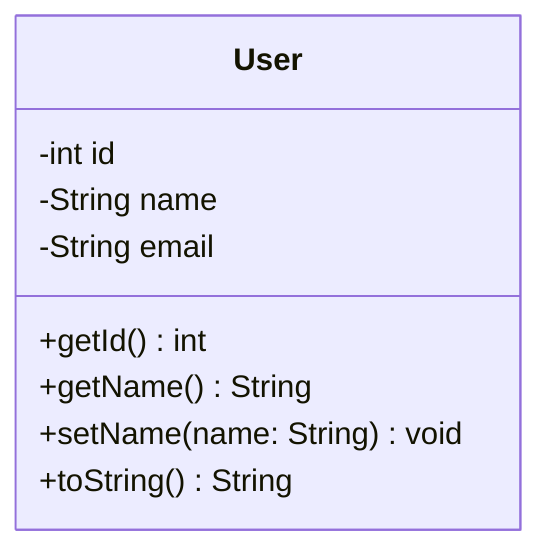

### Mermaid: Abstract Class and Interface

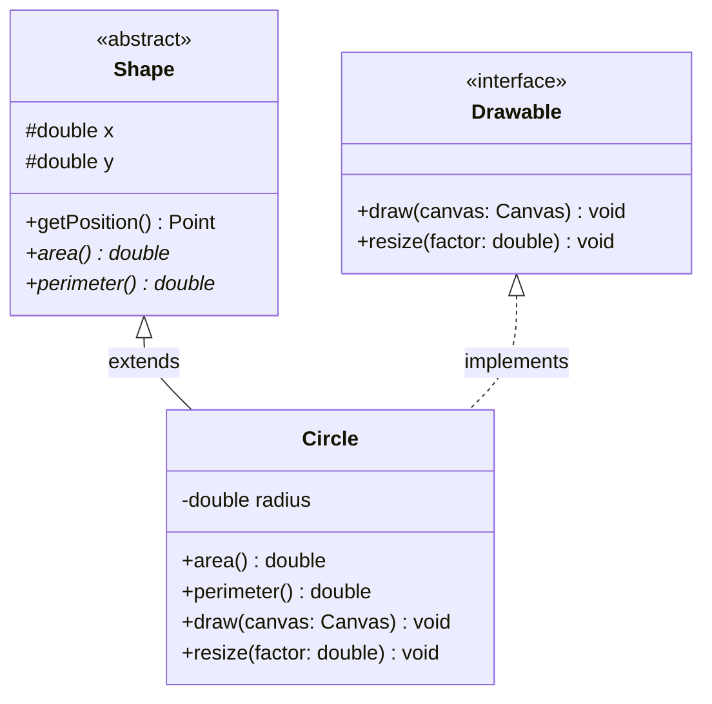

---

## 2. Relationships

Relationships are the backbone of class diagrams. Each type conveys a different strength of coupling between classes.

### Relationship Summary Table

| Relationship | Arrow | Strength | Meaning | Lifetime Coupling |
|-------------|-------|----------|---------|-------------------|
| Dependency | `..>` dashed arrow | Weakest | "uses temporarily" | None |
| Association | `-->` solid arrow | Weak | "uses" / "knows about" | Independent |
| Aggregation | `o--` hollow diamond | Medium | "has-a" (shared) | Parts outlive whole |
| Composition | `*--` filled diamond | Strong | "owns" (exclusive) | Parts die with whole |
| Inheritance | `<\|--` hollow triangle | Strongest | "is-a" | Permanent |
| Realization | `<\|..` dashed triangle | Strongest | "implements" | Permanent |

### Dependency ("depends on")

The weakest relationship. Class A uses class B temporarily, typically as a method parameter, local variable, or return type. A change in B may affect A.

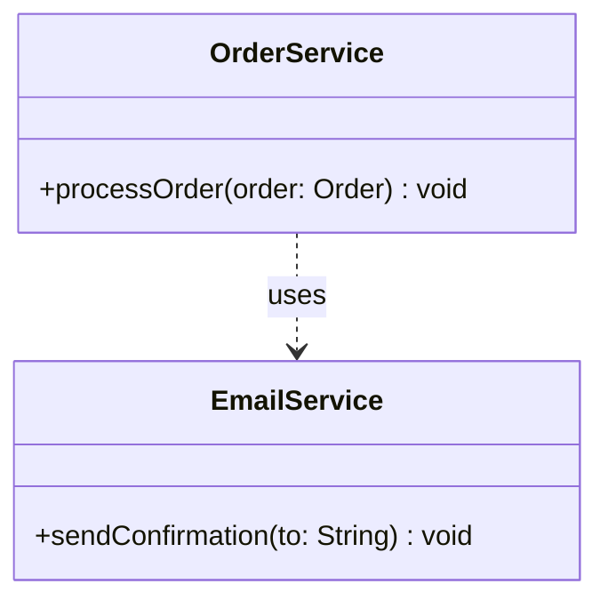

**Example:** `OrderService` calls `EmailService.sendConfirmation()` but does not store a reference to it.

### Association ("uses" / "knows about")

A structural relationship where one class holds a reference to another. Both objects have independent lifecycles.

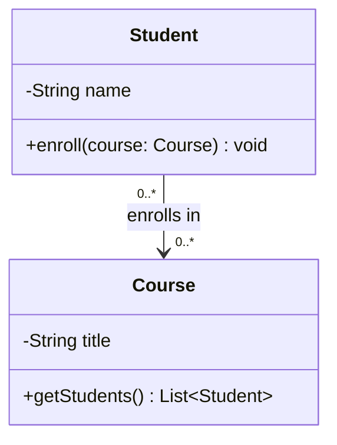

**Example:** A `Student` enrolls in many `Courses`, and a `Course` has many `Students`. Deleting a student does not delete the course.

### Aggregation ("has-a", shared ownership)

A special form of association. The whole contains parts, but the parts can exist independently. Represented by a hollow diamond on the "whole" side.

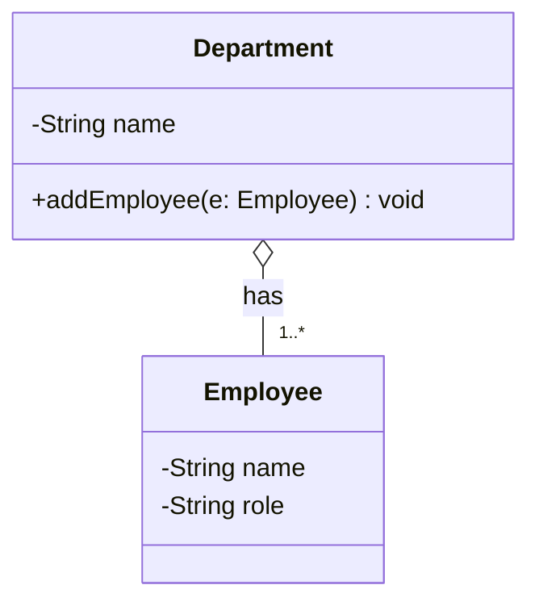

**Example:** A `Department` has `Employees`, but if the department is dissolved, the employees still exist (they can be reassigned).

### Composition ("owns", exclusive ownership)

The strongest form of association. The whole exclusively owns its parts. When the whole is destroyed, all parts are destroyed too. Represented by a filled diamond.

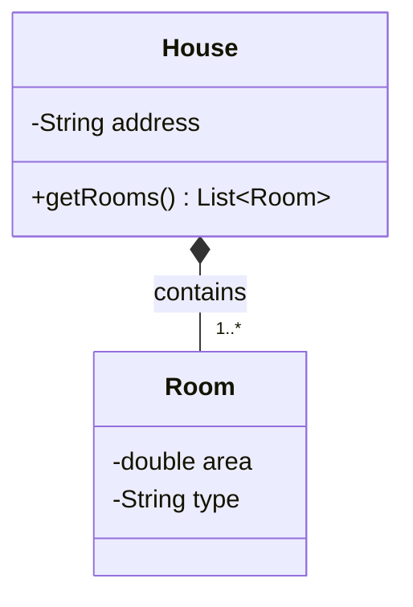

**Example:** A `House` contains `Rooms`. Destroying the house destroys its rooms -- a room cannot exist without its house.

### Inheritance ("is-a")

A generalization relationship. The subclass inherits all attributes and methods from the superclass and can add or override behavior.

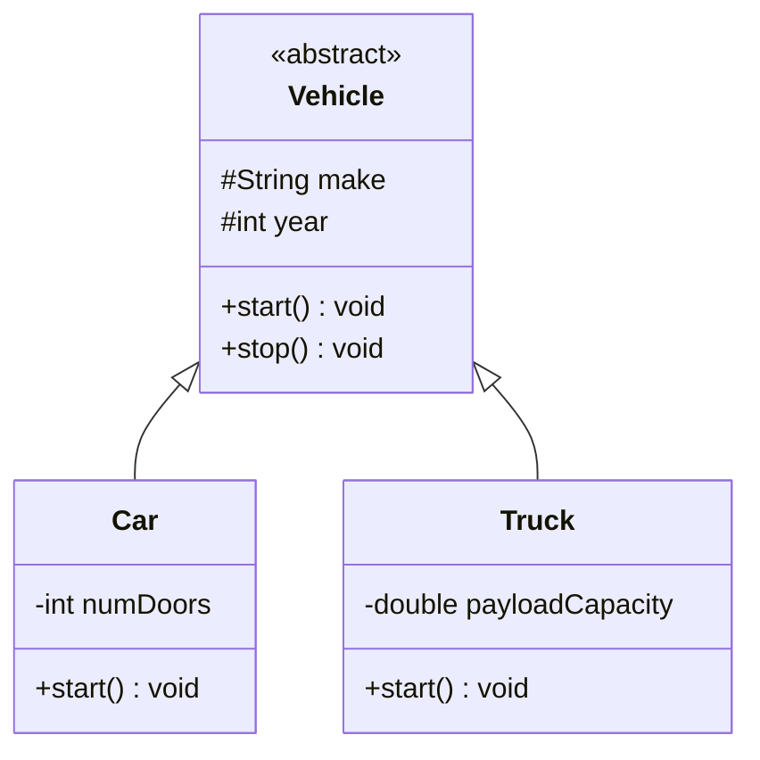

### Realization / Implementation ("implements")

A class provides a concrete implementation of an interface. Drawn with a dashed line and hollow triangle.

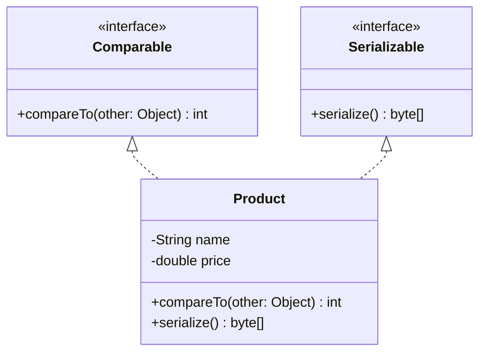

### Multiplicity Notation

Multiplicity labels on relationship lines indicate how many instances participate.

| Notation | Meaning |
|----------|---------|
| `1` | Exactly one |
| `0..1` | Zero or one (optional) |
| `*` or `0..*` | Zero or more |
| `1..*` | One or more |
| `3..5` | Specific range |

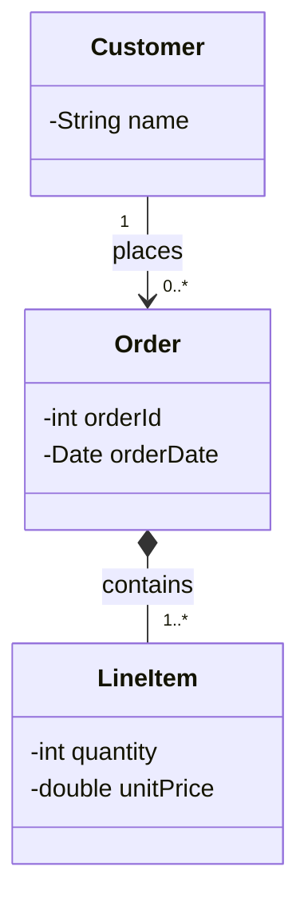

---

## 3. Sequence Diagrams

Sequence diagrams show how objects interact over time. They are essential for illustrating flows like "user places an order" or "borrower checks out a book."

### Core Elements

| Element | Description | Notation |
|---------|-------------|----------|
| **Actor** | External entity (user, system) | Stick figure or labeled box |
| **Lifeline** | Vertical dashed line extending from an object | Represents the object's existence over time |
| **Activation bar** | Thin rectangle on a lifeline | Period when the object is actively processing |
| **Synchronous message** | Solid arrow with filled head (`->>`) | Caller waits for response |
| **Asynchronous message** | Solid arrow with open head (`-)`) | Caller does not wait |
| **Return message** | Dashed arrow (`-->>`) | Response back to caller |
| **Self-message** | Arrow looping back to same lifeline | Object calls its own method |

### Basic Sequence Diagram

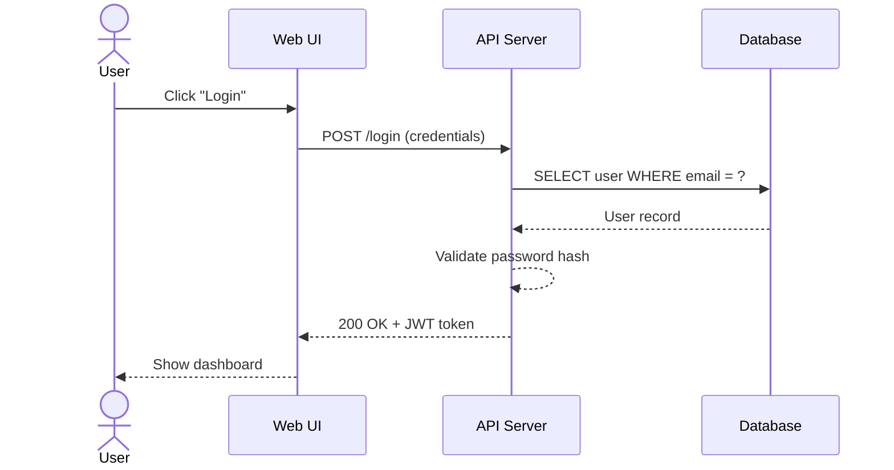

### Fragments: Loops, Conditionals, Optional

Fragments model control flow within sequence diagrams.

**alt / else** -- conditional branching (like if/else):

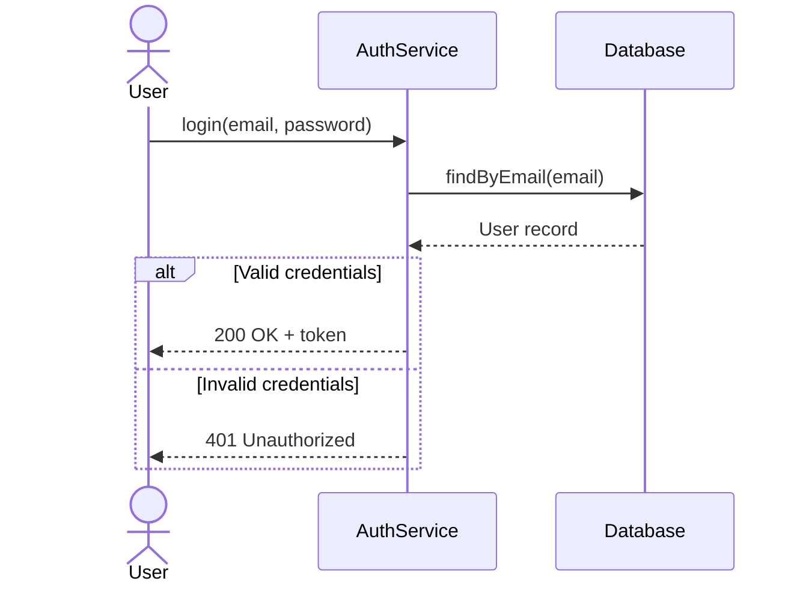

**opt** -- optional block (executes if condition is true):

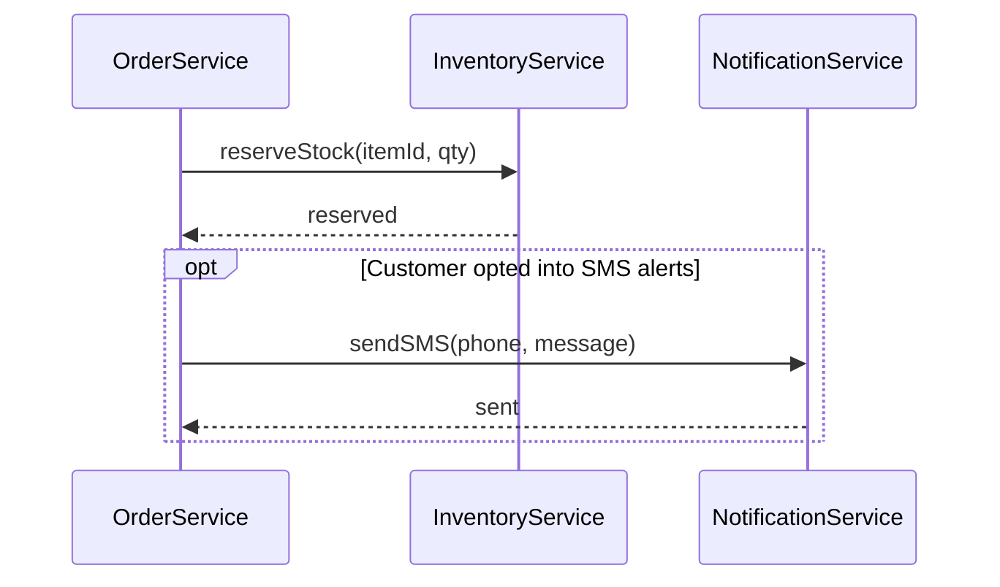

**loop** -- repeated execution:

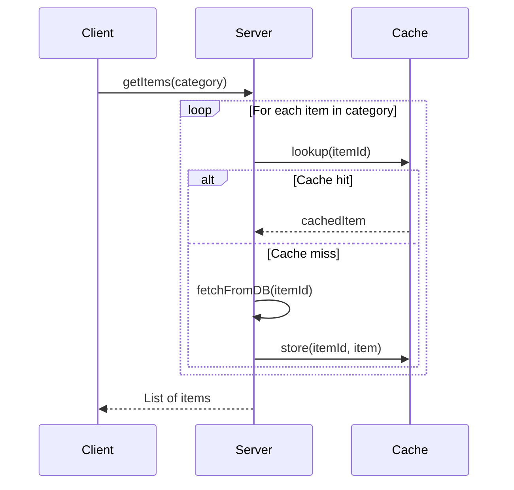

---

## 4. Complete Example: Library Management System

Putting it all together with a realistic interview-style example.

### Class Diagram

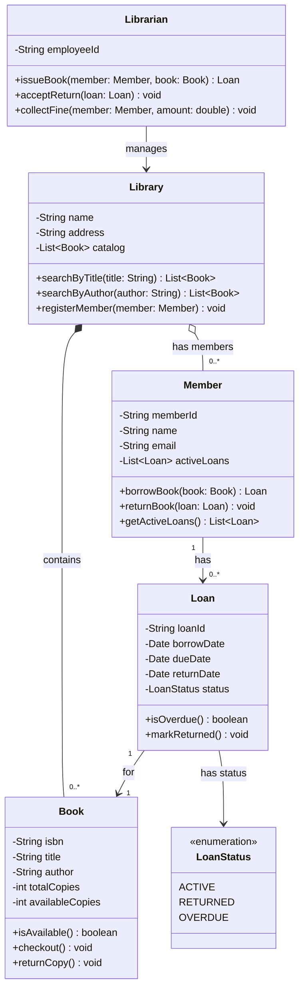

### Sequence Diagram: Borrow Book Flow

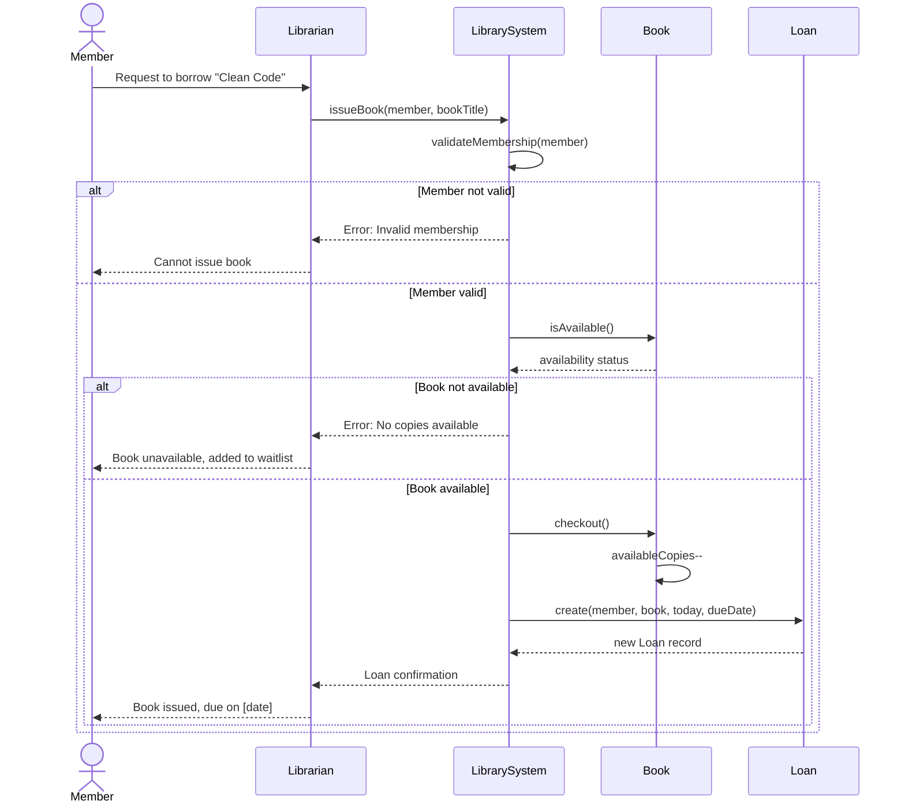

---

## 5. Interview Tips

### Drawing on a Whiteboard

1. **Start with nouns** -- identify the key entities from the problem statement. Each noun is a potential class (e.g., "Library", "Book", "Member", "Loan").
2. **Draw relationships first** -- sketch boxes with just class names and connect them with lines. This shows you understand the domain before diving into details.
3. **Add attributes second** -- write the most important 3-5 fields per class. Skip obvious getters/setters.
4. **Add methods as you discuss use cases** -- when the interviewer asks "how does a member borrow a book?", add `borrowBook()` to the `Member` class and walk through the sequence.
5. **Label multiplicity** -- always annotate `1`, `*`, `0..1` on relationship lines. This shows you think about edge cases.

### Common Mistakes to Avoid

| Mistake | Why It Matters |
|---------|---------------|
| Using inheritance when composition fits better | Leads to rigid hierarchies; interviewers look for this |
| Missing multiplicity labels | Shows incomplete thinking about the domain |
| Putting every method in one "God class" | Violates Single Responsibility; spread behavior across classes |
| Confusing aggregation and composition | Know the lifecycle difference -- interviewers will probe this |
| Drawing sequence diagrams without return arrows | Incomplete communication flow; always show responses |

### Aggregation vs. Composition Decision Guide

Ask yourself: **"If I delete the parent, should the children be deleted too?"**

- **Yes** --> Composition (filled diamond). Example: `Order *-- LineItem`
- **No** --> Aggregation (hollow diamond). Example: `Team o-- Player`

---

## Common Interview Questions

**Q1: What is the difference between aggregation and composition?**
Both represent "has-a" relationships. **Aggregation** (hollow diamond) is shared ownership -- the child can exist independently of the parent (e.g., a `Department` has `Employees`, but employees survive if the department is dissolved). **Composition** (filled diamond) is exclusive ownership -- the child's lifecycle is bound to the parent (e.g., a `House` has `Rooms`, and rooms are destroyed when the house is demolished).

**Q2: When would you use an association instead of a dependency?**
Use **association** when one class holds a persistent reference to another (a field/member variable). Use **dependency** when the usage is transient -- the other class appears only as a method parameter, local variable, or return type. Association implies a structural relationship; dependency implies only a temporary usage.

**Q3: How do you decide what goes into a class diagram during an interview?**
Start with the core entities (nouns from the problem). Draw 4-6 key classes with their relationships first. Add 3-5 essential attributes per class and the methods that directly support the use cases the interviewer asks about. Avoid modeling utility classes, exceptions, or framework details unless specifically asked.

**Q4: How do you represent an interface vs. an abstract class in UML?**
An **interface** is labeled with the `<<interface>>` stereotype and has no concrete method implementations. Classes connect to it with a dashed line and hollow triangle (realization). An **abstract class** has its name in *italics* (or labeled `<<abstract>>`), can contain both abstract and concrete methods, and subclasses connect with a solid line and hollow triangle (inheritance).

**Q5: What does multiplicity "0..*" vs "1..*" convey in a design?**
`0..*` means the relationship is optional -- there can be zero or more associated objects (e.g., a new `Customer` may have zero `Orders`). `1..*` means at least one is required (e.g., an `Order` must have at least one `LineItem`). This distinction communicates validation constraints and affects your code's null-checking and error-handling logic.

**Q6: When should you draw a sequence diagram vs. a class diagram in an interview?**
Draw a **class diagram** when the question is about system structure -- "Design a parking lot" or "Model an e-commerce system." Draw a **sequence diagram** when the question is about behavior or flow -- "Walk me through what happens when a user places an order." In practice, start with the class diagram to establish entities, then use sequence diagrams to illustrate specific use cases the interviewer wants to explore.
