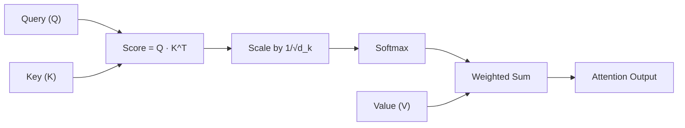
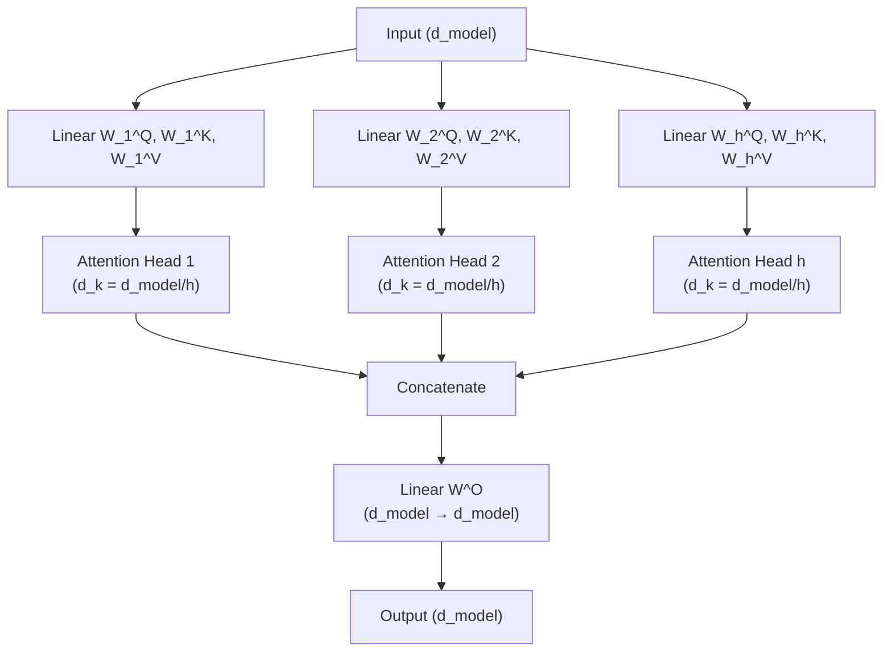
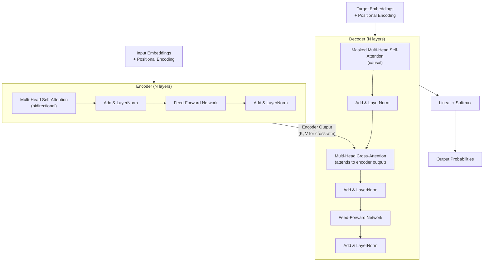
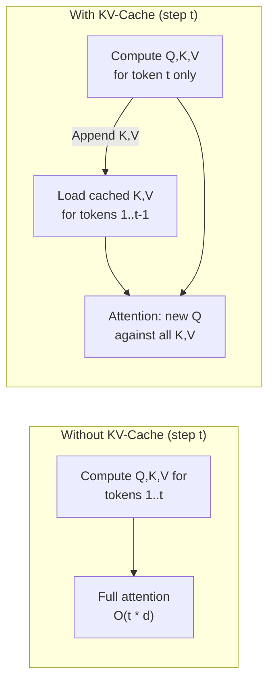
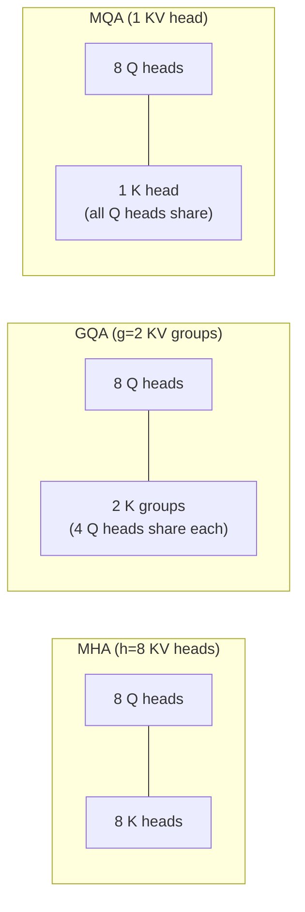

# Transformers & Attention

The architecture behind modern AI — self-attention, multi-head attention, positional encoding, and the key variants powering every major language model today.

---

## The Big Picture

**What are Transformers, in plain English?**

Transformers are the neural network architecture behind essentially every modern AI system: GPT-4, Claude, Gemini, LLaMA, DALL-E, Whisper, AlphaFold. The key insight was **attention** — a mechanism that lets every position in a sequence look at every other position simultaneously to understand context.

**Real-world analogy for attention:** Read this sentence: *"The trophy didn't fit in the suitcase because it was too big."*

What does "it" refer to? The trophy. You know this because your brain automatically looked at "trophy," "suitcase," "too big" and worked out the relationship. You didn't read left-to-right linearly — you attended to the relevant words.

Transformers do this mathematically. The attention mechanism lets each word ask "which other words in this sentence are relevant to understanding me?" and computes a weighted average over those relevant words' representations.

**Why Transformers won over RNNs (what came before):**
- **Parallelism:** RNNs process sequences left-to-right, one step at a time — can't be parallelized. Transformers process all positions simultaneously on GPUs — dramatically faster training.
- **Long-range dependencies:** RNNs struggle to connect words far apart in a sentence. Transformers connect any two positions in a single step, regardless of distance.
- **Scalability:** Transformers got dramatically better as they got bigger. "Scaling laws" showed that doubling parameters reliably improved performance.

**The timeline that matters:**
- 2017: "Attention Is All You Need" paper — Transformer architecture introduced for translation
- 2018: BERT — bidirectional Transformer, pre-training + fine-tuning paradigm
- 2018: GPT — unidirectional Transformer, next-token prediction pre-training
- 2020: GPT-3 (175B parameters) — few-shot learning emergences
- 2022: ChatGPT — RLHF fine-tuning makes models conversational
- 2023-2024: GPT-4, Claude 3, Gemini — multimodal, extended context, stronger reasoning

---

## Attention Mechanism

### Intuition

Attention lets a model dynamically focus on the most relevant parts of the input when producing each element of the output. Instead of compressing an entire sequence into a single fixed-size vector (the bottleneck in RNN encoder-decoder models), attention computes a **weighted sum of values**, where the weights are determined by how well each key matches the query.

Think of it like a database lookup: you have a **query** (what you are looking for), a set of **keys** (what is available), and corresponding **values** (the actual content). The output is a soft retrieval — a blend of all values weighted by query-key similarity.

> **Concrete example:** Processing the word "bank" in "The river bank was muddy."
> - The model computes a query for "bank": "what context should I look for?"
> - It compares against keys for all other words: "river", "was", "muddy"
> - "river" has high similarity (key matches query) → high attention weight
> - "was" has low similarity → low attention weight
> - The output for "bank" is a weighted blend of all value vectors, dominated by "river"
> - Result: "bank" gets a representation that correctly captures the geographical meaning, not the financial one
>
> **The Q/K/V terminology:** Each word gets projected into three different vectors — Query (what am I looking for?), Key (what do I offer to others?), Value (what information do I actually contain?). The output is: `softmax(Q · K^T / √d) · V`.

### Scaled Dot-Product Attention

The core equation from "Attention Is All You Need" (Vaswani et al., 2017):



### Scaled Dot-Product Attention

The core equation from "Attention Is All You Need" (Vaswani et al., 2017):

$$\text{Attention}(Q, K, V) = \text{softmax}\left(\frac{Q K^T}{\sqrt{d_k}}\right) V$$

Where:
- **Q** (queries): matrix of shape $(seq\_len\_q, d_k)$
- **K** (keys): matrix of shape $(seq\_len\_k, d_k)$
- **V** (values): matrix of shape $(seq\_len\_k, d_v)$
- $d_k$: dimension of keys (and queries)

Step-by-step computation:

| Step | Operation | Shape | Purpose |
|------|-----------|-------|---------|
| 1 | $QK^T$ | $(seq_q, seq_k)$ | Compute raw similarity scores between every query and every key |
| 2 | $/ \sqrt{d_k}$ | $(seq_q, seq_k)$ | Scale to prevent large magnitudes |
| 3 | $+ \text{mask}$ (optional) | $(seq_q, seq_k)$ | Apply causal or padding mask |
| 4 | $\text{softmax}(\cdots)$ | $(seq_q, seq_k)$ | Normalize scores to probabilities (rows sum to 1) |
| 5 | $\cdots \times V$ | $(seq_q, d_v)$ | Weighted sum of value vectors |

```python
import torch
import torch.nn.functional as F
import math

def scaled_dot_product_attention(Q, K, V, mask=None):
    """
    Args:
        Q: (batch, heads, seq_q, d_k)
        K: (batch, heads, seq_k, d_k)
        V: (batch, heads, seq_k, d_v)
        mask: (batch, 1, seq_q, seq_k) or broadcastable
    Returns:
        output: (batch, heads, seq_q, d_v)
        attention_weights: (batch, heads, seq_q, seq_k)
    """
    d_k = Q.size(-1)

    # Step 1-2: Compute scaled scores
    scores = torch.matmul(Q, K.transpose(-2, -1)) / math.sqrt(d_k)

    # Step 3: Apply mask (set masked positions to -inf so softmax gives 0)
    if mask is not None:
        scores = scores.masked_fill(mask == 0, float('-inf'))

    # Step 4: Softmax over key dimension
    attention_weights = F.softmax(scores, dim=-1)

    # Step 5: Weighted sum of values
    output = torch.matmul(attention_weights, V)

    return output, attention_weights
```

### Why Scaling by sqrt(d_k)?

When $d_k$ is large, the dot products $QK^T$ grow in magnitude (the variance of the dot product of two random vectors scales with their dimension). Large magnitudes push softmax into regions with **extremely small gradients** (saturation), making training unstable. Dividing by $\sqrt{d_k}$ keeps the variance of the scores at approximately 1 regardless of dimension.

Numerically: if q and k have components drawn from $\mathcal{N}(0, 1)$, then $q \cdot k = \sum q_i k_i$ has mean 0 and variance $d_k$. Dividing by $\sqrt{d_k}$ restores unit variance.

### Attention Masks

| Mask Type | Purpose | Where Used |
|-----------|---------|------------|
| **Causal mask** | Prevent attending to future tokens (upper triangle = -inf) | Decoder (GPT, LLaMA), autoregressive generation |
| **Padding mask** | Ignore padding tokens in variable-length batches | Both encoder and decoder |
| **Cross-attention mask** | Control which encoder positions the decoder can attend to | Encoder-decoder models |

```python
def create_causal_mask(seq_len):
    """Lower-triangular mask: position i can attend to positions 0..i"""
    return torch.tril(torch.ones(seq_len, seq_len)).unsqueeze(0).unsqueeze(0)

# Example for seq_len=4:
# [[1, 0, 0, 0],
#  [1, 1, 0, 0],
#  [1, 1, 1, 0],
#  [1, 1, 1, 1]]
```

---

## Multi-Head Attention

Instead of performing a single attention function with full-dimensional Q, K, V, we project them into **h different subspaces**, run attention in parallel, concatenate, and project back.

> **Plain English:** Single-head attention can only focus on one type of relationship at a time. Multi-head attention runs multiple attention mechanisms in parallel — each "head" learns to look for a different type of relationship. One head might learn to track subject-verb agreement, another might track co-reference ("it" → "trophy"), another might track positional relationships. The outputs are all concatenated at the end. In practice, GPT-3 uses 96 heads; LLaMA-3 8B uses 32 heads.

$$\text{MultiHead}(Q, K, V) = \text{Concat}(head_1, \ldots, head_h) \cdot W^O$$

$$\text{where } head_i = \text{Attention}(Q W_i^Q, K W_i^K, V W_i^V)$$



### Why Multiple Heads?

Each head can learn to attend to **different types of relationships**:
- Head 1 might learn syntactic dependencies (subject-verb)
- Head 2 might track coreference (pronoun-antecedent)
- Head 3 might capture positional proximity

This is analogous to multiple filters in a CNN — each captures a different feature.

### Dimension Arithmetic

| Parameter | Value | Example (BERT-base) |
|-----------|-------|---------------------|
| $d_{model}$ | Model dimension | 768 |
| $h$ | Number of heads | 12 |
| $d_k = d_v = d_{model} / h$ | Per-head dimension | 64 |
| Parameters per MHA layer | $4 \cdot d_{model}^2$ (Q, K, V, O projections) | $4 \times 768^2 = 2.36M$ |

The total computation is the same as single-head attention with full dimension, but the model gains the ability to attend in multiple subspaces simultaneously.

```python
import torch.nn as nn

class MultiHeadAttention(nn.Module):
    def __init__(self, d_model, num_heads):
        super().__init__()
        assert d_model % num_heads == 0
        self.d_model = d_model
        self.num_heads = num_heads
        self.d_k = d_model // num_heads

        self.W_q = nn.Linear(d_model, d_model)
        self.W_k = nn.Linear(d_model, d_model)
        self.W_v = nn.Linear(d_model, d_model)
        self.W_o = nn.Linear(d_model, d_model)

    def forward(self, Q, K, V, mask=None):
        batch_size = Q.size(0)

        # Project and reshape: (batch, seq, d_model) -> (batch, heads, seq, d_k)
        Q = self.W_q(Q).view(batch_size, -1, self.num_heads, self.d_k).transpose(1, 2)
        K = self.W_k(K).view(batch_size, -1, self.num_heads, self.d_k).transpose(1, 2)
        V = self.W_v(V).view(batch_size, -1, self.num_heads, self.d_k).transpose(1, 2)

        # Scaled dot-product attention
        attn_output, attn_weights = scaled_dot_product_attention(Q, K, V, mask)

        # Concatenate heads: (batch, heads, seq, d_k) -> (batch, seq, d_model)
        attn_output = attn_output.transpose(1, 2).contiguous().view(
            batch_size, -1, self.d_model
        )

        # Final linear projection
        return self.W_o(attn_output)
```

---

## Transformer Architecture

### High-Level Architecture (Original)



### Architecture Variants

| Variant | Attention Type | Use Case | Examples |
|---------|---------------|----------|----------|
| **Encoder-only** | Bidirectional self-attention | Understanding, classification, embeddings | BERT, RoBERTa, DeBERTa |
| **Decoder-only** | Causal (masked) self-attention | Text generation, general-purpose LLMs | GPT, LLaMA, Claude, Mistral |
| **Encoder-Decoder** | Bidirectional encoder + causal decoder with cross-attention | Sequence-to-sequence (translation, summarization) | T5, BART, Flan-T5 |

**Why decoder-only dominates today:** Decoder-only models are simpler to scale, naturally support in-context learning, and next-token prediction provides a universal training objective. With sufficient scale, they match or exceed encoder-decoder models even on tasks like classification and translation.

### Layer Components in Detail

#### 1. Residual Connections

Every sub-layer (attention, FFN) has a skip connection:

$$\text{output} = \text{sublayer}(x) + x$$

This enables gradient flow through deep networks (same principle as ResNet). Without residuals, transformers deeper than a few layers fail to train.

#### 2. Layer Normalization

Normalizes across the feature dimension (not the batch dimension like BatchNorm):

$$\text{LayerNorm}(x) = \gamma \cdot \frac{x - \mu}{\sqrt{\sigma^2 + \epsilon}} + \beta$$

**Pre-norm vs Post-norm:**

| Style | Formula | Used By | Tradeoffs |
|-------|---------|---------|-----------|
| **Post-norm** (original) | $\text{LayerNorm}(x + \text{sublayer}(x))$ | Original Transformer, BERT | Harder to train deep models; needs warmup |
| **Pre-norm** (modern) | $x + \text{sublayer}(\text{LayerNorm}(x))$ | GPT-2+, LLaMA, most modern LLMs | More stable training; may slightly underperform post-norm with careful tuning |

Pre-norm is almost universally adopted in modern LLMs because it stabilizes training without needing careful learning rate warmup.

#### 3. Feed-Forward Network (MLP)

A two-layer MLP applied position-wise (same weights for every token position):

$$FFN(x) = \text{activation}(x W_1 + b_1) W_2 + b_2$$

| Activation | Formula | Used By |
|------------|---------|---------|
| ReLU | $\max(0, x)$ | Original Transformer |
| GELU | $x \cdot \Phi(x)$ (Gaussian CDF) | BERT, GPT-2, GPT-3 |
| SwiGLU | $\text{Swish}(xW_1) \cdot (xW_3)$ (gated) | LLaMA, Mistral, PaLM |

**SwiGLU** (used in most modern LLMs) introduces a gating mechanism with a third weight matrix, which improves performance at the cost of slightly more parameters. The inner dimension is typically $4 \cdot d_{model}$ (or $\frac{8}{3} \cdot d_{model}$ for SwiGLU to keep parameter count comparable).

```python
class SwiGLU(nn.Module):
    def __init__(self, d_model, d_ff):
        super().__init__()
        self.w1 = nn.Linear(d_model, d_ff, bias=False)
        self.w2 = nn.Linear(d_ff, d_model, bias=False)
        self.w3 = nn.Linear(d_model, d_ff, bias=False)

    def forward(self, x):
        return self.w2(F.silu(self.w1(x)) * self.w3(x))
```

#### Complete Transformer Block (Modern Pre-norm Decoder Style)

```python
class TransformerBlock(nn.Module):
    def __init__(self, d_model, num_heads, d_ff):
        super().__init__()
        self.attn_norm = nn.RMSNorm(d_model)   # RMSNorm preferred in modern LLMs
        self.attn = MultiHeadAttention(d_model, num_heads)
        self.ffn_norm = nn.RMSNorm(d_model)
        self.ffn = SwiGLU(d_model, d_ff)

    def forward(self, x, mask=None):
        # Pre-norm self-attention with residual
        h = self.attn_norm(x)
        x = x + self.attn(h, h, h, mask)

        # Pre-norm FFN with residual
        h = self.ffn_norm(x)
        x = x + self.ffn(h)

        return x
```

---

## Positional Encoding

Transformers process all tokens in parallel with no inherent notion of order. Positional encoding injects sequence position information so the model can distinguish "the cat sat on the mat" from "the mat sat on the cat."

### Sinusoidal (Original Transformer)

Fixed, non-learnable encodings using sine and cosine functions of different frequencies:

$$PE_{(pos, 2i)} = \sin\left(\frac{pos}{10000^{2i/d_{model}}}\right)$$

$$PE_{(pos, 2i+1)} = \cos\left(\frac{pos}{10000^{2i/d_{model}}}\right)$$

Each dimension corresponds to a sinusoid with a different wavelength, ranging from $2\pi$ to $10000 \cdot 2\pi$. This allows the model to learn to attend by relative positions because $PE(pos + k)$ can be expressed as a linear function of $PE(pos)$.

```python
def sinusoidal_positional_encoding(max_len, d_model):
    pe = torch.zeros(max_len, d_model)
    position = torch.arange(0, max_len).unsqueeze(1).float()
    div_term = torch.exp(
        torch.arange(0, d_model, 2).float() * -(math.log(10000.0) / d_model)
    )
    pe[:, 0::2] = torch.sin(position * div_term)
    pe[:, 1::2] = torch.cos(position * div_term)
    return pe  # (max_len, d_model)
```

### Learned Positional Embeddings

A simple trainable embedding table — one vector per position:

```python
self.position_embedding = nn.Embedding(max_seq_len, d_model)
# Usage: x = token_embedding + self.position_embedding(position_ids)
```

Used by BERT, GPT-2. Simple and effective but **cannot generalize to positions beyond what was seen during training** (e.g., trained on 512 tokens, cannot handle 1024).

### RoPE (Rotary Position Embeddings)

Used by LLaMA, Mistral, Qwen, and most modern open-source LLMs. The key insight: encode **relative** position by rotating query and key vectors in 2D subspaces.

For each pair of dimensions $(2i, 2i+1)$, apply a rotation by angle $\theta = pos \cdot base^{-2i/d}$:

$$\begin{bmatrix} q'_{2i} \\ q'_{2i+1} \end{bmatrix} = \begin{bmatrix} \cos(m\theta_i) & -\sin(m\theta_i) \\ \sin(m\theta_i) & \cos(m\theta_i) \end{bmatrix} \begin{bmatrix} q_{2i} \\ q_{2i+1} \end{bmatrix}$$

Where $m$ is the position index and $\theta_i = 10000^{-2i/d}$.

**Why it works:** When computing $q_m \cdot k_n$, the rotation angles partially cancel, leaving the dot product as a function of $(m - n)$ — the **relative** distance. This gives relative position sensitivity without explicit relative position biases.

```python
def precompute_rope_freqs(dim, max_seq_len, base=10000.0):
    freqs = 1.0 / (base ** (torch.arange(0, dim, 2).float() / dim))
    t = torch.arange(max_seq_len)
    freqs = torch.outer(t, freqs)  # (seq_len, dim/2)
    return torch.polar(torch.ones_like(freqs), freqs)  # complex64

def apply_rope(x, freqs_complex):
    """x: (batch, heads, seq_len, d_head)"""
    # Reshape pairs of dims as complex numbers
    x_complex = torch.view_as_complex(x.float().reshape(*x.shape[:-1], -1, 2))
    # Multiply by rotation (element-wise complex multiplication)
    x_rotated = x_complex * freqs_complex.unsqueeze(0).unsqueeze(0)
    return torch.view_as_real(x_rotated).reshape(*x.shape)
```

**RoPE length extension:** To handle sequences longer than training length, techniques like YaRN and NTK-aware scaling adjust the rotation frequencies, enabling models trained on 4K tokens to handle 128K+ at inference.

### ALiBi (Attention with Linear Biases)

Instead of adding positional information to embeddings, ALiBi adds a **linear penalty** directly to attention scores based on distance:

$$\text{score}(i, j) = q_i \cdot k_j - m \cdot |i - j|$$

Where $m$ is a head-specific slope (fixed, not learned). Closer tokens get higher scores; distant tokens are penalized linearly.

| Property | Sinusoidal | Learned | RoPE | ALiBi |
|----------|-----------|---------|------|-------|
| Type | Absolute, fixed | Absolute, learned | Relative, fixed | Relative, fixed |
| Added to | Embeddings | Embeddings | Q and K only | Attention scores |
| Length generalization | Moderate | Poor | Good (with extension) | Excellent |
| Parameters | 0 | $max\_len \times d$ | 0 | 0 |
| Used by | Original Transformer | BERT, GPT-2 | LLaMA, Mistral, Qwen | MPT, BLOOM |

---

## Efficiency Improvements

Standard self-attention is $O(n^2)$ in both time and memory with respect to sequence length. This section covers the major techniques to reduce that cost.

### KV-Cache

During autoregressive generation, each new token attends to all previous tokens. Without caching, we recompute K and V for the entire prefix at every step. With **KV-cache**, we store the K and V tensors and only compute the new token's Q, K, V, then append K and V to the cache.



| Metric | Without Cache | With Cache |
|--------|--------------|------------|
| Compute per step | $O(t \cdot d)$ for all tokens | $O(d)$ for new token only (attention still $O(t)$) |
| Total for n tokens | $O(n^2 \cdot d)$ | $O(n \cdot d)$ for projections, $O(n^2)$ for attention scores |
| Memory | Recompute | Stores $2 \cdot n_{layers} \cdot n \cdot d_{model}$ floats |

**KV-cache memory is often the bottleneck** for long-context inference. For a 70B-parameter model with 80 layers, 128K context, and 8192 hidden dim (GQA with 8 KV heads, $d_{head}=128$): cache size $= 2 \times 80 \times 128K \times 8 \times 128 \times 2$ bytes (FP16) $\approx$ 32 GB per request.

### Flash Attention

Standard attention materializes the full $(n, n)$ attention matrix in GPU HBM (high-bandwidth memory), which is slow and memory-hungry. **Flash Attention** (Dao et al., 2022) computes exact attention without materializing the full matrix by using **tiling** and keeping intermediate results in fast GPU SRAM.

Key ideas:
1. **Tile** the Q, K, V matrices into blocks that fit in SRAM
2. Compute attention **block by block**, accumulating the output using the **online softmax trick** (numerically stable running softmax)
3. Never write the full $n \times n$ attention matrix to HBM

| Property | Standard Attention | Flash Attention |
|----------|--------------------|-----------------|
| Memory | $O(n^2)$ | $O(n)$ — no materialized attention matrix |
| IO complexity | $O(n^2 \cdot d)$ HBM reads/writes | $O(n^2 \cdot d^2 / \text{SRAM\_size})$ — much fewer |
| Exactness | Exact | Exact (not an approximation!) |
| Wall-clock speed | Baseline | 2-4x faster for long sequences |

```python
# In practice, use PyTorch's built-in implementation:
from torch.nn.functional import scaled_dot_product_attention

# Automatically uses Flash Attention when available (PyTorch 2.0+)
output = scaled_dot_product_attention(Q, K, V, attn_mask=mask, is_causal=True)
```

Flash Attention 2 further improves parallelism across the sequence dimension and reduces non-matmul FLOPs. Flash Attention 3 adds FP8 support and further optimizations for Hopper GPUs.

### Multi-Query Attention (MQA)

In standard MHA, each head has its own Q, K, and V projections. **MQA** shares a single K and V projection across all heads while keeping separate Q projections:

- **Standard MHA:** $h$ heads, each with own $Q_i, K_i, V_i$
- **MQA:** $h$ heads, each with own $Q_i$, but shared $K, V$

| Metric | MHA | MQA |
|--------|-----|-----|
| KV-cache size | $2 \cdot h \cdot d_k \cdot n$ | $2 \cdot d_k \cdot n$ ($h$ times smaller) |
| KV projection params | $2 \cdot h \cdot d_k \cdot d_{model}$ | $2 \cdot d_k \cdot d_{model}$ |
| Quality | Baseline | Slight degradation |
| Used by | BERT, GPT-3 | PaLM, Falcon |

### Grouped-Query Attention (GQA)

A middle ground between MHA and MQA. Instead of 1 KV head (MQA) or $h$ KV heads (MHA), use $g$ KV groups where each group serves $h/g$ query heads:



| Model | Architecture | Query Heads | KV Heads | KV Cache Reduction |
|-------|-------------|-------------|----------|---------------------|
| GPT-3 | MHA | 96 | 96 | 1x (baseline) |
| LLaMA 2 70B | GQA | 64 | 8 | 8x |
| Mistral 7B | GQA | 32 | 8 | 4x |
| PaLM | MQA | 16 | 1 | 16x |

GQA is the dominant approach in modern LLMs — it provides nearly all the memory savings of MQA with minimal quality loss compared to MHA.

### Sparse Attention

Instead of every token attending to every other token ($O(n^2)$), restrict the attention pattern:

| Pattern | Description | Complexity | Model |
|---------|-------------|------------|-------|
| **Local/sliding window** | Each token attends only to $w$ neighbors | $O(n \cdot w)$ | Mistral (window=4096) |
| **Global + local** | Some tokens attend globally, rest locally | $O(n \cdot (w + g))$ | Longformer, BigBird |
| **Dilated** | Attend to every $k$-th token at increasing strides | $O(n \cdot w)$ | Sparse Transformer |
| **Block sparse** | Fixed block patterns | $O(n \cdot b)$ | BigBird |

Mistral uses a **sliding window attention** combined with GQA — each layer attends to a fixed window, but because information propagates through layers, the effective receptive field grows: layer $L$ can indirectly access tokens up to $L \times w$ positions back.

### Linear Attention and Alternatives

Approaches that bypass the quadratic attention bottleneck entirely:

| Method | Core Idea | Complexity | Trade-off |
|--------|-----------|------------|-----------|
| **Linear attention** | Replace $\text{softmax}(QK^T)V$ with $\phi(Q)(\phi(K)^T V)$ using kernel trick | $O(n \cdot d^2)$ | Approximation; lower quality on long-range tasks |
| **Mamba (S4/SSM)** | Structured state space model; recurrent with selective gating | $O(n \cdot d)$ | Not a transformer; competitive quality at scale |
| **RWKV** | RNN-style linear attention with time-mixing | $O(n \cdot d)$ | Can be trained like a transformer, runs like an RNN |
| **RetNet** | Retention mechanism (combines recurrence + parallel training) | $O(n \cdot d)$ | Dual form: parallel for training, recurrent for inference |

These are active research areas. As of early 2026, transformer attention with efficiency improvements (Flash Attention + GQA + KV-cache) remains dominant for frontier models, while SSMs like Mamba show promise for specific use cases and hybrid architectures (e.g., Jamba = Mamba + Transformer layers).

---

## Key Model Families

| Family | Architecture | Attention | Pre-training Objective | Strengths | Examples |
|--------|-------------|-----------|----------------------|-----------|----------|
| **Encoder-only** | Bidirectional self-attention | Full attention (no mask) | Masked Language Modeling (MLM) — predict randomly masked tokens | Understanding, classification, NER, sentence embeddings | BERT, RoBERTa, DeBERTa, ELECTRA |
| **Decoder-only** | Causal self-attention | Causal mask (lower triangular) | Next Token Prediction (NTP) — predict each token from left context | Text generation, in-context learning, general-purpose | GPT-4, Claude, LLaMA, Mistral, Gemini |
| **Encoder-Decoder** | Bidirectional encoder + causal decoder with cross-attention | Encoder: full; Decoder: causal + cross | Span corruption / denoising — mask and reconstruct spans | Translation, summarization, structured generation | T5, BART, Flan-T5, UL2 |

### Encoder-only (BERT-style)

- Sees the **entire input at once** (bidirectional context)
- Trained with MLM: mask 15% of tokens, predict them from surrounding context
- Fine-tuned with a task-specific head (classification layer on [CLS] token, token-level head for NER)
- Not naturally generative — cannot produce free-form text efficiently

### Decoder-only (GPT-style)

- Each token can only attend to **previous tokens** (causal mask)
- Trained with next-token prediction: given tokens 1..t, predict token t+1
- Scaling laws favor this architecture — performance improves predictably with more compute, data, and parameters
- In-context learning emerges at scale: the model "learns" from examples in the prompt without weight updates

### Encoder-Decoder (T5-style)

- Encoder processes the full input bidirectionally
- Decoder generates output autoregressively, attending to encoder output via cross-attention
- Natural fit for tasks with distinct input and output (translation: English in, French out)
- More parameter-efficient for seq2seq tasks but less flexible for general-purpose use

---

## Common Interview Questions

**1. Walk through the self-attention computation step by step.**

Given input $X$ of shape $(n, d_{model})$: (1) Project $X$ into $Q, K, V$ via learned linear layers. (2) Compute attention scores: $S = QK^T / \sqrt{d_k}$, producing an $(n, n)$ matrix where $S[i][j]$ is how much token $i$ should attend to token $j$. (3) Apply mask if needed (e.g., causal mask sets future positions to $-\infty$). (4) Apply softmax row-wise so each row sums to 1. (5) Multiply by $V$ to get the output — each row is a weighted combination of value vectors. The result is a context-aware representation where each token's output incorporates information from the tokens it attends to.

**2. Why do we need positional encoding? Compare the main approaches.**

Transformers use self-attention which is **permutation-equivariant** — without positional encoding, "dog bites man" and "man bites dog" produce identical representations. Sinusoidal encodings (original) are simple and fixed but encode absolute position. Learned embeddings (BERT, GPT-2) are flexible but cannot extrapolate beyond training length. RoPE (LLaMA, Mistral) encodes relative position via rotation, enabling better length generalization with extension techniques. ALiBi (MPT, BLOOM) adds a linear distance penalty to attention scores and generalizes to longer sequences without modification.

**3. What is KV-cache and why does it matter for inference?**

During autoregressive generation, each new token's attention requires the keys and values of all preceding tokens. Without caching, we redundantly recompute K and V for the full prefix at every step, making generation $O(n^2)$ in projection compute. KV-cache stores previously computed K and V tensors, so each step only computes the new token's projections and appends them. This reduces per-step projection cost from $O(n \cdot d)$ to $O(d)$. The tradeoff is memory: KV-cache grows linearly with sequence length and is often the primary bottleneck for long-context and high-throughput inference, which is why GQA (fewer KV heads) is critical.

**4. Flash Attention — what problem does it solve and how?**

Standard attention materializes an $(n, n)$ score matrix in GPU HBM, which is both memory-intensive ($O(n^2)$) and IO-bound (HBM bandwidth is the bottleneck, not compute). Flash Attention avoids this by **tiling** the computation: it processes Q, K, V in blocks that fit in fast SRAM, uses the online softmax trick to accumulate results without ever storing the full attention matrix in HBM. This is **exact** (not an approximation), reduces memory from $O(n^2)$ to $O(n)$, and achieves 2-4x wall-clock speedups by reducing HBM reads/writes. It is now the default in PyTorch 2.0+ via `scaled_dot_product_attention`.

**5. Encoder-only vs Decoder-only — when to use which?**

Encoder-only (BERT-style) excels at **understanding** tasks: classification, NER, semantic similarity, retrieval embeddings. It sees full bidirectional context, making it ideal when the entire input is available upfront. Decoder-only (GPT-style) excels at **generation** and has become the dominant general-purpose architecture because: (a) next-token prediction scales better, (b) in-context learning emerges at scale, and (c) one model handles many tasks without task-specific heads. For production, use encoder-only for embedding/classification pipelines where latency and model size matter, and decoder-only for generative and reasoning tasks.

**6. What is GQA and why is it used in modern LLMs?**

Grouped-Query Attention is a middle ground between Multi-Head Attention (MHA) and Multi-Query Attention (MQA). In MHA, each attention head has its own Q, K, V projections. MQA shares a single K, V across all heads, drastically reducing KV-cache size but at some quality cost. GQA groups query heads (e.g., 8 groups of 4 query heads each), with each group sharing one K, V projection. LLaMA 2 70B uses 64 query heads with 8 KV groups (8x cache reduction). GQA achieves nearly all the inference speed and memory benefits of MQA while maintaining quality close to MHA, making it the standard choice for serving large models at scale.
