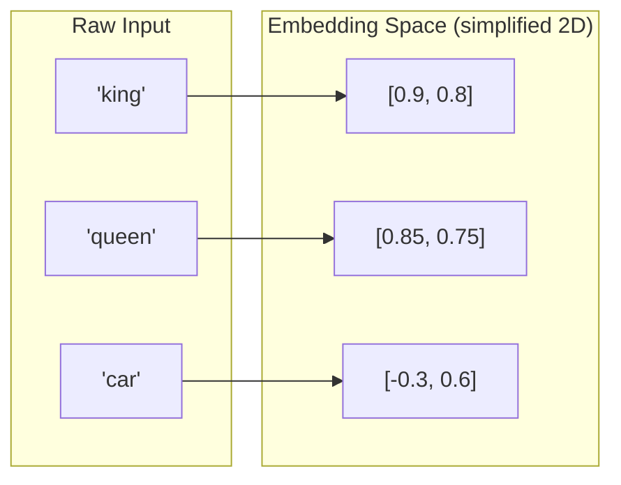
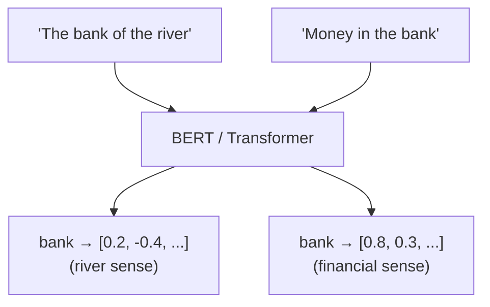
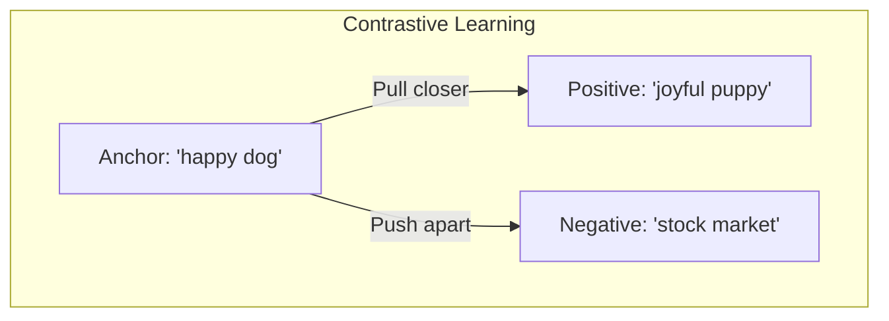
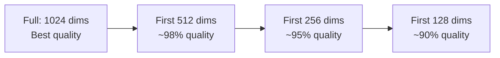
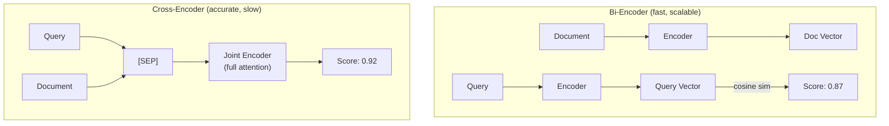
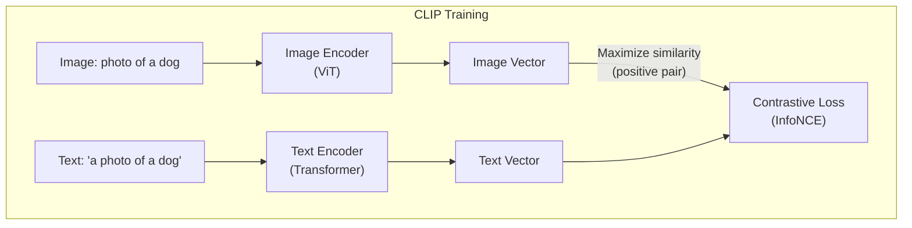

# Embeddings

Converting text, images, and audio into dense numerical vectors that capture semantic meaning — the bridge between raw data and ML models.

---

## What Are Embeddings

An **embedding** is a learned mapping from discrete or high-dimensional data (words, sentences, images) into a fixed-dimensional, continuous vector space where geometric relationships encode semantic relationships.



### Dense Vectors

Unlike sparse representations (bag-of-words, TF-IDF) where most values are zero, embeddings are **dense** — every dimension carries information.

| Property | Sparse (TF-IDF) | Dense (Embedding) |
|----------|-----------------|-------------------|
| Dimensionality | Vocabulary size (50K+) | Fixed, compact (256–4096) |
| Values | Mostly zeros | All dimensions active |
| Semantic matching | Exact keyword overlap only | Captures meaning and synonyms |
| Storage | Sparse matrix, efficient for high dims | Dense vector, efficient for ANN search |

```python
from sklearn.feature_extraction.text import TfidfVectorizer
from sentence_transformers import SentenceTransformer

# Sparse: TF-IDF
vectorizer = TfidfVectorizer()
sparse = vectorizer.fit_transform(["the dog sat on the mat"])
print(f"Sparse dims: {sparse.shape[1]}, non-zero: {sparse.nnz}")
# Sparse dims: 5, non-zero: 5

# Dense: Sentence embedding
model = SentenceTransformer("all-MiniLM-L6-v2")
dense = model.encode(["the dog sat on the mat"])
print(f"Dense dims: {dense.shape[1]}")
# Dense dims: 384 — every dimension has a value
```

### Similarity Metrics

Measuring how close two vectors are in embedding space is the core operation in retrieval, clustering, and classification.

| Metric | Formula | Range | When to Use |
|--------|---------|-------|-------------|
| **Cosine similarity** | $\cos(u,v) = \frac{u \cdot v}{\|u\| \cdot \|v\|}$ | $[-1, 1]$ | Default choice; magnitude-invariant |
| **Dot product** | $u \cdot v = \sum_i u_i v_i$ | $(-\infty, \infty)$ | When magnitude matters (e.g., popularity) |
| **Euclidean (L2)** | $\|u - v\|_2$ | $[0, \infty)$ | When absolute position in space matters |

```python
import numpy as np

def cosine_similarity(a: np.ndarray, b: np.ndarray) -> float:
    return np.dot(a, b) / (np.linalg.norm(a) * np.linalg.norm(b))

def dot_product(a: np.ndarray, b: np.ndarray) -> float:
    return np.dot(a, b)

def euclidean_distance(a: np.ndarray, b: np.ndarray) -> float:
    return np.linalg.norm(a - b)

# Normalized vectors: cosine similarity == dot product
# Most modern embedding models output unit-normalized vectors
model = SentenceTransformer("all-MiniLM-L6-v2")
emb = model.encode(["happy dog", "joyful puppy", "stock market crash"])

print(cosine_similarity(emb[0], emb[1]))  # ~0.78  (semantically close)
print(cosine_similarity(emb[0], emb[2]))  # ~0.05  (unrelated)
```

**Key insight for interviews:** When embeddings are L2-normalized (unit vectors), cosine similarity and dot product are equivalent, and minimizing Euclidean distance is equivalent to maximizing cosine similarity. Most production systems normalize embeddings to exploit this.

### Embedding Space Properties

A well-trained embedding space exhibits:

- **Clustering** — semantically similar items are near each other
- **Analogical structure** — vector arithmetic captures relationships: $\vec{king} - \vec{man} + \vec{woman} \approx \vec{queen}$
- **Smoothness** — small changes in input produce small changes in the vector
- **Compositionality** — sentence embeddings can be composed from token embeddings (via pooling or attention)

```python
import gensim.downloader as api

wv = api.load("word2vec-google-news-300")

# Classic analogy: king - man + woman ≈ queen
result = wv.most_similar(positive=["king", "woman"], negative=["man"], topn=1)
print(result)  # [('queen', 0.7118)]

# Country-capital relationship
result = wv.most_similar(positive=["paris", "germany"], negative=["france"], topn=1)
print(result)  # [('berlin', 0.7332)]
```

---

## Text Embeddings

### Word-Level Embeddings (Static)

Each word gets **one fixed vector** regardless of context. These are foundational but limited.

| Model | Year | Key Idea | Limitation |
|-------|------|----------|------------|
| **Word2Vec** | 2013 | Skip-gram / CBOW: predict context from word or vice versa | No subword info; OOV words fail |
| **GloVe** | 2014 | Factorize global word co-occurrence matrix | Same as Word2Vec: one vector per word |
| **FastText** | 2017 | Subword n-gram embeddings; word = sum of n-grams | Handles OOV words; still context-free |

```python
# Word2Vec: "bank" gets the SAME vector in both sentences
# "I went to the river bank" vs "I went to the bank to deposit money"
# This is the fundamental limitation of static embeddings
```

**Why they still matter in interviews:** Static embeddings are fast, interpretable, and perfect for explaining core embedding concepts. Interviewers often start here before moving to contextualized models.

### Contextual Embeddings

Same word, different vector depending on surrounding context — enabled by the Transformer architecture.



| Source | How | Pros | Cons |
|--------|-----|------|------|
| **BERT [CLS] token** | Take the [CLS] output as sentence embedding | Contextual; pretrained | Poor sentence-level similarity without fine-tuning |
| **BERT mean pooling** | Average all token outputs | Better than [CLS] for similarity | Still not optimized for similarity |
| **GPT hidden states** | Extract from last layer | Rich representations | Autoregressive; sees only left context |

```python
from transformers import AutoTokenizer, AutoModel
import torch

tokenizer = AutoTokenizer.from_pretrained("bert-base-uncased")
model = AutoModel.from_pretrained("bert-base-uncased")

def get_contextual_embedding(sentence: str, target_word: str) -> torch.Tensor:
    """Extract the contextual embedding of a specific word."""
    inputs = tokenizer(sentence, return_tensors="pt")
    outputs = model(**inputs)

    # Find the token position of target_word
    tokens = tokenizer.tokenize(sentence)
    idx = tokens.index(target_word) + 1  # +1 for [CLS]
    return outputs.last_hidden_state[0, idx, :]

emb_river = get_contextual_embedding("the bank of the river", "bank")
emb_money = get_contextual_embedding("money in the bank", "bank")

# These vectors will be DIFFERENT — context changes the embedding
sim = torch.nn.functional.cosine_similarity(emb_river, emb_money, dim=0)
print(f"Same word, different context: similarity = {sim:.3f}")  # ~0.6–0.7
```

### Sentence and Document Embeddings

For retrieval and semantic search, we need a **single vector for an entire text passage**.

| Approach | Description | Quality |
|----------|-------------|---------|
| **Mean pooling** | Average all token embeddings | Baseline; decent for short text |
| **[CLS] token** | Use the special classification token output | Weak without fine-tuning |
| **Sentence-BERT (SBERT)** | Fine-tune siamese BERT with contrastive loss | Strong; standard for sentence similarity |
| **Pooling + linear projection** | Pool then project to target dimension | Used in modern models like E5 |

```python
from sentence_transformers import SentenceTransformer

model = SentenceTransformer("all-MiniLM-L6-v2")  # 384 dims, fast

sentences = [
    "How do I reset my password?",
    "I forgot my login credentials",
    "What is the weather today?",
]

embeddings = model.encode(sentences, normalize_embeddings=True)

# Semantic search: query vs corpus
from sentence_transformers.util import cos_sim

query = model.encode("help with account access", normalize_embeddings=True)
scores = cos_sim(query, embeddings)
print(scores)
# "How do I reset my password?" and "I forgot my login credentials" score highest
```

### Instruction-Tuned Embeddings

Modern embedding models accept a **task instruction** prepended to the input, producing task-optimized embeddings from a single model.

```python
# E5 instruction format
from sentence_transformers import SentenceTransformer

model = SentenceTransformer("intfloat/e5-large-v2")

# Retrieval: query and passage get different prefixes
query_emb = model.encode("query: How does photosynthesis work?")
passage_emb = model.encode("passage: Photosynthesis is the process by which "
                           "plants convert sunlight into chemical energy...")

# Classification: use a different prefix
class_emb = model.encode("query: Classify this review as positive or negative: "
                          "This product exceeded my expectations!")
```

```python
# BGE-M3: multilingual instruction-tuned with hybrid retrieval
from FlagEmbedding import BGEM3FlagModel

model = BGEM3FlagModel("BAAI/bge-m3", use_fp16=True)

# BGE-M3 returns dense, sparse, AND ColBERT-style multi-vector embeddings
output = model.encode(
    ["What is deep learning?", "Deep learning is a subset of machine learning..."],
    return_dense=True,
    return_sparse=True,
    return_colbert_vecs=True,
)
# Use dense for semantic search, sparse for keyword matching, ColBERT for reranking
```

**Why instruction-tuning matters:** A single model handles retrieval, classification, clustering, and semantic textual similarity by changing the instruction prefix. This eliminates the need for separate models per task.

---

## Training Approaches

### Contrastive Learning

The dominant paradigm for training embedding models. The core idea: **pull positive pairs closer, push negative pairs apart** in the embedding space.



**Key contrastive losses:**

| Loss | Formula Idea | Used By |
|------|-------------|---------|
| **InfoNCE** | Softmax over positive vs. all negatives in the batch | CLIP, SimCLR |
| **Triplet loss** | $\max(0,\; d(a,p) - d(a,n) + \text{margin})$ | FaceNet, early SBERT |
| **Multiple Negatives Ranking (MNR)** | In-batch negatives: other batch items are negatives | Sentence-BERT, E5 |
| **NT-Xent** | Normalized temperature-scaled cross-entropy | SimCLR |

```python
import torch
import torch.nn.functional as F

def info_nce_loss(query: torch.Tensor, positive: torch.Tensor,
                  negatives: torch.Tensor, temperature: float = 0.07) -> torch.Tensor:
    """
    InfoNCE contrastive loss.
    query:     (batch, dim)
    positive:  (batch, dim)
    negatives: (batch, num_neg, dim)
    """
    # Positive similarity
    pos_sim = F.cosine_similarity(query, positive, dim=-1) / temperature  # (batch,)

    # Negative similarities
    neg_sim = F.cosine_similarity(
        query.unsqueeze(1), negatives, dim=-1
    ) / temperature  # (batch, num_neg)

    # Logits: positive is first, negatives follow
    logits = torch.cat([pos_sim.unsqueeze(1), neg_sim], dim=1)  # (batch, 1+num_neg)

    # Target: positive is always index 0
    labels = torch.zeros(query.size(0), dtype=torch.long)
    return F.cross_entropy(logits, labels)
```

**Hard negatives** are critical for strong embeddings: negatives that are topically related but not actually relevant (e.g., for the query "python snake habitats," a hard negative might be "python programming tutorial"). Mining hard negatives from BM25 results or a previous model checkpoint dramatically improves quality.

### SimCSE (Simple Contrastive Learning of Sentence Embeddings)

An elegant approach that creates positive pairs through dropout:

```python
# Unsupervised SimCSE: pass the SAME sentence through the encoder TWICE
# Dropout creates two slightly different representations → positive pair
# Other sentences in the batch → negatives

# This achieves strong results with ZERO labeled data
# Key insight: dropout acts as minimal data augmentation
```

### Matryoshka Representation Learning (MRL)

Train embeddings where **any prefix** of the full vector is a valid (lower-quality) embedding. Named after Russian nesting dolls.



```python
# Matryoshka loss: compute loss at multiple truncation levels
def matryoshka_loss(embeddings_a, embeddings_b, dims=[1024, 512, 256, 128, 64]):
    total_loss = 0
    for d in dims:
        # Truncate to first d dimensions
        trunc_a = F.normalize(embeddings_a[:, :d], dim=-1)
        trunc_b = F.normalize(embeddings_b[:, :d], dim=-1)
        total_loss += contrastive_loss(trunc_a, trunc_b)
    return total_loss / len(dims)

# At inference time: choose dimension based on latency/quality tradeoff
# Full 1024 dims for high-stakes retrieval
# 256 dims for fast approximate search
# 64 dims for real-time filtering
```

**Why Matryoshka is important for production:** You train one model and deploy at multiple quality/cost tradeoffs. Reduce dimensions by 4x for only ~5% quality drop. OpenAI's `text-embedding-3` and Nomic Embed use this approach.

### Cross-Encoder vs. Bi-Encoder

This is a fundamental architecture decision for retrieval systems and a very common interview topic.



| Property | Bi-Encoder | Cross-Encoder |
|----------|-----------|---------------|
| **Input** | Encode query and doc independently | Encode query + doc jointly |
| **Speed** | Fast: precompute doc embeddings, ANN search | Slow: must run for every (query, doc) pair |
| **Scalability** | Scales to billions of documents | Practical for top-K reranking only |
| **Accuracy** | Good | Better (full cross-attention between query and doc) |
| **Use case** | First-stage retrieval (candidate generation) | Second-stage reranking |

**The standard production pattern is a two-stage pipeline:**

```python
from sentence_transformers import SentenceTransformer, CrossEncoder

# Stage 1: Bi-encoder retrieves top-100 candidates (milliseconds)
bi_encoder = SentenceTransformer("all-MiniLM-L6-v2")
query_emb = bi_encoder.encode("What causes rain?")
# ANN search against precomputed corpus embeddings → top 100 candidates

# Stage 2: Cross-encoder reranks top-100 → top-10 (tens of ms)
cross_encoder = CrossEncoder("cross-encoder/ms-marco-MiniLM-L-12-v2")
pairs = [("What causes rain?", doc) for doc in top_100_candidates]
scores = cross_encoder.predict(pairs)
reranked = sorted(zip(scores, top_100_candidates), reverse=True)[:10]
```

**ColBERT: A middle ground.** ColBERT uses a bi-encoder architecture but retains per-token embeddings (multi-vector) instead of pooling into a single vector. At query time, it computes a lightweight MaxSim interaction between query tokens and document tokens. This gives near cross-encoder accuracy with most of the speed of a bi-encoder.

---

## Modern Embedding Models

| Model | Provider | Dimensions | Max Context | Matryoshka | Multilingual | Best For |
|-------|----------|-----------|-------------|------------|-------------|----------|
| **text-embedding-3-large** | OpenAI | 256–3072 | 8K tokens | Yes | Moderate | General purpose, API-based |
| **text-embedding-3-small** | OpenAI | 512–1536 | 8K tokens | Yes | Moderate | Cost-efficient API-based |
| **BGE-M3** | BAAI | 1024 | 8K tokens | No | 100+ languages | Multilingual, hybrid (dense+sparse) |
| **E5-Mistral-7B** | Intfloat | 4096 | 32K tokens | No | English-centric | Long documents, instruction-tuned |
| **Nomic Embed v1.5** | Nomic AI | 64–768 | 8K tokens | Yes | English | Open-source Matryoshka |
| **Cohere embed-v3** | Cohere | 1024 | 512 tokens | No | 100+ languages | Multilingual retrieval |
| **GTE-Qwen2-7B** | Alibaba | 3584 | 32K tokens | No | Multilingual | MTEB leaderboard, long context |
| **Jina Embeddings v3** | Jina AI | 1024 | 8K tokens | Yes | 90+ languages | Task-specific LoRA adapters |

**Selection criteria for production:**

1. **Task fit** — retrieval vs. classification vs. clustering; check MTEB sub-scores
2. **Context length** — short queries (512 tokens enough) vs. long documents (need 8K+)
3. **Multilingual needs** — BGE-M3 and Cohere lead here
4. **Deployment** — API (OpenAI, Cohere) vs. self-hosted (BGE, E5, Nomic)
5. **Dimension vs. quality** — Matryoshka models let you tune this at inference time
6. **Latency budget** — smaller models (MiniLM: 22M params) vs. larger (E5-Mistral: 7B params)

---

## Multimodal Embeddings

### CLIP (Contrastive Language-Image Pretraining)

CLIP maps images and text into a **shared embedding space** using contrastive learning on 400M image-text pairs from the internet.



**How CLIP training works:**

1. Take a batch of N (image, text) pairs
2. Compute N image embeddings and N text embeddings
3. Compute the N x N similarity matrix
4. The diagonal entries are positives (matching pairs); off-diagonal are negatives
5. Apply symmetric cross-entropy loss (InfoNCE) across rows and columns

```python
import torch
from transformers import CLIPProcessor, CLIPModel
from PIL import Image

model = CLIPModel.from_pretrained("openai/clip-vit-base-patch32")
processor = CLIPProcessor.from_pretrained("openai/clip-vit-base-patch32")

# Encode an image and multiple text candidates
image = Image.open("cat.jpg")
texts = ["a photo of a cat", "a photo of a dog", "a painting of flowers"]

inputs = processor(text=texts, images=image, return_tensors="pt", padding=True)
outputs = model(**inputs)

# Compare image embedding to each text embedding
logits_per_image = outputs.logits_per_image  # (1, 3)
probs = logits_per_image.softmax(dim=1)
print(probs)  # Highest probability for "a photo of a cat"

# Zero-shot classification: no training needed — just compare to label descriptions
```

**CLIP enables:**
- **Zero-shot image classification** — compare image embedding to text label embeddings
- **Image search by text** — embed corpus of images, search with text queries
- **Text search by image** — reverse: embed text corpus, search with image queries
- **Multimodal RAG** — embed both text chunks and images from documents

### ImageBind

Meta's ImageBind extends CLIP's idea to **six modalities** in a single embedding space: images, text, audio, depth, thermal, and IMU data.

| Property | CLIP | ImageBind |
|----------|------|-----------|
| Modalities | 2 (image, text) | 6 (image, text, audio, depth, thermal, IMU) |
| Training approach | All pairs contrastive | Image-centric binding (image is the anchor) |
| Key insight | Scale (400M pairs) | Emergent cross-modal alignment without explicit pairing |

**ImageBind's trick:** Train each modality paired with images only (image-text, image-audio, image-depth). Since all modalities are aligned to images, they become aligned to each other transitively — even without direct audio-text pairs.

### Audio Embeddings

| Model | Approach | Use Case |
|-------|----------|----------|
| **CLAP** | Contrastive audio-text (like CLIP for audio) | Audio search, classification |
| **Whisper encoder** | Extract features from Whisper's encoder layers | Speech representations |
| **AudioMAE** | Masked autoencoder for audio spectrograms | General audio understanding |

---

## Evaluation

### MTEB (Massive Text Embedding Benchmark)

The standard benchmark for text embeddings, covering **8 task categories** across 58+ datasets.

| Task Category | What It Measures | Example Dataset |
|---------------|-----------------|-----------------|
| **Retrieval** | Find relevant docs for a query | MS MARCO, NQ, BEIR |
| **STS** | Semantic textual similarity scoring | STS Benchmark, SICK-R |
| **Classification** | Use embeddings as features for classification | Amazon Reviews, Tweet Eval |
| **Clustering** | Group semantically similar texts | Reddit clustering, ArXiv |
| **Pair Classification** | Determine relationship between sentence pairs | Paraphrase detection, NLI |
| **Reranking** | Reorder candidate documents by relevance | AskUbuntu, StackOverflow |
| **Summarization** | Measure embedding quality for summarization eval | SummEval |
| **BitextMining** | Find parallel sentences across languages | Tatoeba, BUCC |

```python
# Run MTEB evaluation on your model
from mteb import MTEB
from sentence_transformers import SentenceTransformer

model = SentenceTransformer("all-MiniLM-L6-v2")
evaluation = MTEB(tasks=["STS17", "AmazonReviewsClassification"])
results = evaluation.run(model, output_folder="results/")
```

### Retrieval Metrics

These metrics are essential for evaluating embedding quality in search and RAG systems.

| Metric | Formula Idea | Interpretation |
|--------|-------------|----------------|
| **Recall@K** | $\frac{|\text{relevant} \cap \text{top-K}|}{|\text{relevant}|}$ | Coverage: did we find all relevant docs? |
| **Precision@K** | $\frac{|\text{relevant} \cap \text{top-K}|}{K}$ | Purity: how many retrieved docs are relevant? |
| **NDCG@K** | $\frac{DCG@K}{IDCG@K}$ | Ranking quality: are relevant docs ranked higher? |
| **MRR** | $\frac{1}{\text{rank of first relevant doc}}$ | How quickly do we find the first relevant result? |
| **MAP** | Mean of Average Precision across queries | Overall retrieval quality across the full ranking |

```python
import numpy as np

def recall_at_k(relevant: set, retrieved: list, k: int) -> float:
    """What fraction of relevant items appear in top-K results?"""
    return len(relevant & set(retrieved[:k])) / len(relevant)

def mrr(relevant: set, retrieved: list) -> float:
    """Reciprocal rank of the first relevant result."""
    for i, doc_id in enumerate(retrieved, 1):
        if doc_id in relevant:
            return 1.0 / i
    return 0.0

def ndcg_at_k(relevance_scores: list, k: int) -> float:
    """NDCG: rewards placing highly relevant docs at the top."""
    dcg = sum(rel / np.log2(i + 2) for i, rel in enumerate(relevance_scores[:k]))
    ideal = sorted(relevance_scores, reverse=True)[:k]
    idcg = sum(rel / np.log2(i + 2) for i, rel in enumerate(ideal))
    return dcg / idcg if idcg > 0 else 0.0

# Example: query with 3 relevant docs in a corpus of 1000
relevant = {42, 87, 153}
retrieved = [10, 42, 5, 87, 200, 153, 99, 300, 12, 50]

print(f"Recall@5:  {recall_at_k(relevant, retrieved, 5):.2f}")   # 0.67
print(f"Recall@10: {recall_at_k(relevant, retrieved, 10):.2f}")  # 1.00
print(f"MRR:       {mrr(relevant, retrieved):.2f}")               # 0.50
```

### Downstream Task Performance

Beyond benchmarks, evaluate embeddings by their impact on the actual application:

- **RAG answer quality** — Do better embeddings produce better generated answers? (measure with human eval or LLM-as-judge)
- **Classification accuracy** — Train a simple linear classifier on frozen embeddings and measure accuracy
- **Clustering quality** — Compute silhouette score or adjusted Rand index on embedding clusters
- **A/B testing** — In production, measure click-through rate, task completion, or user satisfaction

---

## Common Interview Questions

**Q1: How does contrastive learning train embedding models?**
Contrastive learning optimizes a loss function that pulls embeddings of semantically similar items (positive pairs) closer together while pushing dissimilar items (negative pairs) apart. The InfoNCE loss treats this as a classification problem: given an anchor, identify the positive among a batch of negatives via softmax over cosine similarities. Key details: temperature controls the sharpness of the distribution, hard negatives (topically similar but not relevant) are critical for quality, and in-batch negatives provide an efficient way to scale the number of negatives with batch size.

**Q2: Cross-encoder vs. bi-encoder — when to use each?**
Use a **bi-encoder** for first-stage retrieval over large corpora (millions/billions of docs): encode query and documents independently, precompute document embeddings, and use ANN search for sub-millisecond retrieval. Use a **cross-encoder** for second-stage reranking of the top-K candidates (typically K=100): it jointly attends to both query and document, producing more accurate relevance scores but at O(K) inference cost per query. The standard production pattern is bi-encoder retrieval followed by cross-encoder reranking. ColBERT is a middle ground offering near cross-encoder quality with most of the bi-encoder's speed via multi-vector late interaction.

**Q3: How would you evaluate embedding quality for a RAG system?**
Use a multi-level evaluation: (1) **Retrieval metrics** — Recall@K is most important (did we find the relevant chunks?), followed by NDCG@K for ranking quality; (2) **End-to-end** — measure answer quality using LLM-as-judge or human evaluation to see if better retrieval translates to better answers; (3) **MTEB sub-scores** — check the model's retrieval score on BEIR datasets for domain-relevant benchmarks; (4) **Failure analysis** — manually inspect queries where retrieval fails to identify systematic gaps (e.g., keyword-heavy queries where BM25 outperforms dense retrieval).

**Q4: What are Matryoshka embeddings and why are they useful?**
Matryoshka Representation Learning trains a single model where any prefix of the full embedding vector (e.g., first 256 of 1024 dimensions) is itself a valid embedding with gracefully degraded quality. During training, the contrastive loss is computed at multiple truncation levels simultaneously. In production, this allows a single model to serve multiple latency/quality tradeoffs without retraining: use full dimensions for high-stakes retrieval and truncated dimensions for fast filtering or resource-constrained environments. OpenAI's text-embedding-3 and Nomic Embed use this approach.

**Q5: How does CLIP create a shared image-text embedding space?**
CLIP trains an image encoder (ViT or ResNet) and a text encoder (Transformer) jointly using contrastive learning on 400M image-text pairs. For a batch of N pairs, it computes the N x N matrix of cosine similarities between all image and text embeddings. The diagonal (matching pairs) are positives, off-diagonal are negatives. A symmetric InfoNCE loss is applied across both rows (image-to-text) and columns (text-to-image). After training, images and texts that describe the same concept have nearby vectors, enabling zero-shot classification (compare image to text label embeddings), cross-modal search, and multimodal RAG.

**Q6: How do you choose the right embedding model for a production system?**
Start with the task requirements: (1) **Context length** — short queries need only 512 tokens, but RAG over long documents needs 8K+; (2) **Language** — multilingual needs favor BGE-M3 or Cohere embed-v3; (3) **Deployment** — API models (OpenAI, Cohere) are easiest, self-hosted (BGE, E5, Nomic) give more control and lower cost at scale; (4) **Latency** — smaller models like MiniLM (22M params, 384 dims) are 100x faster than 7B models; (5) **Quality** — check MTEB scores for your specific task category, not just the overall average; (6) **Dimension flexibility** — Matryoshka models let you tune dimension at inference time. Always benchmark on your own data: MTEB scores don't always predict domain-specific performance.
