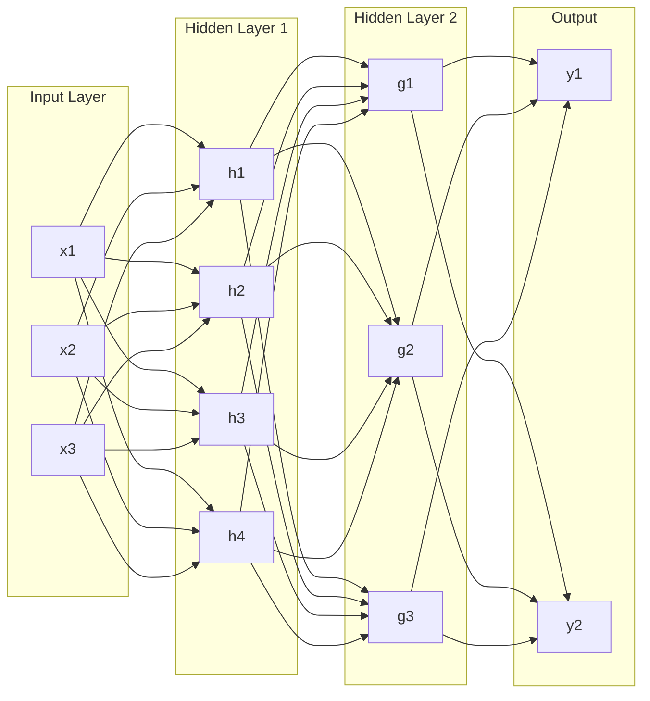
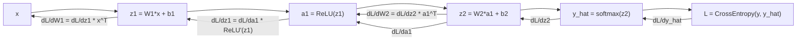
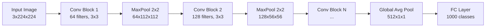
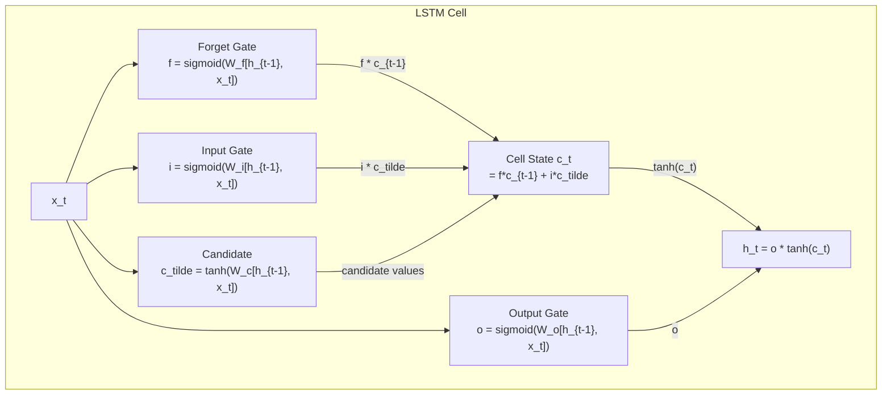
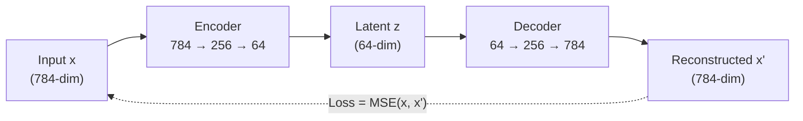
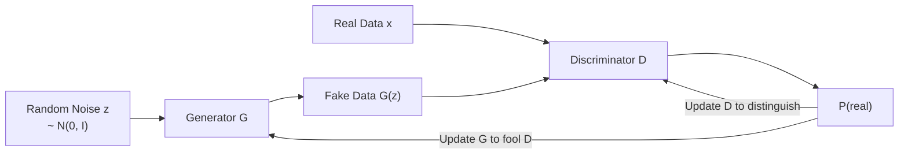
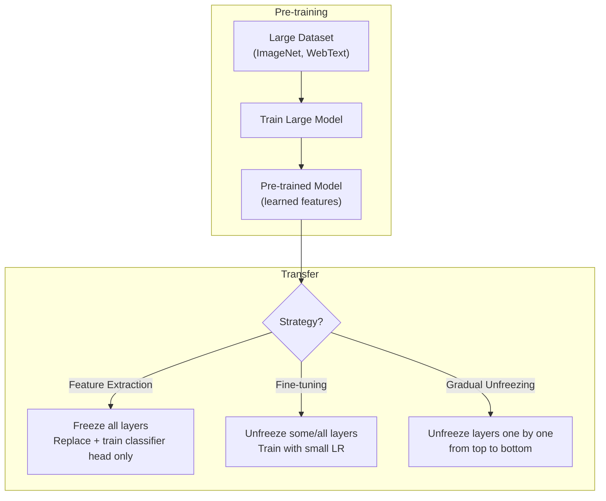
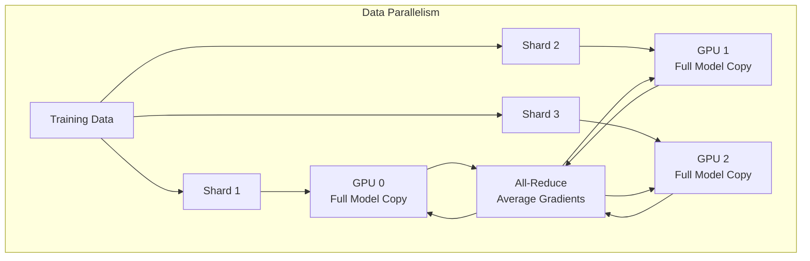

# Deep Learning

Neural network architectures, training techniques, and the mathematical intuition behind deep learning — the foundation of modern AI systems.

---

## Neural Network Fundamentals

### Perceptron to MLP

A single **perceptron** computes a weighted sum of inputs plus a bias, passed through an activation function:

$$y = \sigma(w^T x + b)$$

A **Multi-Layer Perceptron (MLP)** stacks perceptrons into layers — input, hidden, and output — enabling the network to learn non-linear decision boundaries.



**Forward pass** — data flows left to right, each layer computing: `z = Wx + b`, then `a = activation(z)`.

```python
import torch
import torch.nn as nn

class MLP(nn.Module):
    def __init__(self, input_dim, hidden_dim, output_dim):
        super().__init__()
        self.net = nn.Sequential(
            nn.Linear(input_dim, hidden_dim),
            nn.ReLU(),
            nn.Linear(hidden_dim, hidden_dim),
            nn.ReLU(),
            nn.Linear(hidden_dim, output_dim),
        )

    def forward(self, x):
        return self.net(x)

model = MLP(input_dim=784, hidden_dim=256, output_dim=10)  # MNIST classifier
```

**Why non-linearity matters:** Without activation functions, stacking linear layers collapses to a single linear transformation (`W2 * W1 * x = W' * x`). Non-linear activations let networks approximate any continuous function (Universal Approximation Theorem).

---

### Activation Functions

| Activation | Formula | Range | Pros | Cons | Use When |
|-----------|---------|-------|------|------|----------|
| **ReLU** | `max(0, x)` | [0, inf) | Fast, sparse activation, mitigates vanishing gradient | Dead neurons (output stuck at 0) | Default for hidden layers |
| **Leaky ReLU** | `max(0.01x, x)` | (-inf, inf) | No dead neurons | Small negative slope is arbitrary | When dead neurons are a problem |
| **GELU** | `x * Phi(x)` | (-0.17, inf) | Smooth, used in transformers | Slightly slower than ReLU | Transformer architectures |
| **Sigmoid** | `1 / (1 + e^-x)` | (0, 1) | Output interpretable as probability | Vanishing gradient, not zero-centered | Binary classification output |
| **Tanh** | `(e^x - e^-x) / (e^x + e^-x)` | (-1, 1) | Zero-centered | Vanishing gradient at extremes | RNN hidden states |
| **Swish** | `x * sigmoid(x)` | (-0.28, inf) | Smooth, self-gated | Slightly more compute | Deep networks, can outperform ReLU |
| **Softmax** | `e^xi / sum(e^xj)` | (0, 1), sums to 1 | Multi-class probability distribution | Not for hidden layers | Multi-class output layer |

```python
# Custom activation comparison
import torch.nn.functional as F

x = torch.randn(5)
print("ReLU:   ", F.relu(x))
print("GELU:   ", F.gelu(x))
print("Sigmoid:", torch.sigmoid(x))
print("Swish:  ", x * torch.sigmoid(x))  # SiLU in PyTorch: F.silu(x)
```

---

### Loss Functions

| Loss | Formula | Use Case |
|------|---------|----------|
| **Cross-Entropy** | `-sum(y * log(y_hat))` | Classification (multi-class) |
| **Binary Cross-Entropy** | `-[y*log(p) + (1-y)*log(1-p)]` | Binary classification |
| **MSE** | `mean((y - y_hat)^2)` | Regression |
| **MAE (L1)** | `mean(abs(y - y_hat))` | Regression (robust to outliers) |
| **Huber** | MSE when error is small, MAE when large | Regression (balanced robustness) |
| **Triplet Loss** | `max(0, d(a,p) - d(a,n) + margin)` | Metric learning / embeddings |
| **Contrastive Loss** | `y*d^2 + (1-y)*max(0, margin-d)^2` | Siamese networks / similarity |
| **Focal Loss** | `-alpha * (1-p)^gamma * log(p)` | Imbalanced classification |

```python
# Classification loss
criterion_cls = nn.CrossEntropyLoss()  # includes softmax internally
logits = model(x)  # raw scores, NOT softmax outputs
loss = criterion_cls(logits, targets)

# Regression loss
criterion_reg = nn.MSELoss()
loss = criterion_reg(predictions, targets)

# Triplet loss for embedding learning
criterion_triplet = nn.TripletMarginLoss(margin=1.0)
loss = criterion_triplet(anchor_embed, positive_embed, negative_embed)
```

**Key interview detail:** `nn.CrossEntropyLoss` in PyTorch expects **raw logits**, not softmax outputs. It internally applies `log_softmax + NLLLoss` for numerical stability.

---

### Backpropagation

Backprop computes gradients of the loss with respect to every parameter using the **chain rule** on the computational graph.



**Step-by-step for a single layer:**

1. **Forward pass:** Compute `z = Wx + b`, then `a = activation(z)`, store intermediates
2. **Compute loss:** `L = loss_fn(y_hat, y)`
3. **Backward pass** (reverse order through layers):
   - Compute `dL/dz` for the output layer
   - For each layer going backward: `dL/dW = dL/dz * a_prev^T`, `dL/db = dL/dz`, `dL/da_prev = W^T * dL/dz`
   - Apply activation derivative: `dL/dz_prev = dL/da_prev * activation'(z_prev)`
4. **Update:** `W = W - lr * dL/dW`

```python
# PyTorch autograd handles this automatically
optimizer = torch.optim.Adam(model.parameters(), lr=1e-3)

# Training step
optimizer.zero_grad()        # Clear previous gradients
output = model(x)            # Forward pass
loss = criterion(output, y)  # Compute loss
loss.backward()              # Backward pass (compute gradients)
optimizer.step()             # Update parameters
```

---

### Vanishing and Exploding Gradients

During backprop, gradients are **multiplied** through layers. In deep networks:

- **Vanishing gradients:** If gradients < 1 at each layer, they shrink exponentially toward zero. Deep layers learn, but early layers barely update. Common with sigmoid/tanh activations.
- **Exploding gradients:** If gradients > 1 at each layer, they grow exponentially. Weights oscillate wildly, loss becomes NaN.

| Problem | Cause | Solutions |
|---------|-------|-----------|
| **Vanishing** | Sigmoid/tanh saturation, deep networks | ReLU activations, skip connections, batch norm, proper initialization (He, Xavier) |
| **Exploding** | Large weight initialization, unstable architecture | Gradient clipping, weight regularization, batch norm |

**Skip connections (ResNet)** are the most impactful solution. Instead of learning `H(x)`, the network learns the residual `F(x) = H(x) - x`:

```python
class ResidualBlock(nn.Module):
    def __init__(self, channels):
        super().__init__()
        self.block = nn.Sequential(
            nn.Conv2d(channels, channels, 3, padding=1),
            nn.BatchNorm2d(channels),
            nn.ReLU(),
            nn.Conv2d(channels, channels, 3, padding=1),
            nn.BatchNorm2d(channels),
        )
        self.relu = nn.ReLU()

    def forward(self, x):
        residual = x
        out = self.block(x)
        out += residual  # Skip connection — gradient flows directly through addition
        return self.relu(out)
```

**Why skip connections work:** The addition operation has a gradient of 1, so gradients flow through the skip path undiminished regardless of depth. The network can also learn the identity function easily (just set `F(x) = 0`).

**Gradient clipping** caps the gradient norm to prevent explosions:

```python
torch.nn.utils.clip_grad_norm_(model.parameters(), max_norm=1.0)
```

**Weight initialization** sets the right scale from the start:

```python
# He initialization (for ReLU): Var(w) = 2/n_in
nn.init.kaiming_normal_(layer.weight, mode='fan_in', nonlinearity='relu')

# Xavier/Glorot (for tanh/sigmoid): Var(w) = 2/(n_in + n_out)
nn.init.xavier_normal_(layer.weight)
```

---

## Core Architectures

### Convolutional Neural Networks (CNNs)

CNNs exploit **spatial locality** and **translation invariance** through learned convolutional filters.



**Key concepts:**

| Concept | Description |
|---------|-------------|
| **Convolution** | Slide a learned filter (kernel) across the input, computing element-wise product + sum at each position. Output is a feature map. |
| **Stride** | Step size of the filter. Stride 2 halves spatial dimensions. |
| **Padding** | Zeros added around input borders. `padding='same'` keeps spatial size. |
| **Pooling** | Downsamples feature maps. Max pooling selects the strongest activation; average pooling takes the mean. |
| **Receptive field** | The region of the input image that a single neuron "sees". Deeper layers have larger receptive fields. |
| **1x1 convolutions** | Change channel count without changing spatial dims. Used in Inception, bottleneck blocks. |

**Receptive field formula:** `RF_out = RF_in + (kernel_size - 1) * stride_product_of_preceding_layers`

```python
class SimpleCNN(nn.Module):
    def __init__(self, num_classes=10):
        super().__init__()
        self.features = nn.Sequential(
            nn.Conv2d(3, 64, kernel_size=3, padding=1),  # 3 input channels (RGB)
            nn.BatchNorm2d(64),
            nn.ReLU(),
            nn.MaxPool2d(2, 2),                          # 224 -> 112

            nn.Conv2d(64, 128, kernel_size=3, padding=1),
            nn.BatchNorm2d(128),
            nn.ReLU(),
            nn.MaxPool2d(2, 2),                          # 112 -> 56

            nn.Conv2d(128, 256, kernel_size=3, padding=1),
            nn.BatchNorm2d(256),
            nn.ReLU(),
            nn.AdaptiveAvgPool2d((1, 1)),                # Global average pooling
        )
        self.classifier = nn.Linear(256, num_classes)

    def forward(self, x):
        x = self.features(x)
        x = x.view(x.size(0), -1)  # Flatten
        return self.classifier(x)
```

**Notable CNN architectures:**

| Architecture | Year | Key Innovation | Depth |
|-------------|------|----------------|-------|
| **AlexNet** | 2012 | ReLU, dropout, GPU training | 8 |
| **VGG** | 2014 | Small 3x3 filters stacked deep | 16-19 |
| **GoogLeNet/Inception** | 2014 | Inception modules (parallel multi-scale convolutions) | 22 |
| **ResNet** | 2015 | Skip connections (residual learning) | 50-152 |
| **EfficientNet** | 2019 | Compound scaling (depth, width, resolution) | varies |
| **ConvNeXt** | 2022 | Modernized ResNet with transformer-era tricks | varies |

---

### RNNs, LSTMs, and GRUs

**Recurrent Neural Networks** process sequential data by maintaining a hidden state across time steps.

**Vanilla RNN:**

$$h_t = \tanh(W_{hh} h_{t-1} + W_{xh} x_t + b)$$

Problem: vanilla RNNs suffer from vanishing gradients over long sequences (gradients pass through tanh at every step).

**LSTM (Long Short-Term Memory)** solves this with a gating mechanism and a **cell state** that acts as a gradient highway:



| Gate | Purpose | Analogy |
|------|---------|---------|
| **Forget gate** | Decides what to discard from cell state | "Should I forget old context?" |
| **Input gate** | Decides what new info to store | "What new info is worth remembering?" |
| **Output gate** | Decides what to output from cell state | "What part of memory is relevant now?" |

**GRU (Gated Recurrent Unit)** — a simplified LSTM with only two gates (reset + update), fewer parameters, often comparable performance:

$$z_t = \sigma(W_z [h_{t-1}, x_t]) \quad \text{(update gate)}$$
$$r_t = \sigma(W_r [h_{t-1}, x_t]) \quad \text{(reset gate)}$$
$$h_t = (1 - z_t) \odot h_{t-1} + z_t \odot \tanh(W [r_t \odot h_{t-1}, x_t])$$

```python
# LSTM for sequence classification
class LSTMClassifier(nn.Module):
    def __init__(self, vocab_size, embed_dim, hidden_dim, num_classes, num_layers=2):
        super().__init__()
        self.embedding = nn.Embedding(vocab_size, embed_dim)
        self.lstm = nn.LSTM(
            embed_dim, hidden_dim,
            num_layers=num_layers,
            batch_first=True,
            dropout=0.3,
            bidirectional=True,  # Process sequence both directions
        )
        self.classifier = nn.Linear(hidden_dim * 2, num_classes)  # *2 for bidirectional

    def forward(self, x):
        embeds = self.embedding(x)                    # (batch, seq_len, embed_dim)
        lstm_out, (h_n, c_n) = self.lstm(embeds)      # h_n: (num_layers*2, batch, hidden)
        # Concatenate final forward and backward hidden states
        hidden = torch.cat([h_n[-2], h_n[-1]], dim=1) # (batch, hidden*2)
        return self.classifier(hidden)
```

**Limitations of RNNs/LSTMs:** Sequential processing (no parallelism), still struggle with very long sequences (>500 tokens). **Transformers** have largely replaced them for NLP tasks, but LSTMs remain useful for time-series and small-scale sequential problems.

---

### Autoencoders

Autoencoders learn a compressed latent representation by training to reconstruct their input.



| Variant | Key Idea | Use Case |
|---------|----------|----------|
| **Vanilla AE** | Deterministic encoder/decoder | Dimensionality reduction, feature learning |
| **Denoising AE** | Input is corrupted with noise; network learns to reconstruct clean version | Robust feature learning, denoising |
| **Variational AE (VAE)** | Encoder outputs mean + variance of a distribution; sample z from it | Generative modeling, interpolation in latent space |
| **Sparse AE** | Adds sparsity penalty on latent activations | Interpretable features |

**Variational Autoencoder (VAE):**

The encoder outputs parameters of a Gaussian distribution. We sample from it using the **reparameterization trick** to enable backprop through the sampling step:

$$z = \mu + \sigma \odot \epsilon, \quad \epsilon \sim \mathcal{N}(0, I)$$

Loss = Reconstruction loss + KL divergence (regularizes latent space toward standard normal):

$$\mathcal{L} = \mathbb{E}[\|x - \hat{x}\|^2] + \text{KL}(q(z|x) \| p(z))$$

```python
class VAE(nn.Module):
    def __init__(self, input_dim=784, latent_dim=64):
        super().__init__()
        self.encoder = nn.Sequential(nn.Linear(input_dim, 256), nn.ReLU())
        self.fc_mu = nn.Linear(256, latent_dim)
        self.fc_logvar = nn.Linear(256, latent_dim)
        self.decoder = nn.Sequential(
            nn.Linear(latent_dim, 256), nn.ReLU(),
            nn.Linear(256, input_dim), nn.Sigmoid(),
        )

    def encode(self, x):
        h = self.encoder(x)
        return self.fc_mu(h), self.fc_logvar(h)

    def reparameterize(self, mu, logvar):
        std = torch.exp(0.5 * logvar)
        eps = torch.randn_like(std)       # Sample from N(0, I)
        return mu + eps * std             # Reparameterization trick

    def forward(self, x):
        mu, logvar = self.encode(x)
        z = self.reparameterize(mu, logvar)
        x_recon = self.decoder(z)
        return x_recon, mu, logvar

def vae_loss(x_recon, x, mu, logvar):
    recon_loss = nn.functional.binary_cross_entropy(x_recon, x, reduction='sum')
    kl_loss = -0.5 * torch.sum(1 + logvar - mu.pow(2) - logvar.exp())
    return recon_loss + kl_loss
```

---

### Generative Adversarial Networks (GANs)

Two networks compete: a **generator** creates fake data, and a **discriminator** tries to distinguish real from fake.



**Minimax objective:**

$$\min_G \max_D \; \mathbb{E}_{x \sim p_{data}}[\log D(x)] + \mathbb{E}_{z \sim p_z}[\log(1 - D(G(z)))]$$

```python
class Generator(nn.Module):
    def __init__(self, latent_dim=100, img_dim=784):
        super().__init__()
        self.net = nn.Sequential(
            nn.Linear(latent_dim, 256), nn.LeakyReLU(0.2),
            nn.Linear(256, 512),        nn.LeakyReLU(0.2),
            nn.Linear(512, img_dim),    nn.Tanh(),
        )

    def forward(self, z):
        return self.net(z)

class Discriminator(nn.Module):
    def __init__(self, img_dim=784):
        super().__init__()
        self.net = nn.Sequential(
            nn.Linear(img_dim, 512),  nn.LeakyReLU(0.2),
            nn.Linear(512, 256),      nn.LeakyReLU(0.2),
            nn.Linear(256, 1),        nn.Sigmoid(),
        )

    def forward(self, x):
        return self.net(x)

# Training loop (simplified)
for real_imgs in dataloader:
    z = torch.randn(batch_size, latent_dim)
    fake_imgs = generator(z)

    # Train discriminator: maximize log(D(x)) + log(1 - D(G(z)))
    d_real = discriminator(real_imgs)
    d_fake = discriminator(fake_imgs.detach())  # detach to avoid updating G
    d_loss = -torch.mean(torch.log(d_real) + torch.log(1 - d_fake))
    d_loss.backward()
    optimizer_d.step()

    # Train generator: maximize log(D(G(z))) — i.e., fool discriminator
    d_fake = discriminator(fake_imgs)
    g_loss = -torch.mean(torch.log(d_fake))
    g_loss.backward()
    optimizer_g.step()
```

**Common GAN challenges:**

| Problem | Description | Solution |
|---------|-------------|----------|
| **Mode collapse** | Generator produces limited variety of outputs | Wasserstein loss, minibatch discrimination, unrolled GANs |
| **Training instability** | Loss oscillates, G and D don't converge | Spectral normalization, two-timescale update rule, progressive growing |
| **Evaluation** | No single metric to measure quality | FID (Frechet Inception Distance), IS (Inception Score) |

**Notable GAN variants:** DCGAN (convolutional), WGAN (Wasserstein distance), StyleGAN (style-based generation), CycleGAN (unpaired image-to-image translation), Pix2Pix (paired translation).

---

## Training Techniques

### Batch Normalization

Normalizes activations within a mini-batch to have zero mean and unit variance, then applies a learnable scale and shift:

$$\hat{x}_i = \frac{x_i - \mu_B}{\sqrt{\sigma_B^2 + \epsilon}}, \quad y_i = \gamma \hat{x}_i + \beta$$

**Why it helps:** Reduces internal covariate shift (distribution of layer inputs changes during training), enables higher learning rates, acts as a mild regularizer.

**At inference time:** Uses running mean/variance computed during training (not batch statistics).

| Normalization | Normalizes Over | Best For |
|--------------|-----------------|----------|
| **Batch Norm** | Across batch, per channel | CNNs with large batch sizes |
| **Layer Norm** | Across features, per sample | Transformers, RNNs (batch-size independent) |
| **Instance Norm** | Per sample, per channel | Style transfer |
| **Group Norm** | Groups of channels, per sample | CNNs with small batch sizes |

```python
# Batch norm in CNNs — applied after conv, before activation
nn.Conv2d(64, 128, 3, padding=1),
nn.BatchNorm2d(128),     # Normalizes over (N, H, W) for each of 128 channels
nn.ReLU(),

# Layer norm in transformers — applied per token
nn.LayerNorm(embed_dim),  # Normalizes over the feature dimension
```

**Interview key point:** BatchNorm depends on batch statistics, so behavior differs between training and eval mode (`model.train()` vs `model.eval()`). LayerNorm does not — same behavior in both modes.

---

### Dropout

Randomly sets neuron activations to zero during training with probability `p`. Forces the network to learn redundant representations, preventing co-adaptation of neurons.

$$\text{Training: } \quad y = \frac{1}{1-p} \cdot x \odot m, \quad m_i \sim \text{Bernoulli}(1-p)$$

The `1/(1-p)` scaling (**inverted dropout**) ensures expected values match at inference time, so no change is needed during evaluation.

```python
class DropoutMLP(nn.Module):
    def __init__(self):
        super().__init__()
        self.net = nn.Sequential(
            nn.Linear(784, 512),
            nn.ReLU(),
            nn.Dropout(p=0.5),   # Drop 50% of neurons during training
            nn.Linear(512, 256),
            nn.ReLU(),
            nn.Dropout(p=0.3),   # Can use different rates per layer
            nn.Linear(256, 10),
        )

    def forward(self, x):
        return self.net(x)

# CRITICAL: Switch modes for correct behavior
model.train()   # Dropout active
model.eval()    # Dropout disabled (all neurons active)
```

**Practical guidance:** Use `p=0.5` for fully connected layers, `p=0.1-0.3` for convolutional layers (or skip entirely — batch norm provides regularization). In modern transformers, dropout is typically `0.1`.

---

### Learning Rate Scheduling

The learning rate is the single most important hyperparameter. Scheduling adjusts it during training for better convergence.

| Schedule | Strategy | When to Use |
|----------|----------|-------------|
| **Step decay** | Multiply LR by factor every N epochs | Simple baselines |
| **Cosine annealing** | LR follows cosine curve from max to min | General purpose, works well |
| **Warmup + cosine** | Linear ramp-up then cosine decay | Transformers, large batch training |
| **One-cycle** | LR ramps up then down over one cycle | Fast convergence (super-convergence) |
| **ReduceLROnPlateau** | Reduce LR when val loss plateaus | When you don't know the right schedule |

```python
optimizer = torch.optim.AdamW(model.parameters(), lr=1e-3, weight_decay=0.01)

# Cosine annealing
scheduler = torch.optim.lr_scheduler.CosineAnnealingLR(optimizer, T_max=100)

# Warmup + cosine (common for transformers)
from torch.optim.lr_scheduler import LinearLR, CosineAnnealingLR, SequentialLR

warmup = LinearLR(optimizer, start_factor=0.01, total_iters=500)
cosine = CosineAnnealingLR(optimizer, T_max=9500)
scheduler = SequentialLR(optimizer, schedulers=[warmup, cosine], milestones=[500])

# One-cycle policy (use with SGD typically)
scheduler = torch.optim.lr_scheduler.OneCycleLR(
    optimizer, max_lr=0.01, total_steps=len(dataloader) * num_epochs
)

# In training loop:
for epoch in range(num_epochs):
    for batch in dataloader:
        loss = train_step(batch)
        loss.backward()
        optimizer.step()
        scheduler.step()  # Step per batch for OneCycleLR, per epoch for others
```

---

### Mixed Precision Training

Uses **FP16 or BF16** for forward/backward pass while keeping master weights in FP32. Reduces memory by ~50% and speeds up training on modern GPUs (Tensor Cores).

| Precision | Bits | Range | Use |
|-----------|------|-------|-----|
| **FP32** | 32 | Large | Master weights, loss scaling |
| **FP16** | 16 | Limited (needs loss scaling) | Forward/backward pass on older GPUs |
| **BF16** | 16 | Same exponent range as FP32 | Forward/backward on Ampere+ GPUs (preferred) |

**Loss scaling** is needed with FP16 because small gradients underflow to zero. The loss is scaled up before backward, and gradients are scaled down before the optimizer step.

```python
from torch.cuda.amp import autocast, GradScaler

scaler = GradScaler()  # Handles dynamic loss scaling

for batch in dataloader:
    optimizer.zero_grad()

    with autocast(dtype=torch.float16):  # FP16 forward + backward
        output = model(batch['input'])
        loss = criterion(output, batch['target'])

    scaler.scale(loss).backward()      # Scale loss up, compute gradients
    scaler.step(optimizer)             # Unscale gradients, then optimizer.step()
    scaler.update()                    # Adjust scale factor

# BF16 on Ampere+ GPUs (simpler — no scaler needed)
with autocast(dtype=torch.bfloat16):
    output = model(batch['input'])
    loss = criterion(output, batch['target'])
loss.backward()
optimizer.step()
```

---

### Data Augmentation

Artificially increases training set diversity by applying transformations. Critical for preventing overfitting, especially with limited data.

**Image augmentation:**

```python
from torchvision import transforms

train_transform = transforms.Compose([
    transforms.RandomResizedCrop(224, scale=(0.8, 1.0)),
    transforms.RandomHorizontalFlip(),
    transforms.ColorJitter(brightness=0.2, contrast=0.2, saturation=0.2),
    transforms.RandomRotation(15),
    transforms.RandAugment(num_ops=2, magnitude=9),  # Automated augmentation
    transforms.ToTensor(),
    transforms.Normalize(mean=[0.485, 0.456, 0.406],
                         std=[0.229, 0.224, 0.225]),
])
```

**Advanced augmentation techniques:**

| Technique | How It Works | When to Use |
|-----------|-------------|-------------|
| **Mixup** | Blend two images + labels: `x' = lambda*x1 + (1-lambda)*x2` | Classification, improves calibration |
| **CutMix** | Paste a patch from one image onto another, mix labels proportionally | Classification, better than Cutout |
| **Cutout** | Mask out random rectangular regions with zeros | When objects can be partially occluded |
| **RandAugment** | Apply N random augmentations at magnitude M | Simple automated augmentation |
| **Test-time augmentation (TTA)** | Average predictions over augmented versions of test image | Inference (slight accuracy boost) |

**Text augmentation:** Synonym replacement, back-translation, random insertion/deletion, EDA (Easy Data Augmentation). For modern NLP, pre-training on large corpora typically reduces the need for explicit augmentation.

---

## Transfer Learning

Use a model pre-trained on a large dataset and adapt it to your task. This is the dominant paradigm in modern deep learning.



| Strategy | When to Use | Learning Rate |
|----------|------------|---------------|
| **Feature extraction** (freeze backbone) | Small dataset, similar domain to pre-training | Higher LR for new head (1e-3) |
| **Full fine-tuning** | Large dataset or different domain | Small LR (1e-5 to 1e-4) |
| **Discriminative LR** | Medium dataset, want to preserve early features | Lower LR for early layers, higher for later |
| **Gradual unfreezing** | Prevent catastrophic forgetting | Unfreeze top layers first, then progressively deeper |

```python
import torchvision.models as models

# Load pre-trained ResNet
model = models.resnet50(weights=models.ResNet50_Weights.IMAGENET1K_V2)

# Strategy 1: Feature extraction — freeze everything, replace head
for param in model.parameters():
    param.requires_grad = False

model.fc = nn.Linear(model.fc.in_features, num_classes)  # New trainable head

# Strategy 2: Fine-tuning with discriminative learning rates
param_groups = [
    {'params': model.layer1.parameters(), 'lr': 1e-5},   # Early layers: tiny LR
    {'params': model.layer2.parameters(), 'lr': 5e-5},
    {'params': model.layer3.parameters(), 'lr': 1e-4},
    {'params': model.layer4.parameters(), 'lr': 5e-4},   # Later layers: larger LR
    {'params': model.fc.parameters(),     'lr': 1e-3},   # New head: largest LR
]
optimizer = torch.optim.AdamW(param_groups, weight_decay=0.01)

# Strategy 3: Gradual unfreezing
def unfreeze_layer(model, layer_name):
    for name, param in model.named_parameters():
        if layer_name in name:
            param.requires_grad = True

# Epoch 1: train only FC head
# Epoch 3: unfreeze_layer(model, 'layer4')
# Epoch 5: unfreeze_layer(model, 'layer3')
# ...continue unfreezing
```

### Domain Adaptation

When source domain (pre-training data) and target domain (your data) differ significantly:

| Approach | Description |
|----------|-------------|
| **Supervised fine-tuning** | Standard transfer learning with labeled target data |
| **Domain adversarial training** | Add a domain classifier, train features to be domain-invariant |
| **Self-supervised pre-training** | Pre-train on unlabeled target domain data, then fine-tune |
| **Few-shot learning** | Learn from very few labeled examples using meta-learning or prompt-based methods |

---

## Distributed Training

Training large models requires distributing computation across multiple GPUs or machines.



| Strategy | What's Split | Memory per GPU | Communication |
|----------|-------------|----------------|---------------|
| **Data Parallelism (DDP)** | Data (batches) | Full model + optimizer | All-reduce gradients each step |
| **Model Parallelism** | Model layers across GPUs | Partial model | Activations between GPUs |
| **Pipeline Parallelism** | Model layers + micro-batches | Partial model | Sequential, with bubble overhead |
| **Tensor Parallelism** | Individual layers' weight matrices | Partial weights | All-reduce within each layer |
| **FSDP / ZeRO** | Optimizer state, gradients, and/or parameters | Sharded — scales linearly | All-gather parameters when needed |

### Data Parallelism (DDP)

The simplest and most common approach. Each GPU gets a copy of the model and processes different data. Gradients are averaged via all-reduce.

```python
import torch.distributed as dist
from torch.nn.parallel import DistributedDataParallel as DDP

# Initialize process group (one process per GPU)
dist.init_process_group(backend='nccl')
local_rank = int(os.environ['LOCAL_RANK'])
torch.cuda.set_device(local_rank)

model = MyModel().cuda(local_rank)
model = DDP(model, device_ids=[local_rank])

# Use DistributedSampler to split data across GPUs
sampler = torch.utils.data.distributed.DistributedSampler(dataset)
dataloader = DataLoader(dataset, batch_size=32, sampler=sampler)

# Training loop is identical to single-GPU — DDP handles gradient sync
for epoch in range(num_epochs):
    sampler.set_epoch(epoch)  # Ensure different shuffling each epoch
    for batch in dataloader:
        loss = train_step(batch)
        loss.backward()       # DDP automatically all-reduces gradients
        optimizer.step()

# Launch: torchrun --nproc_per_node=4 train.py
```

### FSDP and DeepSpeed ZeRO

For models too large to fit on a single GPU, **Fully Sharded Data Parallelism (FSDP)** shards the model state across GPUs:

| ZeRO Stage | What's Sharded | Memory Savings |
|------------|---------------|----------------|
| **Stage 1** | Optimizer states | ~4x |
| **Stage 2** | + Gradients | ~8x |
| **Stage 3 / FSDP** | + Parameters | Linear with # GPUs |

```python
from torch.distributed.fsdp import FullyShardedDataParallel as FSDP

model = MyLargeModel()
model = FSDP(
    model,
    auto_wrap_policy=size_based_auto_wrap_policy,  # Wrap modules > threshold
    mixed_precision=MixedPrecision(
        param_dtype=torch.bfloat16,
        reduce_dtype=torch.bfloat16,
    ),
)

# Training loop is the same as DDP
# Parameters are gathered on-demand for forward/backward, then re-sharded
```

**Practical scaling rules:**
- **1-8 GPUs, model fits in memory:** Use DDP
- **Model doesn't fit on one GPU:** Use FSDP or DeepSpeed ZeRO Stage 3
- **Very large models (100B+):** Combine tensor + pipeline + data parallelism (3D parallelism)
- **Effective batch size** = per-GPU batch size x num GPUs. Scale learning rate accordingly (linear scaling rule: `lr_new = lr_base * num_gpus`).

---

## Common Interview Questions

**Q1: Explain backpropagation step by step.**

Backpropagation computes gradients of the loss with respect to each weight using the chain rule. During the forward pass, each layer computes its output and caches intermediate values. During the backward pass, starting from the loss, we compute the gradient at each layer by multiplying the upstream gradient by the local gradient (derivative of the layer's operation). For a weight matrix W in layer l: `dL/dW = dL/dz * a_prev^T`, where `dL/dz` is the upstream gradient and `a_prev` is the cached input to that layer. These gradients are then used by the optimizer (SGD, Adam) to update the weights.

**Q2: Why do we need non-linear activation functions?**

Without non-linear activations, any composition of linear layers is equivalent to a single linear transformation (matrix multiplication is associative). The network could only learn linear decision boundaries regardless of depth. Non-linear activations like ReLU allow the network to learn arbitrarily complex functions (Universal Approximation Theorem). Each layer can carve the feature space in non-linear ways, enabling hierarchical feature learning.

**Q3: BatchNorm vs LayerNorm — when to use each?**

BatchNorm normalizes across the batch dimension (computes statistics over N samples for each feature). It works well for CNNs with large batch sizes but behaves differently at train vs inference time (uses running stats at inference). LayerNorm normalizes across the feature dimension for each individual sample, making it batch-size independent and identical at train/inference time. Use BatchNorm for CNNs, LayerNorm for Transformers and RNNs. If batch size is small (e.g., due to GPU memory constraints), use GroupNorm or LayerNorm instead of BatchNorm.

**Q4: How does ResNet solve the vanishing gradient problem?**

ResNet introduces skip (residual) connections that add the input of a block directly to its output: `y = F(x) + x`. During backpropagation, the gradient flows through the addition operation with a derivative of 1, creating a "gradient highway" that bypasses the weight layers. Even if the gradients through `F(x)` vanish, the gradient through the identity path `x` remains intact. This allows training networks with 100+ layers. Additionally, the network only needs to learn the residual `F(x) = H(x) - x`, which is often easier to optimize than learning the full mapping `H(x)`.

**Q5: Explain transfer learning — when to fine-tune vs use feature extraction?**

Transfer learning reuses a model pre-trained on a large dataset for a new task. In feature extraction, you freeze the pre-trained weights and only train a new classification head — use this when your dataset is small and similar to the pre-training domain (e.g., medical imaging with ImageNet features). In fine-tuning, you unfreeze some or all layers and train with a small learning rate — use this when your dataset is larger or the domain differs significantly. Key practices: use discriminative learning rates (lower for early layers), consider gradual unfreezing to avoid catastrophic forgetting, and always use a smaller learning rate than training from scratch.

**Q6: What is mode collapse in GANs and how do you address it?**

Mode collapse occurs when the generator produces only a limited variety of outputs, failing to capture the full diversity of the real data distribution. For example, a GAN trained on digits might only generate 3s and 7s. Causes include the discriminator providing insufficient gradient information about unexplored modes. Solutions include: Wasserstein loss (WGAN) which provides smoother gradients, minibatch discrimination (the discriminator sees groups of samples and can penalize lack of diversity), unrolled GANs (the generator optimizes against future discriminator states), and progressive growing (start with low resolution and gradually increase).
