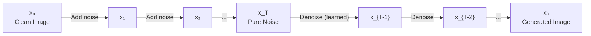
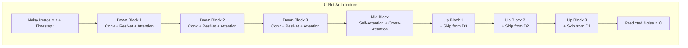
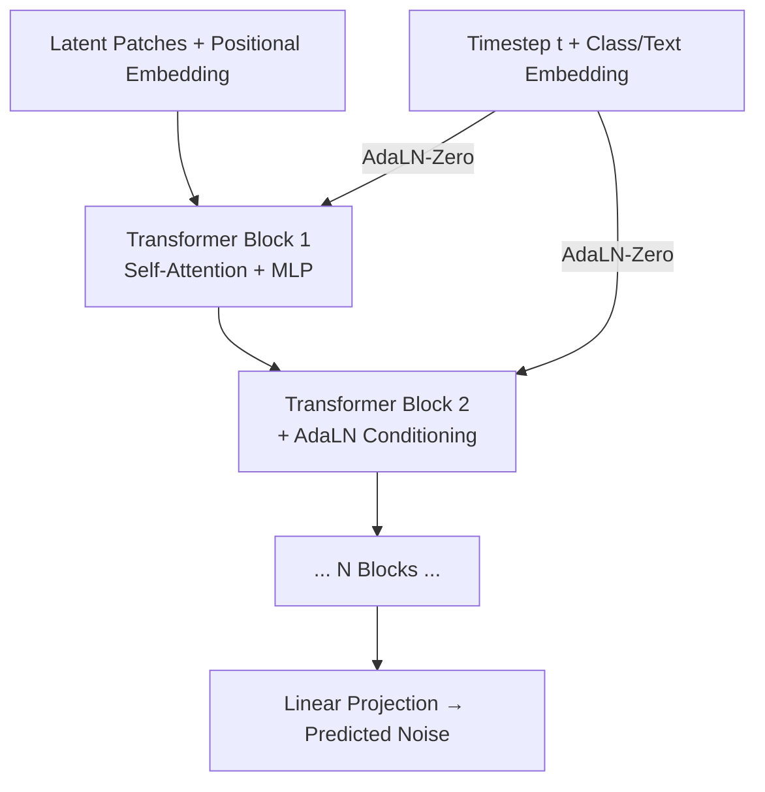
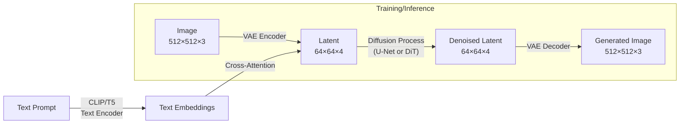
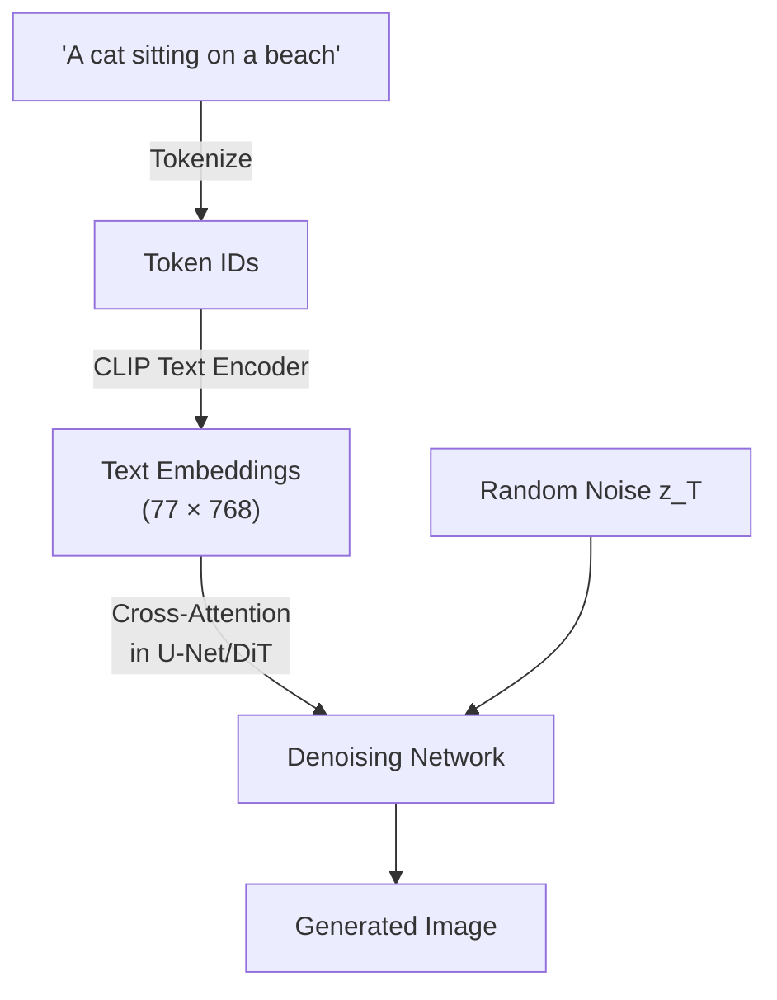
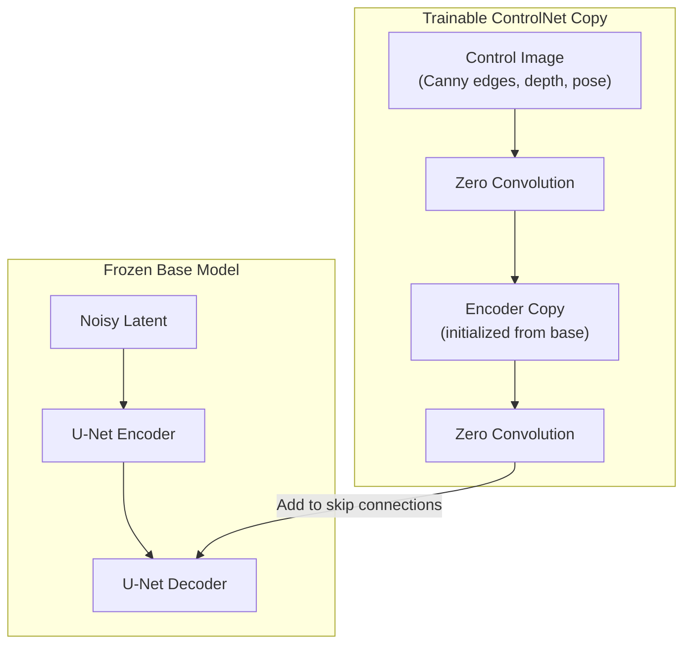
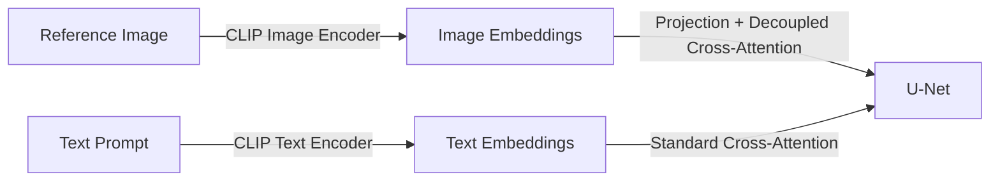
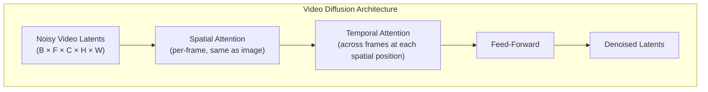

# Diffusion Models

Generative models that learn to denoise data — the foundation of modern image, video, and audio generation.

---

## Forward & Reverse Process

The core idea: systematically destroy data by adding noise (forward process), then train a neural network to reverse the destruction (reverse process).



### DDPM (Denoising Diffusion Probabilistic Models)

The foundational paper (Ho et al., 2020) that made diffusion models practical.

**Forward process** — a fixed Markov chain that adds Gaussian noise over T steps:

```
q(x_t | x_{t-1}) = N(x_t; sqrt(1 - β_t) * x_{t-1}, β_t * I)
```

Where `β_t` is a variance schedule (small values, e.g., 0.0001 to 0.02).

**Key shortcut** — you can jump directly to any timestep `t` without iterating:

```
q(x_t | x_0) = N(x_t; sqrt(ᾱ_t) * x_0, (1 - ᾱ_t) * I)
```

Where `α_t = 1 - β_t` and `ᾱ_t = α_1 * α_2 * ... * α_t` (cumulative product).

In practice, sampling `x_t` directly:

```
x_t = sqrt(ᾱ_t) * x_0 + sqrt(1 - ᾱ_t) * ε,  where ε ~ N(0, I)
```

**Reverse process** — a learned Markov chain that denoises:

```
p_θ(x_{t-1} | x_t) = N(x_{t-1}; μ_θ(x_t, t), σ_t² * I)
```

The neural network predicts the noise `ε_θ(x_t, t)` added at each step, then `μ_θ` is derived from it.

**Training objective** — simplified to a noise-prediction MSE loss:

```
L_simple = E[||ε - ε_θ(x_t, t)||²]
```

Where `ε` is the actual noise added and `ε_θ` is the model's prediction.

### Training Loop (Pseudocode)

```python
import torch
import torch.nn.functional as F

def train_step(model, x_0, noise_scheduler):
    """One DDPM training step."""
    # 1. Sample a random timestep for each image in the batch
    t = torch.randint(0, T, (x_0.shape[0],), device=x_0.device)

    # 2. Sample random noise
    epsilon = torch.randn_like(x_0)

    # 3. Create noisy image using the closed-form forward process
    alpha_bar_t = noise_scheduler.alpha_bar[t]  # cumulative product
    x_t = (
        torch.sqrt(alpha_bar_t).view(-1, 1, 1, 1) * x_0
        + torch.sqrt(1 - alpha_bar_t).view(-1, 1, 1, 1) * epsilon
    )

    # 4. Predict the noise
    epsilon_pred = model(x_t, t)

    # 5. Compute the simple loss
    loss = F.mse_loss(epsilon_pred, epsilon)
    return loss
```

### Prediction Targets

| Target | Predicts | Use Case |
|--------|----------|----------|
| **Epsilon (noise)** | The noise `ε` added to the image | Original DDPM, most common |
| **x_0 (clean image)** | The original clean image directly | Used in some latent diffusion setups |
| **v-prediction** | `v = sqrt(ᾱ_t) * ε - sqrt(1 - ᾱ_t) * x_0` | Better for high-resolution, used in SDXL |

---

## Key Architectures

### U-Net (Original Backbone)

The standard architecture for diffusion models. An encoder-decoder CNN with skip connections, augmented with attention layers and timestep conditioning.



| Component | Purpose |
|-----------|---------|
| **ResNet blocks** | Feature extraction at each resolution level |
| **Self-attention** | Capture global spatial dependencies |
| **Cross-attention** | Inject conditioning (text embeddings, class labels) |
| **Timestep embedding** | Sinusoidal embedding of `t`, added to each block via FiLM or addition |
| **Skip connections** | Preserve fine-grained details from encoder to decoder |

### DiT (Diffusion Transformer)

Replaces U-Net entirely with a Vision Transformer (Peebles & Xie, 2023). Used in Sora, Stable Diffusion 3, and FLUX.



| Aspect | U-Net | DiT |
|--------|-------|-----|
| **Architecture** | CNN + attention hybrid | Pure transformer |
| **Scaling** | Harder to scale cleanly | Scales like LLMs (more params = better) |
| **Conditioning** | Cross-attention + addition | AdaLN-Zero (adaptive layer norm) |
| **Compute** | More efficient at lower resolutions | Better at higher resolutions with more data |
| **Used in** | SD 1.5, SD 2.x, SDXL | SD 3, FLUX, Sora |

**AdaLN-Zero** — instead of cross-attention, the conditioning signal modulates layer norm parameters (scale and shift), with outputs initialized to zero for stable training.

### Latent Diffusion (Stable Diffusion)

Key insight: run the diffusion process in a compressed latent space rather than pixel space. This dramatically reduces compute.



| Component | Role | Details |
|-----------|------|---------|
| **VAE** | Compress/decompress images | Typically 8x spatial downsampling (512 -> 64) |
| **U-Net / DiT** | Denoise in latent space | Much cheaper than pixel-space diffusion |
| **Text Encoder** | Encode prompts | CLIP (SD 1.x/2.x), CLIP + OpenCLIP (SDXL), CLIP + T5 (SD3) |

**Why latent space?** A 512x512x3 image has ~786K values. The 64x64x4 latent has ~16K values — a **48x reduction** in the number of elements the diffusion model processes, with minimal perceptual loss thanks to the VAE.

### Classifier-Free Guidance (CFG)

The single most important technique for controlling generation quality. Trains a single model that can be both conditional and unconditional by randomly dropping the conditioning during training.

**At inference**, the prediction is interpolated:

```
ε_guided = ε_uncond + w * (ε_cond - ε_uncond)
```

Where `w` is the **guidance scale** (typically 5-15).

| Guidance Scale | Effect |
|----------------|--------|
| `w = 1.0` | No guidance (raw model output) |
| `w = 3-5` | Mild guidance, more diverse outputs |
| `w = 7-8` | Standard, good quality-diversity balance |
| `w = 12-20` | Strong guidance, high fidelity but saturated/less diverse |
| `w > 20` | Over-saturated, artifacts |

```python
def guided_sampling(model, x_t, t, text_embedding, guidance_scale=7.5):
    """Classifier-free guidance at inference time."""
    # Unconditional prediction (empty/null prompt)
    epsilon_uncond = model(x_t, t, null_embedding)

    # Conditional prediction (actual prompt)
    epsilon_cond = model(x_t, t, text_embedding)

    # Guided prediction: amplify the difference
    epsilon_guided = epsilon_uncond + guidance_scale * (epsilon_cond - epsilon_uncond)
    return epsilon_guided
```

**Training trick:** During training, randomly replace the text conditioning with a null embedding (e.g., empty string) with probability ~10%. This teaches the model to generate both conditionally and unconditionally.

---

## Samplers & Scheduling

### Sampler Comparison

The sampler determines how to step from pure noise to a clean image during inference. Different samplers trade off speed, quality, and determinism.

| Sampler | Steps Needed | Deterministic? | Key Idea |
|---------|-------------|----------------|----------|
| **DDPM** | ~1000 | No (stochastic) | Original sampler, one step per timestep |
| **DDIM** | 20-50 | Yes | Rewrite reverse process as non-Markovian, skip steps |
| **Euler** | 20-30 | Yes | Treat as ODE, solve with Euler method |
| **Euler Ancestral** | 20-30 | No | Euler + injected noise per step |
| **DPM-Solver** | 15-25 | Yes | Higher-order ODE solver, exponential integrator |
| **DPM-Solver++** | 15-20 | Yes | Improved DPM-Solver, state of the art for few steps |
| **UniPC** | 10-15 | Yes | Unified predictor-corrector, very fast convergence |
| **LCM** | 2-8 | Yes | Distilled model, consistency training |

### DDPM vs DDIM

**DDPM (Denoising Diffusion Probabilistic Model)**
- Stochastic: each step adds a small amount of noise
- Requires all T steps (typically 1000)
- Higher diversity in outputs

**DDIM (Denoising Diffusion Implicit Model)**
- Rewrites the reverse process as a deterministic ODE
- Can skip steps: use a subsequence of [1, ..., T] (e.g., 50 steps instead of 1000)
- Same input noise yields the same output (useful for interpolation and editing)
- Controlled stochasticity via `η` parameter: `η = 0` is deterministic, `η = 1` is DDPM

```python
def ddim_step(model, x_t, t, t_prev, eta=0.0):
    """One DDIM sampling step."""
    # Predict noise
    eps_pred = model(x_t, t)

    # Predict x_0 from x_t and predicted noise
    alpha_bar_t = scheduler.alpha_bar[t]
    alpha_bar_prev = scheduler.alpha_bar[t_prev]

    x0_pred = (x_t - torch.sqrt(1 - alpha_bar_t) * eps_pred) / torch.sqrt(alpha_bar_t)

    # DDIM sigma (eta=0 -> deterministic)
    sigma = eta * torch.sqrt((1 - alpha_bar_prev) / (1 - alpha_bar_t)) * torch.sqrt(1 - alpha_bar_t / alpha_bar_prev)

    # Direction pointing to x_t
    dir_xt = torch.sqrt(1 - alpha_bar_prev - sigma**2) * eps_pred

    # Compute x_{t-1}
    x_prev = torch.sqrt(alpha_bar_prev) * x0_pred + dir_xt + sigma * torch.randn_like(x_t)
    return x_prev
```

### Noise Schedules

The noise schedule `β_t` controls how quickly noise is added during the forward process, which directly affects generation quality.

| Schedule | Formula | Behavior |
|----------|---------|----------|
| **Linear** | `β_t = β_min + (β_max - β_min) * t/T` | Uniform noise increase; too aggressive at end for high-res |
| **Cosine** | `ᾱ_t = cos²((t/T + s) / (1 + s) * π/2)` | Gentler; preserves more signal at later steps; better for high-res |
| **Scaled Linear** | Linear schedule scaled to latent space | Used in Stable Diffusion 1.x/2.x |
| **Shifted (RF)** | Flow-matching log-normal with resolution shift | Used in SD3 / FLUX; adapts schedule to resolution |

**Cosine schedule** (Nichol & Dhariwal, 2021) is preferred for most use cases because linear schedules destroy too much information too early at high resolutions, leaving the model with pure noise for too many of the later timesteps.

---

## Conditioning

### Text-to-Image: CLIP Text Encoder + Cross-Attention

The standard pipeline for injecting text prompts into the diffusion process.



**How cross-attention works in the diffusion model:**

```
Q = W_q * spatial_features    # from the image latent
K = W_k * text_embeddings     # from CLIP
V = W_v * text_embeddings     # from CLIP
Attention = softmax(Q * K^T / sqrt(d)) * V
```

Each spatial position in the latent attends to all text tokens, allowing the model to learn which words correspond to which spatial regions.

| Model | Text Encoder(s) | Max Token Length |
|-------|-----------------|------------------|
| SD 1.x | CLIP ViT-L/14 | 77 |
| SD 2.x | OpenCLIP ViT-H/14 | 77 |
| SDXL | CLIP ViT-L + OpenCLIP ViT-bigG | 77 (concatenated embeddings) |
| SD 3 / FLUX | CLIP ViT-L + OpenCLIP ViT-bigG + T5-XXL | 77 + 256 (T5) |

**Why T5?** CLIP's text encoder is trained on short image-caption pairs and struggles with complex compositional prompts. T5 is a full language model that better understands spatial relationships, counting, and attributes.

### ControlNet

Adds spatial conditioning (edges, depth maps, pose skeletons) to a pretrained diffusion model **without retraining** the base model.



| Control Type | Input | Use Case |
|-------------|-------|----------|
| **Canny edges** | Edge-detected image | Preserve structure/layout |
| **Depth map** | MiDaS or Zoe depth | Maintain 3D spatial arrangement |
| **OpenPose** | Skeleton keypoints | Control human pose |
| **Segmentation map** | Semantic labels | Control object placement |
| **Normal map** | Surface normals | Control surface lighting/geometry |
| **Scribble** | Hand-drawn sketch | Loose artistic guidance |

**Zero convolution** — convolution layers initialized with zero weights and biases. This ensures the ControlNet adds zero contribution at the start of training, so the pretrained model is not disrupted. Gradually learns to inject the control signal.

### IP-Adapter (Image Prompt Adapter)

Uses an image as a prompt instead of (or alongside) text. Extracts image features via a CLIP image encoder and injects them through a decoupled cross-attention mechanism.



Key design: IP-Adapter adds a **separate cross-attention layer** for image features rather than concatenating with text features. This prevents interference between text and image conditioning and allows independent scaling of each.

### Inpainting, Outpainting, and img2img

| Technique | How It Works | Input |
|-----------|-------------|-------|
| **img2img** | Start from a partially noised version of input image instead of pure noise | Image + prompt + strength (0-1) |
| **Inpainting** | Denoise only masked region; keep unmasked pixels from original | Image + mask + prompt |
| **Outpainting** | Extend the canvas; mask is the new region | Image + extended canvas + prompt |

**img2img strength** controls how much noise is added to the input image. At `strength=0.3`, only 30% of the diffusion steps are run (starting from lightly noised input), preserving most of the original. At `strength=1.0`, the input is fully noised and the result is entirely new.

```python
def img2img(model, scheduler, input_image, prompt_embedding, strength=0.75, num_steps=50):
    """Simplified img2img pipeline."""
    # Encode image to latent space
    latent = vae.encode(input_image)

    # Determine starting timestep based on strength
    start_step = int(num_steps * (1 - strength))
    t_start = scheduler.timesteps[start_step]

    # Add noise to the latent up to t_start
    noise = torch.randn_like(latent)
    noisy_latent = scheduler.add_noise(latent, noise, t_start)

    # Denoise from t_start (not from T)
    for t in scheduler.timesteps[start_step:]:
        noise_pred = model(noisy_latent, t, prompt_embedding)
        noisy_latent = scheduler.step(noise_pred, t, noisy_latent)

    # Decode back to pixel space
    return vae.decode(noisy_latent)
```

---

## Video & Audio Generation

### Video Diffusion

Video diffusion models extend image diffusion by adding **temporal attention layers** to handle the time dimension.



| Model | Architecture | Key Innovation |
|-------|-------------|----------------|
| **Sora** (OpenAI) | DiT (Spacetime patches) | Treats video as spacetime patches; variable duration/resolution |
| **Runway Gen-3** | Temporal U-Net | Fine-grained motion control |
| **Stable Video Diffusion** | Temporal layers on SD | Finetuned from image model; image-to-video |
| **Kling / Veo** | DiT variants | Long-form coherent video |

**Key challenges in video diffusion:**

| Challenge | Solution |
|-----------|----------|
| **Temporal consistency** | Temporal attention + shared noise across frames |
| **Compute cost** | Latent space diffusion + temporal compression |
| **Motion coherence** | Temporal convolutions + optical flow conditioning |
| **Long video** | Autoregressive chunk generation with overlap |

**Spacetime patches (Sora approach):** Instead of treating video as a sequence of image frames, compress the video into spacetime patches (e.g., 2 frames x 16 x 16 pixels = 1 patch). A DiT processes these patches with full spacetime attention, enabling the model to reason about motion natively.

### Audio Diffusion

Diffusion models for audio typically operate on spectrograms (mel-spectrograms) or learned audio latents.

| Model | Approach | Output |
|-------|----------|--------|
| **Stable Audio** | Latent diffusion on audio VAE latents | Music and sound effects |
| **AudioLDM 2** | Latent diffusion with CLAP conditioning | Text-to-audio |
| **Riffusion** | Diffusion on mel-spectrograms (treated as images) | Music (spectrogram-to-waveform via Griffin-Lim/vocoder) |
| **MusicGen** (Meta) | Autoregressive transformer (not diffusion) | Music with text/melody conditioning |

**Pipeline:** Text prompt -> CLAP/T5 text encoder -> Latent diffusion on audio latents -> VAE decoder -> Waveform (vocoder)

---

## Inference Optimization

Practical techniques for speeding up diffusion model inference in production.

| Technique | Speedup | Quality Impact | How |
|-----------|---------|----------------|-----|
| **Fewer steps** | 2-10x | Slight degradation | Use DPM-Solver++ or UniPC (15-20 steps vs 1000) |
| **Distillation** | 10-50x | Minimal | Train student model to match teacher in fewer steps (LCM, SDXL-Turbo) |
| **Consistency Models** | 100-500x | Some loss | Single-step generation by training for self-consistency |
| **Torch compile** | 1.5-2x | None | JIT compilation of the U-Net/DiT |
| **xFormers / Flash Attention** | 1.5-3x | None | Memory-efficient attention implementations |
| **FP16 / BF16** | 1.5-2x | Negligible | Half-precision inference |
| **Model pruning/quantization** | 1.5-3x | Slight | INT8/INT4 quantization of weights |
| **Batched CFG** | ~2x | None | Run conditional and unconditional predictions in a single batch |

**Latent Consistency Models (LCM):** Distill a diffusion model so it can generate high-quality images in 2-8 steps instead of 20-50. Uses consistency distillation — the student is trained so that predictions from any timestep map to the same final output.

---

## Common Interview Questions

**Q1: How does classifier-free guidance work and why is it so important?**

During training, the conditioning (e.g., text) is randomly dropped with ~10% probability, so the model learns both conditional p(x|c) and unconditional p(x) generation. At inference, the guided prediction is: `ε_guided = ε_uncond + w * (ε_cond - ε_uncond)`. The guidance scale `w` amplifies the difference between conditional and unconditional predictions, pushing the output toward higher-likelihood samples for the given condition. This is critical because without it, generations are blurry and ignore prompts. With `w=7-8`, outputs are sharp and prompt-adherent.

**Q2: Why use latent diffusion instead of pixel-space diffusion?**

Pixel-space diffusion operates on full-resolution images (e.g., 512x512x3 = 786K dimensions), making it extremely compute-intensive. Latent diffusion first compresses images to a lower-dimensional latent space via a pretrained VAE (e.g., 64x64x4 = 16K dimensions), then runs the diffusion process there. This gives a ~48x reduction in dimensionality with minimal perceptual loss. The VAE handles pixel-level details while the diffusion model focuses on semantic composition, which is a more efficient division of labor.

**Q3: How do you speed up diffusion model inference?**

Three levels: (1) Better samplers — DDIM, DPM-Solver++, or UniPC can match DDPM quality in 15-25 steps instead of 1000. (2) Distillation — train a student model to match the teacher in fewer steps; LCM achieves 2-8 steps, SDXL-Turbo achieves 1-4 steps via adversarial distillation. (3) Systems optimization — FP16/BF16 precision, torch.compile, Flash Attention, model quantization (INT8), and batching the CFG forward passes.

**Q4: What is the difference between DDPM and DDIM sampling?**

DDPM is stochastic — each denoising step injects noise, and it requires all T (typically 1000) steps. DDIM reformulates the reverse process as a deterministic ODE, allowing step-skipping (50 steps is common) and producing deterministic outputs (same seed = same image). DDIM also enables smooth latent-space interpolation between images since the mapping from noise to image is deterministic.

**Q5: How does ControlNet preserve the pretrained model's capabilities?**

ControlNet creates a trainable copy of the encoder blocks and connects it to the frozen base model via zero convolutions (weights initialized to zero). At the start of training, the ControlNet contributes nothing, so the base model is undisturbed. During training, only the copy and zero convolutions are updated. This preserves the base model's generation quality while learning to follow spatial conditioning signals. The approach is modular — you can swap ControlNets at inference time.

**Q6: How do video diffusion models maintain temporal consistency?**

Three main mechanisms: (1) Temporal attention layers — at each spatial position, features attend across frames, learning motion patterns. (2) Shared noise initialization — using correlated noise across frames rather than independent noise per frame. (3) Temporal convolutions — 3D convolutions that operate across the time dimension. Advanced models like Sora use spacetime patches in a DiT, treating video as a unified spacetime signal rather than a sequence of independent images, which naturally captures motion.
