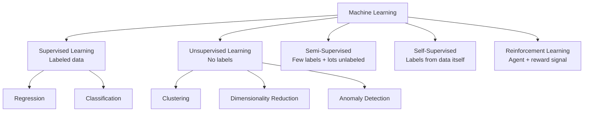
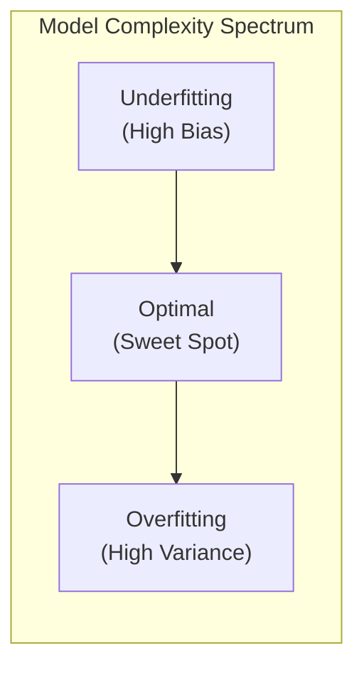
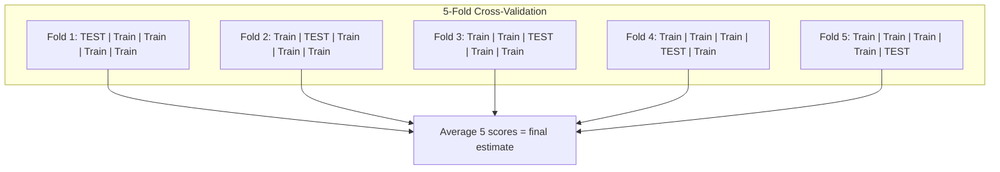
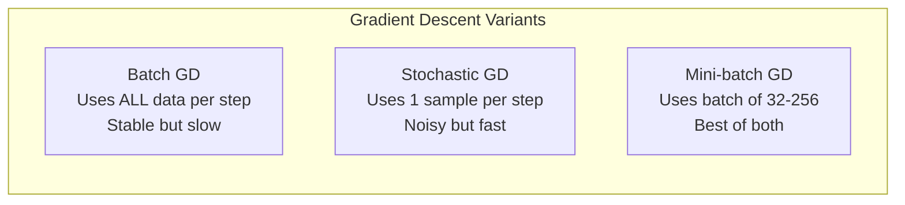

# ML Basics

Core machine learning concepts, algorithms, and mathematical foundations — the building blocks for every AI engineering interview.

---

## Learning Paradigms



| Paradigm | Data | Goal | Examples |
|----------|------|------|----------|
| **Supervised** | Labeled $(x, y)$ pairs | Learn mapping $f(x) \to y$ | Spam detection, house price prediction |
| **Unsupervised** | Unlabeled $x$ only | Find structure / patterns | Customer segmentation, PCA, autoencoders |
| **Semi-supervised** | Small labeled + large unlabeled | Leverage unlabeled data to improve | Label propagation, pseudo-labeling |
| **Self-supervised** | Create labels from data | Learn representations without manual labels | Masked language modeling (BERT), contrastive learning (SimCLR) |
| **Reinforcement learning** | Agent interacts with environment | Maximize cumulative reward | Game AI, robotics, RLHF for LLMs |

### Supervised Learning

The model learns from input-output pairs. Given training data $\{(x_1, y_1), \ldots, (x_n, y_n)\}$, find $f$ that minimizes prediction error.

- **Classification**: Discrete output — spam/not-spam, image categories. Metrics: accuracy, precision, recall, F1, AUC-ROC.
- **Regression**: Continuous output — house price, temperature. Metrics: MSE, MAE, R-squared.

### Unsupervised Learning

No target variable. The model discovers hidden structure.

- **Clustering**: Group similar data points (K-Means, DBSCAN, hierarchical).
- **Dimensionality reduction**: Compress features while preserving information (PCA, t-SNE, UMAP).
- **Anomaly detection**: Find outliers (Isolation Forest, one-class SVM).

### Semi-Supervised Learning

Real-world scenario: labeling is expensive, unlabeled data is abundant. Strategies:

1. **Pseudo-labeling** — train on labeled data, predict on unlabeled, use high-confidence predictions as new labels.
2. **Consistency regularization** — model should produce same output for augmented versions of same input.
3. **Co-training** — train two models on different feature subsets, each labels data for the other.

### Self-Supervised Learning

Create a "pretext task" where labels come from the data itself:

- **Masked Language Modeling** (BERT): mask 15% of tokens, predict them.
- **Next Token Prediction** (GPT): predict the next token in a sequence.
- **Contrastive Learning** (SimCLR): pull augmented views of same image together, push different images apart.

This is the foundation of modern foundation models — pre-train with self-supervision, then fine-tune on downstream tasks.

### Reinforcement Learning

The agent takes actions in an environment to maximize cumulative reward.

| Component | Description |
|-----------|-------------|
| **State (s)** | Current situation of the agent |
| **Action (a)** | What the agent can do |
| **Reward (r)** | Scalar feedback signal |
| **Policy (pi)** | Strategy mapping states to actions |
| **Value function $V(s)$** | Expected cumulative reward from state $s$ |

**RLHF context**: In LLM alignment, a reward model is trained from human preference data, then the language model policy is optimized using PPO (Proximal Policy Optimization) to maximize that reward while staying close to the base model (KL penalty).

---

## Core Algorithms

### Linear Regression

Fit a linear function to continuous data:

$$y = w^T x + b$$

**Objective**: Minimize Mean Squared Error (MSE):

$$L(w) = \frac{1}{n} \sum_{i=1}^{n} (y_i - w^T x_i - b)^2$$

**Closed-form solution** (Normal Equation):

$$w = (X^T X)^{-1} X^T y$$

**When to use**: Linear relationships, interpretability matters, baseline model.

```python
import numpy as np
from sklearn.linear_model import LinearRegression

# Closed-form implementation from scratch
class LinearRegressionScratch:
    def fit(self, X, y):
        # Add bias column
        X_b = np.c_[np.ones(X.shape[0]), X]
        # Normal equation: w = (X^T X)^(-1) X^T y
        self.w = np.linalg.pinv(X_b.T @ X_b) @ X_b.T @ y
        return self

    def predict(self, X):
        X_b = np.c_[np.ones(X.shape[0]), X]
        return X_b @ self.w

# Using scikit-learn
model = LinearRegression()
model.fit(X_train, y_train)
predictions = model.predict(X_test)
print(f"R^2 score: {model.score(X_test, y_test):.4f}")
```

### Logistic Regression

Linear model for **classification**. Applies sigmoid to map output to $[0, 1]$:

$$P(y=1|x) = \sigma(w^T x + b) = \frac{1}{1 + e^{-(w^T x + b)}}$$

**Objective**: Minimize Binary Cross-Entropy Loss:

$$L = -\frac{1}{n} \sum_{i=1}^{n} \left[ y_i \log(p_i) + (1 - y_i) \log(1 - p_i) \right]$$

Why cross-entropy and not MSE? MSE with sigmoid creates a non-convex loss surface; cross-entropy is convex, ensuring a single global minimum.

```python
from sklearn.linear_model import LogisticRegression
from sklearn.metrics import classification_report

model = LogisticRegression(penalty='l2', C=1.0, max_iter=1000)
model.fit(X_train, y_train)
y_pred = model.predict(X_test)
print(classification_report(y_test, y_pred))

# Access probabilities (useful for threshold tuning)
y_proba = model.predict_proba(X_test)[:, 1]
```

### Decision Trees & Random Forests

**Decision Tree**: Recursively split data by features to minimize impurity.

Splitting criteria:

- **Information Gain** (entropy-based):

$$IG = H(parent) - \sum w_i \cdot H(child_i) \quad \text{where} \quad H = -\sum p_i \log_2(p_i)$$

- **Gini Impurity** — probability of misclassifying a random sample:

$$Gini = 1 - \sum p_i^2$$

**Random Forest**: Ensemble of decision trees using **bagging** (bootstrap aggregating).

1. Sample $n$ bootstrap datasets (sample with replacement).
2. Train one tree per sample, at each split consider a random subset of $\sqrt{d}$ features.
3. Aggregate: majority vote (classification) or average (regression).

```python
from sklearn.ensemble import RandomForestClassifier
import pandas as pd

model = RandomForestClassifier(
    n_estimators=200,        # number of trees
    max_depth=10,            # limit tree depth to reduce overfitting
    min_samples_leaf=5,      # minimum samples per leaf
    max_features='sqrt',     # features per split
    n_jobs=-1                # parallelize
)
model.fit(X_train, y_train)

# Feature importance — one of the biggest advantages
importance = pd.Series(model.feature_importances_, index=feature_names)
print(importance.sort_values(ascending=False).head(10))
```

| Aspect | Decision Tree | Random Forest |
|--------|--------------|---------------|
| Bias | Low | Low |
| Variance | High (overfits) | Low (averaging reduces variance) |
| Interpretability | High (single tree) | Medium (feature importance) |
| Training speed | Fast | Slower (many trees) |
| Handles missing data | Yes (some implementations) | Yes |

### Gradient Boosting (XGBoost, LightGBM, CatBoost)

Build trees **sequentially** — each new tree corrects the errors of the ensemble so far.

**Key idea**: Fit the new model to the **negative gradient** (residuals) of the loss function:

1. Initialize with a constant prediction (e.g., mean).
2. For each round $m = 1..M$:
   - Compute pseudo-residuals: $r_i = -\frac{\partial L}{\partial f(x_i)}$
   - Fit a tree $h_m$ to the residuals.
   - Update model: $F_m(x) = F_{m-1}(x) + \eta \cdot h_m(x)$

```python
import xgboost as xgb
from sklearn.model_selection import GridSearchCV

model = xgb.XGBClassifier(
    n_estimators=500,
    max_depth=6,
    learning_rate=0.1,        # shrinkage — smaller = more trees needed but better generalization
    subsample=0.8,            # row sampling per tree
    colsample_bytree=0.8,    # column sampling per tree
    reg_alpha=0.1,            # L1 regularization
    reg_lambda=1.0,           # L2 regularization
    eval_metric='logloss',
    early_stopping_rounds=20  # stop if no improvement for 20 rounds
)

model.fit(
    X_train, y_train,
    eval_set=[(X_val, y_val)],
    verbose=50
)
```

| Library | Strengths |
|---------|-----------|
| **XGBoost** | Mature, regularization built-in, handles sparse data |
| **LightGBM** | Faster training (leaf-wise growth), lower memory, handles large datasets |
| **CatBoost** | Native categorical feature support, ordered boosting reduces target leakage |

**Random Forest vs Gradient Boosting — when to use which?**

| Factor | Random Forest | Gradient Boosting |
|--------|--------------|-------------------|
| Tuning effort | Low (works well out of the box) | High (many hyperparameters) |
| Overfitting risk | Lower (independent trees) | Higher (sequential, memorizes) |
| Performance ceiling | Good | Often better (wins Kaggle) |
| Training parallelism | Fully parallel | Sequential (trees depend on prior) |
| Noisy data | More robust | Can overfit noise |

### Support Vector Machines (SVMs)

**Goal**: Find the hyperplane that maximizes the **margin** between classes.

**Hard margin** (linearly separable): maximize $\frac{2}{\|w\|}$ subject to $y_i(w^T x_i + b) \geq 1$

**Soft margin** (real data): allow some misclassifications with slack variables $\xi_i$:

$$\min \frac{1}{2} \|w\|^2 + C \sum \xi_i$$

**Kernel Trick**: Map data to higher-dimensional space without computing the transformation explicitly. The kernel function computes $K(x_i, x_j) = \phi(x_i)^T \phi(x_j)$ directly.

| Kernel | Formula | Use case |
|--------|---------|----------|
| Linear | $x_i^T x_j$ | High-dimensional data (text) |
| RBF (Gaussian) | $\exp(-\gamma \|x_i - x_j\|^2)$ | Default choice, non-linear boundaries |
| Polynomial | $(\gamma \cdot x_i^T x_j + r)^d$ | Image features |

```python
from sklearn.svm import SVC
from sklearn.preprocessing import StandardScaler

# SVMs are sensitive to feature scale — always normalize
scaler = StandardScaler()
X_train_scaled = scaler.fit_transform(X_train)
X_test_scaled = scaler.transform(X_test)

model = SVC(
    kernel='rbf',
    C=1.0,          # regularization: smaller C = wider margin, more misclassifications allowed
    gamma='scale',  # kernel coefficient
    probability=True  # enable predict_proba (slower training)
)
model.fit(X_train_scaled, y_train)
```

**Support vectors**: Only the data points closest to the decision boundary matter. Removing non-support-vector points does not change the model.

### K-Nearest Neighbors (KNN)

**Non-parametric, lazy learner** — no training phase; stores all data and classifies at prediction time.

**Algorithm**: For a new point, find the `k` closest training points and take majority vote (classification) or average (regression).

**Distance metrics**:
- Euclidean: $\sqrt{\sum (x_i - y_i)^2}$ — default, assumes equal feature importance.
- Manhattan: $\sum |x_i - y_i|$ — better for high-dimensional sparse data.
- Cosine: $1 - \frac{x \cdot y}{\|x\| \cdot \|y\|}$ — used for text/embeddings.

**Curse of dimensionality**: In high dimensions, all points become equidistant. KNN degrades badly when $d > \sim 20$. Solutions: dimensionality reduction (PCA) or use approximate nearest neighbors (FAISS, Annoy).

```python
from sklearn.neighbors import KNeighborsClassifier

model = KNeighborsClassifier(
    n_neighbors=5,
    weights='distance',    # weight closer neighbors more
    metric='minkowski', p=2  # Euclidean
)
model.fit(X_train_scaled, y_train)
```

### Naive Bayes

**Bayes' theorem**:

$$P(y|x) = \frac{P(x|y) \cdot P(y)}{P(x)}$$

**Naive assumption**: Features are **conditionally independent** given the class:

$$P(x_1, x_2, \ldots, x_d | y) = \prod_{i=1}^{d} P(x_i | y)$$

This assumption is almost never true, yet Naive Bayes works surprisingly well for:
- Text classification (spam, sentiment) — bag-of-words features are approximately independent
- High-dimensional data — avoids curse of dimensionality
- Small training sets — few parameters to estimate

| Variant | Feature type | Likelihood |
|---------|-------------|------------|
| **GaussianNB** | Continuous | $P(x_i \mid y) \sim \mathcal{N}(\mu, \sigma^2)$ |
| **MultinomialNB** | Counts / frequencies | $P(x_i \mid y) \sim \text{Multinomial}$ (word counts) |
| **BernoulliNB** | Binary | $P(x_i \mid y) \sim \text{Bernoulli}$ (word presence) |

```python
from sklearn.naive_bayes import MultinomialNB
from sklearn.feature_extraction.text import TfidfVectorizer

vectorizer = TfidfVectorizer(max_features=10000)
X_train_tfidf = vectorizer.fit_transform(train_texts)
X_test_tfidf = vectorizer.transform(test_texts)

model = MultinomialNB(alpha=1.0)  # Laplace smoothing
model.fit(X_train_tfidf, y_train)
```

---

## Key Concepts

### Bias-Variance Tradeoff



$$\text{Total Error} = \text{Bias}^2 + \text{Variance} + \text{Irreducible Noise}$$

| Term | Meaning | Symptom |
|------|---------|---------|
| **Bias** | Error from wrong assumptions (model too simple) | High training error, high test error |
| **Variance** | Sensitivity to training data fluctuations (model too complex) | Low training error, high test error |
| **Irreducible noise** | Inherent randomness in data | Cannot be reduced by any model |

**Diagnosing**:
- **High bias** (underfitting): Training and validation errors are both high. Fix: more features, more complex model, less regularization.
- **High variance** (overfitting): Training error is low but validation error is high. Fix: more data, regularization, simpler model, dropout, ensemble.

```python
from sklearn.model_selection import learning_curve
import matplotlib.pyplot as plt

train_sizes, train_scores, val_scores = learning_curve(
    model, X, y, cv=5, train_sizes=np.linspace(0.1, 1.0, 10),
    scoring='accuracy'
)

# Plot learning curves to diagnose bias vs variance
plt.plot(train_sizes, train_scores.mean(axis=1), label='Training')
plt.plot(train_sizes, val_scores.mean(axis=1), label='Validation')
plt.xlabel('Training Set Size')
plt.ylabel('Accuracy')
plt.legend()
plt.title('Learning Curve — gap = variance, low overall = bias')
plt.show()
```

### Regularization

Penalize model complexity to prevent overfitting by adding a penalty term to the loss function.

$$L_{regularized} = L_{original} + \lambda \cdot R(w)$$

| Technique | Formula / Mechanism | Effect |
|-----------|-------------------|--------|
| **L1 (Lasso)** | $\lambda \sum \|w_i\|$ | Drives weights to exactly zero — **feature selection** |
| **L2 (Ridge)** | $\lambda \sum w_i^2$ | Shrinks weights toward zero — keeps all features but reduces magnitudes |
| **Elastic Net** | $\alpha \cdot L_1 + (1 - \alpha) \cdot L_2$ | Best of both — sparsity + grouping |
| **Dropout** | Randomly zero out neurons during training | Ensemble effect, prevents co-adaptation |
| **Early stopping** | Stop training when validation loss stops improving | Limits effective model complexity |
| **Weight decay** | Equivalent to L2 for SGD; slightly different for Adam (AdamW) | Decoupled regularization in AdamW |

**L1 vs L2 intuition**: L1 has diamond-shaped constraint region — solutions tend to hit corners (axis-aligned), zeroing out weights. L2 has circular constraint region — solutions spread weight evenly.

```python
from sklearn.linear_model import Lasso, Ridge, ElasticNet

# L1 — useful when you suspect many features are irrelevant
lasso = Lasso(alpha=0.01)
lasso.fit(X_train, y_train)
print(f"Non-zero coefficients: {(lasso.coef_ != 0).sum()} / {len(lasso.coef_)}")

# L2 — useful when all features may contribute
ridge = Ridge(alpha=1.0)
ridge.fit(X_train, y_train)

# Elastic Net — combine both
enet = ElasticNet(alpha=0.01, l1_ratio=0.5)
enet.fit(X_train, y_train)
```

### Cross-Validation

Estimate model performance on unseen data by systematically holding out portions of training data.



| Method | Description | When to use |
|--------|-------------|-------------|
| **K-Fold** | Split data into $k$ folds, rotate test fold | General purpose, $k=5$ or $k=10$ typical |
| **Stratified K-Fold** | Preserves class distribution in each fold | Imbalanced classification |
| **Leave-One-Out (LOO)** | $k = n$, test on each sample individually | Very small datasets (expensive) |
| **Time-Series Split** | Expanding window, never train on future data | Temporal data (finance, forecasting) |
| **Group K-Fold** | Ensures same group never in train and test | Data with groups (patients, users) |

```python
from sklearn.model_selection import cross_val_score, StratifiedKFold

cv = StratifiedKFold(n_splits=5, shuffle=True, random_state=42)
scores = cross_val_score(model, X, y, cv=cv, scoring='f1_macro')
print(f"F1: {scores.mean():.4f} +/- {scores.std():.4f}")

# Nested cross-validation for unbiased performance estimate with hyperparameter tuning
from sklearn.model_selection import GridSearchCV

inner_cv = StratifiedKFold(n_splits=3)
outer_cv = StratifiedKFold(n_splits=5)

param_grid = {'C': [0.1, 1, 10], 'kernel': ['rbf', 'linear']}
grid = GridSearchCV(SVC(), param_grid, cv=inner_cv, scoring='f1')
nested_scores = cross_val_score(grid, X, y, cv=outer_cv, scoring='f1')
print(f"Nested CV F1: {nested_scores.mean():.4f}")
```

**Common mistake**: Tuning hyperparameters on the same fold used for evaluation. This leaks information and gives an overoptimistic estimate. Use **nested cross-validation**: inner loop for tuning, outer loop for evaluation.

### Feature Engineering

The process of creating, transforming, and selecting features to improve model performance. Often matters more than algorithm choice.

**Feature Scaling**:

| Method | Formula | When to use |
|--------|---------|-------------|
| **StandardScaler** | $\frac{x - \mu}{\sigma}$ | Gaussian-distributed features, SVM, logistic regression |
| **MinMaxScaler** | $\frac{x - x_{min}}{x_{max} - x_{min}}$ | Bounded features, neural networks |
| **RobustScaler** | $\frac{x - \text{median}}{IQR}$ | Data with outliers |
| **Log transform** | $\log(1 + x)$ | Right-skewed distributions (income, counts) |

**Encoding Categorical Variables**:

| Method | Description | Cardinality | Risk |
|--------|-------------|-------------|------|
| **One-hot** | Binary column per category | Low (<20) | Sparse matrix for high cardinality |
| **Label encoding** | Integer per category | Any | Implies false ordinal relationship |
| **Target encoding** | Replace with mean target per category | High | Target leakage — use with CV or smoothing |
| **Frequency encoding** | Replace with count/frequency | High | Loses information about target |

**Feature Selection**:

```python
# 1. Filter method — correlation / mutual information
from sklearn.feature_selection import mutual_info_classif
mi_scores = mutual_info_classif(X, y)

# 2. Wrapper method — recursive feature elimination
from sklearn.feature_selection import RFE
selector = RFE(estimator=RandomForestClassifier(), n_features_to_select=20)
selector.fit(X, y)

# 3. Embedded method — L1 regularization or tree feature importance
from sklearn.feature_selection import SelectFromModel
selector = SelectFromModel(Lasso(alpha=0.01))
X_selected = selector.fit_transform(X, y)
```

### Handling Imbalanced Classes

When one class dominates (e.g., fraud detection: 99.5% legitimate, 0.5% fraud), accuracy is misleading.

| Strategy | How it works | Pros | Cons |
|----------|-------------|------|------|
| **Class weights** | Increase loss penalty for minority class | Simple, no data manipulation | May not be enough |
| **Oversampling (SMOTE)** | Generate synthetic minority samples by interpolating between neighbors | Increases minority representation | Can create noisy samples |
| **Undersampling** | Remove majority class samples | Faster training | Loses information |
| **Focal loss** | Down-weight easy (well-classified) examples: $FL = -\alpha (1-p)^\gamma \log(p)$ | Focuses on hard examples | Extra hyperparameter ($\gamma$) |
| **Threshold tuning** | Adjust classification threshold from 0.5 | Precision-recall tradeoff control | Requires probability calibration |

```python
# Class weights — built into most sklearn estimators
model = RandomForestClassifier(class_weight='balanced')

# SMOTE — synthetic oversampling
from imblearn.over_sampling import SMOTE
smote = SMOTE(random_state=42, sampling_strategy=0.5)
X_resampled, y_resampled = smote.fit_resample(X_train, y_train)

# Threshold tuning using precision-recall curve
from sklearn.metrics import precision_recall_curve
precisions, recalls, thresholds = precision_recall_curve(y_test, y_proba)

# Find threshold that gives desired recall (e.g., 90%)
target_recall = 0.9
idx = np.argmin(np.abs(recalls - target_recall))
best_threshold = thresholds[idx]
y_pred_tuned = (y_proba >= best_threshold).astype(int)
```

**Evaluation for imbalanced data**: Use precision, recall, F1, AUC-ROC, or AUC-PR (precision-recall curve) instead of accuracy. AUC-PR is preferred when the positive class is rare.

---

## Optimization

### Gradient Descent

Iteratively update parameters in the direction of steepest descent of the loss function:

$$w = w - \alpha \cdot \frac{\partial L}{\partial w}$$



| Variant | Batch size | Pros | Cons |
|---------|-----------|------|------|
| **Batch GD** | Entire dataset | Stable convergence, accurate gradient | Slow, high memory, gets stuck in local minima |
| **Stochastic GD (SGD)** | 1 sample | Fast updates, can escape local minima | Very noisy, unstable |
| **Mini-batch GD** | 32–256 typically | GPU-friendly, balanced noise/stability | Need to tune batch size |

**Learning rate matters because**:
- Too high: Overshoots minimum, loss diverges.
- Too low: Converges extremely slowly, may get stuck.
- Just right: Smooth convergence to good minimum.

```python
# Mini-batch gradient descent from scratch
def train_mini_batch_gd(X, y, lr=0.01, epochs=100, batch_size=32):
    n, d = X.shape
    w = np.zeros(d)
    b = 0.0
    losses = []

    for epoch in range(epochs):
        # Shuffle data each epoch
        indices = np.random.permutation(n)
        for start in range(0, n, batch_size):
            batch_idx = indices[start:start + batch_size]
            X_batch, y_batch = X[batch_idx], y[batch_idx]

            # Forward pass
            y_pred = X_batch @ w + b
            loss = np.mean((y_pred - y_batch) ** 2)

            # Compute gradients
            dw = (2 / len(y_batch)) * X_batch.T @ (y_pred - y_batch)
            db = (2 / len(y_batch)) * np.sum(y_pred - y_batch)

            # Update parameters
            w -= lr * dw
            b -= lr * db

        losses.append(loss)
    return w, b, losses
```

### Optimizers

Modern optimizers adapt the learning rate per parameter and use momentum to accelerate convergence.

| Optimizer | Key idea | Update rule (simplified) |
|-----------|----------|------------------------|
| **SGD + Momentum** | Accumulate velocity from past gradients | $v = \beta v + g;\; w = w - \alpha v$ |
| **RMSProp** | Adapt LR by dividing by running average of squared gradients | $s = \rho s + (1-\rho) g^2;\; w = w - \frac{\alpha \cdot g}{\sqrt{s + \epsilon}}$ |
| **Adam** | Momentum + RMSProp + bias correction | Combines first moment (mean) and second moment (variance) of gradients |
| **AdamW** | Adam with decoupled weight decay | Applies weight decay directly to weights, not through gradient |

**Adam** (Adaptive Moment Estimation) — the default optimizer for most deep learning:

$$m_t = \beta_1 \cdot m_{t-1} + (1 - \beta_1) \cdot g_t \quad \text{(first moment — mean)}$$

$$v_t = \beta_2 \cdot v_{t-1} + (1 - \beta_2) \cdot g_t^2 \quad \text{(second moment — variance)}$$

$$\hat{m}_t = \frac{m_t}{1 - \beta_1^t}, \quad \hat{v}_t = \frac{v_t}{1 - \beta_2^t} \quad \text{(bias correction)}$$

$$w = w - \alpha \cdot \frac{\hat{m}_t}{\sqrt{\hat{v}_t} + \epsilon} \quad \text{(update)}$$

Defaults: $\beta_1 = 0.9$, $\beta_2 = 0.999$, $\epsilon = 10^{-8}$

**AdamW** is preferred for training transformers because it decouples weight decay from the adaptive learning rate, leading to better generalization.

```python
import torch.optim as optim

# SGD with momentum
optimizer = optim.SGD(model.parameters(), lr=0.01, momentum=0.9, weight_decay=1e-4)

# Adam — good default
optimizer = optim.Adam(model.parameters(), lr=1e-3, betas=(0.9, 0.999))

# AdamW — preferred for transformers
optimizer = optim.AdamW(model.parameters(), lr=5e-5, weight_decay=0.01)
```

**Learning Rate Schedules**:

| Schedule | Behavior | Use case |
|----------|----------|----------|
| **Step decay** | Drop LR by factor every N epochs | CNNs, simple training |
| **Cosine annealing** | Smooth decrease following cosine curve | Transformers, long training |
| **Warmup + decay** | Linear warmup then decay | Transformer fine-tuning (avoids early instability) |
| **ReduceOnPlateau** | Reduce LR when validation loss stalls | Adaptive, good general purpose |
| **One-cycle** | Ramp up then ramp down LR | Fast convergence (super-convergence) |

```python
from torch.optim.lr_scheduler import CosineAnnealingLR, OneCycleLR

# Cosine annealing
scheduler = CosineAnnealingLR(optimizer, T_max=num_epochs, eta_min=1e-6)

# Warmup + cosine (common for transformer fine-tuning)
from transformers import get_cosine_schedule_with_warmup
scheduler = get_cosine_schedule_with_warmup(
    optimizer,
    num_warmup_steps=int(0.1 * total_steps),
    num_training_steps=total_steps
)
```

### Loss Functions

The loss function defines what the model optimizes. Choosing the right one is critical.

**Regression losses**:

| Loss | Formula | Properties |
|------|---------|-----------|
| **MSE** | $\frac{1}{n} \sum (y - \hat{y})^2$ | Penalizes large errors heavily (sensitive to outliers) |
| **MAE** | $\frac{1}{n} \sum \|y - \hat{y}\|$ | Robust to outliers, not differentiable at 0 |
| **Huber** | MSE when error $< \delta$, MAE otherwise | Best of both — smooth + robust |

**Classification losses**:

| Loss | Formula | Use case |
|------|---------|----------|
| **Binary Cross-Entropy** | $-[y \log(p) + (1-y) \log(1-p)]$ | Binary classification |
| **Categorical Cross-Entropy** | $-\sum y_k \log(p_k)$ | Multi-class classification |
| **Hinge Loss** | $\max(0, 1 - y \cdot f(x))$ | SVMs, max-margin classifiers |
| **Focal Loss** | $-\alpha (1-p)^\gamma \log(p)$ | Imbalanced classification ($\gamma=2$ typical) |

**Contrastive / similarity losses** (used in self-supervised and representation learning):

| Loss | Description |
|------|-------------|
| **Contrastive loss** | Pull positives together, push negatives apart by a margin |
| **Triplet loss** | $\max(0,\; d(a, p) - d(a, n) + \text{margin})$ |
| **InfoNCE / NT-Xent** | Softmax over similarities — used in CLIP, SimCLR |

```python
import torch
import torch.nn as nn

# Regression
mse_loss = nn.MSELoss()
huber_loss = nn.SmoothL1Loss(beta=1.0)

# Classification
bce_loss = nn.BCEWithLogitsLoss()  # includes sigmoid — numerically stable
ce_loss = nn.CrossEntropyLoss()    # includes softmax — takes raw logits

# Focal loss for imbalanced data (custom implementation)
class FocalLoss(nn.Module):
    def __init__(self, alpha=0.25, gamma=2.0):
        super().__init__()
        self.alpha = alpha
        self.gamma = gamma

    def forward(self, logits, targets):
        bce = nn.functional.binary_cross_entropy_with_logits(logits, targets, reduction='none')
        p = torch.sigmoid(logits)
        p_t = p * targets + (1 - p) * (1 - targets)
        focal_weight = (1 - p_t) ** self.gamma
        loss = self.alpha * focal_weight * bce
        return loss.mean()
```

---

## Common Interview Questions

**1. Explain the bias-variance tradeoff.**

Total prediction error decomposes into $\text{Bias}^2 + \text{Variance} + \text{Irreducible Noise}$. Bias is error from oversimplified assumptions (underfitting) — the model cannot capture the true pattern. Variance is error from sensitivity to training data fluctuations (overfitting) — the model memorizes noise. As model complexity increases, bias decreases but variance increases. The goal is to find the sweet spot. Regularization, cross-validation, and ensemble methods help navigate this tradeoff.

**2. When would you use L1 vs L2 regularization?**

Use **L1 (Lasso)** when you suspect many features are irrelevant and want automatic feature selection — L1 drives coefficients to exactly zero. Use **L2 (Ridge)** when all features likely contribute and you want to shrink weights uniformly without eliminating any. Use **Elastic Net** (L1 + L2) when features are correlated — L1 alone may arbitrarily select one from a group. In deep learning, L2 (weight decay) is standard; dropout provides a complementary regularization effect.

**3. How do you handle imbalanced datasets?**

Five strategies, often combined: (1) Use appropriate metrics — precision, recall, F1, AUC-PR instead of accuracy. (2) Class weights — increase the loss contribution of minority samples. (3) Resampling — SMOTE for oversampling or random undersampling. (4) Threshold tuning — adjust the decision threshold based on the precision-recall curve. (5) Specialized losses — focal loss down-weights easy examples. The best choice depends on the degree of imbalance and the cost asymmetry of false positives vs false negatives.

**4. Random Forest vs Gradient Boosting — when to use which?**

Random Forest trains trees **independently** (bagging) — lower variance, robust to noise, minimal tuning, naturally parallelizable. Gradient Boosting trains trees **sequentially** — each tree corrects prior errors, generally achieves higher accuracy but requires careful tuning (learning rate, depth, regularization) and is prone to overfitting. Use Random Forest as a strong baseline or when you have noisy data and limited tuning time. Use Gradient Boosting (XGBoost/LightGBM) when you need maximum predictive performance and can invest in hyperparameter optimization.

**5. Explain gradient descent and why learning rate matters.**

Gradient descent iteratively updates model parameters by moving in the direction opposite to the gradient of the loss function: $w = w - \alpha \cdot \frac{\partial L}{\partial w}$. The learning rate controls step size. Too large: the optimizer overshoots the minimum and the loss diverges. Too small: convergence is painfully slow and may get trapped in poor local minima. In practice, use adaptive optimizers (Adam) and learning rate schedules (warmup + cosine decay) to avoid manual tuning. Mini-batch gradient descent (batch size 32-256) balances computational efficiency with gradient noise that helps escape local minima.

**6. What is the kernel trick and why is it useful?**

The kernel trick allows SVMs to learn non-linear decision boundaries without explicitly computing high-dimensional feature transformations. Instead of mapping inputs to a high-dimensional space $\phi(x)$ and computing dot products $\phi(x_i)^T \phi(x_j)$, the kernel function $K(x_i, x_j)$ computes this dot product directly in the original space. The RBF kernel effectively maps to infinite dimensions. This is computationally efficient because the SVM optimization only requires pairwise dot products (the Gram matrix), not the explicit coordinates in the high-dimensional space.
