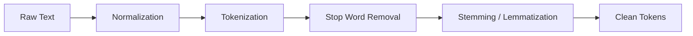
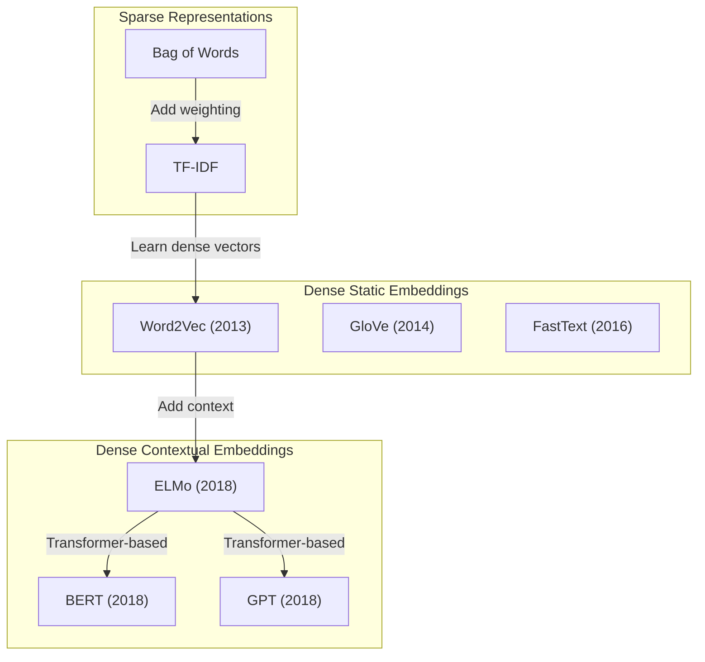
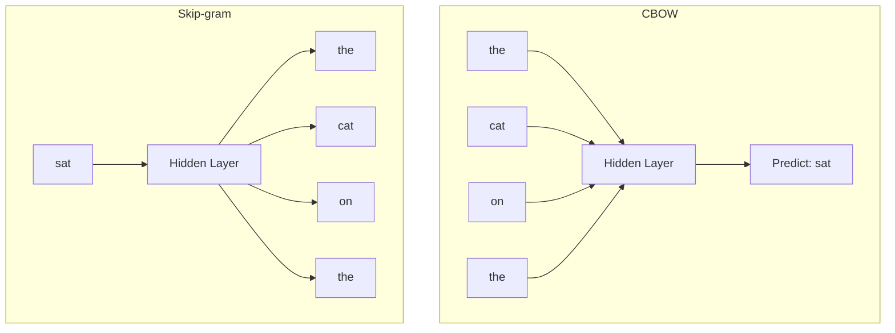
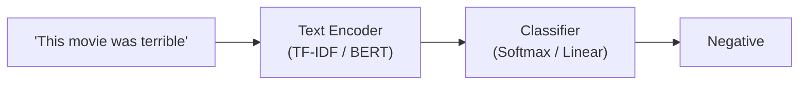
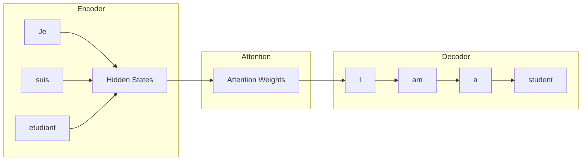
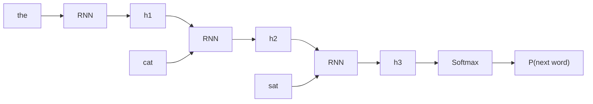
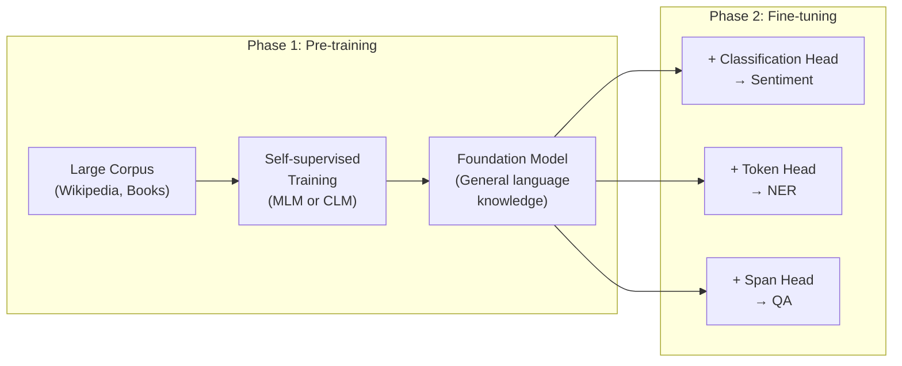

# NLP Fundamentals

Natural Language Processing concepts from classical methods to pre-transformer deep learning -- the foundation for understanding modern LLMs.

---

## Text Preprocessing

Every NLP pipeline starts with converting raw text into a clean, structured form that models can consume. The choices you make here directly affect downstream performance.



### Tokenization

Tokenization splits text into discrete units. The granularity you choose defines the vocabulary size and how the model sees language.

| Strategy | How It Works | Vocabulary Size | Example (`"unhappiness"`) | Used By |
|----------|-------------|----------------|--------------------------|---------|
| **Word-level** | Split on whitespace/punctuation | Very large (100k+) | `["unhappiness"]` | Classical NLP, BoW |
| **Subword (BPE)** | Merge frequent character pairs iteratively | Medium (30k-50k) | `["un", "happiness"]` | GPT-2, GPT-3, RoBERTa |
| **Subword (WordPiece)** | Like BPE but uses likelihood-based merging | Medium (30k) | `["un", "##happiness"]` | BERT |
| **Character-level** | Each character is a token | Very small (< 300) | `["u","n","h","a","p",...]` | CharCNN, some MT systems |
| **Byte-level BPE** | BPE over raw bytes (no UNK tokens) | Medium (50k) | byte sequences | GPT-2, GPT-4 |

```python
# Subword tokenization with Hugging Face
from transformers import AutoTokenizer

tokenizer = AutoTokenizer.from_pretrained("bert-base-uncased")
tokens = tokenizer.tokenize("unhappiness is unavoidable")
# ['un', '##hap', '##pi', '##ness', 'is', 'una', '##void', '##able']

ids = tokenizer.encode("unhappiness is unavoidable")
# [101, 4895, 17230, 8197, 2791, 2003, 14477, 17080, 3085, 102]
# 101 = [CLS], 102 = [SEP]
```

**Interview insight:** Subword tokenization solves the open-vocabulary problem. Word-level tokenizers must use an `<UNK>` token for unseen words, while BPE/WordPiece decompose rare words into known subword units, preserving morphological information.

### Stemming vs. Lemmatization

| Technique | Method | Output for "better" | Output for "running" | Speed |
|-----------|--------|---------------------|---------------------|-------|
| **Stemming** (Porter) | Heuristic suffix stripping | `"better"` | `"run"` | Fast |
| **Lemmatization** (WordNet) | Dictionary lookup + POS tag | `"good"` | `"run"` | Slower |

```python
import nltk
from nltk.stem import PorterStemmer, WordNetLemmatizer

stemmer = PorterStemmer()
lemmatizer = WordNetLemmatizer()

words = ["running", "better", "geese", "studies"]

# Stemming: fast but crude
print([stemmer.stem(w) for w in words])
# ['run', 'better', 'gees', 'studi']

# Lemmatization: linguistically correct
print([lemmatizer.lemmatize(w, pos='v') for w in words])
# ['run', 'better', 'goose', 'study']
```

**When to use what:** Stemming is sufficient for information retrieval (search engines). Lemmatization is better when you need linguistically accurate forms (e.g., building knowledge graphs). Modern transformer models learn their own representations and typically skip both.

### Stop Words, Lowercasing, and Punctuation

| Technique | When Helpful | When Harmful |
|-----------|-------------|-------------|
| **Stop word removal** | BoW/TF-IDF models, topic modeling | Sentiment analysis (`"not good"`), QA, transformers |
| **Lowercasing** | Most classification tasks | NER (`Apple` vs `apple`), case-sensitive tasks |
| **Punctuation removal** | BoW models, topic modeling | Sentiment (`!!!`), code processing, transformers |

### Text Normalization

- **Unicode normalization** -- Convert `"cafe\u0301"` to `"cafe"`, handle fullwidth characters, normalize accented forms (NFC/NFKD)
- **Spell correction** -- Useful for user-generated content (tweets, reviews); tools like `pyspellchecker`, `SymSpell`
- **Contraction expansion** -- `"don't"` to `"do not"` for consistency in classical models

---

## Text Representation

How you convert text into numbers defines what your model can learn. This is the most consequential design decision in an NLP pipeline.



### Bag of Words (BoW) and TF-IDF

**Bag of Words** represents a document as a vector of word counts, ignoring order entirely.

```python
from sklearn.feature_extraction.text import CountVectorizer, TfidfVectorizer

corpus = [
    "the cat sat on the mat",
    "the dog sat on the log",
    "cats and dogs are friends"
]

# Bag of Words
bow = CountVectorizer()
X_bow = bow.fit_transform(corpus)
print(bow.get_feature_names_out())
# ['and', 'are', 'cat', 'cats', 'dog', 'dogs', 'friends', 'log', 'mat', 'on', 'sat', 'the']
print(X_bow.toarray()[0])
# [0, 0, 1, 0, 0, 0, 0, 0, 1, 1, 1, 2]  -- "the" appears twice
```

**TF-IDF** (Term Frequency - Inverse Document Frequency) down-weights words that appear in many documents and up-weights rare, discriminative terms.

$$\text{TF-IDF}(t, d) = \text{TF}(t, d) \times \log\frac{N}{\text{DF}(t)}$$

Where:
- **TF(t, d)** = frequency of term `t` in document `d`
- **DF(t)** = number of documents containing term `t`
- **N** = total number of documents

```python
tfidf = TfidfVectorizer()
X_tfidf = tfidf.fit_transform(corpus)
# "the" gets a low score (appears in 2/3 docs)
# "friends" gets a high score (appears in 1/3 docs)
```

| Feature | BoW | TF-IDF |
|---------|-----|--------|
| Word order | Ignored | Ignored |
| Term weighting | Raw count | Weighted by rarity |
| Sparsity | Very high | Very high |
| Vocabulary scaling | Vocabulary grows with corpus | Same |
| Best for | Simple baselines, topic modeling | Information retrieval, text classification |

**Limitations of sparse methods:** No semantic understanding (`"king"` and `"monarch"` are orthogonal vectors), very high dimensionality, no handling of word order or context.

### Word Embeddings

Dense, low-dimensional vectors (100-300 dims) that capture semantic relationships. Words with similar meanings have similar vectors.

#### Word2Vec (Mikolov et al., 2013)

Two architectures for learning word vectors from large corpora:



| Architecture | Input | Output | Best For |
|-------------|-------|--------|----------|
| **CBOW** | Context words (window) | Predict center word | Frequent words, faster training |
| **Skip-gram** | Center word | Predict context words | Rare words, smaller corpora |

Training trick: **Negative sampling** -- instead of a full softmax over the vocabulary (expensive), sample a few negative examples and turn it into a binary classification problem.

```python
from gensim.models import Word2Vec

sentences = [["the", "cat", "sat", "on", "the", "mat"],
             ["the", "dog", "sat", "on", "the", "log"]]

model = Word2Vec(sentences, vector_size=100, window=5,
                 min_count=1, sg=1)  # sg=1 for Skip-gram

# Semantic arithmetic: king - man + woman ≈ queen
# model.wv.most_similar(positive=["king", "woman"], negative=["man"])
```

#### GloVe (Pennington et al., 2014)

Global Vectors for Word Representation -- learns embeddings by factorizing the **global word co-occurrence matrix**.

| Feature | Word2Vec | GloVe |
|---------|----------|-------|
| Training signal | Local context windows | Global co-occurrence statistics |
| Objective | Predict context/center word | Factorize co-occurrence matrix |
| Captures | Local syntactic patterns well | Global statistical information well |
| Training | Online (process sentences) | Batch (needs full co-occurrence matrix) |
| Result quality | Very similar in practice | Very similar in practice |

#### FastText (Bojanowski et al., 2016)

Extends Word2Vec by representing each word as a bag of character n-grams. The vector for `"where"` includes n-grams like `"<wh"`, `"whe"`, `"her"`, `"ere"`, `"re>"`.

**Key advantage:** Can produce vectors for out-of-vocabulary (OOV) words by summing their n-gram vectors. Word2Vec and GloVe cannot do this.

### Contextual Embeddings

Static embeddings give one vector per word regardless of context. Contextual embeddings produce different vectors depending on the surrounding text.

```python
# "bank" has different meanings:
#   "I went to the bank to deposit money"   --> financial institution
#   "The river bank was muddy"              --> edge of a river

# Word2Vec: same vector for "bank" in both sentences
# BERT/ELMo: different vectors for "bank" in each sentence
```

#### ELMo (Peters et al., 2018)

**Embeddings from Language Models** -- uses a bidirectional LSTM trained as a language model. The final embedding is a learned weighted sum of all LSTM layers.

- Layer 0 (character CNN): morphological features
- Layer 1 (1st LSTM): syntactic features
- Layer 2 (2nd LSTM): semantic features

#### BERT and GPT Contextual Embeddings

| Feature | ELMo | BERT | GPT |
|---------|------|------|-----|
| Architecture | Bi-LSTM | Transformer encoder | Transformer decoder |
| Context | Bidirectional (concatenated) | Truly bidirectional (self-attention) | Left-to-right only |
| Pre-training | LM (forward + backward) | MLM + NSP | Causal LM |
| Parameters | 94M | 110M (base) / 340M (large) | 117M (GPT-1) |

### Sentence and Document Embeddings

For tasks like semantic search and sentence similarity, you need a single vector for the whole input.

| Method | How It Works | Quality | Speed |
|--------|-------------|---------|-------|
| **Mean pooling** | Average all token embeddings | Decent | Fast |
| **[CLS] token** | Use BERT's `[CLS]` output directly | Poor without fine-tuning | Fast |
| **Sentence-BERT** | Siamese BERT fine-tuned on NLI pairs | Excellent | Medium |
| **Instructor / E5** | Task-instruction-aware embeddings | State-of-the-art | Medium |

```python
from sentence_transformers import SentenceTransformer

model = SentenceTransformer("all-MiniLM-L6-v2")
sentences = ["The cat sat on the mat", "A feline rested on a rug"]

embeddings = model.encode(sentences)
# embeddings.shape = (2, 384)

from sklearn.metrics.pairwise import cosine_similarity
sim = cosine_similarity([embeddings[0]], [embeddings[1]])
print(f"Similarity: {sim[0][0]:.3f}")  # ~0.75 (semantically similar)
```

---

## Classical NLP Tasks

These tasks form the backbone of applied NLP. Understanding them is essential even in the LLM era because many production systems still use task-specific models for latency, cost, or domain reasons.

### Text Classification

Assign a label (or multiple labels) to a text input.



| Approach | Model | When to Use |
|----------|-------|-------------|
| **Classical** | Naive Bayes, SVM + TF-IDF | Small data, fast inference, explainability needed |
| **Deep learning** | CNN, LSTM + embeddings | Medium data, sequence-sensitive tasks |
| **Transfer learning** | Fine-tuned BERT / RoBERTa | Best accuracy, sufficient compute budget |
| **Zero/few-shot** | Prompted LLM | No labeled data, rapid prototyping |

```python
# Fine-tuning BERT for sentiment analysis
from transformers import AutoModelForSequenceClassification, AutoTokenizer
from transformers import Trainer, TrainingArguments

model_name = "bert-base-uncased"
tokenizer = AutoTokenizer.from_pretrained(model_name)
model = AutoModelForSequenceClassification.from_pretrained(
    model_name, num_labels=2
)

# Tokenize dataset
def tokenize_fn(example):
    return tokenizer(example["text"], truncation=True, padding="max_length",
                     max_length=128)

# Training with Hugging Face Trainer
training_args = TrainingArguments(
    output_dir="./results",
    num_train_epochs=3,
    per_device_train_batch_size=16,
    learning_rate=2e-5,        # typical fine-tuning LR for BERT
    weight_decay=0.01,
)

trainer = Trainer(
    model=model,
    args=training_args,
    train_dataset=tokenized_train,
    eval_dataset=tokenized_eval,
)
trainer.train()
```

### Named Entity Recognition (NER)

Identify and classify named entities (persons, organizations, locations, dates, etc.) in text.

**BIO Tagging Scheme:**

| Token | Tag | Meaning |
|-------|-----|---------|
| Barack | B-PER | Begin Person |
| Obama | I-PER | Inside Person |
| visited | O | Outside (not an entity) |
| the | O | Outside |
| White | B-LOC | Begin Location |
| House | I-LOC | Inside Location |

- **B-** = beginning of an entity span
- **I-** = inside (continuation) of an entity span
- **O** = not part of any entity

```python
from transformers import pipeline

ner = pipeline("ner", model="dslim/bert-base-NER", aggregation_strategy="simple")
result = ner("Barack Obama visited the White House in Washington")
# [{'entity_group': 'PER', 'word': 'Barack Obama', 'score': 0.99},
#  {'entity_group': 'LOC', 'word': 'White House', 'score': 0.98},
#  {'entity_group': 'LOC', 'word': 'Washington', 'score': 0.99}]
```

**Model architectures for NER:**

| Approach | Architecture | Notes |
|----------|-------------|-------|
| **Classical** | CRF (Conditional Random Field) | Models label dependencies; used standalone or as output layer |
| **BiLSTM-CRF** | BiLSTM encoder + CRF decoder | Strong baseline pre-BERT; CRF ensures valid tag sequences |
| **BERT + Linear** | Transformer encoder + token classifier | Current standard; fine-tune on labeled data |

### Part-of-Speech Tagging

Assign grammatical tags (noun, verb, adjective, etc.) to each token. Architecturally identical to NER -- it is a sequence labeling task with a different label set (Penn Treebank tags: NN, VB, JJ, etc.).

### Machine Translation

Translate text from a source language to a target language. This task gave birth to the **attention mechanism** and the **Transformer architecture**.



**Evolution of MT architectures:**

| Era | Architecture | Key Innovation |
|-----|-------------|---------------|
| **Statistical MT** (2000s) | Phrase-based models | Phrase alignment tables |
| **Seq2Seq** (2014) | Encoder-decoder RNN | End-to-end neural approach |
| **Seq2Seq + Attention** (2015) | Bahdanau/Luong attention | Decoder attends to all encoder states, not just the last |
| **Transformer** (2017) | Self-attention, no recurrence | Parallel training, long-range dependencies |
| **Large-scale pre-training** (2019+) | mBART, mT5, NLLB | Multilingual pre-training, zero-shot translation |

**Attention mechanism (Bahdanau, 2015):** Instead of compressing the entire source sentence into a single fixed-length vector (the bottleneck), the decoder learns to attend to different parts of the source for each output token.

$$\text{Attention}(Q, K, V) = \text{softmax}\left(\frac{QK^T}{\sqrt{d_k}}\right) V$$

This formula is the **scaled dot-product attention** from "Attention Is All You Need" (Vaswani et al., 2017) and is the core building block of all Transformer models.

### Summarization

| Type | How It Works | Output | Models |
|------|-------------|--------|--------|
| **Extractive** | Select and reorder existing sentences from the source | Verbatim sentences from input | TextRank, BertSum |
| **Abstractive** | Generate new text that captures the meaning | Novel sentences (paraphrasing) | BART, T5, Pegasus |

```python
from transformers import pipeline

summarizer = pipeline("summarization", model="facebook/bart-large-cnn")
text = """
The Amazon rainforest produces about 20% of the world's oxygen.
It spans across nine countries in South America and covers 5.5 million
square kilometers. Deforestation has reduced its size by about 17%
over the last 50 years, primarily due to cattle ranching and soy farming.
Scientists warn that continued deforestation could push the forest past
a tipping point where it can no longer sustain itself.
"""
summary = summarizer(text, max_length=50, min_length=20)
# [{'summary_text': 'The Amazon rainforest produces about 20% of the
#   world\'s oxygen. Deforestation has reduced its size by about 17%
#   over the last 50 years.'}]
```

**Extractive vs. Abstractive trade-offs:**

| Factor | Extractive | Abstractive |
|--------|-----------|-------------|
| Factual accuracy | High (copies source text) | Risk of hallucination |
| Fluency | Can be choppy (stitched sentences) | More natural and coherent |
| Compression ratio | Limited by sentence boundaries | Can compress more aggressively |
| Compute cost | Lower | Higher (requires generation) |

### Question Answering

| Type | Input | Output | Example Models |
|------|-------|--------|---------------|
| **Extractive QA** | Question + context passage | Span (start, end) from context | BERT, RoBERTa fine-tuned on SQuAD |
| **Generative QA** | Question (optionally + context) | Free-form generated text | T5, GPT, RAG |
| **Open-domain QA** | Question only | Answer from a large knowledge source | Retriever + Reader (DPR + BERT) |

```python
from transformers import pipeline

qa = pipeline("question-answering", model="deepset/roberta-base-squad2")
result = qa(
    question="What percentage of oxygen does the Amazon produce?",
    context="The Amazon rainforest produces about 20% of the world's oxygen."
)
# {'answer': '20%', 'score': 0.95, 'start': 42, 'end': 45}
```

**Extractive QA architecture:** The model predicts two probability distributions over the context tokens -- one for the start position and one for the end position of the answer span. The answer is the substring between the highest-probability start and end positions.

---

## Language Modeling

A language model assigns a probability to a sequence of tokens. It is the core objective behind nearly every modern NLP system.

$$P(w_1, w_2, ..., w_n) = \prod_{i=1}^{n} P(w_i \mid w_1, ..., w_{i-1})$$

### N-gram Models

The simplest language models estimate the probability of the next word using the previous N-1 words.

| Model | Context Window | Example P(w) |
|-------|---------------|--------------|
| **Unigram** | 0 (no context) | P("sat") |
| **Bigram** | 1 previous word | P("sat" \| "cat") |
| **Trigram** | 2 previous words | P("sat" \| "the", "cat") |

**Sparsity problem:** Most n-grams never appear in the training data. Smoothing techniques address this:

| Technique | How It Works |
|-----------|-------------|
| **Laplace (add-1)** | Add 1 to all counts; simple but wastes too much probability mass |
| **Add-k** | Add k < 1 instead of 1; tunable |
| **Kneser-Ney** | Redistribute probability based on how many different contexts a word appears in; state-of-the-art for n-grams |
| **Backoff** | Fall back to lower-order n-gram if higher-order count is zero |

```python
# Simple bigram language model
from collections import defaultdict, Counter

def build_bigram_model(corpus_tokens):
    """Build a bigram probability table."""
    bigram_counts = defaultdict(Counter)
    for i in range(len(corpus_tokens) - 1):
        bigram_counts[corpus_tokens[i]][corpus_tokens[i + 1]] += 1

    # Convert counts to probabilities
    bigram_probs = {}
    for w1, next_words in bigram_counts.items():
        total = sum(next_words.values())
        bigram_probs[w1] = {w2: count / total
                            for w2, count in next_words.items()}
    return bigram_probs

tokens = ["the", "cat", "sat", "on", "the", "mat", "the", "cat", "ran"]
model = build_bigram_model(tokens)
print(model["the"])  # {'cat': 0.67, 'mat': 0.33}
```

### Neural Language Models

RNN-based language models replaced n-grams by learning dense representations and handling longer dependencies.



| Feature | N-gram LM | RNN LM | Transformer LM |
|---------|-----------|--------|----------------|
| Context | Fixed (N-1 words) | Theoretically infinite | Full sequence (self-attention) |
| Parameters | Lookup table | Shared weights across time | Self-attention + FFN |
| Training | Count-based | Backprop through time (BPTT) | Parallelizable |
| Long-range deps | Cannot capture | Vanishing gradient problem | Handles well via attention |

**Perplexity** -- the standard evaluation metric for language models:

$$\text{PPL} = \exp\left(-\frac{1}{N}\sum_{i=1}^{N}\log P(w_i \mid w_{<i})\right)$$

Lower perplexity means the model assigns higher probability to the test data. Intuitively, a perplexity of 50 means the model is "as confused as if it had to choose uniformly among 50 words at each step."

### Masked Language Modeling (MLM) -- BERT

BERT's pre-training objective: randomly mask 15% of tokens and predict them from the surrounding context (both left and right).

```
Input:    The [MASK] sat on the [MASK]
Target:   The  cat   sat on the  mat
```

**Masking strategy (important detail):** Of the 15% selected tokens:
- 80% are replaced with `[MASK]`
- 10% are replaced with a random word
- 10% are left unchanged

This prevents the model from learning that `[MASK]` is always the token to predict, reducing the train-test mismatch.

**Next Sentence Prediction (NSP):** BERT's second objective -- given two sentences, predict whether sentence B actually follows sentence A. Later research (RoBERTa) showed NSP is not very helpful, and removing it improves performance.

### Causal Language Modeling (CLM) -- GPT

GPT's pre-training objective: predict the next token given all previous tokens (left-to-right, autoregressive).

```
Input:    The cat sat on the
Target:                       mat
```

The model uses **masked self-attention** (causal mask) to prevent attending to future tokens during training.

| Feature | MLM (BERT) | CLM (GPT) |
|---------|-----------|-----------|
| Direction | Bidirectional | Left-to-right |
| Masking | Random 15% of tokens | Predict every next token |
| Strength | Understanding, classification, NER | Generation, completion, dialogue |
| Limitation | Cannot generate text naturally | Cannot look at future context |
| Typical use | Encoder tasks (classify, extract) | Decoder tasks (generate, complete) |

### The Pre-train then Fine-tune Paradigm

This is the conceptual revolution that BERT and GPT introduced. Instead of training a model from scratch for each task, you:



**Why this works:** Pre-training on massive corpora teaches the model syntax, semantics, world knowledge, and reasoning patterns. Fine-tuning on a small task-specific dataset (even a few thousand examples) adapts this knowledge to the target task, vastly outperforming training from scratch.

| Paradigm | Data Needed | Compute | Performance |
|----------|-------------|---------|-------------|
| Train from scratch | Large labeled dataset | High | Good |
| Pre-train + fine-tune | Small labeled dataset | Low (fine-tune only) | Better |
| Prompt-based (GPT-3+) | Zero to few examples | Inference only | Competitive |

---

## Key Models Timeline

A chronological view of the most influential NLP models and what they introduced:

| Year | Model | Key Innovation | Parameters |
|------|-------|---------------|------------|
| 2013 | **Word2Vec** | Dense word embeddings via shallow neural net | N/A (embeddings only) |
| 2014 | **GloVe** | Embeddings from global co-occurrence statistics | N/A (embeddings only) |
| 2014 | **Seq2Seq** | Encoder-decoder architecture for translation | ~200M |
| 2015 | **Attention** | Decoder attends to all encoder states | (mechanism, not model) |
| 2016 | **FastText** | Subword embeddings (handles OOV words) | N/A (embeddings only) |
| 2017 | **Transformer** | Self-attention replaces recurrence entirely | 65M |
| 2018 | **ELMo** | Contextual embeddings from bidirectional LSTM | 94M |
| 2018 | **GPT-1** | Transformer decoder + pre-train/fine-tune | 117M |
| 2018 | **BERT** | Masked language modeling, bidirectional Transformer encoder | 110M / 340M |
| 2019 | **GPT-2** | Scaled up CLM, multitask via prompting | 1.5B |
| 2019 | **T5** | Unified text-to-text framework for all NLP tasks | 11B |
| 2019 | **RoBERTa** | BERT done right (no NSP, more data, longer training) | 355M |
| 2020 | **GPT-3** | In-context learning, few-shot prompting | 175B |
| 2022 | **ChatGPT** | RLHF for instruction following and dialogue | ~175B (GPT-3.5) |
| 2023 | **GPT-4** | Multimodal (text + vision), massive scale | ~1.8T (estimated) |

**Key inflection points to remember:**
- **2017 (Transformer):** Eliminated RNNs; enabled parallelism and scaling
- **2018 (BERT + GPT):** Proved pre-train + fine-tune beats task-specific training
- **2020 (GPT-3):** Showed that scale enables in-context learning (no fine-tuning needed)
- **2022 (ChatGPT):** RLHF alignment made LLMs usable as general assistants

---

## Common Interview Questions

**Q1: How does TF-IDF work, and what are its limitations?**

TF-IDF weights a term by its frequency in a document (TF) multiplied by the log-inverse of the fraction of documents containing it (IDF). Common words like "the" get low scores; discriminative words like "transformer" get high scores. Limitations: it ignores word order, cannot capture semantics (synonyms are different dimensions), produces very high-dimensional sparse vectors, and cannot handle polysemy (multiple meanings of the same word).

**Q2: Word2Vec vs. GloVe -- what are the differences and when would you choose each?**

Word2Vec learns embeddings from local context windows using a predictive objective (CBOW or Skip-gram). GloVe factorizes the global word co-occurrence matrix using a regression objective. In practice, both produce embeddings of similar quality. Choose Word2Vec when you need online/incremental training (new data can be added). Choose GloVe when you have a fixed corpus and want to leverage global statistics. In most modern applications, neither is used directly -- contextual embeddings from pre-trained transformers are preferred.

**Q3: BERT vs. GPT -- architectural differences and when to use each?**

BERT uses a Transformer **encoder** with bidirectional self-attention, pre-trained with masked language modeling. GPT uses a Transformer **decoder** with causal (left-to-right) self-attention, pre-trained with next-token prediction. Use BERT (or its variants like RoBERTa) for understanding tasks: classification, NER, extractive QA, semantic similarity. Use GPT for generation tasks: text completion, dialogue, summarization, translation. The core trade-off is that BERT sees full context but cannot generate autoregressively, while GPT generates fluently but only conditions on left context.

**Q4: What is the difference between extractive and abstractive summarization?**

Extractive summarization selects and concatenates existing sentences from the source document -- it is a ranking/selection problem. Abstractive summarization generates new text that may paraphrase or compress the original -- it is a generation problem. Extractive is more faithful (no hallucination) but less fluent. Abstractive produces more natural summaries but risks generating content not in the source. Modern systems (BART, T5, Pegasus) are abstractive. A common production pattern combines both: extract relevant passages first, then generate a summary from them.

**Q5: Explain the attention mechanism and why it was invented.**

Attention was invented to solve the bottleneck problem in seq2seq models for machine translation. The original encoder-decoder compressed the entire source sentence into a single fixed-size vector, which lost information for long sentences. Attention lets the decoder look at all encoder hidden states at each decoding step, computing a weighted sum based on relevance. The weights are learned via a compatibility function (dot product or additive). This was later generalized into self-attention in the Transformer, where every token attends to every other token in the same sequence, enabling the model to capture long-range dependencies without recurrence.

**Q6: What is perplexity and how do you interpret it?**

Perplexity is the exponentiated average negative log-likelihood of a language model on a test set. It measures how "surprised" the model is by the data. A perplexity of 1 means the model predicts every token perfectly. A perplexity of K means the model is as uncertain as choosing uniformly among K options at each step. Lower is better. It is the standard metric for comparing language models but should be compared only across models using the same tokenizer and test set, since different tokenizations produce different sequence lengths.
