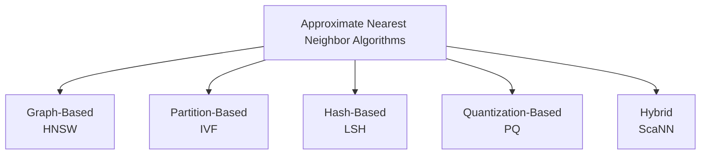
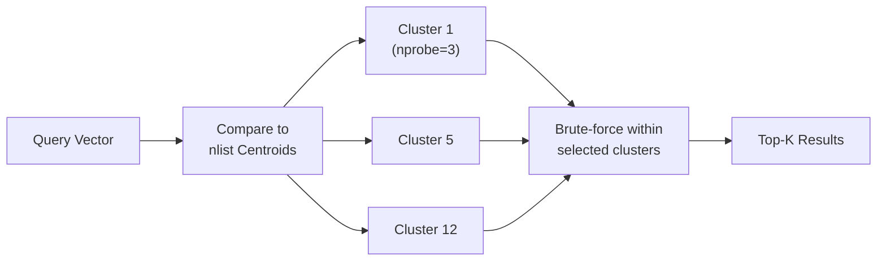
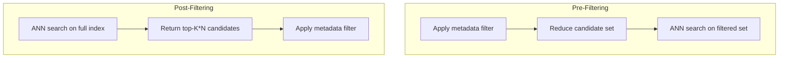
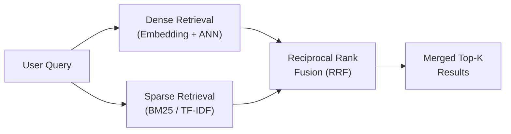
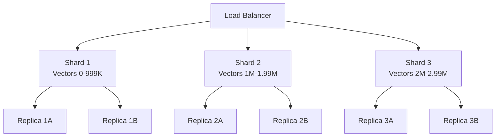

# Vector Databases

Specialized databases for storing and querying high-dimensional vectors — the retrieval backbone for RAG, semantic search, and recommendation systems.

---

## Why Vector Databases

Traditional databases index data by exact values (B-trees, hash indexes). They answer "find rows where `id = 42`" efficiently, but cannot answer "find the 10 most similar items to this query" when items are represented as 768-dimensional embedding vectors. A brute-force scan comparing the query against every vector is O(n * d) — unusable at scale.

Vector databases solve this by building **Approximate Nearest Neighbor (ANN)** indexes that trade a small amount of recall for dramatic speedups (often 100-1000x over brute force).

| Requirement | Traditional DB | Vector Database |
|-------------|---------------|-----------------|
| Exact match lookup | Fast (B-tree, hash) | Not the focus |
| Range / filter queries | Fast (indexes) | Supported via metadata filters |
| Similarity search over embeddings | O(n*d) brute force | O(log n) to O(1) via ANN indexes |
| Top-K nearest neighbors | Impractical at scale | Core operation, millisecond latency |

### Use Cases

- **RAG retrieval** — find the most relevant document chunks for a user query before passing to an LLM
- **Semantic search** — search by meaning rather than keywords ("affordable housing" matches "low-cost apartments")
- **Image / audio search** — find visually or acoustically similar media
- **Recommendation systems** — user and item embeddings, find items closest to a user vector
- **Deduplication** — detect near-duplicate documents, images, or records

---

## Core ANN Algorithms



### HNSW (Hierarchical Navigable Small World)

The most widely used ANN algorithm. Builds a multi-layer graph where each node is a vector and edges connect nearby vectors.

**How it works:**
1. **Construction** — Vectors are inserted one at a time. Each vector is assigned a random maximum layer (higher layers are sparser, like a skip list). At each layer, the algorithm greedily navigates to the nearest neighbors and connects edges.
2. **Search** — Start at the top (sparsest) layer, greedily walk toward the query vector. Drop down a layer and repeat. At the bottom layer, perform a more thorough beam search to find the top-K candidates.

```
Layer 2 (sparse):    A ---- D                     (few nodes, long-range links)
                     |      |
Layer 1 (medium):    A -- B -- D -- F              (more nodes, medium links)
                     |  / |    |  / |
Layer 0 (dense):     A-B--C--D-E-F--G--H           (all nodes, short-range links)
```

**Key parameters:**
- `M` — max edges per node (higher = better recall, more memory). Typical: 16-64.
- `ef_construction` — beam width during build (higher = better graph quality, slower build). Typical: 100-500.
- `ef_search` — beam width during query (higher = better recall, slower query). Typical: 50-200.

| Pros | Cons |
|------|------|
| Best recall/speed tradeoff in practice | High memory usage (graph + original vectors) |
| No training required | Slow incremental inserts at very large scale |
| Good for streaming inserts | Memory = O(n * M * d) |

### IVF (Inverted File Index)

Partition-based approach that clusters vectors, then searches only relevant clusters at query time.

**How it works:**
1. **Training** — Run k-means to partition all vectors into `nlist` clusters (Voronoi cells). Store cluster centroids.
2. **Indexing** — Assign each vector to its nearest cluster centroid. Build an inverted list mapping each cluster to its member vectors.
3. **Search** — Compare query to all centroids, pick the `nprobe` closest clusters, then brute-force search only those clusters' vectors.



**Key parameters:**
- `nlist` — number of clusters. Typical: sqrt(n) to 4*sqrt(n).
- `nprobe` — clusters searched at query time. Higher = better recall, slower. Typical: 1-10% of nlist.

| Pros | Cons |
|------|------|
| Lower memory than HNSW | Requires offline training step (k-means) |
| Pairs well with PQ for compression | Recall degrades at cluster boundaries |
| Simple to understand and tune | Not ideal for streaming inserts (retraining needed) |

### LSH (Locality-Sensitive Hashing)

Hash-based approach: design hash functions where similar vectors are more likely to collide.

**How it works:**
1. **Hash functions** — Use random hyperplanes (for cosine similarity) or random projections. Each hyperplane divides space into two halves, giving a 0 or 1 bit. Multiple hyperplanes produce a hash code.
2. **Multiple tables** — Use L independent hash tables with different random projections to increase the probability of finding true neighbors.
3. **Search** — Hash the query, look up the same bucket in each table, collect candidates, re-rank by actual distance.

```
Hyperplane 1: left=0, right=1    →  bit[0]
Hyperplane 2: above=0, below=1   →  bit[1]
Hyperplane 3: front=0, back=1    →  bit[2]

Vector A → hash = 011  →  bucket "011"
Vector B → hash = 011  →  bucket "011"  (similar to A, same bucket)
Vector C → hash = 110  →  bucket "110"  (dissimilar, different bucket)
```

| Pros | Cons |
|------|------|
| Sub-linear query time, theoretically well-understood | Lower recall than HNSW/IVF at same speed |
| Easy to distribute (hash tables are independent) | Needs many hash tables for good recall |
| Works well for very high dimensions | Memory-intensive with many tables |

### Product Quantization (PQ)

A compression technique that dramatically reduces memory by quantizing vectors into compact codes. Often combined with IVF (IVF-PQ).

**How it works:**
1. **Split** — Divide each d-dimensional vector into `m` sub-vectors of dimension d/m.
2. **Train codebooks** — For each sub-vector group, run k-means to find 256 centroids (1 byte per sub-vector).
3. **Encode** — Replace each sub-vector with the ID of its nearest centroid. A 768-dim float32 vector (3072 bytes) becomes m bytes (e.g., 96 bytes with m=96).
4. **Search** — Precompute distances from the query sub-vectors to all centroids. Approximate full distance by summing sub-vector distances (table lookup).

```
Original vector (768 dims, 3072 bytes):
[0.12, -0.45, ..., 0.78, -0.33, ..., 0.56, 0.91, ...]
 |--- subvec 1 ---|--- subvec 2 ---|--- subvec m ---|

After PQ (m=96, 96 bytes):
[42, 187, ..., 15]   ← 96 centroid IDs, each 1 byte

Compression ratio: 3072 / 96 = 32x
```

| Pros | Cons |
|------|------|
| Massive memory reduction (20-50x typical) | Lossy compression, reduces recall |
| Enables billion-scale search on single machine | Requires training codebooks |
| ADC (asymmetric distance computation) is fast | Not great for low-dimensional vectors |

### ScaNN (Scalable Nearest Neighbors)

Google's hybrid approach that combines the best ideas from quantization and reranking.

**How it works:**
1. **Coarse quantization** — Partition space (like IVF) and use anisotropic vector quantization that weights quantization error in the direction of the query, preserving the inner product ordering better than standard PQ.
2. **Scoring** — Score candidates using quantized distances (fast, approximate).
3. **Reranking** — Take the top candidates and rerank using exact distances for the final result.

The key insight is **anisotropic quantization**: when quantizing a vector, errors parallel to the vector matter more for inner product search than errors perpendicular to it. ScaNN optimizes for this.

| Pros | Cons |
|------|------|
| State-of-the-art recall/speed on benchmarks | More complex to tune |
| Optimized for inner product (common for embeddings) | Google-maintained, fewer community resources |
| Efficient on CPU with SIMD optimizations | Less commonly used outside Google ecosystem |

### Algorithm Comparison

| Algorithm | Index Build | Query Speed | Memory | Recall | Best For |
|-----------|------------|-------------|--------|--------|----------|
| **HNSW** | Slow | Very fast | High | Highest | Default choice, streaming inserts |
| **IVF** | Moderate (k-means) | Fast | Medium | Good | Large static datasets |
| **LSH** | Fast | Moderate | High (many tables) | Lower | Distributed, high-dim |
| **PQ** | Moderate (codebooks) | Fast | Very low | Moderate | Memory-constrained, billions of vectors |
| **IVF-PQ** | Moderate | Fast | Low | Good | Billion-scale on limited hardware |
| **ScaNN** | Moderate | Very fast | Medium | Very high | Inner product, Google ecosystem |

---

## Vector Database Comparison

| Database | Type | Index Algorithms | Scaling | Filtering | Best For |
|----------|------|-----------------|---------|-----------|----------|
| **Pinecone** | Managed SaaS | Proprietary | Serverless, auto-scale | Metadata filters | Quick start, managed infrastructure |
| **Milvus** | Open source | HNSW, IVF, PQ, ScaNN | Distributed (shared-nothing) | Attribute filtering | Large-scale self-hosted, billion+ vectors |
| **Weaviate** | Open source | HNSW | Distributed (replication) | GraphQL filters + BM25 | Hybrid search (vector + keyword) |
| **Qdrant** | Open source | HNSW | Distributed (sharding) | Rich payload filtering | High-performance filtering |
| **Chroma** | Open source | HNSW (hnswlib) | Single-node | Metadata filters | Prototyping, small datasets, LangChain |
| **pgvector** | Postgres extension | IVF, HNSW | Postgres scaling (read replicas) | Full SQL WHERE clauses | Existing Postgres infrastructure |
| **FAISS** | Library (not a DB) | All major algorithms | In-process | None (DIY) | Research, custom pipelines, benchmarks |

### When to Use What

- **Prototype / small scale (<1M vectors)** — Chroma or pgvector. Minimal operational overhead.
- **Production, existing Postgres** — pgvector with HNSW index. Leverage existing infrastructure, ACID transactions, JOINs.
- **Production, large scale (10M-1B)** — Qdrant, Weaviate, or Milvus. Purpose-built, distributed.
- **Production, fully managed** — Pinecone. No infrastructure to manage.
- **Custom ML pipeline / research** — FAISS. Maximum control, all algorithms available.

---

## Key Operations

### Indexing (Building the Index)

```python
# Example: Indexing with FAISS (IVF-PQ)
import faiss
import numpy as np

d = 768          # embedding dimension
n = 1_000_000    # number of vectors
m = 96           # PQ sub-quantizers
nlist = 1024     # IVF clusters

# Generate or load embeddings
embeddings = np.random.randn(n, d).astype('float32')

# Build IVF-PQ index
quantizer = faiss.IndexFlatL2(d)             # coarse quantizer
index = faiss.IndexIVFPQ(quantizer, d, nlist, m, 8)  # 8 bits per sub-quantizer

index.train(embeddings)    # train k-means + PQ codebooks
index.add(embeddings)      # add vectors to index

print(f"Index size: {index.ntotal} vectors")
faiss.write_index(index, "my_index.faiss")
```

```python
# Example: Indexing with Qdrant
from qdrant_client import QdrantClient
from qdrant_client.models import VectorParams, Distance, PointStruct

client = QdrantClient(url="http://localhost:6333")

# Create collection with HNSW index
client.create_collection(
    collection_name="documents",
    vectors_config=VectorParams(
        size=768,
        distance=Distance.COSINE,
        hnsw_config={"m": 16, "ef_construct": 200}
    )
)

# Upsert vectors with metadata
client.upsert(
    collection_name="documents",
    points=[
        PointStruct(
            id=1,
            vector=[0.1, -0.2, ...],  # 768-dim embedding
            payload={"source": "wiki", "topic": "databases", "date": "2025-01-15"}
        ),
        # ... more points
    ]
)
```

### Querying (Top-K Similarity Search)

```python
# FAISS query
index.nprobe = 10  # search 10 clusters (IVF parameter)

query = np.random.randn(1, d).astype('float32')
distances, indices = index.search(query, k=10)  # top-10 nearest neighbors

# distances: [[0.23, 0.31, 0.45, ...]]  (squared L2 distances)
# indices:   [[4821, 9102, 332, ...]]    (vector IDs)
```

```python
# Qdrant query
results = client.search(
    collection_name="documents",
    query_vector=[0.05, -0.12, ...],  # 768-dim query embedding
    limit=10,
    score_threshold=0.7  # optional: minimum similarity
)

for result in results:
    print(f"ID: {result.id}, Score: {result.score}, Payload: {result.payload}")
```

### Filtering (Metadata + Vector Search)

There are two approaches to combining metadata filters with vector search:



| Strategy | How It Works | Pros | Cons |
|----------|-------------|------|------|
| **Pre-filtering** | Filter first, then ANN search on matching vectors | Exact filter satisfaction, predictable result count | Can degrade ANN index quality if filter is too selective |
| **Post-filtering** | ANN search first, then filter results | Full ANN index quality | May return fewer than K results after filtering |

```python
# Qdrant: pre-filtering with metadata (default behavior)
from qdrant_client.models import Filter, FieldCondition, MatchValue, Range

results = client.search(
    collection_name="documents",
    query_vector=query_embedding,
    query_filter=Filter(
        must=[
            FieldCondition(key="source", match=MatchValue(value="wiki")),
            FieldCondition(key="date", range=Range(gte="2025-01-01")),
        ]
    ),
    limit=10,
)
```

### Hybrid Search (Vector + Keyword)

Combine dense vector similarity with sparse keyword matching (BM25) for better retrieval, especially when queries contain specific terms (names, product IDs, error codes).



**Reciprocal Rank Fusion (RRF):**

```
RRF_score(doc) = sum over all rankers r of: 1 / (k + rank_r(doc))
```

Where `k` is a constant (typically 60). RRF is effective because it does not require score normalization between different retrieval methods.

```python
# Weaviate: hybrid search (built-in)
import weaviate

client = weaviate.connect_to_local()

collection = client.collections.get("Document")

results = collection.query.hybrid(
    query="vector database sharding strategies",
    alpha=0.5,   # 0 = pure keyword, 1 = pure vector
    limit=10,
)

for obj in results.objects:
    print(obj.properties["title"], obj.metadata.score)
```

```python
# Manual hybrid search with RRF
def reciprocal_rank_fusion(rankings: list[list[str]], k: int = 60) -> list[tuple[str, float]]:
    """Fuse multiple ranked lists using RRF."""
    scores = {}
    for ranking in rankings:
        for rank, doc_id in enumerate(ranking, start=1):
            scores[doc_id] = scores.get(doc_id, 0.0) + 1.0 / (k + rank)

    return sorted(scores.items(), key=lambda x: x[1], reverse=True)

# Example: merge vector search results and BM25 results
vector_results = ["doc_5", "doc_12", "doc_3", "doc_8"]   # ranked by cosine sim
bm25_results   = ["doc_3", "doc_5", "doc_22", "doc_12"]  # ranked by BM25 score

fused = reciprocal_rank_fusion([vector_results, bm25_results])
# [('doc_5', 0.033), ('doc_3', 0.033), ('doc_12', 0.032), ...]
```

---

## Production Considerations

### Dimensionality

| Embedding Model | Dimensions | Notes |
|----------------|------------|-------|
| OpenAI text-embedding-3-small | 1536 | Can be truncated to 512 or 256 with Matryoshka |
| OpenAI text-embedding-3-large | 3072 | Highest quality, most expensive to search |
| Cohere embed-v3 | 1024 | Good balance of quality and efficiency |
| BGE / E5 (open source) | 768 | Strong open-source options |
| all-MiniLM-L6-v2 | 384 | Fast, good for prototyping |

**Tradeoffs:**
- Higher dimensions capture more semantic nuance but increase memory, index build time, and query latency.
- Many modern models support **Matryoshka embeddings** — the first N dimensions are a valid lower-dimensional embedding. You can truncate to reduce cost with graceful quality degradation.
- Rule of thumb: start with the model's default dimension. Only reduce if you hit memory or latency constraints, and measure recall impact.

### Distance Metrics

| Metric | Formula | Range | Use When |
|--------|---------|-------|----------|
| **Cosine similarity** | 1 - (A . B) / (\|\|A\|\| * \|\|B\|\|) | [0, 2] as distance | Embeddings are not normalized, care about direction |
| **Dot product** | -(A . B) | (-inf, inf) | Embeddings are normalized (equivalent to cosine), or magnitude matters |
| **Euclidean (L2)** | sqrt(sum((a_i - b_i)^2)) | [0, inf) | Spatial data, when absolute position matters |

**Practical guidance:**
- Most text embedding models are trained with cosine similarity. Use **cosine** as default.
- If your embeddings are L2-normalized, cosine and dot product are equivalent — use **dot product** (faster, no normalization step).
- **Euclidean** is common for image embeddings and spatial data.
- Always match the distance metric to what the embedding model was trained with.

### Index Tuning

#### HNSW Parameters

| Parameter | Effect of Increasing | Typical Range | Guidance |
|-----------|---------------------|---------------|----------|
| `M` | Better recall, more memory, slower build | 8-64 | Start with 16. Increase for higher recall. |
| `ef_construction` | Better graph quality, slower build | 64-512 | Set to 2-4x your target ef_search. Does not affect query time. |
| `ef_search` | Better recall, slower queries | 32-512 | Tune at query time. Trade latency for recall. |

#### IVF Parameters

| Parameter | Effect of Increasing | Typical Range | Guidance |
|-----------|---------------------|---------------|----------|
| `nlist` | More clusters, finer partitioning | sqrt(n) to 4*sqrt(n) | More clusters = better recall but more centroids to compare. |
| `nprobe` | More clusters searched, better recall | 1-nlist | Start with 1-5% of nlist. Increase until recall target is met. |

**Recall vs Latency Tuning Process:**
1. Start with default parameters.
2. Measure recall@K against a brute-force ground truth on a representative sample.
3. Increase ef_search (HNSW) or nprobe (IVF) until you hit your recall target (typically 95-99%).
4. If latency is too high, consider reducing dimensionality or using PQ compression.

### Sharding and Replication



- **Sharding** — Split vectors across nodes. Query all shards in parallel, merge top-K results. Necessary when data exceeds single-node memory.
- **Replication** — Copy each shard for read throughput and fault tolerance.
- **Shard sizing** — Keep each shard small enough to fit in memory (HNSW) or at least keep the index in memory (IVF-PQ stores vectors on disk, index in memory).

### Updates and Re-indexing

| Operation | HNSW | IVF / IVF-PQ |
|-----------|------|-------------|
| **Insert** | Add to graph incrementally (good) | Add to nearest cluster (good, but clusters may become unbalanced) |
| **Delete** | Mark as deleted, skip during search (tombstones) | Remove from inverted list |
| **Update** | Delete + insert | Delete + insert |
| **Re-index** | Rebuild graph periodically to remove tombstones | Retrain centroids periodically for balanced clusters |

**Best practices:**
- Use **soft deletes** (tombstones) for fast deletes. Compact/rebuild periodically.
- For IVF, monitor cluster balance. Retrain when cluster sizes diverge significantly.
- Schedule re-indexing during off-peak hours. Most databases support building a new index while serving from the old one (blue-green index swaps).

---

## Common Interview Questions

**Q1: HNSW vs IVF — what are the tradeoffs and when do you use each?**

HNSW is graph-based and offers the best recall at low latencies. It supports incremental inserts well but uses more memory (storing the graph structure on top of vectors). IVF is partition-based, requires a training step (k-means), and uses less memory. IVF is often combined with PQ for billion-scale datasets where memory is the bottleneck. Use HNSW as the default. Use IVF-PQ when you need to fit billions of vectors on limited hardware and can tolerate slightly lower recall.

**Q2: How would you design a vector search system for 1 billion documents?**

Use IVF-PQ or IVF-HNSW (FAISS) to compress vectors to ~100 bytes each (about 100 GB total). Shard across multiple nodes with 10-50M vectors per shard. Use a distributed database like Milvus or Qdrant with automatic sharding. Each query fans out to all shards in parallel, each shard returns its local top-K, and a coordinator merges results. Add read replicas for throughput. Use a two-stage pipeline: fast ANN retrieval for top-100 candidates, then a cross-encoder reranker for the final top-10.

**Q3: Pre-filtering vs post-filtering — what is the difference and when do you use each?**

Pre-filtering applies metadata conditions before ANN search, reducing the candidate set. It guarantees all results match the filter but can hurt ANN quality if the filter is very selective (few vectors left, graph/cluster structure is disrupted). Post-filtering runs ANN on the full index first, then filters results. It preserves ANN quality but may return fewer than K results. Use pre-filtering when filters are not too selective (<90% filtered out). Use post-filtering or over-fetch + filter when filters are very selective.

**Q4: How do you evaluate retrieval quality in a RAG pipeline?**

Use standard IR metrics: Recall@K (fraction of relevant documents in top-K), MRR (mean reciprocal rank of the first relevant result), and nDCG (normalized discounted cumulative gain for graded relevance). For RAG specifically, also measure end-to-end answer quality: compare LLM answers with and without retrieval, use human evaluation or LLM-as-judge for faithfulness and relevance. Build a golden test set of (query, relevant_documents) pairs. Run A/B tests when changing embedding models or index parameters.

**Q5: pgvector vs a dedicated vector database — when is each appropriate?**

pgvector is ideal when you already have a Postgres-based stack, your vectors are under ~5-10 million, and you need ACID transactions or JOINs between vector data and relational data. It avoids operational complexity of a separate system. A dedicated vector database (Qdrant, Milvus, Weaviate) is better when you have >10M vectors, need distributed scaling, require advanced features like hybrid search or multi-tenancy, or need the lowest possible query latencies. The ecosystem is also more mature for features like real-time index updates and collection management.

**Q6: What is the role of quantization in vector search, and what are the tradeoffs?**

Quantization compresses vectors from float32 to smaller representations. Scalar quantization reduces each float to int8 (4x compression). Product quantization splits vectors into sub-vectors and replaces each with a centroid ID (20-50x compression). Binary quantization reduces each dimension to a single bit (32x compression). The tradeoff is always compression vs recall: more aggressive compression means faster search and less memory but lower accuracy. In practice, IVF-PQ with reranking from the original vectors (stored on disk) offers a good balance for billion-scale systems.
