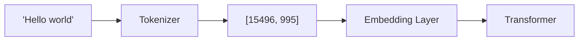

# Tokenization

Breaking text into tokens for LLMs — the first step in any language model pipeline and a frequently misunderstood concept.

---

## The Big Picture

**What is tokenization, in plain English?**

LLMs don't read text the way humans do — they never actually see letters or words. Before any text reaches the model, it gets converted into a sequence of integers (numbers). Each integer represents a "token" — a chunk of text that could be a whole word, part of a word, or even a single character.

**Real-world analogy:** Think of tokens like LEGO bricks. When you build something out of LEGO, you don't see the final sculpture — you see individual bricks snapping together. Tokenization is the process of breaking a sentence into its LEGO bricks (tokens) and giving each brick a catalog number. The AI only ever sees the catalog numbers, not the original text.

**Why should you care?**

- You pay API providers **per token**, not per word or per character — understanding tokenization directly affects your bill
- Models have a **maximum token limit** (context window) — knowing how text tokenizes tells you how much fits
- Some surprising behaviors — like why Claude can't count letters in "strawberry", or why math is hard for LLMs — are explained entirely by how tokenization works
- Non-English languages often cost **2-10× more tokens** for the same meaning

**Common misconceptions:**
- "1 token = 1 word" — FALSE. Common English words are often 1 token, but many words split into 2-3 tokens. "unhappiness" → `["un", "happi", "ness"]` (3 tokens).
- "Tokens are the same across all models" — FALSE. GPT-4 and LLaMA-3 use different tokenizers, so the same text produces different token counts and costs.

---

## Why Tokenization Matters

LLMs don't see text — they see sequences of integer token IDs. Tokenization is the bridge between human-readable text and the numerical representation the model processes.

> **Plain English:** Imagine you're sending a message to someone who only understands numbers. You'd need a codebook that maps each word to a number. Tokenization is building and using that codebook — but instead of whole words, it maps chunks of text (subwords) to numbers, which gives a better balance between vocabulary size and coverage.

Every aspect of LLM behavior is affected by tokenization:
- **Cost** — API providers bill per token; efficient tokenization directly reduces cost
- **Context limits** — a 128K token window ≠ 128K words (typically ~96K English words)
- **Performance** — how text is split affects what patterns the model can learn
- **Multilingual fairness** — non-English text often tokenizes into more tokens, meaning higher cost and less effective context usage
- **Reasoning** — tokenization boundaries determine what the model can "see" as atomic units



---

## Tokenization Algorithms

> **Plain English:** There are several strategies for deciding how to split text into tokens. They all try to answer the same question: "What's the best set of building blocks to represent all possible text?" The goal is a vocabulary of manageable size (32K–128K tokens) that covers common words as single tokens while still handling rare words by breaking them into familiar pieces.

### Byte Pair Encoding (BPE)

The most widely used algorithm in modern LLMs (GPT-4, LLaMA, Claude all use it). BPE starts with individual characters (or bytes) and iteratively merges the most frequent adjacent pair into a new token.

> **Plain English analogy:** Imagine you're writing a shorthand dictionary. You start by writing out every letter individually. Then you notice "th" appears constantly in English, so you create a shorthand symbol for "th". Then you notice "the" is even more common, so you create one for "the". You keep merging the most-common pairs until your dictionary is a useful size. BPE does exactly this, but on training text instead of your notes.

**Training algorithm:**

1. Start with a vocabulary of individual characters (or bytes)
2. Count all adjacent pairs in the training corpus
3. Merge the most frequent pair into a new token
4. Repeat until vocabulary reaches the desired size

```python
def train_bpe(corpus: str, vocab_size: int) -> dict:
    """Simplified BPE training."""
    # Start with individual characters
    tokens = list(corpus)
    merges = {}

    while len(set(tokens)) < vocab_size:
        # Count adjacent pairs
        pairs = {}
        for i in range(len(tokens) - 1):
            pair = (tokens[i], tokens[i + 1])
            pairs[pair] = pairs.get(pair, 0) + 1

        if not pairs:
            break

        # Find most frequent pair
        best_pair = max(pairs, key=pairs.get)
        new_token = best_pair[0] + best_pair[1]
        merges[best_pair] = new_token

        # Merge all occurrences
        i = 0
        new_tokens = []
        while i < len(tokens):
            if i < len(tokens) - 1 and (tokens[i], tokens[i + 1]) == best_pair:
                new_tokens.append(new_token)
                i += 2
            else:
                new_tokens.append(tokens[i])
                i += 1
        tokens = new_tokens

    return merges
```

**Example walkthrough:**

```
Corpus: "aabaabaab"
Step 0: ['a', 'a', 'b', 'a', 'a', 'b', 'a', 'a', 'b']
Step 1: merge ('a','a') → 'aa':  ['aa', 'b', 'aa', 'b', 'aa', 'b']
Step 2: merge ('aa','b') → 'aab': ['aab', 'aab', 'aab']
```

**BPE encoding (at inference):**

When tokenizing new text, apply the learned merge rules in priority order (most frequent merges first):

```python
def encode_bpe(text: str, merges: dict) -> list[str]:
    """Apply learned BPE merges to tokenize new text."""
    tokens = list(text)

    while True:
        # Find the highest-priority applicable merge
        best_pair = None
        best_rank = float('inf')
        for i in range(len(tokens) - 1):
            pair = (tokens[i], tokens[i + 1])
            if pair in merges:
                rank = list(merges.keys()).index(pair)
                if rank < best_rank:
                    best_pair = pair
                    best_rank = rank

        if best_pair is None:
            break  # No more merges apply

        # Apply the merge
        new_tokens = []
        i = 0
        while i < len(tokens):
            if i < len(tokens) - 1 and (tokens[i], tokens[i + 1]) == best_pair:
                new_tokens.append(merges[best_pair])
                i += 2
            else:
                new_tokens.append(tokens[i])
                i += 1
        tokens = new_tokens

    return tokens
```

### Byte-Level BPE

Standard BPE operates on Unicode characters, which means the base vocabulary is all Unicode characters — there could be unknown characters. **Byte-level BPE** operates on raw UTF-8 bytes (256 possible base tokens), guaranteeing that **any text can be tokenized** without unknown tokens.

```python
# Byte-level BPE encoding
text = "Hello 🌍"
bytes_seq = text.encode("utf-8")
# b'Hello \xf0\x9f\x8c\x8d'
# The emoji becomes 4 bytes: [240, 159, 140, 141]
# BPE merges operate on these bytes, not characters
```

**Why byte-level wins:**
- ✅ No `<UNK>` tokens ever — any byte sequence is valid
- ✅ Language-agnostic — works equally for all scripts
- ✅ Handles binary, emojis, code, URLs without special handling
- ❌ Base vocabulary is bytes → less readable when debugging
- ❌ Non-ASCII text may require more tokens (each character = multiple bytes)

### WordPiece

Used in BERT. Similar to BPE but uses a **likelihood-based** merging criterion: instead of merging the most frequent pair, merge the pair that maximizes the likelihood of the training corpus under a language model.

```
Merge criterion comparison:
  BPE:        merge = argmax frequency(pair)
  WordPiece:  merge = argmax P(corpus) after merge

WordPiece markers:
  "unhappiness" → ["un", "##happi", "##ness"]
  The "##" prefix marks continuation subwords (not word-initial)
```

### Unigram Language Model

Used in SentencePiece (T5, ALBERT). Takes the **opposite approach** from BPE:

1. Start with a **large** initial vocabulary (e.g., all substrings up to length N)
2. Compute the loss (negative log-likelihood) of the training corpus with the current vocabulary
3. For each token, compute how much the loss increases if that token is removed
4. Remove the tokens that increase the loss the least (they're the least important)
5. Repeat until vocabulary reaches the desired size

**Key difference:** BPE builds vocabulary bottom-up (merging). Unigram prunes it top-down (removing). Unigram can output multiple possible tokenizations with probabilities — useful for training data augmentation.

### SentencePiece

A **framework** (not an algorithm) that can implement BPE or Unigram. Its key innovations:

1. **Treats input as a raw byte stream** — no language-specific pre-tokenization
2. **No word boundary assumptions** — spaces are treated as regular characters (encoded as `▁`)
3. **Reversible** — can perfectly reconstruct original text from tokens
4. **Trainable** — you can train a custom tokenizer on your own data

```python
import sentencepiece as spm

# Train a custom tokenizer
spm.SentencePieceTrainer.train(
    input="corpus.txt",
    model_prefix="my_tokenizer",
    vocab_size=32000,
    model_type="bpe",         # or "unigram"
    character_coverage=0.9995, # Cover 99.95% of characters
    byte_fallback=True,        # Use byte-level fallback for rare chars
)

# Use the trained tokenizer
sp = spm.SentencePieceProcessor(model_file="my_tokenizer.model")
tokens = sp.encode("Hello world!", out_type=str)
# ['▁Hello', '▁world', '!']
# Note: ▁ (lower one eighth block) represents the space character
```

### Algorithm Comparison

| Algorithm | How It Works | Direction | Merge Criterion | Used By |
|-----------|-------------|-----------|----------------|---------|
| **BPE** | Iteratively merge most frequent pairs | Bottom-up | Frequency | GPT-2/3/4, LLaMA, Claude |
| **Byte-level BPE** | BPE on raw UTF-8 bytes | Bottom-up | Frequency | GPT-2+, most modern LLMs |
| **WordPiece** | Merge pairs that maximize corpus likelihood | Bottom-up | Likelihood | BERT, DistilBERT |
| **Unigram** | Start large, remove tokens that hurt least | Top-down | Likelihood loss | T5, ALBERT, XLNet |
| **SentencePiece** | Framework implementing BPE or Unigram | Configurable | Configurable | LLaMA, T5, Mistral |

**Key distinction — BPE vs WordPiece:** BPE merges the most *frequent* pair. WordPiece merges the pair that maximizes the *likelihood* of the training data under a language model. In practice, the difference is subtle and BPE has become dominant due to its simplicity and the availability of fast implementations (tiktoken).

**Key distinction — SentencePiece vs others:** SentencePiece is a *framework* that can implement BPE or Unigram. Its key innovation is treating input as a raw byte stream with no language-specific pre-tokenization (no word splitting rules), making it truly language-agnostic.

---

## Key Concepts

### Vocabulary Size

The vocabulary size is a fundamental tradeoff:

| Vocab Size | Sequence Length | Embedding Table | Models |
|-----------|----------------|-----------------|--------|
| Small (~8K) | Longer sequences (more tokens per text) | Smaller | Early models |
| Medium (~32K) | Balanced | Moderate | GPT-2 (50,257), LLaMA (32,000) |
| Large (~128K) | Shorter sequences (fewer tokens) | Larger | GPT-4 (100,277), Claude (100K+) |

**Larger vocabulary:**
- ✅ Shorter sequences → faster inference, more content fits in context window
- ✅ Common words/phrases become single tokens
- ✅ Better multilingual coverage
- ❌ Larger embedding table (more parameters — vocab_size × embedding_dim)
- ❌ Rare tokens get fewer training examples → weaker representations
- ❌ Output layer (LM head) is also vocab_size × hidden_dim → larger

**Embedding table size calculation:**
```
GPT-2 (50,257 vocab, 768 dim):     50,257 × 768 = ~38.6M params
LLaMA-3 (128,256 vocab, 4096 dim): 128,256 × 4096 = ~525M params (!)

For LLaMA-3 70B: the embedding + LM head tables are ~1B params out of 70B (~1.4%)
For LLaMA-3 8B: they're ~1B out of 8B (~12.5%) — a significant fraction!
```

### Subword Tokenization

The core insight: instead of word-level or character-level tokenization, use **subwords**. This handles the vocabulary problem elegantly:

```
Word-level:   "unhappiness" → ["unhappiness"]  (needs every word in vocab)
Character:    "unhappiness" → ["u","n","h","a","p","p","i","n","e","s","s"]  (too long)
Subword:      "unhappiness" → ["un", "happi", "ness"]  (composable, compact)
```

Subword tokenization handles **rare and novel words** by breaking them into known subword units. Even a word the model has never seen can be represented as a composition of familiar pieces.

### Pre-tokenization

Before BPE/WordPiece/Unigram operates, many tokenizers apply **pre-tokenization** — splitting text at word boundaries. This prevents merges across word boundaries:

```python
# GPT-2/4 pre-tokenization regex (simplified):
import re
pattern = r"""'s|'t|'re|'ve|'m|'ll|'d| ?\w+| ?\d+| ?[^\s\w\d]+|\s+(?!\S)|\s+"""

text = "Hello, I'm fine!"
pre_tokens = re.findall(pattern, text)
# ["Hello", ",", " I", "'m", " fine", "!"]
# BPE then operates within each pre-token
```

**Why this matters:** Without pre-tokenization, BPE might merge the space with the following word (e.g., " Hello" as one token), or merge across punctuation boundaries in unexpected ways. The pre-tokenization regex is carefully designed to produce useful word-like chunks.

### Special Tokens

Models use special tokens to mark structure:

| Token | Purpose | Example |
|-------|---------|---------| 
| `<\|begin_of_text\|>` | Start of sequence | Marks beginning of input |
| `<\|end_of_text\|>` | End of sequence | Signals generation should stop |
| `<\|pad\|>` | Padding | Fills variable-length batches to uniform length |
| `<\|start_header_id\|>` | Chat role marker | Marks the start of a system/user/assistant turn |
| `<\|eot_id\|>` | End of turn | Marks end of one speaker's turn in multi-turn chat |
| `<\|tool_call\|>` | Tool call | Marks the model is making a function call |
| `<\|python_tag\|>` | Code execution | Marks start of executable Python (LLaMA 3.1+) |

### Chat Templates

Different model families use different chat templates — using the wrong template silently degrades quality:

```python
from transformers import AutoTokenizer

tokenizer = AutoTokenizer.from_pretrained("meta-llama/Llama-3-8B-Instruct")

messages = [
    {"role": "system", "content": "You are a helpful assistant."},
    {"role": "user", "content": "Hello!"},
]

# Apply the model's chat template
formatted = tokenizer.apply_chat_template(messages, tokenize=False)
print(formatted)
# <|begin_of_text|><|start_header_id|>system<|end_header_id|>
# You are a helpful assistant.<|eot_id|>
# <|start_header_id|>user<|end_header_id|>
# Hello!<|eot_id|>
# <|start_header_id|>assistant<|end_header_id|>

# Common mistake: using ChatML format with a LLaMA model (or vice versa)
# ChatML (OpenAI): <|im_start|>user\nHello<|im_end|>
# LLaMA 3:         <|start_header_id|>user<|end_header_id|>\nHello<|eot_id|>
```

### Token-to-Character Alignment

One token ≠ one word ≠ one character:

```python
import tiktoken

enc = tiktoken.encoding_for_model("gpt-4")

# English text: ~4 characters per token on average
text = "The quick brown fox jumps over the lazy dog"
tokens = enc.encode(text)
print(f"Text: {len(text)} chars → {len(tokens)} tokens")
# Text: 43 chars → 9 tokens

# See individual tokens:
for token_id in tokens:
    print(f"  Token {token_id}: '{enc.decode([token_id])}'")
# Token 791: 'The'
# Token 4062: ' quick'
# Token 14198: ' brown'
# ... (each common word = 1 token including the leading space)

# Code: tokenization varies
code = "def fibonacci(n):\n    if n <= 1:\n        return n"
tokens = enc.encode(code)
print(f"Code: {len(code)} chars → {len(tokens)} tokens")
# Code: 49 chars → 18 tokens

# Non-English: more tokens per character
chinese = "人工智能是未来的技术"
tokens = enc.encode(chinese)
print(f"Chinese: {len(chinese)} chars → {len(tokens)} tokens")
# Chinese: 9 chars → 9 tokens (vs ~2 tokens for 9 English chars)

# Emoji: multi-byte
emoji_text = "I ❤️ AI 🤖"
tokens = enc.encode(emoji_text)
print(f"Emoji: {len(emoji_text)} chars → {len(tokens)} tokens")
```

### Multilingual Considerations

Non-English text typically requires **2-10× more tokens** than equivalent English text. This creates real-world inequities:

- **Higher cost** — same information costs more to process in non-English languages
- **Context penalty** — less content fits in the context window
- **Performance gap** — model may underperform on languages with less efficient tokenization

| Language | Relative Token Count (vs English) | Reason |
|----------|----------------------------------|--------|
| English | 1× (baseline) | Best covered in training data |
| Spanish, French, German | 1.1-1.3× | Good coverage, similar script |
| Chinese, Japanese | 1.5-3× | Each character = multi-byte, less merging |
| Korean | 2-3× | Syllabic blocks, less frequent in training |
| Hindi, Arabic, Thai | 3-5× | Less training data, complex scripts |
| Low-resource languages | 5-10× | Minimal tokenizer training exposure |

This is improving with larger vocabularies and byte-level BPE, but remains an active concern. Newer models like Gemma 2 and LLaMA 3 have significantly improved multilingual tokenization.

---

## Practical Implications

### Cost Optimization

```python
# Estimate API cost before sending
import tiktoken

def estimate_cost(
    text: str,
    model: str = "gpt-4o",
    input_cost_per_1m: float = 2.50,  # $2.50 per 1M input tokens
    output_cost_per_1m: float = 10.00, # $10.00 per 1M output tokens
    estimated_output_tokens: int = 500,
):
    """Estimate OpenAI API cost for a request."""
    enc = tiktoken.encoding_for_model(model)
    input_tokens = len(enc.encode(text))
    input_cost = (input_tokens / 1_000_000) * input_cost_per_1m
    output_cost = (estimated_output_tokens / 1_000_000) * output_cost_per_1m
    return {
        "input_tokens": input_tokens,
        "estimated_output_tokens": estimated_output_tokens,
        "input_cost": input_cost,
        "output_cost": output_cost,
        "total_cost": input_cost + output_cost,
    }

result = estimate_cost("Your long document here..." * 100)
print(f"Input: {result['input_tokens']} tokens → ${result['total_cost']:.4f}")
```

### Token Counting Across Providers

```python
# Different providers use different tokenizers!

# OpenAI models → tiktoken
import tiktoken
gpt4_enc = tiktoken.encoding_for_model("gpt-4o")

# Anthropic Claude → their own tokenizer (estimate: ~same as tiktoken cl100k)
# No public tokenizer, but can use token counting API:
# response.usage.input_tokens / output_tokens

# LLaMA / Mistral → SentencePiece or HF Tokenizer
from transformers import AutoTokenizer
llama_tok = AutoTokenizer.from_pretrained("meta-llama/Llama-3-8B")

text = "The capital of France is Paris."
print(f"GPT-4o: {len(gpt4_enc.encode(text))} tokens")
print(f"LLaMA-3: {len(llama_tok.encode(text))} tokens")
# These numbers will differ! Same text, different token counts.
```

### Context Window Arithmetic

| Model | Token Limit | ~English Words | ~Pages (250 words/page) |
|-------|-------------|---------------|------------------------|
| GPT-3.5 | 16K | ~12K | ~48 |
| GPT-4 | 128K | ~96K | ~384 |
| GPT-4o | 128K | ~96K | ~384 |
| Claude 3.5 Sonnet | 200K | ~150K | ~600 |
| Gemini 1.5 Pro | 2M | ~1.5M | ~6,000 |
| LLaMA 3.1 | 128K | ~96K | ~384 |

**Important:** These limits are for input + output combined. If you use 120K input tokens with a 128K model, you can only generate ~8K output tokens.

### Code Tokenization

Code tokenizes differently than natural language. Whitespace, indentation, brackets, and operators may each consume tokens. Python's significant whitespace means indentation costs tokens:

```python
# Compact code uses fewer tokens:
def f(x): return x*2        # ~10 tokens

# vs. expanded:
def f(x):                    # ~5 tokens
    result = x * 2           # ~7 tokens
    return result             # ~3 tokens
                              # Total: ~15 tokens

# Tip: for token-expensive prompts, minified code can save tokens
# But readability matters more for model comprehension
```

**Token efficiency patterns in code:**
```python
# Numbers tokenize unexpectedly:
# "42" = 1 token, "123" = 1 token, "1234" = 1 or 2 tokens
# "3.14159265358979" = 4+ tokens (each chunk of digits)

# Variable names matter:
# "x" = 1 token, "my_variable_name" = 3-4 tokens
# Shorter names = fewer tokens but less readable

# Common code patterns are well-tokenized:
# "def ", "return ", "import ", "class " = 1 token each (including space)
```

---

## Training Custom Tokenizers

For domain-specific applications, you might want to train a custom tokenizer:

```python
from tokenizers import Tokenizer, models, trainers, pre_tokenizers

# Train a BPE tokenizer
tokenizer = Tokenizer(models.BPE())
tokenizer.pre_tokenizer = pre_tokenizers.ByteLevel(add_prefix_space=False)

trainer = trainers.BpeTrainer(
    vocab_size=32000,
    special_tokens=["<|pad|>", "<|eos|>", "<|bos|>", "<|unk|>"],
    min_frequency=2,
    show_progress=True,
)

# Train on your corpus
tokenizer.train(files=["corpus.txt"], trainer=trainer)

# Save
tokenizer.save("custom_tokenizer.json")

# Load and use
loaded = Tokenizer.from_file("custom_tokenizer.json")
encoded = loaded.encode("Domain-specific text here")
print(encoded.tokens)
```

**When to train a custom tokenizer:**
- Domain-specific vocabulary (medical, legal, code)
- Non-standard text (molecular formulas, music notation)
- Specific language or script not well-covered
- Need maximum token efficiency for cost-sensitive applications

**When NOT to train custom tokenizers:**
- Using pre-trained models (the model's tokenizer is fixed — changing it invalidates the entire model)
- Prototyping (use existing tokenizers)
- General-purpose text processing

---

## Tokenization Pitfalls

> **Plain English:** Tokenization causes some genuinely surprising behaviors that confuse even experienced developers. These aren't bugs — they're consequences of how the system works.

### The Glitch Token Problem

Some tokens in the vocabulary are "glitch tokens" — they appear in the training data's tokenizer vocabulary but were never (or rarely) seen during model training. These tokens produce unpredictable behavior:

```
# Famous example from GPT-3/4:
# The token " SolidGoldMagikarp" (a Reddit username) existed in the vocabulary
# but produced bizarre outputs when used, because it was never seen in training context
```

### Tokenization and Arithmetic

```python
# Numbers tokenize inconsistently, hurting arithmetic:
enc = tiktoken.encoding_for_model("gpt-4")

print(enc.encode("1234567"))   # Might be [1234, 567] or [123, 4567]
print(enc.encode("12345678"))  # Different split

# The model can't "see" individual digits when they're merged into tokens
# This is why models struggle with simple arithmetic on large numbers
```

### Leading Space Sensitivity

```python
# "Hello" and " Hello" tokenize differently!
enc = tiktoken.encoding_for_model("gpt-4")
print(enc.encode("Hello"))   # [9906]
print(enc.encode(" Hello"))  # [22691]  — completely different token!

# This matters when constructing prompts: a word at the start of a message
# vs in the middle will have different token IDs
```

---

## Libraries

| Library | Strengths | Models | Speed |
|---------|-----------|--------|-------|
| **tiktoken** | Rust-based, extremely fast, OpenAI official | GPT-3.5, GPT-4, GPT-4o | Fastest |
| **Hugging Face Tokenizers** | Rust-based, supports all algorithms, trainable | Any HF model | Very fast |
| **SentencePiece** | C++, language-agnostic, trainable | T5, LLaMA, Mistral | Fast |

```python
# tiktoken (OpenAI)
import tiktoken
enc = tiktoken.encoding_for_model("gpt-4")
tokens = enc.encode("Hello world")
text = enc.decode(tokens)
print(f"Tokens: {tokens}, Text: {text}")

# Hugging Face
from transformers import AutoTokenizer
tokenizer = AutoTokenizer.from_pretrained("meta-llama/Llama-3-8B")
tokens = tokenizer.encode("Hello world")
text = tokenizer.decode(tokens)

# With full output (attention masks, etc.)
encoded = tokenizer("Hello world", return_tensors="pt")
# encoded.input_ids, encoded.attention_mask

# Batch encoding
batch = tokenizer(
    ["Hello world", "Goodbye world"],
    padding=True,      # Pad to same length
    truncation=True,    # Truncate to max_length
    max_length=128,
    return_tensors="pt",
)

# SentencePiece
import sentencepiece as spm
sp = spm.SentencePieceProcessor(model_file="model.model")
tokens = sp.encode("Hello world", out_type=str)
ids = sp.encode("Hello world", out_type=int)
text = sp.decode(ids)
```

### Speed Comparison

```python
import time
import tiktoken
from transformers import AutoTokenizer

text = "The quick brown fox " * 10000  # ~200K chars

# tiktoken
enc = tiktoken.encoding_for_model("gpt-4")
start = time.time()
tokens = enc.encode(text)
print(f"tiktoken: {len(tokens)} tokens in {time.time()-start:.3f}s")

# Hugging Face
tok = AutoTokenizer.from_pretrained("meta-llama/Llama-3-8B")
start = time.time()
tokens = tok.encode(text)
print(f"HF: {len(tokens)} tokens in {time.time()-start:.3f}s")

# tiktoken is typically 3-5× faster than HF tokenizers
```

---

## Common Interview Questions

**1. How does BPE tokenization work? Walk through an example.**

BPE (Byte Pair Encoding) starts with individual characters (or bytes in byte-level BPE) and iteratively merges the most frequent adjacent pair. Given the corpus "aaabdaaabac": (1) Initial vocab: {a, b, c, d}. (2) Most frequent pair is ('a','a') → merge to 'aa', vocab: {a, b, c, d, aa}. (3) Next most frequent is ('aa','a') → merge to 'aaa', or ('aa','b') → merge to 'aab', depending on counts. This continues until the desired vocabulary size is reached. At inference, the learned merge rules are applied greedily in priority order (earliest merges first) to tokenize new text. The key insight is that common words become single tokens while rare words decompose into familiar subword pieces.

**2. Why do LLMs use subword tokenization instead of word-level?**

Word-level tokenization has a fundamental vocabulary problem: you need every possible word in your vocabulary, which is impractical for open-vocabulary tasks (new words, misspellings, code, URLs, other languages). Out-of-vocabulary words become `<UNK>` tokens, losing all information. Character-level solves this but creates very long sequences (slow, hard to learn long-range dependencies). Subword tokenization is the middle ground: common words stay as single tokens (efficient), rare words decompose into known subwords (no information loss), and the vocabulary stays manageable (32K-128K tokens). It naturally handles morphology ("un" + "happi" + "ness"), novel words, and cross-lingual text.

**3. Why does the same text cost more tokens in non-English languages?**

Tokenizers are trained primarily on English-heavy corpora, so English words and phrases get their own tokens while non-English text doesn't. For example, the common English word "the" is a single token, but a common Chinese phrase might require 3-4 tokens because the tokenizer hasn't learned to merge those byte sequences. In byte-level BPE, non-ASCII characters are multiple UTF-8 bytes, requiring more base tokens before merging. This means the same semantic content requires more tokens in non-English languages — 2-3× for Chinese/Japanese, up to 10× for low-resource languages — leading to higher API costs and reduced effective context window. Newer models with larger vocabularies (100K+) and more diverse training data are narrowing this gap.

**4. What is the vocabulary size tradeoff?**

Larger vocabularies mean shorter token sequences (more text fits in the context window, faster inference) but require larger embedding tables (more parameters, more memory). For a 128K vocab with 4096-dim embeddings, the embedding table alone is ~500M parameters. Rare tokens in large vocabularies get fewer training examples so their embeddings are weaker, potentially hurting performance on uncommon words. Smaller vocabularies mean longer sequences but stronger per-token representations. Modern LLMs converge around 32K-128K tokens as a sweet spot. The optimal size also depends on target languages — multilingual models benefit from larger vocabularies to efficiently represent diverse scripts. There's also a compute tradeoff: the final softmax over the vocabulary is O(vocab_size), so larger vocabularies increase per-token compute cost.

**5. How does tokenization affect model performance?**

Tokenization affects performance in several ways: (1) **Arithmetic and reasoning** — numbers tokenized inconsistently (e.g., "123" as one token but "1234" as two) hurt mathematical reasoning because the model can't "see" individual digits. (2) **Spelling tasks** — models can't identify individual characters when a word is a single token ("How many r's in strawberry?" fails because "strawberry" is 1-2 tokens). (3) **Code generation** — indentation and whitespace tokenization affects code understanding; some models waste tokens on spaces. (4) **Multilingual** — languages with poor tokenization coverage see degraded performance. (5) **Context efficiency** — poor tokenization wastes tokens. These effects are fundamental — baked into the model's perception of text — and cannot be fully fixed by prompting.

**6. BPE vs WordPiece vs Unigram — how do they differ?**

All three produce subword tokens but differ in approach. **BPE** (bottom-up, frequency-based): starts with characters, iteratively merges the most frequent pair. Deterministic, simple, dominant in practice (GPT, LLaMA, Claude). **WordPiece** (bottom-up, likelihood-based): similar to BPE but chooses merges that maximize corpus likelihood rather than raw frequency. Used in BERT. Uses `##` prefix for continuation tokens. **Unigram** (top-down, probabilistic): starts with a large vocabulary, iteratively removes tokens that hurt corpus likelihood the least. Can output multiple tokenizations with probabilities — useful for regularization during training. Used in T5 via SentencePiece. In practice, the quality differences are small; BPE dominates due to simplicity and tiktoken's speed.

**7. What are chat templates and why do they matter?**

Chat templates define how multi-turn conversations are formatted as token sequences — where to put system instructions, how to mark user vs assistant turns, which special tokens to use. Every model family has its own template format. Using the wrong template silently degrades quality because the model sees unfamiliar formatting it wasn't trained on. For example, LLaMA 3 uses `<|start_header_id|>user<|end_header_id|>\n{message}<|eot_id|>` while ChatGPT uses ChatML `<|im_start|>user\n{message}<|im_end|>`. In Hugging Face, `tokenizer.apply_chat_template()` handles this automatically. Always use the model's built-in template rather than manually formatting conversations.

**8. How would you debug tokenization issues in production?**

Systematic approach: (1) **Visualize tokens** — decode individual tokens to see exactly how text is split. (2) **Count tokens** — calculate input/output tokens and verify against billing. (3) **Check for leading space issues** — "Hello" and " Hello" are different tokens; this can cause issues when concatenating prompt components. (4) **Verify chat template** — use the model's official template, not a custom one. (5) **Test multilingual inputs** — check token counts for non-English text to ensure you're within context limits. (6) **Watch for glitch tokens** — rare tokens in the vocabulary that produce erratic behavior. (7) **Monitor truncation** — if input exceeds max_length, truncation may silently remove critical context. Useful tools: tiktoken for OpenAI, `tokenizer.decode(tokenizer.encode(text))` for round-trip verification, token counter APIs for accurate billing estimates.
